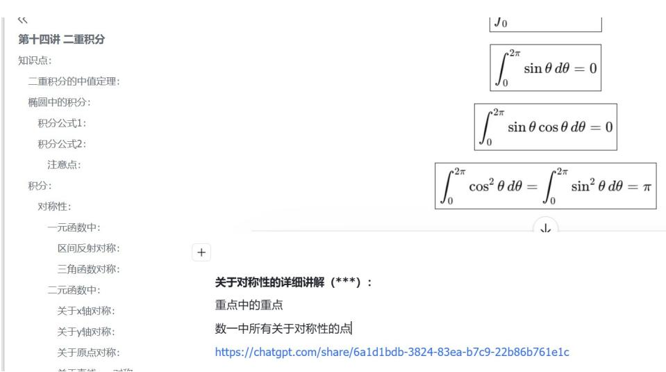

# 高数.docx

## 高数

## 知识点：

1. 一阶偏微分方程

2. 海塞矩阵

3.什么是瑕点

4. 反双曲正弦

5.

6.1000A 题中第十三讲第 13 题，涉及到 Hession 矩阵、二次型的内容，Euler 公式

7. 第十四讲中的图像形状涉及到二次型的内容

## 题目：

1.660P175 的例子 7

2.辅导讲义 P65

3.

15.（本题满分 12 分） $f(x)$ 在 $[-a, a] (a > 0)$ 上具有二阶连续导数，且 $f(0) = 0$ .

（1）写出 $f(x)$ 的带拉格朗日余项的一阶麦克劳林公式；

（2）证明：在 $[-a, a]$ 上至少存在一点 $\eta$ ，使 $a^3 f''(\eta) = 3\int_{-a}^{a} f(x) \mathrm{d}x$ .

4.

14.（本题满分12分）设函数 $f(x)$ 的定义域为 $(0, +\infty)$ 且满足 $2f(x) + x^2 f(\frac{1}{x}) = \frac{x^2 + 2x}{\sqrt{1 + x^2}}$

求 $f(x)$ ，并求曲线 $y = f(x), y = \frac{1}{2}, y = \frac{\sqrt{3}}{2}$ 及 $y$ 轴所围图形绕 $x$ 轴旋转所成旋转体的体积.

|（注：部分内容可能由 AI 生成）
