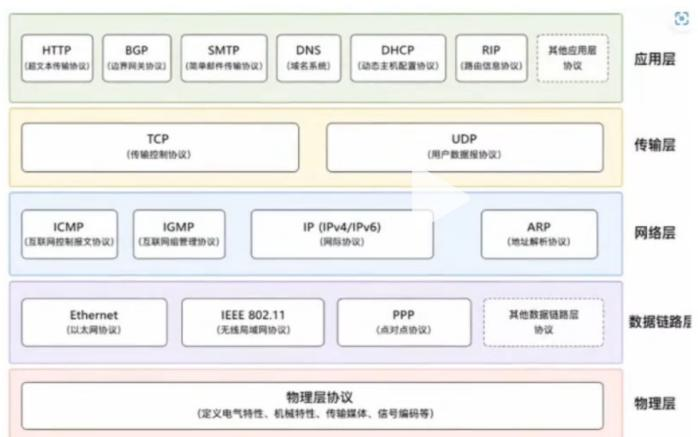
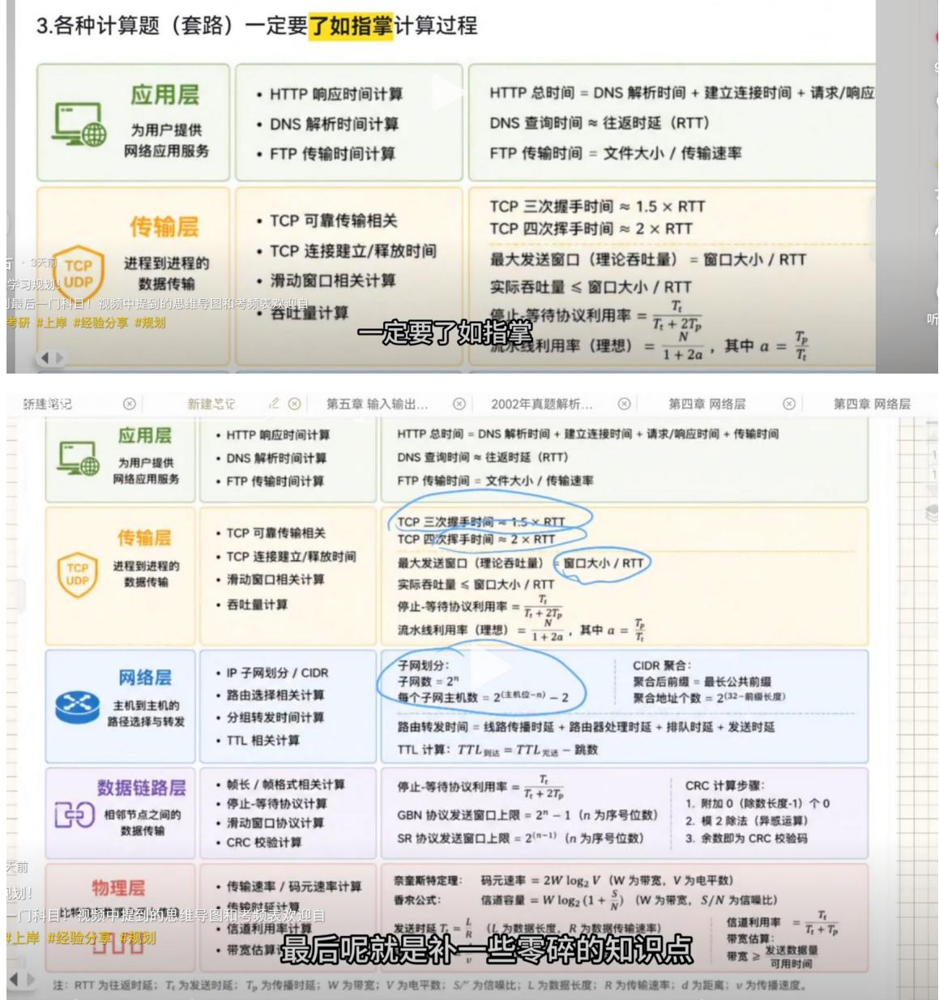

# 经验贴.docx — 图像索引

> 由 MinerU 结构化结果生成。题目若依赖树形、拓扑、流程、曲线、区域、时序或其他空间关系，应核对这里的原图，不要只依据 OCR 文本推断。

## 图 1

原文页码：1；bbox：`[400, 420, 442, 450]`

## 图 2

原文页码：1；bbox：`[400, 456, 442, 483]`

## 图 3

原文页码：1；bbox：`[401, 491, 440, 516]`

## 图 4

原文页码：1；bbox：`[400, 523, 440, 549]`

## 图 5

原文页码：1；bbox：`[400, 555, 442, 581]`

## 图 6

原文页码：1；bbox：`[329, 644, 751, 831]`

## 图 7

原文页码：2；bbox：`[147, 93, 848, 621]`
