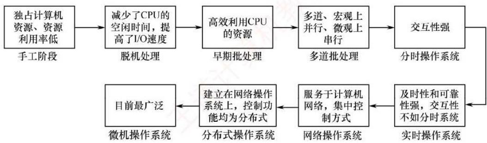

# 第一章 计算机系统概述.docx — 图像索引

> 由 MinerU 结构化结果生成。题目若依赖树形、拓扑、流程、曲线、区域、时序或其他空间关系，应核对这里的原图，不要只依据 OCR 文本推断。

## 图 1

原文页码：1；bbox：`[184, 332, 821, 464]`

**图注：** 图1.2 操作系统的发展历程

## 图 2

原文页码：16；bbox：`[801, 172, 823, 187]`

## 图 3

原文页码：23；bbox：`[776, 588, 794, 602]`

## 图 4

原文页码：26；bbox：`[781, 370, 801, 386]`

## 图 5

原文页码：27；bbox：`[779, 763, 796, 777]`

## 图 6

原文页码：27；bbox：`[776, 445, 794, 458]`

## 图 7

原文页码：27；bbox：`[800, 612, 818, 626]`
