# 第五章 输入输出管理.docx

# 第五章 输入输出管理

## 知识点：

## 5.1I/O 管理概述：

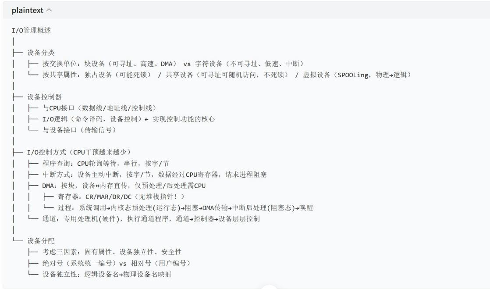

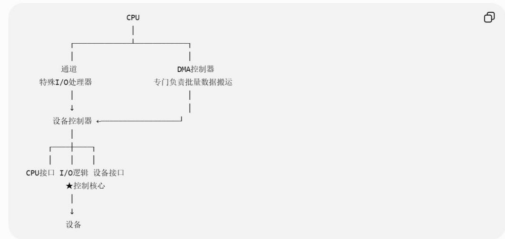

DMA传输则再单独接一条：

```txt
【DMA全过程】
P运行
|
| 系统调用
↓
CPU进入内核态
|
| 设置DMA地址、长度、方向
↓
DMA开始 → P阻塞
|
| 设备 ⇌ 主存批量传输
| CPU去运行别人
↓
DMA完成
|
| 中断CPU
↓
后处理
|
| 唤醒P
↓
P: 阻塞 → 就绪
```

https://chatgpt.com/g/g-p-6a4147b6a8088191bef869eb87bbe5c0-cao-zuo-xi-tong/c/6a8835db-ed68-83ee-80be-cf04b1ac522a

## 5.2 设备独立性软件:

## 缓冲区计算问题：

2. 缓冲区 (Buffer)

在设备管理子系统中，引入缓冲区的主要目的如下：

1）缓和 CPU 与 I/O 设备间速度不匹配的矛盾。

2）减少对 CPU 的中断频率，放宽对中断响应时间的限制。

3）解决基本数据单元大小（数据粒度）不匹配的问题。

4）提高 CPU 与 I/O 设备之间的并行性。

缓冲区的实现方法包括:

1）采用硬件缓冲器，但由于成本较高，除一些关键部位外一般不采用。

2）利用内存作为缓冲区，本节要介绍的正是由内存组成的缓冲区。

根据系统设置的缓冲区数量，缓冲技术可分为以下几种：

## (1) 单缓冲

当用户进程发出 I/O 请求时，操作系统在内存中为其分配一个缓冲区，其大小通常为一个数据块。如图 5.7 所示，在块设备输入过程中，假设设备将一块数据送入缓冲区的时间为 T，操作系统将缓冲区数据传送到用户工作区的时间为 M，CPU 处理该块数据的时间为 C。对于块设备，必须等整块数据装入缓冲区后，才能将其传送到工作区。

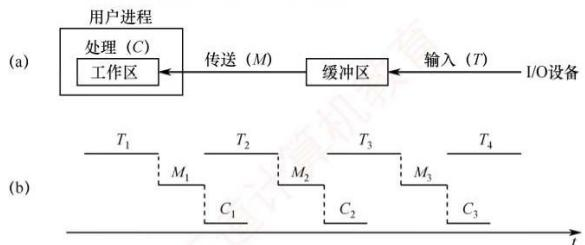  
图5.7 单缓冲工作示意图

在单缓冲中，设备向缓冲区写入数据的时间 T 可与 CPU 处理前一块数据的时间 C 并行。

当 T > C 时，设备向缓冲区填充数据的速度慢于 CPU 处理数据的速度。此时，CPU 在完成当前数据块的处理后，必须等待设备将下一块数据完整写入缓冲区；只有缓冲区装满后，操作系统才能将该数据块从缓冲区传送到用户工作区。处理每块数据所需的时间为 $T + M$ 。

当 T < C 时，设备填充缓冲区的速度快于 CPU 的处理速度。此时，缓冲区一旦装满，设备便无法继续写入新数据，必须等待 CPU 完成对当前工作区数据的处理；此后，操作系统才能将缓冲区中的数据移至工作区，从而释放缓冲区空间。处理每块数据所需的时间为 $C + M$ 。

## 综上，单缓冲处理每块数据所需的时间为 $\mathrm{Max}(T, C) + M$ 。

由于单缓冲区是共享资源，设备与 CPU 对其访问必须互斥。若 CPU 尚未取走缓冲区中的数据，即使设备已准备好新数据，也无法写入缓冲区，此时设备需等待 CPU 释放缓冲区。

## (2) 双缓冲

为了加快输入/输出速度，提高设备利用率，引入了双缓冲机制（也称缓冲对换）。如图 5.8 所示，当设备输入数据时，先将数据送入缓冲区 1；装满后，转向缓冲区 2 写入。此时，操作系统可从已满的缓冲区 1 中取出数据送入用户工作区，并由 CPU 进行处理。当缓冲区 1 的数据处理完后，若缓冲区 2 已装满，则操作系统切换到从缓冲区 2 中取数据送入用户工作区，而设备又可以开始向缓冲区 1 写入新数据。可见，双缓冲显著提高了设备与 CPU 的并行程度。

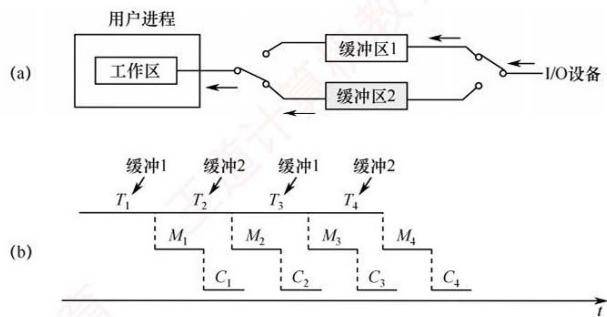  
图 5.8 双缓冲工作示意图

## 考点追踪 ▶ 双缓冲的工作时间的理解与计算（2011）

仍假设设备输入数据到缓冲区、数据传送到工作区和处理的时间分别为 T、M 和 C。在双缓冲中，设备向一个缓冲区写入数据的时间 T 可与操作系统传送及处理的时间 $C+M$ 并行。

当 $T > C + M$ 时，设备输入所需时间大于数据传送与处理的总时间。此时，设备可连续工作。假设在某一时刻，缓冲区 1 为空，缓冲区 2 已满：操作系统开始将缓冲区 2 的数据传送到工作区（耗时 M），CPU 随即处理该数据（耗时 C），同时设备向缓冲区 1 写入新数据。由于 $T > C + M$ ，当缓冲区 2 的数据处理完毕时，缓冲区 1 尚未装满，系统必须等待其装满后，才能将下一块数据从缓冲区 1 传送到工作区。处理每块数据所需的时间为 T。

当 $T < C + M$ 时，设备输入较快，CPU 无须等待设备。类似地，当缓冲区 1 为空、缓冲区 2 已满时：操作系统传送并处理缓冲区 2 的数据（共耗时 $C + M$ ），同时设备向缓冲区 1 写入数据。由于 $T < C + M$ ，缓冲区 1 很快装满，但系统仍需等待缓冲区 2 的数据完全处理完毕，才能切换至缓冲区 1 并传送其内容。处理每块数据所需的时间为 $C + M$ 。

## 综上，双缓冲处理每块数据的时间为 $Max(T, C+M)$ 。

在双机通信场景中，若要实现全双工通信（双方同时收发数据），每台机器需分别设置发送缓冲区和接收缓冲区。如图 5.9(b) 所示，A 机的发送缓冲区对应 B 机的接收缓冲区，反之亦然。若仅在每台机器中配置单一缓冲区 [见图 5.9(a)]，则无法同时进行发送与接收操作。

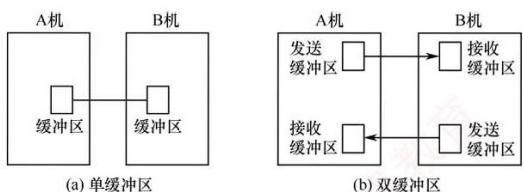  
图 5.9 双机通信时缓冲区的设置

## 7. 单缓冲和双缓冲放一起看，这是最重要的

<table><tr><td></td><td>单缓冲</td><td>双缓冲</td></tr><tr><td>缓冲区数量</td><td>1</td><td>2</td></tr><tr><td>T和C</td><td>可以并行</td><td>可以并行</td></tr><tr><td>T和M</td><td>不能并行</td><td>可以并行</td></tr><tr><td>原因</td><td>T、M抢同一个缓冲区</td><td>T、M访问不同缓冲区</td></tr><tr><td>CPU侧耗时</td><td>C与T并行,M单独</td><td>M+C整体与T并行</td></tr><tr><td>每块稳定处理时间</td><td>max(T,C)+M</td><td>max(T,M+C)</td></tr></table>

这个表建议直接记住，但更重要的是理解公式的位置：

单缓冲

$$
\boxed {\max (T, C) + M}
$$

为什么 $M$ 在 $\max$ 外？

T和M不能并行。

双缓冲

$\max (T,M + C)$

为什么 $M$ 跑进 $\max$ 里面了？

有两个缓冲区后，设备可以向一个缓冲区做T，同时操作系统从另一个缓冲区做M。

这就是两个公式最本质的区别。

最后还有一个408很容易挖坑的地方：这里说的“每块数据所需时间”通常指流水稳定后的平均/周期时间，不是“第一块数据从设备开始输入，到CPU处理结束”的完整延迟。第一块如果从系统全空开始，仍然要经历 $T \rightarrow M \rightarrow C$ ；双缓冲的优势是从后续数据开始把不同块的阶段重叠起来。

https://chatgpt.com/g/g-p-6a4147b6a8088191bef869eb87bbe5c0-cao-zuo-xi-tong/c/6a8a8af0-9c78-83e8-b8d9-d4b79cec3a35

## SPOOLing 技术:

输入

输入进程
↓
输入设备 → 输入缓冲区 → 输入井 → 用户程序
内存 磁盘

这里体现：

预输入

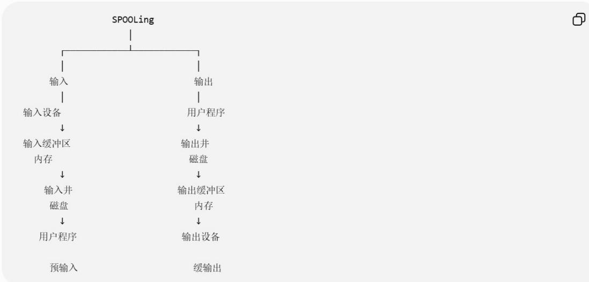  
https://chatgpt.com/g/g-p-6a4147b6a8088191bef869eb87bbe5c0-cao-zuo-xi-tong/c/6a8aa228-219c-83e8-b389-2b868885914e

这里体现：

因此：

## 5.3 磁盘和固态硬盘：

## 3. 引导块

计算机启动时需要运行一个初始化程序（称为自举程序），用于初始化 CPU、寄存器、设备控制器和内存等，随后加载并启动操作系统。为此，自举程序需定位磁盘上的操作系统内核，将其载入内存，并跳转至其入口地址，从而开始操作系统的执行。

自举程序通常存放于 ROM 中。为避免因修改自举代码而需更换 ROM 硬件的问题，一般仅在 ROM 中保留一个小型自举装入程序，而将功能完整的引导程序存放在磁盘的引导块中。该引导块位于磁盘的固定位置。含有引导块的磁盘称为启动磁盘或系统磁盘。

ROM 中的代码指示磁盘控制器将引导块读入内存并执行，后者可从指定位置加载操作系统内核并启动之。下面以 Windows 为例说明引导过程：Windows 允许将磁盘划分为多个分区，其中活动分区（引导分区）包含操作系统核心文件。系统将初始引导代码存储在磁盘第 0 号扇区，称为主引导记录（MBR）。启动时，ROM 中的代码首先读取 MBR；除引导代码外，MBR 还包含分区表和一个标志位，用于指明应从哪个分区引导，如图 5.21 所示。随后，系统读取该分区的首扇区（称为引导扇区），继续完成后续引导步骤，包括加载系统服务与驱动程序。

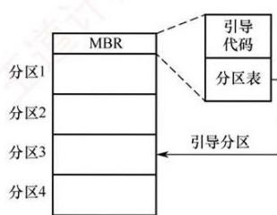  
图 5.21 Windows 磁盘的引导

## 十一、你可以把整个过程想成“找人接力”

这个类比非常适合记忆。

## 第一个人：ROM中的自举程序

只知道：
“磁盘入口在哪里。”
于是它找到MBR。
↓

## 第二个人：MBR

只知道：
“哪个分区是启动分区。”
于是它找到 活动分区。
↓

## 第三个人：活动分区引导扇区

知道：  
“真正的启动管理器/OS文件在哪里。”继续加载。

最后  
找到：  
操作系统内核  
把它搬进内存。  
然后：  
跳到内核入口

OS接管机器。

https://chatgpt.com/g/g-p-6a4147b6a8088191bef869eb87bbe5c0-cao-zuo-xi-tong/c/6a8c3b87-41d8-83e9-86e2-e740e8c59727

## 概念：

设备控制器和设备驱动程序：

## 一句话先定调

设备控制器是“硬件”（物理芯片），插在主板上或设备里；

设备驱动程序是“软件”（代码），装在操作系统里。

形象类比：设备控制器是“遥控器”，设备驱动程序是“遥控器的使用说明书”。

你拿着说明书（驱动程序），学会按哪个键（发指令），遥控器（控制器）才能把信号发出去，让空调（设备）开始工作。

用这个例子来拆解概念

<table><tr><td>概念</td><td>在例子中的角色</td><td>本质</td><td>存储位置</td></tr><tr><td>设备(键盘)</td><td>产生原始信号</td><td>物理硬件</td><td>在机箱外</td></tr><tr><td>设备控制器(键盘控制器)</td><td>把物理信号变成标准数据,向CPU发中断</td><td>硬件芯片(集成在键盘内或主板上)</td><td>硬件</td></tr><tr><td>设备驱动程序(键盘驱动)</td><td>解读控制器发来的数据,告诉操作系统“这是什么意思”</td><td>软件代码</td><td>操作系统内核(硬盘上,开机加载到内存)</td></tr></table>

设备控制器处理的是“物理信号→标准数据”的转换；  
设备驱动程序处理的是“标准数据 $\rightarrow$ 操作系统能理解的事件”的转换。

## 设备控制器 vs 设备驱动程序（完整对比表）

<table><tr><td>对比维度</td><td>设备控制器</td><td>设备驱动程序</td></tr><tr><td>本质</td><td>硬件(电路芯片)</td><td>软件(代码)</td></tr><tr><td>物理位置</td><td>插在主板上/集成在设备内部</td><td>存储在硬盘上,运行时加载到内存</td></tr><tr><td>谁制造的</td><td>设备厂商(硬件部分)</td><td>设备厂商(软件部分)/操作系统开发者</td></tr><tr><td>和CPU的关系</td><td>CPU通过I/O端口、中断、DMA与它通信</td><td>CPU以进程身份执行驱动代码</td></tr><tr><td>主要功能</td><td>1接收设备发出的电信号,转成数据2把CPU发来的命令转成设备能理解的电信号3向CPU发送中断信号</td><td>1解释设备控制器的数据格式2把通用I/O请求(如read)转换成控制器能执行的命令3初始化设备、处理错误</td></tr><tr><td>操作系统“看得见”吗?</td><td>×操作系统不直接操作控制器(通过驱动程序)</td><td>√操作系统内核直接加载和管理它</td></tr><tr><td>更换设备需要换什么?</td><td>更换硬件本身(比如换一块新网卡)</td><td>必须安装对应的新驱动程序(旧驱动不能用)</td></tr><tr><td>举例</td><td>键盘控制器、磁盘控制器(IDE/SATA控制器)、USB控制器、网卡控制器</td><td>键盘驱动、NVMe驱动、USB驱动、网卡驱动</td></tr></table>

## 设备独立性软件和设备驱动程序：

【易混概念辨析】设备独立性软件 vs 设备驱动程序  
这是 16、17 题共同的核心，也是 408 高频易错点：

<table><tr><td colspan="3">表格</td></tr><tr><td>对比维度</td><td>设备独立性软件</td><td>设备驱动程序</td></tr><tr><td>本质</td><td>所有设备的公共操作层</td><td>具体设备的&quot;翻译官+执行者&quot;</td></tr><tr><td>是否与设备相关</td><td>无关,对所有设备统一</td><td>每类设备一个,因设备而异</td></tr><tr><td>核心动作</td><td>映射、保护、缓冲、分配、翻译系统调用参数、选择驱动</td><td>写设备寄存器、启动设备、检查状态</td></tr><tr><td>面向对象</td><td>上层应用程序(提供统一接口)</td><td>下层设备控制器(硬件)</td></tr><tr><td>知道寄存器格式吗</td><td>不知道</td><td>知道(这是它存在的意义)</td></tr><tr><td>类比</td><td>医院分诊台:根据病情(设备类型)分配到对应科室(驱动)</td><td>专科医生:具体操作器械(寄存器)治病</td></tr><tr><td>408 常见陷阱</td><td>把&quot;写寄存器&quot;归给它</td><td>把&quot;翻译系统调用参数/统一接口&quot;归给它</td></tr></table>

## I/O 完成:

## √ 一句话先定调

"I/O 完成后"指的是：设备已经完成了 CPU 交给它的数据传输任务（比如已经读完了数据、已经写完了数据），并且通过中断通知了 CPU。

在此之前是“I/O 进行中”，在此之后是“I/O 已完成”。

## 一条完整的时间线（看清楚“完成后”在哪）

$$
\begin{array}{r l}&\text {text}\\&\text {时间轴:}\\&\mathrm{CPU发命令} \rightarrow \text {设备开始工作} \rightarrow \text {设备工作中} \rightarrow \text {设备完成} \rightarrow \text {设备发中断} \rightarrow \mathrm{CPU响应中断} \rightarrow \text {中断处理程序执行}\\&\uparrow \quad \uparrow \quad \uparrow\\&\text {此时是“启动”} \quad \text {此时是“进行中”} \quad \text {此时是“已完成”}\end{array}
$$

“I/O 完成后” = 设备已经干完活了，正在等 CPU 来“验收”和“收尾”。

## 一张表彻底分清

<table><tr><td>时间点</td><td>做的事情</td><td>谁做的</td><td>读还是写</td><td>寄存器类型</td></tr><tr><td>I/O 开始前</td><td>设置传输参数(地址、长度等)</td><td>驱动程序</td><td>写</td><td>MAR、DC、CR</td></tr><tr><td>I/O 开始</td><td>写入“启动”命令</td><td>驱动程序</td><td>写</td><td>CR</td></tr><tr><td>I/O 进行中</td><td>设备自己干活,CPU 干别的</td><td>—</td><td>—</td><td>—</td></tr><tr><td>I/O 完成后(中断响应)</td><td>读取状态,确认是否成功</td><td>中断处理程序</td><td>读</td><td>CR(状态寄存器)</td></tr><tr><td>I/O 完成后(取数据)</td><td>从数据寄存器读数据到内存</td><td>中断处理程序</td><td>读</td><td>DR</td></tr></table>

## 为什么这个区分很重要？

因为408经常考“设备驱动程序和中断处理程序分别做什么”的归属题。

<table><tr><td>常见说法</td><td>正确归属</td></tr><tr><td>“向设备寄存器写命令”</td><td>驱动程序(启动I/O)</td></tr><tr><td>“检查设备是否就绪”</td><td>驱动程序(启动前检查)</td></tr><tr><td>“I/O完成后判断是否出错”</td><td>中断处理程序(验收)</td></tr><tr><td>“从数据寄存器读取数据”</td><td>中断处理程序(收尾)</td></tr></table>

一句话记忆法：

\- 写命令 = 驱动（启动）

\- 读状态 / 读数据 = 中断处理程序（收尾）

驱动程序是“下令的”，中断处理程序是“验货的”。

## SPOOLing:

## √ 一句话定义

SPOOLing（Simultaneous Peripheral Operations On-Line，外部设备联机操作）是一种将独占设备（如打印机）虚拟成共享设备的技术。它利用高速磁盘作为中间缓冲区，让多个用户进程可以“同时”向物理设备提交任务，而不需要等待物理设备就绪。

简单说：SPOOLing = 用磁盘模拟脱机 I/O，把一台独占设备变成多台逻辑设备。

## 最经典的应用：假脱机打印

在引入 SPOOLing 之前，多个进程打印文件是这样的：

<div class="mineru-algorithm" style="white-space: pre-wrap; font-family:monospace;">
text  
进程A：开始打印 $\rightarrow$ 占住打印机 $\rightarrow$ 打印完成 $\rightarrow$ 释放打印机  
进程B：等待 $\rightarrow$ 等待 $\rightarrow$ 等A完成 $\rightarrow$ 开始打印 $\rightarrow$ ...
</div>

复制 下载

问题：打印机速度很慢，CPU和内存都要等它，系统效率极低。

引入 SPOOLing 之后，流程变成这样：

<div class="mineru-algorithm" style="white-space: pre-wrap; font-family:monospace;">
text  
进程A：把打印数据写入磁盘“输出井” $\rightarrow$ 立即返回，继续执行  
进程B：把打印数据写入磁盘“输出井” $\rightarrow$ 立即返回，继续执行  
进程C：同样操作...  
↓  
后台打印守护进程：从输出井中取出任务，按顺序驱动物理打印机输出
</div>

复制 下载

效果：每个进程都感觉自己独占了一台打印机（因为它提交任务后就走了，不需要等待真正的打印完成）。实际上只有一台物理打印机，但逻辑上同时存在多台“虚拟打印机”。

## SPOOLing 系统的组成部分

一个完整的 SPOOLing 系统由三部分组成:

<table><tr><td>组件</td><td>作用</td><td>位置</td></tr><tr><td>输入井/输出井</td><td>在磁盘上开辟的专用存储区,暂存输入/输出数据</td><td>磁盘</td></tr><tr><td>输入缓冲区/输出缓冲区</td><td>在内存中开辟的临时存储区,用于数据的中转</td><td>内存</td></tr><tr><td>输入进程/输出进程</td><td>后台守护进程,负责在设备与磁盘之间搬运数据</td><td>操作系统内核</td></tr></table>

关键：SPOOLing依赖磁盘作为高速缓冲，是所有操作的基础。

## SPOOLing 的工作流程（以打印为例）

```txt
text  
用户进程执行 write(fd, ...) 写入打印数据  
↓  
数据不直接送往打印机，而是由输出进程写入磁盘的“输出井”  
↓  
进程继续执行，不需要等待物理打印  
↓  
后台输出进程监控输出井，当有任务时，从输出井读取数据  
↓  
输出进程把数据从输出井搬到物理打印机（在真正打印时占用设备）  
↓  
打印完成，释放物理打印机，继续处理下一个任务
```

复制 下载

用户进程只与磁盘交互，不与物理设备交互。物理设备由后台进程独占。

vs SPOOLing vs 普通缓冲 (408 常考对比)

<table><tr><td>对比维度</td><td>普通缓冲区 (Buffer)</td><td>SPOOLing</td></tr><tr><td>存储位置</td><td>内存(一般较小)</td><td>磁盘(一般较大)</td></tr><tr><td>数据流向</td><td>设备  $\leftrightarrow$  内存</td><td>设备  $\leftrightarrow$  磁盘输出井  $\leftrightarrow$  内存</td></tr><tr><td>是否改变设备属性</td><td>✗ 不改变(设备仍是独占)</td><td>√ 把独占设备变成共享设备</td></tr><tr><td>典型应用</td><td>键盘输入缓冲、磁盘高速缓冲</td><td>打印机假脱机、远程作业输入</td></tr><tr><td>对用户进程的影响</td><td>进程仍需等待I/O完成</td><td>进程提交任务后立即返回</td></tr></table>

## 四、把SPOOLing的高频判断压缩成一张表

<table><tr><td colspan="2">以后遇到类似题可以直接判断:</td></tr><tr><td>说法</td><td>判断</td></tr><tr><td>输入井、输出井在磁盘</td><td>✓</td></tr><tr><td>输入/输出缓冲区在内存</td><td>✓</td></tr><tr><td>需要外存支持</td><td>✓</td></tr><tr><td>需要多道程序设计</td><td>✓</td></tr><tr><td>将独占设备虚拟为共享设备</td><td>✓</td></tr><tr><td>提高独占设备利用率</td><td>✓</td></tr><tr><td>用户进程真正获得了物理打印机</td><td>×</td></tr><tr><td>用户进程直接控制打印机</td><td>×</td></tr><tr><td>输入/输出进程模拟外围控制机</td><td>✓</td></tr><tr><td>SPOOLing 必须真的有外围机</td><td>×</td></tr></table>

## 通道：

## √ 一句话定义

通道（Channel）是一种专门负责输入/输出控制的专用处理器，它执行存储在内存中的“通道程序”，独立完成I/O操作，并在完成后向CPU发出中断信号。

简单说：通道是“I/O专用小CPU”，它专门负责管理设备之间的数据搬运，让主CPU从I/O任务中彻底解放出来。

## 通道的具体工作流程

text

复制 下载

1. CPU 在内存中准备好“通道程序”
(通道程序 = 一组 I/O 指令，包含：设备号、数据地址、传输长度、操作码等)
↓

2. CPU 执行一条 I/O 指令，告诉通道：“通道程序在内存的 0x1000 位置，你去执行吧”

3. 通道收到指令，独立开始工作：

\- 从内存读取通道程序

\- 逐条执行：控制设备、传输数据、检查状态

\- 可以同时控制多个设备（分时交叉执行）

4. 通道完成全部任务后，向CPU发送中断信号

5. CPU响应中断，检查I/O结果

关键：CPU只参与“开始”（发一条I/O指令）和“结束”（响应中断），中间的整个复杂I/O过程全部由通道自主完成。

## vs 通道 vs DMA (408 常考对比)

<table><tr><td>对比维度</td><td>DMA 方式</td><td>通道方式</td></tr><tr><td>本质</td><td>硬件控制器</td><td>专用处理器(有独立指令集)</td></tr><tr><td>可编程性</td><td>✕ 固定功能,一次设置只做一件事</td><td>✓ 可执行复杂的“通道程序”</td></tr><tr><td>能控制多少个设备</td><td>通常 1 个设备</td><td>可同时控制 多个设备</td></tr><tr><td>任务复杂度</td><td>单次、单步的数据块传输</td><td>复杂的、多步骤的 I/O 任务</td></tr><tr><td>CPU 干预频率</td><td>每个数据块传输开始/结束时需要干预</td><td>整个任务完成时才需要干预</td></tr><tr><td>指令集</td><td>无(靠寄存器配置)</td><td>有专门的通道指令集</td></tr><tr><td>典型应用</td><td>PC 上的磁盘 I/O</td><td>大型机、服务器、高性能存储系统</td></tr></table>

## DMA:

DMA 控制器的四类寄存器

<table><tr><td colspan="4">表格</td></tr><tr><td>缩写</td><td>全称</td><td>中文</td><td>作用</td></tr><tr><td>CR</td><td>Command/Status Register</td><td>命令 / 状态寄存器</td><td>接收 CPU 发来的 I/O 命令,反映设备当前状态(如忙、就绪、出错等)</td></tr><tr><td>MAR</td><td>Memory Address Register</td><td>内存地址寄存器</td><td>存放数据在内存中的起始地址;每传一个字自动加 1</td></tr><tr><td>DR</td><td>Data Register</td><td>数据寄存器</td><td>暂存单次传输的数据单元(如一个字),作为设备与内存之间的缓冲</td></tr><tr><td>DC</td><td>Data Counter</td><td>数据计数器</td><td>记录本次需要传送的字(节)总数;每传一个字自动减 1,减到 0 时向 CPU 发中断</td></tr></table>

## 【知识地图】

<table><tr><td>plaintext
plaintext
plaintext
pre处理(CPU/软件)
    驱动程序设置MAR(内存地址)、DC(传送字数)、CR(读/写命令)
    启动设备
    请求进程阻塞,CPU调度其他进程
数据传送(DMA控制器/硬件)
    DMA控制器申请并接管系统总线
    设备 ↔ 内存 直接传送整块数据(不经过CPU)
    每传一个字,DC减1,MAR加1
    DC减到0,传送结束
后处理(中断/硬件+软件)
    DMA控制器向CPU发中断请求(硬件)
    CPU响应中断(硬件自动保存断点、切内核态)
    CPU执行&quot;DMA结束&quot;中断服务程序(软件)
    读取状态寄存器,检查是否出错
    唤醒等待该I/O的进程
    释放DMA资源
    中断返回(可能发生进程调度)</td></tr></table>

## CPU 中用于对比的寄存器

<table><tr><td colspan="4">表格</td></tr><tr><td>缩写</td><td>全称</td><td>中文</td><td>作用</td></tr><tr><td>PC</td><td>Program Counter</td><td>程序计数器</td><td>存放下一条要执行指令的地址,取指后自动递增</td></tr><tr><td>IR</td><td>Instruction Register</td><td>指令寄存器</td><td>存放当前正在执行的指令,经译码后产生控制信号</td></tr><tr><td>PSW</td><td>Program Status Word</td><td>程序状态字寄存器</td><td>存放处理器状态标志(如进位 CF、零标志 ZF、溢出 OF、中断允许位等)</td></tr></table>

## 中断与 DMA:

【易混概念辨析】中断方式 vs DMA 方式的数据传送

这题和前面的20题、21题直接相关，帮你把两种方式彻底分清：

<table><tr><td>对比维度</td><td>中断驱动方式</td><td>DMA 方式</td></tr><tr><td>传送单位</td><td>一个字(字节)</td><td>一个数据块</td></tr><tr><td>数据通路</td><td>设备→CPU 寄存器→内存</td><td>设备↔内存,直接通路,不经过 CPU</td></tr><tr><td>CPU 干预频率</td><td>每个字 / 字节中断一次</td><td>整块传完才中断一次</td></tr><tr><td>数据传送谁做</td><td>中断处理程序(软件,CPU 执行 I/O 指令)</td><td>DMA 控制器(硬件,接管总线)</td></tr><tr><td>并行程度</td><td>CPU 与设备并行(传一个字的过程中)</td><td>CPU 与设备并行程度更高(整块传送期间 CPU 完全不碰)</td></tr><tr><td>中断次数</td><td>每个字一次</td><td>一块一次</td></tr><tr><td>适用设备</td><td>字符设备(键盘、打印机)</td><td>块设备(磁盘)</td></tr><tr><td>进程何时阻塞</td><td>启动 I/O 后</td><td>初始化 DMA 后</td></tr><tr><td>进程何时唤醒</td><td>每次中断处理时</td><td>DMA 完成中断处理时</td></tr></table>

【硬件 vs 软件分工】(DMA 全过程)

<table><tr><td>步骤</td><td>动作</td><td>硬件 / 软件</td><td>具体执行者</td></tr><tr><td>2</td><td>设置 MAR、DC、CR 寄存器</td><td>软件</td><td>CPU 执行驱动程序代码</td></tr><tr><td>2</td><td>启动磁盘</td><td>软件</td><td>CPU 写命令寄存器</td></tr><tr><td>2</td><td>进程阻塞、调度其他进程</td><td>软件</td><td>操作系统调度程序</td></tr><tr><td>3</td><td>DMA 控制器申请总线</td><td>硬件</td><td>DMA 控制器</td></tr><tr><td>3</td><td>磁盘→内存直接数据传送</td><td>硬件</td><td>DMA 控制器(周期窃取 / 突发传输)</td></tr><tr><td>3</td><td>DC 自动减 1,直到为 0</td><td>硬件</td><td>DMA 控制器</td></tr><tr><td>1</td><td>传送完成,发中断信号</td><td>硬件</td><td>DMA 控制器</td></tr><tr><td>4</td><td>CPU 响应中断、保存断点</td><td>硬件</td><td>CPU 中断机制</td></tr><tr><td>4</td><td>执行 DMA 结束中断服务程序</td><td>软件</td><td>CPU 执行 ISR(检查错误、唤醒进程)</td></tr><tr><td>4</td><td>中断返回、调度</td><td>软件</td><td>操作系统</td></tr></table>

记忆要点：DMA中"数据传送"这件事本身是纯硬件完成的（DMA控制器接管总线），CPU只在"开头设置"和"结尾收尾"时介入。

## DCT、COCT、CHCT、SDT:

## √ 一句话定义

DCT（Device Control Table，设备控制表）是操作系统为每个物理设备维护的一张数据结构，用于记录该设备的状态、属性以及等待使用该设备的进程队列等信息。

简单说：DCT是“每台设备在操作系统里的身份证+状态记录卡”。

## 1. SDT (System Device Table, 系统设备表)

<table><tr><td>属性</td><td>说明</td></tr><tr><td>数量</td><td>整个系统1张</td></tr><tr><td>作用</td><td>记录系统中所有设备的入口信息,是整个设备管理的“总索引”</td></tr><tr><td>典型字段</td><td>设备名、设备类型、指向DCT的指针</td></tr><tr><td>谁查它?</td><td>设备分配程序(根据逻辑设备名,找到对应的物理设备和DCT)</td></tr></table>

SDT 是设备分配的“起点”——先查 SDT，再顺着指针往下走。

## 2. COCT (Controller Control Table, 控制器控制表)

<table><tr><td>属性</td><td>说明</td></tr><tr><td>数量</td><td>每个设备控制器1张</td></tr><tr><td>作用</td><td>记录每个控制器的状态(忙/闲)、等待队列,以及它连接的上层通道信息</td></tr><tr><td>典型字段</td><td>控制器标识、控制器状态(忙/闲)、指向CHCT的指针、等待队列指针</td></tr><tr><td>谁查它?</td><td>设备分配程序(分配完设备后,继续检查对应的控制器是否空闲)</td></tr></table>

COCT 是设备分配的“第二关”——设备空闲还不够，对应的控制器也必须空闲。

## 3. CHCT (Channel Control Table, 通道控制表)

<table><tr><td>属性</td><td>说明</td></tr><tr><td>数量</td><td>每个通道1张</td></tr><tr><td>作用</td><td>记录每个通道的状态(忙/闲)、通道类型(字节多路/选择/数组多路)、等待队列</td></tr><tr><td>典型字段</td><td>通道标识、通道状态、通道类型、指向COCT的指针、等待队列指针</td></tr><tr><td>谁查它?</td><td>设备分配程序(分配完控制器后,继续检查对应的通道是否空闲)</td></tr></table>

CHCT是设备分配的“第三关”——设备、控制器都空闲还不够，通道也必须空闲。

复制 下载

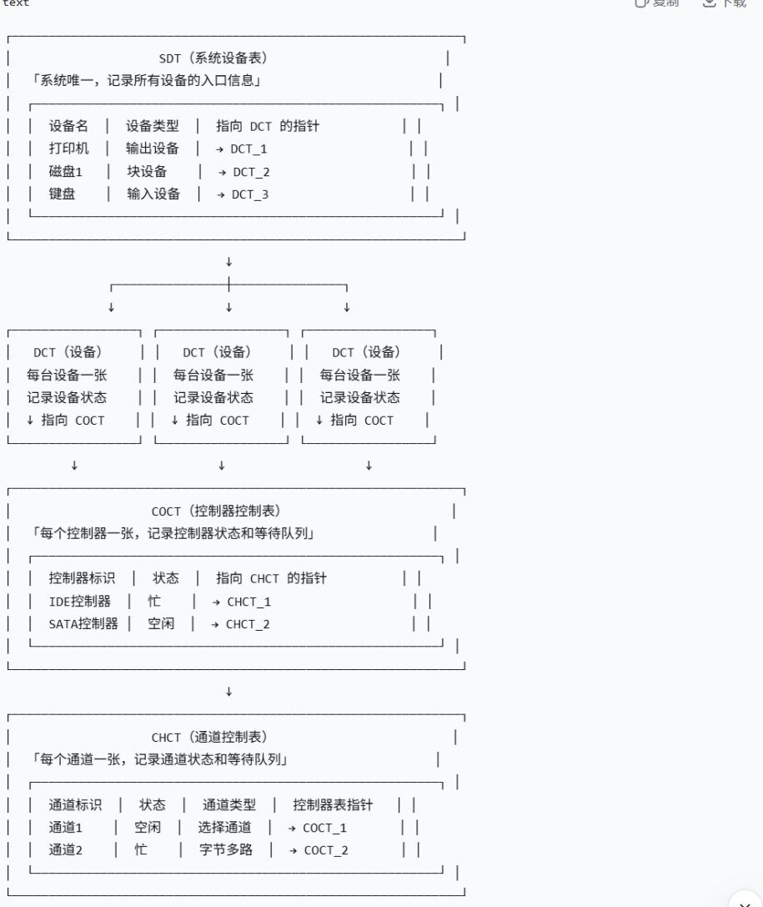

## 设备的独立性：

“设备的独立性”这个词很容易误解。你先记最核心的一句话：

设备独立性（设备无关性）= 用户程序使用设备时，不需要知道最终到底用了哪一台具体的物理设备。程序只提出“我要某一类设备”，至于具体分配哪台，由操作系统决定。王道2027操作系统\_OCR

王道对它的表述就是：应用程序使用逻辑设备名进行 I/O 操作，而不指定具体的物理设备；操作系统运行时再完成二者的映射。☐ 王道2027操作系统\_OCR

## 2. 两个名词一定要分清

<table><tr><td>名称</td><td>谁主要使用</td><td>含义</td></tr><tr><td>逻辑设备名</td><td>用户程序</td><td>抽象的设备,如&quot;printer&quot;</td></tr><tr><td>物理设备名</td><td>操作系统</td><td>真正具体的设备,如&quot;打印机3号&quot;</td></tr></table>

为实现设备独立性，系统需要建立：

## 逻辑设备名 $\rightarrow$ 物理设备名

的映射。王道这里进一步介绍了一张 LUT（Logical Unit Table，逻辑设备表），其中可以记录逻辑设备名、物理设备名和相应驱动程序入口。☐ 王道2027操作系统\_OCR

你可以脑补成：

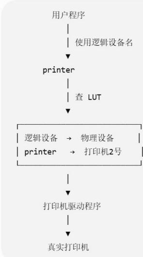

https://chatgpt.com/g/g-p-6a4147b6a8088191bef869eb87bbe5c0-cao-zuo-xi-tong/c/6a8a9b62-bf88-83e8-9c21-d843723865d7

## 外围机：

## √ 一句话定义

外围机（Peripheral Computer）是指在早期计算机系统中，专门负责输入/输出操作的辅助计算机\*\*。它独立于主机（主CPU）之外，用来完成数据从低速设备（如纸带机、卡片机）到高速设备（如磁带）之间的传输，从而让主机专注于计算任务。

简单说：外围机是主机的“I/O助理”，专门帮主机搬运数据，让主机不用等慢速设备。

## 输入井和输出井：

## √ 一句话定义

输入井和输出井是操作系统在磁盘上开辟的两个专用存储区域，用于暂存输入/输出数据，作为低速 I/O 设备与高速 CPU 之间的缓冲地带。

<table><tr><td>名称</td><td>用途</td><td>数据流向</td></tr><tr><td>输入井</td><td>暂存从输入设备(如键盘、扫描仪)读入的数据,供进程读取</td><td>输入设备 → 输入井 → 进程</td></tr><tr><td>输出井</td><td>暂存从进程输出的数据,等待输出设备(如打印机)处理</td><td>进程 → 输出井 → 输出设备</td></tr></table>

简单说：输入井和输出井是磁盘上的两个“大仓库”，一个用来暂存“还没被进程取走的输入数据”，一个用来暂存“还没被设备输出的输出数据”。

## 输入井和输出井在 SPOOLing 中的完整流程

输入井（输入方向）

```txt
text
输入设备（键盘/读卡器）
↓
输入缓冲区（内存）
↓
【输入井】（磁盘） ← 数据暂存在这里
↓
输入缓冲区（内存）
↓
用户进程（read 读取数据）
```

输出井（输出方向）

```txt
text
用户进程 (write 输出数据)
↓
输出缓冲区（内存）
↓
【输出井】(磁盘) ← 数据暂存在这里
↓
输出缓冲区（内存）
↓
输出设备（打印机/显示器）
```

VS 输入井/输出井 vs 普通缓冲区

<table><tr><td>对比维度</td><td>普通缓冲区(Buffer)</td><td>输入井/输出井</td></tr><tr><td>存储位置</td><td>内存(速度快、容量小)</td><td>磁盘(速度慢、容量大)</td></tr><tr><td>数据驻留时间</td><td>短暂(几毫秒到几秒)</td><td>较长(可能数分钟到数小时)</td></tr><tr><td>容量</td><td>小(KB级别)</td><td>大(MB/GB级别)</td></tr><tr><td>作用</td><td>缓解CPU与I/O设备之间的速度差异</td><td>实现脱机I/O模拟,让独占设备变成共享设备</td></tr><tr><td>谁管理</td><td>操作系统内存管理模块</td><td>SPOOLing系统(输入/输出进程)</td></tr></table>

## 题：

## 题1:

01. 下列关于设备属性的叙述中，正确的是（）。  
A. 字符设备的基本特征是可寻址到字节，即能指定读/写操作的字节地址  
B. 共享设备必须是可寻址的和可随机访问的设备  
C. 共享设备是指同一时刻内允许多个进程同时访问的设备  
D. 在分配共享设备和独占设备时都可能引起进程死锁

B 选项说 "共享设备必须是可寻址的和可随机访问的"——这是王道的明确结论。为什么？因为多个进程交替访问同一个设备时，如果不能随机访问，后一个进程的数据就可能接在前一个进程后面，无法保证数据的完整性和一致性。磁盘之所以能成为共享设备，正是因为它可以随机访问任意扇区。

⑤ 逐项分析：

\- A 错误：“可寻址到字节”是块设备的基本特征，不是字符设备的。字符设备（如键盘、打印机）恰恰是不可寻址的——你不能对键盘说“请给我第100个字节”，它只能按顺序一个字符一个字符地传。A把块设备的特征安到了字符设备头上。

\- B 正确：如上分析。

\- C 错误：这是最容易错的选项。注意王道原文的措辞是 "一段时间内允许多个进程同时访问"，而不是"同一时刻内"。共享设备在物理上同一时刻仍然只有一个进程在访问（磁盘的磁头在同一时刻只能为一个请求服务），只是在一个时间段内多个进程分时交替使用。"同一时刻" 和 "一段时间内" 是这道题的题眼。

\- D 错误：分配独占设备可能引起死锁（如两个进程互相持有对方需要的打印机），但分配共享设备不会引起死锁——因为共享设备可以被多个进程同时（一段时间内）使用，不存在“占有并等待”的条件。

⑥ 错因诊断：这道题的典型错误是选 C，属于 B. 相似概念混淆——把 "一段时间内的并发访问" 和 "同一时刻的同时访问" 混为一谈。另外选 A 的属于 A. 概念没理解——没记住字符设备不可寻址。

⑦举一反三：如果题目把 C 改成 "共享设备是指在一段时间内允许多个进程同时访问的设备"，那 C 就对了。命题人特别喜欢在 "同一时刻" 和 "一段时间" 上做文章，看到共享设备就要条件反射地检查这个词。

## 02. 下列关于虚拟设备的含义的描述中，正确的是（）

A. 允许用户使用比系统中具有的物理设备更多的设备  
B. 允许用户以标准化方式来使用物理设备  
C. 把一个物理设备变换成多个对应的逻辑设备  
D. 允许用户程序不必全部装入主存便可使用系统中的设备

王道原文："虚拟设备是指采用虚拟技术将一台独占设备转换为若干逻辑设备。"

关键词有两个：

\- 物理设备→逻辑设备：虚拟设备不是物理上把一台设备变成多台，而是在逻辑上让用户“感觉”有多个设备。

\- 通过 SPOOLing 技术实现：用高速共享设备（磁盘）做缓冲区，把独占设备（打印机）改造成可以被多个进程 "同时" 使用的逻辑设备。
⑤ 逐项分析：

\- A 错误："使用比物理设备更多的设备"——这是一种表面现象的描述，不是虚拟设备的本质定义。虚拟设备的核心是 "变换"（物理 $\rightarrow$ 逻辑），而不是简单的 "数量变多"。

\- B 错误："以标准化方式使用物理设备"描述的是设备独立性/统一接口的概念，和虚拟设备无关。

\- C 正确："把一个物理设备变换成多个对应的逻辑设备"——这是王道的原话，精确命中虚拟设备的本质。

\- D 错误："不必全部装入主存"描述的是虚拟存储 / 覆盖技术，和虚拟设备完全是两个概念。这是用 "虚拟" 这个词来混淆你。

⑥ 错因诊断：这道题容易选 A，属于 B. 相似概念混淆——把 "虚拟" 理解成了 "数量变多"，而没有抓住 "物理→逻辑" 这个本质。也可能选 D，属于 G. 对系统运行过程理解错误——把虚拟存储和虚拟设备搞混了。

⑦ 举一反三：记住一句话——虚拟设备 = SPOOLing = 独占设备物理上还是一台，逻辑上变成多台。以后看到 "虚拟设备" 直接往这个方向想。

## D是什么？

“不必全部装入主存”明显在描述：

虚拟存储器

和虚拟设备完全不是一个“虚拟”。

所以这里尤其要防止：

虚拟存储器 ≠ 虚拟设备

05. 在设备控制器中用于实现设备控制功能的是（）

A.CPU  
B.设备控制器与处理器的接口  
C.I/O逻辑  
D.设备控制器与设备的接口

王道图5.1给出了设备控制器的三部分：

<table><tr><td colspan="2">plaintext</td></tr><tr><td colspan="2">CPU  $\leftrightarrow$  [与CPU的接口]  $\leftrightarrow$  [I/O逻辑]  $\leftrightarrow$  [与设备的接口]  $\leftrightarrow$  设备</td></tr></table>

<table><tr><td>组成部分</td><td>功能</td></tr><tr><td>与CPU的接口</td><td>实现CPU与控制器之间的通信(数据线、地址线、控制线)</td></tr><tr><td>I/O逻辑</td><td>实现对设备的控制:对I/O命令译码、识别目标设备、发出控制信号</td></tr><tr><td>与设备的接口</td><td>控制器与具体设备之间的接口,传输数据/控制/状态信号</td></tr></table>

题目问的是 "用于实现设备控制功能" 的部件，这正是 I/O 逻辑的职责——它接收 CPU 发来的命令，进行译码，然后控制具体设备工作。
⑤ 逐项分析：

\- A 错误：CPU 不在设备控制器内部，它是控制器的 "上级"。

\- B 错误："与处理器的接口" 只负责通信（传信号），不负责控制设备本身。它是 "传令兵"，不是 "指挥官"。

\- C 正确：I/O 逻辑是控制器的 "大脑"，负责命令译码和设备控制。

\- D 错误："与设备的接口" 负责和设备传输信号，但它是 "执行者"，控制命令来自 I/O 逻辑。

07. 在操作系统中，（）指的是一种硬件机制。  
A. 通道技术  
B. 缓冲池  
C. SPOOLing 技术  
D. 内存覆盖

## ③ 正确答案：A

④ 核心推理：

王道原文："通道是一种特殊的处理器，所以属于硬件技术。SPOOLing、缓冲池、内存覆盖都是在内存的基础上通过软件实现的。"

<table><tr><td>技术</td><td>硬件 / 软件</td><td>说明</td></tr><tr><td>通道技术</td><td>硬件</td><td>通道是一种专用处理机(物理硬件),能执行通道程序</td></tr><tr><td>缓冲池</td><td>软件</td><td>在内存中开辟的缓冲区,由操作系统管理</td></tr><tr><td>SPOOLing 技术</td><td>软件</td><td>用磁盘做缓冲的软件技术(假脱机)</td></tr><tr><td>内存覆盖</td><td>软件</td><td>早期的内存扩充技术,纯软件实现</td></tr></table>

## ⑤ 逐项分析：

\- A 正确：通道是物理上存在的专用处理器（硬件），和 DMA 控制器一样属于硬件机制。

\- B 错误：缓冲池是操作系统在内存中划分的区域，由软件管理。

\- C 错误：SPOOLing 是 "假脱机"，本质是用磁盘（高速共享设备）模拟独占设备的软件技术。

\- D 错误：内存覆盖是解决内存不足的软件技术，把程序分段，需要时调入。

⑥ 错因诊断：这道题容易选 C（SPOOLing），属于 B. 相似概念混淆——觉得 SPOOLing 涉及外设就是硬件。实际上判断标准很简单：通道和 DMA 控制器是物理硬件（芯片 / 处理机），缓冲池、SPOOLing、覆盖都是操作系统在内存 / 磁盘上用软件实现的。

⑦ 举一反三：记住一个判断原则——能摸到芯片的是硬件（通道、DMA控制器、设备控制器），在内存/磁盘上由操作系统代码管理的是软件（缓冲池、SPOOLing）。

## 四个概念放一起

A 通道技术——硬件

通道可以理解成:

“专门替CPU管理I/O的小处理器”。

<div class="mineru-algorithm" style="white-space: pre-wrap; font-family:monospace;">
CPU：你帮我把这个I/O任务做了。  
$\downarrow$   
通道：好，我自己处理。  
$\downarrow$   
设备控制器  
$\downarrow$   
设备
</div>

## 因此：

通道有自己的硬件结构，属于硬件机制。

高频判断口诀

```txt
通道：硬  
DMA：硬  
设备控制器：硬  
缓冲：软  
SPOOLing：软  
设备独立性：软  
驱动程序：软
```

这一组后面会反复考。

## 10题：DMA控制器中有哪些寄存器

题目：计算机系统中，不属于DMA控制器的是（）。  
A.命令/状态寄存器  
B.内存地址寄存器  
C.数据寄存器  
D.堆栈指针寄存器

## 答案：D

这题不建议死背，直接从：

## DMA要完成什么任务？

反推它需要哪些东西。

假设我要让DMA做：

从磁盘向内存从地址1000开始传输4096字节。

## 那么DMA至少要知道：

$①$ 干什么？ $②$ 数据放哪？ $③$ 数据是什么？ $④$ 传多少？

对应：

DMA控制器命令/状态寄存器内存地址寄存器数据寄存器数据计数器

$\leftarrow$ 做什么、当前什么状态 $\leftarrow$ 搬到哪里 $\leftarrow$ 暂存数据 $\leftarrow$ 搬多少

而：

堆栈指针SP

是CPU执行程序时用来：

指向当前栈顶。

DMA控制器又不执行普通函数调用，不需要维护：

函数栈
返回地址
局部变量

因此不需要SP。

## 这题的首选做法

以后如果忘了DMA寄存器：

想象自己是快递员：搬什么、搬到哪、搬多少、现在搬完没有。

自然就能推出大部分寄存器。

王道明确列出 DMA 控制器包含四类寄存器：

<table><tr><td>寄存器</td><td>缩写</td><td>作用</td></tr><tr><td>命令 / 状态寄存器</td><td>CR</td><td>接收 CPU 发来的 I/O 命令,反映设备状态</td></tr><tr><td>内存地址寄存器</td><td>MAR</td><td>存放数据在内存中的起始地址</td></tr><tr><td>数据寄存器</td><td>DR</td><td>暂存单次传输的数据单元(如一个字)</td></tr><tr><td>数据计数器</td><td>DC</td><td>记录本次需要传送的字(节)总数</td></tr></table>

DMA控制器的工作流程：CPU设置MAR（内存地址）和DC（传输字节数） $\rightarrow$ 启动DMA $\rightarrow$ DMA控制器自动完成数据传输 $\rightarrow$ 每传一个字，DC减1，MAR加 $1\rightarrow 0$ 为0时发出中断。

11. DMA 传输前需要进行预处理，传输后需要进行后处理，则下列说法中正确的是（）

A.预处理程序运行在用户态，后处理程序运行在内核态B.负责预处理和后处理程序的进程都是请求I/O的进程C.预处理阶段不需要CPU参与，后处理阶段需要CPU参与D.预处理阶段请求I/O的进程处于运行态，后处理阶段处于阻塞态

A错

预处理用户态，后处理内核态。

错在预处理。

进程一旦通过系统调用请求DMA I/O:

已经进入内核态

#

预处理由内核中的驱动程序完成。

所以：

预处理：内核态后处理：内核态

#

## B错

预处理确实是：

请求I/O的进程在内核态代为执行。

但后处理由：

DMA完成中断的中断处理程序

负责。

并不能说“请求I/O的进程负责后处理”。

## C错

正好错一半：

```txt
预处理：CPU参与  
数据传输：CPU基本不参与  
后处理：CPU参与
```

## 记成：

DMA不是CPU完全不管，而是“两头管，中间不管”。

这是408最重要的一句话。

```txt
进程P
运行态
|
| read系统调用
▼
【DMA预处理】
CPU设置DMA
P仍是运行态
|
▼
启动DMA
|
P → 阻塞态
|
CPU运行Q DMA后台搬数据
|
▼
DMA完成
|
中断
▼
【DMA后处理】
P仍处于阻塞态
|
▼
唤醒P：阻塞→就绪
```

#

12. 在下列问题中，（）不是设备分配中应考虑的问题。  
A. 及时性  
B. 设备的固有属性  
C. 设备独立性  
D. 安全性

## A为什么不属于核心分配问题？

及时性更偏向：

性能指标 / 响应要求。

而设备分配主要考虑：

设备怎么分？  
能不能共享？  
能否灵活替换？  
会不会造成死锁？

而不是：

“必须多快把它分出去。”

## 题型识别

问“设备分配”：

属性 + 独立性 + 安全性

看到“及时性”，优先警惕它是性能概念。

王道答案解析指出设备分配应考虑三个问题：

<table><tr><td colspan="2">表格</td></tr><tr><td>考虑因素</td><td>为什么要考虑</td></tr><tr><td>设备的固有属性</td><td>独占设备、共享设备、虚拟设备的分配方式不同</td></tr><tr><td>设备独立性</td><td>用户用逻辑设备名申请,系统映射到物理设备,提高灵活性和利用率</td></tr><tr><td>安全性</td><td>避免分配导致死锁(如独占设备的分配可能产生死锁)</td></tr></table>

"及时性"是系统性能和用户需求层面的因素，不是设备分配算法本身要考虑的问题。设备分配的核心是：在安全、正确的前提下，合理分配设备资源。

⑦举一反三：记忆口诀——"固有属性定方式，独立灵活好映射，安全第一防死锁"。及时性是调度算法的目标，不是分配的考虑因素。

13. 将系统中的每台设备按某种原则统一进行编号，这些编号作为区分硬件和识别设备的代号，该编号称为设备的（）
A. 绝对号
B. 相对号
C. 类型号
D. 符号

王道原文："系统为每台设备确定一个编号以便区分和识别设备，这个确定的编号称为设备的绝对号。"

<table><tr><td colspan="2">表格</td></tr><tr><td>概念</td><td>含义</td></tr><tr><td>绝对号</td><td>系统对每台物理设备统一编制的编号,是设备的硬件代号,全局唯一</td></tr><tr><td>相对号</td><td>用户程序中对自己所需设备的编号(逻辑编号),进程内有效</td></tr><tr><td>逻辑设备名</td><td>用户程序中使用的设备名(如 /dev/printer),通过映射找到物理设备</td></tr></table>

绝对号是系统层面的、面向硬件的编号；相对号是用户 / 进程层面的、面向逻辑的编号。

14. 关于通道、设备控制器和设备之间的关系，以下叙述中正确的是（）
A. 设备控制器和通道可以分别控制设备
B. 对于同一组输入 / 输出命令，设备控制器、通道和设备可以并行工作
C. 通道控制设备控制器、设备控制器控制设备工作
D. 以上答案都不对

这题直接记这张层级图：

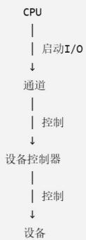

所以：

## 通道 $\rightarrow$ 设备控制器 $\rightarrow$ 设备

这是一个层层控制关系。

因此C。

I/O 系统的硬件层次是一个树形 / 层次结构:

```txt
plaintext
plaintext
CPU
    通道（一个通道可接多个设备控制器）
    设备控制器（一个控制器可接多个设备）
    设备
```

控制关系是层层递进的：

\- CPU 向通道发 I/O 指令（指明通道程序起始地址）

\- 通道执行通道程序，向设备控制器发命令

\- 设备控制器直接控制设备完成具体操作

王道原文："三者的控制关系是层层递进的。"

https://chatgpt.com/g/g-p-6a4147b6a8088191bef869eb87bbe5c0-cao-zuo-xi-tong/c/6a8857c4-5f90-83e8-b689-d37b05e1d518

https://www.doubao.com/thread/xgf5s0qbd6OUrHYVq

## 题2:

16. 将系统调用参数翻译成设备操作命令的工作由（）完成。
A. 用户层 I/O
B. 设备无关的操作系统软件
C. 中断处理
D. 设备驱动程序

【王道原书解析】（P330）：

"将系统调用参数翻译成设备操作命令的工作由设备无关的操作系统软件完成。设备无关的操作系统软件是I/O软件的一部分，它向上层提供系统调用的接口，根据设备类型选择调用相应的驱动程序。设备驱动程序负责执行操作系统发出的I/O命令，因设备的不同而不同。"

这里的关键是区分"翻译"和"执行":

```txt
plaintext
plaintext
system调用参数（fd, buf, count）
    ↓ 【设备独立性软件】翻译：参数检查、逻辑设备名→物理设备名映射、
    ↓ 根据设备类型选择对应驱动程序、缓冲分配
设备操作命令（如“读磁盘第N块”—操作系统层面的命令）
    ↓ 【设备驱动程序】执行：将命令转化为设备寄存器的具体写入值
设备寄存器命令（向命令寄存器写0x20、向LBA寄存器写块号—硬件层面的命令）
    ↓
    硬件
```

设备独立性软件做的是"把通用的 read/write 系统调用，变成针对某类设备的操作命令，并选择该调用哪个驱动程序"。它不关心具体硬件寄存器怎么写——那是驱动程序的事。

<table><tr><td>选项</td><td>判断</td><td>原因</td></tr><tr><td>A. 用户层 I/O</td><td>错</td><td>用户层只负责发起系统调用(如调用 printf 库函数),不做翻译</td></tr><tr><td>B. 设备无关的操作系统软件</td><td>对</td><td>负责解析系统调用参数、映射设备名、选择驱动程序,即 &quot;翻译&quot; 工作</td></tr><tr><td>C. 中断处理</td><td>错</td><td>中断处理只在 I/O完成后介入,负责数据传送和唤醒进程,与系统调用参数翻译无关</td></tr><tr><td>D. 设备驱动程序</td><td>错(高频易错项)</td><td>驱动程序负责执行操作系统发出的 I/O 命令(写寄存器、启动设备),而不是 &quot;翻译系统调用参数&quot;。注意王道口径:翻译是独立性软件的事,执行才是驱动的事</td></tr></table>

## ⑦举一反三

\- 如果题目问 "将逻辑设备名映射为物理设备名" $\rightarrow$ 设备独立性软件

\- 如果题目问 "向设备控制器的命令寄存器写入启动指令" $\rightarrow$ 设备驱动程序

\- 如果题目问 "统一 read/write 接口" $\rightarrow$ 设备独立性软件

17. 向设备寄存器的写命令是在 I/O 软件的（）中完成的。
A. 用户层软件 B. 设备独立性软件 C. 设备驱动程序 D. 中断处理程序

① 这题考什么

设备驱动程序的核心职责——直接与设备控制器硬件交互。

② 题型识别信号

看到 "设备寄存器" 写命令 "设置寄存器"，直接定位设备驱动程序。

③ 正确答案

c

④ 核心推理

【王道原书解析】（P330）：

“设备驱动程序负责将上层软件发来的抽象 I/O 要求转换为具体要求，发送给设备控制器，控制设备工作。设备驱动程序需要向设备寄存器写入命令，以控制设备的工作状态和数据传输方式。”

【王道原书】驱动程序工作流程（P323）第4步明确写道：

"设备就绪后，驱动程序向控制器的相应寄存器写入命令、数据缓冲区地址、传输长度等参数。"

驱动程序是I/O软件中唯一直接访问设备寄存器的层次。设备控制器有若干寄存器（命令寄存器、状态寄存器、数据寄存器、地址寄存器），只有驱动程序知道这些寄存器的端口地址和写入格式。

## ⑥ 易错诊断

注意区分：中断处理程序也会访问设备寄存器（读状态、读数据），但那是I/O完成后的读取，而不是"写命令启动设备"。题目关键词是"写命令”，这是启动I/O的动作，归驱动程序。

## ⑦举一反三

\- "检查设备是否就绪"（读状态寄存器） $\rightarrow$ 驱动程序

\- "I/O 完成后读取设备状态判断是否出错" $\rightarrow$ 中断处理程序

\- "从设备数据寄存器读数据到内存缓冲区" $\rightarrow$ 中断处理程序

19. 在接收和处理一个输入设备的中断的过程中，一定不由硬件来完成的工作是（）。A. 判断产生中断的类型 B. CPU 模式由用户态切换到内核态 C. 主机获取设备输入 D. 保存用户程序的断点

【王道原书解析】（P331）：

"在中断I/O方式下，由中断服务程序来完成数据的输入和输出，C错误。在中断响应阶段，由硬件完成CPU模式的转换，并保存用户程序的断点，中断源的识别可以采用硬件识别法。"

中断过程分为两个阶段，硬件和软件分工明确：

## 【中断响应阶段——硬件自动完成】

1. CPU 在每条指令执行结束后检测中断信号

2. 关中断（硬件）

3. 保存断点：硬件自动将PC和PSW压入中断栈 $\rightarrow$ D是硬件

4. 模式切换：硬件自动将 CPU 从用户态切换到内核态 $\rightarrow$ B 是硬件

5. 识别中断源：中断控制器向 CPU 提供中断向量号，CPU 据此查中断向量表，跳转到对应中断处理程序入口 → A 可以由硬件完成（硬件识别法 / 向量中断）

## 【中断处理阶段——软件（中断处理程序）完成】

1. 保存其他 CPU 寄存器（软件）

2. 读取设备状态寄存器，判断操作是否成功（软件）

3. 数据传送：从设备控制器的数据寄存器读取数据，存入内存缓冲区（软件） $\rightarrow$ C是软件

4. 错误处理（如有）

5. 唤醒等待该 I/O 的进程（软件）

6. 恢复寄存器现场（软件）

7. 中断返回，硬件恢复 PC/PSW（硬件）

"主机获取设备输入" = CPU 执行中断处理程序中的 IN 指令，从设备数据寄存器读数据到内存。这是 CPU 在执行程序代码，属于软件行为，不是硬件自动完成的。

## ⑦举一反三

\- 如果问 "保存通用寄存器内容" $\rightarrow$ 软件（中断处理程序）

\- 如果问 "关中断" $\rightarrow$ 硬件（中断响应周期自动完成）

\- 如果问 "找到中断处理程序入口地址" $\rightarrow$ 硬件（中断向量法）

\- 如果问 "从设备数据寄存器读数据到内存" $\rightarrow$ 软件（中断服务程序）

20. 下列几种 I/O 方式中，会导致用户进程进入阻塞态的是（）。  
I. 程序直接控制 II. 中断方式 III. DMA 方式  
A. II B. I、III C. II、III D. I、II、III

## ④ 核心推理

【王道原书解析】（P331）：

"在程序直接控制方式下，用户进程在I/O过程中不会被阻塞，驱动程序完成用户进程的I/O请求后才结束，CPU和I/O操作串行。在中断控制方式下，驱动程序启动第一次I/O操作后，将调出其他进程执行，而当前用户进程被阻塞，CPU和设备准备并行。在DMA方式下，驱动程序对DMA控制器初始化后，便发送'启动DMA'命令……同时CPU执行调度程序，转向其他进程执行，当前用户进程被阻塞。"

三种方式的对比：

<table><tr><td colspan="4">表格</td></tr><tr><td>I/O 方式</td><td>进程状态</td><td>CPU 在等什么</td><td>CPU 与设备并行?</td></tr><tr><td>I. 程序直接控制(轮询)</td><td>运行态(忙等)</td><td>CPU 不断读状态寄存器循环查询,不放弃 CPU</td><td>否,完全串行</td></tr><tr><td>II. 中断方式</td><td>阻塞态</td><td>启动 I/O 后主动放弃 CPU,I/O 完成后中断唤醒</td><td>是</td></tr><tr><td>III. DMA 方式</td><td>阻塞态</td><td>初始化 DMA 控制器后放弃 CPU,DMA 完成后中断唤醒</td><td>是(并行程度更高)</td></tr></table>

关键区分：忙等 $\neq$ 阻塞。

\- 程序直接控制方式下，进程虽然在 "等 I/O"，但它一直在 CPU 上执行查询循环（while (status != READY);），进程状态是运行态，没有进入阻塞队列。

\- 中断和DMA方式下，进程启动I/O后主动调用调度程序放弃CPU，进入阻塞队列，CPU可以运行其他进程。

## ⑥ 易错诊断

有人可能认为"程序直接控制方式下进程也在等I/O，所以也是阻塞"。这是把"等待"和"阻塞"混淆了。在进程三状态模型中：

\- 阻塞：进程主动放弃CPU，进入等待队列，不参与调度，需要外部事件（中断）唤醒

\- 忙等：进程仍在CPU上运行，只是在执行无用的查询循环，它随时可以继续执行后续指令

王道裁缝店类比（P322）：程序直接控制 = 客户亲自每隔一段时间跑去店里问衣服做好没（客户一直在跑腿，没有 "阻塞" 在某个地方）；中断方式 = 裁缝打电话通知客户（客户可以去做别的事，即 "阻塞" 等待通知）。

## ⑦举一反三

\- 如果问 "哪种方式 CPU 与设备完全串行" $\rightarrow$ 程序直接控制

\- 如果问 "哪种方式 CPU 干预频率最低" $\rightarrow$ DMA（只在开始和结束介入）

\- 如果问 "哪种方式数据不经过 CPU 寄存器" $\rightarrow$ DMA（数据直接在设备和内存之间传输）

21. 当一个进程请求 I/O 操作时，该进程将被挂起，直到 I/O 设备完成 I/O 操作后，设备控制器便向 CPU 发送一个中断请求，CPU 响应后便转向中断处理程序，下列关于中断处理程序的说法中，错误的是（）。  
A. 中断处理程序将设备控制器中的数据传送到内存的缓冲区（读入），或将要输出的数据传送到设备控制器（输出）。  
B. 对于不同的设备，有不同的中断处理程序  
C. 中断处理结束后，需要恢复 CPU 现场，此时一定会返回到被中断的进程  
D. I/O 操作完成后，驱动程序必须检查本次 I/O 操作中是否发生了错误

【王道原书解析】（P331）：

"中断处理结束后，是否返回到被中断的进程，有两种情况：①采用的是屏蔽中断方式（单重中断），此时会返回被中断的进程。②采用多重中断方式时，若没有更高优先级的中断请求，则会返回被中断的进程，否则，系统将处理更高优先级的中断请求。"

更重要的是：I/O 中断处理完成后，中断处理程序会唤醒等待该 I/O 的进程。此时如果被唤醒的进程优先级高于被中断的进程（比如被中断的是低优先级后台进程，而 I/O 完成的是高优先级前台进程），那么中断返回前会进入调度程序，调度程序完全可能选择另一个进程运行，而不是返回被中断的进程。

中断返回后的控制流：

```txt
plaintext
plaintext
    plaintext ^
    中断处理完成
    ↓
    恢复CPU现场
    ↓
    是否需要调度？（中断处理中可能唤醒了更高优先级进程）
    ↓
    是    否
    ↓
    调度程序选择新进程    回到被中断进程
（不一定是原来的）
```

## ⑥ 易错诊断

C 选项的陷阱在于 "恢复 CPU 现场" 这个表述。有人觉得 "恢复了现场不就回到原来的进程了吗？" 注意：

\- "恢复CPU现场"恢复的是被中断进程的寄存器上下文（把它从栈中弹回寄存器）

\- 但在恢复现场之前，操作系统可能先执行调度程序，如果选择了新进程，那么恢复的将是新进程的现场，而不是被中断进程的

\- 即使恢复了被中断进程的现场，在多重中断系统中也可能先处理更高优先级中断

## ⑦举一反三

\- 如果题目说"中断返回后一定回到被中断的指令继续执行" $\rightarrow$ 错（可能调度/可能有更高优先级中断）

\- 如果题目说"单重中断且不发生调度时，中断返回后回到被中断进程" $\rightarrow$ 对

\- 如果题目说 "中断处理程序必须快速、非阻塞，不能调用可能引起睡眠的函数" $\rightarrow$ 对（王道 P324）

## 【跨章节联系】

这几道题涉及的知识点不是孤立的，它们串起了一条完整的I/O系统调用链：

## plaintext ^

```txt
用户程序调用read()
→ 用户层库函数封装（用户态）
→ trap指令（系统调用）→ 硬件自动切换内核态【第19题B、D考点】
→ 系统调用入口 → 设备独立性软件：参数检查、设备映射、选择驱动【第16题考点】
→ 设备驱动程序：写设备寄存器、启动设备【第17题考点】
→ 进程阻塞，CPU调度其他进程【第20题考点】
→ 设备完成I/O → 设备控制器发中断
→ 硬件：检测中断、保存PC/PSW、切换内核态、查中断向量表【第19题考点】
→ 中断处理程序：读状态、查错误、传数据、唤醒进程【第21题A、B、D考点】
→ 调度程序：选择进程（不一定是被中断的）【第21题C考点】
→ 返回用户态继续执行
```

0

https://chatgpt.com/g/g-p-6a4147b6a8088191bef869eb87bbe5c0-cao-zuo-xi-tong/c/6a894846-65e8-83ee-b7a2-d0c6a0dbe82c

26.【2017统考真题】系统将数据从磁盘读到内存的过程包括以下操作：
① DMA 控制器发出中断请求
② 初始化 DMA 控制器并启动磁盘
③ 从磁盘传输一块数据到内存缓冲区
④ 执行“DMA 结束”中断服务程序
正确的执行顺序是（）。
A. ③→①→②→④
B. ②→③→①→④
C. ②→①→③→④
D. ①→②→④→③

【王道原书】（P321-322）把DMA工作过程明确分为三个阶段：

"CPU 收到设备的 DMA 请求后，向 DMA 控制器发送启动命令，并设置 MAR 和 DC 的初值，随后启动 DMA 控制器。接着，CPU 将 I/O 控制权交给 DMA 控制器，转而执行其他任务。DMA 控制器接管总线后，以突发方式将整块数据在设备与内存之间直接传输，无须 CPU 干预。传输结束后，DMA 控制器向 CPU 发送中断信号，通知操作完成。"

【王道原书解析】（P331）：

"DMA 的传送过程分为预处理、数据传送和后处理三个阶段。在预处理阶段，由 CPU 初始化 DMA 控制器中的有关寄存器、设置传送方向、测试并启动设备等。在数据传送阶段，完全由 DMA 控制，DMA 控制器接管系统总线。在后处理阶段，DMA 控制器向 CPU 发送中断请求，CPU 执行中断服务程序做 DMA 结束处理。"

把四个操作对号入座：

<table><tr><td>操作</td><td>属于哪个阶段</td><td>谁在做</td></tr><tr><td>2 初始化 DMA 控制器并启动磁盘</td><td>预处理</td><td>CPU(执行驱动程序代码)</td></tr><tr><td>3 从磁盘传输一块数据到内存缓冲区</td><td>数据传送</td><td>DMA 控制器(硬件,接管总线)</td></tr><tr><td>1 DMA 控制器发出中断请求</td><td>后处理开始</td><td>DMA 控制器(硬件,传完了发信号)</td></tr><tr><td>4 执行 &quot;DMA 结束&quot; 中断服务程序</td><td>后处理</td><td>CPU(响应中断,执行 ISR)</td></tr></table>

所以顺序必然是：②→③→①→④。

你可以把 DMA 读磁盘想成:

CPU布置任务 $\rightarrow$ DMA自己搬数据 $\rightarrow$ DMA告诉CPU“搬完了” $\rightarrow$ CPU处理收尾

对应本题正好是：

② 初始化并启动 → ③ 搬数据 → ① 发中断 → ④ 处理中断

画成时间线：

CPU

② 初始化DMA，启动磁盘

③ 磁盘 → 内存
整块数据传输
CPU不用逐字参与

① 数据传完，DMA发中断请求

所以顺序只能是：

② → ③ → ① → ④

```txt
plaintext
[预处理阶段]
| ▼
② CPU做:
驱动程序初始化
• MAR ← 内存起始地址
• DC ← 要传送的字数
• CR ← 读命令
• 启动磁盘
| ▼
进程阻塞
CPU转去执行其他进程

[数据传送阶段]
| ▼
DMA控制器做:
接管系统总线
磁盘 → 内存缓冲区
整块数据直接传送
(不经过CPU寄存器)
CPU此时在跑别的进程
| ▼
传送完成
(DC减到0)

[后处理阶段]
| ▼
DMA控制器做:
① 发出中断请求
| ▼
⑧ CPU做:
响应中断
执行DMA结束ISR
• 检查是否出错
• 唤醒等待进程
• 释放DMA资源
• 中断返回
```

## 画一条完整时间线，看清每个时刻谁在干什么：

## 下次看到 DMA 排序题，按这个条件反射走：

```txt
plaintext
看到"初始化/设置寄存器/启动" → 这是预处理，排最前
看到"传输数据/数据块/直接存取" → 这是数据传送，排中间
看到"中断请求/DMA完成信号" → 传完才发，排在传送之后
看到"中断服务程序/中断处理" → 响应中断，排在最后
```

## ⑦举一反三

变式1：如果题目问"哪些阶段需要CPU参与？"

→ 预处理（②）和后处理（④）需要 CPU；数据传送（③）完全由 DMA 控制器硬件完成，CPU 不干预。这就是王道说的 "CPU 仅在数据传送的开始和结束阶段介入"。

变式2：如果题目问"数据传送阶段，数据经过CPU寄存器吗？"

→ 不经过。DMA 方式数据直接在设备和内存之间传输，这是 DMA 和中断驱动方式的关键区别（中断方式数据必须经过 CPU 寄存器）。

变式3：如果题目把"磁盘读到内存"改成"内存写到磁盘”，顺序变不变？

→ 不变。预处理设置 MAR 为源地址、CR 为写命令，然后 DMA 传送，传完中断，顺序完全一样。

变式 4：如果问 "DMA 方式中，请求 I/O 的进程在哪个阶段被阻塞？"

→ 预处理完成后（②之后），进程阻塞，CPU 转去执行其他进程；后处理的中断服务程序（④）中唤醒该进程。

## https://www.doubao.com/thread/x5lcHa8UU0eCYkHg7

## 二、你最容易错的地方：①为什么不是在③前面？

这里一定要注意题目①的措辞：

“DMA控制器发出中断请求”

这个中断不是说：

“CPU，我准备开始DMA了。”

而是：

“CPU，我这一整块数据已经传完了，你回来处理一下。”

也就是说：

DMA结束中断是“完成通知”，不是“开始通知”。

因此一定有：

数据传输③ 在前 $\rightarrow$ 中断请求① 在后

这两个不能颠倒。

王道原书也明确写到：DMA控制器完成整块数据传输后，才向CPU发送中断信号，通知操作完成。

王道2027操作系统\_OCR

# https://chatgpt.com/g/g-p-6a4147b6a8088191bef869eb87bbe5c0-cao-zuo-xi-tong/c/6a8953ed-9288-83ee-889e-5ec1b6f327e9

## 题 3:

09. 设从磁盘将一块数据传送到缓冲区所用的时间为 $80 \mu s$ ，将缓冲区中的数据传送到用户区所用的时间为 $40 \mu s$ ，CPU 处理一个数据块所用的时间为 $30 \mu s$ 。若有多块数据需要处理，并采用单缓冲区传送某磁盘数据，则处理一块数据所用的总时间为（）。A. $120 \mu s$ B. $110 \mu s$ C. $150 \mu s$ D. $70 \mu s$

10. 某操作系统采用双缓冲区传送磁盘上的数据。设从磁盘将数据传送到缓冲区所用的时间为 $T_{1}$ ，将缓冲区中的数据传送到用户区所用的时间为 $T_{2}$ ，CPU 处理一块数据所用的时间为 $T_{3}$ ，假设一个磁盘块和一个缓冲区的大小相等，某系统在一段时间内连续处理一大批数据，则平均处理一个磁盘块数据的时间为（）。A. $T_{1} + T_{2} + T_{3}$ B. $\max(T_{2}, T_{3}) + T_{1}$ C. $\max(T_{1}, T_{3}) + T_{2}$ D. $\max(T_{1}, T_{2} + T_{3})$

## 7. 单缓冲和双缓冲放一起看，这是最重要的

<table><tr><td></td><td>单缓冲</td><td>双缓冲</td></tr><tr><td>缓冲区数量</td><td>1</td><td>2</td></tr><tr><td>T和C</td><td>可以并行</td><td>可以并行</td></tr><tr><td>T和M</td><td>不能并行</td><td>可以并行</td></tr><tr><td>原因</td><td>T、M抢同一个缓冲区</td><td>T、M访问不同缓冲区</td></tr><tr><td>CPU侧耗时</td><td>C与T并行，M单独</td><td>M+C整体与T并行</td></tr><tr><td>每块稳定处理时间</td><td>max(T,C)+M</td><td>max(T,M+C)</td></tr></table>

这个表建议直接记住，但更重要的是理解公式的位置：

## 单缓冲

$$
\boxed {\max (T, C) + M}
$$

为什么 $M$ 在 $\max$ 外？

T和M不能并行。

双缓冲

<div class="mineru-algorithm" style="white-space: pre-wrap; font-family:monospace;">
$\max (T,M + C)$
</div>

为什么 $M$ 跑进 $\max$ 里面了？

有两个缓冲区后，设备可以向一个缓冲区做T，同时操作系统从另一个缓冲区做M。

这就是两个公式最本质的区别。

最后还有一个408很容易挖坑的地方：这里说的“每块数据所需时间”通常指流水稳定后的平均/周期时间，不是“第一块数据从设备开始输入，到CPU处理结束”的完整延迟。第一块如果从系统全空开始，仍然要经历 $T \rightarrow M \rightarrow C$ ；双缓冲的优势是从后续数据开始把不同块的阶段重叠起来。

## 题 4:

18. 提高单机资源利用率的关键技术是（）。A. SPOOLing 技术 B. 虚拟技术 C. 交换技术 D. 多道程序设计技术

单道程序时最大的浪费是：

```txt
进程A: CPU计算 → I/O → CPU计算
↑
CPU在这里闲着
```

例如A要进行磁盘I/O：

<div class="mineru-algorithm" style="white-space: pre-wrap; font-family:monospace;">
时间 $\rightarrow$ A: CPU工作 |----等待I/O----| CPU工作CPU：忙 |----空闲----|忙
</div>

多道程序设计解决的就是这个问题：

```txt
A: CPU工作 |----I/O等待----| CPU工作
B:    |--CPU工作----|
CPU: 忙    |----忙----| 忙
```

A等I/O时，CPU不傻等，而是去运行B。

于是实现：

CPU和I/O设备并行工作 $+$ 多道程序交替占用CPU

直接提高：

\- CPU利用率

\- I/O 设备利用率

\- 内存利用率

\- 系统吞吐量

王道在讲多道批处理系统时明确指出，多道程序设计使多道程序共享 CPU、内存、I/O 设备等资源，从而提高资源利用率和系统吞吐量；这也正对应这道题。☐ 王道2027操作系统\_OCR

<table><tr><td colspan="2">你可以这样记</td></tr><tr><td>技术</td><td>一看到什么关键词就选它</td></tr><tr><td>多道程序设计</td><td>提高系统/单机资源利用率、提高吞吐量、CPU与I/O并行</td></tr><tr><td>SPOOLing</td><td>独占设备一共享设备、虚拟设备、打印机、输入井/输出井</td></tr><tr><td>虚拟技术</td><td>一个物理资源逻辑上变成多个,或逻辑容量扩充</td></tr><tr><td>交换技术</td><td>进程/内存内容在内存与外存之间换入换出</td></tr></table>

所以这题最重要的辨析就是：

问“整个单机资源利用率”→多道程序设计。

问“提高独占设备利用率 / 将独占设备虚拟成共享设备” → SPOOLing。

你可以把 多道程序设计看成“全局提高资源利用率”，SPOOLing 看成 “专门优化 I/O 独占设备”。这两个特别容易在选择题里放一起骗你。

https://chatgpt.com/g/g-p-6a4147b6a8088191bef869eb87bbe5c0-cao-zuo-xi-tong/c/6a8a9c74-e90c-83ee-bac8-816d0b207c10

## 题 5:

21. 在采用 SPOOLing 技术的系统中，用户的打印结果首先被送到（）。 A. 磁盘固定区域 B. 内存固定区域 C. 终端 D. 打印机

22. 采用 SPOOLing 技术的计算机系统，外围计算机需要（）。  
A. 一台 B. 多台 C. 至少一台 D. 0 台

23. SPOOLing 系统由（）组成。
A. 预输入程序、井管理程序和缓输出程序
B. 预输入程序、井管理程序和井管理输出程序
C. 输入程序、井管理程序和输出程序
D. 预输入程序、井管理程序和输出程序

24. 在 SPOOLing 系统中，用户进程实际分配到的是（）。A. 用户所要求的外设 B. 外存区，即虚拟设备 C. 设备的一部分存储区 D. 设备的一部分空间

25. 下面关于 SPOOLing 系统的说法中，正确的是（）。  
A. 构成 SPOOLing 系统的基本条件是有外围输入机与外围输出机  
B. 构成 SPOOLing 系统的基本条件仅是要有高速的大容量硬盘作为输入井和输出井  
C. 当输入设备忙时，SPOOLing 系统中的用户程序暂停执行，待 I/O 空闲时再被唤醒执行输出操作  
D. SPOOLing 系统中的用户程序可以随时将输出数据送到输出井中，待输出设备空闲时再由 SPOOLing 系统完成数据的输出操作

26. 下面关于 SPOOLing 的叙述中，不正确的是（）。A. SPOOLing 系统中不需要独占设备  
B. SPOOLing 系统加快了作业执行的速度  
C. SPOOLing 系统使独占设备变成共享设备  
D. SPOOLing 系统提高了独占设备的利用率

27. （）是操作系统中采用的以空间换取时间的技术。
A. SPOOLing 技术 B. 虚拟存储技术 C. 覆盖与交换技术 D. 通道技术

28. 采用假脱机技术，将磁盘的一部分作为公共缓冲区以代替打印机，用户对打印机的操作实际上是对磁盘的存储操作，用以代替打印机的部分由（）完成。
A. 独占设备 B. 共享设备 C. 虚拟设备 D. 一般物理设备两井在磁盘，两缓冲在内存；不要外围机，用户拿虚拟机；独占变共享，空间换时间。

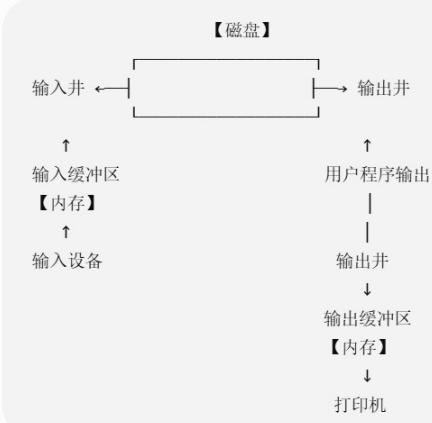  
再配一句口诀：

https://chatgpt.com/g/g-p-6a4147b6a8088191bef869eb87bbe5c0-cao-zuo-xi-tong/c/6a8aae26-27f4-83e8-9104-7601a563389f

## 题6:

30. 当用户要求使用打印机打印某文件时，用户的要求是由操作系统的（）实现的。
A. 文件系统
B. 设备管理程序
C. 文件系统和设备管理程序
D. 打印机启动程序和设备管理程序

31. 下列设备管理工作中，适合由设备独立性软件来完成的有（）。  
I. 向设备寄存器写命令 II. 检查用户是否有权使用设备  
III. 将二进制整数转换成 ASCII 码格式打印 IV. 缓冲区管理  
A. I、II 和 III B. II、III 和 IV C. II 和 IV D. I、III 和 IV

32. 下列关于设备驱动程序的说法中，正确的是（）。I. 设备驱动程序负责处理与设备相关的中断处理过程II. 驱动程序全部使用汇编语言编写，没有使用高级语言编写III. 设备驱动程序负责处理磁盘调度IV. 设备驱动程序与设备密切相关，可以在任意操作系统运行A. II、III、IV B. I、III C. III、IV D. I、II、III

33. 下列选项中，（）不属于设备驱动程序的功能。
A. 接收进程发来的 I/O 命令和参数，并检查其合法性
B. 查询 I/O 设备的状态
C. 发出 I/O 命令，启动 I/O 设备
D. 对 I/O 设备传回的数据进行分析和缓冲

34. 对设备驱动程序的处理过程进行排序，正确的处理顺序是（）。
①对服务请求进行校验
②传送必要的参数
③启动I/O设备
④将抽象要求转化为具体要求
⑤检查设备的状态
A. ①④⑤②③
B. ④①⑤②③
C. ①④②⑤③
D. ④①②⑤③

<table><tr><td>题干关键词</td><td>第一反应</td></tr><tr><td>格式转换、库函数、printf</td><td>用户层软件</td></tr><tr><td>权限、缓冲、设备分配、公共操作</td><td>设备独立性软件</td></tr><tr><td>具体设备、寄存器、状态、启动、具体参数</td><td>设备驱动程序</td></tr><tr><td>设备完成、中断、唤醒</td><td>中断处理</td></tr><tr><td>文件名、目录、磁盘块、文件读写</td><td>文件系统</td></tr></table>

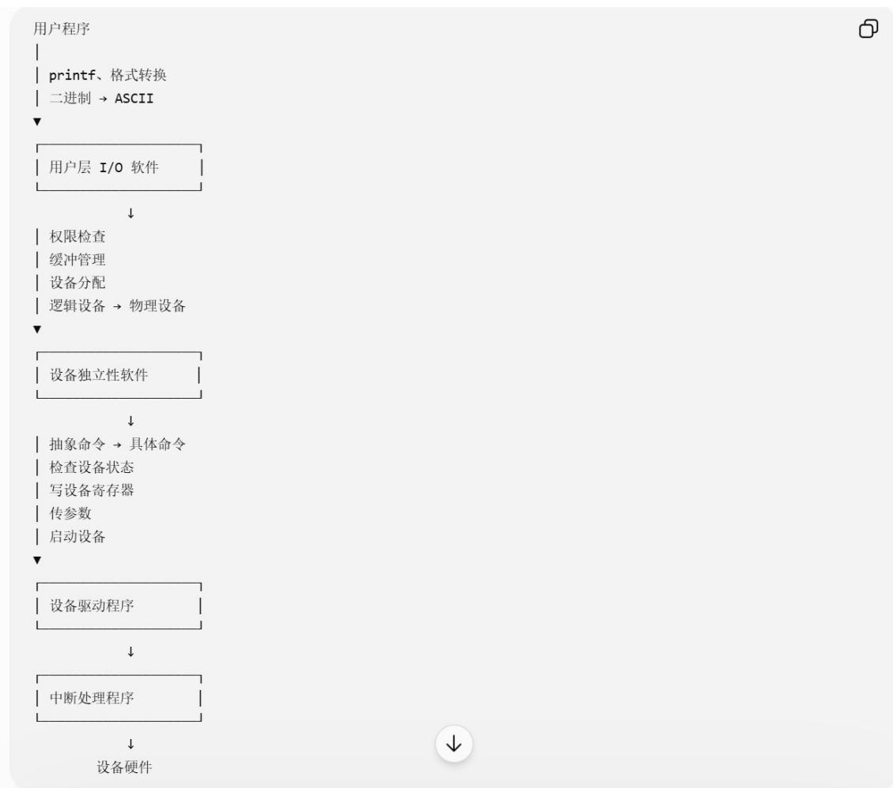

你做题时不用硬背一大堆句子，抓关键词就行：

https://chatgpt.com/g/g-p-6a4147b6a8088191bef869eb87bbe5c0-cao-zuo-xi-tong/c/6a8ab378-2550-83ee-8303-af2ad5d32e73

## 题7:

46.【2024统考真题】当键盘中断服务例程执行结束时，所输入数据的存放位置是（）。A.用户缓冲区 B.CPU中的通用寄存器C.内核缓冲区 D.键盘控制器的数据寄存器

## 这类题最重要的时间线

把下面这一条背熟，后面I/O、中断、缓冲区的题都可以直接套：

用户按键
↓
键盘控制器的数据寄存器
↓
产生中断
↓
中断/驱动处理
↓
内核缓冲区
↓
唤醒用户进程
↓
用户进程继续执行
↓
用户缓冲区

因此如果题目换个问法：问的时刻

用户进程真正取得数据以后

https://chatgpt.com/g/g-p-6a4147b6a8088191bef869eb87bbe5c0-cao-zuo-xi-tong/c/6a8ac73d-e688-83e9-8913-d25f3fdc8bf1

## 题8:

36.【2009 统考真题】单处理机系统中, 可并行的是 ( )。

I. 进程与进程 II. 处理机与设备 III. 处理机与通道 IV. 设备与设备

A. I、II、III B. I、II、IV C. I、III、IV D. II、III、IV

42. 【2016 统考真题】下列关于 SPOOLing 技术的叙述中，错误的是（）。  
A. 需要外存的支持  
B. 需要多道程序设计技术的支持  
C. 可以让多个作业共享一台独占式设备  
D. 由用户作业控制设备与输入/输出井之间的数据传送

44.【2022统考真题】下列关于驱动程序的叙述中，不正确的是（）。A.驱动程序与I/O控制方式无关B.初始化设备是由驱动程序控制完成的C.进程在执行驱动程序时可能进入阻塞态D.读/写设备的操作是由驱动程序控制完成的

<table><tr><td colspan="2">所以你现在可以形成下面这组做题反射:</td></tr><tr><td>题目出现的关键词</td><td>第一反应</td></tr><tr><td>单处理机 + 两个进程</td><td>只能并发,不能并行</td></tr><tr><td>CPU + I/O设备</td><td>可以并行</td></tr><tr><td>多个独立 I/O 设备</td><td>可以并行</td></tr><tr><td>SPOOLing 的井</td><td>磁盘/外存</td></tr><tr><td>SPOOLing 的缓冲区</td><td>内存</td></tr><tr><td>谁控制设备↔井</td><td>系统输入/输出进程,不是用户作业</td></tr><tr><td>SPOOLing 作用</td><td>独占设备 → 共享的虚拟设备</td></tr><tr><td>设备相关的具体操作</td><td>驱动程序</td></tr><tr><td>向设备寄存器写命令</td><td>驱动程序</td></tr><tr><td>初始化/启动设备</td><td>驱动程序</td></tr><tr><td>I/O 尚未完成</td><td>请求 I/O 的进程可能阻塞</td></tr></table>

越靠近硬件，越是设备相关 → 越应该想到设备驱动程序；越靠近用户，越应该屏蔽具体硬件差异。  
https://chatgpt.com/g/g-p-6a4147b6a8088191bef869eb87bbe5c0-cao-zuo-xi-tong/c/6a8ad2d5-2b48-83e8-827c-d1facabfe6af  
|（注：部分内容可能由 AI 生成）
