# 第四章 文件管理.docx — 图像索引

> 由 MinerU 结构化结果生成。题目若依赖树形、拓扑、流程、曲线、区域、时序或其他空间关系，应核对这里的原图，不要只依据 OCR 文本推断。

## 图 1

原文页码：3；bbox：`[800, 288, 818, 302]`

## 图 2

原文页码：3；bbox：`[800, 370, 818, 384]`

## 图 3

原文页码：5；bbox：`[793, 511, 813, 527]`

## 图 4

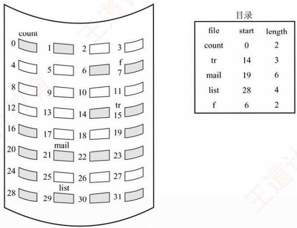

原文页码：7；bbox：`[302, 146, 658, 338]`

**图注：** 图4.10 连续分配

## 图 5

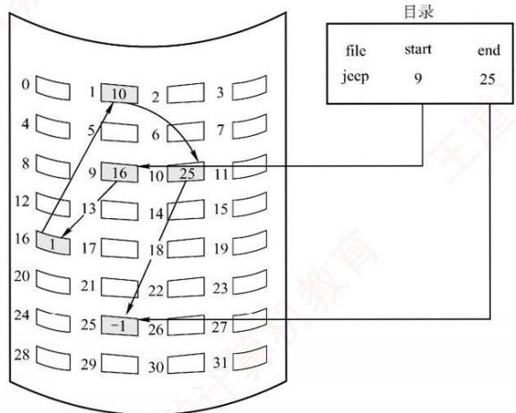

原文页码：8；bbox：`[322, 247, 670, 444]`

**图注：** 图4.11 隐式链接方式

## 图 6

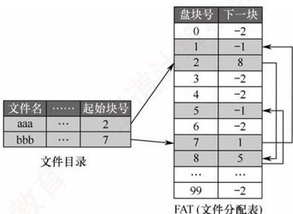

原文页码：8；bbox：`[505, 623, 761, 755]`

**图注：** 图 4.12 磁盘的文件分配表

## 图 7

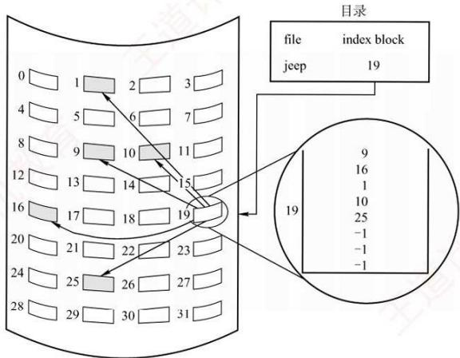

原文页码：9；bbox：`[304, 384, 652, 575]`

**图注：** 图4.13 索引分配

## 图 8

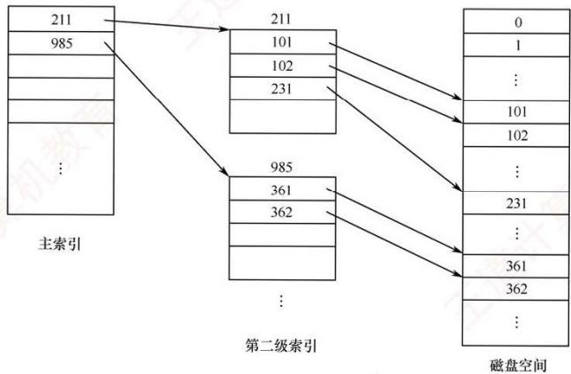

原文页码：10；bbox：`[280, 168, 670, 349]`

**图注：** 图 4.14 二级索引分配

## 图 9

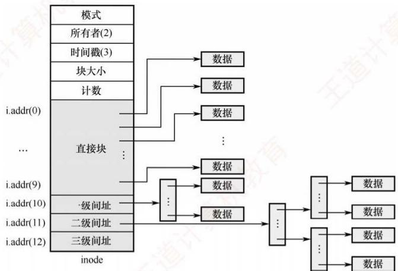

原文页码：10；bbox：`[267, 609, 672, 804]`

**图注：** 图4.15 UNIX系统的inode结构示意图

## 图 10

原文页码：15；bbox：`[776, 117, 794, 131]`

## 图 11

原文页码：15；bbox：`[776, 288, 794, 303]`

## 图 12

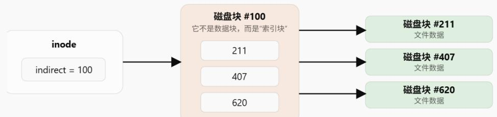

原文页码：21；bbox：`[191, 472, 779, 569]`

## 图 13

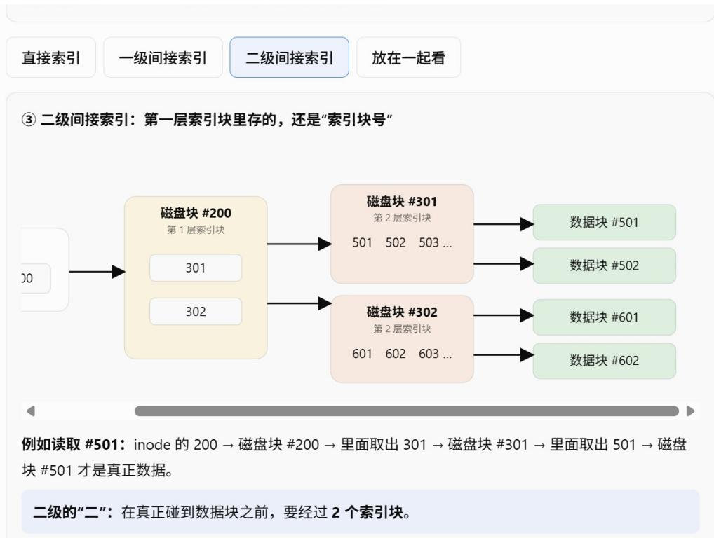

原文页码：22；bbox：`[176, 83, 791, 411]`

## 图 14

原文页码：29；bbox：`[176, 91, 198, 105]`

## 图 15

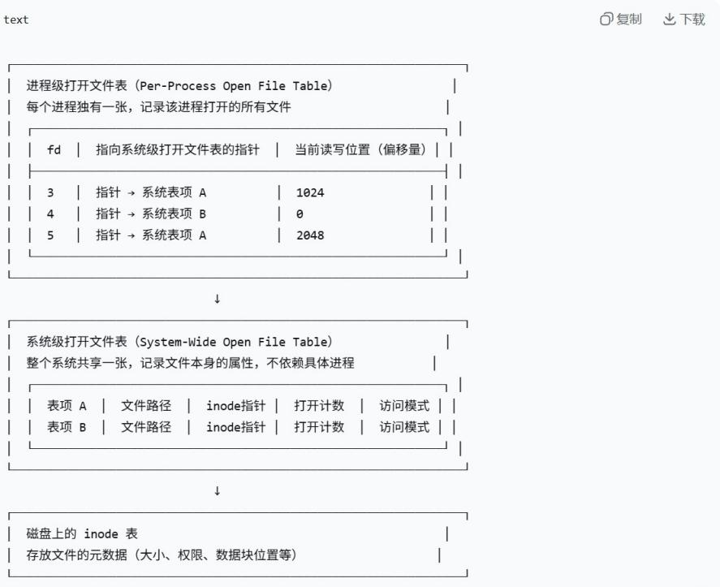

原文页码：30；bbox：`[186, 136, 722, 445]`

## 图 16

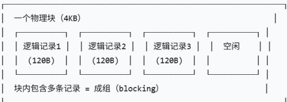

原文页码：32；bbox：`[179, 395, 531, 483]`

## 图 17

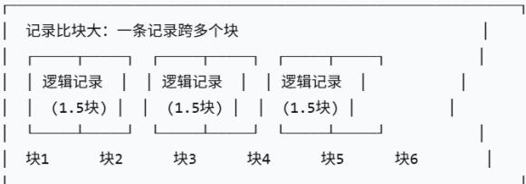

原文页码：32；bbox：`[179, 506, 531, 593]`

## 图 18

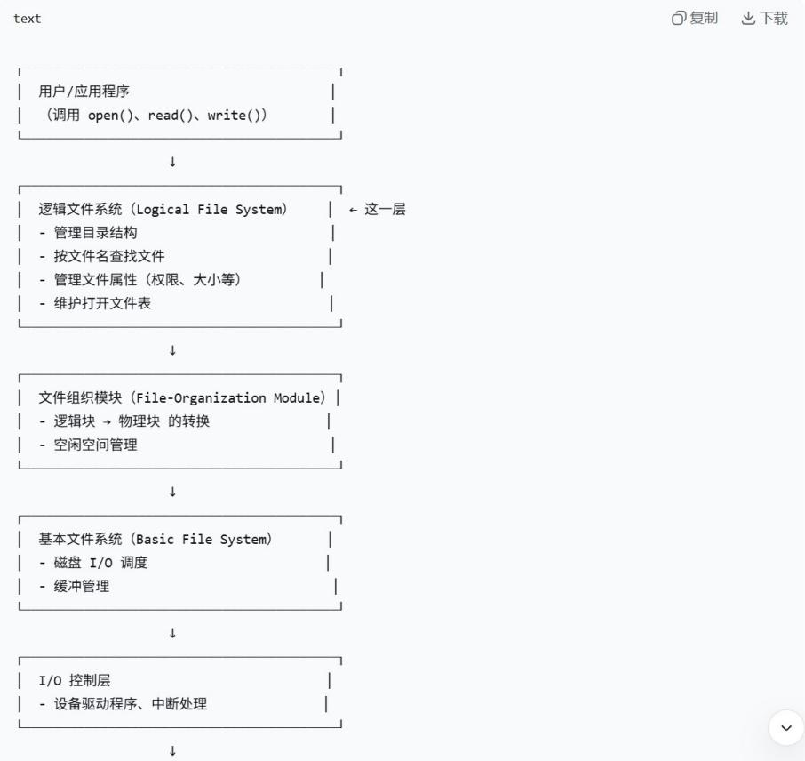

原文页码：35；bbox：`[179, 275, 727, 642]`

## 图 19

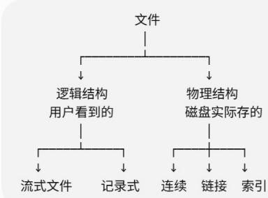

原文页码：39；bbox：`[176, 506, 408, 627]`

## 图 20

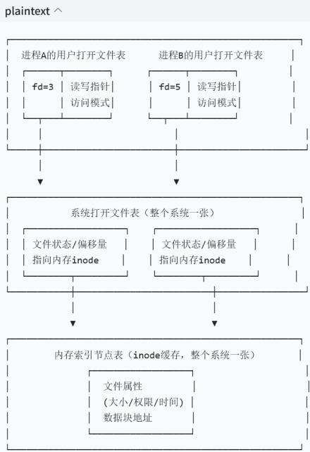

原文页码：45；bbox：`[184, 128, 450, 403]`

## 图 21

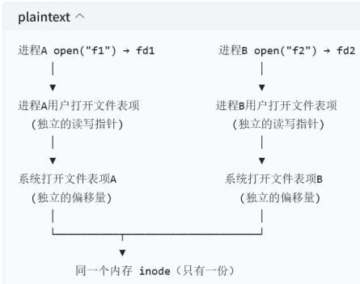

原文页码：46；bbox：`[171, 655, 440, 804]`

## 图 22

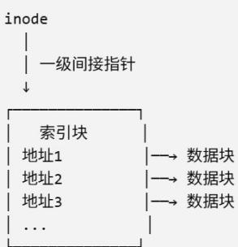

原文页码：52；bbox：`[206, 429, 383, 558]`

## 图 23

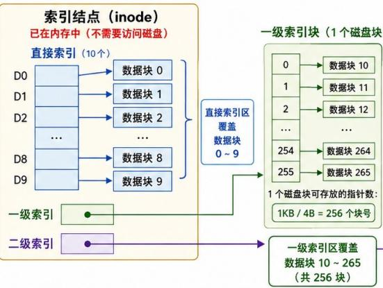

原文页码：55；bbox：`[290, 206, 623, 384]`

## 图 24

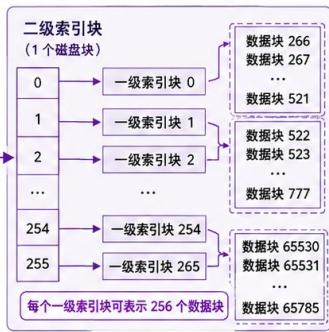

原文页码：55；bbox：`[640, 221, 838, 362]`

## 图 25

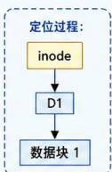

原文页码：55；bbox：`[386, 423, 462, 505]`

## 图 26

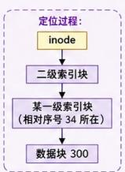

原文页码：55；bbox：`[737, 414, 833, 507]`
