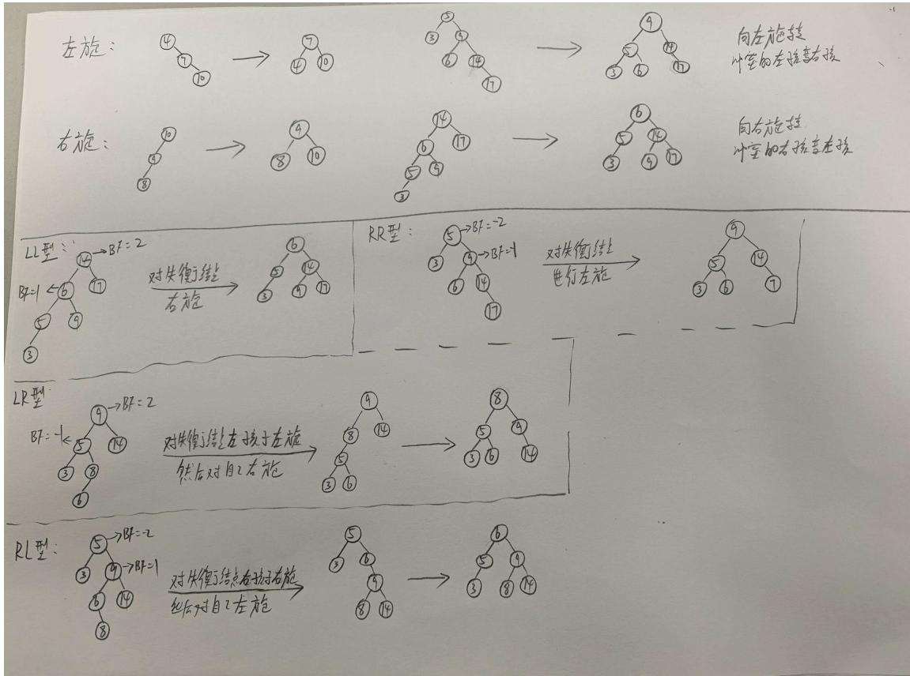
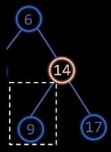
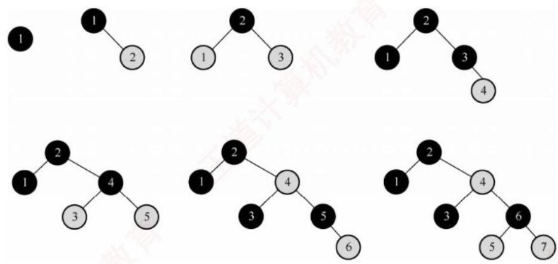

# 第七章 查找（上）.docx — 图像索引

> 由 MinerU 结构化结果生成。题目若依赖树形、拓扑、流程、曲线、区域、时序或其他空间关系，应核对这里的原图，不要只依据 OCR 文本推断。

## 图 1

原文页码：10；bbox：`[149, 211, 845, 577]`

## 图 2

原文页码：11；bbox：`[369, 256, 465, 349]`

## 图 3

原文页码：11；bbox：`[739, 423, 826, 437]`

## 图 4

原文页码：17；bbox：`[194, 696, 759, 885]`

## 图 5

原文页码：18；bbox：`[747, 149, 798, 162]`
