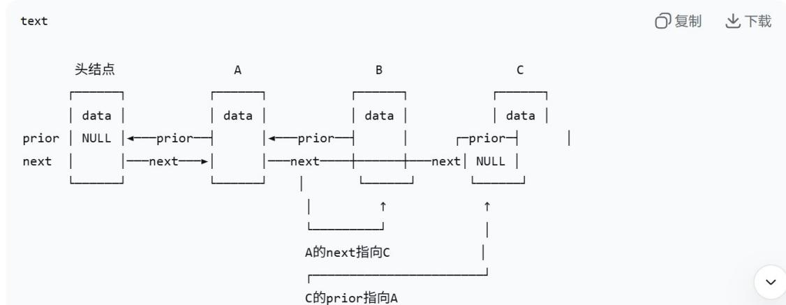
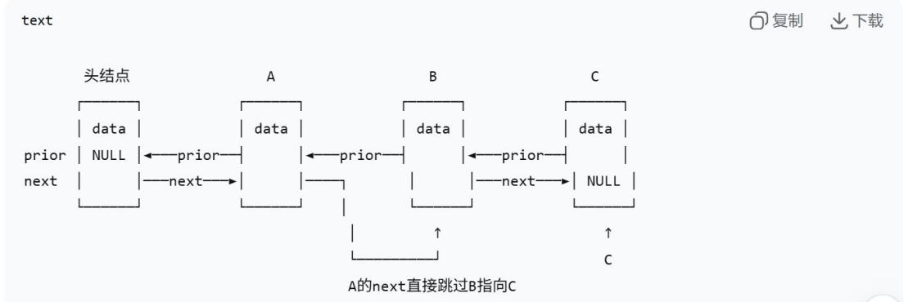

# 第二章 线性表.docx — 图像索引

> 由 MinerU 结构化结果生成。题目若依赖树形、拓扑、流程、曲线、区域、时序或其他空间关系，应核对这里的原图，不要只依据 OCR 文本推断。

## 图 1

原文页码：12；bbox：`[188, 96, 211, 112]`

## 图 2

原文页码：12；bbox：`[186, 250, 208, 266]`

## 图 3

原文页码：12；bbox：`[186, 524, 208, 539]`

## 图 4

原文页码：12；bbox：`[221, 577, 240, 590]`

## 图 5

原文页码：12；bbox：`[220, 763, 236, 776]`

## 图 6

原文页码：12；bbox：`[220, 878, 236, 891]`

## 图 7

原文页码：22；bbox：`[132, 589, 813, 776]`

## 图 8

原文页码：22；bbox：`[144, 260, 811, 418]`
