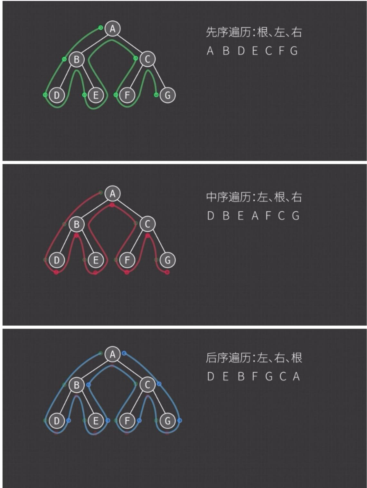

# 第五章 树与二叉树（上）.docx

## 第五章 树与二叉树（上）

## 基本术语：

结点的层次：从树的根开始定义，根结点为第一层，它的孩子为第二层，依此类推。

结点的深度：结点所在的层次。

树的高度（树的深度）：树中结点的最大层数。

结点的高度：以该结点为根的子树高度。

结点的度：就是结点的孩子个数。

树的度：树中结点的最大度数。

分支节点（非终端结点）：度大于0的结点。

叶结点（终端结点）：度为 0（没有孩子结点）的结点。

## 树的性质：

1. 树的结点数 $n$ 等于所有结点的度数之和加 1

2.度为 m 的树中第 i 层上至多有 $m^{(i-1)}$ 个结点 ( $i \geq 1$ )

3.高度为 h 的 m 叉树至多有(m-1) $(m^{h}-1)$ 个结点

4.度为 m, 具有 n 个结点的树最小高度是 $\log_{m}(n(m-1)+1)$

5.度为 m, 具有 n 个结点的树的最大高度是 n-m+1

## 计算题:

## 求叶子结点:

m 叉树 叶子结点计算公式（数据结构考研必考，可直接背记+应用）

## 一、最常用：m 叉树 已知 总结点数 n，求叶子数设：

1. $m$ ：叉数（每个结点最多 $m$ 个孩子）

1. $n$ ：总结点数

1. $n_0$ ：叶子结点数

1. $n_1$ ：度为1的结点数

1. $n_2$ ：度为2的结点数

1. .....

1. $n_m$ ：度为 $m$ 的结点数

## 1. 通用公式（任何 m 叉树都成立）

1. 结点总数:

$$
n = n _ {0} + n _ {1} + n _ {2} + \dots + n _ {m}
$$

2. 边数公式（总度数 = 结点数 - 1）：

$$
n _ {1} + 2 n _ {2} + 3 n _ {3} + \dots + m n _ {m} = n - 1
$$

联立消去 n，得到求叶子公式：

$$
n _ {0} = 1 + n _ {2} + 2 n _ {3} + 3 n _ {4} + \dots + (m - 1) n _ {m}
$$

## 二、考研最常考：完全 m 叉树 / 满 m 叉树

## 1. 满 m 叉树

每一层都满，所有非叶子结点都有恰好 m 个孩子。

1. 度为 1 的结点: $n_{1} = 0$

叶子数公式:

$$
n _ {0} = \frac {(m - 1) n + 1}{m}
$$

## 2. 完全 m 叉树（除最后一层外都满，最后一层靠左）

同样 $n_1 = 0$ 或1，公式同上，只是最后一层可能不满。

## 三、最简单记忆（背这个就够做题）

对任意m叉树：

$$
n _ {0} = 1 + (m - 1) n - n _ {1}
$$

1. $n_0$ ：叶子

1. $n$ ：总结点

## 森林相关：

## 一、先记住3个核心结论

设：

1. 森林中有 $F$ 棵树

1. 森林总结点数： $n$

1. 总边数: $b$

1. 叶子结点数： $n_0$

1. 把森林转换成二叉树后：二叉树根结点的左孩子：森林第一棵树的根

1. 二叉树根结点的右孩子：剩下森林（第2\~F棵树）转的二叉树根

## 二、森林最基本公式

1. 每一棵树：

边数 $=$ 结点数-1

2. 整个森林：

总边数 $b = n - F$

(森林有 F 棵树，就比总结点数少 F 条边)

## 三、森林 $\leftrightarrow$ 二叉树转换（必考）

1. 森林转二叉树规则

1. 每棵树内部：左孩子右兄弟

1. 森林里多棵树：
第 1 棵树 → 二叉树左子树

1. 第 2、3…棵树 → 依次连在右孩子、右孩子的右孩子……

2. 超级重要性质（做题直接用）

1. 森林中所有树的根结点 $\rightarrow$ 在二叉树里全在最右一条链上

1. 森林里的叶子结点

→ 在二叉树里：没有左孩子的结点

## 四、叶子结点计算（森林版）

对任意森林，依然满足：

总度数 = 总边数

设：

1. $n_{0}$ : 叶子 (度 0)

1. $n_1$ ：度1结点

1. $n_2$ ：度2结点

1. ...

则：

$$
\left\{ \begin{array}{c} n = n _ {0} + n _ {1} + n _ {2} + \dots + n _ {k} \\ n _ {1} + 2 n _ {2} + \dots + k n _ {k} = n - F \end{array} \right.
$$

两式相减，直接得到森林叶子公式：

$$
n _ {0} = 1 + n _ {2} + 2 n _ {3} + \dots + (k - 1) n _ {k} + (F - 1)
$$

特别：森林转成一棵二叉树后，

二叉树的叶子数，就是原森林里没有左孩子的结点数。

## 五、考研最常考小题（直接背）

1. 森林有 $F$ 棵树， $n$ 个结点 $\rightarrow$ 边数 $= n - F$

2. 森林转二叉树：二叉树无右子树 $\leftrightarrow$ 森林只有1棵树

3. 森林中后序遍历 $\leftrightarrow$ 对应二叉树的 中序遍历

4. 森林中先序遍历 $\Leftrightarrow$ 对应二叉树的 先序遍历

## 题目：

例 1：在一棵度为 4 的树 T 中，若有 20 个度为 4 的结点，10 个度为 3 的结点，1 个度为 2 的结点，10 个度为 1 的结点，则树 T 的叶结点个数是（）。

A. 41 B. 82 C. 113 D. 122

解题步骤（核心用“任意 m 叉树通用叶子公式”求解）：

第一步：明确已知条件，对应公式中的参数

1. 树的度 m = 4 （即该树为 4 叉树）

1. 度为 4 的结点数 $n_4 = 20$

1. 度为3的结点数 $n_3 = 10$

1. 度为2的结点数 $n_2 = 1$

1. 度为 1 的结点数 $n_1 = 10$

1. 求叶子结点数 $n_0$ （度为0的结点）

## 第二步：调用通用叶子公式（前文推导，直接套用）

通用公式： $n_0 = 1 + n_2 + 2n_3 + 3n_4 + \dots +(m - 1)n_m$

结合本题 $m = 4$ ，公式简化为： $n_0 = 1 + n_2 + 2n_3 + 3n_4$ （注：度为0的结点无贡献，无需代入）

第三步：代入数值计算

$$
n _ {0} = 1 + 1 + 2 \times 1 0 + 3 \times 2 0
$$

$$
n _ {0} = 1 + 1 + 2 0 + 6 0 = 8 2
$$

第四步：得出答案

树 T 的叶结点个数为 82，对应选项 B。

补充提醒：本题无需计算总结点数 n，直接用通用公式可快速求解，节省答题时间（考研高频解题技巧）。

## 二叉树：

二叉树的链式存储结构：

```txt
C++
typedef struct BiTNode{
    ElemType data;
    struct BiTNode *lchild,*rchild;
}BiTNode,*BiTree;
```

每个结点存数据 + 左孩子指针 + 右孩子指针，用指针把结点串起来

## 二叉树的遍历：

## 先序遍历（PreOrder）：

```c
C++
void PreOrder(BiTree T){
    if(T!=NULL){
    visit(T);//访问根节点
    PreOrder(T->lchild);
    PreOrder(T->rchild);
    }
}
```

## 中序遍历（InOrder）：

```txt
C++
void InOrder(BiTree T){
    if(T!=NULL){
    InOrder(T->lchid);
    vist(T);
    InOrder(T->rchid);
    }
}
```

## 后序遍历（PostOrder）：

```txt
C++
void PostOrder(BiTree T){
    if(T!=NULL){
    PostOrder(T->lchild);
    PostOrder(T->rchild);
    visit(T);
    }
}
```

## 层次遍历：

```txt
C++
void LevelOrder(BiTree T){
InitQueue(Q); // 初始化队列
BiTree p; // 定义临时指针 p，用来接收出队的节点
EnQueue(Q, T); // 将根节点入队
```

```txt
while(!IsEmpty(Q)) {
    // 出队：将队列头部的节点指针取出，赋值给 p
    DeQueue(Q, P);
    visit(p);
    if (p->lchild != NULL) {
    EnQueue(Q, p->lchild);
    }
    if (p->rchild != NULL) {
    EnQueue(Q, p->rchild);
    }
}
```

## 三叉链表：

## 二叉树用：

```c
C++
// 三叉链表结点结构
typedef struct TriNode {
    // 数据域
    ElemType data;
    // 左孩子
    struct TriNode *lchild;
    // 右孩子
    struct TriNode *rchild;
    // 双亲（父结点）——多出来的这个!
    struct TriNode *parent;
} TriNode, *TriTree;
```

## 三叉树用：

```txt
C++
typedef struct TriTreeNode {
    ElemType data;
    struct TriTreeNode *child1;
    struct TriTreeNode *child2;
    struct TriTreeNode *child3;
} TriTreeNode, *TriTree;
```

## 线索二叉树：

## 线索二叉树的存储结构：

```c
C++
typedef struct ThreadNode{
    ElemType data; // 数据元素
    struct ThreadNode *lchild, *rchild;
    // ltag, rtag 为 0 表示 lchild, rchild 有左孩子，右孩子
    // ltag, rtag 为 1 表示 lchild, rchild 域指向结点的前驱、后继
    int ltag, rtag;
} ThreadNode, *ThreadNode;
```

## 中序遍历对二叉树线索化的递归算法：

```c
C++
//指针 pre 是刚刚访问过的结点
//指针 p 是正在访问的结点
void InThread(ThreadTree &p,ThreadTree &pre){
    if(p!=NULL){
    InThread(p->lchild,pre); //递归，线索化左子树
    if(p->lchild ==NULL){//当前结点的左子树为空
    p->lchild=pre; //建立当前结点的前驱线索
    p->ltag=1;
    }
    //pre 是 p 的前驱，反过来 p 就是 pre 的后继；
    if(pre!=NULL&&pre->rchild==NULL){//前驱结点非空且其右子树为空
    pre->rchild=p; //建立 1 前驱结点的后继线索
    pre->rtag=1;
    }
    pre=p; //标记当前结点成为刚刚访问过的结点
    InThread(p->rchild,pre); //递归，线索化右子树
    }
}
```

## 通过中序遍历建立中序线索二叉树：

```txt
void CreateInThread(ThreadTree T){
    ThreadTree pre=NULL;
    if(T!=NULL){
    InThread(T,pre);
    pre->rchild=NULL;
    pre->rtag=1;
    }
}
```

## 中序线索二叉树的遍历：

1. 求中序线索二叉树的中序序列下的第一个结点：

```txt
C++
ThreadNode *Firstnode(ThreadNode *p){
    while(p->ltag==0)p=p-lchild;
    return p;
}
```

## 2.求中序线索二叉树中结点P在中序序列下的后继：

```txt
C++
ThreadNode *Nextnode(ThreadNode *p){
    if(p->rtag==0)return Firstnode(p->rchild);
    else return p->rchild;
}
```

## 3. 求中序线索二叉树的最后一个结点

```c
C++
ThreadNode *Lastnode(ThreadNode *p){
    while(p->rtag==0)p=p->rchild;
    return p;
}
```

## 4. 求中序线索二叉树结点 p 的前驱

```txt
C++
ThreadNode *Prenode(ThreadNode *p) {
```

```c
if (p->ltag == 0)
    return Lastnode(p->lchild); // 左子树的最右下结点
else
    return p->lchild; // 左线索直接指向前驱
}
```

## 5.不含头结点的中序线索二叉树的中序遍历算法：

```javascript
C++
void Inorder(ThreadNode *T){
    for(ThreadNode *p=Firstnode(T);p!=NULL;p=Nextnode(p)){
    visit(p);
    }
}
```

```txt
中序线索树找中序后继
B FDA EGC 中序遍历序列

线索(ltag/rtag=1)
指向孩子(ltag/rtag=0)

找中序前驱:
ltag=1: 左指针指向的就是前驱
ltag=0: 前驱为左子树最右下结点

找中序后继:
rtag=1: 右指针指向的就是后继
rtag=0: 后继为右子树最左下结点
```

## 重要结论：

## 结论 1:

在含有 $n$ 个结点的二叉链表中。含有 $n + 1$ 个空链域。

## 结论 2:

在完全二叉树中，度为1的结点n1的值只可能是0或1

## 结论 3:

中序遍历的最后一个结点：一定是子树的最右结点。

前序遍历的最后一个结点：一定是子树的最右叶结点。

当题目限定为叶结点时，中序最后一个叶结点 = 最右叶结点 = 前序最后一个结点。

## 结论4:

先序遍历:根、左、右
A B D E C F G



中序遍历:左、根、右
D B E A F C G

后序遍历:左、右、根
DEBFGCA

## 结论 5:

# 先序线索二叉树无法有效查找先序前驱 后序线索二叉树无法有效查找后序后继 后序线索二叉树的遍历仍需要栈的支持

## ### 一、先序线索二叉树无法有效查找先序前驱

先序遍历顺序：根 → 左子树 → 右子树。

## #### 核心原因

1. 在先序线索二叉树中，每个节点的 lchild 若为空，则指向先序前驱；rchild 若为空，则指向先序后继。

## 1. 但要找到一个节点的先序前驱，存在本质困难：

若节点是其父节点的左孩子：它的先序前驱是其父节点，可直接通过父节点找到。

1. 若节点是其父节点的右孩子：它的先序前驱是其父节点左子树的最后一个节点（即左子树后序遍历的最后一个节点）。

1. 线索树中没有保存父节点的指针，也无法直接定位到左子树的末尾，必须遍历整棵左子树才能找到，时间复杂度退化为 O(n)，失去了线索树 O(1) 查找的优势。

> 结论：先序线索二叉树只能高效查找先序后继，无法高效查找先序前驱。

## ### 二、后序线索二叉树无法有效查找后序后继

后序遍历顺序：左子树→右子树→根。

## #### 核心原因

1. 在后序线索二叉树中，每个节点的 lchild 若为空，则指向后序前驱；rchild 若为空，则指向后序后继。

1. 但要找到一个节点的后序后继，存在本质困难：

若节点是其父节点的右孩子：它的后序后继是其父节点，可直接通过父节点找到。

1. 若节点是其父节点的左孩子：它的后序后继是其父节点右子树的第一个节点（即右子树后序遍历的第一个节点）。

1. 线索树中没有保存父节点的指针，也无法直接定位到右子树的开头，必须遍历整棵右子树才能找到，时间复杂度退化为 O(n)，失去了线索树 O(1) 查找的优势。

> 结论：后序线索二叉树只能高效查找后序前驱，无法高效查找后序后继。

\### 三、后序线索二叉树的遍历仍需要栈的支持

\#### 核心原因

1. 后序遍历的访问逻辑复杂：后序遍历要求“左→右→根”，必须保证在访问完左右子树后才能访问根节点。

## 1. 线索的局限性：

后序线索只能高效找到前驱，无法高效找到后继，因此无法像中序线索二叉树那样仅靠线索完成完整遍历。

1. 当遍历到根节点时，若没有父节点指针，无法判断是否已经访问完左右子树，必须借助栈来记录访问状态。

1. 对比中序线索树：中序线索二叉树可以仅靠线索完成 O(n) 遍历，无需栈；但后序线索树因后继查找困难，必须用栈辅助，才能正确回溯到父节点并完成遍历。

> 结论：后序线索二叉树无法像中序线索树那样脱离栈实现遍历，必须依赖栈来记录遍历路径。
---

\### 总结对比表

<table><tr><td>线索树类型</td><td>可高效查找</td><td>无法高效查找</td><td>遍历是否需要栈</td></tr><tr><td>先序线索二叉树</td><td>先序后继</td><td>先序前驱</td><td>可无栈遍历(依赖后继线索)</td></tr><tr><td>中序线索二叉树</td><td>中序前驱、中序后继</td><td>无</td><td>可无栈遍历</td></tr><tr><td>后序线索二叉树</td><td>后序前驱</td><td>后序后继</td><td>必须用栈辅助遍历</td></tr></table>

□ 一句话记忆：

1. 先序找后继容易，找前驱难

1. 后序找前驱容易，找后继难

1. 只有后序线索树遍历还得靠栈

更好地理解方法：

我用最简单、最直白、不绕弯的方式，带你一次性理解+记住这两句话：

> 先序：找后继容易，找前驱难

>后序：找前驱容易，找后继难

我们只抓一个核心：

二叉树遍历，本质就是一条「遍历路径」。

\# 1. 先序遍历：根 → 左 → 右

先序顺序：先访问自己，再去左子树，最后右子树

\### 为什么【找后继 容易】？

你当前在结点 X:

1. 有左孩子 $\rightarrow$ 下一节点就是左孩子

1. 没左有右 $\rightarrow$ 下一节点就是右孩子

1. 都没 $\rightarrow$ 往上回溯找第一个能拐去右子树的结点

下一步去哪，规则非常固定、直接，一眼就能推。

\### 为什么【找前驱难】？

先序是最先访问自己。

你站在 X，想知道谁在你之前访问过：

1. 可能是父节点

1. 可能是父节点的某个祖先

1. 还要看左子树、右子树有没有遍历完

前驱不固定，必须回溯、判断大量条件，逻辑复杂。

#2. 后序遍历：左 → 右 → 根

后序顺序：先左，再右，最后才访问自己

\### 为什么【找前驱 容易】？

你在结点X:

1. 有右孩子 $\rightarrow$ 前一个就是右孩子

1. 没右有左 $\rightarrow$ 前一个就是左孩子

1. 都没 $\rightarrow$ 往上回溯找对应结点前驱的规则非常固定、直接。  
### 为什么【找后继难】？后序是最后访问自己。你访问完X，后面就没固定规律了，要：

1. 往上找祖先

1. 判断子树是否遍历完

1. 看是从左子树回来还是右子树回来后继非常不固定，推导复杂。

#3. 超级好记口诀（一句话记住）

1. 先序：我最先被访问 → 后继好找，前驱难找

1. 后序：我最后被访问 → 前驱好找，后继难找

更直白：

1. 先序：前面没人，后面有路

1. 后序：后面没人，前面有路

\# 4. 最精炼总结（考场秒记）

1. 先序：自己最先走 → 下一个去哪很清楚 → 后继易，前驱难

1. 后序：自己最后走 → 上一个是谁很清楚 → 前驱易，后继难

## 知识点：

1.二叉树是一种逻辑结构

2. 线索二叉树是一种存储结构，所以是一种物理结构

## 题目：

1. 在下列关于二叉树遍历的说法中，正确的是（）。  
A. 若有一个结点是二叉树中某个子树的中序遍历结果序列的最后一个结点，则它一定是该子树的前序遍历结果序列的最后一个结点  
B. 若有一个结点是二叉树中某个子树的前序遍历结果序列的最后一个结点，则它一定是该子树的中序遍历结果序列的最后一个结点  
C. 若有一个叶结点是二叉树中某个子树的中序遍历结果序列的最后一个结点，则它一定是该子树的前序遍历结果序列的最后一个结点  
D. 若有一个叶结点是二叉树中某个子树的前序遍历结果序列的最后一个结点，则它一定是该子树的中序遍历结果序列的最后一个结点  
详细解题分析（核心：紧扣二叉树前序、中序遍历规则，结合实例判断，避免抽象误区）  
第一步：明确核心遍历规则（做题前提，必须牢记）

1. 前序遍历（根→左→右）：先访问根结点，再递归遍历左子树，最后递归遍历右子树；某子树前序序列的最后一个结点，一定是该子树最右侧的结点（可能是叶结点，也可能是有右子树的非叶结点）。

1. 中序遍历（左→根→右）：先递归遍历左子树，再访问根结点，最后递归遍历右子树；某子树中序序列的最后一个结点，一定是该子树最右侧的结点（同理，可能是叶结点或非叶结点）。第二步：逐一分析选项（结合反例/正例，快速排除错误选项）

选项 A：“若有一个结点是二叉树中某个子树的中序遍历结果序列的最后一个结点，则它一定是该子树的前序遍历结果序列的最后一个结点”

分析：中序最后一个结点 = 子树最右侧结点；前序最后一个结点 = 子树最右侧结点，看似一致，但存在反例（非叶结点场景）。

反例：构造子树——根结点 A，右孩子 B，B 的右孩子 C（A → B → C，均为非叶，C 是叶结点）。

中序遍历序列：A → B → C（中序最后一个结点是 C）；前序遍历序列：A → B → C（前序最后一个结点是 C），此情况看似成立；

再构造子树：根结点 A，右孩子 B，B 有左孩子 C（A → B，B → C）。

中序遍历序列： $C \rightarrow B \rightarrow A$ （中序最后一个结点是 A，A 是根，非叶）；前序遍历序列： $A \rightarrow B \rightarrow C$ （前序最后一个结点是 C）。

此时，中序最后一个结点（A）≠前序最后一个结点（C），故选项A错误。

选项 B：“若有一个结点是二叉树中某个子树的前序遍历结果序列的最后一个结点，则它一定是该子树的中序遍历结果序列的最后一个结点”

分析：沿用选项 A 的反例——子树 $A \rightarrow B \rightarrow C$ （B 有左孩子 C）。

前序最后一个结点是 C，中序序列是 $C \rightarrow B \rightarrow A$ （中序最后一个结点是 A）， $C \neq A$ ，因此选项 B 错误。

选项 C：“若有一个叶结点是二叉树中某个子树的中序遍历结果序列的最后一个结点，则它一定是该子树的前序遍历结果序列的最后一个结点”

分析：关键条件——叶结点、中序最后一个结点。

推理：叶结点无左、右孩子；中序最后一个结点 $=$ 子树最右侧结点。若该结点是叶结点，则子树最右侧结点是叶结点（无右孩子）。

前序遍历最后一个结点是子树最右侧结点，此时最右侧结点是叶结点（无右孩子），因此前序最后一个结点就是该叶结点。

正例：子树 A（根）→B（右孩子，叶结点）。中序序列：A→B（中序最后是 B，叶结点）；前序序列：A→B（前序最后是 B），符合；

再举复杂例：子树 A→B（右），B→C（左，叶）、B→D（右，叶）。中序序列：

$C \rightarrow B \rightarrow D$ （中序最后是 D，叶结点）；前序序列： $A \rightarrow B \rightarrow C \rightarrow D$ （前序最后是 D），符合。无反例，选项 C 正确。

选项 D：“若有一个叶结点是二叉树中某个子树的前序遍历结果序列的最后一个结点，则它一定是该子树的中序遍历结果序列的最后一个结点”

分析：前序最后一个结点是叶结点（子树最右侧结点，且为叶），但中序最后一个结点可能不是该叶结点。

反例：构造子树——根结点 A，左孩子 B（叶结点），右孩子 C（叶结点）。

前序遍历序列： $A \rightarrow B \rightarrow C$ （前序最后一个结点是 C，叶结点）；中序遍历序列： $B \rightarrow A \rightarrow C$

（中序最后一个结点是 C，看似成立）；

再构造反例：子树 A→B（左），B→C（右，叶结点），A→D（右，叶结点）。

前序序列： $A \rightarrow B \rightarrow C \rightarrow D$ （前序最后一个结点是 D，叶结点）；中序序列： $B \rightarrow C \rightarrow A \rightarrow D$ （中序最后一个结点是 D，成立）；

关键反例：子树 A→B（左，叶），B 无右孩子；A→C（右），C→D（左，叶）。

前序序列： $A \rightarrow B \rightarrow C \rightarrow D$ （前序最后一个结点是 D，叶结点）；中序序列： $B \rightarrow A \rightarrow D \rightarrow C$ （中序最后一个结点是 C，非 D）。

此时，前序最后一个叶结点（D）≠中序最后一个结点（C），故选项D错误。

第三步：得出答案

综上，只有选项 C 的说法正确。

补充考研提醒：此类题目核心是“抓住遍历的最后一个结点 $=$ 子树最右侧结点”，结合“叶结点无孩子”的特征，通过构造简单反例可快速排除错误选项，节省答题时间。

2. 一棵二叉树的先序遍历序列为 1234567，它的中序遍历序列可能是（）。

A. 3124567 B. 1234567 C. 4135627 D. 1463572

详细解题分析（核心：先序遍历“根 $\rightarrow$ 左 $\rightarrow$ 右”、中序遍历“左 $\rightarrow$ 根 $\rightarrow$ 右”，关键抓住先序首元素是根结点，根结点可将中序序列分为左、右子树两部分，递归验证即可）

第一步：明确核心解题逻辑（考研必考技巧，直接套用）

1. 先序遍历序列特征：第一个元素一定是整个二叉树的根结点，后续元素依次是“根的左子树先序序列”和“根的右子树先序序列”。

1. 中序遍历序列特征：根结点左侧的所有元素是左子树的中序序列，右侧的所有元素是右子树的中序序列。

1. 验证方法：以先序首元素为根，拆分中序序列为左、右子树，再核对先序序列中左、右子树的元素是否与中序拆分后的元素一致（元素集合完全匹配），递归验证所有子树，能完整拆分则为可能序列，否则不可能。

第二步：已知条件梳理

先序序列：1234567 → 根结点 = 1（先序首元素）

核心验证：以 1 为根，拆分各选项的中序序列，判断左、右子树元素是否与先序中“左、右子树部分”匹配。

第三步：逐一分析选项

选项A：中序序列 $= 3124567$

分析：以1为根，拆分中序序列 $\rightarrow$ 左子树中序：[3]，右子树中序：[2,4,5,6,7]。

结合先序序列：根 1 之后，先遍历左子树，再遍历右子树 → 先序中 “左子树部分” 应为左子树的所有元素，即 3；“右子树部分” 应为 2,4,5,6,7。

验证：先序序列中，根1之后的第一个元素是2（而非3），说明先序中“左子树部分”是2，与中序拆分的左子树元素[3]矛盾（元素不匹配）。因此选项A不可能，排除。

选项 B：中序序列 = 1234567

分析：以 1 为根，拆分中序序列 → 左子树中序：[]（空，说明根 1 无左子树），右子树中序：[2,3,4,5,6,7]。

结合先序序列：根1之后，全部为右子树的先序序列（2,3,4,5,6,7），与中序拆分的右子树元素完全匹配。

递归验证：右子树的先序首元素是2（右子树的根），拆分中序右子树部分[2,3,4,5,6,7] $\rightarrow$ 左子树空，右子树[3,4,5,6,7]，与先序后续元素3,4,5,6,7匹配；以此类推，所有子树均能完美匹配。

补充：此情况对应“右斜树”（每个结点只有右孩子），先序和中序序列完全一致，是合理的二叉树，选项 B 可能。

选项 C: 中序序列 = 4135627

分析：以1为根，拆分中序序列 $\rightarrow$ 左子树中序：[4]，右子树中序：[3,5,6,2,7]。

结合先序序列：根1之后，左子树先序应为4，但先序中根1之后第一个元素是2，说明左子树先序是2，与中序左子树元素[4]矛盾（元素不匹配）。因此选项C不可能，排除。

选项D：中序序列 $= 1463572$

分析：以 1 为根，拆分中序序列 → 左子树中序：[]（空），右子树中序：[4,6,3,5,7,2]。

结合先序序列：根1之后，右子树先序序列应为2,3,4,5,6,7，因此右子树的根是2（先序首元素）。

拆分中序右子树部分[4,6,3,5,7,2] $\rightarrow$ 以2为根，左子树中序：[4,6,3,5,7]，右子树中序：[]（空）。

验证先序：右子树先序序列是2之后的元素3,4,5,6,7，因此2的左子树根是3。但中序中2的左子树元素[4,6,3,5,7]中，3的左侧是[4,6]，右侧是[5,7]，说明3的左子树有4,6，右子树有5,7。

再看先序：3 之后的元素是 4，符合 “3 的左子树先序是 4”；但先序中 4 之后是 5，而中序中 4 的右侧还有 6（属于 3 的左子树），说明先序中应先遍历完 3 的左子树（4,6），再遍历 3 的右子树（5,7），但先序中 4 之后直接是 5，跳过了 6，矛盾。因此选项 D 不可能，排除。

第四步：得出答案

综上，只有选项 B 的中序序列是可能的。

补充考研提醒：此类题目无需构造完整二叉树，核心是“根结点拆分中序、核对元素集合”，优先排除“根后元素与中序左子树元素不匹配”的选项，可快速解题，避免浪费时间。

|（注：部分内容可能由 AI 生成）
