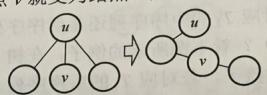
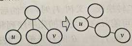
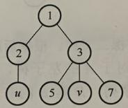
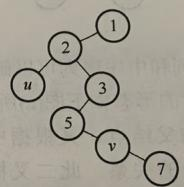
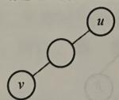
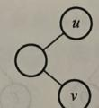
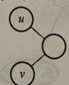
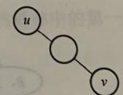
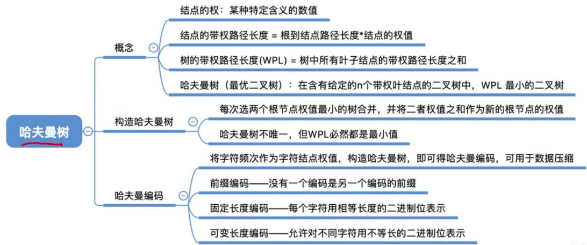

# 第五章 树与二叉树（下）.docx

## 第五章 树与二叉树（下）

## 树、森林：

## 树的存储结构：

## 1. 双亲表示法：

```c
C++
#define Max_Tree_Size 100
typedef struct {
    int data; // 存储节点的实际数据
    // 双亲位置域：记录该节点的父节点在数组中的下标（索引）→ 根节点的 parent 固定为 -1（无父节点）
    int parent;
} PTNode;
typedef struct {
// 存储树的所有节点，数组长度为 Max_Tree_Size(100)，每个元素是一个 PTNode 类型的节点
PTNode nodes[Max_Tree_Size];
// 记录树中实际存在的节点数量（n ≤ Max_Tree_Size），避免遍历整个数组
int n;
} PTTree;
```

## 2.孩子兄弟表示法：

```txt
C++
typedef struct CSNode{
    int data;
    //指针域1：指向该节点的第一个孩子节点
    //指针域2：指向该节点的下一个兄弟节点
    struct CSNode *firstchild,*nextsibling;
}CSNode,*CSTree;
```

## 树的遍历：

## 1. 先根遍历：

先根遍历（Pre-order Traversal），也称为先序遍历，是树遍历的一种核心方式，遍历顺序遵循“根节点 $\rightarrow$ 依次遍历根节点的每一棵子树”的规则，即先访问当前根节点，再递归地对每一棵子树执行先根遍历。

具体步骤：

1. 第一步：访问根节点（输出根节点的数据）；

1. 第二步：按照从左到右的顺序，依次对根节点的每一棵子树进行先根遍历（递归执行上述两步）。

示例说明：假设一棵简单树的结构为“根节点 A → 子树 1（根 B，子节点 D、E）、子树 2（根 C，子节点 F）”，则先根遍历顺序为：A → B → D → E → C → F。

补充说明：先根遍历与二叉树的先序遍历逻辑一致，本质是“先访问根，再遍历子树”，适用于需要优先获取根节点信息的场景（如树的结构复制、节点查找初始化等）。

## 2.后根遍历：

后根遍历（Post-order Traversal），也称为后序遍历，是树遍历的另一种核心方式，与先根遍历顺序相反，遵循“依次遍历根节点的每一棵子树 $\rightarrow$ 根节点”的规则，即先递归地遍历每一棵子树，最后再访问当前根节点。

具体步骤：

1. 第一步：按照从左到右的顺序，依次对根节点的每一棵子树进行后根遍历（递归执行本步骤）；

1. 第二步：访问根节点（输出根节点的数据）。

示例说明：沿用先根遍历的同一棵树（根节点 A → 子树 1（根 B，子节点 D、E）、子树 2（根 C，子节点 F）），则后根遍历顺序为：D → E → B → F → C → A。

补充说明：后根遍历与二叉树的中序遍历逻辑一致，核心是“先遍历子树，再访问根”，适用于需要先处理子节点信息再处理根节点的场景（如树的销毁、子树相关统计等），与先根遍历形成互补。

## 森林的遍历：

## 1. 先序遍历森林：

先序遍历森林（Pre-order Traversal of Forest），本质是对森林中的每一棵树依次执行先根遍历，遍历顺序遵循“先访问第一棵树的根节点 $\rightarrow$ 先序遍历第一棵树的子树 $\rightarrow$ 依次对剩余每棵树执行上述操作”的规则，与树的先根遍历逻辑一脉相承。

具体步骤：

1. 第一步：访问森林中第一棵树的根节点（输出根节点的数据）；

1. 第二步：先序遍历第一棵树的所有子树（递归执行树的先根遍历规则）；

1. 第三步：将剩余的树构成新的森林，重复上述两步，依次对新森林中的每一棵树进行先序遍历。示例说明：假设森林由两棵树组成，树1（根A→子树B，子节点D、E），树2（根C→子节点F、G），则先序遍历森林的顺序为：A→B→D→E→C→F→G。

补充说明：先序遍历森林与先根遍历树的核心逻辑一致，可理解为“逐树执行先根遍历”，适用于需要优先获取每棵树根节点信息的森林操作场景，与后续森林后序遍历形成互补。

## 2. 中序遍历森林：

中序遍历森林（In-order Traversal of Forest），核心是对森林中的每一棵树依次执行对应二叉树的中序遍历逻辑，遍历顺序遵循“中序遍历第一棵树的左子树 $\rightarrow$ 访问第一棵树的根节点 $\rightarrow$ 中序遍历第一棵树的右子树 $\rightarrow$ 依次对剩余每棵树执行上述操作”的规则，是森林遍历中衔接先序、后序的重要方式。

具体步骤：

1. 第一步：中序遍历森林中第一棵树的左子树（递归执行中序遍历规则）；

1. 第二步：访问第一棵树的根节点（输出根节点的数据）；

1. 第三步：中序遍历第一棵树的右子树（递归执行中序遍历规则）；

1. 第四步：将剩余的树构成新的森林，重复上述三步，依次对新森林中的每一棵树进行中序遍历。示例说明：沿用先序遍历森林的同一森林（树1：根A→子树B，子节点D、E；树2：根C→子节点F、G），则中序遍历森林的顺序为：D→B→E→A→F→C→G。

补充说明：中序遍历森林与二叉树的中序遍历逻辑一致，可理解为“逐树执行二叉树中序遍历”，适用于需要中间环节处理节点信息的森林操作场景，与先序、后序遍历森林形成完整的森林遍历体系，三者配合可实现森林的全面节点访问与数据处理。

树和森林的遍历与二叉树遍历的对应关系

<table><tr><td>树</td><td>森林</td><td>二叉树</td></tr><tr><td>先根遍历</td><td>先序遍历</td><td>先序遍历</td></tr><tr><td>后根遍历</td><td>中序遍历</td><td>中序遍历</td></tr></table>

(4)

(3)

(1)

## 题目：

## 题目 1:

【2009 统考真题】（P176）

将森林转换为对应的二叉树，若在二叉树中，结点 u 是结点 v 的父结点的父结点，则在原来的森林中，u 和 v 可能具有的关系是（）。

I. 父子关系

II. 兄弟关系

III. u 的父结点与 v 的父结点是兄弟关系

A. 只有 II

B. I 和 II

C. I 和 III

D. I、II 和 III

情形 I: 若结点 $v$ 是结点 $u$ 的第二个孩子结点, 转换时, 结点 $v$ 就变成结点 $u$ 第一个孩子的右孩子, 符合要求。情形 II: 结点 $u$ 和 $v$ 是兄弟结点的关系, 但二者之中还有一个兄弟结点 $k$ , 则转换后结点 $v$ 就变为结点 $k$ 的右孩子, 而结点 $k$ 则是结点 $u$ 的右孩子, 符合要求。

  
图I

  
图Ⅱ

情形 III: 若结点 u 的父结点与 v 的父结点是兄弟关系，则转换后，结点 u 和 v 分别在两者最左父结点的两棵子树中，不可能出现在同一条路径中。



  
图 III

【另解】由题意可知 u 是 v 的父结点的父结点，如下图所示，有四种情况：



  
(2)





根据树与二叉树的转换规则，将这四种情况转换成树中结点的关系。（1）在原来的树中 u 是 v 的父结点的父结点；（2）在树中 u 是 v 的父结点；（3）在树中 u 是 v 的父结点的兄弟；（4）在树中 u 与 v 是兄弟关系。由此可知选项 I 和 II 正确。

## 树与二叉树的应用：

## 哈夫曼树：

注意：

哈夫曼树的带权路径长度等于其所有分支结点的权值之和

这句话等同于：哈夫曼树的带权路径长度等于所有叶结点的带权路径长度之和

## 知识点：

## 哈夫曼编码的加权平均长度：

哈夫曼编码的加权平均长度怎么求

哈夫曼编码的加权平均长度（平均码长）计算方法

## 1. 核心公式

设字符集为 $\{c_1, c_2, \dots, c_n\}$ ，对应出现频率（或权值）为 $\{w_1, w_2, \dots, w_n\}$ ，对应哈夫曼编码长度为

$\{l_1, l_2, \dots, l_n\}$ ，则加权平均码长为：

$$
\bar {L} = \sum_ {i = 1} ^ {n} w _ {i} \cdot l _ {i}
$$

如果 $w_{i}$ 是概率（和为1），结果就是平均码长；如果是次数/频数，需要再除以总次数：

$$
\bar {L} = \frac {\sum_ {i = 1} ^ {n} w _ {i} \cdot l _ {i}}{\sum_ {i = 1} ^ {n} w _ {i}}
$$

## 2. 计算步骤

1. 统计权值：得到每个字符的出现次数（或概率）。

2. 生成哈夫曼编码：构造哈夫曼树，得到每个字符的编码及编码长度 $l_{i}$ 。

3. 加权求和：按公式计算 $\sum w_{i} \cdot l_{i}$ ，若权值是次数则再除以总次数。

## 知识回顾与重要考点



## 题目：

## 题1:

## 【2022 统考真题】

对任意给定的含 $n(n>2)$ 个字符的有限集S，用二叉树表示S的哈夫曼编码集和定长编码集，分别得到二叉树 $T_{1}$ 和 $T_{2}$ 。下列叙述中，正确的是（）。  
A. $T_{1}$ 与 $T_{2}$ 的结点数相同  
B. $T_{1}$ 的高度大于 $T_{2}$ 的高度  
C.出现频次不同的字符在 $T_{1}$ 中处于不同的层  
D.出现频次不同的字符在 $T_{2}$ 中处于相同的层

## 逐项解析

我们先明确两个核心概念：

\- $T_{1}$ （哈夫曼树）：最优二叉树，只有度为0（叶子）和度为2（非叶子）的结点，叶子结点对应字符，深度（所在层）由字符频次决定（频次越高，路径越短、深度越小）。

\- $T_{2}$ （定长编码树）：满二叉树（或完全二叉树），所有字符编码长度相同，因此所有叶子结点都在同一层。

## 选项A： $T_{1}$ 与 $T_{2}$ 的结点数相同

\- 哈夫曼树 $T_{1}$ ：结点总数 $= 2n - 1$ （ $n$ 个叶子结点， $n - 1$ 个非叶子结点）。

\- 定长编码树 $T_{2}$ ：是一棵满二叉树，叶子数为 $n$ ，设高度为 $h$ ，则 $2^{h - 1} < n \leq 2^h$ ，结点总数 $= 2^{h} - 1$ 。

\- 举例： $n = 3$ 时， $T_{1}$ 结点数 $= 2 \times 3 - 1 = 5$ ； $T_{2}$ 需满足 $2^{2 - 1} < 3 \leq 2^{2}$ ，即 $h = 2$ ，结点数 $= 2^{2} - 1 = 3$ 。

\- 结论：结点数不同，A 错误。

## 选项B： $T_{1}$ 的高度大于 $T_{2}$ 的高度

\- 哈夫曼树的高度取决于权值分布，极端情况下（如权值极度不均衡）高度会很大，但也存在特殊情况：

例如 $n = 4$ ，字符频次为 $\{1,1,1,1\}$ ，构造的哈夫曼树高度为3；定长编码树 $h = 2$ （ $2^2 = 4$ 个叶子），

此时 $T_{1}$ 高度 $>T_{2}$ 高度。

但如果 n = 3，定长编码树 h = 2，哈夫曼树高度也为 2，此时两者高度相等。

\- 结论：不一定大于，存在相等的情况，B 错误。

## 选项C：出现频次不同的字符在 $T_{1}$ 中处于不同的层

\- 哈夫曼树中，频次相近的字符可能处于同一层。

例如 n = 4，频次为 $\{3, 3, 2, 2\}$ ，构造哈夫曼树时，两个频次为 2 的结点先合并为 4，再与两个频次为 3 的结点合并，最终两个频次为 3 的叶子会处于同一层。

\- 结论：频次不同也可能同层，C 错误。

## 选项D：出现频次不同的字符在 $T_{2}$ 中处于相同的层

\- 定长编码的核心是所有字符编码长度相同，这意味着从根到每个叶子结点的路径长度（深度）完全一致。

\- 因此，无论字符频次是否相同，所有叶子结点都在同一层。

\- 结论：D 正确

## 题2:

## 【2015 统考真题】

下列选项给出的是从根分别到达两个叶结点路径上的权值序列，能属于同一棵哈夫曼树的是（）。

A. 24, 10, 5 和 24, 10, 7

B. 24, 10, 5 和 24, 12, 7

C. 24, 10, 10 和 24, 14, 11

D. 24, 10, 5 和 24, 14, 6

这道题考察哈夫曼树的核心性质：

1. 哈夫曼树中只有 \*\* 度为 0（叶子结点）和度为 2（非叶子结点）\*\* 的结点，没有度为 1 的结点。

2. 每次合并都是选取权值最小的两个结点，生成一个新的父结点（权值为两者之和）。

3. 从根到任意叶子结点的路径权值之和，等于该叶子结点的原始权值（因为每次合并都是累加）。

4. 同一棵哈夫曼树中，所有非叶子结点的权值，一定是由两个更小的子结点权值相加得到的。

## 并查集：

并查集的实现：

并查集的结构定义：

```txt
C++
//采用了类似树的双亲表示法
#define Size 100
int UFSets[Size]
```

## 并查集的初始化操作：

```txt
C++
void Initial(int S[]) {
    for (int i = 0; i < Size; i++) {
    s[i] = -1;
    }
}
```

## 并查集 Union 操作:

```c
C++
void Union(int S[], int Root1, int Root2) {
    if (Root1 == Root2) return;
    // 把 Root2 的父节点设置为 Root1
    S[Root2] = Root1; // 将根 Root2 连接到另一根 Root1 下面
}
// 时间复杂度为 0(1)
```

## 并查集的 find 操作:

```c
C++
//对于节点 i:
//如果 S[i] < 0: 说明 i 是根节点，S[i] 的绝对值表示这棵树的节点个数（也可以只标记为 -1，仅表示根）。
//如果 S[i] >= 0: 说明 i 不是根节点，S[i] 的值是 i 的父节点下标
int Find(int S[], int x) {
    while(S[x]>=0)
    x=S[x]; //向上找父节点
    return x;
}
//时间复杂度为 0(d)
//其中 d 为树的深度
```

## 并查集实现的优化：

## 改进 Union 操作:

```c
C++
//小树合并到大树
//根结点的绝对值保存集合树中的成员数量
void Union(int S[], int Root1, int Root2){
    if(Root1 == Root1) return;
    if(S[Root1] > S[Root2]) { // Root1 的树结点少
    S[Root2] += S[Root1];
    S[Root2] = Root1;
    } else {
    S[Root1] += S[Root2];
    S[Root1] = Root2;
    }
}
//采用这种方法构造得到的树，其深度不超过 ceil(log2N) + 1
```

## 改进 Find 操作:

```c
C++
//x 是待查找根节点的目标元素
int Find(int S[], int x) {
    int root = x;
    while (S[root] >= 0) root = S[root]; // 循环找到根
    while (x != root) {
    int t = S[x]; // ① 保存 x 当前的父节点到临时变量 t
    S[x] = root; // ② 核心：把 x 的父节点直接改成根节点（压缩）
    x = t; // ③ 让 x 走到原来的父节点位置，继续处理下一个节点
    }
    return root;
}
```

用数组、双亲表示法来描述元素之间的集合关系。根节点为-1，非根节点指向父节点下标。

Find (int S[], x) ——找到x所属集合
Union(int S[], int x, int y) ——将x、y
所属集合合并


(注：部分内容可能由 AI 生成)

最坏时间复杂度：

Union 优化

Find 操作 = 最坏树高 = O(n)

将n个独立元素通过多次Union合并为一个集合—— $O(n^{2})$

## 并查集的优化

用根节点的负值表示一棵树的结点总数

每次 Union 操作让小树合并到大树根节点下面


Find 优化

最坏时间复杂度：

最坏时间复杂度：

Find 操作=最坏树高= $O(\log_{2}n)$

“压缩路径”的策略，每次Find操作先找到x所属根节点，再将查找路径上的所有结点都直接挂在根节点下面

将n个独立元素通过多次Union合并为一个集合—— $O(n\log_{2}n)$

Find 操作=最坏树高= $O(\alpha(n))$

将n个独立元素通过多次Union合并为一个集合——O(n α(n))
