# 第八章 排序.docx

## 第八章 排序

## 排序的基本概念：

## 知识点：

1. 内部排序算法的性能取决于算法的时间复杂度和空间复杂度，而时间复杂度一般是由比较和移动次数决定的。

2. 并不是所有的内部排序算法都要基于比较操作，基数排序就不基于比较操作。

内部排序和外部排序的核心区别在于：待排序的数据能否全部放入计算机的内存中。

## 1. 内部排序

\- 定义：待排序的数据量较小，可以一次性全部加载到内存中进行排序。

\- 特点：

所有比较和交换都在内存中完成，速度非常快。

\- 可以直接访问任何数据（随机访问）。

\- 常见算法：快速排序、归并排序、堆排序、冒泡排序、插入排序等。

## 2. 外部排序

\- 定义：待排序的数据量极大（如几TB的日志文件），无法一次性装入内存，必须借助磁盘（或SSD）等外部存储进行排序。

\- 核心流程（通常分两步）：

1. 分段排序：将大文件分成若干个小块，分别读入内存用内部排序排好，再写回磁盘（这些排好序的小块叫“顺串”）。

2. 多路归并：同时将多个顺串读入内存，不断地比较每个顺串当前最小的记录输出到结果文件，从而实现整体有序。

\- 关键开销：磁盘I/O（读写文件）远比内存操作慢，因此外部排序的优化重点是减少磁盘读写次数（常用算法是多路归并和置换选择排序）。

## 简单类比

\- 内部排序：像在书桌上整理几十张卡片，随手就能翻看排序。

\- 外部排序：像整理一个图书馆的几万册书，书桌放不下。需要先把书分批在桌面上排好放回仓库（分段排序），再反复从仓库拿几堆书的“第一本”出来比较顺序。

## 总结表格

<table><tr><td>维度</td><td>内部排序</td><td>外部排序</td></tr><tr><td>数据量</td><td>可全部装入内存</td><td>远超内存容量</td></tr><tr><td>存储介质</td><td>内存</td><td>内存 + 磁盘文件</td></tr><tr><td>速度</td><td>快(纳秒/微秒级)</td><td>慢(受磁盘I/O毫秒级延迟影响)</td></tr><tr><td>典型算法</td><td>快排、堆排</td><td>多路归并、置换选择排序</td></tr></table>

4.

## 1. 绝对位置

\- 定义：基于一个固定、唯一的参照系（如经纬度、坐标系原点）所定义的、不随观察者改变的位置。

\- 特点：

\- 客观：在一个给定的坐标系下，它是恒定不变的。

唯一：描述的是物体在空间或系统中的“绝对地址”。

\- 生活例子：

地球：东经 $116.4^{\circ}$ ，北纬 $39.9^{\circ}$ （指向北京天安门，这个坐标固定不变）。

建筑：上海市南京东路123号（这个门牌号是法律认可的固定地址）。

○ 电影票：第8排第12座（座位编号是固定的）。

## 2. 相对位置

\- 定义：相对于某个参考点（该参考点本身可能正在移动或变化）所描述的位置。

\- 特点：

○ 主观：描述的是物体之间的“关系”。

可变：如果参考点移动了，即使物体没动，描述结果也会改变。

\- 生活例子：

○ 指路：我在肯德基的左边（如果肯德基搬家了，这个描述就失效了）。

○ 乘车：我的左边是王先生（你转身后，左边的人就变了）。

文件路径：../images/pic.jpg（表示“上一级目录下的图片”，具体指向取决于当前文件所在位置，

绝对位置是指原来在什么位置，排序后就在什么位置，位置没有发生变化。

你提供的这句话“对同一线性表使用不同的排序算法进行排序，得到的排序结果可能不同”是正确的。

这背后最核心的原因是：当线性表中存在两个（或更多）相等的元素时，不同的排序算法在处理这些相等元素的“相对先后顺序”上策略不同。

## 插入排序:

## 直接插入排序：

```txt
C++
void InsertSort(ElemType A[], int n) {
    int i, j;
    for (i = 2; i <= n; i++) { // 依次将 A[2] - A[n] 插入前面已排序序列
    if (A[i] < A[i - 1]) { // 若 A[i] 关键码小于其前驱，将 A[i] 插入有序表
    A[0] = A[i]; // 复制为哨兵，A[0] 不存放元素
    for (j = i - 1; A[0] < A[j]; -- j) { // 从后往前查找待插入位置
    A[j + 1] = A[j]; // 向后移位
    }
    A[j + 1] = A[0]; // 复制到插入位置
    }
}
```

最好： $O(n)$

最坏： $O(n^{2})$

辅助空间： $O(1)$

直接插入排序算法的性能分析如下：

空间效率: 仅使用了常数个辅助单元, 因而空间复杂度为 $O(1)$ 。

时间效率：在排序过程中，向有序子表中逐个地插入元素的操作进行了 n-1 趟，每趟操作都分为比较关键字和移动元素，而比较次数和移动次数取决于待排序表的初始状态。

在最好情况下，表中元素已经有序，此时每插入一个元素，都只需比较一次而不用移动元素，因而时间复杂度为 $O(n)$ 。

在最坏情况下，表中元素顺序刚好与排序结果中的元素顺序相反（逆序），总的比较次数达到最大，总的移动次数也达到最大，总的时间复杂度为 $O(n^{2})$ 。

平均情况下，考虑待排序表中元素是随机的，此时可以取上述最好与最坏情况的平均值作为平均情况下的时间复杂度，总的比较次数与总的移动次数均约为 $n^{2}/4$ 。

因此，直接插入排序算法的时间复杂度为 $O(n^{2})$ 。

稳定性：因为每次插入元素时总是从后往前先比较再移动，所以不会出现相同元素相对位置发生变化的情况，即直接插入排序是一个稳定的排序算法。

适用性: 直接插入排序适用于顺序存储和链式存储的线性表, 采用链式存储时无须移动元素。

直接插入排序的空间效率（空间复杂度）是 O(1)。

## 原因：

它只需要常数级别的额外存储空间，通常仅使用一个临时变量（称为“哨兵”或“暂存单元”）来保存当前要插入的元素。整个排序过程是在原数组上直接进行元素移动和插入，不需要借助与数组规模相关的额外辅助数组。因此，无论待排序数据量多大，其额外占用空间大小固定不变。

快速排序、直接插入排序的比较次数，都和序列初始状态密切相关。

## 一、直接插入排序

比较次数

\- 最好情况（已正序）

每个元素只需和前一个比较 1 次

总比较次数: n- 1 次

时间复杂度：O(n)

\- 最坏情况（逆序）

第i个元素要比较i次

总比较次数: $n(n - 1)/2$

时间复杂度: $O(n^{2})$

\- 一般情况

比较次数介于两者之间，平均 $O(n^{2})$

一句话：越有序，插入排序越快。

直接插入排序是一个稳定的排序算法。

直接插入排序适用于顺序存储和链式存储的线性表，采用链式存储时无须移动元素。

折半插入排序：

## 折半插入排序思想

折半插入排序是直接插入排序的改进版，核心思路一句话概括：

插入位置用折半查找来找，元素移动仍然照旧。

## 具体思想

## 1. 将数组分为两部分

左边是已排序区间，右边是未排序区间，初始时已排序区间只有第一个元素。

## 2. 取未排序的第一个元素

记为key，要把它插入到已排序区间的合适位置。

## 3. 折半查找插入位置

不再像直接插入那样一个个往前比，

而是在已排序区间内用二分查找快速定位 key 应该插入的下标。

→ 这一步减少了比较次数。

## 4. 移动元素 + 插入

找到位置后，把该位置后面的元素统一向后挪一位，

再把 key 放入。

$\rightarrow$ 移动次数和直接插入排序完全一样。

```c
C++
void InsertSort(ElemType A[], int n) {
    //A[0]不放元素，待排序数据从A[1]开始
    int i, j, low, high, mid;
    for (i = 2; i <= n; i++) { //依次将A[2]~A[n]插入前面的已排序序列
    A[0] = A[i]; // 将A[i]暂存到A[0]
    low = 1;
    high = i - 1;
    while (low <= high) { //折半查找（默认递增有序）
    mid = (low + high) / 2;
    if (A[mid] > A[0]) high = mid - 1;
    else low = mid + 1;
}
```

```txt
}
//这段代码是递增排序，折半查找结束时：
//low = high + 1
//high 指向最后一个 小于 / 等于 待插入值的位置
//high + 1 就是待插入元素的最终位置
for(j=i-1;j>=high+1;--j){
    A[j+1]=A[j]; //统一后移元素，空出插入位置
}
A[high+1]=A[0]; //插入元素
}
```

最好： $O(n)$

最坏： $O(n^{2})$

平均： $O(n^{2})$

辅助空间： $O(1)$

在折半插入排序（Binary Insertion Sort）中，时间复杂度为 O(n log n) 的部分是元素的比较次数。

具体来说:

\- 比较次数：在已排好序的部分中，利用折半查找确定插入位置，每一次查找的比较次数约为 $\lceil \log_2 i \rceil$ ，因此总比较次数为：

$$
\sum_ {i = 1} ^ {n - 1} \lceil \log_ {2} i \rceil \approx O (n \log n)
$$

\- 移动次数：即使比较次数减少了，元素的移动次数依然和直接插入排序一样，最坏情况下为 $O(n^2)$ （例如逆序时，每次插入都需要移动大量元素）。

所以“折半插入排序的复杂度为 $O(n \log n)$ ”这种说法是不准确的。

准确的说法是：折半插入排序的比较次数为 $O(n \log n)$ ，但整体时间复杂度仍然是 $O(n^2)$ ，因为移动操作占主导。

折半插入排序仅适用于顺序存储的线性表

折半插入排序是一种稳定的排序算法。

## 希尔排序：

希尔排序的核心思想：

分组插入排序 + 逐步缩小增量，最终整体直接插入排序

## 一、基本思想

## 1. 选增量 (步长)

取一个间隔值 gap，把数组按这个间隔分成多组。

比如 gap=5，下标为 0,5,10...、1,6,11... 各为一组。

## 2. 组内插入排序

对每一组分别做插入排序，让数组整体“基本有序”。

## 3. 缩小增量重复

不断减小 gap（通常减半），重复分组、插入排序。

## 4. 最终 gap=1

当 gap=1 时，就是一次普通的直接插入排序，此时数组已经接近有序，效率很高。

## 二、一句话总结

先通过大增量让数组宏观有序，再用小增量精细调整，最后整体插入排序完成。

```txt
C++
void ShellSort(ElemType A[], int n) {
    //A[0]只是暂存单元，不是哨兵，当j<=0时，插入位置已到
    int dk, i, j;
    for (dk=n/2; dk>=1; dk=dk/2) {
    for (i = dk + 1; i <= n; ++i) {
    if (A[i] < A[i - dk]) { //将A[i]插入有序增量子表
    A[0] = A[i];
    for (j = i - dk; j > 0 && A[0] < A[j]; j -= dk)
    A[j + dk] = A[j]; //计录后移，查找插入的位置
    A[j + dk] = A[0]; //插入
    }
    }
```

```txt
}
}
```

```txt
C ^  
// 这三行是一个整体  
A[0] = A[i]; // 把要插入的数暂存起来  
for(j = i - dk; j > 0 && A[0] < A[j]; j -= dk)  
    A[j + dk] = A[j]; // 把前面的数往后“挪位”  
A[j + dk] = A[0]; // 把数插入到正确位置
```

## 一、先搞懂这几行在干什么

希尔排序的本质：

把数组按间隔 dk 分成好几组，对每一组做【直接插入排序】

你看不懂的这几行，就是【直接插入排序】的核心逻辑：

1. 拿到一个待插入的数 A[i]

2. 把它和同一组、前面的数 A[i-dk] 比较

3. 如果前面的数更大，就往后挪

4. 直到找到比它小的数，把它插进去

4. A[j+dk] = A[0];

循环结束时:

\- j 已经指向第一个比 A [0] 小的数

\- 或者 $j <= 0$ （已经到最前面）

所以:

\- j + dk 就是最终要插入的位置

\- 把暂存的 A[0] 放进去，插入完成

<table><tr><td rowspan="2">排序类别</td><td rowspan="2">排序算法</td><td colspan="3">时间复杂度</td><td rowspan="2">辅助空间复杂度</td><td rowspan="2">稳定性</td></tr><tr><td>最好</td><td>最坏</td><td>平均</td></tr><tr><td rowspan="3">插入排序</td><td>直接插入排序</td><td> $O(n)$ </td><td> $O(n^{2})$ </td><td> $O(n^{2})$ </td><td> $O(1)$ </td><td>稳定</td></tr><tr><td>折半插入排序</td><td> $O(n)$ </td><td> $O(n^{2})$ </td><td> $O(n^{2})$ </td><td> $O(1)$ </td><td>稳定</td></tr><tr><td>希尔排序</td><td> $O(n)$ </td><td> $O(n^{2})$ </td><td> $O(n^{1.3})$ </td><td> $O(1)$ </td><td>不稳定</td></tr></table>

希尔排序是一种不稳定的排序算法。

希尔排序仅适用于顺序存储的线性表。

## 交换排序：

## 冒泡排序：

```txt
C++
void swap(int &a, int &b){
    int temp = a;
    a = b;
    b = temp;
}

//单项冒泡排序
void BubbleSort(ElemType A[], int n){
    for (int i = 0; i < n - 1; i++) { // i 表示已经确定位置的元素个数，最多需要 n - 1 轮冒泡
    bool flag = false; // 表示本趟冒泡是否发生交换的标志
    for (int j = n - 1; j > i; j--) { // 一趟冒泡过程，从后往前，先把小的排好
    if (A[j - 1] > A[j]) {
    swap(A[j - 1], A[j]);
    flag = true;
    }
    }
    if (flag == false) return; // 本趟遍历后没有发生交换，说明表已经有序
    }
}
```

```txt
//双向冒泡排序（鸡尾酒排序）
void BidirectionalBubbleSort(ElemType A[], int n) {
    int left = 0;    // 左边界
    int right = n - 1;    // 右边界
    bool flag = true;    // 是否发生交换的标志

    while (flag && left < right) {
    flag = false;    // 重置标志

    // 正向冒泡（从左到右），将最大值移动到右边界
    for (int i = left; i < right; i++) {
    if (A[i] > A[i + 1]) {
    swap(A[i], A[i + 1]);
    flag = true;
    }
    }
    right--;    // 右边界左移

    if (!flag) break;    // 如果没有交换，说明已有序

    flag = false;    // 重置标志

    // 反向冒泡（从右到左），将最小值移动到左边界
    for (int j = right; j > left; j--) {
    if (A[j - 1] > A[j]) {
    swap(A[j - 1], A[j]);
    flag = true;
    }
    }
    left++;    // 左边界右移
    }
}
```

# 冒泡排序 效率和稳定性总结

冒泡排序适用于顺序存储结构和链式存储的线性表。

原因：冒泡排序只做相邻元素之间的交换，所以链式存储也适合。

有关系，而且关系非常大。

冒泡排序的排序过程中的比较次数与序列初始状态有关嘛

简单直接结论：

冒泡排序的比较次数，完全取决于序列的初始有序程度。

1. 最好情况（已经有序）

序列：1 2 3 4 5

\- 只需一轮遍历，发现没有交换，直接结束

\- 比较次数: n-1 次

2. 最坏情况（完全逆序）

稳定性：稳定

辅助空间: $O(1)$

最好: $O(n)$

平均: $O(n^{2})$

\- 每一轮都要比较到末尾

\- 比较次数: $n(n - 1) / 2$ 次

最坏: $O(n^{2})$

序列：54321

比较次数介于上面两者之间。

3. 一般情况 (乱序)

快速排序：

## 快速排序思想

核心一句话：选一个基准数，把比它小的放左边、比它大的放右边，再递归处理左右两部分。

## 1. 基本思想（分治）

## 1. 选基准 pivot

从数组里随便选一个数作为基准（常用：第一个、最后一个、中间数）。

## 2. 分区 partition

遍历数组，把小于基准的放到左边，大于基准的放到右边，基准最终落在它最终排序后的正确位置。

## 3. 递归排序

对左边子数组、右边子数组分别重复上面两步，直到子数组长度为0或1，就已经有序。

## 2. 通俗理解

就像站队：

\- 拉一个人当“标杆”

\- 比他矮的站左边，高的站右边

\- 再分别对左边一堆、右边一堆做同样的事

\- 最后整体自然有序

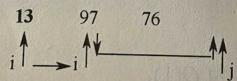

## 8.3.2 快速排序

## 命题追踪 快速排序的思想（2024）

快速排序的基本思想：在待排序表 L[1...n] 中任取一个元素 pivot 作为枢轴（或称基准，通常取首元素），通过一趟排序将待排序表划分为独立的两部分 L[1...k-1] 和 L[k+1...n]，使得 L[1...k-1] 中的所有元素小于 pivot，L[k+1...n] 中的所有元素大于或等于 pivot，则 pivot 放在了其最终位置 L(k) 上，这个过程称为一次划分。然后分别递归地对两个子表重复上述过程，直至每部分内只有一个元素或为空为止，即所有元素放在了其最终位置上。

一趟快速排序的过程是一个交替搜索和交换的过程，下面通过实例来介绍，附设两个指针i和j，初值分别为low和high，取第一个元素49为枢轴赋值到变量pivot。

指针 j 从 high 往前搜索找到第一个小于枢轴的元素 27，将 27 交换到 i 所指位置。
pivot
∥
49 38 65 97 76 13 27 49
↑↓
i ↑↓ j ↑ ↓ j

指针 i 从 low 往后搜索找到第一个大于枢轴的元素 65，将 65 交换到 j 所指位置。
27 38 65 97 76 13 49
i ↑ → i ↓ ↑ ↑ i

指针 j 继续往前搜索找到小于枢轴的元素 13，将 13 交换到 i 所指位置。
27 38 97 76 13 65 49
i ↑ ↑ ↓ ↑ ↓ ↑ ↓

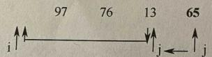

指针 i 继续往后搜索找到大于枢轴的元素 97，将 97 交换到 j 所指位置。
27 38 13 97 76 65 49

指针 j 继续往前搜索小于枢轴的元素，直至 i==j。
27 38 13 76 97 65 $\overline{49}$

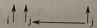

用二叉树的形式描述这个快速排序示例的递归调用过程，如图 8.4 所示。

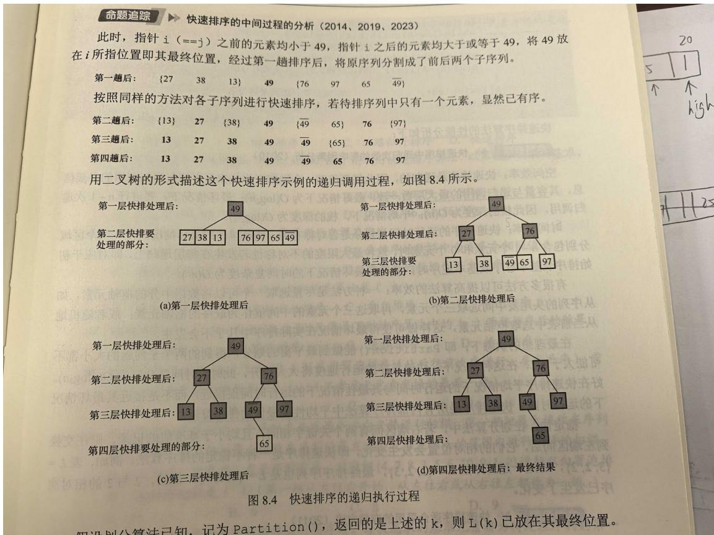

但设划分算法已知，记为 Partition()，返回的是上述的 k，则 L(k) 已放在其最终位置。

```c
C++
//划分算法
int Partition(ElemType A[], int low, int high) {
    ElemType pivot = A[low]; // 将当前表中第一个元素设为枢轴，对表经行划分
    while (low < high) {
    while (low < high && A[high] >= pivot) -- high;
    A[low] = A[high]; // 将比枢轴小的元素移动到左端
    while (low < high && A[low] <= pivot) ++ low;
    A[high] = A[low]; // 将比枢轴大的元素移动到右端
    }
    A[low] = pivot; // 枢轴元素存放到的最终位置
    return low; // 返回存放枢轴的最终位置
}

void QuickSort(ElemType A[], int low, int high) {
    if (low < high) {
    int pivot pos = Partition(A, low, high);
    QuickSort(A, low, pivot pos - 1);
    QuickSort(A, pivot pos + 1, high);
    }
```

时间复杂度

辅助空间复杂度

最好: $O(n \log_2 n)$

最好: $O(\log_2 n)$

最坏: $O(n^{2})$

最坏: $O(n)$

平均: $O(\mathrm{n}\log_{2}n)$

平均: $O(\log_2 n)$

不稳定

## 二、快速排序

比较次数

快排取决于基准值（pivot）选得好不好，本质还是和初始序列有关。

\- 最好情况（每次基准都能均分序列）

每次划分近乎均匀

比较次数: $O(n \log n)$

时间复杂度: $O(n \log n)$

\- 最坏情况（已正序 / 逆序，选首尾为基准）

每次划分极度不均匀，退化成类似冒泡

比较次数: $\mathbf{O}(\mathbf{n}^{2})$

时间复杂度: $\mathbf{O}(\mathbf{n}^{2})$

\- 平均情况

O(n log n)

一句话：原本有序的序列，对快排反而是最坏情况。

为什么对已经有序的数组，每次选第一个或最后一个做 pivot，快排会退化到 $O(n^2)$ 。

## 1. 先回忆快排怎么做

快速排序的核心步骤：

1. 选一个 pivot (基准值)

2. 把数组分成两部分：

○ 左边: ≤ pivot

\- 右边: $\geq$ pivot

3. 递归排序左、右两部分

关键问题：

如果每次划分都极度不均匀，一边几乎空，一边几乎满，递归就会退化成链表式遍历。

## 7. 一句话总结为什么会 $O(n^{2})$

因为：

## 有序数组 + 每次选首尾做 pivot → 每次划分都极度不均匀

→ 递归深度变成 n 层

→ 每层都要扫描接近 n 个元素

→ 总复杂度就是 $\mathbf{O}(\mathbf{n}^{2})$

## 8. 怎么避免?

很简单：

\- 随机选 pivot

\- 或者选三数取中 (left, mid, right 中间值)

这样几乎不会出现极端划分，就能稳定保持 O(n log n)

## 快速排序的空间复杂度为什么是 O (log n) (有的地方也说 O (n))

我用最清晰、考研 / 面试标准的说法给你讲一遍。

快速排序的空间复杂度到底来自哪里？

快排本身不需要额外数组，是原地排序。

它的空间开销只来自递归调用栈。

## 1. 最好 / 平均情况: O (log n)

每次选 pivot 都把数组分成大致均匀的两半。

\- 数组长度 $n$

\- 递归深度 $\approx$ 二叉树高度 $= \log_2 n$

\- 每层只需要常数空间

\- 总空间复杂度 = O(log n)

这是标准、最常考的答案。

## 2. 最坏情况: O (n)

就是你刚才问的场景：

数组已经有序，每次选首尾做 pivot

结果：

\- 每次只分出 1 个元素，剩下 n-1

\- 递归深度变成 n 层

\- 栈空间 $= \mathbf{O}(\mathbf{n})$

## 3. 一句话总结（考试必背）

\- 快速排序不使用额外数组，空间来自递归栈

\- 平均 / 最好: O(log n)

\- 最坏: $O(n)$

\- 非递归实现可以做到O(1)额外空间（但几乎不考）

快速排序是递归的，因此需要借助一个递归工作栈来保存每层递归调用的必要信息，其容量与递归调用的最大层数一致。

快速排序是所有内部排序算法中平均性能最优的排序算法。

快速排序仅适用于顺序存储的线性表。

快速排序在要排序的数据已基本有序的情况下最不利于发挥其长处。

## 知识点：

## 1.各排序算法每趟后的关键特征

## 二、各排序算法每趟后的关键特征（常考点）

<table><tr><td>排序算法</td><td>第k趟后的特征(k从1开始)</td><td>常见坑点</td></tr><tr><td>冒泡排序</td><td>最后k个元素是全局最大的k个,且已有序(升序时最大在末尾)。</td><td>注意:如果一趟无交换,算法可能提前结束;但考试默认执行完整趟数。</td></tr><tr><td>简单选择排序</td><td>前k个元素是全局最小的k个,但前k个内部不一定有序。</td><td>例如:第2趟后,前2个是全局最小和次小,但它们的相对顺序可能是[次小,最小]吗?不能,因为每次选最小放到前面,所以前k个最终位置已定且递增。</td></tr><tr><td>直接插入排序</td><td>前k+1个元素(或前几个)是局部有序的(相对于原序列的前缀),但后面还乱。更准确说:前k+1个元素是原序列前k+1个元素经过插入排序后的有序结果。</td><td>不能只看大小有序,要看它们是否是由原序列前几个元素重排得到。</td></tr><tr><td>希尔排序</td><td>很难直接看,一般考“哪个不可能是希尔某一趟结果”。解法:对给定增量d,检查每个分组内是否有序。</td><td>必须知道增量,常考d=5,3,1等。</td></tr><tr><td>归并排序</td><td>第k趟:所有长度为 $2^k$ 的子序列内部有序。</td><td>例如第1趟:每2个有序;第2趟:每4个有序。</td></tr><tr><td>快速排序</td><td>第k趟后,至少有一个(通常是多个)元素处于最终位置,且其左右子序列划分正确。</td><td>不能只看某个元素的位置,要看它是否把序列分成左边≤它≤右边。</td></tr><tr><td>堆排序</td><td>第k趟后:执行了k次“输出堆顶+调整”后,序列末尾有k个全局最大/最小元素(升序时末尾是最大k个)。</td><td>注意:堆排序中“第k趟”常指第k次输出后的状态。</td></tr></table>

## 2.k 趟快速排序后的特征

对 n 个元素进行第一趟快速排序后，会确定一个基准元素，根据这个基准元素在数组中的位置，有两种情况：①基准元素在数组的首端或尾端，接下来对剩下的 n-1 个元素构成的子序列进行第二趟快速排序，再确定一个基准元素。这样，在两趟排序后就至少能确定两个元素的最终位置，其中至少有一个元素是在数组的首端或尾端。②基准元素不在数组的首端或尾端，第二趟快速排序对基准元素划分开的两个子序列分别进行一次划分，两个子序列各确定一个基准元素。这样，两趟排序后就至少能确定三个元素的最终位置

## 选择排序：

## 简单选择排序：

给我讲讲什么是简单选择排序

简单选择排序（Simple Selection Sort）

一句话概括：每次从待排序区间里挑出最小（或最大）的元素，放到已排序区间的末尾，重复直到全部有序。

## 1. 核心思想

\- 把数组分成两部分：左边已排序，右边未排序

\- 每一轮:

1. 遍历未排序部分，找到最小值的下标

2. 把这个最小值和未排序部分第一个元素交换

3. 已排序区间长度 + 1，未排序区间长度 - 1

\- 一共执行 n-1 轮

```txt
C++
void SelectSort(ElemType A[], int n){
    for (int i = 0; i < n - 1; i++) {
    int min = i;
    for (int j = i + 1; j < n; j++) {
    if (A[j] < A[min]) min = j;
    }
    if (min != i) swap(A[i], A[min]);
    }
}
```

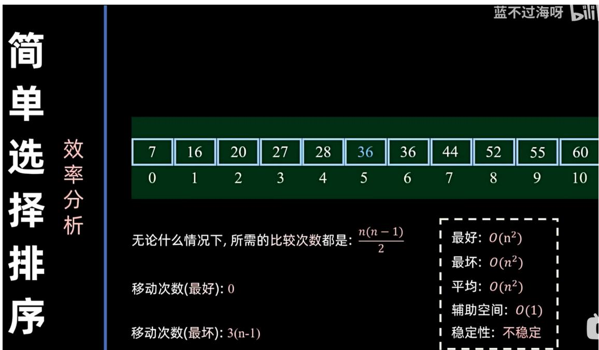

移动次数(最好): 0

移动次数(最坏): 3(n-1)

简单选择排序适用于顺序存储和链式存储的线性表，以及关键字较少的情况。

简单选择排序与序列的初始状态无关吗

是的，简单选择排序的比较次数与序列初始状态基本无关，但移动次数有关。

## 核心结论

1. 比较次数

无论序列原本是正序、逆序还是乱序，

简单选择排序都要完整比较一遍，找出最小值。

→ 比较次数固定为 n(n-1)/2，与初始状态无关。

2. 移动次数

\- 正序时：移动最少（几乎不用交换）

\- 逆序时：移动最多

→ 移动次数与初始状态有关

3. 时间复杂度

因为比较占主导，所以：

○ 最好、最坏、平均时间复杂度都是 $O(n^{2})$

常被说成：简单选择排序性能与序列初始排列无关

## 堆排序：

堆排序的核心思想可以用一句话概括：

利用「完全二叉树结构的堆」这种数据结构，将待排序序列调整成堆，反复取出堆顶最大/最小元素，最终得到有序序列。

## 一、基本思想

## 1. 建堆

把无序数组看成一棵完全二叉树，从最后一个非叶子结点开始，自下而上调整，使其成为一个大顶堆（或小顶堆）。

\- 大顶堆：堆顶元素是整个堆的最大值

\- 小顶堆：堆顶元素是整个堆的最小值

## 2. 交换 + 调整

\- 将堆顶元素与当前堆的最后一个元素交换，最大值就“沉”到数组末尾。

\- 排除最后这个已排好序的元素，对前面剩余元素重新调整成堆。

## 3. 重复

不断重复“交换堆顶 + 调整堆”，直到整个数组有序。

## 二、一句话总结流程

先建堆 $\rightarrow$ 每次拿堆顶最值放到末尾 $\rightarrow$ 缩小堆范围再调整 $\rightarrow$ 直到全部有序

n 个关键字序列 L[1……n] 称为堆，其中下表从 1 开始。堆是一个完全二叉树。n 个结点的完全二叉树，最后一个结点是第 floor(n/2) (向下取整) 个结点的孩子。

## 堆（Heap）是什么 & 堆的特点

堆是一种完全二叉树结构，通常用数组实现，分为大顶堆和小顶堆，是优先队列的经典实现。

## 一、堆的定义

## 1. 大顶堆（最大堆）

父节点值 $\geq$ 左右子节点值，堆顶是最大值。

## 2. 小顶堆（最小堆）

父节点值 $\leq$ 左右子节点值，堆顶是最小值。

## 二、堆的核心特点

## 1. 结构上是完全二叉树

\- 除最后一层外，其他层节点都满

\- 最后一层节点靠左排列

→ 因此可以用数组紧凑存储，不需要指针。

## 2. 堆序性（关键性质）

任意父节点 $\geq$ 或 $\leq$ 子节点，保证堆顶永远是极值。

## 3. 不保证左右子树大小关系

堆不是二叉搜索树，左孩子不一定小于右孩子，只保证父子关系。

## 4. 高效的极值获取

○ 取堆顶（最大 / 最小）：O(1)

\- 插入元素: $O (\log n)$

○ 删除堆顶: $O (\log n)$

## 5. 数组下标规律（常用）

下标从 0 开始:

\- 父节点i的左孩子: $2 \mathrm{i} + 1$

\- 父节点 i 的右孩子: $2 \mathrm{i} + 2$

○ 子节点 i 的父节点： $[(i-1)/2]$

## 三、典型用途

\- 堆排序（时间复杂度 O (n log n)）

\- 优先队列

\- Top-K 问题 (求前 K 大 / 前 K 小)

\- 合并 K 个有序链表

\- Dijkstra、Prim 等算法优化

## 对，堆的查找效率比顺序表（普通数组）还要低得多。

简单直接结论：

\- 顺序表查找: O(n)

\- 堆查找：O(n)，但常数更大、更慢

## 为什么堆查找更慢？

1. 堆本质还是数组，但结构更乱

堆只保证：

\- 父节点 $\geq$ 子节点（大顶堆）

○ 不保证左右子树有序

\- 不保证整体有序

所以不能二分查找，只能从头到尾遍历。

## 2. 顺序表是连续线性扫一遍

堆查找虽然也是遍历，但因为是树结构思维遍历，

访问节点时要算下标、跳转，实际开销比顺序表大。

## 1. 时间复杂度一样

\- 顺序表查找: $O(n)$

\- 堆查找: $O(n)$

从算法复杂度理论上，两者同级，没有谁比谁更低。

## 2. 但实际运行速度：堆更慢

原因很简单：

\- 顺序表是连续内存，CPU预读友好，遍历极快。

\- 堆虽然也存在数组里，但你按树的逻辑遍历（父 $\rightarrow$ 左 $\rightarrow$ 右），访问是跳跃式的，缓存不友好，实际更慢。

## 3. 考试 / 考研怎么答?

如果题目问：

堆的查找效率比顺序表低吗？

标准回答是：

\- 理论复杂度相同，都是 O (n)

\- 但堆不支持二分查找，实际效率更低

```c
C++
建立大根堆的算法
void BuildMaxHeap(ElemType A[], int len) {
    for (int i = len / 2; i > 0; i--)
    HeadAdjust(A, i, len);
}
void HeadAdjust(ElemType A[], int k, int len) { // 对以元素 k 为根的子树进行调整
    A[0] = A[k]; // A[0] 暂存子树的根节点
    for (int i = 2 * k; i <= len; i *= 2) { // 沿 key 较大的子节点向下筛选
    if (i < len && A[i] < A[i + 1]) i++; // 取 key 较大的子节点的下标
    if (A[0] >= A[i]) break; // 筛选结束
    else {
```

```javascript
A[k]=A[i]; // 将 A[i] 调整到双亲结点上
k=i; // 修改 k 的值，以便继续向下筛选
}
}
A[k]=A[0]; // 被筛选的结点最终存放的位置
}
```

```txt
C++
堆排序算法
void HeapSort(ElemType A[], int len) {
    BuildMaxHeap(A, len);
    for (int i = len; i > 1; i--) {
    swap(A[i], A[1]);
    HeadAdjust(A, 1, i - 1);
    }
}
```

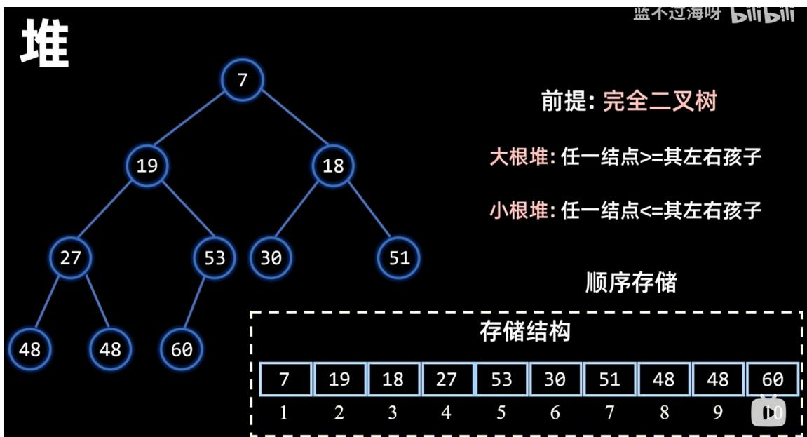

## 堆

8 48 9 48 60 10大根堆: 任一结点 $\geqslant$ 其左右孩子 $a[i] \geqslant a[2i] \&\& a[i] \geqslant a[2i+1]$

小根堆: 任一结点<=其左右孩子
a[i] <= a[2i] && a[i] <= a[2i+1]

顺序存储 (下标1开始)

左孩子: $2 i$ 右孩子: $2 i + 1$

7 19 18 27 53 30 51 48 48 60
1 2 3 4 5 6 7 8 9 10

堆排序
以大根堆为例

## 蓝不过海呀 bilibili

7 18 19 27 30 48 48 51 53 60
1 2 3 4 5 6 7 8 9 10

1. 建堆 $O(n)$ 从最后一个非叶结点开始依次向下调整最好: $O(n \log_2 n)$

最坏: $O(n \log_2 n)$

2. 排序 $O(n \log_{2} n)$

平均: $O(n \log_{2} n)$

每轮堆顶换到最后, 向下调整新的堆顶 (n-1)轮

辅助空间: $O(1)$

不稳定

## 堆的插入、删除时间复杂度及原因

结论：

\- 插入: O (log n)

\- 删除堆顶：O (log n)

\- 删除任意元素: O (n) (一般不讨论, 堆主要用在删除堆顶)

## 1. 插入操作: O (log n)

## 过程

1. 新元素先加到堆的最后一个位置（数组末尾），O (1)

2. 从下往上向上调整（sift up），与父节点比较交换，维持堆性质

为什么是 O (log n)

\- 完全二叉树高度为 $[\log_2 n]$

\- 最多只需要沿着一条路径从叶子上浮到根，比较交换次数 = 树高 → 时间复杂度 O(log n)

## 2. 删除堆顶元素: O (log n)

## 过程

1. 用堆最后一个元素替换堆顶，O (1)

2. 删除末尾元素，O (1)

3. 从上往下向下调整 (sift down)，与子节点比较交换

## 为什么是 O (log n)

\- 同样只走一条从根到叶子的路径

\- 比较交换次数 = 树高 = O(log n)

## 3. 补充：删除任意元素

需要先遍历找到该元素 O(n)，再调整 O(log n)

整体为 $\mathbf{O}(\mathbf{n})$ ，堆结构不适合随机删除。

堆排序仅适用于顺序存储的线性表。

对小（大）根堆进行层序遍历并不能得到从小到大（从大到小）的序列，因为堆只能保障根小于（大于）孩子结点，并不能保障两个孩子结点的大小是有序的。

堆排序是可以并行的，在建堆阶段可以并行，但在调整阶段不能并行

归并排序：

归并排序的核心思想就一句话：

分而治之，先拆分再合并，两两有序归并成整体有序。

## 一、基本思想

## 1. 分解（分）

把待排序数组从中间不断一分为二，直到每个子数组只剩一个元素。

单个元素本身就是有序的。

## 2. 合并 (治)

从最小的有序子数组开始，两两合并，合并时保证合并后的结果依然有序。

一层一层往上合并，最终合并成一个完整有序数组。

## 二、通俗理解

就像整理两摞已经排好序的扑克牌：

\- 每次从两摞最上面各拿一张比较

\- 把小的先拿走

\- 重复直到全部拿完

这就是 \*\* 归并（merge）\*\* 的过程。

```c
C++
ElemType *B=(ElemType *)malloc((n+1)sizeof(ElemType)); //辅助数组B
void Merge(ElemType A[], int low, int mid, int high){
//表A的两段A[low......mid]和A[mid......high]各自有序，将他们合并成一个有序表
int i, j, k;
for(k=low; k<=high; k++) {
    B[k]=A[k];    //将A中所有元素复制到B中
}
for(i=low; j=mid+1, k=i; i<=mid&&j<=high; k++) {
    if(B[i]<=B[j]) { //比较B的两个段中的元素
```

```txt
A[k]=B[i++]; // 将较小的值复制到 A 中
}else{
    A[k]=B[j++];
}
while(i<=mid)A[k++] = B[i++]; // 若第一个表未检测完，复制
while(j<=high)A[k++] = B[j++]; // 若第二个表未检测完，复制
}

void MergeSort(ElemType A[], int low, int high){
    if(low<high){
    int mid=(low+high)/2;
    MergeSort(A, low, mid); // 对左侧子序列进行递归排序
    MergeSort(A, mid+1, high); // 对右侧子序列进行递归排序
    Merge(A, low, mid, high); // 归并
    }
}
```

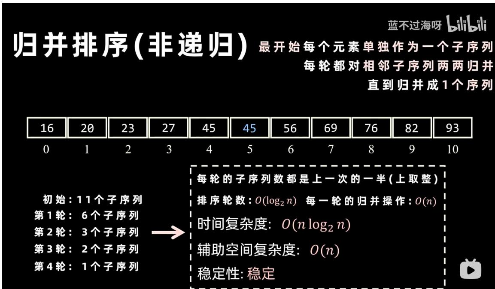

归并排序适用于顺序存储和链式存储的线性表。

一般而言，对于 N 个元素进行 k 路归并排序时，排序的趟数 m 满足 $K^{m}=N$ ，又考了到 m 是整数，因此 $m=\lceil\log_{k}N\rceil$

## 基数排序：

## 基数排序简单一句话

基数排序是按数字的每一位依次排序的稳定排序算法，先排低位、再排高位，借助桶来分配和收集，最终整体有序。

## 极简过程

1. 从最低位开始，按当前位数字分到 $0 \sim 9$ 号桶里

2. 按桶顺序收集，得到按这一位有序的序列

3. 往高位重复上述步骤

4. 所有位处理完，数组就整体排好序了

## 特点

\- 不做元素间直接大小比较

\- 必须用稳定排序处理每一位（通常用桶 / 计数排序）

\- 时间复杂度接近线性: $\mathbf{O} (\mathbf{d} \times \mathbf{n})$ , d 是数字位数

\- 适合整数、字符串等有固定位数结构的数据

基数排序 逐位进行分配和收集(从最低位开始)

→008→051→162→169→348→402→425→425→592→763

每轮：分配 + 收集 $O(n + r)$

总共排d轮

d: 最大数的位数

时间复杂度: $O(d \times (n + r))$

n: 要排 n 个数

辅助空间复杂度: $O(r)$

r:基数/桶的个数

稳定性: 稳定

基数排序适用于顺序存储和链式存储的线性表。

## 计数排序：

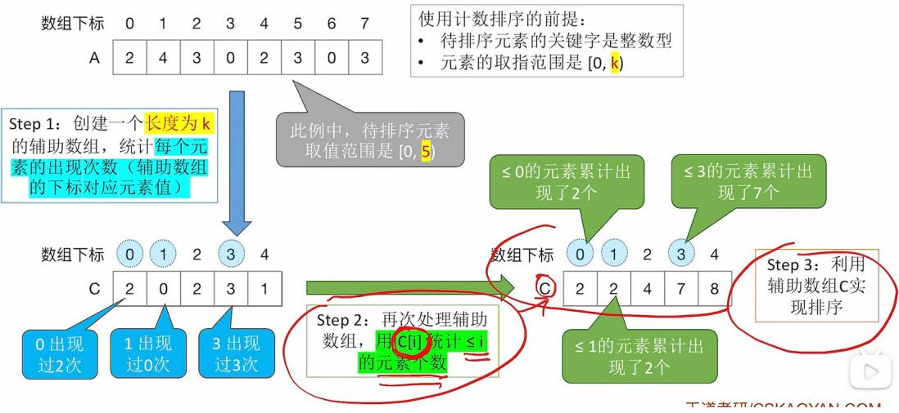

## 计数排序的复杂度分析

```c
C++
//A[]输入数组，B[]输出数组，C[]存储计数值
void CountSort(ElemType A[],ElemType B[],int n,int k){
    int i,C[k];
    for(i=0;i<k;i++){
    C[i]=0;
    }
    for(i=0;i<n;i++){//遍历数组，统计每个元素出现的个数
    C[A[i]]++;//C[A[i]]保存的是等于A[i]元素的个数
    }
    for(i=1;i<k;i++){
    C[i]=C[i]+C[i-1];//C[X]保存的是小于或等于x的元素个数
```

```txt
}
for(i=n-1;i>0;i--){
    B[C[A[i]]-1]=A[i];
    C[A[i]]=C[A[i]]-1;
}
}
```

计数排序的原理：数组的索引（下标）是递增有序的，通过将序列中的元素作为辅助数组的索引，其个数作为值放入辅助数组，遍历辅助数组来排序。

计数排序是一种稳定的排序算法。

计数排序更适用于顺序存储的线性表。

计数排序适用于序列中的元素是整数且元素范围（0\~k-1）不能太大，否则会造成辅助空间的浪费。

内部排序算法的比较：

<table><tr><td>算法种类</td><td>时间复杂度(最好情况)</td><td>时间复杂度(平均情况)</td><td>时间复杂度(最坏情况)</td><td>空间复杂度</td><td>是否稳定</td></tr><tr><td>直接插入排序</td><td>O(n)</td><td>O(n2)</td><td>O(n2)</td><td>O(1)</td><td>是</td></tr><tr><td>冒泡排序</td><td>O(n)</td><td>O(n2)</td><td>O(n2)</td><td>O(1)</td><td>是</td></tr><tr><td>简单选择排序</td><td>O(n2)</td><td>O(n2)</td><td>O(n2)</td><td>O(1)</td><td>否</td></tr><tr><td>希尔排序</td><td>-</td><td>-</td><td>-</td><td>O(1)</td><td>否</td></tr><tr><td>快速排序</td><td>O(n log2n)</td><td>O(n log2n)</td><td>O(n2)</td><td>O(log2n)</td><td>否</td></tr><tr><td>堆排序</td><td>O(n log2n)</td><td>O(n log2n)</td><td>O(n log2n)</td><td>O(1)</td><td>否</td></tr><tr><td>二路归并排序</td><td>O(n log2n)</td><td>O(n log2n)</td><td>O(n log2n)</td><td>O(n)</td><td>是</td></tr><tr><td>基数排序</td><td>O(d(n+r))</td><td>O(d(n+r))</td><td>O(d(n+r))</td><td>O(r)</td><td>是</td></tr></table>

因为希尔排序的时间复杂度依赖于增量函数，所以无法准确给出其时间复杂度。

<table><tr><td>排序算法</td><td>是否稳定</td><td>平均时间复杂度</td><td>最坏时间复杂度</td><td>空间复杂度</td></tr><tr><td>直接插入排序</td><td>√ 稳定</td><td> $O(n^{2})$ </td><td> $O(n^{2})$ </td><td> $O(1)$ </td></tr><tr><td>冒泡排序</td><td>√ 稳定</td><td> $O(n^{2})$ </td><td> $O(n^{2})$ </td><td> $O(1)$ </td></tr><tr><td>简单选择排序</td><td>× 不稳定</td><td> $O(n^{2})$ </td><td> $O(n^{2})$ </td><td> $O(1)$ </td></tr><tr><td>希尔排序</td><td>× 不稳定</td><td> $O(n \log n) \sim O(n^{2})$ </td><td> $O(n^{2})$ </td><td> $O(1)$ </td></tr><tr><td>快速排序</td><td>× 不稳定</td><td> $O(n \log n)$ </td><td> $O(n^{2})$ </td><td> $O(\log n) \sim O(n)$ </td></tr><tr><td>堆排序</td><td>× 不稳定</td><td> $O(n \log n)$ </td><td> $O(n \log n)$ </td><td> $O(1)$ </td></tr><tr><td>归并排序</td><td>√ 稳定</td><td> $O(n \log n)$ </td><td> $O(n \log n)$ </td><td> $O(n)$ </td></tr><tr><td>基数排序</td><td>√ 稳定</td><td> $O(d(n+r))$ </td><td> $O(d(n+r))$ </td><td> $O(n+r)$ </td></tr></table>

## 1. 稳定排序：4 个，用 “口诀 + 原理” 记

稳定排序算法：直接插入、冒泡、归并、基数

## - 口诀：“插冒归基，稳如老狗”

\- 为什么它们稳定？

1. 直接插入排序：只在关键字不等时移动元素，相等时不移动，相对位置不变。

2. 冒泡排序：相邻元素交换，只有前大后小才交换，相等时不交换，顺序不变。

3. 归并排序：合并时优先取左半部分的元素，相等时先取左边的，保留了原顺序。

4. 基数排序：按位分发收集，每次都是稳定的桶排序，整体自然稳定。

## 2. 不稳定排序：4 个，用“共同特征”记

## 不稳定排序算法：简单选择、希尔、快速、堆排序

## - 口诀：“选希快堆，都要换”

\- 为什么它们不稳定？（都存在“跨位置交换”或“分组打乱”）

1. 简单选择排序：每次把最小元素直接交换到前面，会跨位置交换，可能把后面的相等元素换到前面。

2. 希尔排序：分组插入时，步长大于 1，会导致元素跳跃式移动，破坏相等元素的相对顺序。

3. 快速排序：划分时基准元素和其他元素交换，可能把后面的相等元素换到基准前面。

4. 堆排序：建堆和调整堆时，父子节点交换，会把后面的相等元素换到前面。

排序算法小结：

1. 若 n 较小，可采用直接插入排序或简单选择排序。直接插入排序所需要的记录移动次数较简单选择排序的多，因此当记录本身信息量较大时，用简单选择排序较好。

2. 若 n 较大，应采用时间复杂度为 $O(n \log_{2} n)$ 的排序算法：快速排序、堆排序、归并排序。

当待排序的关键字随机分布时，快速排序被认为是目前基于比较的内部排序算法中最好的方法。堆排序所需的辅助空间少于快速排序，且不会出现快速排序可能的最坏情况，这两种排序都是不稳定的。若要求稳定且时间复杂度为 $O(n \log_{2} n)$ ，可选用归并排序。

3. 若文件的初始状态已按关键字基本有序，则选用直接插入排序或冒泡排序。

4. 在基于比较的排序算法中，每次比较两个关键字的大小之后，仅出现两种可能的转移，因此可以用一棵二叉树来描述比较判定过程，可以证明：当文件的 n 个关键字随机分布时，任何借助于“比较”的排序算法，至少需要 $O(\log_{2} n)$ 的时间。

5. 若 n 很大，记录的关键字位数可以分解时，采用基数排序较好。

6. 当记录本身信息量很大时，为避免耗费大量时间移动记录，可用链表作为存储结构。

## 知识点：

1.

结论先说:

\- 简单选择排序：总比较次数是固定的

\- 折半插入排序：总比较次数也是固定的

原因我用最直白、考试能直接写的话讲给你。

## 一、简单选择排序

比较次数: $\frac{n(n - 1)}{2}$ , 永远不变

为什么固定？

\- 每一轮都要从剩下未排序的所有元素里找最小的

\- 第1轮: 比n-1次

\- 第2轮: 比n-2次

• ....

\- 最后一轮: 比 1 次

不管原数组是有序、乱序、逆序，每一轮都必须完整扫一遍找最小值，没有任何提前退出的可能。

所以：

比较次数只跟 n 有关，跟数据初始顺序无关 → 固定 ↓

## 二、折半插入排序

比较次数: 也是固定的, 大约 $O(n \log n)$

为什么固定？

\- 插入排序本来是逐个往前比，比较次数会随数据顺序变化

\- 但折半插入是：
前面已经有序 → 用二分查找插入位置

\- 二分查找的比较次数只跟有序区长度有关，跟具体元素大小无关

每插一个元素，都要做一次完整二分，不会提前结束。

所以：

比较次数只由 $n$ 决定，与数据初始顺序无关 → 固定

注意:

\- 它的移动次数不固定（有序时移动少，逆序时移动多）

\- 但你问的是比较次数，那就是固定的

在顺序存储的条件下，插入排序、选择排序、冒泡排序的时间复杂度都是 $O(n^{2})$ ，更换为链式存储后的时间复杂度还是 $O(n^{2})$ 。希尔排序和堆排序都利用了顺序存储的随机访问特性，而链式存储不支持这种性质，所以时间复杂度会增加。

## 考研排序并行性速记表

我帮你整理了高频考点的并行性，以后直接对照就行：

<table><tr><td>排序算法</td><td>是否可并行</td><td>核心原因</td></tr><tr><td>归并排序</td><td>可以</td><td>分治后的左右子数组完全独立</td></tr><tr><td>快速排序</td><td>可以</td><td>划分后的左右子数组完全独立</td></tr><tr><td>堆排序</td><td>可以</td><td>建堆阶段可并行调整多个子树</td></tr><tr><td>基数排序</td><td>不可</td><td>高位排序依赖低位排序结果</td></tr><tr><td>冒泡排序</td><td>不可</td><td>相邻元素比较前后强依赖</td></tr><tr><td>插入排序</td><td>不可</td><td>每个元素的插入依赖前面已排好的序列</td></tr><tr><td>选择排序</td><td>不可</td><td>每次选最值需要遍历整个未排序区间</td></tr></table>

外部排序：

外部排序的方法：


初始归并段（也叫初始顺串，英文：Initial Run）是外部排序（External Sorting）中的核心概念，特指在排序的第一阶段，将外存（磁盘）上的大型文件分批读入内存，经内部排序后写回外存，所形成的有序子文件。

## 一、核心背景：为什么需要它？

当待排序数据量极大（如GB级文件），无法一次性全部装入内存时，必须使用外部排序。

外部排序分为两大阶段：

1. 生成初始归并段（预处理）

2. 多路归并（将多个有序段合并为整体有序）

## 二、生成过程（标准方法）

假设：

\- 总记录数: $N$

\- 内存工作区容量：可容纳 $M$ 条记录步骤：

1. 分段读入：从磁盘读取 $M$ 条记录到内存。

2. 内部排序：用快速排序、堆排序等算法，将这 $M$ 条记录排好序。

3. 写回外存：将这段有序数据作为一个独立子文件（初始归并段）写回磁盘。

4. 重复：读取下一批 $M$ 条记录，重复上述步骤，直到整个文件处理完毕。

结果：

磁盘上得到 $m \approx \left\lceil \frac{N}{M} \right\rceil$ 个有序的初始归并段。

## 纠正：什么是多路平衡归并？

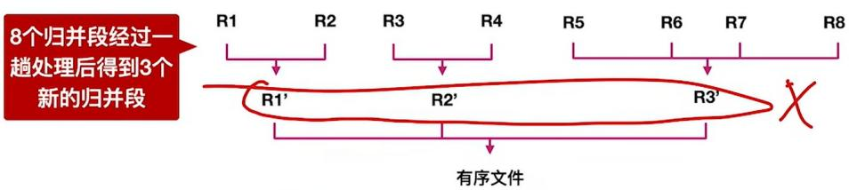  
k路平衡归并：①最多只能有k个段归并为一个；

②每一趟归并中，若有 $m$ 个归并段参与归并，则经过这一趟处理得到 $\lceil m / k\rceil$ 个新的归并段多路平衡归并是一种外部排序算法中常用的技术，用于将多个已排序的序列（称为“归并段”或“顺串”）合并成一个全局有序的大序列。


## 1. 基本概念

\- 多路：指同时参与归并的序列数量 $\geq 2$ （如3路、4路、K路）。

\- 平衡：指每一趟归并中，参与归并的段数保持相等（或尽量相等），使得归并树是一棵平衡K叉树。

\- 归并：将多个有序序列合并成一个有序序列。

具体做法：

\- 从 K 个输入缓冲区的队首元素中选出最小（或最大）的记录输出。

\- 然后从该记录所属的归并段中读入下一个记录填充缓冲区。

\- 重复直到所有归并段为空。

## 2. 作用（为什么需要它）

## (1) 减少归并趟数，提高效率

外部排序（数据太大无法全部放入内存）的基本步骤：

1. 生成初始归并段：用内排序将大文件切分成多个有序的小块（初始归并段）。

2. 多路归并：将这些有序小块逐步合并成更大的有序段，直到整个文件有序。

若采用2路归并：

\- 初始有 $m$ 个归并段

\- 每趟归并段数减半

\- 归并趟数 $= \left[\log_2 m\right]$

若采用K路平衡归并（ $K\geq 2$ ）：

\- 每趟归并段数减少到原来的 $1 / K$ （取上整）

\- 归并趟数 = [log\_K m]

## 二、结论1：每趟归并段数减少到原来的 $\left\lceil \frac{1}{K} \right\rceil$ （取上整）

## 直观理解

\- 每一趟归并中，每 $K$ 个有序段会被合并成1个

\- 所以一趟之后，段数理论上变成原来的 $\frac{1}{K}$

\- 但如果段数不能被 $K$ 整除，剩下的不足 $K$ 个段也要合并成1个，因此要向上取整

## 数学证明

设当前段数为 n，一趟归并后段数为 $n'$ 。

按 $K$ 个一组分组：

\- 能完整分成 $\lfloor \frac{n}{K} \rfloor$ 组，每组合并成 1 段，贡献 $\lfloor \frac{n}{K} \rfloor$ 个新段

\- 剩余 $r = n \bmod K$ 个段 $(0 \leq r < K)$

○ 若 r = 0，无剩余，段数 $n' = \frac{n}{K}$

若 $r > 0$ ，剩余 $r$ 个段合并为1段，段数 $n^{\prime} = \left\lfloor \frac{n}{K}\right\rfloor +1 = \left\lceil \frac{n}{K}\right\rceil$

综上：

$$
n ^ {\prime} = \left\lceil \frac {n}{K} \right\rceil
$$

即：每趟归并段数变为原来的 $\left[\frac{1}{K}\right]$ 倍（取上整）。

## 三、结论 2: 归并趟数 = $\lceil \log_{K} m \rceil$

## 核心逻辑

我们的目标是：经过若干趟归并，段数从 $m$ 降到1（只剩一个完整有序文件）。

设需要 t 趟归并，根据结论 1，每趟段数变为原来的 $\left\lceil \frac{1}{K} \right\rceil$ 倍，近似为 $\frac{1}{K}$ 倍。

第1趟后段数： $\left[\frac{m}{K}\right]$

第2趟后段数： $\left\lceil \frac{1}{K}\left\lceil \frac{m}{K}\right\rceil \right\rceil \approx \left\lceil \frac{m}{K^2}\right\rceil$

第 $t$ 趟后段数： $\left\lceil \frac{m}{K^t}\right\rceil = 1$

要满足 $\left\lceil \frac{m}{K^t} \right\rceil = 1$ ，即：

$$
\frac {m}{K ^ {t}} \leq 1 \quad \text {且} \quad \frac {m}{K ^ {t - 1}} > 1
$$

整理得：

$$
K ^ {t - 1} <   m \leq K ^ {t}
$$

两边取以 $K$ 为底的对数:

$$
t - 1 <   \log_ {K} m \leq t
$$

因此 $t = \lceil \log_K m \rceil$ ，即归并趟数为 $\lceil \log_K m \rceil$ 。

## (2) 平衡性避免“退化”

\- 若 K 路归并不平衡（例如某些路提前归并完），会导致内部结点度数不均衡，归并树高度增加，增加 I/O 次数。

\- 平衡归并保证每趟尽可能合并相同数量的段，使归并树为平衡 K 叉树，高度最小化。

## (3) 利用败者树（或堆）优化 K 路比较

K 路归并时，若每步从 K 个元素中找最小值，直接比较需 K-1 次。

使用败者树可以将比较次数从 O(K) 降到 O(log K)，显著提升内存中归并速度。


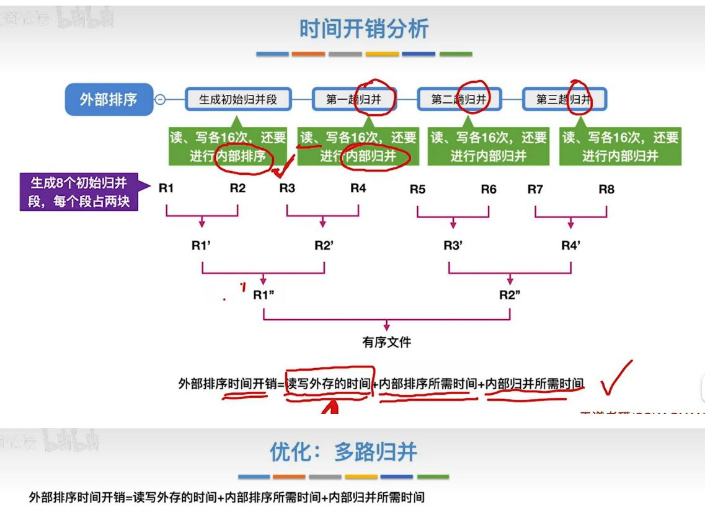

外部排序时间开销 $=$ 读写外存的时间 $+$ 内部排序所需时间 $+$ 内部归并所需时间

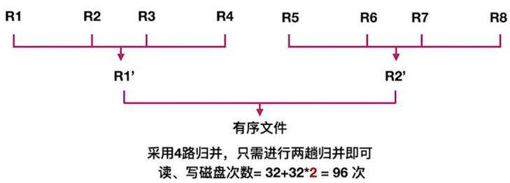

重要结论：采用多路归并可以减少归并趟数，从而减少磁盘I/O(读写)次数

对 $r$ 个初始归并段, 做 $k$ 路归并, 则归并树可用 $k$ 叉树表示

若树高为h，则归并趟数 = h - 1 = $\lceil log_k r \rceil$

推导：k叉树第h层最多有 $k^{h-1}$ 个结点

$$
\text {则} r \leq k ^ {h - 1}, (h - 1) _ {\text {最小}} = \lceil l o g _ {k} r \rceil
$$

多路归并带来的负面影响：

①k路归并时，需要开辟k个输入缓冲区，内存开销增加。

②每挑选一个关键字需要对比关键字

(k- 1) 次, 内部归并所需时间增加

优化：减少初始归并段数量

对 $r$ 个初始归并段, 做 $k$ 路归并, 则归并树可用 $k$ 叉树表示若树高为 $h$ , 则归并趟数 $= h - 1 = \lceil \log_k r \rceil$ k越大，r越小，归并趟数越少，读写磁盘次数越少

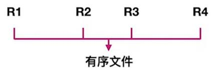

结论：若能增加初始归并段的长度,则可减少初始归并段数量 $r$

知识回顾与重要考点

若要进行k路归并排序，则需要在内存中分配k个输入缓冲区和1个输出缓冲区

① 生成 $r$ 个初始归并段（对 $L$ 个记录进行内部排序，组成一个有序的初始归并段）

步骤

②进行 S 趟 k 路归并， $S = \lceil \log_{k} r \rceil$

把 $k$ 个归并段的块读入 $k$ 个输入缓冲区

外部排序

如何进行k路归并

用“归并排序”的方法从k个归并段中选出几个最小记录暂存到输出缓冲区中

当输出缓冲区满时，写出外存

外部排序时间开销

读写外存的时间 + 内部排序所需时间 + 内部归并所需时间

增加归并路数 $k$ ，进行多路平衡归并

代价1：需要增加相应的输入缓冲区

优化

代价2：每次从k个归并段中选一个最小元素需要（k-1）次关键字对比

## 败者树：

减少初始归并段数量 $r$

败者树在多路平衡归并中的应用  
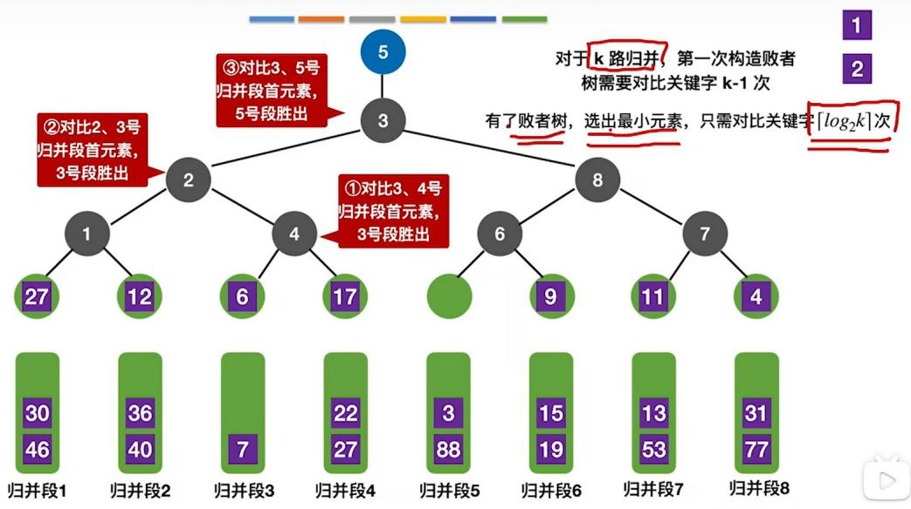

## 败者树的实现思路

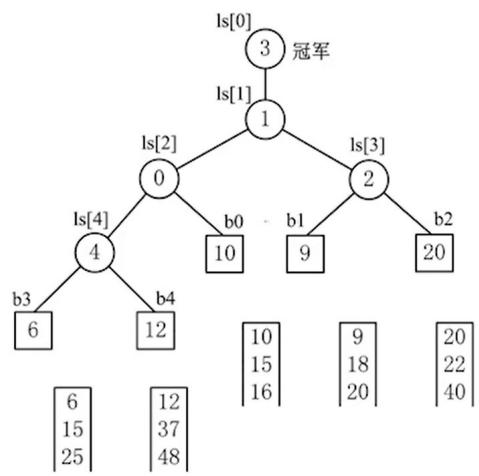

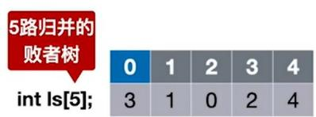

对于 k 路归并，第一次构造败者树需要对比关键字 k-1 次有了败者树，选出最小元素，只需对比关键字 $\lceil \log_{2}k \rceil$ 次

## 知识回顾与重要考点

败者树解决的问题: 使用多路平衡归并可减少归并趟数, 但是用老土方法从 $k$ 个归并段选出一个最小/最大元素需要对比关键字 $k - 1$ 次, 构造败者树可以使关键字对比次数减少到 $\left\lbrack  {{\log }_{2}k}\right\rbrack$

败者树可视为一棵完全二叉树（多了一个头头）。k个叶结点分别对应k个归并段中当前参加比较的元素，非叶子结点用来记忆左右子树中的“失败者”，而让胜者往上继续进行比较，一直到根结点。

如何构造和使用败者树？——看图记忆

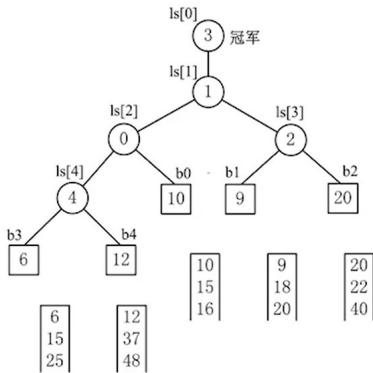

王道老研/CSKAOVAN

在 k 路归并 构建的败者树中，每次选取关键字最小的记录，时间复杂度是 $O(\log_{2} k)$ 。下面我把这个结论讲透，方便你直接背下来。

## 一、败者树的核心结构

败者树是一棵完全二叉树，特点：

\- 有 $k$ 个叶子结点，分别对应 $k$ 个归并段的当前关键字；

\- 每个非叶子结点记录的是 \*\*“败者”\*\*（两个孩子中较大的那个）；

\- 根结点的父结点（或称为“冠军结点”），记录的是\*\*“胜者”\*\*，也就是当前 $k$ 个关键字中的最小值。

## 二、为什么选最小值的时间是 $O(\log_2k)$ ？

1. 初始构建败者树：需要从下往上两两比较，这一步的时间复杂度是 $O(k)$ ，但这是一次性操作，题目问的是\*\*“每次选取”\*\*的时间，所以不算在内。

2. 每次选取最小值后：

\- 我们从根结点拿到当前的最小值（冠军）；

然后从该最小值对应的归并段，读入下一个关键字，替换败者树中原来的叶子结点；

接着，从这个被替换的叶子结点向上回溯，一路更新它在每一层的“比赛结果”，直到根结点；

\- 这一过程需要比较的次数，等于树的高度减 1。

因为败者树是一棵高度为 $\lceil \log_2k\rceil +1$ 的完全二叉树，所以从叶子到根的路径长度是：

$\lceil \log_2k\rceil$

也就是说，每次更新败者树只需要进行 $\lceil \log_2k\rceil$ 次比较，时间复杂度就是：

$O(\log_{2}k)$

完整的步骤是这样的：

1. 取冠军 $(O(1))$ ：直接拿败者树顶部的冠军结点，这一步确实是常数时间。

2. 读新数据（I/O 操作）：从冠军对应的归并段，读入下一个关键字，替换掉败者树里原来的叶子结点。

3. 更新败者树 $(O(\log_2 k))$ ：从被替换的叶子结点，一路向上回溯，更新每一层的“败者”信息，直到根结点。

○ 败者树是一棵高度为 $\lceil \log_2 k \rceil + 1$ 的完全二叉树

从叶子到根，一共需要进行 $\lceil \log_2k\rceil$ 次比较

\- 这一步的时间复杂度，才是整个“选取操作”的瓶颈

所以，题目里说的“需要的时间”，指的是更新败者树的开销，也就是 $O(\log_2 k)$ 。

## 置换排序：

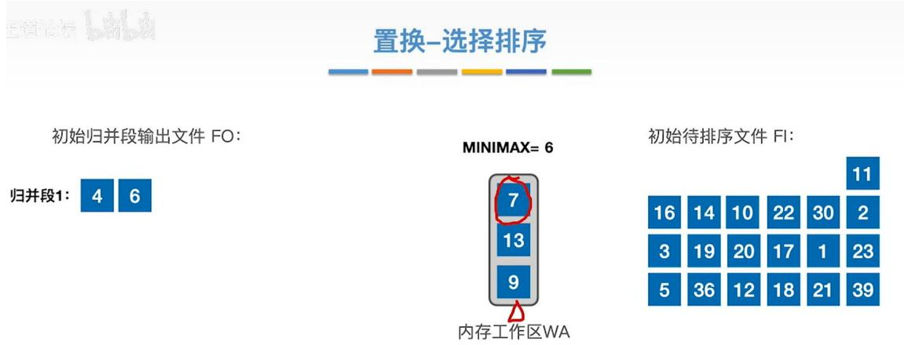  
注：假设用于内部排序的内存工作区只能容纳3个记录

## 置换-选择排序

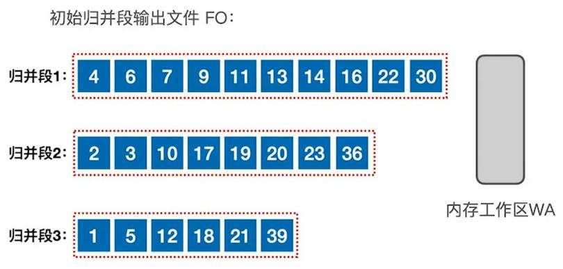  
使用置换-选择排序，可以让每个初始归并段的长度超越内存工作区大小的限制

初始待排序文件FI：

注：假设用于内部排序的内存工作区只能容纳3个记录

## 知识回顾与重要考点

设初始待排文件为FI，初始归并段输出文件为FO，内存工作区为WA，FO和WA的初始状态为空，WA可容纳w个记录。置换-选择算法的步骤如下：

1）从FI输入w个记录到工作区WA。

2）从WA中选出其中关键字取最小值的记录，记为MINIMAX记录。

3）将MINIMAX记录输出到FO中去。

4）若FI不空，则从FI输入下一个记录到WA中。

5）从WA中所有关键字比MINIMAX记录的关键字大的记录中选出最小关键字记录，作为新的MINIMAX记录。

6）重复3）～5），直至在WA中选不出新的MINIMAX记录为止，由此得到一个初始归并段，输

出一个归并段的结束标志到FO中去。

7）重复2）～6），直至WA为空。由此得到全部初始归并段。

置换-选择排序是外部排序中生成初始归并段的方法，用此方法得到的初始归并段的长度是不等长的。其平均长度是传统等长初始归并段的两倍，从而使得初始归并段数减少到原来的近二分之一。但是，置换选择排序不是一种完整的生成有序文件的外部排序算法。

## 1. 置换 - 选择排序是什么?

它是外部排序里专门用来生成初始归并段的一种方法。

\- 外部排序处理的是内存放不下、必须放磁盘的大文件。

\- 第一步永远是：把无序的大文件，切成一段段内部有序的小段，叫初始归并段。

\- 传统方法：固定读内存能装下的记录数，排好输出一段 $\rightarrow$ 得到等长归并段。

\- 置换 - 选择排序：不固定数量，一边输入、一边输出、一边替换，能输出更长的有序段。

## 2. “得到的初始归并段长度是不等长的”

传统方法：

每段长度 = 内存工作区大小 → 全部一样长。

置换 - 选择排序:

它会动态选择当前最小关键字输出，并不断用新记录替换。

有的记录能顺下去很长，有的很快就断了 $\rightarrow$ 每段长度不一样。

所以叫不等长初始归并段。

3.“平均长度是传统等长初始归并段的两倍”

这是一个理论结论，不是随便说的。

在随机关键字分布下:

\- 传统方法：平均长度 = 内存工作区大小 M

\- 置换 - 选择排序：平均长度 $\approx 2\mathrm{M}$

直观理解：

它不是“装满内存才输出一段”，而是能连续输出就一直输出，很多时候能比固定分段多一倍左右。

4.“从而使得初始归并段数减少到原来的近二分之一”

总记录数 $N$ 不变。

传统段数：

$$
k _ {1} = \frac {N}{M}
$$

置换 - 选择段数:

$$
k _ {2} \approx \frac {N}{2 M} = \frac {k _ {1}}{2}
$$

段数少了，后面归并趟数就会变少，I/O次数减少 $\rightarrow$ 外部排序更快。

## 5. “但是置换选择排序不是一种完整的生成有序文件的外部排序算法”

这句话非常关键，考试常考。

\- 置换 - 选择排序只做第一步：

生成初始归并段。

\- 它不能直接把整个文件排成整体有序。

\- 要得到最终有序文件，还必须继续做：

多路归并（k 路归并）。

所以它只是外部排序的一个子步骤，不是完整排序算法。

## 用一句话总结这段话

置换 - 选择排序是外部排序中生成初始归并段的方法，它生成不等长的归并段，平均长度约为传统分段的两倍，因此归并段数量减半；但它只能生成初始归并段，不能完成最终整体排序，所以不是完整的外部排序算法。

## 最佳归并树：

归并树的神秘性质  
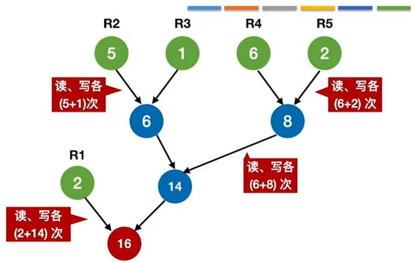

  
每个初始归并段看作一个叶子结点，归并段的长度作为结点权值，则

上面 👍 这棵归并树的带权路径长度 WPL = 2\*1 + (5+1+6+2) \* 3 = 44 = 读磁盘的次数 = 写磁盘的次数

重要结论：归并过程中的磁盘I/O次数=归并树的WPL\*2

王道老研/CSKAOVAN(

## 构造2路归并的最佳归并树

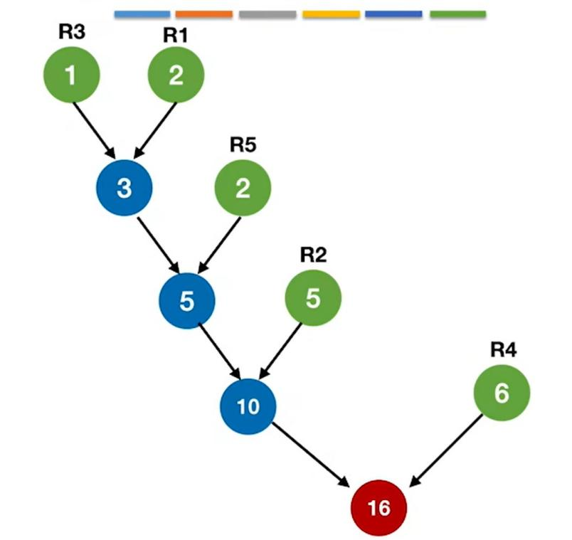  
最佳归并树 $\mathrm{WPL}_{\mathrm{min}} = (1 + 2)*4 + 2*3 + 5*2 + 6*1 = 34$  
读磁盘次数=写磁盘次数=34次；总的磁盘I/O次数 = 68

## 优化前：

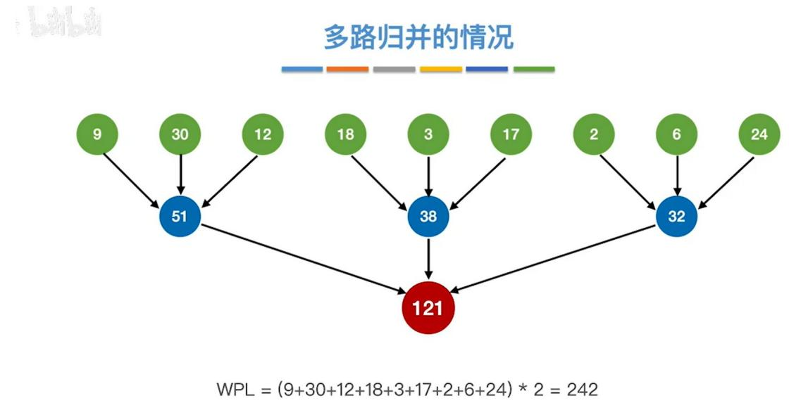  
归并过程中磁盘I/O总次数 $= 484$ 次

## 优化后：

多路归并的最佳归并树

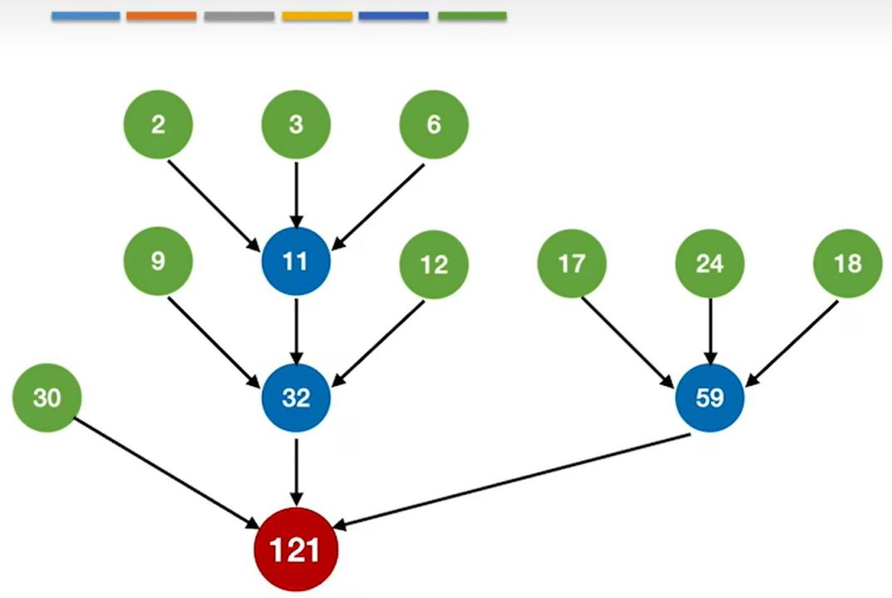

减少一个归并段：

论坛

如果减少一个归并段

注意：右边这个不是最佳归并树

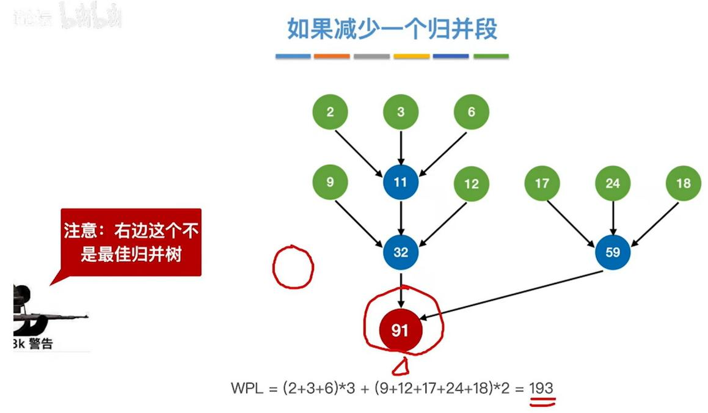  
归并过程中 磁盘I/O总次数=386次  
王道考研/CSK/

## 正确的做法

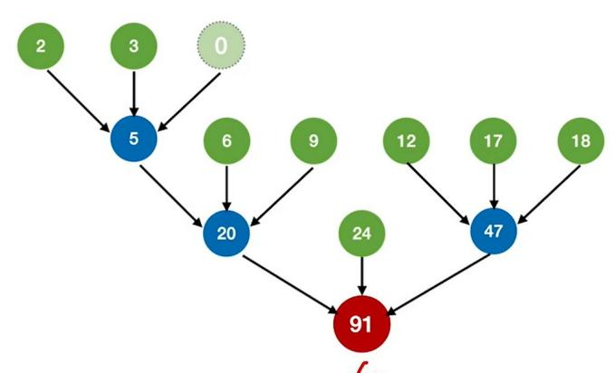

注意：对于k叉归并，若初始归并段的数量无法构成严格的 k 叉归并树，则需要补充几个长度为 0 的“虚段”，再进行 k 叉哈夫曼树的构造。

□是□否□是□否□是

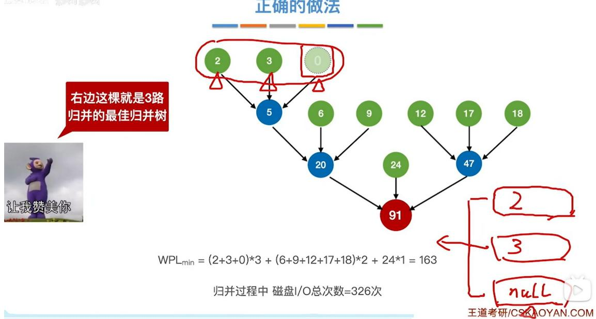

## 论坛

## 添加虚段的数量

注意：对于k叉归并，若初始归并段的数量无法构成严格的 k 叉归并树，则需要补充几个长度为 0 的“虚段”，再进行 k 叉哈夫曼树的构造。


k叉的最佳归并树一定是一棵严格的 k 叉树，即树中只包含度为 k、度为 0 的结点。设度为 k 的结点有 $n_{k}$ 个，度为 0 的结点有 $n_{0}$ 个，归并树总结点数 = n 则：

初始归并段数量+虚段数量= $n_{0}$

$$
n = n _ {0} + n _ {k}
$$

$$
k n _ {k} = n - 1
$$

$$
n _ {0} = (k - 1) n _ {k} + 1
$$

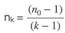

如果是“严格k叉树”，一定能除得尽

①若（初始归并段数量-1）% $(k-1)=0$ ，说明刚好可以构成严格k叉树，此时不需要添加虚段
②若（初始归并段数量-1）% $(k-1)=u\neq0$ ，则需要补充 $(k-1)-u$ 个虚段

## 知识回顾与重要考点

每个初始归并段对应一个叶子结点，把归并段的块数作为叶子的权值

理论基础

归并树的 WPL=树中所有叶结点的带权路径长度之和

归并过程中的磁盘I/O次数 $=$ 归并树的WPL\*2

注意：k 叉归并的最佳归并树一定是严格 k 叉树，即树中只有度为 k、度为 0 的结点

最佳归并树

补充虚段

① 若（初始归并段数量 -1）% （k-1）=0，说明刚好可以构成严格 k 叉树，此时不需要添加虚段

如何构造

②若（初始归并段数量 -1）% （k-1）= u ≠ 0，则需要补充 (k-1) - u 个虚段

构造k叉哈夫曼树

每次选择k个根节点权值最小的树合并，并将k个根节点的权值之和作为新的根节点的权值

## 知识点：

1.

在 m 路平衡归并排序中，为了实现输入、内部归并、输出的并行处理，缓冲区的配置是有固定要求的，我们可以分两部分来理解：

## 一、标准配置结论

\- 输入缓冲区：需要 2m 个

\- 输出缓冲区：需要2个

## 二、详细解释与原理

1. 为什么输入缓冲区是 $2\mathrm{m}$ 个？

m 路归并意味着你有 m 个有序的初始归并段，每一路都需要一个输入缓冲区来读取数据。

为了实现并行处理，我们需要对每一路都采用双缓冲（双缓冲区）机制：

\- 对每一路来说，有两个缓冲区：

○ 一个用于当前读入数据（I/O 操作）

○ 另一个用于当前供归并程序取用数据（CPU 操作）

\- 当其中一个缓冲区的数据被归并程序用完时，另一个缓冲区的数据已经提前读入完毕，可以无缝切换。这样CPU和磁盘I/O就能并行工作，不会互相等待。

所以：

\- 每一路归并段需要2个输入缓冲区

\- 共 $m$ 路 $\rightarrow$ 总输入缓冲区数 $= 2 \times m$ 个

## 2. 为什么输出缓冲区是 2 个?

归并的结果要写入一个新的有序文件，同样为了并行处理，也采用双缓冲机制：

\- 一个输出缓冲区装满后，程序就把它交给磁盘进行写操作（I/O）

\- 同时，程序可以把新的归并结果写入另一个空的输出缓冲区（CPU）

\- 两个缓冲区交替使用，CPU 和磁盘写操作可以并行进行，没有空闲等待时间。

因此，无论 m 是多少路，输出缓冲区都只需要 2 个。

## 2.

I. 败者树从下往上维护，每上一层，只需和失败结点比较 1 次 √

败者树的维护逻辑：当某个叶子结点的值更新后，我们需要从该叶子的父结点开始向上调整。

\- 每个父结点记录的是上一轮比较的“败者”，我们只需要让当前的“胜者”和这个败者比较1次，就能确定新的胜者和败者。

\- 因此，每向上走一层，只需要1次比较，I的说法是正确的。

II. 败者树的每次维护，必定要从叶结点一直走到根结点，不可能从中间停止

败者树的结构决定了：更新操作的影响必须传递到根结点，因为最终的胜者是根结点的父结点（或根结点），它记录了全局的最小值。

\- 举个例子：叶子结点的值更新后，父结点、祖父结点、一直到根结点的比较结果都可能改变，没有任何一个中间结点能保证“后续结点的结果不变”。

\- 因此，维护过程必须从叶子一直走到根结点，无法中途停止，Ⅱ的说法是正确的。

Ⅲ. 堆从上往下维护，每下一层，若其左右孩子均不为空，则需比较2次

以小顶堆的向下调整为例（比如删除堆顶元素后）：

1. 先比较左右孩子的值，选出较小的那一个（第 1 次比较）；

2. 再将当前结点和这个较小的孩子比较，如果当前结点更大，就交换位置（第 2 次比较）。

\- 因此，当左右孩子都存在时，每下一层确实需要2次比较，Ⅲ的说法是正确的。

IV. 堆的每次维护，必定要从根结点一直走到叶结点，不可能从中间停止 ✗

堆的向下调整是可以中途停止的。

\- 当调整过程中，当前结点已经比它的左右孩子都小（小顶堆），说明堆的性质已经满足，就可以直接停止调整，不需要走到叶子结点。

\- 比如堆顶元素和左孩子交换后，发现它已经比新的左右孩子都小，调整就结束了。因此IV的说法错误。

补充一个对比表格，帮你快速区分两者的维护特点：

<table><tr><td>特性</td><td>败者树</td><td>小顶堆</td></tr><tr><td>维护方向</td><td>从下往上(叶子→根)</td><td>从上往下(根→叶子)</td></tr><tr><td>每层比较次数</td><td>1次(和父结点记录的败者比较)</td><td>2次(先比孩子,再比父与孩子)</td></tr><tr><td>是否能中途停止</td><td>必须走到根,不能中途停止</td><td>满足堆性质时可以中途停止</td></tr></table>

## 题目：

## 题目 1:

在由 $m$ 个初始归并段构建的 $k$ 阶最佳归并树中，不需要补充虚段，则度为 $k$ 的结点个数是（）

## 一、什么是「初始归并段」？

在外部排序（处理远大于内存的数据）中，我们无法一次把所有数据读进内存排序，所以要分两步走：

1. 生成初始归并段：

把大文件分成多个能装进内存的小块，每一块在内存里排好序，写回磁盘。

这些已经排好序的、磁盘上的子文件，就叫初始归并段（也叫初始顺串）。

比如 10TB 的数据，内存只能装 1TB，那我们会生成 10 个有序的初始归并段，每个 1TB。

2. 对这些有序段进行多路归并：

把多个有序的初始归并段，合并成一个最终的有序大文件。

## 二、那「m个初始归并段」具体是什么？

就是上面例子里的“10个有序子文件”。

\- 每个归并段内部，数据是已经排好序的；

\- 归并段之间，整体不一定有序，需要通过多路归并把它们合并成一个。

## 三、和你题目里的「k阶最佳归并树」有什么关系？

最佳归并树是多路归并排序的优化方案，用来减少磁盘I/O次数，提高效率。

\- 有 m 个初始归并段，要做 k 路归并（一次合并 k 个段），就要构建一棵 k 叉的归并树。

\- 这时候有个关键结论：当 $(m-1)\%$ $(k-1)\neq0$ 时，需要补充虚段，让树的结构满足 k 叉完全树的要求，否则无法构建平衡的归并树。

\- 你第 13 题问的 “度为 k 的结点个数”，公式 $(m-1)/(k-1)$ 就是这么来的（当不需要补充虚段时，这个公式直接成立）。

## 一、先把场景说清楚：为什么会有「初始归并段」？

你现在要给1000本图书排序，但你的书桌（内存）只能放下10本。

你没法一次性把1000本书全放桌上排好序，只能分两步做：

## 1. 分批排序：

先拿 10 本放桌上，排好序，按顺序码好，放一边。

再拿 10 本，排好序，放第二堆……

这样你会得到100堆书，每一堆内部都是排好序的。

这每一堆排好序的书，就是一个「初始归并段」。

2. 把这些有序堆合并成一个大的有序堆：

现在你有100堆有序的书，要把它们合成1堆最终有序的书，这就是多路归并。

## 二、「m 个初始归并段」到底是什么？

就是上面例子里的100堆排好序的书。

\- 每一堆内部：书的顺序是从小到大排好的（有序）；

\- 堆和堆之间：比如第1堆最大的书，可能比第2堆最小的书还大（整体无序）；

\- 你的目标：把这 $m$ 个有序的小堆，合并成1个有序的大堆。

## 三、结合你第13题的「k阶最佳归并树」，再讲透

还是刚才的例子：你有 $m = 7$ 个有序的书堆（初始归并段），现在你每次能同时合并 $k = 3$ 堆书（3路归并），想让合并的总次数最少，就要用「最佳归并树」来规划合并顺序。

1. 为什么要补充虚段？

3 路归并，意味着每次合并都要凑够 3 堆书。

我们来数一下合并过程的结点:

\- 叶子结点：就是7个初始归并段（书堆）；

\- 中间结点：每次合并3堆，产生1个新堆；

\- 最终根结点：合并完成的 1 个大堆。

对于一棵k叉树，有个固定的性质：

叶子结点数 $m$ 、度为 $k$ 的结点数 $n$ ，满足： $m - 1 = n \times (k - 1)$

代入你的题目：

$$
7 - 1 = n \times (3 - 1) \rightarrow 6 = n \times 2 \rightarrow n = 3
$$

刚好整除，所以不需要补充虚段。

如果换个例子： $m = 8$ 个初始归并段， $k = 3$ 路归并：

$$
8 - 1 = n \times (3 - 1) \rightarrow 7 = n \times 2
$$

7 不能被 2 整除，所以要补充 1 个虚段（相当于一个“空书堆”，不影响结果，只是凑数），变成 m=9：

9 - 1 = n × 2 → n=4，刚好整除，就能构建出完整的3叉树了。

## 2. 回到你第 13 题的公式

题目说「不需要补充虚段」，说明（m-1）能被（k-1）整除，此时：

度为 k 的结点个数 = $(m-1)/(k-1)$ ，对应选项 C。

## 四、再用一句话总结

\- 初始归并段：内存放不下全部数据时，分批排序后得到的「内部有序的小文件 / 小堆」；

\- m 个初始归并段：你现在有 m 个这样的有序小文件，要通过多路归并合成 1 个大文件；

\- 最佳归并树：帮你规划合并顺序，让磁盘读写次数最少，减少IO开销。

## |（注：部分内容可能由 AI 生成）
