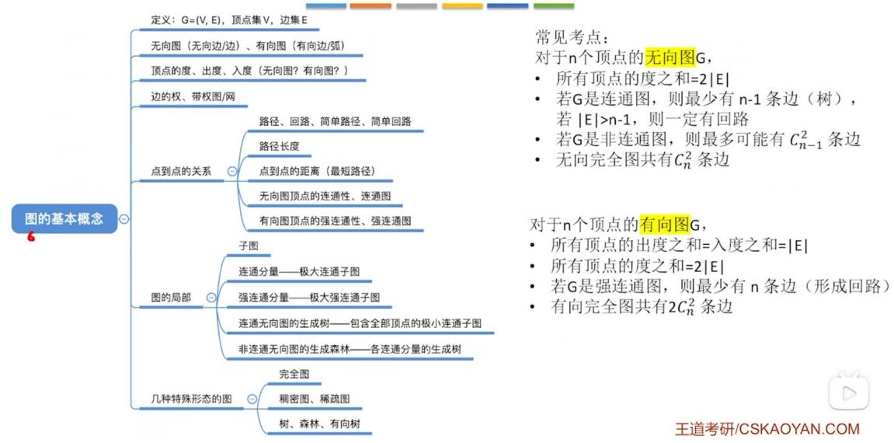
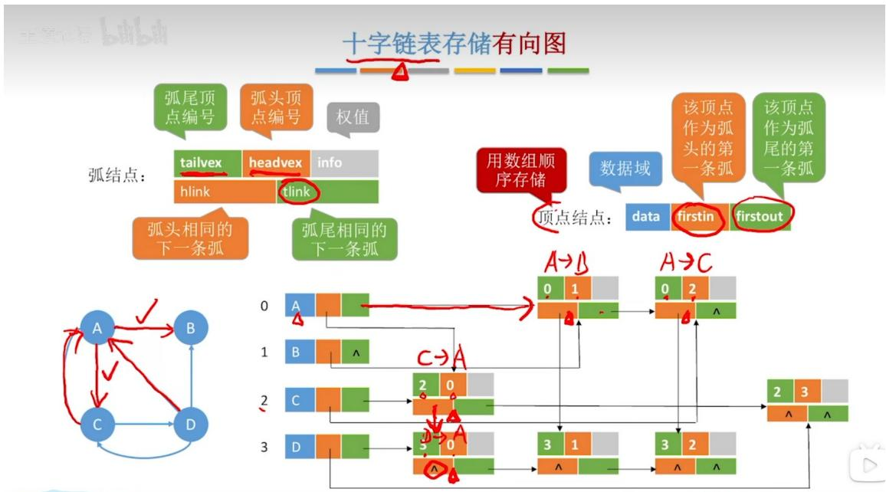
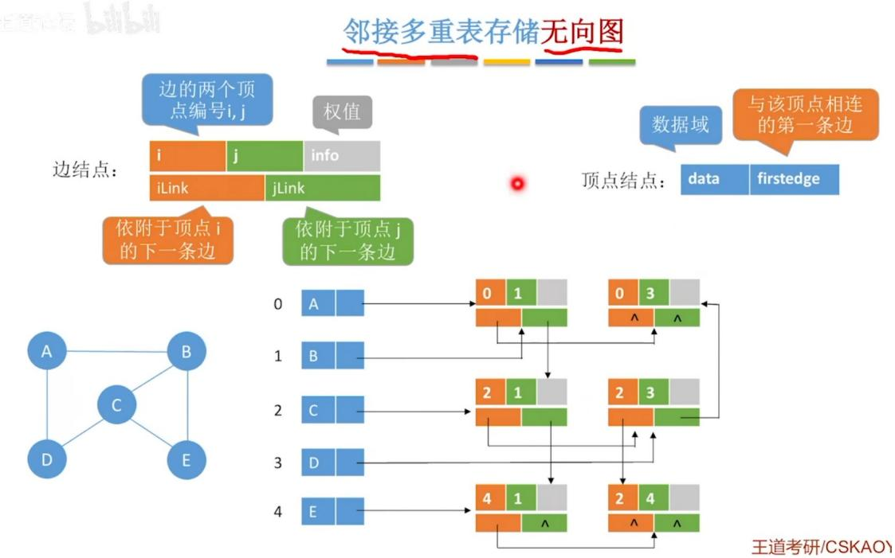
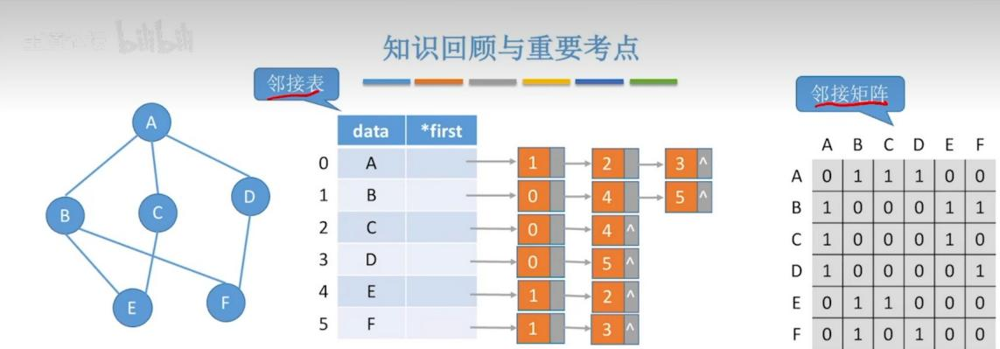

# 第六章 图（上）.docx

## 第六章 图（上）

## 图的基本概念：

无向图中

1.顶点的度（Degree）

对于无向图，顶点的度指的是与该顶点直接相连的边的数量，记为 TD(v)（v 为目标顶点）。

TD:Total Degree 总度数

例如，无向图中一个连接 3 条边的顶点，其度为 3。特别地，孤立顶点（不与任何边相连）的度为 0，悬挂顶点（只与一条边相连）的度为 1。

## 2. 连通分量

对于无向图，连通分量是指无向图中的极大连通子图，即图中拆不开的最大那块。

## 3.树

无向图中的树是一种特殊的无向连通图，满足两个核心条件：① 图是连通的（任意两个顶点之间都有路径可达）；② 图中没有环（不存在从一个顶点出发，经过若干条边后又回到该顶点的路径）。

补充说明：无向树的顶点数 n 与边数 m 满足固定关系，即 m = n - 1，这也是判断一个无向连通图是否为树的重要依据。此外，无向树中不存在孤立顶点（除了只有 1 个顶点的树，边数为 0），且任意删除一条边，树就会变成非连通图；任意添加一条边，就会形成一个环。

## 4.生成树

无向图的生成树，是针对无向连通图而言的特殊子图，核心定义：给定一个无向连通图 G，其生成树 T 是 G 的一个子图，且满足三个条件：① T 包含 G 中所有的顶点；② T 是一棵无向树（连通且无环）；③ T 的边均来自原图 G 的边，不添加新边。

补充说明：1. 只有无向连通图才有生成树，非连通图不存在生成树；2. 一个无向连通图可以有多个生成树，所有生成树的顶点数与原图一致，边数均满足 $m = n - 1$ （ $n$ 为顶点数）；3. 生成树是原图中连接所有顶点且边数最少的连通子图，若删除生成树任意一条边，会变成非连通图；若在生成树中添加原图的任意一条非树边，会形成一个环。

4. 在一个带权的无向连通图中，所有生成树中，边权值之和最小的那棵生成树，就叫做最小生成树（Minimum Spanning Tree/MST）。

## 5.生成森林

生成森林是针对非连通的无向图而言的特殊子图，结合前文树和生成树的概念，具体定义如下：

## 1. 前提

只对非连通的无向图讲生成森林，连通无向图不存在生成森林（连通图对应的是生成树）。

## 2. 定义（人话版）

非连通图会包含 k 个连通分量（即 k 个拆不开的极大连通子图），对这 k 个连通分量，分别求出它们各自的生成树，这 k 棵生成树组合在一起，就是原图的生成森林。

## 3. 严格说法

（一）是原图的子图；

（二）包含原图所有的顶点（“生成”的核心含义，与生成树一致）；

（三）由 $k$ 棵互不相交的生成树组成（ $k$ 等于原图的连通分量个数，互不相交指无公共顶点和边）。

## 4. 边数计算

设原图总顶点数为 $n$ ，连通分量个数为 $k$ ，每个连通分量的顶点数分别为 $n_1$ 、 $n_2$ 、

…、 $n_{k}$ （ $n_{1}+n_{2}+\ldots+n_{k}=n$ ），则生成森林的总边数为：

$$
E = (n _ {1} - 1) + (n _ {2} - 1) + \dots + (n _ {k} - 1) = n - k
$$

## 5. 核心特点

\- 生成森林中每一棵子树都是对应连通分量的生成树，满足连通、无环的特点；

\- 生成森林整体不连通（因原图是非连通图，各连通分量之间无路径）；

\- 生成森林是原图中包含所有顶点且边数最少的子图（每棵生成树是对应连通分量的极小连通子图，组合后整体边数最少）。

## 6.无向连通图的特性：

无向连通图的特性（n 个顶点，e 条边）：

## 1. 最核心定义

1. 无向图中，任意两个顶点之间都有路径。

1. 整个图只有 1 个连通分量。

## 2. 边数范围（必考）

$$
n - 1 \leq e \leq \frac {n (n - 1)}{2}
$$

(1) 最少边: $e = n - 1$

1. 此时就是树

1. 连通、无环、少一条就不连通。

(2) 最多边: $e = n(n - 1) / 2$

1. 此时是完全无向图

1. 任意两点之间都有一条边。

3. 结构特性

1. 一定存在生成树（保留全部顶点，删成 n-1 条边、连通无环）。

1. 若边数 e > n - 1，图中一定有环。

1. 若边数 $e = n - 1$ ，一定无环、是树。

1. 若 e < n - 1，一定不连通。

## 4. 度数特性

1. 所有顶点度数之和 = 2e（每条边贡献 2 度）。

1. 至少有 2 个顶点度数为 1（树的时候就是叶子）。

1. 不存在度数为 0 的顶点（否则就不连通了）。

5. 极小、极大概念（必考）

1. 无向连通图本身，是自己的唯一极大连通子图。

1. 生成树是原图的极小连通子图：
再少一条边就不连通；

1. 再多加一条边就一定出现环。

最简单口诀（背这个就够）

1. 连通图：任意两点能走到，只有一个连通分量。

1. 边最少 n-1，是树、无环。

1. 边多于 n-1，必有环。

1. 边少于 n-1，必不连通。

1. 连通图一定有生成树。

## 有向图中:

## 1.顶点的入度（In-Degree）

对于无向图，顶点的入度指的是从其他顶点指向该顶点的边的数量，记为 ID(v)。简单来说，就是“指向该顶点的边数”。

ID:In Degree 入度

例如，有向图中顶点 v 有 2 条边从其他顶点指向它，则其入度为 2。

## 2. 顶点的出度（Out-Degree）

对于无向图，顶点的出度指的是从该顶点指向其他顶点的边的数量，记为 OD(v)，即 “从该顶点出发的边数”。

OD:Out Degree 出度

例如，有向图中顶点 v 有 3 条边指向其他顶点，则其出度为 3。

补充说明：在有向图中，任意顶点的度等于其入度与出度之和，即 $TD(v) = ID(v) + OD(v)$

## 3.强连通分量

对于有向图，如果有一对顶点 v 和 w, 从 v 到 w 和从 w 到 v 之间都有路径，则称这两个顶点是强连通（任意两点互相可达）的，若图中任意一对顶点都是强连通的，则称此图为强连通。有向图中的极大强连通子图称为有向图的强连通分量。

## 知识点：

1. 若一个有向图有 n 个顶点，且为强连通图，则至少有 n 条边

原因：n 个顶点围成一个环，即可互达

2. 若一个无向图有 n 个顶点，且为强连通图，则至少有 n-1 条边

原因：n 个顶点形成树的结构，即可互达

3. 一个点也算连通分量

知识回顾与重要考点  


## 题目：

## 题1.

若具有 $n$ 个顶点的图是一个环，则它有多少颗生成树？

第一步：明确已知条件

题目中“具有 n 个顶点的图是一个环”，即该图为 n 顶点无向环图，记为 $C_{no}$ 。其核心特征：

1. 顶点数：n（n≥3，否则无法构成环）；

1. 边数：n（环图中每个顶点连接2条边，总边数=总度数/2=(2n)/2=n）；

1. 结构：n 个顶点首尾相连，形成一个单一的环，无其他多余边，且该图是连通图（任意两个顶点之间有两条路径可达）。

第二步：结合生成树的核心定义推导

根据前文生成树的定义，连通图的生成树需满足3个条件：①包含原图所有n个顶点；②是树（连通、无环）；③边数为n-1（树的顶点数与边数关系）。

对于 n 顶点环图（边数为 n），要得到其生成树，需在原图中删除 1 条边（因为 n - 1 = 总边数 n - 1，删除 1 条边后边数变为 n - 1）。

关键分析：环图的特点是“删除任意一条边，环都会被打破，形成一棵无环、连通的树”——因为环图本身连通，删除任意一条边后，剩余的 n-1 条边仍能连接所有 n 个顶点（无孤立顶点），且无环（打破了唯一的环结构），完全符合生成树的定义。

第三步：确定生成树的数量

环图共有 n 条边，每删除 1 条不同的边，就能得到 1 棵不同的生成树（因为删除不同的边，得到的子图边集不同，生成树也不同）。即 n 个顶点的环图，其生成树的数量为 n 棵。

例如：n=3（三角形环），有3条边，删除任意1条边都能得到1棵生成树，共3棵；n=4（四边形环），有4条边，删除任意1条边得到1棵生成树，共4棵。

## 题2.

(2017 统考真题) 已知无向图 $G$ 含有 16 条边, 其中度为 4 的顶点个数为 3 , 度为 3 的顶点个数为 4 , 其他顶点的度均小于 3 。图 $G$ 所含的顶点个数至少是多少?

\#### 第一步：明确已知条件与核心考点

本题核心考查无向图的度数特性（所有顶点度数之和 = 2e，每条边贡献 2 度），要求“顶点个数至少”，需遵循“让剩余顶点的度数尽可能大”（因度数越大，所需顶点数越少）的原则。已知条件梳理：

1. 无向图 G 的边数 e = 16;

1. 度为 4 的顶点个数：3 个（记为 $n_{4}=3$ ）；

1. 度为 3 的顶点个数：4 个（记为 $n_{3}=4$ ）；

1. 其他顶点的度均小于 3，即最大为 2（记为 $n_{2}$ ，度为 2 的顶点个数）；

1. 求顶点总数 $n = n_4 + n_3 + n_2$ 的最小值（无度为 0 或 1 的顶点，因度越小，所需顶点数越多，不符合“至少”要求）。
#### 第二步：计算已知顶点的总度数
根据度数定义，分别计算度为 4、度为 3 的顶点的总度数：

1. 度为 4 的顶点总度数: $4 \times n_{4} = 4 \times 3 = 12$ ;

1. 度为 3 的顶点总度数: $3 \times n_{3} = 3 \times 4 = 12$ ;

1. 已知顶点总度数之和： $12 + 12 = 24$ 。

\#### 第三步：计算剩余顶点需满足的总度数

由无向图度数特性 “所有顶点度数之和 = 2e”，可得图 G 的总度数为：

总度数 $= 2 \times e = 2 \times 16 = 32$

剩余顶点（度为 2）需满足的总度数：

$$
\text {剩余总度数} = \text {总度数} - \text {已知顶点总度数} = 3 2 - 2 4 = 8
$$

\#### 第四步：计算最少需要的剩余顶点个数

剩余顶点的度最大为 2（要使顶点数最少，需让每个剩余顶点的度数取最大值），设剩余顶点

个数为 $n_2$ ，则：

<div class="mineru-algorithm" style="white-space: pre-wrap; font-family:monospace;">
$2 \times n_{2} \geq$ 剩余总度数 $= 8$
</div>

解得： $n_{2} \geq 4$ ，即最少需要4个度为2的顶点（ $4 \times 2 = 8$ ，刚好满足剩余总度数）。

\#### 第五步：计算顶点总数的最小值

顶点总数 $n =$ 度为4的顶点数 $+$ 度为3的顶点数 $+$ 度为2的顶点数：

<div class="mineru-algorithm" style="white-space: pre-wrap; font-family:monospace;">
$n = 3 + 4 + 4 = 11$
</div>

```txt
#### 结论
```

图 G 所含的顶点个数至少是 11 个。

## 图的存储及基本操作：

邻阶矩阵法：

图的邻阶矩阵存储结构定义：

```txt
C++
#define MaxVertexNum 100 //顶点数目的最大值
typedef char VertexType; //顶点对应的数据类型
typedef int EdgeType; //边对应的数据类型
typedef struct {
    VertexType vex[MaxVertexNum]; //顶点表
    EdgeType edge[MaxVertexNum][MaxVertexNum]; //邻接矩阵。边表
    int venum, arcnum; //图当前的顶点数和边数
}
```

## 邻接表法：

图的邻阶表存储结构定义：

```c
C++
#define MaxVertexNum 100
//边表结点（ArcNode）：存储一条弧的信息
typedef struct ArcNode{//边表结点
int adjvex;//该弧所指向的顶点的位置
```

```c
struct ArcNode *nextarc; // 指向下一条弧的指针
}ArcNode;
// 顶点表结点（VNode）：存储一个顶点的信息
typedef struct VNode{// 顶点表结点
VertexType data; // 顶点数据
ArcNode *firstarc; // 指向第一条依附该顶点的弧的指针
}VNode, AdjList[MaxVertexNum]; // AdjList 等价于
VNode[MaxVertexNum]，即 “顶点数组”
// 图的整体结构（ALGraph）：整合顶点和边的信息
typedef struct{
AdjList vertices; // 邻接表
int vexnum, arcnum; // 图的顶点数和弧数
}ALGraph; // ALGraph 是以邻接表存储的图类型
```

## 十字链表：

十字链表是有向图的一种链式存储结构



## 3. tlink 和 hlink 的意义

\- tlink (tail link) :

连接与当前弧具有相同弧尾顶点（tailvex）的下一条弧。

所有从同一顶点出发的弧（出边），通过 tlink 指针串成一个链表。

\- hlink (head link) :

连接与当前弧具有相同弧头顶点（headvex）的下一条弧。

所有进入同一顶点的弧（入边），通过 hlink 指针串成另一个链表。

这样，一条弧节点通过 tlink 和 hlink 分别参与到两个不同的链表中：

\- 在出边表中按弧尾组织

\- 在入边表中按弧头组织

## 邻接多重表：



## 3. ilink 和 jlink 的意义

\- ilink :

连接与当前边的第一个顶点（ivex）相关联的下一条边。

换句话说，所有依附于顶点 ivex 的边，通过 ilink 指针串成一个链表。

\- jlink :

连接与当前边的第二个顶点（jvex）相关联的下一条边。

所有依附于顶点 jvex 的边，通过 jlink 指针串成另一个链表。

这样，一条边节点通过 ilink 和 jlink 分别参与到两个顶点的边链表中，实现了一条边在两个链表中“共享”同一节点。

## 知识点（图）：



<table><tr><td></td><td>A</td><td>B</td><td>C</td><td>D</td><td>E</td><td>F</td></tr><tr><td>A</td><td>0</td><td>1</td><td>1</td><td>1</td><td>0</td><td>0</td></tr><tr><td>B</td><td>1</td><td>0</td><td>0</td><td>0</td><td>1</td><td>1</td></tr><tr><td>C</td><td>1</td><td>0</td><td>0</td><td>0</td><td>1</td><td>0</td></tr><tr><td>D</td><td>1</td><td>0</td><td>0</td><td>0</td><td>0</td><td>1</td></tr><tr><td>E</td><td>0</td><td>1</td><td>1</td><td>0</td><td>0</td><td>0</td></tr><tr><td>F</td><td>0</td><td>1</td><td>0</td><td>1</td><td>0</td><td>0</td></tr></table>

<table><tr><td></td><td>邻接表</td><td>邻接矩阵</td></tr><tr><td>空间复杂度</td><td>无向图  $O(|V| + 2|E|)$ ;有向图 $O(|V| + |E|)$ </td><td> $O(|V|^2)$ </td></tr><tr><td>适合用于</td><td>存储稀疏图</td><td>存储稠密图</td></tr><tr><td>表示方式</td><td>不唯一</td><td>唯一</td></tr><tr><td>计算度/出度/入度</td><td>计算有向图的度、入度不方便,其余很方便</td><td>必须遍历对应行或列</td></tr><tr><td>找相邻的边</td><td>找有向图的入边不方便,其余很方便</td><td>必须遍历对应行或列</td></tr></table>

## 王道本語

## 知识回顾与重要考点

<table><tr><td></td><td>邻接矩阵</td><td>邻接表</td><td>十字链表</td><td>邻接多重表</td></tr><tr><td>空间复杂度</td><td> $O(|V|^2)$ </td><td>无向图  $O(|V| + 2|E|)$ 有向图  $O(|V| + |E|)$ </td><td> $O(|V| + |E|)$ </td><td> $O(|V| + |E|)$ </td></tr><tr><td>找相邻边</td><td>遍历对应行或列时间复杂度为 $O(|V|)$ </td><td>找有向图的入边必须遍历整个邻接表</td><td>很方便</td><td>很方便</td></tr><tr><td>删除边或顶点</td><td>删除边很方便,删除顶点需要大量移动数据</td><td>无向图中删除边或顶点都不方便</td><td>很方便</td><td>很方便</td></tr><tr><td>适用于</td><td>稠密图</td><td>稀疏图和其他</td><td>只能存有向图</td><td>只能存无向图</td></tr><tr><td>表示方式</td><td>唯一</td><td>不唯一</td><td>不唯一</td><td>不唯一</td></tr></table>


## 知识点（字）：

1. 若邻接矩阵对角线以下（或以上）的元素全为 0，则图中必然不存在环，即拓扑序列一定存在，但这并不能说明拓扑序列是唯一的。（王道 P211 第一题）

2. 设图 G 的邻接矩阵为 A， $A^{n}$ 的元素 $a_{i,j}^{n}$ 等于从顶点 i 到 j 的长度为 n 的路径的数目

## 题目：

题1

设某无向图中有 $n$ 个顶点和 $e$ 条边，则建立该图的邻接表的时间复杂度是（）。  
A. $O(n + e)$ B. $O(n^2)$ C. $O(ne)$ D. $O(n^3)$

答案：A

解析：建立无向图邻接表的核心操作是遍历所有顶点，为每个顶点创建链表，再遍历所有边，在对应顶点的链表中添加邻接点。

\- 遍历 $n$ 个顶点：耗时 $O(n)$ 。

\- 遍历 $e$ 条边：每条无向边在邻接表中存储两次（两个方向），遍历所有边的操作耗时 $O(e)$ 。

\- 总时间复杂度为遍历顶点与遍历边的时间之和，即 $O(n + e)$ ，因此选项A正确。

## 题2

假设有 $n$ 个顶点、 $e$ 条边的有向图用邻接表表示，则删除与某个顶点 $\nu$ 相关的所有边的时间复杂度为（）。  
A. $O(n)$ B. $O(e)$ C. $O(n + e)$ D. $O(ne)$

## 答案：C

解析：删除与顶点 $v$ 相关的所有边，需同时处理出边和入边：

1. 删除出边：直接移除顶点 $v$ 对应的邻接链表，操作耗时 $O(1)$ （仅修改表头引用）。

2. 删除入边：需遍历整个邻接表，检查每个顶点的邻接链表，删除所有指向 $v$ 的边。这一步需要访问所有 $n$ 个顶点和 $e$ 条边，耗时 $O(n + e)$ 。

\- 综合来看，总时间复杂度由耗时最长的删除入边操作决定，为 $O(n + e)$ ，选项C正确。

## 题3

设n个顶点、e条边的有向图用邻接表表示，则某个顶点v的入度的时间复杂度为（）。  
A. $O(n)$ B. $O(e)$ C. $O(n+e)$ D. $O(ne)$

答案：C

解析：在邻接表中，入度是指所有指向顶点 $v$ 的边的数量，需遍历所有边统计：

\- 邻接表仅存储出边信息，无法直接获取入度。必须遍历所有 $n$ 个顶点的邻接链表，检查每条边的终点是否为 $v$ 。

\- 遍历所有顶点耗时 $O(n)$ ，遍历所有边的总次数为 $e$ ，因此统计单个顶点入度的时间复杂度为 $O(n + e)$ ，选项 $\mathbb{C}$ 正确。

|（注：部分内容可能由 AI 生成）
