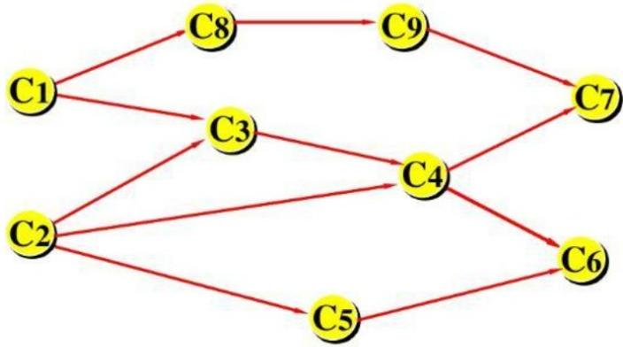
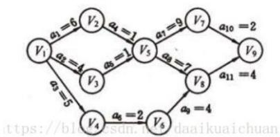
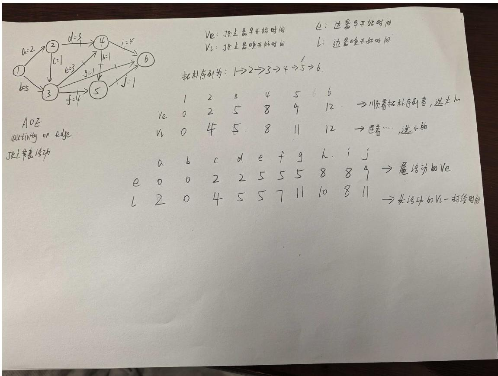
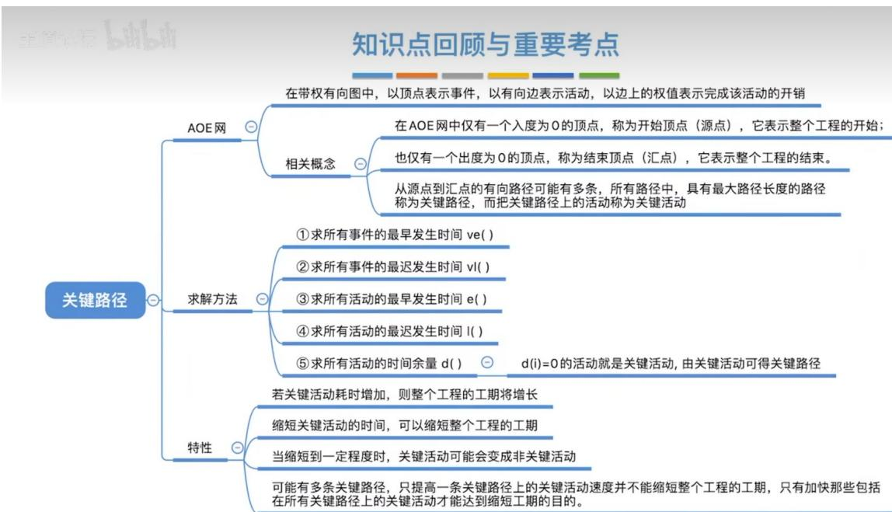

# 第六章 图（下）.docx — 图像索引

> 由 MinerU 结构化结果生成。题目若依赖树形、拓扑、流程、曲线、区域、时序或其他空间关系，应核对这里的原图，不要只依据 OCR 文本推断。

## 图 1

原文页码：2；bbox：`[191, 288, 616, 456]`

## 图 2

原文页码：5；bbox：`[152, 156, 396, 241]`

## 图 3

原文页码：5；bbox：`[149, 332, 845, 703]`

## 图 4

原文页码：7；bbox：`[151, 340, 845, 621]`
