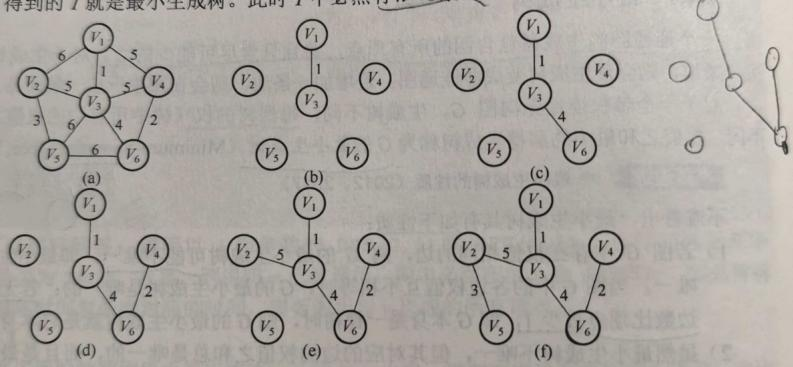
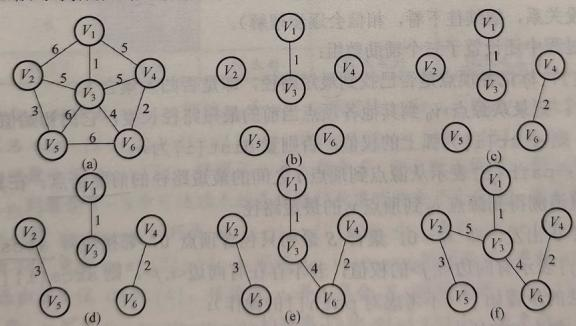
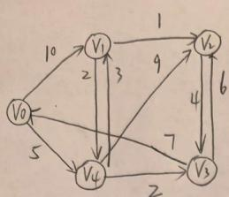
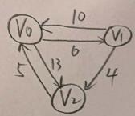
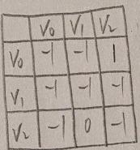
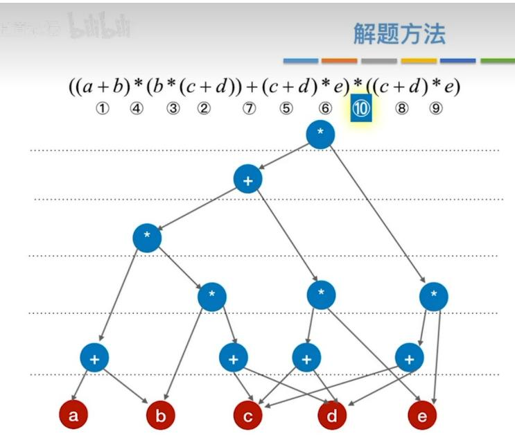
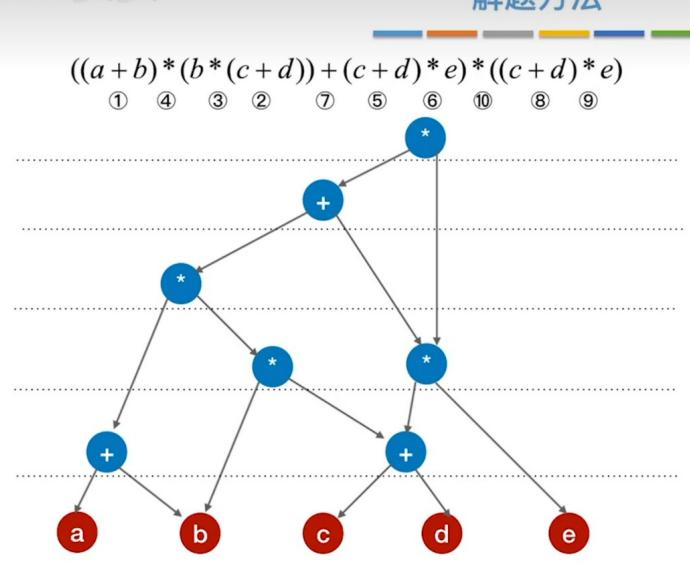

# 第六章 图（中）.docx

## 第六章 图（中）

## 图的遍历：

广度优先搜索算法伪代码：

```javascript
C++
bool visited[Max_Vertex_Num] //访问标记数组
void BFSTraverse(Graph G){
    for(i=0;i<G.vexnum;i++) {
    visited[i]=false;//访问标记数组初始化
    }
    InitQueue(Q);//初始化辅助队列
    for(i=0;i<G.vexnum;i++) {
    if(!visited[i]) BFS(G,i);
    }
}
```

## 邻接表实现广度优先：

```c
C++
//G.vertices[v].firstarc: 顶点 v 的第一条邻接边
//p->adjvex: 当前边指向的邻接顶点编号
//p->nextarc: 指向顶点 v 的下一条邻接边。
void BFS(ALGraph G, int i){
    visit(i); //访问初始结点 i
    visited[i] = true;
    EnQueue(Q, i); //顶点 i 入队列
    while (!IsEmpty(Q)) {
    DeQueue(Q, v); //队首顶点出队
    for (p = G.vertices[v].firstarc; p; p = p->nextarc) { //检测 v 的所有邻接点
    w = p->adjvex;
    if (visited[w] == false) {
    visit(w);
    visited[w] = true;
    }
    }
}
```

```txt
EnQueue(Q,w); //顶点入队
}
```

## 邻接矩阵实现广度优先：

```javascript
C++
void BFS(MGraph G, int i){
    visit(i);
    visited[i] = true;
    EnQueue(Q, i);
    while (!IsEmpty(Q)) {
    DeQueue(Q, v); // 队首顶点出队
    for (w = 0; w < G.vexnum; w++) { // 检测 v 的所有邻接点
    if (visited[w] == false && G.edge[v][w] == 1) {
    visit(w);
    visited[w] = true;
    EnQueue(Q, w);
    }
    }
    }
}
```

## BFS 求解单源最短路径：

```javascript
C++
//图 G 为非带权图
//这段代码实现了无权图（或等权图）的单源最短路径算法，利用广度优先搜索(BFS)
//来求解从源点 u 到图中所有其他结点的最短路径（以边数计量）
void BFS_MIN_Distance(Graph G, int u){
    //d[i]表示从 u 到 i 结点的最短路径
    for(i=0;i<G.vexnum;++i) d[i]=INFINITY; //初始设置没有路径距离为无穷大
    visited[u]=true;
```

```javascript
d[u]=0;
EnQueue(Q,u);
while(!IsEmpty(Q)){
    DeQueue(Q,u);
    //FirstNeighbor 返回第一个邻接点，NextNeighbor 返回下一个邻接点
    for(w=FirstNeighbor(G,u);w>=0;w=NextNeighbor(G,u,w)){
    if(!visited[w]){
    visited[w]=true;
    d[w]=d[u]+1;
    EnQueue(Q,w);
    }
    }
}
```

## 深度优先搜索（Depth-First-Search,DFS）

深度优先搜索算法伪代码：

```txt
C++
bool visited[Max_Vertex_Num] //访问标记数组
void DFSTraverse(Graph G){
    for(i=0;i<G.vexnum;i++) {
    visited[i]=false;//访问标记数组初始化
    }
    for(i=0;i<G.vexnum;i++) {
    if(!visited[i]) DFS(G,i);
    }
}
```

邻接表实现深度优先：

```c
C++
void DFS (ALGraph G, int i) {
    visit(i);
    visited[i] = true;
    for (p = G.vertices[i].firstarc; p; p->nextarc) {
    j = p->adjvex;
    if (visited[j] == false) DFS(G, j);
```

```txt
}
}
```

邻接矩阵实现深度优先：

```javascript
C++
void DFS(MGraph G, int i){
    visit(i);
    visited[i] = true;
    for (j = 0; j < G.vexnum; j++) {
    if (visited[j] == false && G.edge[i][j] == 1) DFS(G, j);
    }
}
```

## 知识点：

1. 极大连通子图是无向图（不一定连通）的连通分量，极小连通子图是连通无向图的生成树。极大连通子图包含连通分量的全部边，极小连通子图（生成树）包含连通图的全部顶点，且使其连通的边数最少。

2. 深度优先需要用到栈，广度优先需要用到队列。

3. 广度优先算法在最坏的情况下空间复杂度为 O(V)。采用邻接表存储时，每个顶点均需搜索（或入队）一次，时间复杂度为 O(V)，在搜索每个顶点的邻接点时，每条边至少访问一次，时间复杂度为 O(E)，总的时间复杂度为 O(V+E);

采用邻接矩阵存储时，查找每个顶点的邻接矩阵所需要的时间为 O(V), 总的时间复杂度为 O(V^3)。

4. 深度优先算法的空间复杂度为 O(V)。采用邻接表存储时，总的时间复杂度为 O(V+E)；采用邻接矩阵存储时，总的时间复杂度为 O(V^2)

## 题目：

## 一、原题题干（4082020数据结构第6题）

修改递归方式实现的图的深度优先搜索（DFS）算法，将输出（访问）顶点信息的语句移到退出递归前（即执行输出语句后立刻退出递归）。采用修改后的算法遍历有向无环图（DAG）G，若输出结果包含 G 中全部顶点，则输出的顶点序列是 G 的（）。

A. 拓扑有序序列

B. 逆拓扑有序序列

C. 广度优先搜索序列

D. 深度优先搜索序列

## 答案：B（逆拓扑有序序列）

## 二、关键对比：原DFS vs 修改后DFS

1. 标准递归 DFS（先访问，再递归）

```c
void DFS(Graph G, int v) {
    visit(v); // 1. 先输出/访问顶点v
    visited[v] = 1;
    for (w 邻接于v)
    if (!visited[w])
    DFS(G, w); // 2. 递归遍历所有后继
}
```

\- 输出时机：刚进入递归、遍历后继前

\- 序列性质：深度优先搜索序列（先根）

2.题目修改版DFS（后访问，退出前输出）

```txt
void DFS_modified(Graph G, int v) {
    visited[v] = 1;
    for (w 邻接于v)
    if (!visited[w])
    DFS_modified(G, w); // 1. 先递归遍历所有后继
    visit(v); // 2. 所有后继处理完，退出前才输出v
}
```

\- 输出时机：递归返回前、所有后继已处理完毕

```txt
- 序列性质: 后根序 (类似二叉树后序)
```

## 图的应用（重点）：

## 最小生成树：

Prim 算法实现最小生成树的步骤：

设无向连通图为 $G=(V,E)$ ，其最小生成树为 $T=(U,E_{T})$ ，其中 U 是 T 的顶点集合， $E_{T}$ 是 T 的边集合。具体步骤如下：

## 1. 初始化

向空树 $T=(U,E_{T})$ 中添加图 $G=(V,E)$ 中的任意一个顶点 $u_{0}$ ，完成初始集合的赋值：

1. 顶点集合： $U=\{u_{0}\}$

## 1. 边集合： $E_{T}=\varnothing$

## 2. 循环迭代（核心步骤，直至 U = V）

重复执行以下操作，直到顶点集合 $U$ 包含图 $G$ 的所有顶点（即 $U = V$ ）：

1. 选边：从图 G 中选取满足条件 $\left\{(u,v)\lor u\in U,v\in V-U\right\}$ 且具有最小权值的边 $(u,v)$ 。

条件解析：一个端点在生成树内部 U，另一个端点在生成树外部 V - U。

加边与扩点：将选中的边 $(u, v)$ 加入树 $T$ 的边集合，并将顶点 $v$ 加入生成树的顶点集合 $U$ 。

更新集合：执行集合更新操作 $U=U\cup\{v\}$ ， $E_{T}=E_{T}\cup\{(u,v)\}$

## 3. 结束

当 $U$ 与图 $G$ 的顶点集 $V$ 相等时，循环结束，此时得到的 $T = (U, E_T)$ 即为图 $G$ 的最小生成树。

## 4.伪代码实现

```javascript
C++
void Prim(G,T) {
    T=ø;    // 初始化空树，对应步骤1中 E_T = ø
    U={w};    // 添加任意一个顶点 w 作为起始点，对应步骤1中 U = {u0}
    while((V-U)!=ø) {    // 若树中不含全部顶点，循环继续设(u,v)是使 u∈U 与 v∈(V-U)，且权值最小的边；
    T=Tu{(u,v)};    // 边归入树，将选中的边加入最小生成树 T
    U=Uu{v};    // 顶点归入树，将边的非树顶点 v 加入 U 集合
}
```

## 5.具体操作：

1. Prim算法
Prim（普里姆）算法的执行非常类似于寻找图的最短路径的Dijkstra算法（见下一节）。
命题追踪 ▶ Prim算法构造最小生成树的实例（2015、2017、2018）

Prim 算法构造最小生成树的过程如图 6.15 所示。初始时从图中任取一顶点（如顶点 1）加入树 T，此时树中只含有一个顶点，之后选择一个与当前 T 中顶点集合距离最近的顶点，并将该顶点和相应的边加入 T，每次操作后 T 中的顶点数和边数都增 1。以此类推，直至图中所有的顶点都并入 T，得到的 T 就是最小生成树。此时 T 中必然有 n-1 条边。

  
图 6.15 Prim 算法构造最小生成树的过程

Prim 算法的步骤如下:

假设 $G = \{V, E\}$ 是连通图，其最小生成树 $T = (U, E_T)$ ， $E_T$ 是最小生成树中边的集合。初始化：向空树 $T = (U, E_T)$ 中添加图 $G = (V, E)$ 的任意一个顶点 $u_0$ ，使 $U = \{u_0\}$ ， $E_T = \emptyset$ 。循环（重复下列操作直至 $U = V$ ）：从图 $G$ 中选择满足 $\{(u, v) | u \in U, v \in V - U\}$ 且具有最小权值的边 $(u, v)$ ，加入树 $T$ ，置 $U = U \cup \{v\}$ ， $E_T = E_T \cup \{(u, v)\}$ 。Prim 算法的简单实现如下：

## Kruskal 算法实现最小生成树的步骤：

设无向连通图为 $G=(V,E)$ ，其最小生成树为 $T=(U,E_{T})$ ，具体步骤如下：

## 1. 初始化

1. 集合状态：令 U=V， $E_{T}=\varnothing$ 。

1. 连通分量：此时图 $T$ 是一个包含 $n$ 个顶点 $(n = iV \vee i)$ 的森林，每个顶点自成一个独立的连通分量。

1. 变量设定：设置连通分量数量 numS = n。

## 2. 循环迭代（核心筛选，直至 $E_{T}$ 含 n-1 条边）

重复执行以下操作，直到连通分量数量为 1 或 $E_{T}$ 中包含 n-1 条边：

1. 选边：从边集 E 中选择一条权值最小的边 $(v, u)$ 。

1. 判环：使用并查集等手段判断边 $(v,u)$ 的两个端点 v 和 u 是否属于 T 中不同的连通分量。
若属于不同分量：将边 $(v,u)$ 加入最小生成树边集 $E_{T}$ ，并合并这两个连通分量，连通分量数量 numS--。

若属于同一分量：舍弃此边，选择下一条权值最小的边，避免形成回路。

## 3. 结束

```txt
命题追踪 Kruskal算法构造最小生成树的实例（2015、2018、2020）
```

当连通分量数量缩减为1（即所有顶点连通）或 $E_{T}$ 集齐 $n - 1$ 条边时，循环结束。此时的 $T = (U,E_T)$ 即为所求的最小生成树。

## 4.伪代码实现

```javascript
C++
void Kruskal(V,T) {
    T=V;    // 初始化树 T，仅含顶点，对应步骤 1
    numS=n;    // 连通分量数，对应步骤 1
    while(numS>1) { // 若连通分量数大于 1，继续循环
    从 E 中取出权值最小的边(v,u);
    if(v 和 u 属于 T 中不同的连通分量) { // 对应步骤 2 的判环
    T=Tu{(v,u)};    // 加入生成树，对应步骤 2
    numS--;    // 连通分量数减 1
    }
    }
}
```

## 5.具体操作

Kruskal 算法构造最小生成树的过程如图 6.16 所示。初始时为只有 n 个顶点而无边的非连通图 $T = \{V, \{\}\}$ ，每个顶点自成一个连通分量。然后按照边的权值由小到大的顺序，不断选取当前未被选取过且权值最小的边，若该边依附的顶点落在 T 中不同的连通分量上（使用并查集判断这两个顶点是否属于同一棵集合树），则将此边加入 T，否则舍弃此边而选择下一条权值最小的边。以此类推，直至 T 中所有顶点都在一个连通分量上。

Kruskal算法的步骤如下：

假设 $G=(V,E)$ 是连通图，其最小生成树 $T=(U,E_{T})$ 。

初始化： $U=V, E_{T}=\varnothing$ 。即每个顶点构成一棵独立的树，T此时是一个仅含V个顶点的森林。循环（重复直至T是一棵树）：按G的边的权值递增顺序依次从 $E-E_{T}$ 中选择一条边，若这条边加入T后不构成回路，则将其加入 $E_{T}$ ，否则舍弃，直到 $E_{T}$ 中含有n-1条边。

  
图6.16 Kruskal算法构造最小生成树的过程

Kruskal 算法的简单实现如下:
void Kruskal(V,T){

## 知识点：

1. Prim 算法是已知的最小生成树算法

2. Dijkstra 算法与 Prim 算法高度相似，运用 Dijkstra 算法可以生成一棵树，但不一定是最小生成树。

## 最短路径：

求解最短路径的算法都依赖于一种性质，即两点之间的最短路径也包含了路径上其他顶点间的最短路径。

带权有向图 G 的最短路径问题一般可分为两类：一是单源最短路径，即求图中某一顶点到其他各顶点的最短路径，可通过经典的 Dijkstra（迪杰斯特拉）算法求解；二是求每对顶点间的最短路径，可通过 Floyd（弗洛伊德）算法来求解。

## 1. Dijkstra 算法（迪杰斯特拉）

王道数据结构 P235

如果实在忘了的话看王道讲解的视频

## 一、基本信息

1. 功能：求单源最短路径（一个起点到其余所有顶点的最短路径）

1. 思想：贪心算法

1. 适用条件：边权值 $\geqslant 0$ （不能有负权边）

1. 存储结构：邻接矩阵 / 邻接表

1. 时间复杂度邻接矩阵： $O(n^{2})$

1. 邻接表 + 堆优化：O(E log n)

1. 考研常考：邻接矩阵 $\mathrm{O}(\mathfrak{n}^2)$

## 二、核心变量（必须记住）

设顶点数为 n，起点为 $v_{00}$ 。

1. dist[] dist[i]: 从起点 $v_{0}$ 到顶点 i 当前最短路径长度

1. path[] path[i]：顶点 i 在最短路径上的前驱顶点，用于回溯路径

1. visited[] S 集合标记顶点是否已确定最短路径

1. visited[i] = true: 已确定最短路径

## 三、算法步骤（标准手写流程）

## 1. 初始化

1. dist[v0] = 0

1. 其余 dist[i] = ∞

1. path[i] = -1 或 0

1. visited 全为 false

## 2. 循环 n 次 (n 个顶点)

1. 选点：在未访问顶点中，选 dist 值最小的顶点 u

1. 标记：visited[u] = true (u 的最短路径已确定)

1. 松弛操作：对 u 的每个邻接点 v:

$$
\text { if   } \operatorname{dist} [ v ] > \operatorname{dist} [ u ] + w (u, v) \text {   then   } \left\{ \begin{array}{l} \operatorname{dist} [ v ] = \operatorname{dist} [ u ] + w (u, v) \\ \operatorname{path} [ v ] = u \end{array} \right.
$$

## 3. 结束

1. dist[]：起点到各点最短路径长度

1. path]: 可还原路径

## 四、路径还原方法

求 $\mathsf{v}_0\to \mathsf{vk}$ 的路径：

1. 从 vk 开始向前找：vk ← path[vk] ← path[path[vk]] ...

1. 直到找到 $v_{0}$

## 1. 逆序输出即为完整路径

## 六、易混对比（选择题高频）

<table><tr><td>算法</td><td>类型</td><td>边权要求</td><td>复杂度</td></tr><tr><td>Dijkstra</td><td>单源最短路径</td><td>非负</td><td> $O(n^{2})$ </td></tr><tr><td>Bellman-Ford</td><td>单源</td><td>可负权、可判负环</td><td> $O(VE)$ </td></tr><tr><td>Floyd</td><td>多源最短路径</td><td>可负权,不可负环</td><td> $O(n^{3})$ </td></tr></table>

## 七、高频考点总结

1. Dijkstra 是贪心，不是动态规划

## 1. 负权边不能用 Dijkstra

1. path 数组记录前驱，不是后继

1. 每次只能选未确定的最小dist顶点

1. 手工模拟题按轮次写，不要跳步

## 八.具体例子



final → 标记各项上是否找到最短路径

dist → 最短路径长度

path→路径上的前驱

## 初始：从 ${V}_{0}$ 开始,初始化三个数组如下

final[5] vo v1 v2 v3 v4
√ × × ×

dist[25] 0 10 ∞ ∞ 5

paths] -1 0 -1 -1 0

检查当前欠拨自 $V_i$ 的顶点，若其 final 值为 false 则更新 dist 和 path 信息

$$
\text { dist } [ 2 5 ]
$$

$$
\text {   p   a   t   h   [   s   ]   }
$$

## 第二轮：至含第一轮操作

$$
f i n a l [ 5 ]
$$

## 第三轮：

第456号：

final [5]

paths]

dist [5]

paths]

$$
\begin{array}{c c c c} v _ {1} & v _ {2} & v _ {3} & v _ {4} \\ \checkmark & \checkmark & \checkmark & \checkmark \\ 8 & 9 & 7 & 5 \\ 4 & 1 & 4 & 0 \end{array}
$$

## 2. Floyd 算法（弗洛伊德）

王道数据结构 P236

注意：Floyd 允许图中带有负权值的边，但不允许包含总权值为负的回路。Floyd 同样适用于带权无向图，因为带权的无向图可以视作权值相同的往返二重边有向图。

## 一、基本信息

1. 功能：求各顶点之间的最短路径（多源最短路径），可一次性得到任意两点间的最短路径

1. 思想：动态规划，核心是“松弛操作”，通过中间顶点逐步优化任意两点间的最短路径

1. 适用条件：可用于带权无向图、带权有向图；允许存在负权边，但不允许存在带负权的回路（负权回路会导致路径长度无限减小）

1. 存储结构：优先使用邻接矩阵（便于存储顶点间的权值，简化动态规划状态的访问）

1. 时间复杂度：固定为 $O(V^{3})$ （V 为顶点数），与边数 E 无关

1. 空间复杂度： $O(V^{2})$ （需存储邻接矩阵和路径记录矩阵）

## 二、核心变量（考研手写必记）

设顶点数为 n，图的邻接矩阵为 edge[V][V]（edge[i][j] 表示顶点 i 到 j 的直接边权，无直接边则为 $\infty$ ）。

1. dist[V][V]: 动态规划状态矩阵，dist[i][j]表示顶点i到j的当前最短路径长度，最终存储的是i到j的最短路径值。

1. path[V][V]: 路径记录矩阵，path[i][j] 表示顶点 i 到 j 的最短路径中，j 的前驱顶点，用于回溯完整路径。

## 三、算法步骤（标准手写流程）

## 1. 初始化

1. 初始化 dist 矩阵： $dist[i][j]=edge[i][j]$ （直接赋值邻接矩阵的边权）；特别地， $dist[i][i]=0$ （顶点到自身的路径长度为 0）。

1. 初始化 path 矩阵： $path[i][j]=i$ （初始时，i 到 j 的路径默认直接从 i 到 j，前驱为 i）；若 i 和 j 无直接边（ $edge[i][j]=\infty$ ），则 $path[i][j]=-1$ 。

## 2. 核心循环（三层循环，考研重点）

以每个顶点 k 作为中间顶点，依次更新任意两点 i、j 的最短路径，循环顺序为： $k \rightarrow i \rightarrow j$ （三

```txt
层循环均从0到n-1）：
```

<div class="mineru-algorithm" style="white-space: pre-wrap; font-family:monospace;">
1. 松弛操作：若 $dist[i][j] &gt; dist[i][k] + dist[k][j]$，则更新：$dist[i][j] = dist[i][k] + dist[k][j]$ （更新i到j的最短路径长度）
</div>

1. path[i][j]=path[k][j]（更新j的前驱顶点，指向k到j的前驱）

## 3. 结束

1. dist 矩阵：存储任意两点 i 到 j 的最短路径长度。

1. path 矩阵：通过回溯可得到任意两点的最短路径。

## 四、路径还原方法（考研手写模板）

求顶点 i → 顶点 j 的最短路径，步骤如下：

1. 定义临时变量 temp = j，用于回溯。

1. 从 temp 开始向前找：temp ← path[i][temp] ← path[i][path[i][temp]] ..., 直到 temp = i。

1. 将回溯过程中得到的顶点逆序输出，即为 i 到 j 的最短路径。

## 五、伪代码实现（考研手写必备）

```c
C++
Floyd 算法伪代码（邻接矩阵存储）void Floyd(MGraph G, int dist[] [Max_Vertex_Num], int path[][Max_Vertex_Num]) {
    // 1. 初始化dist和path矩阵
    for(int i = 0; i < G.vexnum; i++) {
    for(int j = 0; j < G.vexnum; j++) {
    if(i == j) {
    dist[i][j] = 0;
    path[i][j] = -1;    // 自身路径无前驱
    } else {
    dist[i][j] = G.edge[i][j];
    // 如果有直接边，前驱为i；否则为-1
    path[i][j] = (G.edge[i][j] != INFINITY) ?
    i : -1;
    }
    }
    }
}

// 2. 三层循环，以k为中间顶点更新路径
for(int k = 0; k < G.vexnum; k++) {    // 中间顶点k
    for(int i = 0; i < G.vexnum; i++) {    // 起点i
```

```txt
// 优化：如果 dist[i][k] 已经是无穷大，跳过
if(dist[i][k] == INFINITY) continue;

for(int j = 0; j < G.vexnum; j++) { // 终点 j
    // 松弛操作：通过 k 优化 i 到 j 的路径
    if(dist[i][k] + dist[k][j] < dist[i][j]) {
    dist[i][j] = dist[i][k] + dist[k][j];
    // 正确的前驱更新：经过 k 点，所以前驱应该是 k 到 j 路径的前驱
    path[i][j] = path[k][j];
    // 或者更直观的方式：
    // path[i][j] = k; // 记录中间点
    }
    }
}
```

## 六、考研高频考点总结

1. Floyd 算法的核心是动态规划，而非贪心（区别于 Dijkstra、Prim）。

1. 三层循环的顺序不可颠倒，必须是“中间顶点 k → 起点 i → 终点 j”，否则无法正确松弛。

1. 允许负权边，但禁止负权回路（负权回路会导致路径长度无限减小，算法无法收敛）。

1. 时间复杂度固定为 $O(V^{3})$ ，与边数无关，适合顶点数较少（V≤100）的图。

1. path 矩阵记录的是 “终点的前驱”，路径还原必须逆序输出（易错点）。

1. 与 Dijkstra 对比：Floyd 可求多源路径，Dijkstra 只能求单源；Floyd 可处理负权边，Dijkstra 不能。

## 七、具体例子

${A}^{\left( 0\right) }$  


初始化(不读存和转结点)

${A}^{\left( {-1}\right) }$

<table><tr><td></td><td> $V_0$ </td><td> $V_1$ </td><td> $V_2$ </td></tr><tr><td> $V_0$ </td><td>0</td><td>6</td><td>13</td></tr><tr><td> $V_1$ </td><td>10</td><td>0</td><td>4</td></tr><tr><td> $V_2$ </td><td>5</td><td>∞</td><td>0</td></tr></table>

path $^{(-1)}$

<table><tr><td></td><td> $V_0$ </td><td> $V_1$ </td><td> $V_2$ </td></tr><tr><td> $V_0$ </td><td>-1</td><td>-1</td><td>-1</td></tr><tr><td> $V_1$ </td><td>-1</td><td>-1</td><td>-1</td></tr><tr><td> $V_2$ </td><td>-1</td><td>-1</td><td>-1</td></tr></table>

path(0)

→没有中转,全置-1

若允许在 ${V}_{0}$ 中转：

<table><tr><td></td><td> $V_0$ </td><td> $V_1$ </td><td> $V_2$ </td></tr><tr><td> $V_0$ </td><td>0</td><td>6</td><td>13</td></tr><tr><td> $V_1$ </td><td>10</td><td>0</td><td>4</td></tr><tr><td> $V_2$ </td><td>5</td><td>11</td><td>0</td></tr></table>

<table><tr><td></td><td> $V_0$ </td><td> $V_1$ </td><td> $V_2$ </td></tr><tr><td> $V_0$ </td><td>-1</td><td>-1</td><td>-1</td></tr><tr><td> $V_1$ </td><td>-1</td><td>-1</td><td>-1</td></tr><tr><td> $V_2$ </td><td>-1</td><td>0</td><td>-1</td></tr></table>

若允许在 $V_1$ 中转：

${A}^{\prime \prime }$  
Path $^{(1)}$

<table><tr><td></td><td> $V_0$ </td><td> $V_1$ </td><td> $V_2$ </td></tr><tr><td> $V_0$ </td><td>0</td><td>6</td><td>10</td></tr><tr><td> $V_1$ </td><td>10</td><td>0</td><td>4</td></tr><tr><td> $V_2$ </td><td>5</td><td>11</td><td>0</td></tr></table>

  
${A}^{\prime 2}$

若允许在 ${V}_{2}$ 中转：

path $^{(2)}$

<table><tr><td></td><td> $V_0$ </td><td> $V_1$ </td><td> $V_2$ </td></tr><tr><td> $V_0$ </td><td>0</td><td>6</td><td>10</td></tr><tr><td> $V_1$ </td><td>19</td><td>0</td><td>4</td></tr><tr><td> $V_2$ </td><td>5</td><td>11</td><td>0</td></tr></table>

<table><tr><td></td><td> $V_0$ </td><td> $V_1$ </td><td> $V_2$ </td></tr><tr><td> $V_0$ </td><td>-1</td><td>-1</td><td>1</td></tr><tr><td> $V_1$ </td><td>2</td><td>-1</td><td>-1</td></tr><tr><td> $V_2$ </td><td>-1</td><td>0</td><td>-1</td></tr></table>

从 $A^{(1)}$ 和 $Path^{(1)}$ 开始，经过n轮通推，得到 $A^{(n-1)}$ 和 $Path^{(n-1)}$ 根据 $A^{(2)}$ 可知， $V_1$ 到 $V_2$ 最短路径长度为4；根据 $Path^{(2)}$ 可知完整的路径长度为 $V_1 \rightarrow V_2$ 即得到m， $A^{(n-1)}$ 为最终两点占m的最短距离，

## 知识点：

1. 若无向连通图 G 的边数比顶点数少 1，即 G 本身是一棵树时，则 G 的最小生成树就是它本身。

2. 最小生成树的边数为顶点数减一。

3. Prim 算法的时间复杂度为 O(v^2), 不依赖于 E, 因此它适用于求解边稠密的图的最小生成树。

4. Kruskal 算法的时间复杂度为 O(Elog2E), 不依赖于 V, 因此它适合于求解边稀疏而顶点较多的图。

在 Kruskal 中，最坏的情况下需要对 E 条边各扫描一次，通常采用堆来存放边的集合，每次选择最小权值的边需要 O(log2E) 的时间；每次使用并查集来快速判断两个顶点是否属于一个集合所需要的时间为 O(α(n))，其中 α(n) 是阿克曼函数的反函数，它的增长速度极慢，可视为常数。

5. Dijkstra 算法与 Prim 算法的比较:

Dijkstra 算法的流程、操作与 Prim 算法的都很相似，都基于贪心策略。区别在于：

1. 目的不同：Dijkstra算法的目的是构建单源点的最短路径树；Prim算法的目的是构建最小生成树。

1. 算法思路略有不同：Prim算法从一个点开始，每次选择权值最小的边，将其连接到已构建的生成树上，直至所有顶点都已加入；而Dijkstra算法每次找出到源点距离最近且未归入集合的点，并把它归入集合，同时以这个点为基础更新从源点到其他所有顶点的距离。

1. 适用的图不同：Prim 算法只能用于带权无向图；Dijkstra 算法可用于带权有向图或带权无向图。

6. Dijkstra 使用邻接矩阵和带权的邻接表表示时，时间复杂度都为 O(V^3)

7.Floyd 的时间复杂度为 O(v^3)

8.

<table><tr><td>对比项</td><td>BFS 算法</td><td>Dijkstra 算法</td><td>Floyd 算法</td></tr><tr><td>用途</td><td>求单源最短路径</td><td>求单源最短路径</td><td>求各顶点之间的最短路径</td></tr><tr><td>无权图</td><td>适用</td><td>适用</td><td>适用</td></tr><tr><td>带权图</td><td>不适用</td><td>适用</td><td>适用</td></tr><tr><td>带负权值的图</td><td>不适用</td><td>不适用</td><td>适用</td></tr><tr><td>带负权回路的图</td><td>不适用</td><td>不适用</td><td>不适用</td></tr><tr><td>时间复杂度</td><td>O(V2)或O(V+E)</td><td>O(V^2)</td><td>O(V3)</td></tr></table>

## 问题:

1.为什么BFS不适用于带权图？

BFS 是 “盲目” 按层搜索的，无法区分路径的 “重量”，从而找不到最短（或最优）路径。BFS 的本质是地毯式轰炸。它利用队列，先找距离起点步数最少的节点，再找上一层节点的邻接点。

在无权图中：每一条边的权重都是 1。此时，“步数”就是“总权重”。BFS 找到的路径确实是总权重最小的路径（即最短路径）。

在带权图中：边的权重（长度）可以是任意正数。BFS 只关心你走了几层，完全不关心每一层的这条边到底是重是轻。

2.为什么 Dijkstra 不适用带负权值的图，而 Floyd 适用？

1. Dijkstra 是 “贪心” 算法：一旦确定某个点的最短路径，就再也不回头修改 → 负权边会让这个 “贪心决策” 直接出错。

2. Floyd 是 “动态规划” 算法：遍历所有可能的中转点，反复更新所有两点之间的路径 → 负权边只要不形成负权环，就能正确计算。

## 有向无环图：



Step 1: 把各个操作数不重复地排成一排

Step 2: 标出各个运算符的生效顺序（先后顺序有点出入无所谓）

Step 3: 按顺序加入运算符，注意“分层”



Step 1: 把各个操作数不重复地排成一排

Step 2: 标出各个运算符的生效顺序（先后顺序有点出入无所谓）

Step 3: 按顺序加入运算符，注意“分层”

Step 4: 从底向上逐层检查同层的运算符是否可以合体

## 知识点：

1. DAG（有向无环图）构造二叉树时，一个顶点的两条边可以指向同一个结点。

2. DAG（有向无环图）构造的二叉树不唯一。

(注：部分内容可能由 AI 生成)
