# 第一章  计算机系统概述 .docx

# 第一章 计算机系统概述

## 知识点：

缩写全称：

https://chatgpt.com/g/g-p-6a11c4b6ac5c8191b58411f17c43bc62-ji-zu/c/6a490b92-cc10-83e8-9703-1ebbfbe1a236

## 1. 单位换算

考研408 计算机组成原理里，容量换算只认二进制 1024 进制，厂商那种 1000 进制完全不用管，考试只考下面这套。

一、基础单位（必考）

```txt
- 1 B (字节) = 8 bit (位)
```

$$
\bullet 1 \mathrm{KB} = 1 0 2 4 \mathrm{B} = 2 ^ {1 0} \mathrm{B}
$$

$$
\bullet \quad 1 \mathrm{MB} = 1 0 2 4 \mathrm{KB} = 2 ^ {2 0} \mathrm{B}
$$

$$
\bullet \quad 1 \mathrm{GB} = 1 0 2 4 \mathrm{MB} = 2 ^ {3 0} \mathrm{B}
$$

$$
\bullet 1 \mathrm{TB} = 1 0 2 4 \mathrm{GB} = 2 ^ {4 0} \mathrm{B}
$$

组原里所有存储：主存、Cache、磁盘、扇区、段页式，一律1024进制。

## 字和字节 核心区别（通俗易懂）

## 1. 基础定义

字节 (Byte)

\- 计算机最小基础存储单位，硬件、硬盘、内存、文件大小都用它。

\- 1 字节 = 8 位 (bit)

\- 缩写：B

字 (Word)

\- CPU 一次能处理 / 运算的数据长度，和电脑架构直接相关。

\- 是CPU运算、寄存器、数据总线的基本单位。

\- 常见：32位字长、64位字长

## 2.计算机硬件

## 存储器：

存储器分为主存储器（也称内存储器或主存）和辅助存储器（也称外存储器或外存）。

CPU（Central Processing Unit 中央处理器）能够直接访问的存储器是主存储器。辅助存储器用于帮助主存储器记忆更多的信息，辅助存储器中的信息必须调入主存储器后，才能为 CPU 所访问。主存储器的工作方式是按存储单元的地址进行存取，这种存储方式称为按地址存取方式。

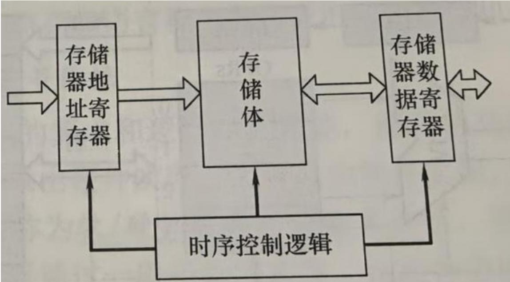  
主存储器的基本组成

存储体存放二进制信息，存储器地址寄存器（MAR：Memory Address Register）存放访存地址，经过地址译码后找到所选的存储单元。存储器数据寄存器（MDR：Memory Data Register）用于暂存要从存储器中读或写的信息，时序控制逻辑用于产生存储器所需的各种时序信号。

存储体由许多存储单元组成，每个存储单元包含若干存储元件，每个存储元件存储一位二进制代码0或1。因此存储单元可存储一串二进制代码，称这串代码为存储字，称这串代码的位数为存储字长，存储字长可以是1B或是字节的偶数倍。

## 1. MAR（存储器地址寄存器）

○ 核心作用：存地址。它接收 CPU 发来的内存地址，经过地址译码后，定位到存储体中对应的存储单元，相当于 “给数据找家门”。

\- 特点：它是单向输入寄存器，只接收地址信号，不参与数据的读写传输。

## 2. MDR（存储器数据寄存器）

○ 核心作用：存数据。它是存储体和 CPU 之间的数据中转站：读操作时，把存储体的数据暂存后发给 CPU；写操作时，把 CPU 发来的数据暂存后写入存储体。

\- 特点：它是双向寄存器，数据可以双向流动，相当于“数据的临时候车厅”。

## - MAR 位数 = 地址码长度

决定了最多能寻址多少个存储单元。

## - MDR 位数 = 存储字长

决定了一次从内存读写多少位数据。

一句话速记:

## MAR 管地址有多宽，MDR 管数据有多长。

MAR 用于寻址，其位数反映最多可寻址的存储单元的个数，如 MAR 为 10 位，则最多有 $2^{10}=1024$ 个存储单元，记为 1k。MAR 的长度与 PC（Program Counter 程序计数器）的长度相等：地址寄存器的位数，和程序计数器的位数一样多。PC 存的是下一条指令的地址。位数决定了 CPU 能给出多大范围的地址。MAR 存的是要访问的主存单元地址，位数决定了主存能被寻址多大空间。

MDR 的位数通常等于存储字长，一般为字节的 2 次幂的整数倍。

时序控制逻辑（时序控制器）是主存储器的 \*\*“节拍总指挥”，核心作用是让主存的所有部件（MAR、存储体、MDR）按照统一的时间节奏、有序地完成读写操作 \*\*，避免信号冲突和时序混乱。

## 核心工作原理

它的本质是根据CPU发来的控制信号，产生一组精准的时序脉冲信号，规定每个部件在“什么时候做什么事”：

## 1. 读操作时的控制流程

1. 先给 MAR 发控制信号，让它锁存 CPU 送来的地址；

2. 再给地址译码电路发信号，启动译码，定位存储单元；

3. 接着给存储体发读信号，让存储单元把数据输出到数据线上；

4. 最后给 MDR 发锁存信号，把数据暂存起来，准备传给 CPU。

## 2. 写操作时的控制流程

1. 先给 MAR 发控制信号，锁存地址；

2. 给 MDR 发控制信号，锁存 CPU 送来的待写数据；

3. 给存储体发写信号，把 MDR 中的数据写入指定的存储单元。

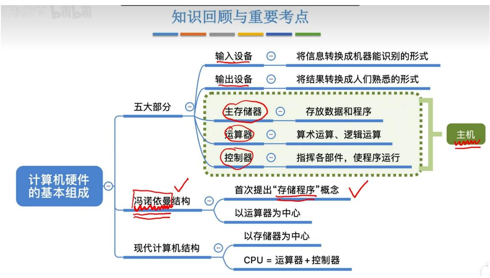

## 知识回顾与重要考点

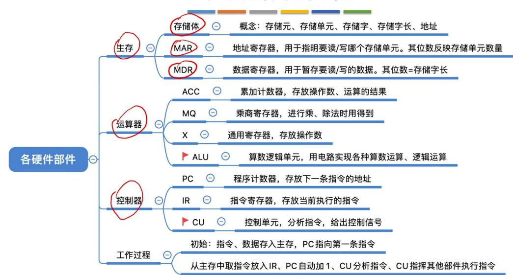

## 1. 存储字长 vs 机器字长 vs 指令字长

<table><tr><td>概念</td><td>核心定义</td><td>决定因素</td><td>常见例子(32位计算机)</td></tr><tr><td>存储字长</td><td>存储单元中二进制代码的位数。</td><td>由内存芯片的硬件结构决定(即数据寄存器的位数)。</td><td>通常是8位、16位、32位、64位。</td></tr><tr><td>机器字长</td><td>CPU一次整数运算所能处理的二进制位数。</td><td>由CPU内部的通用寄存器(ALU)的位数决定。</td><td>32位计算机的机器字长就是32位。</td></tr><tr><td>指令字长</td><td>一条指令(比如Load/Store指令)所占的二进制位数。</td><td>由指令格式(操作码+地址码)决定。</td><td>可能是定长(如32位),也可能是变长(如16~64位)。</td></tr><tr><td colspan="4">计组考研核心结论(一定要记住):通常情况下,存储字长=机器字长(为了匹配,一次访存取出的数据刚好够CPU一次计算)。但指令字长可以不同于存储字长。比如存储字长是32位,但为了节约空间,短指令可能只占16位(半字),长指令可能占64位(双字)。</td></tr></table>

\- 存储字（Storage Word）：是指存储单元中存放的二进制数据（即一串0和1），它是计算机一次存取操作所处理的数据单元。

\- 存储字长（Storage Word Length）：是指一个存储字所包含的二进制位数（即这串0和1的长度）。

简单类比：“存储字”就是“一个箱子里的货物”，“存储字长”就是“这个箱子的宽度（能放多少个球）”。

## 3. 运算器

## 逻辑运算：

考研408里的逻辑运算就4种：与、或、非、异或，全是按位算，规则非常死，背下来直接套。

## 一、基本逻辑运算（单个位运算规则）

设参与运算的每一位为 A、B，取值只能是 0 或 1

1. 与运算 AND (符号: ·、^、&)

全1才1，有0则0

<div class="mineru-algorithm" style="white-space: pre-wrap; font-family:monospace;">
- $0 \wedge 0 = 0$
- $0 \wedge 1 = 0$
- $1 \wedge 0 = 0$
- $1 \wedge 1 = 1$
</div>

2. 或运算 OR (符号: +、v、|)

有1则1，全0才0

```txt
- 0 v 0 = 0
- 0 v 1 = 1
- 1 v 0 = 1
- 1 v 1 = 1
```

3. 非运算 NOT (符号: $\neg$ 、 $\sim$ 、 $\sim$ )

0变1，1变0

4. 异或运算 XOR (符号: $\oplus$ 、^)

相同为 0，不同为 1

$$
\bullet 0 \oplus 1 = 1
$$

$$
\bullet 1 \oplus 0 = 1
$$

\- 与运算常用于清零、屏蔽位

\- 或运算常用于置 1

\- 异或常用于翻转、判等、加密

运算器的结构：

```txt
<// C
int a[100];
访问 a[i]
```


## 的基本组成

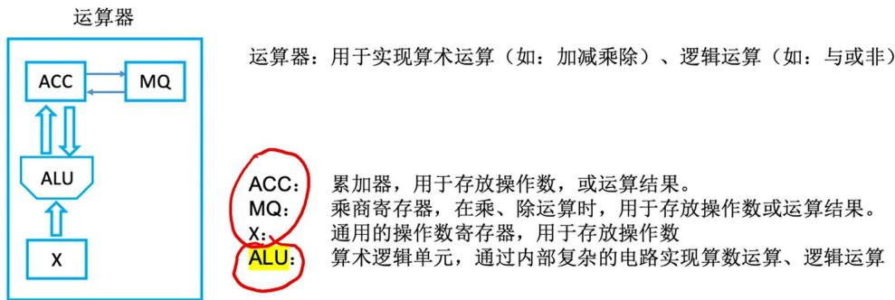

Accumulator Multiple-Quotient Register Arithmetic and Logic Unit

<table><tr><td></td><td>加</td><td>减</td><td>乘</td><td>除</td></tr><tr><td>ACC</td><td>被加数、和</td><td>被减数、差</td><td>乘积高位</td><td>被除数、余数</td></tr><tr><td>MQ</td><td></td><td></td><td>乘数、乘积低位</td><td>商</td></tr><tr><td>X</td><td>加数</td><td>减数</td><td>被乘数</td><td>除数</td></tr></table>

运算器的核心是算数逻辑单元（ALU:Arithmetic Logic Unit），运算器包含若干通用寄存器，用于暂存操作数和中间结果，如累加器（ACC:Accumulator），乘商寄存器（MQ:Multiplier-Quotient Register），操作数寄存器（X:X Register），变址寄存器（IX:Index Register），基址寄存器（BR:Base Register）等，其中前三个寄存器是必须具备的。

## 1. IX: 变址寄存器

IX = Index Register，变址寄存器。

它主要用于变址寻址：

$$
E A = (I X) + A
$$

其中：

\- $EA$ ：Effective Address，有效地址，也就是操作数真正所在的主存地址；

\- $(IX)$ : IX 寄存器里的内容;

\- $A$ ：指令中的形式地址，也叫地址码。

王道中总结：变址寻址的有效地址为 $EA = (IX) + A$ ，访存次数为1次；并且变址寻址常用于处理数组、循环程序。2027计算机组成原理\_高清带书签版(1)

## 直观理解

变址寻址可以理解成：

$$
\mathrm{数组元素地址} = \mathrm{数组首地址} + \mathrm{下标偏移量}
$$

例如：

机器级思路通常是：

$$
a [ i ] \text {地址} = a \text {数组首地址} + i \times \text {每个元素字节数}
$$

这里A可以表示数组首地址，IX可以表示偏移量。

所以 IX 更像是“下标/偏移寄存器”。

## 2. BR: 基址寄存器

BR = Base Register，基址寄存器。

它主要用于 基址寻址：

$$
E A = (B R) + A
$$

其中：

\- $(BR)$ ：基址寄存器中的内容，通常是某段程序或某个存储区域的起始地址；

\- $A$ ：形式地址，通常作为偏移量；

\- $EA$ ：最终有效地址。

王道中对基址寻址的表述是：将基址寄存器 BR 的内容与指令中的形式地址 A 相加，形成操作数的有效地址，即 $EA = (BR) + A$ 。☐ 2027 计算机组成原理\_高清带书签版(1)

## 直观理解

基址寻址可以理解成：

$$
\text { 实际地址 } = \text { 程序所在基地址 } + \text { 程序内部偏移量 }
$$

比如一个程序原来以为自己从地址0开始，但实际被操作系统装入到主存1000H开始的位置，那么：

$$
E A = 1 0 0 0 H + A
$$

这里 BR 里放 1000H，A 是程序内部写的偏移地址。

所以 BR 更像是“程序搬到内存哪里去了”的起点。

## 3. IX 和 BR 的核心区别

<table><tr><td>对比项</td><td>IX:变址寄存器</td><td>BR:基址寄存器</td></tr><tr><td>中文名</td><td>变址寄存器</td><td>基址寄存器</td></tr><tr><td>寻址方式</td><td>变址寻址</td><td>基址寻址</td></tr><tr><td>公式</td><td> $EA = (IX) + A$ </td><td> $EA = (BR) + A$ </td></tr><tr><td>谁更像“基准地址”</td><td>A通常像基地址</td><td>BR通常像基地址</td></tr><tr><td>谁更像“偏移量”</td><td>IX通常像偏移量</td><td>A通常像偏移量</td></tr><tr><td>内容由谁设定</td><td>用户程序可修改</td><td>通常由操作系统/管理程序设定</td></tr><tr><td>程序运行中是否常变化</td><td>常变化</td><td>一般不变</td></tr><tr><td>主要用途</td><td>数组、循环</td><td>多道程序、浮动程序、程序重定位</td></tr></table>

王道也明确区分：基址寄存器内容通常由操作系统或管理程序确定，执行过程中不可变；变址寄存器由用户设定，执行过程中可变，适合数组和循环。2027计算机组成原理\_高清带书签版(1)

一句话记：

BR 管“程序放哪儿”，IX 管“数组访问到第几个”。

## 4. X: 要看上下文，有两种常见含义

你问的X容易混，因为王道题里有时X表示两种东西。

情况一：X表示变址寄存器

有些题中会写：

$$
E A = (X) + A
$$

这里的 X 就是变址寄存器，和 IX 意思接近。王道题中就出现过“设指令中的地址码为 A，变址寄存器为 X，程序计数器为 PC”的表述。☐ 2027计算机组成原理\_高清带书签版(1)

这时：

$$
X \approx I X
$$

也就是“变址寄存器”。

运算器内还有程序状态寄存器（PSW:Program Status Word），也称标志寄存器，用于存放ALU运算得到的一些标志信息或处理机的状态信息，如结果是否溢出、有无产生进位或错位、结果是否为负等。

## 4.控制器：

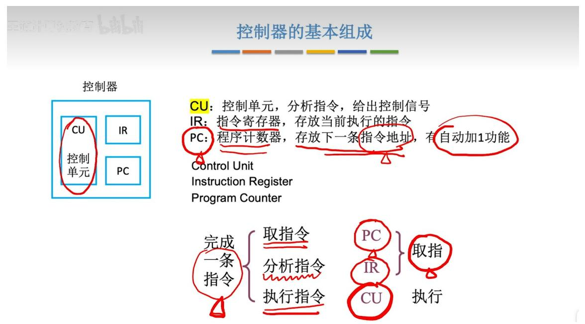  
控制器由程序计数器（PC:Program Counter）、指令寄存器（IR:Instruction Register）和控制单元（CU:Control Unit）组成。

• PC: Program Counter

程序计数器（存下一条指令地址）

\- IR: Instruction Register

指令寄存器（存放当前正在执行的指令）

\- CU: Control Unit

控制单元（指挥协调整个 CPU 工作）

\- OP: Operation Code

操作码（指令中表示做什么操作的部分）

\- Ad: Address

## 5.冯诺依曼结构

地址码（指令中表示操作数地址的部分）

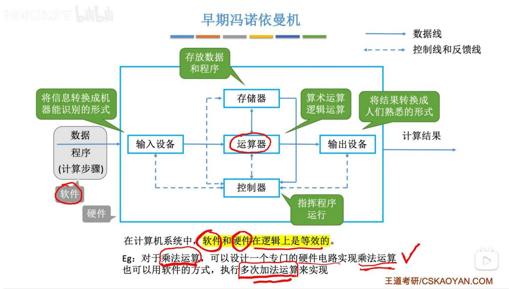

早期冯诺依曼机

冯·诺依曼计算机的特点：

1. 计算机由五大部件组成

2. 指令和数据以同等地位存于存储器，可按地址寻访

3. 指令和数据用二进制表示

4. 指令由操作码和地址码组成

5. 存储程序

6. 以运算器为中心

输入/输出设备与存储器之间的数据传送通过运算器完成

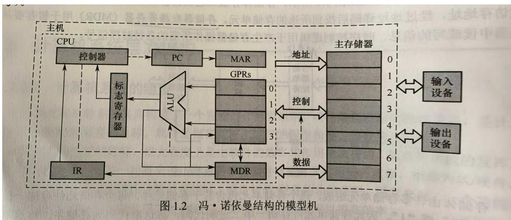  
虚线为控制信号。

GPRs

全称：General Purpose Registers

中文：通用寄存器组

就是 CPU 里一组不固定功能、可用来存放数据或地址的通用寄存器，区别于专用寄存器（如 PC、IR、ACC 等）。

冯·诺依曼计算机基本思想（又称存储程序原理）是计算机组成原理的理论基础，也是考研408的必考核心。

## 一、核心定义（一句话记忆）

“存储程序”：将程序（指令序列）和数据都以二进制形式存放在同一个存储器中，计算机工作时自动逐条取出指令并执行。

## 二、四大基本思想（考研简答题标准答案）

<table><tr><td>序号</td><td>思想</td><td>核心内容</td><td>现代体现</td></tr><tr><td>1</td><td>存储程序</td><td>程序预先存入存储器,机器自动执行</td><td>开机后OS从硬盘加载到内存</td></tr><tr><td>2</td><td>二进制表示</td><td>指令和数据都用二进制编码</td><td>所有软件最终都是0/1</td></tr><tr><td>3</td><td>顺序执行</td><td>指令按程序计数器(PC)顺序取出执行</td><td>除非遇到转移指令</td></tr><tr><td>4</td><td>五大部件</td><td>运算器、控制器、存储器、输入设备、输出设备</td><td>现代计算机仍沿用此结构</td></tr></table>

现代计算机的结构  
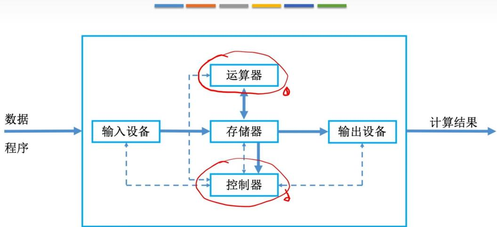  
现代计算机：以存储器为中心  
CPU=运算器+控制器

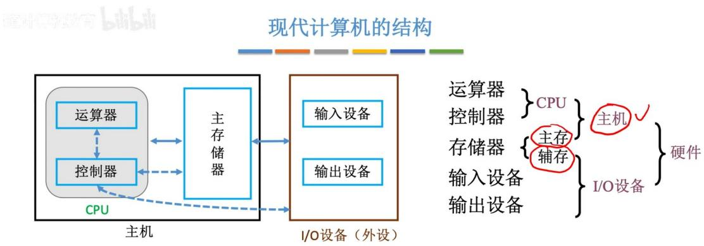

## 6.计算机系统的层次结构

ISA

全称：Instruction Set Architecture

中文：指令集体系结构

简单说：就是软件和硬件之间的接口标准，规定了CPU能执行哪些指令、怎么寻址、寄存器怎么用。

## 微体系结构：

微体系结构（又称微架构）是处理器内部的硬件组织方式，用于实现 ISA 定义的功能。如果说 ISA 定义了 “做什么”，那么微架构则决定了 “怎么做”。其核心设计包括数据通路组织、控制单元实现、流水线级数、缓存层次结构以及分支预测机制等。

例如，加法操作可能通过串行进位加法器、超前进位加法器，甚至专用的 SIMD 单元来实现，这些都属于微体系结构的范畴。相同的 ISA 可对应多种不同的微架构。以 Intel x86 为例，不同代际的处理器（如 Core、Skylake、Alder Lake）均遵循同一套 ISA 规范，但内部组织方式差异显著，体现了微架构的多样性与演进性。

## 微体系结构（微架构） | 计组标准定义 + 通俗理解

## 一、核心定义（考试直接背）

微体系结构，简称微架构，是ISA（指令集架构）之下、硬件电路之上的硬件底层实现层级。

指CPU内部如何用运算器、控制器、寄存器、数据通路、流水线、缓存、分支预测等硬件，去实现ISA规定的指令功能。

## 二、关键层级区分（必考）

1. ISA 指令集架构（上层）

规定：有哪些指令、指令格式、寄存器数量、寻址方式、编程模型

给程序员 / 软件看的，对软件可见

2. 微体系结构（下层）

规定：CPU 内部电路怎么搭、数据怎么走、控制器怎么设计、流水线几级、怎么加速执行

下层硬件细节，对上层软件完全透明

一句话：

ISA规定「要做什么指令」；微架构规定「硬件具体怎么做这条指令」

高级语言高度抽象，与机器指令无直接对应关系，仅汇编语言与 ISA 指令基本对应。

ISA 是软/硬件的抽象接口，定义了软件可见的处理器行为（如指令，寄存器，寻址方式等），而非仅描述功能。

同一 ISA 由不同微体系结构（如流水线、缓存设计等）实现，软件无须修改即可兼容。

## 7.CPU

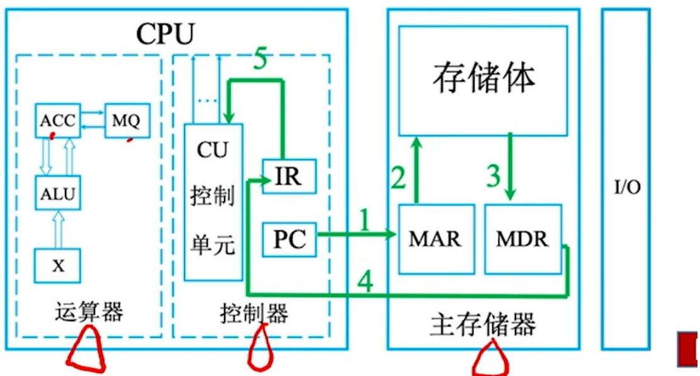

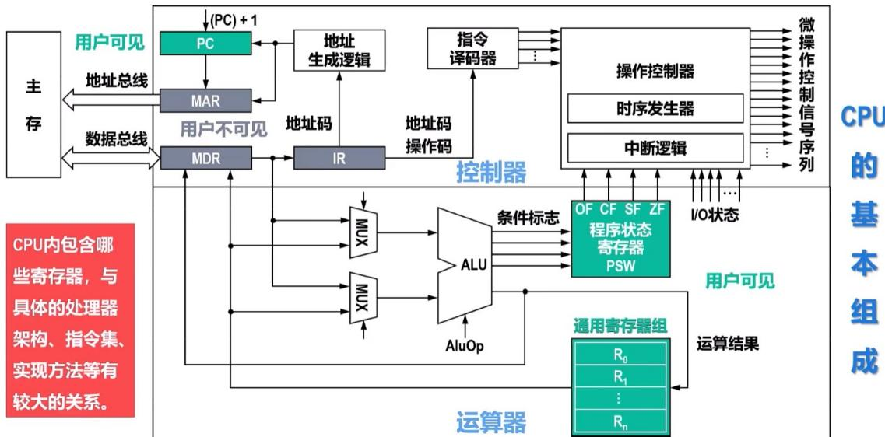

MUX

全称：Multiplexer

中文：多路选择器/数据选择器

作用：从多个输入数据里选一个输出，相当于一个“多选—开关”，在CPU数据通路里用来切换不同数据源。

## 1. CPU的核心组成（三大块）

<table><tr><td>部件</td><td>核心作用</td><td>主要组成子部件</td></tr><tr><td>运算器</td><td>执行算术运算(加减乘除)和逻辑运算(与或非)</td><td>ALU(算术逻辑单元)、暂存寄存器、累加器、标志寄存器</td></tr><tr><td>控制器</td><td>取指令、译码、发控制信号、指挥全机</td><td>PC(程序计数器)、IR(指令寄存器)、指令译码器、时序发生器</td></tr><tr><td>寄存器组</td><td>临时存储指令、地址和数据</td><td>通用寄存器(AX, BX等)、专用寄存器(SP, BP等)</td></tr></table>

## 2. 详细子部件清单（名词解释/选择题高频）

## 一、运算器（数据加工车间）

\- ALU（算术逻辑单元）：核心部件，负责计算。没有它就没有加减法。

\- 暂存寄存器：用于暂存从数据总线来的操作数，作为ALU的输入（对程序员透明）。

\- 累加器（ACC）：一个特殊的寄存器，存放运算结果或其中一个操作数。

\- 标志寄存器（PSW/FR）：存放运算结果的特征（如进位CF、溢出OF、结果为0ZF、负数SF）。

\- 乘商寄存器（MQ）：在乘除运算中辅助存放操作数。

## 二、控制器（大脑指挥中心）

\- PC（程序计数器）：存放下一条指令的地址。CPU就是靠它知道下一步该执行哪条指令。

\- IR（指令寄存器）：存放当前正在执行的指令。

\- 指令译码器：分析IR中的指令，识别它要做什么（是加法还是跳转）。

\- 时序发生器：产生节拍信号，决定什么时候取指令、什么时候执行。

\- 控制单元（CU）：组合逻辑或微程序，负责发出微操作命令（如MemRead，ALUAdd）。

## 三、寄存器组（内部临时仓库）

\- 通用寄存器：程序员可以直接使用，存放操作数或地址（如R0-R7）。

\- 地址寄存器（MAR）：连接地址总线，存放要访问的内存地址（属于CPU）。

\- 数据寄存器（MDR）：连接数据总线，存放要写入内存或刚从内存读出的数据（属于CPU）。

## 8.计算机系统的工作方式

## 正则语言（组成原理里怎么理解）

在组成原理里，它一般出现在指令格式、指令编码、有限状态机相关内容中：

\- 指结构非常规则、没有复杂嵌套、没有递归调用的一类语言 / 指令格式。

\- 可以用有限状态机、简单逻辑电路直接识别、译码。

\- 简单理解：结构规整、能被硬件电路直接处理的指令 / 编码格式。

## 助记符（组成原理必考）

\- 汇编语言中，用来代替二进制机器指令的英文符号。

\- 人容易记，所以叫助记符。

\- 汇编器会把它翻译成 0/1 机器码。

## 1. 什么是正则语言？

一句话定义：正则语言是最简单、最基础的一类形式语言，可以由有限自动机识别，或者用正则表达式描述。

## 核心特征：

\- 有限状态：识别正则语言的机器（有限自动机）只有有限个状态。这意味着它无法“记住”无限或任意长的信息。比如，它不能数到任意大的数字。

\- 无记忆或受限记忆：它没有像栈或磁带那样的外部存储器。它的“记忆”仅限于当前所处的有限个状态之一。

\- 表达能力有限：它不能处理嵌套或需要计数的模式。

## 2. 什么是助记符？在计算机组成原理中它是什么？

一句话定义：助记符是汇编语言中用于代替机器码（二进制指令）的、便于人类记忆的符号缩写。

在计算机组成原理的语境下：

计算机组成原理研究CPU、内存、寄存器等硬件如何工作以及如何执行指令。指令集架构（ISA）是软件和硬件的“合同”。指令有两种表示形式：

1. 机器码（硬件真正执行的）：一串二进制数。例如：10110000 01100001 （对x86 CPU来说，这可能代表 MOV AL, 61h）

2. 汇编语言（人类可读的）：使用助记符。例如：MOV AL，61h

助记符的作用：

\- 可读性：MOV（Move）比 10110000 好记得多。ADD（加法）、SUB（减法）、JMP（Jump）等都很直观。

\- 抽象硬件细节：你不需要记住 AL 寄存器是哪个二进制编码（比如 000），直接用名字即可。

\- 提供符号地址：可以用 LOOP：这样的标签代表内存地址，而不必手动计算跳转偏移量。

在计算机组成原理课程中的具体例子（以简单的MIPS或ARM为例）：

假设有一条加法指令：ADD R1，R2，R3 （将寄存器R2和R3的值相加，结果存入R1）。

\- 助记符: ADD

\- 操作数：R1，R2，R3（寄存器助记符）

#1: (PC)→MAR，导致(MAR)=0

计算机的工作过程  
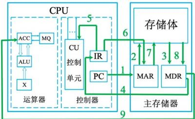

初：(PC)=0，指向第一条指令的存储地址

<table><tr><td rowspan="2">主存地址</td><td colspan="2">指令</td><td rowspan="2">注释</td></tr><tr><td>操作码</td><td>地址码</td></tr><tr><td>0</td><td>000001</td><td>0000000101</td><td>取数a至ACC</td></tr><tr><td>1</td><td>000100</td><td>0000000110</td><td>乘b得ab,存于ACC中</td></tr><tr><td>2</td><td>000011</td><td>0000000111</td><td>加c得ab+c,存于ACC中</td></tr><tr><td>3</td><td>000010</td><td>0000001000</td><td>将ab+c,存于主存单元</td></tr><tr><td>4</td><td>000110</td><td>0000000000</td><td>停机</td></tr><tr><td>5</td><td colspan="2">0000000000000010</td><td>原始数据a=2</td></tr><tr><td>6</td><td colspan="2">0000000000000011</td><td>原始数据b=3</td></tr><tr><td>7</td><td colspan="2">0000000000000001</td><td>原始数据c=1</td></tr><tr><td>8</td><td colspan="2">0000000000000000</td><td>原始数据y=0</td></tr></table>

#3: M(MAR)→MDR，导致(MDR)=000001 0000000101  
#4: (MDR)→IR，导致(IR)=000001 0000000101  
#5: OP(IR)→CU，指令的操作码送到CU，CU分析后得知，这是“取数”指令  
#6: Ad(IR)→MAR，指令的地址码送到MAR，导致(MAR)=5

取指令（#1\~#4）

#8: M(MAR)→MDR，导致(MDR)=000000000000010=2

分析指令（#5）

#9: (MDR)→ACC，导致(ACC)=0000000000000010=2

执行取数指令（#6～#9）

王道考研/CSKAOYAN.COM

至道计算机教育

## 计算机的工作过程

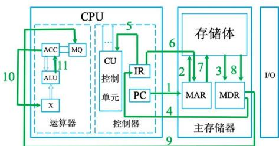

<table><tr><td rowspan="2">主存地址</td><td colspan="2">指令</td><td rowspan="2">注释</td></tr><tr><td>操作码</td><td>地址码</td></tr><tr><td>0</td><td>000001</td><td>0000000101</td><td>取数a至ACC</td></tr><tr><td>1</td><td>000100</td><td>0000000110</td><td>乘b得ab,存于ACC中</td></tr><tr><td>2</td><td>000011</td><td>0000000111</td><td>加c得ab+c,存于ACC中</td></tr><tr><td>3</td><td>000010</td><td>0000001000</td><td>将ab+c,存于主存单元</td></tr><tr><td>4</td><td>000110</td><td>0000000000</td><td>停机</td></tr><tr><td>5</td><td colspan="2">0000000000000010</td><td>原始数据a=2</td></tr><tr><td>6</td><td colspan="2">0000000000000011</td><td>原始数据b=3</td></tr><tr><td>7</td><td colspan="2">0000000000000001</td><td>原始数据c=1</td></tr><tr><td>8</td><td colspan="2">0000000000000000</td><td>原始数据y=0</td></tr></table>

#3: M(MAR)→MDR，导致(MDR)=000100 0000000110

#4: (MDR)→IR，导致(IR)=000100 0000000110

#5: OP(IR)→CU，指令的操作码送到CU，CU分析后得知，这是“乘法”指令

#6: Ad(IR)→MAR，指令的地址码送到MAR，导致(MAR)=6

#8: M(MAR)→MDR，导致(MDR)=000000000000011=3

#9: (MDR)→MQ，导致(MQ)=000000000000011=3

取指令（#1\~#4）

#10: (ACC)→X，导致(X)=2

分析指令（#5）

执行乘法指令（#6～#11）

王道考研/CSKAOYAN.COM

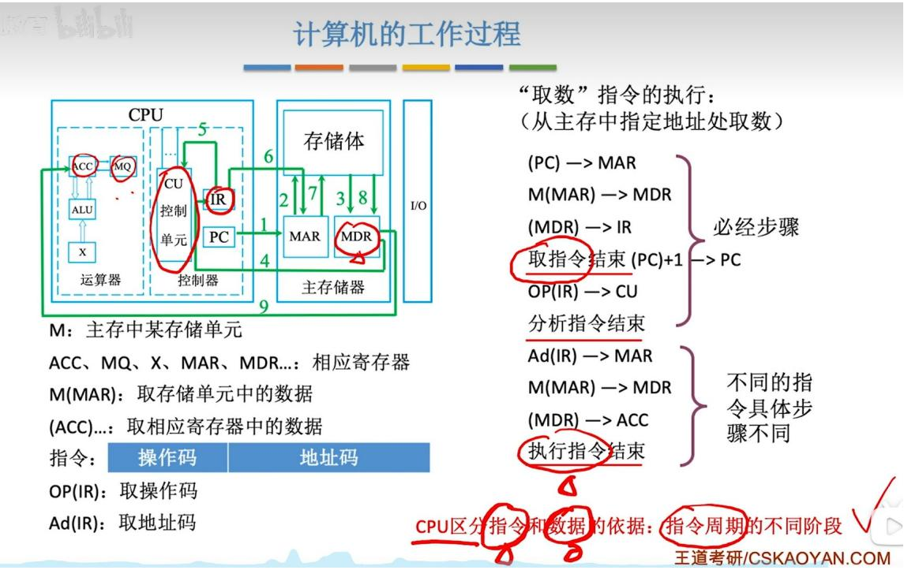

计算机工作过程详讲：https://www.bilibili.com/video/BV1ps4y1d73V?t=1889.6&p=5

## 9. 相关概念

编译、汇编、解释、目标、链接、翻译

1. 总纲

翻译是统称；

汇编、编译、解释都属于「程序翻译方式」。

## 2. 逐个定义 + 核心区别

① 翻译 (广义)

所有把一种语言转为另一种语言的过程，都叫翻译。

包含三类：

\- 汇编

\- 编译

\- 解释

## 1. 编译 (Compilation)

\- 定义：一种整体翻译的过程。编译程序（编译器）将高级语言（如C、C++）一次性全部翻译成汇编语言或机器语言。

\- 特点：翻译后生成一个独立的可执行文件（如 .exe）。运行时不需要编译器。

\- 与计组的关系：这是计组中“指令集体系结构（ISA）”的体现。编译器负责把高级代码映射到目标机器的指令集（如x86、ARM、RISC-V）。

考点示例：不同优化级别（-O0, -O1, -O2）如何影响编译后的指令条数和流水线效率。

## 2. 汇编 (Assembly)

\- 定义：将汇编语言（符号化的机器语言，如MOV R1, #5）翻译成机器语言（二进制代码，如E3A01005）的过程。

\- 特点：通常是一对一的映射（一条汇编指令对应一条机器指令）。由汇编器执行。

\- 与计组的关系：直接对应指令格式（操作码、寄存器地址、立即数）、寻址方式（立即、直接、间接、变址等）。

考点示例：给定一条汇编指令 ADD R0，[R1]，写出其机器码的二进制格式，并分析各字段的含义。

## 3. 解释 (Interpretation)

\- 定义：边翻译边执行。解释器不生成独立的目标代码，而是逐条读取高级语言（如Python、JavaScript）或中间代码，每条语句执行一次。

\- 特点：执行效率通常低于编译执行，但灵活性高、跨平台性好。

\- 与计组的关系：解释器本身也是一个程序，它运行在真实的硬件上。解释执行时，程序计数器（PC）指向的是解释器的指令，而不是用户程序的原始代码。

考点示例：比较编译执行和解释执行对CPU流水线分支预测的影响（解释执行分支更难预测）。

## 4. 目标 (Object / Target)

\- 定义：这是一个多义词，在编译过程中主要指目标代码或目标文件。

目标代码：编译器/汇编器生成的尚未链接的机器语言代码。它包含机器指令、数据，但其中的地址可能是可重定位的（相对地址），且外部符号（如 printf）未解析。

○ 目标文件：存放目标代码的文件（如 .o 或 .obj 文件）。

\- 与计组的关系：链接过程将目标文件和库文件合并，完成符号解析和重定位，生成最终的可执行文件。这涉及地址绑定（逻辑地址到物理地址的早期或晚期绑定）。

考点示例：一个变量在目标文件中是相对地址，链接后变成绝对地址；这影响了操作系统的地址重定位和内存分配。

在考研408计算机组成原理（以及操作系统）的语境下，链接是紧接着“编译、汇编、目标”之后的一个关键步骤。

## 简单定义：

链接是将多个目标文件（.o 或 .obj）和库文件（.lib 或 .a）合并，解决它们之间的符号引用（比如函数调用、变量使用），并完成地址重定位，最终生成一个可执行文件（如 .exe 或 .out）的过程。

## 1. 为什么需要链接？（结合计组）

你之前问过“目标文件”，它里面包含的是可重定位地址（相对地址）。比如：

\- 文件 A.o 中调用了 func()，但这个 func() 的代码在 B.o 里。

\- 链接器就是那个“拼图师”，它把所有目标文件的代码段、数据段拼在一起，把 A.o 里那个空的 func 地址，改成 B.o 中 func 的真实（绝对或相对）地址。

## 在计组中的意义：

最终生成的可执行文件，其代码中的地址是逻辑地址（虚拟地址）。当程序运行时，操作系统加载器会把这些逻辑地址映射到物理内存中。

## 2. 链接的核心工作（考研考点）

链接器主要做两件事：

<table><tr><td>步骤</td><td>英文</td><td>作用</td><td>计组/操作系统关联点</td></tr><tr><td>符号解析</td><td>Symbol Resolution</td><td>找到每个符号(函数名、全局变量名)的定义位置。</td><td>涉及编译器的符号表结构。</td></tr><tr><td>重定位</td><td>Relocation</td><td>把每个目标文件中的相对偏移地址,改成最终可执行文件中的逻辑地址。</td><td>涉及地址绑定(从编译时到加载时的地址转换)。</td></tr></table>

根据链接发生的时间不同，分为三种：

## (1) 静态链接

\- 时间：编译、汇编之后，生成可执行文件之前（由链接器完成）。

\- 结果：库函数的代码被直接复制到最终的可执行文件中。

\- 优点：运行时不需要库文件，执行速度快（无链接开销）。

\- 缺点：生成的文件体积大；如果库升级（如修复bug），程序需要重新链接。

\- 例子：Windows .exe 文件（如果它静态链接了C运行时库）。

## (2) 动态链接 (重点)

\- 时间：加载时（程序启动时）或运行时（执行过程中第一次调用时）。

\- 结果：可执行文件中只记录动态链接库（如 .dll 或 .so）的名字和函数引用，不包含库代码。

\- 实现：操作系统加载器或动态链接器负责找到内存中的库（如果未加载则加载），并将函数地址填入调用点。

\- 优点：多个进程可以共享内存中的同一份库代码（节省内存和磁盘空间）；库升级无需重新链接程序。

\- 缺点：存在一定的运行时开销（首次调用稍慢）；依赖库的存在（“DLL Hell”问题）。

\- 在计组中的考点：动态链接如何影响指令格式？通常通过PLT（过程链接表）和GOT（全局偏移表）实现间接跳转，这涉及额外的内存访问和指令执行。

(3) 加载时链接（动态链接的一种特殊时机）

\- 严格来说，是动态链接的一种：在程序加载到内存后、开始执行前，由操作系统的加载器完成链接。

## 4. 考研408核心考点详解

考点一：三种链接方式的比较（选择题、简答题）

<table><tr><td>特性</td><td>静态链接</td><td>动态链接(加载时)</td><td>动态链接(运行时)</td></tr><tr><td>发生时间</td><td>生成可执行文件前</td><td>程序加载时</td><td>程序执行中第一次调用时</td></tr><tr><td>可执行文件大小</td><td>大(包含库代码)</td><td>小(仅存引用)</td><td>小</td></tr><tr><td>内存占用</td><td>每进程独立副本(大)</td><td>多进程共享同一份库代码(小)</td><td>多进程共享(小)</td></tr><tr><td>启动速度</td><td>快(无需解析)</td><td>稍慢(需解析符号)</td><td>第一次调用稍慢</td></tr><tr><td>库升级</td><td>需重新链接</td><td>替换DLL即可(无需重链程序)</td><td>替换DLL即可</td></tr><tr><td>典型例子</td><td>单文件程序、嵌入式系统</td><td>大部分OS系统库(如libc.so)</td><td>插件、COM组件</td></tr></table>

## 系列机：

在考研408的计算机组成原理中，系列机是一个重要的概念，尤其在指令集体系结构（ISA）和计算机系统设计相关题目中出现。

简单直接的定义是：

系列机是指由同一厂家生产的，具有相同系统结构（主要是指令集体系结构），但不同型号、不同速度/价格/技术实现的一系列计算机。

核心要点在于：体系结构相同，组成与实现技术不同。

## 1. 核心定义与关键区分

为了在考试中不丢分，必须严格区分以下两个层次：

<table><tr><td>层次</td><td>英文</td><td>含义</td><td>是否保持不变(系列机特征)</td></tr><tr><td>体系结构</td><td>Architecture</td><td>指指令集、数据类型、寄存器、寻址方式、中断系统等软件可见的特性。</td><td>是。这是系列机的根本保证。</td></tr><tr><td>组成</td><td>Organization</td><td>指具体硬件实现,如ALU如何实现、Cache大小、流水线级数、总线宽度等。</td><td>否。不同型号可以不同(低端用单周期,高端用多发射流水线)。</td></tr><tr><td>实现技术</td><td>Implementation</td><td>指物理器件,如逻辑门电路、晶体管、制程工艺。</td><td>否。可以升级(从TTL到CMOS,从双极型到MOS)。</td></tr></table>

一句话：系列机要求指令系统向上兼容（低档机软件能在高档机运行），但不要求硬件实现相同。

## 相联存储器：

相连存储器（相联存储器）是一种不通过地址，而是通过存储内容的特征（关键字）来访问的内存结构。

它与我们常规的RAM（随机存取存储器）有本质区别。在考研大纲和真题中，它几乎总是与TLB（快表）、Cache的查找方式以及页表的加速访问绑定在一起考查。

## 1. 核心原理：按内容寻址 vs 按地址寻址

这是考试中选择题的高频考点：

<table><tr><td>特性</td><td>RAM(随机存取存储器)</td><td>相连存储器(CAM)</td></tr><tr><td>访问方式</td><td>按地址访问(给出地址A,读出数据D)</td><td>按内容访问(给出关键字K,找出存储K的地址或数据)</td></tr><tr><td>工作流程</td><td>输入:地址→输出:数据</td><td>输入:要查找的值→输出:匹配位置或数据</td></tr><tr><td>硬件实现</td><td>每个存储单元独立</td><td>每个存储单元带比较电路(更复杂、更贵)</td></tr><tr><td>速度</td><td>慢(需要地址译码)</td><td>快(并行比较所有单元)</td></tr><tr><td>典型应用</td><td>内存条、显存</td><td>TLB(快表)、Cache的Tag(标记)存储</td></tr></table>

## 简单比喻：

\- RAM（普通内存）：就像去图书馆，你必须先知道书架号（地址），然后去那里拿书。

\- 相连存储器：就像在搜索引擎里输入书名（内容），图书馆里所有书架同时检查自己有没有这本书，瞬间告诉你书在哪。

## 2. 在考研408中的唯一出现场景

虽然概念听起来高大上，但408考试中，它只会出现在以下三个具体部件的描述中，你只需要理解在这些部件里它是如何工作的。

## 场景一：TLB（快表）——最常见的考点

TLB是页表的Cache，用于加速虚拟地址到物理地址的转换。

\- 存储的内容：虚拟页号（作为关键字）和对应的物理页框号（作为数据）。

\- 工作过程：CPU给出虚拟页号（内容），TLB硬件并行比较所有条目。

\- 命中：直接输出对应的物理页框号。

\- 不命中：去内存中的慢表（页表）查询。

\- 这就是典型的“相连存储器”应用。

## 场景二：Cache的标记存储器（Tag Memory）

Cache判断某地址是否在缓存中时，也需要查找。

\- 存储的内容：主存地址的Tag（标记位）（关键字）。

\- 工作过程：对于全相联和组相联Cache，CPU拿地址中的Tag去和该组内所有Cache行的Tag进行并行比较。

\- 结论：虽然教材不常直接说“Cache的Tag阵列是相连存储器”，但从原理上，它的查找逻辑就是“按内容寻址”。

## 场景三：写操作的“按内容寻址”理解

当你在操作系统中学习写时复制（Copy-on-Write）或某些特殊的写操作时，如果需要根据物理地址反查是哪个虚拟页在映射它，这种反查表通常也是用相连存储器实现的。

## 5. 考研408中如何应对？

## 核心策略：看题目考的是什么操作！

<table><tr><td>题目问法</td><td>正确答案</td><td>理由</td></tr><tr><td>相联存储器的核心特征/本质是什么?</td><td>按内容寻址</td><td>这是它与RAM的根本区别</td></tr><tr><td>相联存储器支持哪些寻址方式?</td><td>既可按地址,也可按内容</td><td>硬件实现上两种都支持</td></tr><tr><td>相联存储器在Cache/TLB中主要用于什么操作?</td><td>按内容查找</td><td>这是它的典型应用场景</td></tr><tr><td>相联存储器如何写入数据?</td><td>按地址写入</td><td>写入需要指定位置</td></tr></table>

## 如果遇到争议题：

\- 如果选项中有“只能按内容寻址”这种绝对化的表述，要小心——因为从硬件实现角度看它并非“只能”

\- 王道教材既然明确写了“既可以按地址也可以按内容”，那么以王道为准来应对408考试是稳妥的策略

## 总结一句话：

相联存储器本质上是按内容寻址（这是它的核心特征），但硬件上两种寻址方式都支持（按地址用于写入和读出，按内容用于查找）。王道教材强调后者（完整功能），部分资料强调前者（核心特征），两者并不矛盾，只是侧重点不同。

## 寄存器、Cache、内存：

这三个概念是计算机存储层次结构的核心，考研408中经常结合考查它们的速度、容量、成本、位置以及CPU访问它们的流程。

下面从定义、位置、特点、在存储体系中的层次、以及典型考点五个方面分别介绍。

## 一、总体层次关系（最重要）

## 一句话总结：

寄存器是CPU的“手心”，Cache是CPU的“手边”，内存是CPU的“桌面”。

## 二、寄存器 (Register)

## 1. 定义

寄存器是CPU内部的临时存储单元，用于存放正在执行的指令、运算的操作数、中间结果等。

## 2. 关键特性

<table><tr><td>特性</td><td>描述</td></tr><tr><td>位置</td><td>CPU芯片内部</td></tr><tr><td>材料</td><td>触发器(D触发器)或锁存器</td></tr><tr><td>速度</td><td>极快(与CPU同频,约0.3~1 ns)</td></tr><tr><td>容量</td><td>极小(几十到几百个字节)</td></tr><tr><td>成本</td><td>极高(每个寄存器占大量晶体管)</td></tr><tr><td>访问方式</td><td>直接由指令中的寄存器编号访问</td></tr><tr><td>是否可编址</td><td>是(汇编指令中直接写 R0,R1 等)</td></tr></table>

## 4. 考研常考

\- 寄存器无地址（通过寄存器编号访问，不参与内存地址映射）

\- 寄存器与内存的数据交换必须通过指令（如 LOAD，STORE）

\- RISC架构中寄存器数量多（32个以上），CISC中较少

## 三、Cache（高速缓冲存储器）

## 1. 定义

Cache是位于CPU和内存之间的高速小容量存储器，用于自动保存内存中被频繁访问的数据副本，对程序员透明（不可见）。

## 2. 关键特性

<table><tr><td>特性</td><td>描述</td></tr><tr><td>位置</td><td>CPU芯片内部(L1/L2)或芯片外(L3,现代多在片内)</td></tr><tr><td>材料</td><td>SRAM(静态随机存取存储器,6管结构)</td></tr><tr><td>速度</td><td>快(约1~10 ns,比寄存器慢,比内存快)</td></tr><tr><td>容量</td><td>较小(几KB ~ 几十MB)</td></tr><tr><td>成本</td><td>较高(比内存贵,比寄存器便宜)</td></tr><tr><td>访问方式</td><td>硬件自动管理,对软件透明(程序员无法直接操作)</td></tr><tr><td>是否可编址</td><td>否(不能通过地址直接访问Cache)</td></tr></table>

## 4. 考研408核心考点

考点1: Cache与内存的映射方式

\- 直接映射：主存块 $\rightarrow$ 固定Cache行（冲突率高）

\- 全相联映射：主存块 $\rightarrow$ 任意Cache行（查找慢，硬件复杂）

\- 组相联映射：折中方案（408最常考）

考点2: Cache的写策略

\- 写直达：同时写Cache和内存（慢，数据安全）

\- 写回：只写Cache，标记脏位，替换时写回内存（快，常用）

考点3：Cache的替换算法

\- LRU、FIFO、随机、LFU

考点4：Cache对程序员透明性

\- 程序员无法直接控制Cache，但可以通过优化程序局部性间接利用

考点5：命中率与平均访问时间计算

```txt
text
复制 下载
平均访问时间 = 命中率 × 命中时间 + 缺失率 × 缺失惩罚
```

## 四、内存（主存，Main Memory）

## 1. 定义

内存是计算机的主存储器，用于存放当前运行的程序和数据，CPU通过地址总线直接访问。

## 2. 关键特性

<table><tr><td>特性</td><td>描述</td></tr><tr><td>位置</td><td>主板上的内存插槽</td></tr><tr><td>材料</td><td>DRAM(动态随机存取存储器,1管1电容)</td></tr><tr><td>速度</td><td>慢(约50~100 ns)</td></tr><tr><td>容量</td><td>大(4GB ~ 几百GB)</td></tr><tr><td>成本</td><td>低(单位比特价格最低)</td></tr><tr><td>访问方式</td><td>通过地址总线按字节或字访问</td></tr><tr><td>是否可编址</td><td>是(每个存储单元有唯一地址)</td></tr></table>

## 3. 分类

<table><tr><td>类型</td><td>特点</td><td>用途</td></tr><tr><td>DRAM</td><td>需要刷新,功耗低,容量大</td><td>主存</td></tr><tr><td>SRAM</td><td>不需刷新,速度快,容量小,成本高</td><td>Cache</td></tr><tr><td>ROM</td><td>只读,断电不丢失</td><td>BIOS、固件</td></tr></table>

## 4. 考研408核心考点

## 考点1：内存编址与寻址

\- 按字节编址：每个地址对应1字节

\- 按字编址：每个地址对应1个字（如32位机器4字节）

## 考点2：内存与CPU的连接

\- 地址线、数据线、控制线的连接

\- 片选逻辑（用译码器）

## 考点3：内存扩展

\- 位扩展（增加字长）

\- 字扩展（增加容量）

## 考点4：内存的刷新

\- DRAM需要定期刷新（每ms级），刷新方式（集中、分散、异步）

## 考点5：与Cache、寄存器的关系

\- CPU访问内存时，先查Cache（若命中则直接返回）

\- 寄存器 $\leftrightarrow$ 内存: 通过 LOAD / STORE 指令

## 五、三者对比表（选择题必背）

<table><tr><td>对比项</td><td>寄存器</td><td>Cache</td><td>内存(主存)</td></tr><tr><td>位置</td><td>CPU内部</td><td>CPU内部(L1/L2)或外部(L3早期)</td><td>主板上</td></tr><tr><td>实现技术</td><td>触发器/锁存器</td><td>SRAM(6管)</td><td>DRAM(1管1电容)</td></tr><tr><td>速度</td><td>0.3~1 ns(最快)</td><td>1~15 ns(快)</td><td>50~100 ns(慢)</td></tr><tr><td>典型容量</td><td>几十~几百字节</td><td>几KB~几十MB</td><td>4GB~几百GB</td></tr><tr><td>单位成本</td><td>极高</td><td>较高</td><td>低</td></tr><tr><td>访问方式</td><td>指令中直接写寄存器号</td><td>硬件自动管理(透明)</td><td>通过地址总线访问</td></tr><tr><td>是否断电丢失</td><td>是</td><td>是</td><td>是(DRAM)</td></tr><tr><td>程序员可控性</td><td>直接控制</td><td>不可控(透明)</td><td>直接控制(通过地址)</td></tr><tr><td>存在目的</td><td>存放运算的立即数据</td><td>缓解CPU与内存速度差</td><td>存放运行中的程序和大量数据</td></tr></table>

## 10.主存储器

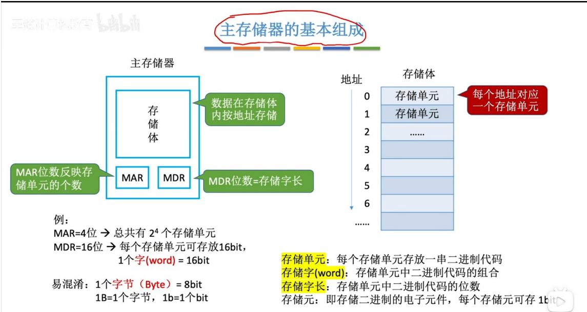  
存储单元：每个存储单元存放一串二进制代码  
存储字(word): 存储单元中二进制代码的组合  
存储字长：存储单元中二进制代码的位数  
存储元: 即存储二进制的电子元件, 每个存储元可存 1bit

## 11.计算机软件

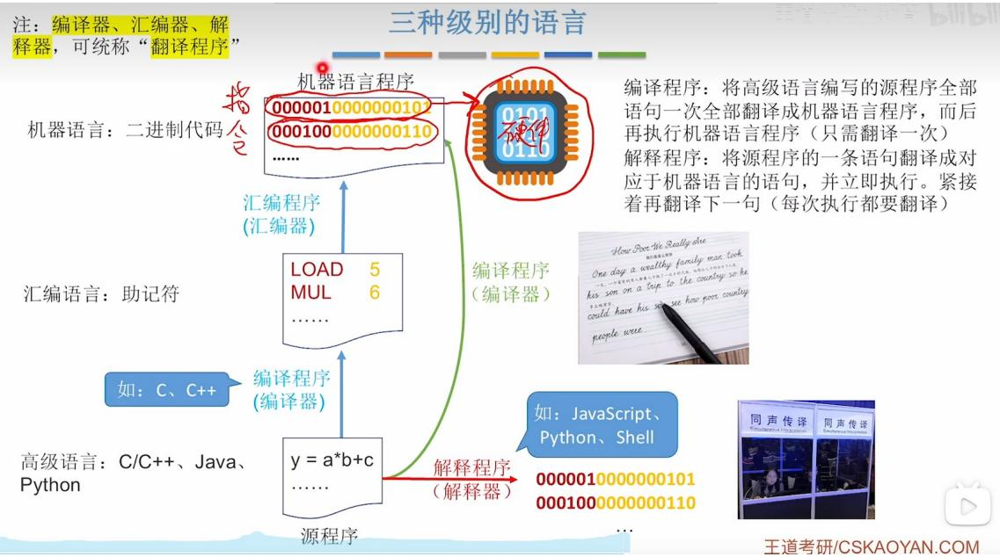

## 12.计算机的性能指标

## 1. 运算速度

考点追踪 ▶ 提高系统性能的综合措施（2010）

(1) 吞吐量和响应时间

\- 吞吐量。指系统在单位时间内处理请求的数量。它受多个环节影响，包括信息输入内存的速度、CPU取指令的速度、数据在内存中读写的速率，以及结果输出到外部设备的效率。由于主存储器在这些环节中扮演关键角色，其存取性能对系统吞吐量有显著影响。

\- 响应时间。指从用户发出请求到系统返回所需结果的总等待时间，通常包括 CPU 时间（程序实际运行时间）和等待时间（如磁盘访问、内存访问、I/O 操作等所花费的时间）。

## (2) 主频和 CPU 时钟周期

考点追踪 ▶ 时钟脉冲信号和时钟周期的相关概念（2019）

\- CPU时钟周期。机器内部主时钟脉冲的宽度，是CPU工作的最小时间单位。

时钟脉冲由机器脉冲源产生，经整形和分频后形成。

时钟周期通常以相邻状态单元间组合逻辑电路的最大延迟时间为基准确定；在流水线结构中，则以指令流水线的每个流水段的最大延迟时间为准。

考点追踪 主频和时钟周期的转换计算（2013）

\- 主频（CPU 时钟频率）。机器内部主时钟的频率，即时钟周期的倒数，是衡量处理器速度的重要参数。对于同一个型号的计算机，主频越高，执行指令的每个步骤所需时间越短，运算速度越快。直观理解，主频表示每秒包含的时钟周期数。

## 注意

CPU 时钟周期 = 1/主频。主频单位为赫兹（Hz），如 10Hz 表示每秒 10 个时钟周期。

（3）CPI（Cycles Per Instruction），执行一条指令所需的时钟周期数

CPU时钟周期：

CPU 中最小、最基本的时间单位，是时钟信号一个完整震荡周期的时间。

也等于：CPU主频的倒数。

1. CPU 内部所有动作（寄存器传输、运算、译码、读写）都跟着时钟节拍走；

2. 一个时钟周期 = 一拍；

3. 一步硬件操作，至少需要1个时钟周期；

4. 频率越高→节拍越快→时钟周期越短→CPU 速度越快。

时钟周期通常以相邻状态单元间组合逻辑电路的最大延迟时间为基准确定；在流水线结构中，则以指令流水线的每个流水段的最大延迟时间为准。

这句话的本质是:

时钟周期的长度，必须由电路中「最慢的那一段」决定，否则会出现时序错误。


【例 1.1】假定计算机 M1 和 M2 具有相同的指令集体系结构，M1 的主频为 2GHz，程序 P 在 M1 上的运行时间为 10s。M2 采用新技术可使主频大幅提升，但其平均 CPI 也增加到 M1 的 1.5 倍。则 M2 的主频至少需提升到多少，才能使程序 P 在 M2 上的运行时间缩短为 6s?

解：

程序 P 在 M1 上的时钟周期数 = 指令条数×平均 CPI = CPU 执行时间×主频 = $10s \times 2GHz = 2 \times 10^{10}$ 。

M2 的平均 CPI 为 M1 的 1.5 倍，因此程序 P 在 M2 上的时钟周期数 $=1.5 \times 2 \times 10^{10} = 3 \times 10^{10}$ 。

要使程序 P 在 M2 上的运行时间缩短至 6s，则 M2 所需的主频至少为

程序 P 在 M2 上的时钟周期数÷CPU 执行时间 = $3 \times 10^{10} \div 6s = 5GHz$

由此可见，M2 的主频是 M1 的 2.5 倍，但其实际性能仅提升至 M1 的 1.67 倍。

主频单位为 HZ（赫兹），如 10HZ 表示每秒 10 个时钟周期。

在考研408的语境下，除了 MHz（兆赫兹）和 GHz（吉赫兹），Hz（赫兹）本身以及 kHz、THz 等也都是可能的考点，但主要考察的是单位换算关系。

以下是完整的频率单位体系及其与基本单位 Hz 的换算：

<table><tr><td>单位</td><td>中文名称</td><td>符号</td><td>与 Hz 的换算关系</td></tr><tr><td>Hz</td><td>赫兹</td><td>Hz</td><td>1 Hz = 1 次/秒</td></tr><tr><td>kHz</td><td>千赫兹</td><td>kHz</td><td>1 kHz =  $10^{3}$  Hz</td></tr><tr><td>MHz</td><td>兆赫兹</td><td>MHz</td><td>1 MHz =  $10^{6}$  Hz</td></tr><tr><td>GHz</td><td>吉赫兹</td><td>GHz</td><td>1 GHz =  $10^{9}$  Hz</td></tr><tr><td>THz</td><td>太赫兹</td><td>THz</td><td>1 THz =  $10^{12}$  Hz</td></tr></table>

FLOPS: Floating-Point Operations Per Second, 每秒执行的浮点运算次数。

MFLOPS: Million FLOPS，百万(10^6)次浮点运算/S

GFLOPS:Giga FLPOS，十亿(10^9)次浮点运算/S

TFLOPS:Tera FLOPS，万亿(10^12)次浮点运算/S

PFLOPS:Peta FLOPS，千万(10^15)亿次浮点运算/S

EFLOPS:Exa FLOPS，百亿(10^18)亿次浮点运算/S

ZFLOPS:Zetta FLOPS，十万亿(10^21)亿次浮点运算/S

计算机的机器字长与运算精度相关，机器字长越长，数据的位数越多，定点数或浮点数所表示及运算的精度就越高。

(5) MIPS (Million Instructions Per Second), 每秒执行多少百万条指令

$$
\text { 考点追踪 } \quad \text { MIPS相关的计算（2012、2013） }
$$

$$
\mathrm{MIPS} = \text {指令条数} \div (\mathrm{CPU} \text {执行时间} \times 1 0 ^ {6}) = \text {主频} \div (\mathrm{CPI} \times 1 0 ^ {6}) 。
$$

MIPS 用于不同机器间的性能比较存在明显缺陷：不同机器的指令集架构各异，指令的功能强度往往不等。例如，M1 中一条指令完成的操作在 M2 上可能需多条指令实现；同时，各机器的 CPI 与时钟周期也不同，导致同一条指令的实际执行时间差异显著。

## 问题:

## 问题 1:

计算机硬件能直接执行硬件描述语言程序吗

这是一个很好的问题，它触及了硬件设计与软件执行之间的本质区别。

简短结论：

不能。计算机硬件不能直接执行硬件描述语言（如 Verilog、VHDL）程序。

硬件描述语言（HDL）不是给CPU执行的“程序”，而是用来描述和设计数字电路（如CPU本身）的“图纸”。

## 1. 核心区别：程序 vs. 图纸

<table><tr><td>特性</td><td>普通程序 (C/C++/Python)</td><td>硬件描述语言 (Verilog/VHDL)</td></tr><tr><td>本质</td><td>指令序列,告诉CPU一步步做什么</td><td>电路描述,描述逻辑门、触发器和连线</td></tr><tr><td>执行者</td><td>CPU (通用处理器)</td><td>综合工具 + FPGA/ASIC</td></tr><tr><td>输入</td><td>源代码 → 编译 → 机器码</td><td>源代码 → 综合 → 网表 → 物理电路</td></tr><tr><td>输出</td><td>CPU内部状态的变化 (寄存器、内存)</td><td>实际的硬件电路 (逻辑门、触发器)</td></tr><tr><td>能否直接运行</td><td>能 (编译成机器码后)</td><td>不能 (需要先变成电路)</td></tr></table>

## 打个比方：

\- 普通程序 = 菜谱 (按步骤做菜)

\- HDL程序 = 建筑图纸 (描述房子长什么样，不能“执行”图纸，得按图纸把房子盖起来)

硬件描述语言程序不能被计算机硬件直接执行。

Again:

1. 编译、汇编、解释、链接、翻译

<table><tr><td>高级语言 → 编译</td></tr><tr><td>汇编语言 → 汇编</td></tr></table>

## 二、四个概念逐个讲

<table><tr><td>概念</td><td>本质</td><td>输入</td><td>输出</td><td>是否生成目标程序</td><td>是否能被CPU直接执行</td></tr><tr><td>翻译程序</td><td>总称</td><td>一种语言写的程序</td><td>另一种语言写的程序</td><td>不一定</td><td>不一定</td></tr><tr><td>编译程序</td><td>高级语言整体翻译</td><td>高级语言源程序</td><td>汇编语言或机器语言目标程序</td><td>通常生成</td><td>生成机器码后才可执行</td></tr><tr><td>解释程序</td><td>高级语言逐句执行</td><td>高级语言源程序</td><td>不生成独立目标程序</td><td>通常不生成</td><td>解释器执行过程中间接完成</td></tr><tr><td>汇编程序</td><td>汇编语言翻译</td><td>汇编语言源程序</td><td>机器语言目标程序</td><td>生成</td><td>生成后可执行</td></tr></table>

## 七、编译程序 vs 汇编程序：最容易混

这两个都能生成目标程序，但输入不同。

<table><tr><td>对比点</td><td>编译程序</td><td>汇编程序</td></tr><tr><td>输入语言</td><td>高级语言</td><td>汇编语言</td></tr><tr><td>输出语言</td><td>汇编语言或机器语言</td><td>机器语言</td></tr><tr><td>抽象程度</td><td>高</td><td>低</td></tr><tr><td>是否接近硬件</td><td>相对远</td><td>很接近</td></tr><tr><td>例子</td><td>C → 汇编 / 机器码</td><td>汇编 → 机器码</td></tr></table>

记忆：

所以：

C 程序 .c → 编译程序 → 汇编程序 .s

汇编程序 .s → 汇编程序 → 机器目标文件 .o

## 注意这里有个绕口点：

第一个“汇编程序.s”里的“程序”指的是汇编语言写的源程序；

第二个“汇编程序”指的是汇编器这个系统软件。

八、编译程序 vs 解释程序：另一个高频考点

<table><tr><td>对比点</td><td>编译程序</td><td>解释程序</td></tr><tr><td>翻译方式</td><td>先整体翻译</td><td>边翻译边执行</td></tr><tr><td>是否生成目标程序</td><td>通常生成</td><td>通常不生成</td></tr><tr><td>执行速度</td><td>一般较快</td><td>一般较慢</td></tr><tr><td>出错检查</td><td>编译时可发现较多错误</td><td>执行到对应语句才发现</td></tr><tr><td>典型语言理解</td><td>C、C++</td><td>Python、JavaScript</td></tr><tr><td colspan="3">考研里常用这种说法:</td></tr><tr><td colspan="3">编译程序:先翻译,后执行。</td></tr><tr><td colspan="3">解释程序:边翻译,边执行。</td></tr></table>

## 九、结合C语言完整过程理解

王道第一章还给了从源程序到可执行文件的过程：预处理、编译、汇编、链接。这个过程非常重要。

```txt
hello.c
|
预处理
↓
hello.i
|
编译
↓
hello.s ← 汇编语言程序
|
汇编
↓
hello.o ← 机器语言目标文件，但还不能完全独立运行
|
链接
↓
hello ← 可执行文件
```

这里要分清:

<table><tr><td>阶段</td><td>做什么</td></tr><tr><td>预处理</td><td>处理 #include、#define 等</td></tr><tr><td>编译</td><td>高级语言变汇编语言</td></tr><tr><td>汇编</td><td>汇编语言变机器语言目标文件</td></tr><tr><td>链接</td><td>把多个目标文件和库函数合成可执行文件</td></tr></table>

https://chatgpt.com/g/g-p-6a11c4b6ac5c8191b58411f17c43bc62-ji-zu/c/6a49f8a9-db18-83ee-83e1-9049127cd990

|（注：部分内容可能由 AI 生成）
