# 第七章 输入_输出系统.docx

# 第七章 输入/输出系统

## 知识点：

## I/O 方式:

## 程序查询方式:

## 7.3.1 程序查询方式

在程序查询方式中，数据交换的控制完全由 CPU 通过执行程序实现。接口电路通常包含一个数据缓冲寄存器（数据端口）和一个设备状态寄存器（状态端口）。主机进行 I/O 操作时，首先读取设备状态，并据此决定是立即传送数据还是继续等待。

## 考点追踪 ▶ 程序查询方式的特点（2023）

程序查询方式的工作流程如下（见图 7.2）：

① CPU 执行初始化程序，预置传送参数（如起始地址、数据量等）。

② 向 I/O 接口发送命令字，启动外设。

③ 循环读取外设状态寄存器。

④ 若设备未就绪，则继续查询；若就绪，则执行一次数据传送。

⑤ 修改地址和计数器参数。

⑥ 判断传送是否完成，若未完成则返回步骤③，直至计数器归零。

根据查询策略的不同，程序查询方式可分为两类：

1）独占查询。一旦启动外设，CPU便连续不断地查询其状态，直至操作完成。在此期间，CPU无法执行其他任务，处于忙等待状态，导致CPU与外设完全串行工作。

2）定时查询。CPU以固定时间间隔周期性地查询外设状态。每次查询时，若设备已就绪，则传送一个数据单元，随后返回用户程序继续执行。查询间隔需根据外设的数据传输速率合理设置，以避免数据丢失。

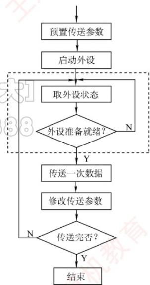  
图7.2 程序查询方式的工作流程

程序查询方式的优点是设计简单、硬件开销小。缺点是 CPU 需耗费大量时间进行查询与等待，且在同一时间段内只能与一台外设通信，导致 CPU 与外设串行工作，效率很低。

对应题4

## 程序中断方式:

基本概念：

<div class="mineru-algorithm" style="white-space: pre-wrap; font-family:monospace;">
外设完成 $\rightarrow$ 发中断请求 $\rightarrow$ CPU响应 $\rightarrow$ 进入中断服务程序
</div>

## 7.3.2 程序中断方式

## 1. 程序中断的基本概念

程序中断是指在计算机执行程序的过程中，当出现某些急需处理的外部事件或内部异常时，CPU 暂停当前程序的执行，转去处理该事件或异常；处理完毕后，再返回到原程序的断点处继续执行。中断技术最初被用于实现主机与 I/O 设备之间的异步通信。

考点追踪 中断方式的特点（2022、2023）

随着计算机系统的发展，中断技术被赋予了多种重要功能，主要包括：

① 实现 CPU 与 I/O 设备的并行工作。

② 处理硬件故障和软件异常。

③ 支持人机交互（如键盘输入、鼠标点击）。

④ 支撑多道程序与分时操作系统的任务切换。

⑤ 满足实时系统对快速响应的需求。

⑥ 实现用户程序向操作系统的切换（如通过软中断或系统调用指令）。

⑦ 在多处理器系统中协调各处理器间的通信与任务迁移。

中断的基本工作思想：当前进程发起 I/O 操作时，会启动相应外设，并主动进入阻塞状态；CPU 随即转而执行就绪队列中的另一进程，实现外设与 CPU 的并行工作。外设完成数据准备后，主动向 CPU 发出中断请求。CPU 响应后，暂停当前指令流，保存现场，并转入中断服务程序，完成主机与外设之间的数据传送。数据传送结束后，CPU 恢复被中断进程的现场，并返回断点处继续执行。此后，外设与 CPU 再次并行工作，如图 7.3 所示。

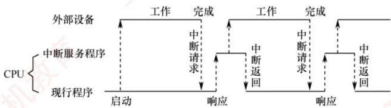  
图 7.3 程序中断方式示意图

## 1. 没有并行的那一段：CPU 在处理“上一轮已经完成的 I/O”

外设上一轮工作完成后，向 CPU 发出中断请求：

刚进入中断服务程序时，外设已经处于“完成/等待”状态。它上一轮工作已经做完了，但下一轮还没开始，因为它还需要CPU来处理结果或给它新命令。

这一段CPU主要做：

□

读取外设状态

完成上一轮数据传送

清除中断请求标志

更新缓冲区地址、计数器、状态位

判断是否还有下一批数据要传

比如输出设备打印一个字符：

打印机：我打印完上一个字符了

CPU：进入中断服务程序，确认打印完成

CPU：更新缓冲区指针，看看还有没有下一个字符

这时打印机还没拿到下一个字符，所以它没法继续工作。因此这一段 CPU 在忙，外设不工作，图上就表现为没有并行。

## 2. 有并行的那一段：CPU 已经再次启动外设，外设开始下一轮工作

当CPU在中断服务程序中发现还有下一批I/O任务时，它会再次启动外设。

比如：

```txt
CPU：把下一个字符送到打印机数据寄存器  
CPU：发出启动命令  
打印机：开始打印下一个字符
```

从这个时刻开始，外设又进入“工作”状态。

但是CPU的中断服务程序可能还没有完全结束，它还要做一些收尾工作：

```txt
更新剩余数据个数  
修改进程状态  
唤醒原来等待I/O的进程  
恢复现场  
执行中断返回
```

所以这时出现：

```txt
外设：正在进行下一轮I/O工作CPU：还在执行中断服务程序的后半段
```

这就是你看到的CPU执行中断服务程序时，有一小段和外设并行。

例题是题5

https://chatgpt.com/g/g-p-6a11c4b6ac5c8191b58411f17c43bc62-ji-zu/c/6a410405-2cc4-83e8-b1f9-0dec6180f93b

## 工作流程：


## 2. 程序中断的工作流程

## 考点追踪 ▶ 中断工作流程中的相关细节（2017、2018、2021、2024）

## (1) 中断请求

中断源是指能够向 CPU 发出中断请求的设备或事件。一台计算机允许多个中断源同时存在，且各中断源发出请求的时间具有随机性。为记录并区分不同的中断请求，中断系统为每个中断源设置一个中断请求标记触发器：当其状态为 “1” 时，表示该中断源有中断请求。这些触发器可组成中断请求标记寄存器，该寄存器可集中置于 CPU 内部，也可分散在各个中断源中。

## 考点追踪 ▶ 可屏蔽中断和不可屏蔽中断的特点（2020）

通过 INTR 信号线发出的是可屏蔽中断，通过 NMI 信号线发出的是不可屏蔽中断。可屏蔽中断的优先级较低，在关中断状态下不被响应；不可屏蔽中断用于处理紧急且关键的硬件事件（如电源掉电、总线错误等），其优先级最高，且不受中断允许标志的影响。

## (2) 中断响应判优

中断响应优先级是指 CPU 响应多个同时发生的中断请求的先后顺序。由于中断请求具有随机性，当多个中断源同时提出请求时，需通过中断判优逻辑确定优先响应哪个中断源的请求。中断响应的判优通常由硬件排队器（或中断查询程序）实现。

一般来说，① 不可屏蔽中断 > 可屏蔽中断；② 在 I/O 传送类中断请求中，高速设备 > 低速设备；输入设备 > 输出设备；实时设备 > 普通设备。

## 注意

中断优先级包括响应优先级和处理优先级。响应优先级由硬件线路或查询顺序固定决定，不可动态更改；处理优先级可通过中断屏蔽技术动态调整，以支持多重中断（中断嵌套）。二者的关系可概括为：只有未被屏蔽的中断请求，才会被送入中断判优电路参与响应优先级的判定。

## (3) CPU 响应中断的条件

## 考点追踪 CPU响应中断的条件（2023）

CPU 仅在满足特定条件时才会响应中断请求，并经过一些特定的操作，转去执行中断服务程序。CPU 响应中断必须满足以下三个条件：

① 存在有效的中断请求。

② CPU处于开中断状态（中断允许标志为1；异常和不可屏蔽中断不受此限制）。

③ 当前指令已执行完毕（异常不受此限制），且无更高优先级任务待处理。

## 注意

I/O 设备的就绪时间是随机的，而 CPU 仅在每条指令执行结束时统一采样中断请求信号（前提是开中断）。因此，CPU 响应 I/O 中断的时机总是发生在某条指令执行完成之后。此处所述中断特指 I/O 中断，不包括异常。

## (4) 中断响应过程

CPU 响应中断后，由硬件自动完成一系列操作（称为中断隐指令），随后转入中断服务程序。中断隐指令并非指令系统中的真实指令，而是对硬件自动操作的统称，主要包括以下步骤：

1）关中断。CPU 响应中断后，首先关闭中断允许标志，禁止响应任何可屏蔽中断（包括更高优先级者），以防止在保存断点和现场时被新中断打断；否则，现场信息可能不完整，

导致中断返回后无法正确恢复原程序的执行。

2）保存断点。为保证中断返回后能正确恢复原程序执行，需将程序计数器（PC）和程序状态字（PSW）等关键现场信息保存至栈或专用寄存器中 $^{①}$ 。

中断与异常的差异：中断发生于指令执行完成后，断点为下一条指令地址；故障类异常（如缺页、除零）因指令未完成，处理后需重新执行当前指令，断点为当前指令地址；陷阱类异常（如系统调用）在指令成功执行后触发，断点为下一条指令地址。

3）引出中断服务程序。通过识别中断源，将对应中断服务程序的入口地址送入程序计数器PC。识别方法主要有硬件向量法和软件查询法，本节主要讨论更常用的硬件向量中断法。（5）中断向量

## (5) 中断向量

中断识别分为向量中断和非向量中断两类。非向量中断采用软件查询法，已在第5章介绍。

## 考点追踪 ▶ 中断向量表的数据结构（2023）

在向量中断中，每个中断源被分配一个唯一的中断类型号，该类型号对应一个中断服务程序的入口地址，此地址称为中断向量。系统将所有中断向量集中存放在内存的特定区域，该区域称为中断向量表。

CPU响应中断后，首先在中断响应阶段从数据总线获取该中断源的中断类型号，然后据此计算出对应中断向量在中断向量表中的地址；接着从中断向量表中读取该中断向量，并送入程序计数器PC，从而转入对应的中断服务程序。这种基于中断向量表实现转移的方法称为中断向量法，采用该方法的中断即为向量中断。

## 注意

中断请求和响应信号通过I/O总线的控制线传输，而中断类型号则在中断响应阶段由中断控制器经数据总线提供给CPU，用于定位中断向量表中的相应表项。

## (6) 中断处理过程

不同计算机的中断处理过程各具特色，图 7.4 所示为一个支持中断嵌套的典型处理流程。

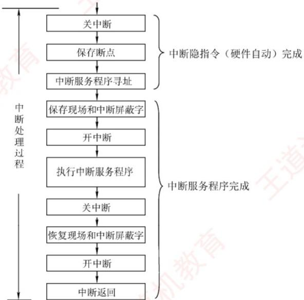  
图7.4 一个支持中断嵌套的典型处理流程


中断处理流程如下：

① 关中断。防止在保存关键信息过程中被新中断打断。

② 保存断点。由硬件自动将断点信息保存至栈或专用寄存器。

③ 中断服务程序寻址。通过中断类型号获取服务程序入口地址，并送入PC。

④ 保存现场和中断屏蔽字。通过软件指令将现场信息和中断屏蔽字压入栈中，以便后续恢复。现场信息是指 CPU 中可能被中断服务程序修改且需恢复的寄存器内容。

## 注意

断点与现场信息均不可被中断服务程序破坏。由于现场信息用指令可直接访问，因此由软件在进入中断服务程序时显式保存。而断点信息由硬件在中断响应阶段自动保存。

⑤ 开中断。由开中断指令实现，允许更高优先级的中断请求被响应，从而实现中断嵌套。

⑥ 执行中断服务程序。

⑦ 关中断。由关中断指令实现，确保在恢复现场和中断屏蔽字的过程中不被中断。

⑧ 恢复现场和中断屏蔽字。从栈中恢复寄存器内容及中断屏蔽状态。

⑨ 开中断、中断返回。中断服务程序的最后一条指令通常为中断返回指令，用于恢复断点现场并返回原程序继续执行。

## 考点追踪 ▶ 中断隐指令的功能（2012）

其中，①～③由中断隐指令（硬件自动）完成；④～⑨由中断服务程序（软件）完成。

考点追踪 ▶ 单重中断的处理流程（2010）

## 注意

对于单重中断（不支持嵌套），上述流程中省略⑤（开中断）和⑦（关中断）即可。

## 多重中断和中断屏蔽技术：

## 3. 多重中断和中断屏蔽技术

在 CPU 执行中断服务程序的过程中，若出现新的更高优先级中断请求，而 CPU 不予响应，则称为单重中断，如图 7.5(a) 所示；若 CPU 暂停当前中断服务程序，转去处理新中断，则称为多重中断（也称中断嵌套），如图 7.5(b) 所示。

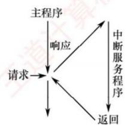  
(a) 单重中断

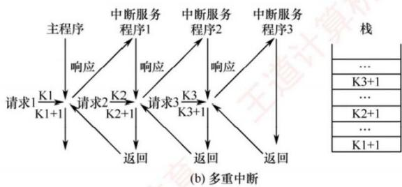  
图 7.5 单重中断和多重中断示意图

在图 7.5(b) 中，CPU 执行主程序时收到中断请求 1。由于主程序未屏蔽任何中断，CPU 响应中断该请求，将主程序断点保存至栈中，并转入中断服务程序 1。在执行中断服务程序 1 期间，

若发生优先级更高的中断请求 2，CPU 会暂停中断服务程序 1，将其断点保存至栈中，并转入中。

断服务程序 2。类似地，更高优先级的中断请求 3 可打断中断服务程序 2。当中断请求 3 处理完毕后，CPU 从栈顶恢复断点，返回至中断服务程序 2 的断点（K3+1）处继续执行。以此类推，直至所有中断处理完毕，最终返回主程序的断点（K1+1）处继续执行。

考点追踪 多重中断的中断屏蔽字相关的性质（2017、2020、2021、2024）

中断处理优先级是指多重中断的实际处理顺序，可通过中断屏蔽技术动态调整。若不使用屏蔽技术，则处理优先级与响应优先级（中断请求被 CPU 识别的先后顺序）一致。现代计算机普遍采用中断屏蔽技术，通过设置中断屏蔽字寄存器实现灵活的优先级控制。

图 7.6 所示为一个简单的可编程中断控制器。来自 I/O 总线的外设中断请求信号（IRi）首先被记录在中断请求寄存器中。中断屏蔽字寄存器的每一位对应一个中断源：置 1 时屏蔽对应的中断请求，置 0 时允许其通过。在送入中断判优电路前，每个中断请求信号会与其对应屏蔽位的取反值进行逻辑“与”操作——仅当屏蔽位为 0 时，该中断请求才被允许参与仲裁。因此，被屏蔽的中断无法进入判优电路，而未被屏蔽的中断则按固定的响应优先级次序处理。

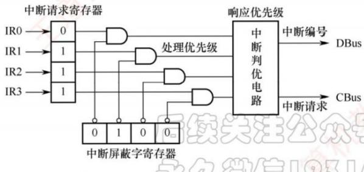  
图7.6 一个简单的可编程中断控制器  
响应优先级决定。

需要注意的是：中断屏蔽字通常在进入中断服务程序时由软件加载，用于控制后续中断的嵌套行为。因此，中断屏蔽仅在CPU执行中断服务程序期间生效；而在主程序运行阶段，中断响应仍由主程序所设置的屏蔽状态决定（通常为全开放）。此外，即使在中断服务程序执行期间，若有多个未屏蔽中断同时到达，其处理顺序仍由中断判优电路的

图 7.6 的详细讲解：https://chatgpt.com/g/g-p-6a11c4b6ac5c8191b58411f17c43bc62-ji-zu/c/6a4118fc-3dfc-83e8-9cfe-11c356333457

例题对应题6

## DMA 方式:

## DMA 数据传送过程示意图

DMA 建立外设与内存之间的直接数据通路，数据传送不经过 CPU，从而显著降低 CPU 负担。

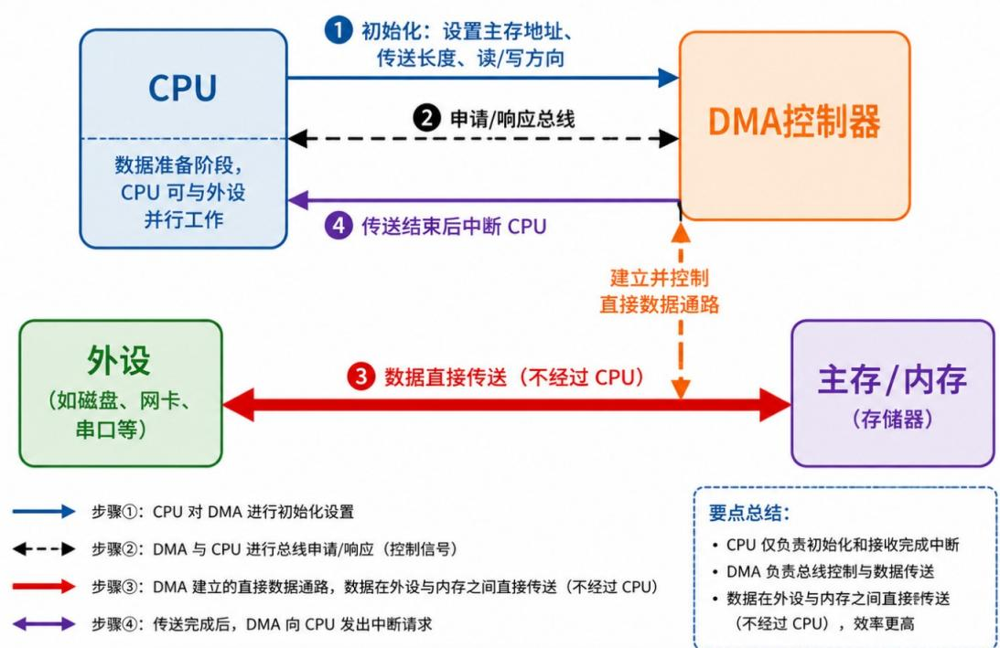

步骤①：CPU 对 DMA 进行初始化设置

←---▶ 步骤②：DMA 与 CPU 进行总线申请/响应（控制信号）

步骤③：DMA 建立的直接数据通路，数据在外设与内存之间直接传送（不经过 CPU）

\- DMA 负责总线控制与数据传送

步骤④：传送完成后，DMA 向 CPU 发出中断请求

## CPU 只管开始和结束，不管中间搬数据。

## 具体过程是：

1. 开始前：CPU告诉DMA控制器：从哪里传、传多少、传入内存还是从内存传出。

2. 传送中：DMA控制器接管总线，控制外设和主存之间直接交换数据。

3. 传送后：DMA控制器用中断通知CPU：“这一批数据传完了”。

所以考场上你就记一句：

程序中断方式：CPU 参与搬数据；DMA 方式：DMA 控制器替 CPU 搬数据，数据在外设和主存之间直接传。

https://chatgpt.com/g/g-p-6a11c4b6ac5c8191b58411f17c43bc62-ji-zu/c/6a423722-1214-83ee-8eeb-ffe3fbe49dc4

## 概念：

## 7.3.3 DMA 方式

DMA 方式是一种完全由硬件控制的数据传输方法，它具有程序中断方式的优点，即在数据准备阶段，CPU 与外设可并行工作。DMA 在外设与内存之间建立了一条直接的数据通路，使得信息传送无须经过 CPU，从而显著降低 CPU 在数据传输过程中的负担。正因如此，该方式被称为直接存储器存取，并避免了保存与恢复 CPU 现场等复杂操作。

## 考点追踪 DMA 方式的使用场景（2025）

DMA 特别适用于磁盘、显卡、声卡、网卡等高速设备的大批量数据传输，但其硬件实现开销较高。在 DMA 方式中，中断的作用仅限于处理故障和正常传输完成的通知。

## 考点追踪 DMA方式中的数据传输通路（2024）

## 1. DMA 方式的特点

DMA 机制在主存与 DMA 控制器之间建立了一条直接的数据通路。由于数据传输不经过 CPU，因此无须中断现行程序，从而实现 I/O 操作与 CPU 计算的并行执行。

## DMA 方式的主要特性包括:

1）打破主存与 CPU 的固定关联，主存既可被 CPU 访问，又可被外设直接访问。

2）在块数据传输过程中，主存地址的生成与传送字数的计数均由硬件电路自动完成。

3）主存中需设置专用缓冲区，以支持高效的数据交换。

4）支持高速数据传输，且 CPU 与外设可并行工作，显著提升系统效率。

5）传输开始前需由软件进行预处理，结束后则通过中断机制完成后处理。

## 2. DMA 控制器的组成

在 DMA 方式中，对数据传送过程进行控制的硬件称为 DMA 控制器（DMA 接口）。当 I/O 设备需要进行数据传送时，通过 DMA 控制器向 CPU 提出 DMA 请求，CPU 响应后即让出系统总线，由 DMA 控制器接管总线并执行数据传送。其主要功能如下：

1）接收外设发出的 DMA 请求，并向 CPU 发出总线请求信号。

2）在 CPU 发出总线响应信号后，DMA 控制器接管总线控制权，进入 DMA 操作周期。

3）确定数据传送的主存起始地址及长度，并自动更新主存地址计数器和传送长度计数器。

4）指定数据在主存与外设间的传送方向，发出读/写等控制信号，完成数据传送。

5）在 DMA 操作结束后，向 CPU 报告传送完成。

图 7.8 给出了一个简单的 DMA 控制器。

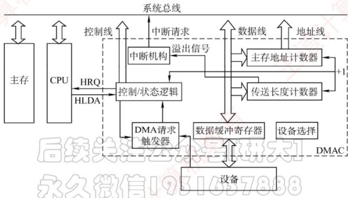  
图7.8 一个简单的DMA控制器

\- 主存地址计数器：存放待传送数据的主存地址。传送前，保存整批数据的起始地址；每传送一个字，其内容自动加1，直至该批数据传送完毕。

\- 传送长度计数器：记录待传送数据的总长度。传送前，存入整批数据的总字数；每传送一个字，计数值减1，当计数器为0时，表示传送结束。

\- 数据缓冲寄存器：暂存每次传送的数据。通常，DMA控制器与主存之间以字为单位传送，而与外设之间可能以字节或字为单位。

\- DMA 请求触发器：当 I/O 设备准备好数据时，发出 DMA 请求信号，使其置位。

\- 控制/状态逻辑：用于设定传送方向、更新传送参数，并协调 DMA 请求与 CPU 响应信号。

\- 中断机构：当一批数据传送完毕后，触发中断并向CPU发出中断请求。

在 DMA 传送过程中，DMA 控制器接管系统总线；传送结束后，将总线控制权交还给 CPU，由 CPU 继续执行后续操作。因此，DMA 控制器必须具备控制系统总线的能力。

## DMA 传送方式:

## 停止 CPU 访问:

## 3. DMA 的传送方式

主存与 I/O 设备之间交换信息时不经过 CPU。然而，当 I/O 设备和 CPU 同时访问主存时，可能发生冲突。为高效利用主存，DMA 与 CPU 通常采用以下三种方式共享主存。

## (1) 停止 CPU 访存

当 I/O 设备发出 DMA 请求时，DMA 控制器向 CPU 发送停止信号，使 CPU 放弃总线控制权并暂停访存，直至 DMA 完成整块数据的传送（见图 7.9）。数据传送结束后，DMA 控制器通知 CPU 恢复主存访问，并交还总线控制权。

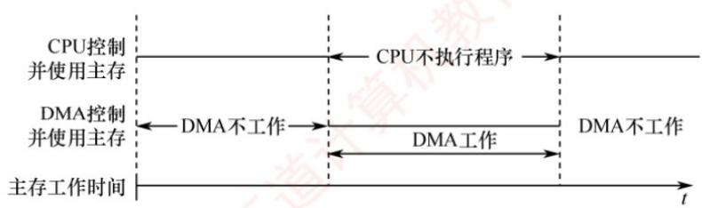  
图 7.9 停止 CPU 访存

优点：控制逻辑简单，适用于数据传输速率很高的I/O设备进行成组数据传送。

缺点：DMA 访存期间，CPU 基本处于空闲状态，资源利用率较低。

## 周期挪用：

## (2) 周期挪用

## 考点追踪 周期挪用的特点及挪用次数分析（2012、2020、2022）

对于高速I/O设备，若不及时访存可能导致数据丢失，因此其访存请求具有较高优先级。周期挪用允许I/O设备挪用一个主存存储周期，传送完一个数据字后立即释放总线（见图7.10），属于单字传送方式。当I/O设备发起DMA请求时，可能出现以下三种情况：①CPU当前不在访存，I/O请求无冲突，可直接使用总线；②CPU正在访存，则需等待当前存储周期结束，再释放总线控制权；③I/O与CPU同时请求访存，发生冲突，此时CPU暂时放弃总线控制权。

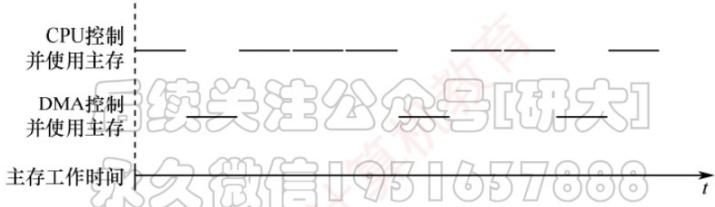  
图7.10 周期挪用  
优点：既满足了 I/O 数据传送需求，又较好地发挥了 CPU 与主存的效率。  
缺点：每次挪用均需申请并释放总线控制权，带来一定开销。

## DMA 与 CPU 交替访存:

## (3) DMA 与 CPU 交替访存

将CPU工作周期划分为两个子周期：一个供CPU访存，另一个供DMA访存。这样，在每个CPU周期内，两者可以轮流访问主存（见图7.11）。该方式适用于CPU工作周期长于主存存储周期的场景。例如，若CPU工作周期为 $1.2\mu \mathrm{s}$ ，主存存储周期小于 $0.6\mu \mathrm{s}$ ，则可将其分为 $\mathrm{C_1}$ 和 $\mathrm{C}_2$ 两个子周期，其中 $\mathrm{C_1}$ 专供DMA访存， $\mathrm{C_2}$ 专供CPU访存。总线控制权通过 $\mathrm{C_1}$ 和 $\mathrm{C_2}$ 分时固定分配，无须动态申请或释放。

优点：无须总线控制权的申请与释放过程，数据传送速率高。

缺点：硬件控制逻辑较为复杂。

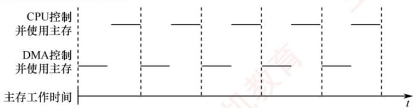  
图 7.11 DMA 与 CPU 交替访存

## DMA 传送过程:

## 4. DMA 的传送过程

考点追踪 DMA方式的传送过程（2019）

图7.12所示为DMA的数据传送流程，分为预处理、数据传送和后处理三个阶段。

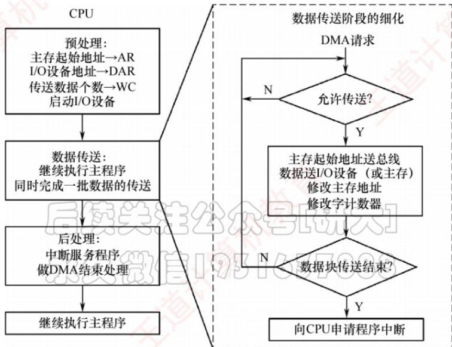  
图7.12 DMA的数据传送流程

## (1) 预处理

由 CPU 完成必要的初始化工作，包括设置 DMA 控制器中的主存起始地址、传送方向、传送数据个数，并启动 I/O 设备。随后，CPU 继续执行原程序。当 I/O 设备准备好待发送（输入）或接收（输出）的数据时，会向 DMA 控制器发出 DMA 请求；DMA 控制器随即向 CPU 发出总线请求，申请总线控制权。

## (2) 数据传送

DMA 以数据块为单位进行传送。一旦获得总线控制权，DMA 控制器便通过硬件循环自动完成数据的输入或输出操作，整个过程无须 CPU 干预。

## (3) 后处理

## 考点追踪 DMA 传送结束时的处理（2025）

数据块传送完成后，DMA 控制器向 CPU 发出中断请求。CPU 响应后执行中断服务程序，进行后处理工作，如校验数据完整性，若出错则转入诊断程序等。

在 DMA 方式下, 整个数据块的传送过程均由硬件完成, CPU 仅在预处理阶段进行初始化, 在后处理阶段响应中断, 因此用于 I/O 的开销极小。

## DMA 方式和中断方式的区别：

## 5. DMA方式和中断方式的区别

考点追踪 ▶ DMA 与中断方式的对比（2013、2023）

DMA 方式和中断方式的主要区别如下:

① 中断方式涉及程序切换，需保存和恢复 CPU 现场；而 DMA 方式不中断现行程序，无须保存现场，除预处理和后处理外，完全不占用 CPU 资源。

② 中断请求只能在每条指令执行结束后被响应；而 DMA 请求可在当前总线周期结束后立即获得响应，无须等待指令完成。

③ 中断方式的数据传送依赖 CPU 执行指令完成；DMA 方式则由专用硬件直接在主存与外设间传送数据，传输速率高，适用于高速外设的成组数据传输。

④ 当 CPU 和 DMA 控制器同时访问主存时，DMA 请求的优先级通常更高。

⑤ 中断方式具备处理异常事件的能力，而 DMA 方式仅用于大批量数据的高效传输。

⑥ 从数据传送来看，中断方式由软件控制传送，DMA方式由硬件直接完成。

## 总结对比:

<table><tr><td>对比点</td><td>程序查询方式</td><td>程序中断方式</td><td>DMA 方式</td></tr><tr><td>外设准备数据时</td><td>CPU 可能一直查,效率低</td><td>CPU 可去执行主程序</td><td>CPU 可去执行主程序</td></tr><tr><td>数据真正传送时</td><td>CPU 亲自传</td><td>CPU 执行中断服务程序亲自传</td><td>DMA 控制器传</td></tr><tr><td>是否打断主程序</td><td>会占用 CPU</td><td>会中断主程序</td><td>数据传送阶段一般不打断主程序,只是抢总线</td></tr><tr><td>传送单位</td><td>字/字节</td><td>字/字节</td><td>数据块</td></tr><tr><td>适合设备</td><td>低速、简单设备</td><td>低速字符设备</td><td>高速块设备,如磁盘</td></tr></table>

## 设备：

二、考研计组常见设备总表

<table><tr><td>设备</td><td>你应该怎么理解</td><td>类型</td><td>常见I/O方式</td><td>计组考点</td></tr><tr><td>键盘</td><td>人按键,产生一个字符/扫描码</td><td>低速输入、字符设备</td><td>中断、查询</td><td>外部中断、I/O端口、状态寄存器</td></tr><tr><td>鼠标</td><td>移动/点击产生少量事件数据</td><td>低速输入、字符/事件设备</td><td>查询、中断</td><td>查询占CPU时间、中断响应</td></tr><tr><td>针式打印机</td><td>用针撞击色带形成点阵字符</td><td>低速输出、字符设备</td><td>中断、查询</td><td>中断I/O、低速设备、不适合DMA</td></tr><tr><td>显示器</td><td>显示图像,本体只是输出终端</td><td>输出设备</td><td>通过显示控制器/显卡控制</td><td>显示控制器、显存/帧缓冲、I/O接口</td></tr><tr><td>显卡/显示控制器</td><td>把内存中的图像数据转成显示信号</td><td>I/O控制器</td><td>可能涉及存储映射I/O</td><td>外设≠控制器,接口/端口</td></tr><tr><td>磁盘HDD</td><td>机械旋转盘片,按块读写</td><td>外存、块设备、高速</td><td>DMA</td><td>寻道时间、旋转延迟、传输时间、DMA</td></tr><tr><td>固态硬盘SSD</td><td>基于Flash,无机械部件,按页读写、按块擦除</td><td>外存、块设备、高速</td><td>DMA</td><td>Flash、页/块、写慢、磨损均衡、DMA</td></tr><tr><td>网卡NIC</td><td>收发网络数据包</td><td>网络设备、高速</td><td>DMA+中断</td><td>网络包到达、中断、DMA、数据缓冲</td></tr><tr><td>U盘</td><td>基于Flash,通过USB接口连接</td><td>外存/块设备</td><td>通常DMA/中断配合</td><td>Flash、I/O总线、USB控制器</td></tr><tr><td>磁带</td><td>顺序访问的大容量备份设备</td><td>外存、顺序设备</td><td>DMA或通道方式思想</td><td>顺序访问,低频</td></tr><tr><td>光盘</td><td>光学外存,随机能力弱于磁盘</td><td>外存</td><td>中断/DMA</td><td>外存分类,低频</td></tr><tr><td>DMA控制器DMAC</td><td>替CPU搬运主存和外设之间的数据</td><td>控制器,不是外设</td><td>DMA核心部件</td><td>AR/DAR/WC、总线请求、周期窃取</td></tr><tr><td>I/O接口/设备控制器</td><td>主机和外设之间的“翻译官”</td><td>控制器</td><td>所有I/O方式都要经过它</td><td>数据寄存器、状态寄存器、控制寄存器、端口编址</td></tr><tr><td>中断控制器</td><td>管理多个中断请求、优先级、屏蔽</td><td>控制器</td><td>中断系统</td><td>中断优先级、中断屏蔽字、多重中断</td></tr></table>

https://chatgpt.com/g/g-p-6a11c4b6ac5c8191b58411f17c43bc62-ji-zu/c/6a44e0e1-bfac-83ee-82ac-c6a75b5c9d1d

## 概念：

中断与异常：

它们最本质的区别是：中断是“外因”导致的（来自CPU外部），而异常是“内因”导致的（来自CPU内部）。

为了让你清晰掌握，我从三个维度来拆解：

## 1. 核心区别：来源与起因

<table><tr><td>对比维度</td><td>I/O 中断(外部中断)</td><td>异常(内部中断/陷阱)</td></tr><tr><td>发生源</td><td>CPU 外部的硬件设备(如键盘、硬盘、网卡)</td><td>CPU 内部,由当前正在执行的指令引发</td></tr><tr><td>发生时机</td><td>异步(随时可能发生,与当前执行到哪条指令无关)</td><td>同步(只在特定指令执行时发生,可复现)</td></tr><tr><td>典型例子</td><td>键盘按下、磁盘数据准备好、网卡收到数据包</td><td>除零错误、非法操作码、缺页、系统调用(int 0x80)</td></tr></table>

## 2. 响应机制上的关键差异

\- I/O 中断（可屏蔽/不可屏蔽）：

\- 它是“外部事件”打断 CPU。

\- 中断处理完后，通常回到原指令的下一条继续执行。

\- 有优先级概念，高优先级中断可以抢占低优先级中断。

## - 异常：

它是“指令执行出错”或“主动请求服务”。

\- 返回地址取决于异常类型：

\- 故障（Fault）：如缺页异常，处理完后重新执行那条出错的指令（因为指令没执行完）。

\- 陷阱（Trap）：如系统调用，处理完后返回下一条指令（相当于主动调用）。

## 外部中断和内部中断:

\- 终止（Abort）：严重硬件错误，处理完后可能不返回，直接终止进程。

## 一、总判断标准

<table><tr><td>类型</td><td>又叫</td><td>产生来源</td><td>和当前指令关系</td><td>检测时机</td></tr><tr><td>外部中断</td><td>外中断、中断 interrupt</td><td>CPU 外部设备/控制器/定时器</td><td>与当前指令无关</td><td>通常当前指令结束后检测</td></tr><tr><td>内部中断</td><td>内中断、异常 exception</td><td>CPU 执行当前指令时内部检测到</td><td>与当前指令有关</td><td>当前指令执行过程中或完成时检测</td></tr></table>

王道第 5.5 节说得很明确：异常也叫内中断，是 CPU 执行指令过程中由内部检测到的同步事件，如除零、非法操作码、页缺失；中断也叫外中断，是外部设备如 I/O 控制器发起的异步事件，如数据就绪或传输完成，

和当前指令无关。 2027计算机组成原理\_高清带书签版(1)

最简单的考场判断：

<div class="mineru-algorithm" style="white-space: pre-wrap; font-family:monospace;">
当前指令自己惹出来的 $\rightarrow$ 内部中断/异常CPU外面的设备来找CPU $\rightarrow$ 外部中断
</div>

## 外部中断事件：

## 二、考研会考到的外部中断事件

## 1. 输入设备数据到达类

<table><tr><td>事件</td><td>判断</td></tr><tr><td>键盘输入</td><td>外部中断</td></tr><tr><td>键盘缓冲满 / 键盘缓冲区有字符</td><td>外部中断</td></tr><tr><td>鼠标输入</td><td>外部中断</td></tr><tr><td>终端输入到达</td><td>外部中断</td></tr></table>

王道题中专门提到：键盘输入属于外部事件，CPU需要执行中断读入输入数据，因此能引起外部中断。

2027计算机组成原理\_高清带书签版(1)

## 考场看到这些词：

## 直接往 外部中断 上靠。

<table><tr><td>键盘、鼠标、终端、输入数据准备好、缓冲区满</td><td></td></tr><tr><td>打印机缺纸</td><td></td></tr></table>

<table><tr><td colspan="2">2. 输出设备状态变化类</td></tr><tr><td>事件</td><td>判断</td></tr><tr><td>打印机缺纸</td><td>外部中断</td></tr><tr><td>打印机完成打印</td><td>外部中断</td></tr><tr><td>显示设备完成一次输出</td><td>外部中断</td></tr><tr><td>输出设备就绪</td><td>外部中断</td></tr><tr><td>输出设备故障</td><td>外部中断</td></tr></table>

比如：

这不是 CPU 当前指令导致的，而是打印机这个外设状态发生变化，所以是外部中断。

<table><tr><td colspan="2">3.存储外设I/O完成类</td></tr><tr><td>事件</td><td>判断</td></tr><tr><td>磁盘读完成</td><td>外部中断</td></tr><tr><td>磁盘写完成</td><td>外部中断</td></tr><tr><td>磁盘数据准备好</td><td>外部中断</td></tr><tr><td>SSD读写完成</td><td>外部中断</td></tr><tr><td>I/O设备完成一次数据传送</td><td>外部中断</td></tr></table>

注意：这里说的是磁盘控制器通知CPU“我完成了”，不是CPU执行load/store指令访问内存。

<table><tr><td>磁盘读写完成 → 外部中断</td></tr><tr><td>访存时缺页 → 内部异常</td></tr></table>

这两个最容易混。

<table><tr><td colspan="2">4. 网络设备类</td></tr><tr><td>事件</td><td>判断</td></tr><tr><td>网络数据包到达</td><td>外部中断</td></tr><tr><td>网卡收到一个帧</td><td>外部中断</td></tr><tr><td>网络发送完成</td><td>外部中断</td></tr><tr><td>网卡缓冲区有数据</td><td>外部中断</td></tr></table>

你问的这个就是重点：

<table><tr><td>网络数据包到达</td><td></td></tr></table>

本质是：

→ 网卡/I/O 控制器向 CPU 发中断请求

$\rightarrow$ CPU执行网卡中断服务程序

所以它属于外部中断，不是内部异常。王道7.3.4第45题也明确把“网络数据包到达”判为外部中断。

2027计算机组成原理\_高清带书签版(1)

## 5. 定时器 / 时钟类

<table><tr><td>事件</td><td>判断</td></tr><tr><td>定时器到时</td><td>外部中断</td></tr><tr><td>时钟中断</td><td>外部中断</td></tr><tr><td>采样定时时间到</td><td>外部中断</td></tr><tr><td>时间片用完</td><td>外部中断,偏操作系统语境</td></tr></table>

第 45 题里也有:

<table><tr><td>定时器到时 → 时钟中断 → 外部中断</td></tr></table>

因为定时器是CPU外部或处理器外部中断控制逻辑产生的中断请求，不是当前指令算出来的。

2027计算机组成原理\_高清带书签版(1)

## 6. DMA 类

<table><tr><td>事件</td><td>判断</td></tr><tr><td>DMA 传送结束</td><td>外部中断</td></tr><tr><td>DMA 传送完成后请求 CPU 后处理</td><td>外部中断</td></tr><tr><td>DMA 出错通知 CPU</td><td>外部中断</td></tr></table>

注意这个区别：

<table><tr><td>DMA 请求总线 / 周期窃取 → 不是中断</td></tr><tr><td>DMA 传送结束后通知 CPU → 外部中断</td></tr></table>

王道第 7 章说，DMA 数据传送由 DMA 控制器直接控制总线完成；传送结束后，DMA 控制器向 CPU 发送中断请求，CPU 执行中断服务程序做 DMA 结束处理。2027 计算机组成原理\_高清带书签版(1)

## 7. 外部不可屏蔽中断 NMI 类

<table><tr><td>事件</td><td>判断</td></tr><tr><td>电源故障</td><td>外部中断,通常是不可屏蔽中断</td></tr><tr><td>紧急硬件故障</td><td>外部中断,通常是不可屏蔽中断</td></tr><tr><td>外部严重故障信号</td><td>外部中断,通常是不可屏蔽中断</td></tr></table>

王道题中提到，通过 INTR 信号线发出的是可屏蔽外中断，通过 NMI 信号线发出的是不可屏蔽外中断；不可屏蔽中断即使关中断也会被响应。2027计算机组成原理\_高清带书签版(1)

考场常见表述：

<table><tr><td>NMI</td></tr><tr><td>不可屏蔽中断</td></tr><tr><td>电源故障</td></tr><tr><td>紧急硬件故障</td></tr></table>

一般判外部中断。

## 内部中断事件：

<table><tr><td colspan="2">内部中断 / 异常清单</td></tr><tr><td>题目关键词</td><td>类型</td></tr><tr><td>访存时缺页</td><td>内部异常,故障</td></tr><tr><td>页缺失</td><td>内部异常,故障</td></tr><tr><td>缺页异常</td><td>内部异常,故障</td></tr><tr><td>存储保护错</td><td>内部异常,故障</td></tr><tr><td>地址越界</td><td>内部异常,故障</td></tr><tr><td>地址未对齐</td><td>内部异常,故障</td></tr><tr><td>整数除以 0</td><td>内部异常</td></tr><tr><td>除数为 0</td><td>内部异常</td></tr><tr><td>非法操作码</td><td>内部异常</td></tr><tr><td>无效操作码</td><td>内部异常</td></tr><tr><td>非法指令</td><td>内部异常</td></tr><tr><td>特权指令在用户态执行</td><td>内部异常</td></tr><tr><td>未定义指令</td><td>内部异常</td></tr><tr><td>系统调用</td><td>内部异常,自陷</td></tr><tr><td>访管指令</td><td>内部异常,自陷</td></tr><tr><td>trap 指令</td><td>↓ 内部异常,自陷</td></tr><tr><td>未定义指令</td><td>内部异常</td></tr><tr><td>系统调用</td><td>内部异常,自陷</td></tr><tr><td>访管指令</td><td>内部异常,自陷</td></tr><tr><td>trap 指令</td><td>内部异常,自陷</td></tr><tr><td>软中断</td><td>通常归入自陷/内部异常</td></tr><tr><td>断点调试</td><td>内部异常,自陷</td></tr><tr><td>单步跟踪</td><td>内部异常,自陷</td></tr><tr><td>算术溢出异常</td><td>内部异常</td></tr><tr><td>浮点溢出异常</td><td>内部异常</td></tr><tr><td>终止类异常 abort</td><td>内部异常</td></tr></table>

https://chatgpt.com/g/g-p-6a11c4b6ac5c8191b58411f17c43bc62-ji-zu/c/6a44dd80-3574-83e8-af7c-22e34b85d8f3

中断屏蔽字寄存器与中断源对应的中断屏蔽字：

① 中断屏蔽字寄存器：硬件里的“当前开关表”

假设系统有4个中断源：

$$
\begin{array}{c c c c} \text {I1} & \text {I2} & \text {I3} & \text {I4} \end{array}
$$

那么屏蔽字寄存器就可以有4位：

$$
\begin{array}{c c c c} \text {M1} & \text {M2} & \text {M3} & \text {M4} \end{array}
$$

每一位控制一个中断源：

M1 控制 I1

M2 控制 I2

M3 控制 I3

M4 控制 I4

在王道这个约定下:

$$
\mathrm{Mi} = 1: \text {屏蔽} \mathrm{Ii}, \text {不让} \mathrm{Ii} \text {参与判优}
$$

$$
\mathrm{Mi} = 0: \text {允许} \mathrm{Ii}, \mathrm{Ii} \text {可以参与判优}
$$

所以硬件判断逻辑可以写成：

$$
\text {实际送去判优的请求} = \text {中断请求 IRi} \cdot \text {非Mi}
$$

比如：

$$
\mathrm{IR2} = 1, \text {表示} \mathrm{I2} \text {发出了中断请求}
$$

M2 = 1，表示 I2 被屏蔽

$$
\mathrm{实际输出} = 1 \cdot \theta = \theta
$$

□

所以 I2 虽然发出了请求，但被屏蔽字寄存器挡住了，不会被 CPU 响应。

□

② 中断源对应的中断屏蔽字：软件预先规定的“处理这个中断时该挡谁”这句话最容易误解。

“中断源I2对应的中断屏蔽字”不是说I2只有一位。

而是说：

当CPU正在执行I2的中断服务程序时，应该把哪一串屏蔽字装入屏蔽字寄存器。

比如有4个中断源，某系统规定：

正在处理I2时，只允许I1打断它，不允许I2、I3、I4打断它

那么12对应的中断屏蔽字就是：

I1 I2 I3 I4
0 1 1 1

含义：

I1 位为 0：允许 I1 中断  
I2 位为 1：屏蔽 I2 自己  
I3 位为 1：屏蔽 I3  
I4 位为 1：屏蔽 I4

然后CPU进入I2的中断服务程序后，就把这串：

0111

□

装入中断屏蔽字寄存器。

此时屏蔽字寄存器当前内容就是：

0111

□

这就是二者的关系。

详细讲解：https://chatgpt.com/g/g-p-6a11c4b6ac5c8191b58411f17c43bc62-ji-zu/c/6a411ca7-78a4-83ee-b840-1e76a7cb1dbd

## I/O 设备与外设：

## 1. I/O 设备是不是外设？

基本可以认为：I/O 设备 = 外部设备 = 外设。

王道前面讲计算机硬件时明确说：外部设备简称外设，也称 I/O 设备，I/O 是 Input/Output 的缩写。例如键盘、鼠标、显示器、打印机、磁盘、网卡等，都可以叫 I/O 设备。2027 计算机组成原理\_高清带书签版(1)

但考试里要注意区分：

<table><tr><td>名词</td><td>是什么</td><td>举例</td></tr><tr><td>I/O 设备 / 外设</td><td>真正完成输入或输出的设备</td><td>键盘、磁盘、打印机、显示器</td></tr><tr><td>I/O 接口 / I/O 控制器</td><td>连接 CPU/主存 和 外设的中间控制部件</td><td>磁盘控制器、网卡、显卡、键盘接口</td></tr><tr><td>I/O 端口</td><td>CPU 访问 I/O 接口内部寄存器的地址</td><td>状态端口、数据端口、控制端口</td></tr></table>

所以考场上不能把 I/O 设备 和 I/O 接口 混为一谈。外设不能直接和 CPU 内部寄存器随便交换数据，通常要通过 I/O 接口/设备控制器。

## DMA 方式为什么不需要恢复现场：

## 2. DMA 为什么不需要保存和恢复现场？

核心原因不是“DMA 请求在 CPU 一个完整周期结束后才进行”，而是：DMA 传送数据时不让 CPU 去执行另一段程序。

也就是说：

中断方式：CPU 被打断 → 转去执行中断服务程序 → 会改变 CPU 正在执行的程序流，所以要保存现场。

DMA方式：CPU不去执行数据传送程序 $\rightarrow$ DMA控制器自己控制主存和外设之间的数据传送 $\rightarrow$ CPU的PC、通用寄存器等现场没有被DMA传送过程破坏，所以不需要保存/恢复现场。

王道也明确对比过：中断方式涉及程序切换，需要保存和恢复 CPU 现场；DMA 方式不中断现行程序，除预处理和后处理外，不占用 CPU 资源。并且 DMA 请求可在当前总线周期结束后响应，而中断请求一般在每条指令执行结束后响应。☐ 2027计算机组成原理\_高清带书签版(1)

<table><tr><td>比较点</td><td>中断方式</td><td>DMA 方式</td></tr><tr><td>响应时机</td><td>通常在一条指令执行结束后响应</td><td>可在当前总线周期/存储周期结束后响应</td></tr><tr><td>是否改变 CPU 程序流</td><td>改变,CPU 转去执行中断服务程序</td><td>不改变,CPU 不执行数据传送程序</td></tr><tr><td>是否保存现场</td><td>要保存现场</td><td>数据传送过程中不需要</td></tr><tr><td>数据传送者</td><td>CPU 执行 I/O 指令完成</td><td>DMA 控制器硬件完成</td></tr><tr><td>数据路径</td><td>外设接口 ↔ CPU 寄存器 ↔ 主存</td><td>外设 ↔ DMA 控制器 ↔ 主存</td></tr></table>

王道题解里也提到，DMA 传送数据时，“周期挪用”不会改变 CPU 现场，因此不占用 CPU 的 PC 和寄存器；数据传送不经过 CPU，而是经过 DMA 控制器中的数据缓冲寄存器。2027计算机组成原理\_高清带书签版(1)

## 但要注意一个细节：DMA 结束时可能仍然会中断 CPU

DMA 数据块传完后，DMA 控制器通常会向 CPU 发一个中断请求，告诉 CPU：“这一批数据传完了。”这个时候 CPU 进入中断处理，当然也有中断响应、保存断点/现场等过程。

所以更严谨地说：

DMA方式在“数据传送过程中”不需要保存和恢复CPU现场；但DMA传送结束后通知CPU时，可能通过中断完成后处理，此时仍按中断机制处理。

考场记忆版：

中断：CPU 亲自搬数据，搬一次打断一次，要保存现场。

DMA：DMA 控制器搬数据，CPU 不改程序流，不保存现场；结束再中断通知 CPU。

## 中断:

程序中断过程是由硬件和中断服务程序共同完成的。

中断服务程序一般是操作系统模块。

## 软中断：

软中断就是：由程序执行某条特殊指令主动触发的中断/异常，用来让 CPU 从用户程序转去执行操作系统内核的服务程序。

最典型用途：系统调用。

比如用户程序想读文件、写文件、申请内存、创建进程，这些操作不能直接由普通用户程序完成，就通过一条特殊指令触发软中断，进入操作系统内核处理。

王道在程序中断方式功能里提到，中断可以“实现用户程序向操作系统的切换，如通过软中断或系统调用指令”。2027计算机组成原理\_高清带书签版(1)408大纲也把“异常和中断机制”“系统调用”列为相关考点。408大纲

## 一句话记忆

硬中断：外设打断CPU。

软中断：程序自己用指令“叫”操作系统。

和普通硬件中断的区别

<table><tr><td>对比项</td><td>软中断</td><td>硬中断</td></tr><tr><td>触发来源</td><td>程序执行特殊指令</td><td>外设/硬件发中断请求</td></tr><tr><td>是否主动</td><td>程序主动触发</td><td>外部事件被动触发</td></tr><tr><td>发生时机</td><td>指令执行到这里就发生,位置确定</td><td>外设什么时候来不确定</td></tr><tr><td>典型用途</td><td>系统调用、用户态切内核态</td><td>键盘输入、磁盘完成、定时器中断</td></tr><tr><td>本质</td><td>更接近“异常/陷入 trap”</td><td>真正的外部中断</td></tr></table>

https://chatgpt.com/g/g-p-6a11c4b6ac5c8191b58411f17c43bc62-ji-zu/c/6a425401-7c00-83e8-aba1-31529e0afd36


## 屏蔽字：

## 2. 屏蔽字，以及“屏蔽字中的1”

你写的“屏蔽字1”，我按你想问的重点来讲：中断屏蔽字里的1到底表示什么。

直接结论

在王道这套资料的约定中：

屏蔽字中某一位为1，表示屏蔽对应中断源；为0，表示允许对应中断源中断当前服务程序。

王道习题解析中直接给出：“屏蔽字1表示不可被中断，0表示可被中断”。 2027计算机组成原理\_高清带书签版(1)

例如有4个中断源A、B、C、D，某服务程序的屏蔽字是：

A B C D
0 1 1 0

意思是：

A: 不屏蔽，允许 A 打断我

B: 屏蔽，不允许 B 打断我

C: 屏蔽，不允许 C 打断我

D: 不屏蔽，允许 D 打断我

## 屏蔽字的本质

中断屏蔽字是控制“正在执行某个中断服务程序时，谁还能不能打断我”的。

它主要服务于 多重中断 / 中断嵌套。

假设CPU正在执行C的中断服务程序，此时来了A、B、D三个中断请求。能不能响应，不只看谁优先级高，还要看C的中断屏蔽字是否允许它们打断C。

重点区分：响应优先级 vs 处理优先级

这是最容易考的点。

<table><tr><td>概念</td><td>决定什么</td><td>谁决定</td></tr><tr><td>响应优先级</td><td>多个中断同时请求时,CPU先响应谁</td><td>硬件判优电路/中断查询程序</td></tr><tr><td>处理优先级</td><td>某个中断服务程序执行过程中,谁能打断它</td><td>中断屏蔽字</td></tr></table>

王道资料明确说，中断屏蔽标志改变的是处理优先级；响应优先级由中断查询程序或中断判优电路决定。2027计算机组成原理\_高清带书签版(1)

所以这句话要背下来：

屏蔽字不能改变硬件响应优先级，只能改变中断处理优先级。

## 中断隐指令：

## 3. 中断隐指令

## 直接理解

中断隐指令不是一条真正写在程序里的指令。

它是：

CPU响应中断时，由硬件自动完成的一组操作的统称。

王道资料明确说，中断隐指令并非指令系统中的真实指令，而是对硬件自动操作的统称。

2027计算机组成原理\_高清带书签版(1)

## 它为什么叫“隐指令”？

因为它像一条指令一样完成若干操作，但：

程序员看不见

指令系统里没有

不能写进程序

没有普通指令的操作码

由硬件自动执行

## 中断隐指令主要完成什么？

重点记这三个：

① 关中断

② 保存断点

□

③ 引出中断服务程序

更完整地说：

<table><tr><td>步骤</td><td>谁完成</td><td>作用</td></tr><tr><td>关中断</td><td>硬件</td><td>防止保存断点时又被新中断打断</td></tr><tr><td>保存断点</td><td>硬件</td><td>保存 PC、PSW 等关键信息,便于返回原程序</td></tr><tr><td>找服务程序入口</td><td>硬件</td><td>通过中断类型号/中断向量表,把中断服务程序入口送入 PC</td></tr></table>

王道资料把中断处理流程分成硬件和软件两部分：①关中断、②保存断点、③中断服务程序寻址由中断隐指令即硬件自动完成；保存现场、设置屏蔽字、执行服务程序、恢复现场等由软件完成。

## 断点和现场不要混

这是408常考陷阱。

<table><tr><td>名称</td><td>内容</td><td>谁保存</td></tr><tr><td>断点</td><td>PC、PSW等关键返回信息</td><td>中断响应阶段,硬件保存</td></tr><tr><td>现场</td><td>通用寄存器等可能被服务程序改动的信息</td><td>中断服务程序中,软件保存</td></tr></table>

所以：

保存断点是硬件做；保存通用寄存器现场是软件做。

## 中断响应周期：

## 4. 中断响应周期

直接理解

中断响应周期 $=$ CPU决定响应中断后，到正式开始执行中断服务程序之前的硬件处理阶段。

它不是中断服务程序本身。

你可以把完整过程分成三段：

```txt
原程序执行
↓
中断响应周期：硬件自动处理，也就是中断隐指令
↓
中断服务程序：软件执行
↓
中断返回，继续原程序
```


## CPU 什么时候响应中断？

对于外部中断，CPU通常在一条指令执行结束后才检查和响应。王道资料说，外部中断仅在第i条指令完整执行结束后才被检测，响应后保存现场并转入服务程序；中断返回后从第 $i + 1$ 条指令开始继续执行。


```txt
2027计算机组成原理_高清带书签版(1)
```

## CPU响应中断一般要满足三个条件：

<div class="mineru-algorithm" style="white-space: pre-wrap; font-family:monospace;">
$①$ 有中断请求  
$②$ CPU处于开中断状态  
$③$ 当前指令执行完毕
</div>


还要注意一个隐含条件：

```txt
④ 该中断源没有被屏蔽
```


王道习题解析也强调，若关中断，CPU 不会进入中断 ↓ 周期；若请求源被中断屏蔽字屏蔽，也不会进入中断响应周期。 2027计算机组成原理\_高清带书签版(1)

## 中断响应周期里做什么？

核心就是执行中断隐指令：

```txt
关中断  
保存断点PC/PSW  
判别中断源  
形成中断向量地址或服务程序入口地址  
把服务程序入口送入PC
```

## 之后CPU才真正开始执行中断服务程序。

## 一个关键区别

```txt
中断响应周期：硬件阶段，自动完成，主要保存断点  
中断服务程序：软件阶段，执行指令，保存现场、I/O传送、恢复现场
```


## 这就是为什么2024类题会考：

```txt
保存断点和PSW在中断响应阶段完成  
保存通用寄存器和设置新中断屏蔽字由软件实现
```


## 中断 I/O:

## 5. 中断 I/O，也叫程序中断方式

## 直接理解

中断 I/O = 外设准备好数据后主动通知 CPU，CPU 再暂停当前程序去执行 I/O 服务程序。

它解决的是程序查询方式的低效问题。

程序查询方式是：

```txt
CPU 一直问外设：你好了吗？你好了吗？你好了吗？
```


## 中断方式是：

```txt
CPU：你准备好了再叫我。  
外设：好。  
CPU先去执行别的程序。  
外设准备好后发中断请求。  
CPU再来处理I/O。
```


王道资料中说，程序中断是当出现急需处理的外部事件或内部异常时，CPU 暂停当前程序，转去处理该事件或异常；处理完毕后返回断点继续执行。并且中断技术最初就是用于实现主机与 I/O 设备之间的异步通信。


```txt
2027计算机组成原理_高清带书签版(1)
```

## 中断I/O的过程

可以按这条线记：

① CPU 启动外设

② 外设独立工作，CPU 继续执行主程序


③ 外设数据准备好，向CPU发中断请求

④ CPU 在当前指令结束后检查中断

⑤ 若允许中断且未被屏蔽，进入中断响应周期

⑥ 硬件执行中断隐指令：关中断、保存断点、转入服务程序

⑦ 中断服务程序保存现场、设置屏蔽字、执行 I/O 指令

⑧ 数据在 CPU 和 I/O 接口之间传送

⑨ 恢复现场，中断返回

⑯ CPU 回到原程序断点继续执行

## 中断I/O中谁负责传数据？

这是你前面DMA那块容易混的点。

在中断I/O中：

数据传送仍然由CPU执行I/O指令完成。

王道资料明确说，中断 I/O 方式下，CPU 执行中断服务程序时会执行相应的 I/O 指令，实现 CPU 通用寄存器和外设接口寄存器之间的数据交换。2027 计算机组成原理\_高清带书签版(1)

而在DMA中：

数据在外设和主存之间直接传送，主要由DMA控制器控制，CPU不逐字参与。

<table><tr><td colspan="2">中断 I/O 的并行与串行</td></tr><tr><td colspan="2">中断方式不是全程并行。</td></tr><tr><td>阶段</td><td>CPU 和外设关系</td></tr><tr><td>外设准备数据</td><td>CPU 可以执行主程序,和外设并行</td></tr><tr><td>真正传送数据</td><td>CPU 执行中断服务程序,主程序暂停,和主程序串行</td></tr><tr><td colspan="2">王道资料也总结:程序查询方式中 CPU 与外设串行;中断方式中 CPU 与外设在准备阶段并行,但数据传送与主程序仍是串行;DMA 方式中 CPU 与外设、传送与主程序都可以并行。2027计算机组成原理_高清带书签版(1)</td></tr></table>

## 周期窃取：

## 什么是周期窃取？

周期窃取就是DMA“偷”CPU的一个主存访问周期。

过程：

```txt
CPU 正在执行程序
↓
DMA 控制器需要访问主存
↓
DMA 向 CPU 申请总线
↓
CPU 暂停一个存储周期，不访问主存
↓
DMA 用这个周期传送一个字
↓
DMA 归还总线
↓
CPU 继续执行
```

注意它不是中断：

```txt
不会保存现场  
不会改变PC  
不会跳到中断服务程序  
只是让CPU暂时不能访存
```

## 中断服务程序：

中断服务程序就是 CPU 响应某个中断后，转去执行的一段专门处理该中断事件的程序。

比如键盘输入、磁盘传输完成、打印机准备好、DMA 传送结束等，都可能产生中断。CPU 响应后，不是设备自己“处理程序”，而是 CPU 暂停原程序，去执行对应的中断服务程序。

## 2. 先把它放进整个中断过程里看

你可以把中断过程理解成：

```txt
主程序正在运行
↓
外设/异常提出中断请求
↓
CPU 判断是否响应
↓
硬件自动做一些准备工作
↓
转入中断服务程序
↓
中断服务程序处理具体事件
↓
中断返回，继续执行原程序
```

关键是：中断服务程序不是从头到尾的“中断响应过程”，它只是中断处理过程中的软件部分。

王道资料里把典型流程分为：关中断、保存断点、中断服务程序寻址、保存现场和中断屏蔽字、开中断、执行中断服务程序、关中断、恢复现场和屏蔽字、开中断并中断返回。其中前①～③是硬件自动完成的中断隐指令，后④～⑨属于中断服务程序的软件工作。2027计算机组成原理\_高清带书签版(1)

## 3. 中断服务程序到底干什么？

中断服务程序主要做 4 类事：

<table><tr><td>任务</td><td>作用</td></tr><tr><td>保存现场</td><td>防止原程序的寄存器内容被破坏</td></tr><tr><td>处理中断事件</td><td>比如读入一个字符、传输一个数据、记录错误、通知设备等</td></tr><tr><td>恢复现场</td><td>把原程序被打断时的寄存器状态恢复回来</td></tr><tr><td>中断返回</td><td>回到原程序断点处继续执行</td></tr></table>

你要特别区分两个词：

<table><tr><td>名词</td><td>是什么</td><td>谁保存</td></tr><tr><td>断点</td><td>原程序被打断后,应该返回继续执行的位置,通常是PC和PSW等</td><td>硬件自动保存</td></tr><tr><td>现场</td><td>原程序运行时CPU寄存器中的内容,如通用寄存器、状态寄存器等</td><td>中断服务程序用软件保存</td></tr></table>

这个点非常爱考。王道资料也强调：断点信息由硬件在中断响应阶段自动保存，而现场信息可由指令访问，所以由软件在进入中断服务程序时显式保存。2027计算机组成原理\_高清带书签版(1)

https://chatgpt.com/g/g-p-6a11c4b6ac5c8191b58411f17c43bc62-ji-zu/c/6a44c8d0-9204-83ee-be60-82395e981b11

## 总线事务：

<table><tr><td>角色</td><td>含义</td><td>例子</td></tr><tr><td>主设备</td><td>主动发起总线事务的一方</td><td>CPU、DMA 控制器</td></tr><tr><td>从设备</td><td>被访问、被控制的一方</td><td>主存、I/O 接口、外设控制器</td></tr><tr><td colspan="3">比如:</td></tr><tr><td colspan="2">CPU 读主存</td><td></td></tr><tr><td colspan="3">CPU 是主设备,主存是从设备。</td></tr><tr><td colspan="2">DMA 控制器把外设数据写入主存</td><td></td></tr></table>

DMA 控制器是主设备，主存可能是从设备。

## 直接理解

总线事务 = 通过总线完成一次完整通信任务。

它不是单纯“传一下数据”，而是从一方想使用总线开始，到地址、命令、数据传完，再到总线释放为止的一整套过程。

比如CPU要从主存读一个数据：

<table><tr><td>CPU 想用总线</td></tr><tr><td>→ 获得总线控制权</td></tr><tr><td>→ 发出主存地址</td></tr><tr><td>→ 发出读命令</td></tr><tr><td>→ 主存准备数据</td></tr><tr><td>→ 主存把数据送到数据线</td></tr><tr><td>→ CPU 读入数据</td></tr><tr><td>→ 本次总线通信结束,释放总线</td></tr></table>

## 这一整段，才叫一次总线事务。

## 主设备和从设备

总线事务里一般有两个角色：

## 一个总线事务通常包括哪些阶段

考试中你可以按这个顺序记：

<table><tr><td>申请总线 → 获得总线 → 寻址/发命令 → 数据传送 → 结束/释放总线</td></tr></table>

<table><tr><td colspan="2">更具体一点:</td></tr><tr><td>阶段</td><td>做什么</td></tr><tr><td>总线请求</td><td>主设备请求使用总线</td></tr><tr><td>总线仲裁</td><td>如果多个设备都想用总线,仲裁器决定谁先用</td></tr><tr><td>地址阶段</td><td>主设备把要访问的地址放到地址线上</td></tr><tr><td>命令阶段</td><td>主设备说明是读、写,还是其他操作</td></tr><tr><td>数据阶段</td><td>主设备和从设备之间真正传送数据</td></tr><tr><td>结束阶段</td><td>本次通信完成,释放总线</td></tr></table>

你这个疑问非常关键：DMA要高速，但“高速”不是指它可以在任意一个CPU时钟周期中间硬抢总线，而是指它绕过CPU软件搬运，直接用总线在I/O设备和主存之间成块传送。

## 先给结论

DMA响应发生在一个总线事务完成后，而不是一个时钟周期后，是因为总线事务不能被从中间打断。

一个总线事务可能正在做：

<div class="mineru-algorithm" style="white-space: pre-wrap; font-family:monospace;">
地址传送 $\rightarrow$ 命令传送 $\rightarrow$ 从设备准备 $\rightarrow$ 数据传送
</div>


如果DMA在其中某一个CPU时钟周期强行插进来，就可能出现：

```txt
CPU地址刚发出去，但数据还没回来DMA把总线抢走主存/外设不知道当前事务到底算不算完成
```


这样会破坏总线时序，导致数据错误。

王道对总线事务的定义是：主设备，如 CPU、DMA 控制器，与从设备，如主存、I/O 设备，之间完成一次完整的信息交换过程；总线事务通常包括地址传送、从设备响应/数据准备、数据传送等阶段。


2027计算机组成原理\_高清带书签版(1) DMA方式下，DMA控制器会向CPU发出总线请求，申请总线控制权；获得总线控制权后，DMA控制器通过硬件自动完成数据输入/输出。 2027计算机组成原理\_高清带书签版(1)

关键区别：时钟周期太小，总线事务才是“安全切入点”

你可以把它想成：

```txt
时钟周期：CPU 内部最小节拍  
总线事务：总线上一次完整通信动作  
DMA 响应点：总线当前通信动作结束后
```


一个总线事务往往包含多个时钟周期。比如一次读主存可能是：

<table><tr><td>T1: CPU 发地址</td></tr><tr><td>T2: CPU 发读命令</td></tr><tr><td>T3: 主存准备数据</td></tr><tr><td>T4: 数据返回</td></tr><tr><td>T5: CPU 接收数据</td></tr></table>

如果DMA在T2后面插进来，就变成：

这就相当于一句话说到一半被抢麦，后半句没法对上。

所以DMA不是按“一个CPU时钟周期”响应，而是按“当前总线事务结束”响应。

## DMA已经比中断响应更及时了

你之前容易混的是这个对比：

<table><tr><td>方式</td><td>请求的资源</td><td>响应时机</td></tr><tr><td>中断 I/O</td><td>请求 CPU 去执行中断服务程序</td><td>一条指令执行结束后</td></tr><tr><td>DMA</td><td>请求总线使用权</td><td>一个总线事务完成后</td></tr></table>

王道习题中明确考过这个点：中断 I/O 方式请求的是 CPU 处理时间，DMA 方式请求的是总线使用权；中断响应发生在一条指令执行结束后，DMA 响应发生在一个总线事务完成后。2027计算机组成原理\_高清带书签版(1)

这说明DMA并不是慢，反而更细粒度。

因为一条指令可能很长，例如：

其中可能包含多个总线事务：

取指访问主存  
读取操作数访问主存  
写回结果访问主存

中断要等整条指令结束；DMA只要等当前这一次总线事务结束，就能插进去。

所以：

通常比：

更及时。

https://chatgpt.com/g/g-p-6a11c4b6ac5c8191b58411f17c43bc62-ji-zu/c/6a44d564-8d0c-83e8-bb16-c02e43adcee9

## 设备驱动程序：

对，你这个疑问是对的：真正执行“写入DMA参数”这个动作的硬件确实是CPU。

但题干第Ⅰ句说的是：

DMA 传送前由设备驱动程序设置传送参数

这里的“由设备驱动程序设置”是从软件层/操作系统层说的；

你说的“由 CPU 完成”是从硬件执行层说的。二者不矛盾。

可以这样理解：

设备驱动程序决定并发出设置动作，CPU执行这些程序指令，把参数写入DMA控制器的相关寄存器。

王道解析里也把这题答案判为 D，并说明：DMA 的预处理阶段由 CPU 完成必要准备工作；传送前 DMA 控制器请求总线使用权；传送中由 DMA 控制器直接控制总线完成；传送结束后 CPU 执行中断服务程序做结束处理。 2027计算机组成原理\_高清带书签版(1)

## 这句话到底在说什么？

DMA 传送前，需要告诉 DMA 控制器：

<table><tr><td>要设置的参数</td><td>放到哪里</td><td>谁设置</td></tr><tr><td>主存起始地址</td><td>DMA 控制器的主存地址计数器</td><td>CPU 执行设备驱动程序来写入</td></tr><tr><td>传送长度</td><td>DMA 控制器的字计数器/长度计数器</td><td>CPU 执行设备驱动程序来写入</td></tr><tr><td>传送方向</td><td>DMA 控制器的控制/状态逻辑</td><td>CPU 执行设备驱动程序来写入</td></tr><tr><td>设备命令</td><td>I/O 接口或 DMA 控制器相关寄存器</td><td>CPU 执行设备驱动程序来写入</td></tr></table>

王道对DMA控制器的组成也提到，DMA控制器要能确定主存起始地址和长度，并自动更新主存地址计数器和传送长度计数器；还要指定传送方向并发出读写控制信号完成传送。2027计算机组成原理\_高清带书签版(1)

注意：这些寄存器一开始要被初始化，初始化动作就是CPU执行设备驱动程序完成的。

为什么不直接说“CPU 设置参数”？

因为在操作系统和I/O管理里，通常不会说“用户程序直接操作DMA控制器”。正确流程是：

```txt
用户程序提出 I/O 请求
↓
操作系统调用设备驱动程序
↓
CPU 执行设备驱动程序
↓
驱动程序把 DMA 参数写入 DMA 控制器
↓
DMA 控制器请求总线
↓
DMA 控制器直接完成主存 ⇌ 外设的数据传送
↓
传送结束，DMA 控制器中断 CPU
↓
CPU 执行中断服务程序进行后处理
```

所以第 I 句强调的是：设置 DMA 参数这件事属于设备驱动程序负责，而不是用户程序直接完成，也不是 DMA 控制器自己凭空知道参数。

你要分清两个层次

<table><tr><td>说法</td><td>层次</td><td>对不对</td></tr><tr><td>DMA 传送前由设备驱动程序设置传送参数</td><td>软件/操作系统层</td><td>对</td></tr><tr><td>DMA 传送前由 CPU 执行指令,把参数写入 DMA 控制器</td><td>硬件执行层</td><td>对</td></tr><tr><td>DMA 控制器自己决定起始地址、长度和方向</td><td>错误理解</td><td>不对</td></tr><tr><td>DMA 传送过程中每个数据都由 CPU 搬运</td><td>错误理解</td><td>不对</td></tr></table>

## 类比一下:

“微信发送消息”和“CPU执行微信程序的机器指令”都是对的，只是描述层次不同。

同理：

“设备驱动程序设置 DMA 参数”和“CPU 执行设备驱动程序完成设置”也是同时正确。

## 这题四句话逐项看

I. DMA 传送前由设备驱动程序设置传送参数正确。设备驱动程序负责初始化 DMA 控制器，CPU 是执行者。

II. 数据传送前由 DMA 控制器请求总线使用权
正确。准备好后，DMA 控制器向 CPU/总线仲裁机构发总线请求。

III. 数据传送由 DMA 控制器直接控制总线完成正确。DMA 的核心就是数据传送阶段不靠 CPU 一条条搬数据。

IV. DMA 传送结束后的处理由中断服务程序完成正确。DMA 控制器传完一批数据后发中断，CPU 执行中断服务程序做后处理。

所以选：

D. I、II、III、IV

## 考场记忆版

这类题记一句话：

DMA前：CPU执行驱动程序初始化DMA；DMA中：DMA控制器接管总线搬数据；DMA后：DMA控制器中断CPU，CPU执行中断服务程序善后。

你卡住的点就在“设备驱动程序”和“CPU”不是互斥关系：驱动程序是软件，CPU是执行这个软件的硬件。

## 题型：

I/O 时间占整个 CPU 时间百分比:

https://chatgpt.com/g/g-p-6a11c4b6ac5c8191b58411f17c43bc62-ji-zu/c/6a44cea5-435c-83ee-93e1-27241933c791


## 小节讲解：

7.4.3:

https://chatgpt.com/g/g-p-6a11c4b6ac5c8191b58411f17c43bc62-ji-zu/c/6a426894-ae24-83ee-9475-bb2aa20a464a

题：

题1:

10. 磁盘驱动器向盘片磁道记录数据时采用（）方式写入。
A. 并行    B. 串行    C. 并行-串行    D. 串行-并行

## 那 C 「并行—串行」是什么意思？

C 的意思是:

并行数据 $\rightarrow$ 转换成串行数据

比如某些设备内部先收到一组并行数据，然后通过移位寄存器之类的结构，一位一位输出。

这个说法在“数据转换过程”角度可以存在，但这道题不是问主机和磁盘控制器之间如何转换数据，而是问：

磁盘驱动器向盘片磁道记录数据时

也就是磁头在磁道上怎么写。

这个层面只看最终物理写入方式，就是：

串行写入

所以 C 不选。

## D「串行—并行」是什么意思？

D 的意思是:

<div class="mineru-algorithm" style="white-space: pre-wrap; font-family:monospace;">
串行数据 $\rightarrow$ 转换成并行数据
</div>

这更像是读出后的数据组织过程。

磁盘上数据本来是串行排列的，磁头读出来也是一位一位读：

```txt
bit1 → bit2 → bit3 → bit4
```

然后控制器可能把这些 bit 重新组成字节、字或数据块，再交给主机。

所以 D 描述的是:

读出后的串并转换

不是本题的“写入磁道”。

## 为什么选 B 「串行」？

题干是：

磁盘驱动器向盘片磁道记录数据时采用（）方式写入。

关键词是：

```txt
向盘片磁道记录数据
```

□

磁盘写入时，磁头固定在某个磁道位置，盘片旋转，磁头沿着磁道方向把数据位一个接一个地写进去：

```txt
bit1 → bit2 → bit3 → bit4 → bit5 → ...
```

所以在磁道上的记录方式是串行写入。

因此答案是：

B. 串行

这题最关键的辨析

问法

答案倾向

磁盘磁道上数据如何记录？

串行

磁盘驱动器向磁道写入数据采用什么方式？

串行

主机/控制器中的并行数据如何送到磁头逐位写入？

可能涉及并行—串行转换

从磁盘读出后如何交给主机？

可能涉及串行—并行转换

所以本题按王道：B. 串行。

## 题2:

02. 下列功能中，属于 I/O 接口的功能的是（）。  
I. 数据格式的转换 II. I/O 过程中错误与状态检测  
III. I/O 操作的控制与定时 IV. 与主机和外设通信  
A. I 和 IV B. I、III 和 IV C. I、II 和 IV D. I、II、III 和 IV

你问的 II「I/O 过程中错误与状态检测」为什么属于 I/O 接口功能，核心原因是：

I/O 接口要负责把外设当前状态、错误情况反馈给 CPU。CPU 不会直接去“看外设本体”，而是读 I/O 接口里的状态寄存器。

王道这一节写到：I/O 接口有“控制命令与状态信息传递”功能，CPU 通过控制寄存器控制外设，外设通过状态寄存器反馈状态；接口内部还包括状态寄存器、控制寄存器、数据缓冲寄存器。

2027计算机组成原理\_高清带书签版(1) 408 大纲也把“I/O 接口的功能和基本结构、I/O 端口及其编址”列为考点。
408大纲


## 1. II 说的“错误与状态检测”具体是什么？

外设在工作过程中可能出现很多状态：

```txt
就绪 Ready  
忙 Busy  
传输完成 Done  
出错 Error  
中断请求 Interrupt Request  
缓冲区满 Full  
缓冲区空 Empty
```

这些信息不能靠CPU直接猜，必须由I/O接口检测、保存、反馈。

## 比如键盘输入：

```txt
键盘按下一个键
↓
键盘接口检测到“有数据到达”
↓
状态寄存器中的 Ready 位置 1
↓
CPU 查询状态寄存器，发现可以读数据
```

## 再比如打印机：

```txt
打印机缺纸 / 卡纸 / 忙
↓
打印机接口检测到异常状态
↓
状态寄存器中的 Error 或 Busy 位置 1
↓
CPU 读取状态寄存器后决定等待、重试或报错
```

## 所以II属于I/O接口功能。


## 2. 你容易误解的点：II不是CPU的“异常检测”

这里的错误检测不是说：

除零错误非法指令缺页异常溢出异常

这些属于CPU/系统异常机制。

本题II说的是I/O过程中的外设错误和传输状态，例如：

外设未就绪  
设备忙  
数据传输错误  
校验错  
设备故障  
缓冲区溢出

这些信息通常由I/O接口中的状态寄存器 $+$ 控制逻辑记录并反馈给CPU。

所以它是 I/O 接口的功能。

<table><tr><td>选项</td><td>是否属于 I/O 接口功能</td><td>理由</td></tr><tr><td>I. 数据格式的转换</td><td>√</td><td>主机和外设格式可能不同,要做串/并转换、并/串转换、电平转换、模/数转换等</td></tr><tr><td>II. I/O 过程中错误与状态检测</td><td>√</td><td>接口通过状态寄存器记录 Ready、Busy、Error 等状态</td></tr><tr><td>III. I/O 操作的控制与定时</td><td>√</td><td>主机和外设速度不匹配,接口要协调时序、控制读写</td></tr><tr><td>IV. 与主机和外设通信</td><td>√</td><td>I/O 接口本质就是主机和外设之间的桥梁</td></tr></table>

所以答案是：

## 5. 考场记忆

I/O 接口功能可以记成:

对应这题：

格式转换 → I
错误与状态检测 → II
控制与定时 → III
主机外设通信 → IV

所以Ⅱ一定要选。

## 题 3:

16. 【2017 统考真题】I/O 指令实现的数据传送通常发生在（）。A. I/O 设备和 I/O 端口之间 B. 通用寄存器和 I/O 设备之间 C. I/O 端口和 I/O 端口之间 D. 通用寄存器和 I/O 端口之间

16. D

I/O 端口是指 I/O 接口中用于缓冲信息的寄存器，由于主机和 I/O 设备的工作方式和工作速度有很大差异，I/O 端口应运而生。在执行一条指令时，CPU 使用地址总线选择所请求的 I/O 端口，使用数据总线在 CPU 寄存器和端口之间传输数据。

I/O指令直接操作的对象不是I/O设备本体，而是I/O接口中的I/O端口。

I/O 端口本质上是 I/O 接口内部的寄存器，比如：

<table><tr><td>端口类型</td><td>作用</td></tr><tr><td>数据端口 / 数据缓冲寄存器</td><td>暂存 CPU 与外设之间的数据</td></tr><tr><td>状态端口 / 状态寄存器</td><td>让 CPU 读取设备状态</td></tr><tr><td>控制端口 / 控制寄存器</td><td>CPU 向设备发控制命令</td></tr></table>

王道这里也强调：I/O 接口内部有数据缓冲寄存器、状态寄存器、控制寄存器，数据线传送读/写数据、状态信息、控制信息等；地址线指定要访问的 I/O 接口内部寄存器的端口地址。 2027计算机组成原理\_高清带书签版(1)
所以 CPU 执行一条 I/O 指令时，过程是：

CPU 通用寄存器 $\leftarrow / \rightarrow$ I/O 端口 $\leftarrow / \rightarrow$ I/O 设备

## CPU 不直接碰外设，CPU 只访问端口；外设由接口去管。

## 题 4:

【例 7.1】假设计算机主频为 500MHz，CPI 为 4，某外设的数据传输速率为 2MB/s，其 I/O 接口配备一个 32 位数据缓冲寄存器。采用定时查询方式，每次查询操作执行 10 条指令。问：CPU 最多间隔多长时间查询一次，才能避免数据丢失？此时 CPU 用于该外设 I/O 的时间占总时间的百分比至少为多少？

解：

由于端口缓冲区容量有限，必须在外设填满该缓冲区前完成读取，否则新数据将覆盖未读取的旧数据，造成丢失。外设填满（4字节）缓冲区所需时间为 $4B\div2MB/s=2\mu s$ 。因此，CPU最多每隔 $2\mu s$ 就需查询一次，即每秒至少查询 $1s\div2\mu s=5\times10^{5}$ 次。每次查询执行10条指令，每条指令


平均消耗4个时钟周期，故每秒用于I/O的时钟周期数为 $5\times10^{5}\times10\times4=2\times10^{7}$ ; CPU主频为500MHz（每秒5×10□个时钟周期），因此I/O时间占比为 $(2\times10^{7})\div(5\times10□)=4\%$ .

程序查询方式的优点是设计简单、硬件开销小。缺点是 CPU 需耗费大量时间进行查询与等待，且在同一时间段内只能与一台外设通信，导致 CPU 与外设串行工作，效率很低。

https://chatgpt.com/g/g-p-6a11c4b6ac5c8191b58411f17c43bc62-ji-zu/c/6a40fc1a-1f08-83ee-8d1d-e1f799bdcaa6

## 题 5:

【例 7.2】假设计算机主频为 500MHz，CPI 为 4，某外设的数据传输速率为 40MB/s，其 I/O 接口配备一个 32 位数据缓冲寄存器。在中断 I/O 方式下，若每次中断响应与中断处理共需至少 400 个时钟周期，则该外设能否采用中断 I/O 方式？为什么？

解：

中断响应与中断处理所需时间为 $400 \times 1 / 500\mathrm{M} = 0.8\mu \mathrm{s}$ 。外设填满（4B）缓冲区所需时间为 $4\mathrm{B} \div 40\mathrm{MB / s} = 0.1\mu \mathrm{s}$ 。由于外设准备数据的时间（ $0.1\mu \mathrm{s}$ ）远小于中断处理时间（ $0.8\mu \mathrm{s}$ ），若采用每32位触发一次中断的方式，则新数据将在CPU处理完前次中断前就已到达，导致缓冲区被覆盖而丢失数据。因此，该高速外设不适合直接使用单字中断方式。

中断方式下，不是“CPU处理完一次中断，外设才开始准备下一份数据”。外设是按自己的速率连续产生数据的，CPU处理上一份数据时，外设仍然可能继续把下一份数据送到接口缓冲寄存器。

## 2. CPU 处理一次中断要多久？

主频 500MHz:

$$
5 0 0 M H z = 5 0 0 \times 1 0 ^ {6} H z
$$

表示 CPU 每秒有:

$$
5 0 0 \times 1 0 ^ {6}
$$

个时钟周期。

所以 1 个时钟周期时间:

$$
\frac {1}{5 0 0 M} s = 2 n s
$$

一次中断响应和中断处理共 400 个时钟周期：

$$
4 0 0 \times 2 n s = 8 0 0 n s = 0. 8 \mu s
$$

也就是说：

CPU 从响应这次中断，到把这次中断服务程序处理完，至少要 0.8μs。

## 3. 外设产生 4B 数据要多久?

外设速度是 40MB/s。

也就是每秒产生：

$$
4 0 \times 1 0 ^ {6} B
$$

缓冲寄存器大小是 32 位:

$$
3 2 b i t = 4 B
$$

所以外设填满一次 4B 缓冲区的时间：

$$
\frac {4 B}{4 0 M B / s} = \frac {4}{4 0 \times 1 0 ^ {6}} s = 0. 1 \mu s
$$

也就是说：

外设每隔 $0.1 \mu s$ 就会产生一个新的 4B 数据。

## 4. 关键矛盾：CPU 太慢，外设太快

现在把两个时间放一起看：

项目

时间

外设产生1个4B数据

CPU 处理 1 次中断

也就是：

$$
0. 8 \mu s \div 0. 1 \mu s = 8
$$

含义是：

CPU 处理完 1 次中断的时间里，外设已经能产生 8 个 4B 数据。

这就是你问的“为什么还没处理完新数据就已经到了”。

因为外设不是等 CPU 的。它像水龙头一样一直按 40MB/s 往外流数据；CPU 处理一次中断要 0.8μs，而外设每 0.1μs 就来一份新数据。

https://chatgpt.com/g/g-p-6a11c4b6ac5c8191b58411f17c43bc62-ji-zu/c/6a410a70-d6ac-83ee-81a3-25d894af03b8

## 题6:

【例 7.3】假设某机有 4 个中断源 A、B、C、D，其硬件响应优先级为 A>B>C>D。现要求通过中断屏蔽技术，将实际中断处理优先级调整为 A>D>C>B。

1）写出每个中断源对应的中断屏蔽字。

2）若CPU在执行用户程序时，A、C、D同时发出中断请求；随后在执行C的中断服务程序期间，B又发出中断请求。试分析CPU的程序执行轨迹。解：

1）中断处理优先级调整为 A > D > C > B 后，A 的处理优先级最高，需要屏蔽所有中断（包括自身），屏蔽字设为 1111；D 的次高，只允许被 A 中断，屏蔽 B、C 和自身，屏蔽字是 0111；C 的第三，允许被 A 和 D 中断，屏蔽 B 和自身，屏蔽字为 0110；B 的最低，允许被 A、D、C 中断，仅屏蔽自身，屏蔽字为 0100；结果如表 7.1 所示。

表 7.1 中断源对应的中断屏蔽字

<table><tr><td rowspan="2">中断源</td><td colspan="4">屏蔽字</td></tr><tr><td>A</td><td>B</td><td>C</td><td>D</td></tr><tr><td>A</td><td>1</td><td>1</td><td>1</td><td>1</td></tr><tr><td>B</td><td>0</td><td>1</td><td>0</td><td>0</td></tr><tr><td>C</td><td>0</td><td>1</td><td>1</td><td>0</td></tr><tr><td>D</td><td>0</td><td>1</td><td>1</td><td>1</td></tr></table>


2）CPU 执行用户程序时，A、C 和 D 同时发出中断请求。根据响应优先级，先响应 A。进入 A 的服务程序前，系统保存现场，加载 A 的屏蔽字 1111，并开中断。由于所有中断均被屏蔽，A 的服务程序独占 CPU 直至完成，随后返回用户程序。重回用户程序后，C 和 D 尚未处理，根据响应优先级，先响应 C。但在执行 C 的服务程序前，系统加载其屏蔽字 0110，即允许 D 打断 C，于是 CPU 响应 D。D 的处理过程中未出现更高处理优先级的中断请求，D 顺利完成后返回被中断的 C 继续执行。在 C 的处理过程中，B 发出中断请求，但由于 C 的屏蔽字为 0110，B 被屏蔽，该请求不予响应。C 处理完后返回用户程序。最后，CPU 响应 B，B 处理完后，再次返回用户程序。整个执行轨迹如图 7.7 所示。

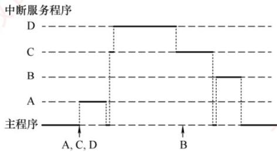  
图 7.7 CPU 执行程序的轨迹

从宏观上看，程序中断方式克服了程序查询方式中 CPU 的忙等待现象，显著提高了 CPU 利用率。但从微观操作分析，CPU 在处理中断时仍需暂停原程序的运行。尤其当高速设备频繁、成批地与主存交换数据时，会不断打断 CPU 现行程序以执行中断服务程序，造成较大开销。

## 题7:

【例7.4】假定计算机的主频为 $500\mathrm{MHz}$ ，CPI为4，某外设的数据率为 $40\mathrm{MB / s}$ ，I/O接


的数据端口为 32 位，采用 DMA 方式，每次 DMA 传送块大小为 1000B，且 DMA 预处理和后处理的总时钟周期数为 500，则 CPU 用于该外设 I/O 的时间占 CPU 总时间的百分比是多少？

解：

DMA 每秒次数为 $40MB/s \div 1000B = 40000$ ，在 DMA 方式中，只有预处理和后处理需要 CPU 处理，数据传送全程由 DMA 控制。CPU 用于外设 I/O 的总时间为 $40000 \times 500 = 2 \times 10^{7}$ 个时钟周期，占 CPU 总时间的百分比为 $2 \times 10^{7} \div 500M = 4\%$ .

## 题8:

04. 下列关于程序中断方式和 DMA 方式的说法中，错误的是（）。  
I. 程序中断过程是由硬件和中断服务程序共同完成的  
II. 在每条指令的执行过程中，每个总线周期要检查一次有无中断请求  
III. 检测有无 DMA 请求，一般安排在一条指令执行过程的末尾  
IV. 中断服务程序的最后指令是无条件转移指令  
V. 中断响应判优是根据中断屏蔽字来确定中断的优先级  
A. I、III、IV B. II、III、IV、V C. II、IV、V D. II、III、IV

I. 程序中断过程是由硬件和中断服务程序共同完成的

正确。

程序中断不是全靠软件，也不是全靠硬件。

中断过程大致是：

```txt
硬件完成：  
关中断、保存断点、识别中断源、转入中断服务程序入口  
软件完成：  
保存现场、执行中断服务程序、恢复现场、中断返回
```


王道中也提到，单级中断处理中，关中断、保存断点、识别中断源由硬件完成，保存现场到中断返回由中断服务程序完成。2027计算机组成原理\_高清带书签版(1)

所以 I 是对的。

## II. 在每条指令的执行过程中，每个总线周期要检查一次有无中断请求错误。

这句话错在：把“中断请求”的检查说得太频繁了。

外部中断一般不是每个总线周期都检查，而是：

CPU通常在一条指令执行结束后，统一检查是否有中断请求。

也就是：

执行一条指令  
↓  
指令结束  
↓  
检查是否有外部中断请求  
↓  
如果满足条件，则响应中断

王道里明确说，CPU总是在一条指令结束时检查外中断请求，所以外中断响应只能发生在一条指令结束时。2027计算机组成原理\_高清带书签版(1)

所以Ⅱ错。

III. 检测有无 DMA 请求，一般安排在一条指令执行过程的末尾错误。

这句话最容易和中断搞混。

外部中断请求：一般在一条指令结束后检查。

DMA 请求：一般在一个总线周期结束后检查。

为什么？

因为DMA要抢的是总线控制权，不是CPU的整个执行流程。

DMA 的目的通常是让外设和主存直接传数据。高速外设数据来得快，如果 DMA 也等到一整条指令执行结束才处理，可能太慢。

所以DMA更常见的节奏是：

```txt
CPU 使用总线完成一个总线周期  
↓  
检查 DMA 是否请求总线  
↓  
如果有，则让 DMA 挪用一个或几个总线周期  
↓  
DMA 传一个字或一批数据  
↓  
总线还给 CPU
```

□

因此，III 把 DMA 请求说成“安排在一条指令执行过程的末尾”，这是把 DMA 请求和中断请求混淆了。

IV. 中断服务程序的最后指令是无条件转移指令

错误。

中断服务程序最后一条指令不是普通的“无条件转移指令”，而是：

中断返回指令

例如可以理解为：

IRET / RETI / 中断返回

它的作用不只是跳回原程序，还要恢复断点、恢复程序状态字等信息。

普通无条件转移指令只是：

```txt
JMP 某个固定地址
```

但中断返回是：

```txt
从栈中取出原来的断点/状态恢复CPU状态回到被中断程序继续执行
```

所以不能说中断服务程序的最后指令是无条件转移指令。它应该是中断返回指令。

## V. 中断响应判优是根据中断屏蔽字来确定中断的优先级

错误。

这句话错在把两个优先级混了：

概念 由谁决定 是否能被中断屏蔽字改变
响应优先级 硬件排队器 / 查询顺序 一般不能动态改变
处理优先级 中断屏蔽字 可以动态改变

题干说的是中断响应判优，所以主要看的是响应优先级。响应优先级通常由硬件线路或查询顺序决定；中断屏蔽字主要影响的是哪些中断能不能参与，以及中断嵌套时的处理优先级。王道也强调，响应优先级由硬件线路或查询顺序固定决定，处理优先级才可通过中断屏蔽技术动态调整。2027计算机组成原理\_高清带书签版(1)

所以 V 错。

## 题9:

08. 在下列情况下，可能不发生中断请求的是（）。A. DMA 操作结束 B. 一条指令执行完毕 C. 机器出现故障 D. 执行“软中断”指令

关键区别：中断请求 $\neq$ 中断响应时机

你这里卡住的点大概率是：

CPU 不是在一条指令执行完毕后检查中断吗？那为什么“一条指令执行完毕”不算中断请求？因为：

“一条指令执行完毕”只是CPU检查中断请求的时间点，不是中断源。

可以这样理解：

中断源发出中断请求
↓
CPU 当前指令执行完毕
↓
CPU 检查是否有中断请求
↓
若有且未屏蔽，则进入中断响应周期

所以，指令执行完毕只是“检查门口有没有人敲门”的时刻，不是“有人敲门”本身。

## 题 10:

13. 当 CPU 响应中断时，进入 “中断响应周期”，采用硬件方法保存并更新程序计数器（PC）内容，而不是由软件完成的，主要是为了（）。  
A. 能进入中断处理程序，并能正确返回源程序  
B. 节省主存空间  
C. 提高处理机速度  
D. 易于编制中断处理程序


## 先把PC在中断中的作用搞清楚

PC，程序计数器，里面放的是：

CPU下一条要取的指令地址。

正常执行时：

<div class="mineru-algorithm" style="white-space: pre-wrap; font-family:monospace;">
PC $\rightarrow$ 原程序下一条指令地址
</div>

发生中断后，CPU要干两件事：

第一，保存原来的PC，因为以后中断处理完还要回到原程序继续执行。

第二，把中断服务程序的入口地址送入PC，因为CPU接下来要去执行中断服务程序。

也就是：

```txt
中断响应前：  
PC = 原程序下一条指令地址  
中断响应周期中：  
保存PC作为断点  
PC←中断服务程序入口地址  
中断服务程序执行完：  
PC←之前保存的断点  
回到原程序继续执行
```


王道资料中也提到，中断隐指令的硬件自动操作包括关中断、保存断点、引出中断服务程序；保存断点通常要保存PC、PSW等关键现场信息，随后把对应中断服务程序入口地址送入PC。2027计算机组成原理\_高清带书签版(1)

为什么不能主要靠软件保存和更新PC?

这里是本题最核心的逻辑：

软件想运行，CPU必须先知道去哪里取软件的第一条指令。

也就是说，中断服务程序要靠 PC 指向它的入口地址后，CPU 才能执行它。

但问题是：

如果让软件来更新PC，那么软件还没开始执行，怎么更新PC？

所以必须由硬件先完成：

```txt
保存原 PC
↓
把中断服务程序入口地址送入 PC
↓
CPU 才能开始执行中断服务程序
```

这就是为什么中断响应周期中的这些动作叫中断隐指令：它不是程序员写的一条真实指令，而是CPU硬件自动完成的一组操作。王道资料也指出，中断隐指令在响应中断时由硬件直接执行，不属于程序员预先编入程序的真实指令。2027计算机组成原理\_高清带书签版(1)

## 为什么选A，不选C?

C 是“提高处理机速度”。

硬件完成确实可能更快，但这不是最根本原因。最根本的是：

没有硬件保存和更新 PC，CPU 就无法可靠地跳到中断服务程序，也无法正确返回原程序。

所以 A 比 C 更本质。

## 四个选项逐项判断

<table><tr><td>选项</td><td>判断</td><td>原因</td></tr><tr><td>A. 能进入中断处理程序,并能正确返回源程序</td><td>正确</td><td>更新 PC 才能进入中断服务程序,保存 PC 才能返回断点</td></tr><tr><td>B. 节省主存空间</td><td>错</td><td>保存 PC 不是为了省空间</td></tr><tr><td>C. 提高处理机速度</td><td>不选</td><td>有一定关系,但不是主要目的</td></tr><tr><td>D. 易于编制中断处理程序</td><td>不选</td><td>软件确实变简单了,但不是本质目的</td></tr></table>

## 题 11:

17. 设置中断屏蔽标志可以改变（）。A. 多个中断源的中断请求优先级 B. CPU对多个中断请求响应的优先次序C. 多个中断服务程序开始执行的顺序 D. 多个中断服务程序执行完的次序

17. D

中断优先级包括响应优先级和处理优先级，中断屏蔽标志改变的是处理优先级。中断响应优先级是由中断查询程序或中断判优电路决定的，它反映的是多个中断同时请求时哪个先被响应，即中断服务程序开始执行的顺序。在多重中断系统中，中断处理优先级决定了本中断是否能打断正在执行的中断服务程序，决定了多个中断服务程序执行完的次序。

这题核心是区分：

<table><tr><td>概念</td><td>含义</td><td>能不能被屏蔽字改变</td></tr><tr><td>中断请求优先级</td><td>中断源本身谁更急</td><td>一般不能</td></tr><tr><td>中断响应优先级</td><td>多个请求同时来,CPU 先响应谁</td><td>不能动态改变</td></tr><tr><td>中断服务程序开始执行顺序</td><td>本质上还是响应顺序</td><td>不能动态改变</td></tr><tr><td>中断服务程序执行完顺序</td><td>谁能打断谁,谁先结束</td><td>可以改变</td></tr></table>

王道这里强调：中断优先级分为响应优先级和处理优先级。响应优先级由硬件线路或查询顺序固定决定，不可动态更改；处理优先级可通过中断屏蔽技术动态调整，用于支持多重中断。2027计算机组成原理\_高清带书签版(1)

## 题 12:

19. 在各种 I/O 方式中，中断方式的特点是（），DMA 方式的特点是（）。  
A. CPU 与外设串行工作，传送与主程序串行工作  
B. CPU 与外设并行工作，传送与主程序串行工作  
C. CPU 与外设串行工作，传送与主程序并行工作  
D. CPU 与外设并行工作，传送与主程序并行工作

## 1. 中断方式为什么选 B?

中断方式的过程是：

```txt
外设准备数据
↓
CPU 不用一直等，可以执行主程序
↓
外设准备好后发中断请求
↓
CPU 暂停主程序，执行中断服务程序
↓
CPU 亲自完成数据传送
↓
返回主程序
```

所以：

```txt
外设准备数据时：CPU与外设并行真正传送数据时：CPU暂停主程序，亲自传送
```

## 因此中断方式是：

## CPU与外设并行工作，传送与主程序串行工作。

## 选B。

你原来理解“中断方式由CPU进行中断处理”是对的，但要补一句：中断方式的数据传送也通常由CPU执行中断服务程序来完成，所以传送期间主程序被打断。

## 2. DMA 方式为什么选 D?

DMA 的过程是:

```txt
CPU 初始化 DMA 控制器
↓
CPU 继续执行主程序
↓
DMA 控制器接管总线
↓
DMA 控制器在外设和主存之间传送数据
↓
传送结束后，DMA 控制器发中断通知 CPU 做后处理
```

## 所以：

```txt
外设工作时：CPU可以执行主程序数据传送时：DMA控制器传，CPU大体还能执行主程序
```

## 因此DMA方式是：

CPU与外设并行工作，传送与主程序并行工作。

选D。

但要注意一句：DMA不是“DMA进行中断处理”。准确说是：

DMA控制器负责数据传送；传送结束后，DMA通过中断请求CPU做结束处理。

## 题 13:

20. 下列关于程序查询方式及其工作过程的叙述中，正确的是（）。  
A. 按启动查询方式的不同，可分为软件查询方式和硬件查询方式  
B. CPU主要负责启动外设和查询其状态，不参与数据传送  
C. 每完成一次数据传送后，会修改主存地址和计数值  
D. CPU需要一直查询外设的状态，直到外设准备就绪时才可去执行其他程序

## A错

按启动查询方式的不同，可分为软件查询方式和硬件查询方式

程序查询方式常见分类是：

独占查询方式定时查询方式

不是按“软件查询/硬件查询”分。

独占查询：CPU一直查，直到设备就绪。

定时查询：CPU每隔一段时间查一次，中间可以做别的事。

## B错

CPU主要负责启动外设和查询其状态，不参与数据传送

错在“不参与数据传送”。

程序查询方式下，CPU不仅要：

启动外设查询状态

还要：

```txt
从I/O端口读数据把数据送到主存或者从主存取数据送到I/O端口
```

也就是数据传送由CPU亲自完成。

## C对

每完成一次数据传送后，会修改主存地址和计数值

这是典型I/O传送循环：

```txt
传一个数据
↓
主存地址 +1
↓
计数值 -1
↓
判断是否传完
```

#

所以C正确。

## D错

CPU需要一直查询外设的状态，直到外设准备就绪时才可去执行其他程序

这只描述了“独占查询方式”，不是所有程序查询方式。定时查询方式下，CPU可以周期性检查，中间仍可执行其他程序。

记忆：

查询方式：CPU查状态，CPU传数据，CPU改地址和计数。

## 题 14:

30. 采用周期挪用进行 DMA 数据传送时, 每传送一个数据要占用一个 ( ) 的时间。 A. 指令周期 B. 中断周期 C. 时钟周期 D. 存储周期

30. D

当采用周期挪用进行 DMA 数据传送时，每当 CPU 收到 DMA 控制器的总线申请，就将下一个总线周期的总线控制权交给 DMA 控制器。DMA 控制器利用这个总线周期完成一个数据字的传送后，立即将总线控制权交回给 CPU，因此这里的总线周期也等于存储周期的长度。

|（注：部分内容可能由 AI 生成）
