# 第二章  数据的表示和运算（2.3）.docx

# 第二章 数据的表示和运算 (2.3)

## 浮点数的表示和运算

知识点：

1.浮点数和定点数

浮点数：

## 二、浮点数的核心公式（必须背下来）

所有浮点数都可以表示为这个通用公式：

$$
\boldsymbol {N} = (- \mathbf {1}) ^ {S} \times \boldsymbol {M} \times \boldsymbol {R} ^ {E}
$$

我把每个符号的含义、特点和考点都给你拆解清楚：

<table><tr><td>符号</td><td>名称</td><td>含义</td><td>考点</td></tr><tr><td>S</td><td>符号位</td><td>决定浮点数的正负</td><td>取值只有0或1 $S = 0 \rightarrow$ 正数 $S = 1 \rightarrow$ 负数</td></tr><tr><td>M</td><td>尾数</td><td>一个非负的定点小数</td><td>决定浮点数的精度位数越多,精度越高通常用原码表示</td></tr><tr><td>R</td><td>基数</td><td>指数的底数</td><td>计算机中隐含约定为2(二进制)少数情况用4或16(十六进制)基数越大,表示范围越大,精度越低</td></tr><tr><td>E</td><td>阶码(指数)</td><td>一个定点整数</td><td>决定浮点数的表示范围位数越多,表示范围越大通常用偏置表示(移码)</td></tr></table>

一句话总结：浮点数 $=$ 符号 $+$ 尾数（精度） $+$ 阶码（范围）

## 定点数：

## 计算机组成原理里的定点数

一句话核心：小数点位置固定不变的数，叫定点数，是计算机表示小数 / 整数的基础方式，和浮点数（小数点可浮动）相对。

## 1. 两种定点格式（最常考）

## (1) 定点整数（纯整数）

小数点固定在最低位右边，只能表示整数。

例：1011.，小数点在末尾

\- 符号位：最高位，0正1负

\- 数值位：后面全是整数

## (2) 定点小数（纯小数）

小数点固定在符号位和数值位之间，只能表示 $-1\sim +1$ 之间的小数。

例：0.1011

\- 符号位：最高位

\- 小数点：隐含在符号位后，不存储

\- 数值位：小数部分

计算机里不存小数点，靠约定位置来识别，这是定点数关键。

## 2. 表示范围（以 $n$ 位二进制为例，含 1 位符号位）

## 定点整数（原码）

\- 正数: $0 \sim 2^{n - 1} - 1$

\- 负数: $- (2^{n-1} - 1) \sim 0$

## 定点小数（原码）

\- 正数: $0 \sim 1 - 2^{-(n-1)}$

\- 负数: $-(1 - 2^{-(n-1)}) \sim 0$

## 3. 优缺点（计组考点）

## 优点

1. 硬件简单，运算电路比浮点数简单

2. 速度快，适合嵌入式、单片机

## 缺点

1. 表示范围很小，定点小数只能表示-1\~1

2. 容易溢出，大数、小数不能同时存

3. 精度固定

## 2.IEEE 754

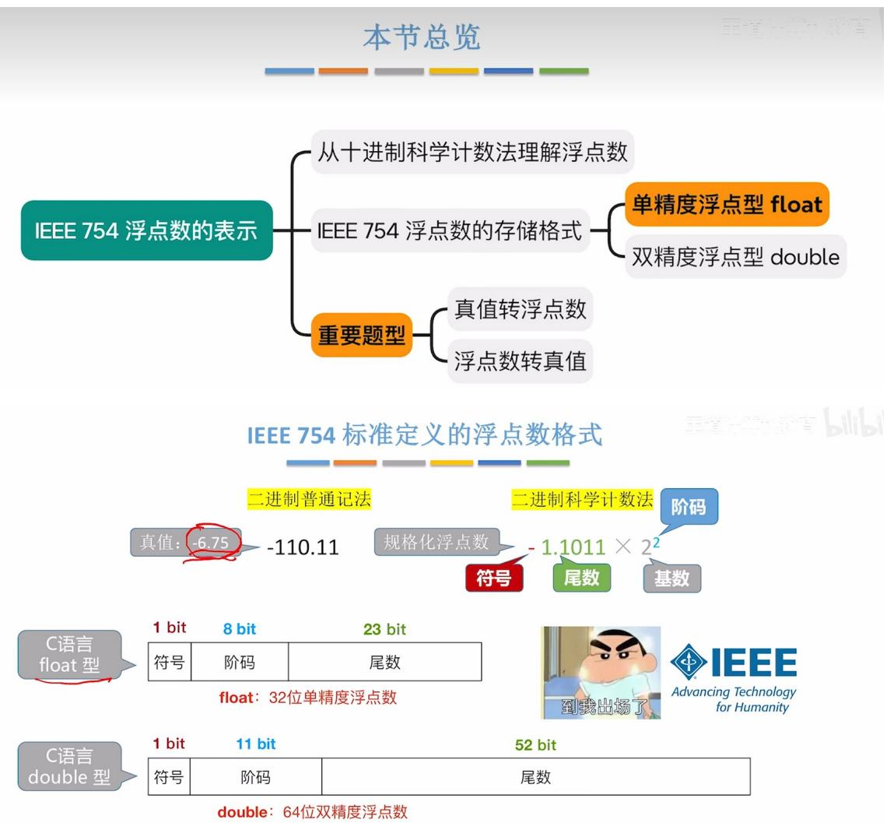  
double: 64位双精度浮点数

注：IEEE 754 也定义了 80bit 扩展精度浮点型（C语言 long double）、16bit 半精度浮点型、128bit 四倍精度浮点型

1. 普通移码 vs float 阶码移码（偏置不一样！）

\- 你之前学的通用8位移码：

$$
\mathbf {\text {偏置}} = 2 ^ {n - 1} = 2 ^ {7} = \mathbf {1 2 8}
$$

$$
\text { 公式:   移码 } = \text { 真值 } + 1 2 8
$$

所以 +2: $2 + 128 = 130 = 10000010$

\- IEEE754 float 阶码：

$$
\mathrm{强制规定偏置} = 1 2 7 (\mathrm{不是} 1 2 8!)
$$

$$
\text { 公式:   阶码 } = \text { 真值 } + 1 2 7
$$

图里阶是 2: $2 + 127 = 129 = 10000001$

## 2. 一句话总结矛盾根源

普通移码：偏置128，移码 $=$ 补码符号位取反

float 阶码：偏置 127，≠普通移码，不能直接用补码符号位取反

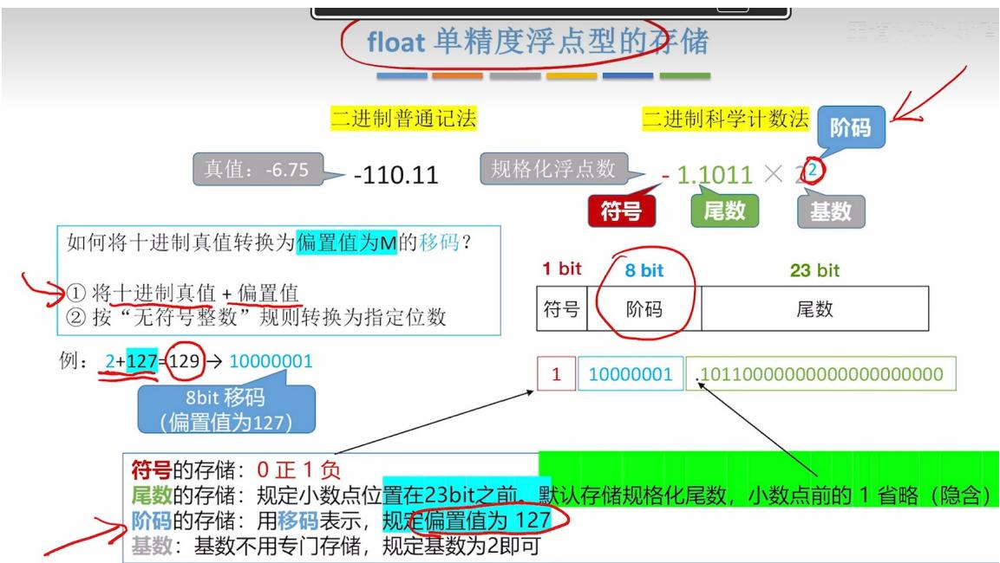

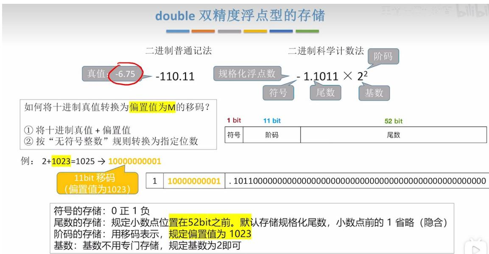

## 3.补码转原码

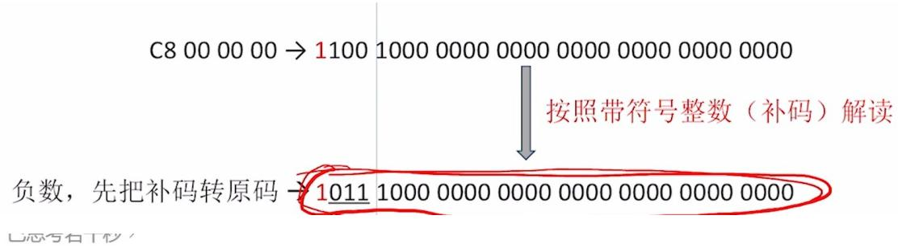

对，你说的这个方法是对的，而且它就是负数补码转原码/求相反数的一个快捷规则。

对于负数补码：

从右往左找到第一个 1，这个 1 以及它右边的位保持不变；它左边的数值位取反；符号位保持为 1。这和“数值位取反加 1”是等价的。

## 4.总结

## 知识回顾与重要考点

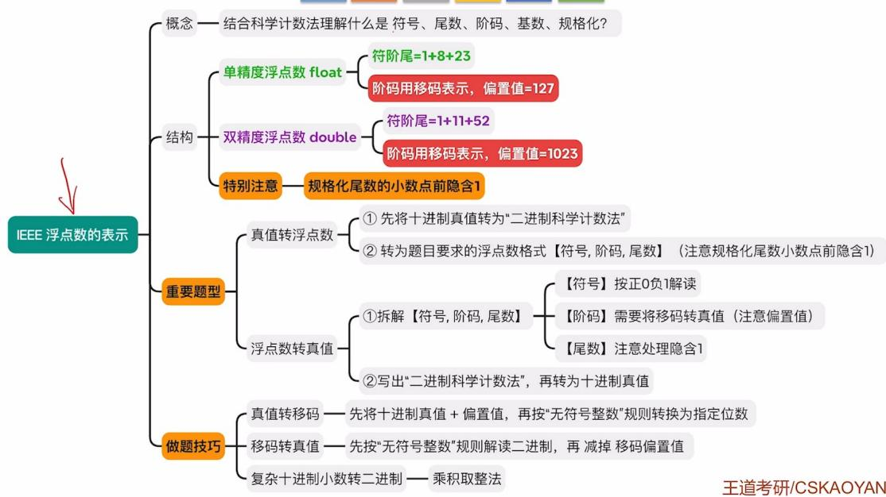

## 5.几种特殊的 IEEE754 浮点数

特殊浮点数汇总表：

特殊状态的浮点数（阶码全0或全1）

<table><tr><td rowspan="2">值的类型</td><td colspan="4">单精度 float (32位)</td><td colspan="4">双精度 double (64位)</td></tr><tr><td>符号</td><td>阶码</td><td>尾数</td><td>值</td><td>符号</td><td>阶码</td><td>尾数</td><td>值</td></tr><tr><td>正零</td><td>0</td><td>全0</td><td>全0</td><td>+0</td><td>0</td><td>全0</td><td>全0</td><td>+0</td></tr><tr><td>负零</td><td>1</td><td>全0</td><td>全0</td><td>-0</td><td>1</td><td>全0</td><td>全0</td><td>-0</td></tr><tr><td>非规格化正数</td><td>0</td><td>全0</td><td>f ≠ 0</td><td>2-126(0.f)</td><td>0</td><td>全0</td><td>f ≠ 0</td><td>2-1022(0.f)</td></tr><tr><td>非规格化负数</td><td>1</td><td>全0</td><td>f ≠ 0</td><td>-2-126(0.f)</td><td>1</td><td>全0</td><td>f ≠ 0</td><td>-2-1022(0.f)</td></tr><tr><td>正无穷大</td><td>0</td><td>全1</td><td>全0</td><td>+∞</td><td>0</td><td>全1</td><td>全0</td><td>+∞</td></tr><tr><td>负无穷大</td><td>1</td><td>全1</td><td>全0</td><td>-∞</td><td>1</td><td>全1</td><td>全0</td><td>-∞</td></tr><tr><td>无定义数 (非数)</td><td>0或1</td><td>全1</td><td>f ≠ 0</td><td>NaN</td><td>0或1</td><td>全1</td><td>f ≠ 0</td><td>NaN</td></tr></table>

  
阶码全为0、全为1留作特殊用途，需要按照特殊的方式去解读真值


1）全0阶码全0尾数：+0/-0。符号s决定其正负，通常情况下+0和-0是等效的。

2）全1阶码全0尾数： $+\infty / - \infty$ 。 $+\infty$ 在数值上大于所有有限数， $-\infty$ 则小于所有有限数。引入无穷大数的目的是，使程序在溢出等异常情况下仍能继续执行。

3）全1阶码非0尾数：NaN（Not a Number）。表示一个没有定义的数，称为非数。

4）全0阶码非0尾数：非规格化数。非规格化数的特点是阶码为全0，不使用隐藏位，尾数字段不全为0。因此，单精度和双精度浮点数的指数分别为-126和-1022。非规格化数用于实现渐进下溢，填补0与最小规格化数之间的数值间隙。

## 非规格化浮点数的具体计算过程：

具体给我讲讲非规格化正负数的计算过程

## 一、先搞懂IEEE754浮点数核心规则（408必考）

32位单精度浮点数格式：符号位S(1位) + 阶码E(8位，偏移量127) + 尾数f(23位)

\- 规格化数：阶码 $E \neq$ 全0、 $\neq$ 全1，尾数默认隐含整数位1，真值： $V = (-1)^{S} \times 1.f \times 2^{E - 127}$

\- 非规格化数：阶码 $E =$ 全0（00000000），这是关键！

此时尾数不再隐含1，直接是0.f，偏移量固定为-126（不是-127）

真值公式： $V = (-1)^{S}\times 0.f\times 2^{-126}$

## 二、非规格化正数（S=0，E = 全 0，f≠0）

1. 符号位 $S = 0 \rightarrow$ 正数

2. 阶码 $E = 00000000 \rightarrow$ 强制偏移量 -126

3. 尾数 $f \neq 0 \rightarrow$ 有效数字是 0.f （二进制小数）

## 计算过程

1. 符号: $(-1)^{0} = 1$

2. 尾数：把 23 位尾数 f 写成二进制小数 0.f

3. 指数：固定 $2^{-126}$

4. 合并：

正数 $= 1 \times 0. f \times 2^{-126} = 2^{-126} \times (0. f)_{2}$

## 三、非规格化负数（S=1，E = 全 0，f≠0）

1. 符号位 $S = 1 \rightarrow$ 负数

2. 阶码 $E = 00000000 \rightarrow$ 偏移量依旧 -126

3. 尾数 $f \neq 0 \rightarrow$ 有效数字 0.f

## 计算过程

1. 符号: $(-1)^{1} = -1$

2. 尾数: 0.f

3. 指数: $2^{-126}$

4. 合并：

负数 $= -1 \times 0. f \times 2^{-126} = -2^{-126} \times (0. f)_{2}$

## 四、和规格化数最核心的 2 个区别（408 最爱考坑点）

1. 尾数：规格化是 1.f，非规格化是 \*\*0.f\*\*（没有隐含的 1）

2. 阶码偏移：规格化 $E - 127$ ，非规格化强制固定-126（哪怕 $\mathrm{E} = 0$ ）

## 五、一句话速记（直接背）

\- 非规格化：阶码全0，偏移-126，尾数0.f

\- 正数: $+0.f \times 2^{-126}$

\- 负数: $-0.f \times 2^{-126}$

## 6.IEEE754 格式浮点数的表示范围

浮点数的上溢：

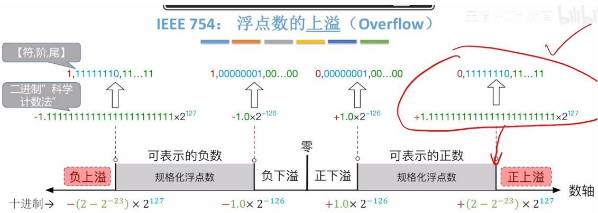  
运算结果大于最大规格化正数时称为正上溢，小于绝对值最大的规格化负数时称为负上溢。正上溢、负上溢统称上溢（Overflow），也会翻译为“溢出”

浮点数上溢（溢出）的处理：

① 浮点数运算部件将运算结果设为设置为 $+ \infty$ 或 $- \infty$

② 设置浮点数溢出异常标志位（例如：x86会将浮点运算单元FPU的OE标志位Overflow Exception置为1）注：IEEE754规定，默认不响应浮点数溢出异常，不中断程序；除非程序员手动开启此类异常响应

## 非规格化浮点数的表示：

IEEE 754: 非规格化浮点数的表示  
1. 2017年1月1日（星期二）下午3:00-15:00
2. 2017年1月1日（星期二）下午3:00-15:00
3. 2017年1月1日（星期二）下午3:00-15:00
4. 2017年1月1日（星期二）下午3:00-15:00
5. 2017年1月1日（星期二）下午3:00-15:00

<table><tr><td rowspan="2">值的类型</td><td colspan="4">单精度 float (32位)</td><td colspan="4">双精度 double (64位)</td></tr><tr><td>符号</td><td>阶码</td><td>尾数</td><td>值</td><td>符号</td><td>阶码</td><td>尾数</td><td>值</td></tr><tr><td>非规格化正数</td><td>0</td><td>全0</td><td>f≠0</td><td>2-126(0.f)</td><td>0</td><td>全0</td><td>f≠0</td><td>2-1022(0.f)</td></tr><tr><td>非规格化负数</td><td>1</td><td>全0</td><td>f≠0</td><td>-2-126(0.f)</td><td>1</td><td>全0</td><td>f≠0</td><td>-2-1022(0.f)</td></tr></table>

不可以将阶码解读为 0 -127 = -127，而是固定解读为阶码的最小真值 -126

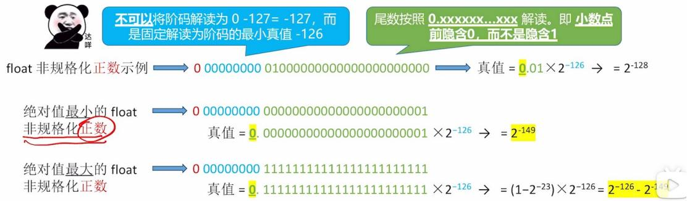

尾数按照 0.xxxxxx...xxx 解读。即 小数点前隐含0，而不是隐含1

IEEE 754: 非规格化浮点数的表示

<table><tr><td rowspan="2">值的类型</td><td colspan="4">单精度 float (32位)</td><td colspan="4">双精度 double (64位)</td></tr><tr><td>符号</td><td>阶码</td><td>尾数</td><td>值</td><td>符号</td><td>阶码</td><td>尾数</td><td>值</td></tr><tr><td>非规格化正数</td><td>0</td><td>全0</td><td>f≠0</td><td>2-126(0.f)</td><td>0</td><td>全0</td><td>f≠0</td><td>2-1022(0.f)</td></tr><tr><td>非规格化负数</td><td>1</td><td>全0</td><td>f≠0</td><td>-2-126(0.f)</td><td>1</td><td>全0</td><td>f≠0</td><td>-2-1022(0.f)</td></tr></table>

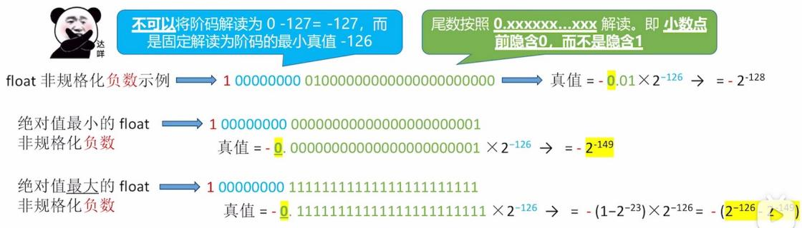

## 浮点数的下溢：

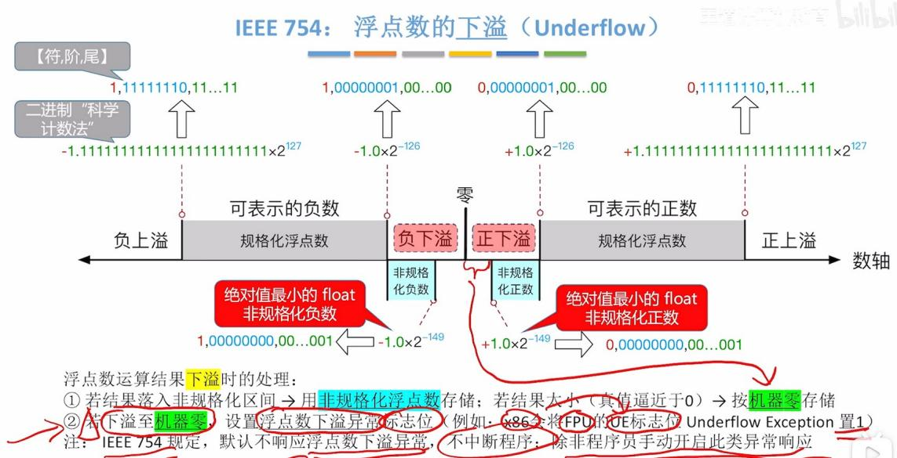

## 非数（NAN）：

在 IEEE 754 浮点数标准中: NaN 代表 “不是一个数” （Not a Number）

IEEE 754: 非数（NaN）的表示

<table><tr><td rowspan="2">值的类型</td><td colspan="4">单精度(32位)</td><td colspan="4">双精度(64位)</td></tr><tr><td>符号</td><td>阶码</td><td>尾数</td><td>值</td><td>符号</td><td>阶码</td><td>尾数</td><td>值</td></tr><tr><td>无定义数(非数)</td><td>0或1</td><td>全1</td><td>f≠0</td><td>NaN</td><td>0或1</td><td>全1</td><td>f≠0</td><td>NaN</td></tr></table>

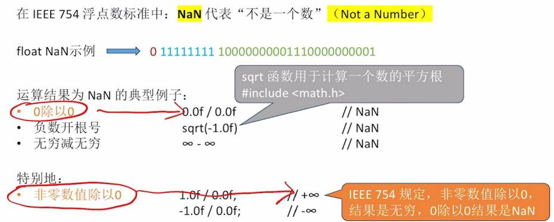

## 7.总结

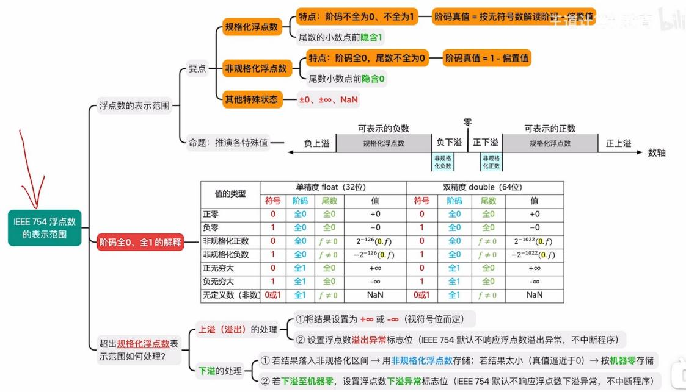

## 8.浮点数加法

## 例1: 浮点数加法

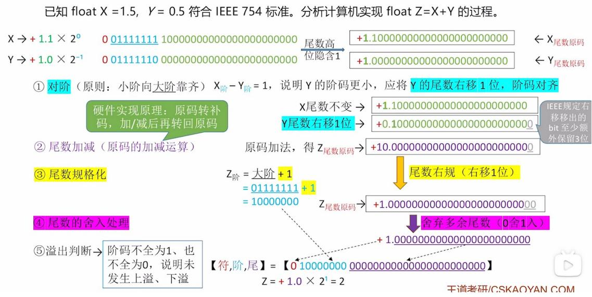

## 9.浮点数减法

例2: 浮点数减法

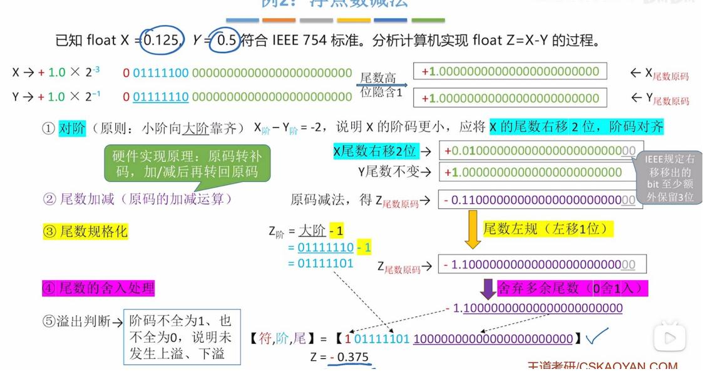

## 例3: 浮点数减法

已知float $X = 10.5$ ， $Y = 120.625$ ，符合IEEE754标准。分析计算机实现float $Z = X - Y$ 的过程。

硬件实现原理：原码转补码，加/减后再转回原码

③ 尾数规格化

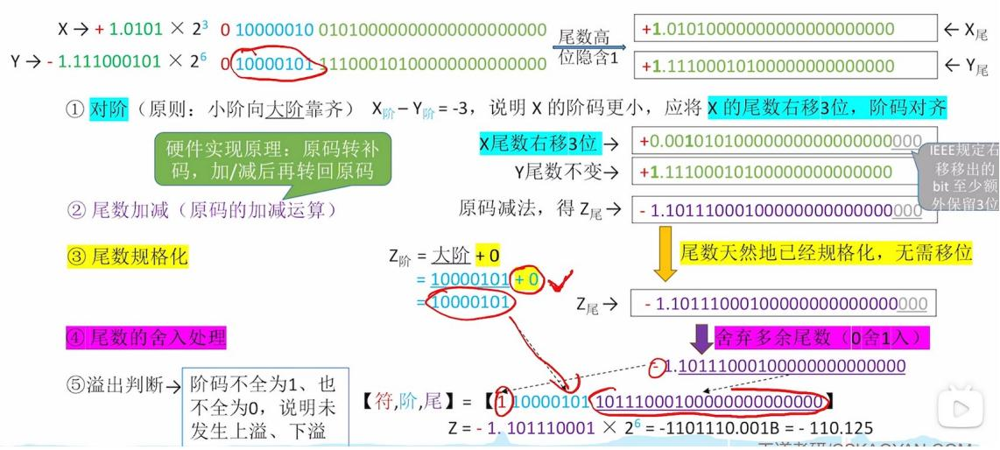

④ 尾数的舍入处理

阶码不全为1、也不全为0，说明未发生上溢、下溢

## 10.舍入

## 四种模式：

IEEE 754 定义的4种舍入模式

<table><tr><td>舍入模式</td><td>特点</td></tr><tr><td>Eg: 2017_43_(3)就近舍入(类似“0舍1入”)</td><td>IEEE默认舍入模式。类似“0舍1入”。如果3个舍弃位刚好是100,则若1+23bit尾数的末位为0,直接截断多余位即可;若1+23bit尾数的末位为1,则截断多余位,并在“末位+1”</td></tr><tr><td>正向舍入(向+∞舍入)</td><td>对正数进位(向上取整),对负数截断多余尾数</td></tr><tr><td>负向舍入(向-∞舍入)</td><td>对负数进位(向下取整),对正数截断多余尾数</td></tr><tr><td>截断法(向0舍入)</td><td>直接截断多余尾数,不进位</td></tr></table>

## 1. IEEE 就近舍入（银行家舍入）完整规则

尾数保留23位（float），舍弃后面多余位，核心两条：

1. 舍弃位≠100：直接 0 舍 1 入（舍弃位最高位是 1 就进 1，是 0 直接丢）

2. 舍弃位 = 100（刚好中间）：偶舍奇入

\- 保留尾数最后一位是0（偶数） $\rightarrow$ 不进位，直接截断

○ 保留尾数最后一位是 1（奇数） $\rightarrow$ 末尾 $+1$ ，凑成偶数

## 0舍:

## 例1: 尾数的舍入处理


已知 float X = 16777216 = $2^{24}$ ，Y = 0.5 符合 IEEE 754 标准。分析计算机实现 float Z = X + Y 的过程。

0 10010111 0000000000000000000000

+1.00000000000000000000000

$\leftarrow X_{\text{尾数原码}}$

0 01111110 000000000000000000000

尾数高
位隐含1

+1.000000000000000000000000

$\leftarrow Y_{\text{尾数原码}}$

① 对阶（原则：小阶向大阶靠齐） $X_{\text {阶}} - Y_{\text {阶}} = 25$ ，说明 $\mathrm{Y}$ 的阶码更小，应将 $\mathrm{Y}$ 的尾数右移25位，阶码对齐

硬件实现原理：原码转补码，加/减后再转回原码

X尾数不变→

+1.00000000000000000000000

Y尾数右移25位→

+0.000000000000000000000000000000010

② 尾数加减（原码的加减运算）

原码加法，得 $Z_{\text{尾数原码}} \rightarrow$

+1.0000000000000000000000000000000000000000

③ 尾数规格化

$Z_{阶} = \underline{大阶} + 0$ $=\underline{10010111}$ $=10010111$

尾数天然地已经规格化
（尾数不用左规、右规，阶码不变）

$Z_{\text{尾数原码}} \rightarrow$

+1.00000000000000000000000000000000000000000

④ 尾数的舍入处理

舍弃多余尾数（0舍1入）

⑤溢出判断→

阶码不全为1、也不全为0，说明未发生上溢、下溢+1.00000000000000000000000

【符,阶,尾】=【01001011100000000000000000000000】Z=16777216

## 特殊情况（舍弃位为 100）：

## 浮点数的加减运算（就近舍入）

int main() {

// 定义并初始化变量

$X = 2^{24}$

// 定义并初始化变量

float x = 16777218.0f;

$X = 2^{24} + 2$

float y = 1.0f;

float z = x + y;

//打印十进制值

printf("十进制值:\n");

//打印十进制值

printf("x = %.1f\n", x);

printf("十进制值:\n");

printf("y = %.1f\n", y);

printf("x = %.1f\n", x);

printf("z = x + y = %.1f\n\n", z);

printf("y = %.1f\n", y);

printf("z = x + y = %.1f\n\n", z);

x + y = 16777216.0若舍弃位为100，且 $1+23\text{bit尾数的末位为0}$ ，则直接截断多余位即可

32位二进制表示:

若舍弃位为 100，且 1+23bit 尾数的末位为 1，则截断多余位，并在“末位+1”

x: 0 10010111 0000000000000000000000

32位二进制表示:

x: 0 10010111 00000000000000000000001

y: 0 01111111 0000000000000000000000

z: 0 10010111 0000000000000000000000

y: 0 01111111 0000000000000000000000

z: 0 10010111 0000000000000000000010

例3：尾数的舍入处理（100特殊处理）  
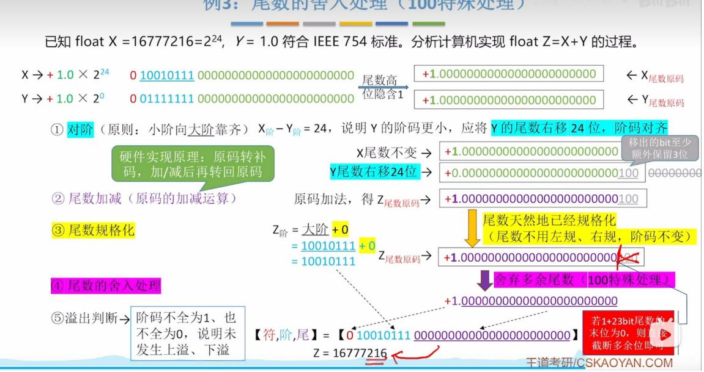

## 例4: 尾数的舍入处理（100特殊处理）

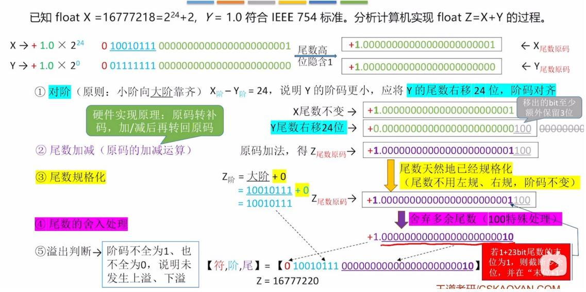

## 11. 溢出判断

上溢：

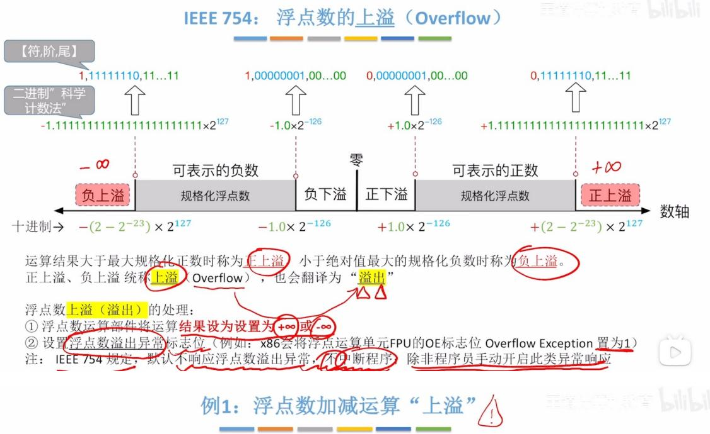

结论：浮点数的溢出不以尾数溢出来判断，尾数溢出可以通过右规操作得到纠正。运算结果是否溢出主要看运算结果的指数是否发生了上溢，因此是由指数上溢来判断的（右规后指数全1说明上溢）

$$
Z _ {\text {尾数原码}} \rightarrow [
$$

已知 $float X = 2^{127}$ , $Y = 2^{127} + 2^{126}$ 符合 IEEE 754 标准。分析计算机实现 $float Z = X + Y$ 的过程。① 对阶（原则：小阶向大阶靠齐） $X_{\text{阶}} - Y_{\text{阶}} = 0$ ，说明 $X$ 、 $Y$ 阶码相等，无需对阶

## 下溢：

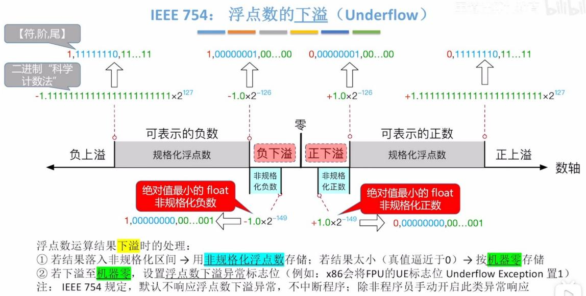

下溢至非规格化区间：

例2: 浮点数加减运算 “下溢” 至非规格化区间

已知 float $X = 2^{-126} + 2^{-149}$ , $Y = -2^{-126}$ 符合 IEEE 754 标准。分析计算机实现 float $Z = X + Y$ 的过程。

+1.000000000000000000000001

① 对阶（原则：小阶向大阶靠齐） $X_{\text {阶}} - Y_{\text {阶}} = 0$ ，说明X、Y阶码相等，无需对阶

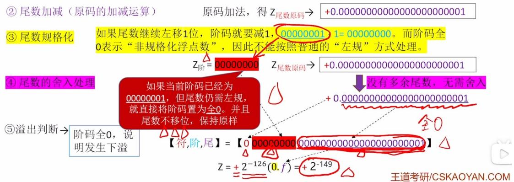

## 12. 数据的宽度和存储

MSB 和 LSB:

大端，小端

1. MSB

\- 全称：Most Significant Bit

\- 中文：最高有效位

\- 含义：二进制数最左边、权重最大的那一位

○ 例：1011，MSB是最左边的1

2. LSB

\- 全称：Least Significant Bit

\- 中文：最低有效位

\- 含义：二进制数最右边、权重最小的那一位

例：1011，LSB是最右边的1

## 考研408必背小要点

1. 有符号数中: MSB 就是符号位

2. 大小端模式：看的就是 LSB 存在低地址还是高地址

○ 小端：LSB 放低地址 (x86 默认)

\- 大端：MSB 放低地址（网络传输）

## 立即数（考研408·计组/汇编极简通俗版）

## 1. 定义

立即数：直接写在指令里的常数，不需要去内存 / 寄存器取数。

指令格式: 操作码 + 立即数

\- 普通操作数：要去寄存器、内存找数据

\- 立即数：数据直接跟在指令后面，CPU拿到指令就拿到数据

## 1. 定义考点（选择题必考）

\- 小端（Little-Endian，x86 默认）：LSB（最低有效字节）存低地址，MSB（最高有效字节）存高地址，字节顺序与书写顺序相反

\- 大端（Big-Endian，网络传输 / ARM 常用）：MSB 存低地址，LSB 存高地址，字节顺序与书写顺序相同

2. 机器码 / 立即数字节序（本题直接考点）

\- 32位立即数在小端机内存中按字节逆序存储，机器码里看到的连续字节，需要逆序拼接才是真实数值。

\- 本题例子：
立即数 0x08049464 → 内存小端存储为 64 94 04 08，逆序还原。

## 八、大小端存储：和字节数一起考

比如：

$$
i n t x = 0 x 1 2 3 4 5 6 7 8
$$

它是 4 字节:

12 34 56 78

## 大端方式

低地址存高位字节：

<table><tr><td>地址</td><td>内容</td></tr><tr><td>低地址</td><td>12</td></tr><tr><td></td><td>34</td></tr><tr><td></td><td>56</td></tr><tr><td>高地址</td><td>78</td></tr></table>

## 小端方式

低地址存低位字节：

地址

内容

低地址

78

56

34

高地址

12

x86 默认是小端存储。

考研题常问：

一个整数 0x12345678 存在内存中，从低地址到高地址依次是什么？

如果是 x86，小端：

78 56 34 12

## 数据按边界对齐方式存储：

边界对齐

现代计算机通常是按字节编址，即每个字节对应1个地址

通常也支持按字、按半字、按字节寻址。

假设存储字长为32位，则1个字=32bit，半字=16bit。每次访存只能读/写1个字

<table><tr><td>字节1</td><td>字节2</td><td>字节3</td><td>填充</td></tr><tr><td colspan="2">半字1</td><td colspan="2">半字2</td></tr><tr><td colspan="2">半字3</td><td colspan="2">填充</td></tr><tr><td colspan="4">字1</td></tr></table>

访问一个字/半字都只需一次访存

图2.10 边界对齐方式

<table><tr><td>字节1</td><td>字节2</td><td>字节3</td><td>半字1-1</td></tr><tr><td>半字1-2</td><td colspan="2">半字2</td><td>半字3-1</td></tr><tr><td>半字3-2</td><td colspan="3">字1-1</td></tr><tr><td>字1-2</td><td colspan="3"></td></tr></table>

图2.11 边界不对齐方式

访问一个字/半字可能要两次访存

## 3. 数据按“边界对齐”方式存储

在字长为 32 位的系统中，边界对齐要求数据的存储地址是其对齐值（通常等于该类型大小，单位：字节）的整数倍；字节可位于任意地址，半字地址须为 2 的倍数，字地址须为 4 的倍数。满足此条件时，CPU 可通过一次访存读取完整数据；否则，若数据跨越两个存储单元，则需两次访存并拼接字节，显著降低效率。为满足对齐要求，编译器会在必要时填充空白字节。这种 “以空间换时间” 的策略虽略微增加内存占用，但能大幅提升访问速度。

例如，数据序列“字节1、字节2、字节3、半字1、半字2、半字3、字1”按边界对齐与非对齐方式存储的格式分别如图2.17和图2.18所示。

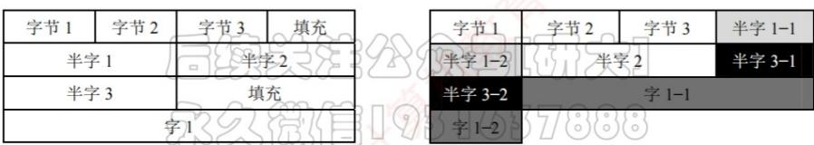  
图 2.17 按边界对齐方式存储  
图 2.18 按边界不对齐方式存储  
考点追踪 ▶ 结构体的小端、边界对齐存储（2012、2020）

C 语言中，struct 型的内存布局遵循以下对齐规则：① 每个成员的起始地址必须是其对齐值的整数倍（例如：char 为 1，short 为 2，int 为 4）；② 整个结构体的大小必须是其最大成员对齐值的整数倍（不足则在尾部填充）。这确保了每个结构体成员的起始地址均满足对齐要求。  
先看两个例子（基于 32 位 x86 环境，GCC 编译器）：

<table><tr><td>struct A{</td><td>struct B{</td></tr><tr><td>int a;</td><td>char b;</td></tr><tr><td>char b;</td><td>int a;</td></tr><tr><td>short c;</td><td>short c;</td></tr><tr><td>}</td><td>}</td></tr></table>

结果却是： $sizeof(A)=8,\quad sizeof(B)=12$ 。

设 B 从地址 0x0000 开始，成员 b 的对齐值是 1，其存放地址符合 0x0000%1 = 0；成员 a 的对齐值是 4，需对齐到 4 字节边界，故起始于 0x0004，占据 0x0004～0x0007；成员 c 的对齐值是 2，起始于 0x0008，占据 0x0008～0x0009。此外，结构体长度必须是最大对齐值（4）的整数倍，当前大小 10 字节，需填充至 12 字节（0x000A～0x000B）。

设 A 也从地址 0x0000 开始，成员 a 的对齐值是 4，存放在 0x0000～0x0003；成员 b 的对齐值是 1，存放在 0x0004；成员 c 的对齐值是 2，为满足 “起始地址% 对齐值 = 0” 的条件，只能存放在 0x0006～0x0007，总大小为 8 字节，无须尾部填充。

精简指令集计算机（RISC）普遍采用边界对齐，以支持高效的指令流水线。

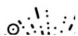

完整必背（考试直接默写）

<table><tr><td colspan="3">表格</td></tr><tr><td>类型</td><td>大小</td><td>对齐值(对齐模数)</td></tr><tr><td>char / unsigned char</td><td>1</td><td>1</td></tr><tr><td>short / unsigned short</td><td>2</td><td>2</td></tr><tr><td>int / unsigned / unsigned int</td><td>4</td><td>4</td></tr><tr><td>long</td><td>4</td><td>4</td></tr><tr><td>long long</td><td>8</td><td>8</td></tr><tr><td>float</td><td>4</td><td>4</td></tr><tr><td>double</td><td>8</td><td>8</td></tr></table>

## 13.字节

在考研默认环境：C语言 / x86 / 32位机下，一般按下面记：

<table><tr><td>类型</td><td>字节数</td><td>位数</td><td>常见范围</td></tr><tr><td>char</td><td>1B</td><td>8位</td><td>-128 ~ 127 或 0 ~ 255</td></tr><tr><td>short</td><td>2B</td><td>16位</td><td>-32768 ~ 32767</td></tr><tr><td>int</td><td>4B</td><td>32位</td><td>-2^31 ~ 2^31-1</td></tr><tr><td>long</td><td>4B</td><td>32位</td><td>-2^31 ~ 2^31-1</td></tr><tr><td>long long</td><td>8B</td><td>64位</td><td>-2^63 ~ 2^63-1</td></tr><tr><td>float</td><td>4B</td><td>32位</td><td>单精度浮点数</td></tr><tr><td>double</td><td>8B</td><td>64位</td><td>双精度浮点数</td></tr><tr><td>long double</td><td>常见 8B / 12B / 16B</td><td>不固定</td><td>扩展精度</td></tr></table>

重点记忆：

$1B = 8bit$

## 1 个十六进制位 = 4 个二进制位。

## 十、sizeof 是考研常考细节

sizeof 求的是字节数，不是位数。

例如 32 位 x86 下:

```txt
< C
sizeof(short) = 2
sizeof(int) = 4
sizeof(long) = 4
sizeof(long long) = 8
sizeof(char) = 1
```

注意:

```txt
sizeof(int) = 4
```

表示4字节，不是4位。

所以 int 的位数是:

$$
4 \times 8 = 3 2 \mathrm{位}
$$

题目：

## 题 1: （真值转浮点数）

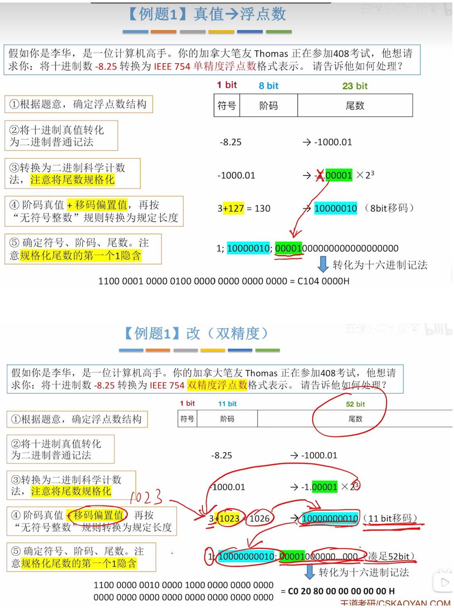  
题 2: (double 的表示范围)

double型结构 = 1+11+52 bit 【符号,阶码,尾数】，阶码偏置值 1023


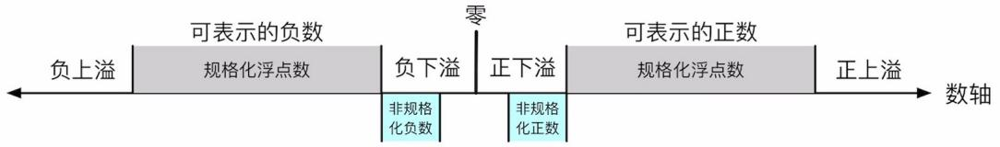

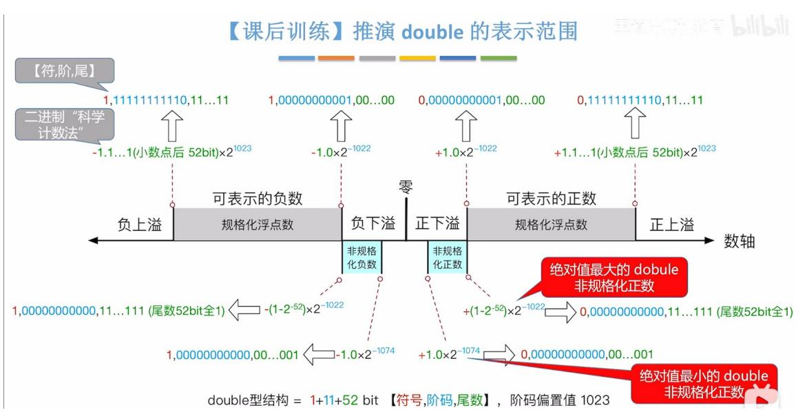  
题 3: (double 的特殊值)

# 【课后训练】写出 double 的 $\pm 0$ 、 $\pm \infty$ 、NaN

double型结构 = 1+11+52 bit 【符号,阶码,尾数】，阶码偏置值 1023

$$
\text { double } \pm 0 \quad \Longrightarrow \quad + 0 \quad 0 0 0 0 0 0 0 0 0 0 0 0 0 0 0 0 0 0 0 0 0 0 0 0 0 (5 2 \text { bit } 0)
$$

0x000000000000000

$$
- 0 \quad 1 0 0 0 0 0 0 0 0 0 0 0 0 0 0 0 \dots 0 0 0 (5 2 \mathrm{bit} 0)
$$

0x800000000000000

$$
\begin{array}{r l r} \text { double } \pm \infty & \Longrightarrow + \infty & 0   1 1 1 1 1 1 1 1 1 1   0 0 0.... 0 0 0 \quad (5 2 \text { bit }   0) \\ & - \infty & 1   1 1 1 1 1 1 1 1 1 1   0 0 0.... 0 0 0 \quad (5 2 \text { bit }   0) \end{array}
$$

0x7FF0000000000000

0xFFFF0000000000000

$$
1 1 1 1 1 1 1 1 1 1 1 X X X \dots \dots X X X (5 2 \mathrm{bit} \text {不全为} 0)
$$

## 题 4:

03.浮点数的IEEE754标准对尾数编码采用的是（）。A.原码 B.反码 C.补码 D.移码

03. A

IEEE 754 标准中尾数采用原码表示，阶码部分用移码表示。

## 题 5:

08. 采用规格化的浮点数最主要是为了（）。A. 增加数据的表示范围 B. 方便浮点运算C. 防止运算时数据溢出 D. 增加数据的表示精度

与非规格化浮点数相比，采用规格化浮点数的目的主要是为了增加数据的表示精度。

3. 逐个排除错误选项

\- A 增加表示范围 ✗：范围由阶码决定，规格化不改变阶码，范围不变

\- B 方便浮点运算 ✗：运算后才规格化，不是为了方便运算

\- C 防止溢出 ✗：溢出由阶码大小决定，规格化不能防止溢出

一句话口诀

规格化 = 提高精度；阶码 = 决定范围

## 题6:

17. 在 IEEE 754 单精度浮点数加减运算中，若两个操作数阶码之差的绝对值为 $\Delta E$ ，当其大于或等于（）时，阶码较小的操作数对结果无影响，结果直接取阶码较大的操作数（假设采用就近舍入的方式）。
A. 24 B. 25 C. 126 D. 128

## 一、核心前提（先回忆）

IEEE754 单精度 float:

\- 尾数：隐含1位 $+23$ 位存储位 $= 24$ 位有效尾数

\- 就近舍入：舍弃位全0直接丢；只要舍弃位最高位为1就进1

## 二、题目意思

两个浮点数做加减，对阶时：

小阶的尾数要右移 $\Delta E$ 位。

当右移后，小阶数的所有有效尾数全部被移出24位有效位之外，那这个数就完全没用了，结果直接取大阶的数。

问题： $\Delta E \geq$ 多少时，小阶数彻底无影响？

## 三、推导过程

1. 小阶数有 24 位有效尾数（1 位隐藏 1 + 23 位）

2. 右移时：
○ 右移 24 位：24 位有效尾数刚好全部移出有效位边界，全部变成舍弃位
○ 此时舍弃位最高位 = 0 → 直接截断，无影响
○ 舍弃位最高位 = 1 → 就近舍入会进 1，还是会影响结果

## 3. 右移 25 位:

24位有效尾数全部移出，连最高位都被移出去了

舍弃位最高位恒为0，就近舍入直接截断，完全不影响结果

## 题 7:

A. 1 甲 II B. 2 A I C. 3 乙 II D. 无正则实

21. 在按字节编址的计算机中，采用小端方式存储数据，某静态二维数组 b 的声明如下：
static short b[2][4] = {{2,9,-1,5},{3,1,-6,2}};
若 b 的首地址为 0x8049820，采用按行优先存储，地址 0x804982c 中的内容是（）。
A. FAH    B. FFH    C. 00H    D. 05H

二维数组 b 的元素是 short 型，占 2 字节，采用按行优先存储，b[0][0]的地址为 0x8049820，b[0][1]的地址为 0x8049822，以此类推，b[1][2]的地址为 0x804982c。b[1][2]的值为 -6，补码表示为 11111111 11111010，采用小端方式存储，因此地址 0x804982c 存放的是低位字节 FAH。

## 题8:

23. 在按字节编址的 32 位计算机中，按边界对齐方式为以下结构型变量 x 分配存储空间：
struct cont\_info{
    char id;
    unsigned post;
    char phone;
}

若 x 的首地址为 0x8049820，则成员变量 phone 的起始地址为（）。  
A. 0x8049828 B. 0x8049826 C. 0x8049825 D. 0x8049822

23. A

结构体按边界对齐存放的要求：数据成员的起始地址是其数据类型大小的整数倍，char型占1字节，char型的起始地址必须是1字节的整数倍；unsigned型占4字节，所以unsigned型的起始地址必须是4字节的整数倍。据此分析，id的起始地址为0x8049820，post的起始地址为


## 第2章 数据的表示和运算


0x8049824，所以 phone 的起始地址为 0x8049828。结构体 x 的存放方式如下所示。

<table><tr><td>8049820H</td><td>8049821H</td><td>8049822H</td><td>8049823H</td></tr><tr><td>char</td><td></td><td></td><td></td></tr><tr><td>8049824H</td><td>8049825H</td><td>8049826H</td><td>8049827H</td></tr><tr><td colspan="4">post</td></tr><tr><td>8049828H</td><td>8049829H</td><td>804982AH</td><td>804982BH</td></tr><tr><td>phone</td><td></td><td></td><td></td></tr></table>

## 题9:

34.【2016统考真题】某计算机字长为32位，按字节编址，采用小端方式存放数据。假定有一个double型变量，其机器数表示为1122 3344 5566 7788H，存放在以0000 8040H开始的连续存储单元中，则存储单元0000 8046H中存放的是（）。A. $22\mathrm{H}$ B. $33\mathrm{H}$ C. $77\mathrm{H}$ D. $66\mathrm{H}$

## 二、第一步：看这个数一共多少字节

机器数：

1122 3344 5566 7788H

这是十六进制数。

十六进制中：

$$
1 \mathrm{个十六进制位} = 4 b i t
$$

所以：

$$
2 \text {个十六进制位} = 8 b i t = 1 B
$$

把它按字节拆开：

$$
\begin{array}{c c c c c c c c} 1 1 & 2 2 & 3 3 & 4 4 & 5 5 & 6 6 & 7 7 & 8 8 \end{array}
$$

所以这个数据一共有8个字节。

所以这个数据一共有8个字节。

也就是：

<table><tr><td>字节序号</td><td>内容</td></tr><tr><td>第1字节</td><td>11H</td></tr><tr><td>第2字节</td><td>22H</td></tr><tr><td>第3字节</td><td>33H</td></tr><tr><td>第4字节</td><td>44H</td></tr><tr><td>第5字节</td><td>55H</td></tr><tr><td>第6字节</td><td>66H</td></tr><tr><td>第7字节</td><td>77H</td></tr><tr><td>第8字节</td><td>88H</td></tr></table>

注意：这里先只是把机器数按字节拆开，还没有放进内存。

## 三、第二步：理解“按字节编址”

题目说:

按字节编址

意思是:

一个地址对应一个字节。

也就是：

0000 8040H

这个地址里面只能放1个字节，不是放32位，也不是放一个double。

所以连续存储单元地址是这样加的：

<table><tr><td>地址</td><td>与起始地址的距离</td></tr><tr><td>0000 8040H</td><td>起始地址</td></tr><tr><td>0000 8041H</td><td>起始地址 + 1 字节</td></tr><tr><td>0000 8042H</td><td>起始地址 + 2 字节</td></tr><tr><td>0000 8043H</td><td>起始地址 + 3 字节</td></tr><tr><td>0000 8044H</td><td>起始地址 + 4 字节</td></tr><tr><td>0000 8045H</td><td>起始地址 + 5 字节</td></tr><tr><td>0000 8046H</td><td>起始地址 + 6 字节</td></tr><tr><td>0000 8047H</td><td>起始地址 + 7 字节</td></tr></table>

因为是按字节编址，所以地址每加 1，就移动 1 个字节。

## 四、第三步：理解“小端方式”

这是本题最关键的地方。

## 1. 大端方式

大端方式：高位字节放低地址，低位字节放高地址。

如果数据是：

1122 3344 5566 7788H

那么大端存储是：

<table><tr><td>地址</td><td>内容</td></tr><tr><td>8040H</td><td>11H</td></tr><tr><td>8041H</td><td>22H</td></tr><tr><td>8042H</td><td>33H</td></tr><tr><td>8043H</td><td>44H</td></tr><tr><td>8044H</td><td>55H</td></tr><tr><td>8045H</td><td>66H</td></tr><tr><td>8046H</td><td>77H</td></tr><tr><td>8047H</td><td>88H</td></tr><tr><td colspan="2">大端就是按照你看到的顺序存。</td></tr></table>

## 2. 小端方式

小端方式：低位字节放低地址，高位字节放高地址。

数据:

1122 3344 5566 7788H

最高位字节是：

11H

最低位字节是:

88H

小端方式要从低地址开始放低位字节，所以内存中是反着放的：

<table><tr><td>地址</td><td>内容</td></tr><tr><td>0000 8040H</td><td>88H</td></tr><tr><td>0000 8041H</td><td>77H</td></tr><tr><td>0000 8042H</td><td>66H</td></tr><tr><td>0000 8043H</td><td>55H</td></tr><tr><td>0000 8044H</td><td>44H</td></tr><tr><td>0000 8045H</td><td>33H</td></tr><tr><td>0000 8046H</td><td>22H</td></tr><tr><td>0000 8047H</td><td>11H</td></tr></table>

0000 8046H

里面存的是:

22H

答案选:

A

## 详细题解：

https://chatgpt.com/s/t\_6a0696d3d92881918b43aa693612f92a

题 10:

43.【2024统考真题】某科学实验中，需要使用大量的整型参数，为了在保证表数精度的基础上提高运算速度，需要选择合理的数据表示方法。若整型参数 $\alpha$ 、 $\beta$ 的取值范围分别为 $-2^{20} \sim 2^{20}$ 、 $-2^{40} \sim 2^{40}$ ，则在下列选项中， $\alpha$ 、 $\beta$ 最适合采用的数据表示方法分别是（）。A. 32位整数、32位整数 B. 单精度浮点数、单精度浮点数 C. 32位整数、双精度浮点数 D. 单精度浮点数、双精度浮点数

43. C

表示整数时，相同位数的浮点型的精度不如整型，因此在能满足 $\alpha$ 、 $\beta$ 的取值范围的前提下，应优先选择整型；否则，才选择浮点型。32位补码整数的表示范围为 $-2^{31} \sim 2^{31} - 1$ ，满足 $\alpha$ 的取值范围，因此 $\alpha$ 应采用32位整数。双精度浮点数的精度比单精度浮点数的更高， $-2^{40} \sim 2^{40}$ 超出了单精度浮点数可以表示的精度（由尾数位数+隐含位决定），因此 $\beta$ 应采用双精度浮点数。

题 11:

33. 【2015 统考真题】下列有关浮点数加减运算的叙述中，正确的是（）。I. 对阶操作不会引起阶码上溢或下溢 II. 右规和尾数舍入都可能引起阶码上溢 III. 左规时可能引起阶码下溢 IV. 尾数溢出时结果不一定溢出 A. 仅 II、III B. 仅 I、II、IV C. 仅 I、III、IV D. I、II、III、IV 33. D

对阶是较小的阶码向较大的阶码对齐，所以对阶后的阶码是当前那个较大的阶码而不会导致阶码溢出，说法Ⅰ正确。右规和尾数舍入过程，阶码加1而可能上溢，说法Ⅱ正确，同理说法Ⅲ也正确。尾数溢出时可能仅产生误差，结果不一定溢出，说法Ⅳ正确。

## 题 12:

36. 【2018 统考真题】某 32 位计算机按字节编址，采用小端方式。若语句 “int i = 0;” 对应指令的机器代码为 “C7 45 FC 00 00 00 00”，则语句 “int i = -64;” 对应指令的机器代码是（）。A. C7 45 FC C0 FF FF FF B. C7 45 FC 0C FF FF FF C. C7 45 FC FF FF FF C0 D. C7 45 FC FF FF FF 0C

## 机器指令 = 操作码 + 地址/寄存器信息 + 立即数

## 题目已经告诉你:

```c
int i = 0;
对应机器代码为:
C7 45 FC 00 00 00 00
```

## 现在要问：

```txt
int i = -64;
```

对应机器代码是什么。

## 二、32位int中，-64怎么表示？

32 位 int 一般用 补码 表示有符号整数。

先写出正数 64:

```asm
64 = 0x000000040
```

二进制是：

```txt
00000000 00000000 00000000 01000000
```

求 -64 的补码:

方法是：

正数64的原码 $\rightarrow$ 按位取反 $\rightarrow$ 加1

所以:

00000000 00000000 00000000 01000000

按位取反：

```txt
11111111 11111111 11111111 10111111
```

加 1:

11111111 11111111 11111111 11000000

换成十六进制：

FF FF FF C0

所以:

↓

-64 的 32 位补码 = 0xFFFFFC0

## 三、关键：小端方式怎么存？

题目说：

采用小端方式

小端方式的意思是：

多字节数据中，低位字节存在低地址，高位字节存在高地址。

对于:

```txt
0xFFFFFC0
```

把它按字节拆开：

FF FF FF C0

其中：

C0 是最低字节
FF 是高字节

小端存储时，要从低字节开始放：

```txt
C0 FF FF FF
```

所以立即数 -64 在机器代码中写成:

```txt
C0 FF FF FF
```

↓

## 详细题解：

https://chatgpt.com/s/t\_6a07cf1cd0788191816113e907c17e09

## 题 13:

37. 【2020 统考真题】在按字节编址、采用小端方式的 32 位计算机中，按边界对齐方式为以下 C 语言结构型变量 a 分配存储空间：

```txt
struct record{
    short x1;
    int x2;
} a;
```

若 a 的首地址为 2020 FE00H，a 的成员变量 x2 的机器数为 1234 0000H，则其中 34H 所在存储单元的地址是（）。  
A. 2020 FE03H B. 2020 FE04H C. 2020 FE05H D. 2020 FE06H

## 37. D

在 32 位计算机中，按字节编址，根据小端方式和按边界对齐的定义，变量 a 的存放方式：

<table><tr><td>地址</td><td>2020 FE00H</td><td>2020 FE01H</td><td>2020 FE02H</td><td>2020 FE03H</td></tr><tr><td></td><td>未知</td><td>未知</td><td></td><td></td></tr><tr><td>说明</td><td>x1 (LSB)</td><td>x1 (MSB)</td><td></td><td></td></tr><tr><td>地址</td><td>2020 FE04H</td><td>2020 FE05H</td><td>2020 FE06H</td><td>2020 FE07H</td></tr><tr><td></td><td>00H</td><td>00H</td><td>34H</td><td>12H</td></tr><tr><td>说明</td><td>x2 (LSB)</td><td></td><td></td><td>x2 (MSB)</td></tr></table>

于是，34H所在存储单元的地址为2020FE06H。

## 详细题解：

https://chatgpt.com/s/t\_6a07d108dcf481918beb516c4e532f51

## 易错点：

1.规格化浮点数最小值和非规格化浮点数最大值

非规格化正数的最大值不应该等于规格化浮点数的最小值吗

直接给结论

不相等，但无限接近，你这个疑问是IEEE754单精度浮点数最经典的易错点，我用最直白的方式拆开讲：

1. 两个数分别是什么

① 规格化最小正数（最小正规数）

阶码 = 0000 0001，尾数 = 000...000

\- 公式: $1.0 \times 2^{-126}$

② 非规格化最大正数（最大非正规数）

阶码 = 0000 0000，尾数 = 111...111 (23 位全 1)

\- 公式: $(1 - 2^{-23}) \times 2^{-126}$

## 2. 为什么你会觉得“应该相等”？

IEEE754 设计非规格化数的目的，就是为了填补 0 和最小规格化数之间的空隙，实现平滑过渡：

\- 非规格化数：阶码全0，没有隐藏的前导1，尾数直接是小数，指数强制为-126

\- 规格化数：阶码 $\geq 1$ ，有隐藏的前导1，格式是1.尾数 $\times 2^{\wedge}$ 指数

所以最大的非规格化数，就是尾数无限接近1，也就是 $(1 - 2^{-23})$ ，再乘 $2^{-126}$ ，差了一个极小的 $2^{-149}$ 。

## 数值对比（单精度32位）

\- 最小规格化正数： $2^{-126}$

\- 最大非规格化正数: $2^{-126} - 2^{-149}$

## 3. 一句话记住

## 非规格化最大正数 < 规格化最小正数

二者无缝衔接、无限接近，但严格不相等，中间没有其他浮点数。

## 总结：

## 2.4 本章小结

本章开头提出的问题的参考答案如下:

1）在计算机中，为什么要采用二进制来表示数据？

答案已在本章开头给出。

2）计算机在字长足够的情况下能够精确地表示每个数吗？若不能，请举例说明。

不能。对于整数，只要其数值在当前字长可表示的范围内，即可精确表示。但对于小数（实数），由于采用二进制表示，只能精确表示形如若干个 $1 / (2^k)$ （ $k$ 为正整数）之和的有理数。许多十进制有限小数在二进制下是无限循环小数，无法用有限位精确表示。例如， $0.1 = (0.0001100110011\dots)_2$ 。因此，即使字长很长，这类数值也只能被近似表示。

3）字长相同的情况下，浮点数和定点数的表示范围与精度有什么区别？

在相同字长下，浮点数与定点数存在“范围 vs 精度”的权衡：

\- 表示范围：浮点数通过阶码可表示极大或极小的数值，远大于定点数。

\- 表示精度：定点数将所有位用于数值本身，具有恒定且较高的绝对精度；而浮点数需分配部分位给阶码，导致尾数位数减少，有效精度降低，且精度随数值增大而下降。

因此，浮点数以牺牲精度换取更大的表示范围，定点数以固定精度为代价限制其数值范围。

4）用移码表示浮点数的阶码有什么好处？

IEEE 754 标准采用移码表示阶码，主要有以下优势：

① 便于阶码比较。浮点数加减运算时需比较两个数的阶码大小，而移码比较更方便。

② 支持特殊值的统一编码。阶码全 0：当尾数也为 0 时，表示±0；尾数非零时，表示非规格化数。阶码全 1：保留作特殊用途——当尾数为 0 时，表示±∞；尾数非零时，表示 NaN（如 0/0、∞-∞ 等无效运算结果）。


低 n 位（结果对 $2^{n}$ 取模），舍去高位，导致截断后的值不等于真实结果，这种现象称为无符号溢出。在运算器中，通常通过进位标志（CF）来检测无符号溢出。

3. 对于位数相同的定点数和浮点数，可表示的浮点数个数比定点数多吗？

不是。n 位编码最多表示 $2^{n}$ 个不同比特模式。定点数（如 n 位补码）通常能表示 $2^{n}$ 个互异的有效数值；浮点数中，部分编码用于表示 $\pm0$ 、 $\pm\infty$ 和 NaN 等特殊值，实际可表示的有效实数个数少于 $2^{n}$ 。因此，在相同位数下，定点数通常能表示更多有效数值。

4. 现代计算机中是否要考虑原码加减运算？如何实现？

现代计算机一般不实现原码加减运算。尽管 IEEE 754 浮点数的尾数采用原码表示，但尾数本身是无符号的，符号由独立的符号位表示。在加减运算时，硬件根据操作数符号和运算类型，将尾数作为无符号整数送入通用 ALU 进行加或减运算，结果符号由控制逻辑生成。

因此，浮点尾数运算本质上是无符号整数运算，无须原码加减机制。

|（注：部分内容可能由 AI 生成）
