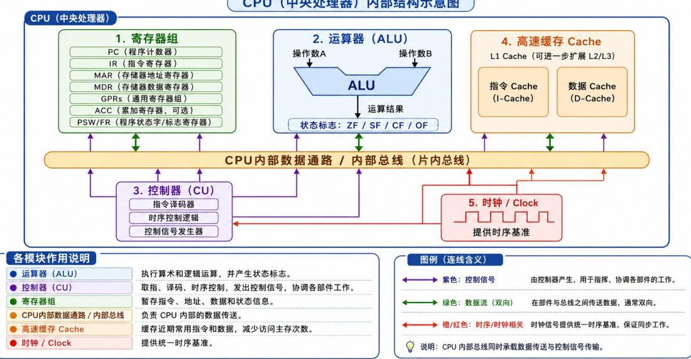
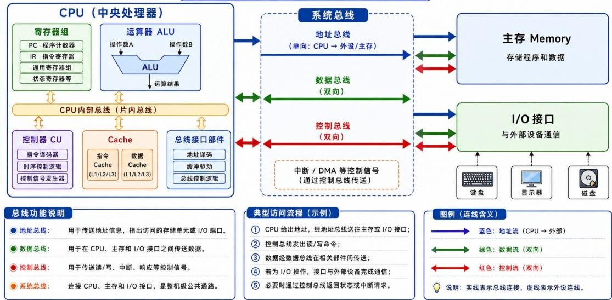

# 第六章 总线.docx — 图像索引

> 由 MinerU 结构化结果生成。题目若依赖树形、拓扑、流程、曲线、区域、时序或其他空间关系，应核对这里的原图，不要只依据 OCR 文本推断。

## 图 1

原文页码：1；bbox：`[166, 282, 831, 527]`

**图注：** 图1 CPU内部总线与各功能部件连接
CPU（中央处理器）内部结构示意图 图2 系统总线与外部功能部件连接

## 图 2

原文页码：1；bbox：`[161, 576, 835, 810]`

## 图 3

原文页码：3；bbox：`[803, 621, 823, 636]`

## 图 4

原文页码：3；bbox：`[810, 142, 831, 158]`

## 图 5

原文页码：3；bbox：`[811, 332, 830, 348]`

## 图 6

原文页码：3；bbox：`[803, 436, 823, 451]`
