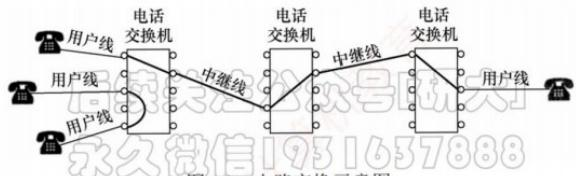
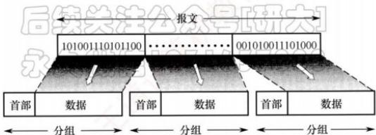
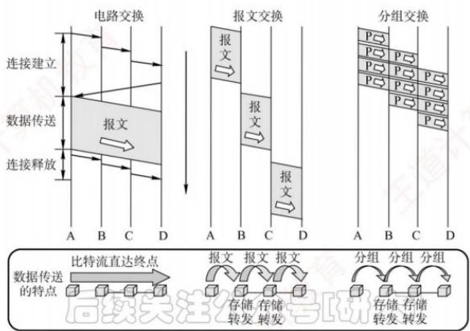
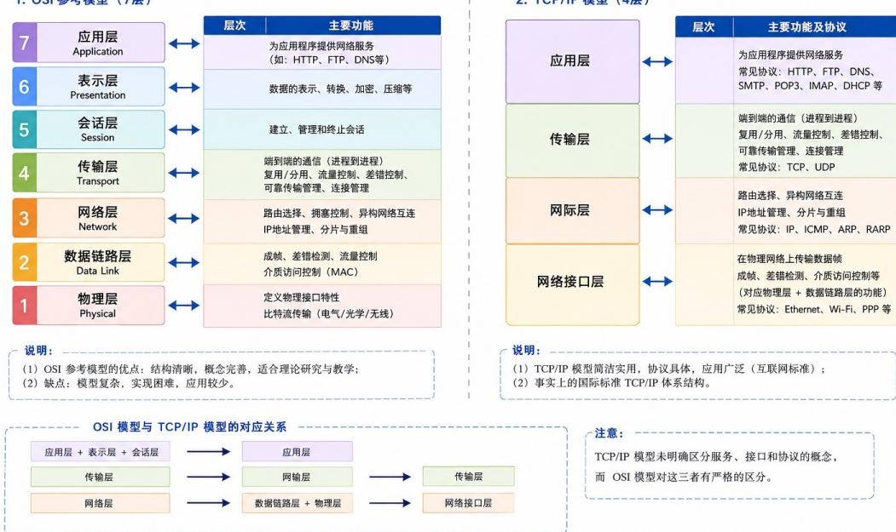
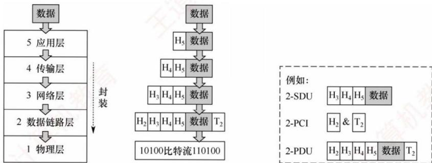
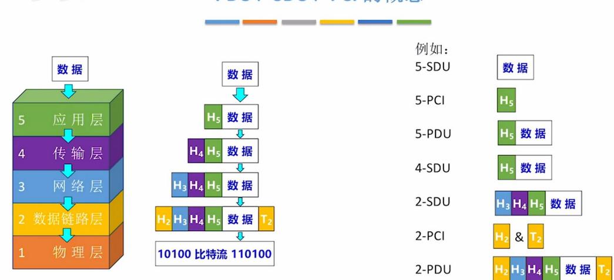
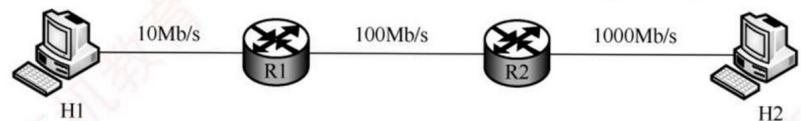
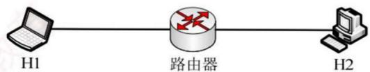
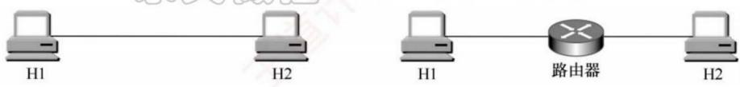

# 第一章 计算机网络体系结构.docx

# 第一章 计算机网络体系结构

## 知识点：

## 电路交换、报文交换、分组交换：

## 概念：

## 1.1.4 电路交换、报文交换与分组交换

在网络核心部分起关键作用的是路由器（Router），其通过对接收到的分组进行存储转发来实现分组交换。要理解分组交换的原理，需先了解电路交换和报文交换的基本概念。

1. 电路交换

## 考点追踪 ▶ 电路交换的时延分析（2025）

最典型的电路交换网络是传统电话网。从通信资源分配的角度看，交换是指按照某种方式动态分配传输线路资源。电路交换分为三个阶段：建立连接（占用通信资源）、传输数据（持续占用通信资源）和释放连接（归还通信资源）。在数据传输前，通信双方必须先建立一条专用的端到端物理通路，该通路由沿途的交换设备和链路逐段连接而成。在通信过程中，这条通路始终被双方独占，直至通信结束才释放。图1.2是电路交换的示意图。

  
图 1.2 电路交换示意图

电路建立后，除源节点和目的节点外，中间节点仅提供端到端物理通路，比特流连续地从源端直达目的端，如同通过管道传输。因此，电路交换适用于低频次、连续且大量的数据传输。

电路交换技术的优点：

1）通信时延小。通信线路为双方专用，数据直达，传输效率高。

2）有序传输。数据按发送顺序传送，不存在失序问题。

3）没有冲突。不同通信对使用独立信道，不会争用物理信道。

4）实时性强。物理通路一旦建立，双方即可随时通信。

电路交换技术的缺点：

1）建立连接时间长。平均建立连接的时间对计算机通信而言过长。

2）线路利用率低。物理通路被通信双方独占，即使空闲也无法供其他用户使用。

3）灵活性差。通路中任一节点或链路发生故障，都需重新建立新连接。

4）难以实现差错控制。中间节点不具备存储和检错能力，无法发现或纠正传输错误。

由于计算机之间的通信通常是突发式（高频、少量）的，若采用电路交换，已被占用的通信线路在大部分时间内处于空闲状态，其利用率往往不足10%，甚至低于1%。

## 2. 报文交换

考点追踪 ▶ 报文交换的时延分析（2013、2025）

用户数据附加源地址、目的地址等控制信息后，被封装成报文（Message）。报文交换采用存储转发技术：整个报文先传送到相邻节点，被完整接收并存储后，节点根据转发表将其转发至下一跳，如此逐跳转发，直至到达目的端。每个报文可独立选择通往目的端的路径。


报文交换技术的优点：

1）无建立和释放连接的时延。通信前无须建立连接，用户可随时发送报文。

2）线路分配灵活。交换节点在存储完整报文后，可选择当前最优空闲链路进行转发；若某条路径发生故障，该节点可动态切换至其他路径。

3）线路利用率高。报文仅在一段链路上传输时才占用这段链路的资源。

4）支持差错控制。交换节点可对缓存中的报文进行差错检验。

报文交换技术的缺点：

1）存储转发时延高。节点必须完整接收整个报文后，才能开始转发。

2）缓存开销大。由于报文大小没有限制，这就要求交换节点配备大容量缓存。

3）错误处理低效。报文越长，出错概率相对更大，重传整个报文的代价较大。

## 3. 分组交换

考点追踪 ➤ 分组交换的时延分析（2010、2013、2023、2025）

分组交换同样采用存储转发技术，但有效解决了报文交换中因报文过长带来的问题。报文过长时，不仅对交换节点的缓存容量要求较高，差错处理的效率也会降低。源主机在发送前，先将较长的报文划分为若干较小的等长数据段，并在每个数据段前面添加由必要控制信息（如源地址、目的地址、分组编号等）组成的首部，构成分组（Packet），如图1.3所示。

  
图1.3 构成分组的过程

源主机将分组发送到分组交换网，网络中的分组交换机（如路由器）收到一个分组后，先将其缓存，然后从首部提取目的地址，据此查找转发表，并将分组转发给下一个分组交换机。经过多个分组交换机的存储转发，分组最终到达目的主机。

分组交换不仅继承了报文交换的诸多优点，还具有以下优势：

1）便于存储管理，转发开销小。由于分组长度固定，缓冲区大小可预设，管理更高效。

2）传输效率高。分组可逐个发送，实现流水线操作，即后一个分组的接收可与前一个分组的转发并行，从而减少整体传输时间。

3）降低出错概率与重传代价。由于分组较短，出错概率也必然减小，重传数据量大幅减少，既提高了可靠性，又降低了传输时延。

分组交换技术的缺点：

1）存在存储转发时延。尽管比报文交换的传输时延小，但相比于电路交换仍存在存储转发时延，且要求节点交换机具备更强的处理能力。

2）需要传输额外的信息量。每个数据段都需附加控制信息以构成分组，使得传送的信息量增大约5%～10%，从而增加了控制复杂度，降低了通信效率。

3）分组可能失序、丢失或重复。当采用数据报服务 $^{①}$ 时，分组可能经不同路径到达，需在目的主机按编号重排序，处理较为复杂。若采用虚电路服务，虽可避免失序，但需经历建立连接、数据传输和释放连接三个阶段。

图 1.4 给出了三种交换方式的比较。当需连续传输大量数据，并且传输时间远大于连接建立时间时，采用电路交换更为合适。但从提升网络整体信道利用率角度看，报文交换和分组交换优于电路交换。其中，分组交换时延更小、更灵活，尤其适合突发式数据通信。

  
图1.4 三种交换方式的比较

本书配套视频对三种交换方式的性能进行了详尽分析，其中分组交换网的性能分析是统考高频考点，强烈建议结合视频学习。表 1.1 总结了三种交换方式的特性对比。

表 1.1 三种交换方式的特性对比

<table><tr><td>特性</td><td>电路交换</td><td>报文交换</td><td>分组交换</td></tr><tr><td>完成传输所需的时间</td><td>最少</td><td>最多</td><td>较少</td></tr><tr><td>存储转发时延</td><td>无</td><td>高</td><td>较低</td></tr><tr><td>通信前是否需要建立连接?</td><td>是</td><td>否</td><td>否</td></tr><tr><td>节点的缓存开销</td><td>无</td><td>高</td><td>低</td></tr><tr><td>是否支持差错控制?</td><td>不支持</td><td>支持</td><td>支持</td></tr><tr><td>数据是否有序到达?</td><td>是</td><td>是</td><td>否</td></tr><tr><td>是否需要额外的控制信息?</td><td>否</td><td>是</td><td>是(且占比较大)</td></tr><tr><td>线路分配的灵活性</td><td>不灵活</td><td>灵活</td><td>非常灵活</td></tr><tr><td>线路利用率</td><td>低</td><td>高</td><td>非常高</td></tr></table>

## 计算：

## 九、三种交换方式的计算模型

设：

\- 数据总长度为 $M$ bit;

\- 链路速率均为 $R$ bit/s;

\- 经过 $k$ 段链路；

\- 忽略传播、处理和排队时延。

## 1. 电路交换

设建立连接时间为 $t_s$ ，则：

$$
T _ {\mathrm{电路}} = t _ {s} + \frac {M}{R}
$$

这里不是 $kM / R$ ，因为电路建立后，比特流可以连续通过各段链路。

## 2. 报文交换

每个中间节点必须完整接收整个报文后才能转发：

$$
T _ {\mathrm{报文}} = k \frac {M}{R}
$$

## 3. 分组交换

设每个分组总长度为 $L$ ，共有 $N$ 个分组，则流水线总时间为：

$$
T _ {\text {分组}} = (k + N - 1) \frac {L}{R}
$$

理解方式：

\- 第一个分组经过 $k$ 段链路，需要 $kL / R$ ;

\- 后续每个分组只需再等待一个分组发送时间 $L / R$ ;

\- 后面还有 $N - 1$ 个分组。

所以：

$$
T = k \frac {L}{R} + (N - 1) \frac {L}{R}
$$

## 统一模型：

## 一、先建立统一模型

设：

\- 文件大小: $F$ bit

\- 一共经过 $k$ 段链路

\- 各段链路速率：

$$
R _ {1}, R _ {2}, \dots , R _ {k}
$$

\- 分组长度： $L$ bit

\- 分组数量：

$$
N = \frac {F}{L}
$$

若不能整除，则通常：

$$
N = \left\lceil {\frac {F}{\mathrm{每个分组的有效数据长度}}} \right\rceil
$$

每个分组在第 $i$ 段链路上的发送时延为：

$$
t _ {i} = \frac {L}{R _ {i}}
$$

注意：

$$
R _ {i} \text {越小} \quad \Longrightarrow \quad t _ {i} \text {越大}
$$

所以：

$$
\max (t _ {1}, t _ {2}, \dots , t _ {k}) = \frac {L}{\min (R _ {1} , R _ {2} , \dots , R _ {k})}
$$

这就是瓶颈链路发送一个分组所需的时间。

## 二、三种交换方式的通用模型

## 1. 电路交换：整条电路像一根管道

电路交换过程：

$$
\mathrm{建立连接} \rightarrow \mathrm{连续发送比特流} \rightarrow \mathrm{释放连接}
$$

建立电路后，中间节点不需要完整接收文件再转发。因此不能把文件在每段链路上的发送时间全部相加。

若题目直接给出电路带宽 $R_{C}$

$$
\boxed {T _ {C S} = T _ {\text {建立}} + \frac {F}{R _ {C}}}
$$

若题目只给出各段链路速率，没有单独说明电路带宽，通常端到端传输能力受最慢链路限制：

$$
R _ {C} = \min (R _ {1}, R _ {2}, \dots , R _ {k})
$$

所以：

$$
\boxed {T _ {C S} = T _ {\mathrm{建立}} + \frac {F}{\min R _ {i}}}
$$

## 为什么不是 $\sum F / R_{i}$

因为电路交换中：

\- 第一个比特进入第一段链路后，可以继续向后传播；

\- 不需要等整个文件到达某个中间节点；

\- 三段链路是在同时传送同一条比特流。

因此它不是“第一段传完文件，再传第二段”。

## 2. 报文交换：整个文件必须逐跳完整接收

报文交换把整个文件看成一个大报文。

在每个路由器处：

完整接收整个报文 $\rightarrow$ 再向下一跳发送

因此每段链路的发送时间必须依次经历：

$$
\boxed {T _ {M S} = \frac {F}{R _ {1}} + \frac {F}{R _ {2}} + \dots + \frac {F}{R _ {k}}}
$$

即：

$$
\left| T _ {M S} = \sum_ {i = 1} ^ {k} \frac {F}{R _ {i}} \right|
$$

这个公式无论链路速率是否相同，都成立。

关键词

看到：

\- 报文交换

\- 整个报文存储转发

\- 完整接收后转发

就直接想到：

整个文件在每段链路上的发送时延相加

## 3. 分组交换：第一个分组逐跳，后续分组流水

分组交换仍然是存储转发，但存储转发的单位变成了一个分组。

因此需要拆成两部分。

## 第一部分：第一个分组到达终点

第一个分组必须依次经过全部 $k$ 段链路：

$$
T _ {\text {首分组}} = t _ {1} + t _ {2} + \dots + t _ {k}
$$

即：

$$
T _ {\text {首分组}} = \sum_ {i = 1} ^ {k} \frac {L}{R _ {i}}
$$

第二部分：其余 $N - 1$ 个分组

流水线稳定后，分组离开系统的速度由最慢链路决定。

相邻两个分组最终到达终点的最小时间间隔为：

$$
t _ {\text {瓶颈}} = \max (t _ {1}, t _ {2}, \dots , t _ {k})
$$

所以其余 $N - 1$ 个分组需要：

$$
(N - 1) t _ {\mathrm{瓶颈}}
$$

最终得到最重要的通用公式：

$$
\boxed {T _ {P S} = \sum_ {i = 1} ^ {k} \frac {L}{R _ {i}} + (N - 1) \max _ {i} \left(\frac {L}{R _ {i}}\right)}
$$

这就是你以后遇到不同链路速率时使用的公式。

## 九、公式失效时，用“时间递推法”

当题目出现以下情况时，不要硬套简单公式：

\- 分组长度不相等

\- 最后一个分组明显较短

\- 路由器处理能力有限

\- 单个分组有处理时延

\- 多个分组竞争同一个路由器

\- 各阶段不能完全并行

\- 存在排队或链路共享

这时用最稳的方法：

设 $C_{j,i}$ 表示第 $j$ 个分组完成第 $i$ 段链路传输的时刻，则：

$$
\boxed {C _ {j, i} = \max (C _ {j, i - 1}, C _ {j - 1, i}) + \frac {L _ {j}}{R _ {i}}}
$$

含义是：第 $j$ 个分组要进入第 $i$ 段链路，必须同时满足：

1. 它已经完成上一段链路；

2. 当前链路已经传完前一个分组。

所以取两者较晚的时刻：

$$
\max (C _ {j, i - 1}, C _ {j - 1, i})
$$

再加上本次发送时延。

这实际上就是你画时间线时所遵循的规则。任何复杂的流水线题，最终都能回到这个递推关系。

https://chatgpt.com/g/g-p-6a4147af33c481918ab3d6fcd9fe5028-ji-wang/c/6a705ba6-e2cc-83ee-9d0d-0fbeff44e556

## 计算机网络的性能指标：

## 1. 速率

速率是节点在数字信道上传送数据的速率，又称：

\- 数据传输速率；

\- 数据率；

\- 比特率。

单位：

bit/s

也写成：

• b/s;

\- bps。

常用换算：

$$
1 \mathrm{kb/s} = 1 0 ^ {3} \mathrm{bit/s}
$$

$$
1 \mathrm{Mb/s} = 1 0 ^ {6} \mathrm{bit/s}
$$

$$
1 \mathrm{Gb/s} = 1 0 ^ {9} \mathrm{bit/s}
$$

注意：

$$
1 \mathrm{B} = 8 \mathrm{bit}
$$

所以1000B的数据等于：

$$
1 0 0 0 \times 8 = 8 0 0 0 \mathrm{bit}
$$

## 2. 数据量和速率中的单位区别

按王道的考试口径：

\- 描述数据量时，K、M、G常按2的幂；

\- 描述速率时，k、M、G常按10的幂。

例如：

$$
1 \mathrm{KB} = 2 ^ {1 0} \mathrm{B} = 1 0 2 4 \mathrm{B}
$$

但：

$$
1 \mathrm{Mb/s} = 1 0 ^ {6} \mathrm{bit/s}
$$

具体题目若明确给出换算关系，应以题目为准。

□

## 3. 带宽

在通信领域，带宽原本表示信号的频率范围，单位为 $\mathrm{Hz}$ 。

但在计算机网络中，带宽通常表示：

一条数字信道所能支持的最高数据传输速率。

单位为：

$$
\mathrm{bit/s}
$$

## 瓶颈原则

端到端最大传输速率取决于整个路径中速率最低的部分。

例如：

发送端网卡：1Gb/s中间链路： $100\mathrm{Mb / s}$ 接收端网卡： $10\mathrm{Mb / s}$

最高理论速率是：

$$
\min (1 \mathrm{Gb/s}, 1 0 0 \mathrm{Mb/s}, 1 0 \mathrm{Mb/s}) = 1 0 \mathrm{Mb/s}
$$

## 4. 吞吐量

吞吐量是：

单位时间内实际通过某网络、信道或接口的数据量。

区别如下：

概念

带宽

吞吐量

例如，一条带宽为 100 Mb/s 的链路，实际吞吐量可能只有 60 Mb/s。

因此通常有：

$$
\mathrm{吞吐量} \leq \mathrm{带宽}
$$

## 十二、时延

总时延由四部分组成：

$$
\text {总时延} = \text {发送时延} + \text {传播时延} + \text {处理时延} + \text {排队时延}
$$

## 1. 发送时延

发送时延也称传输时延，是将一个分组的所有比特推入链路所需的时间。

$$
\text {发送时延} = \frac {\text {分组长度}}{\text {发送速率}}
$$

例如，一个1000B的分组在 $100\mathrm{Mb / s}$ 链路上传输：

$$
t _ {t} = \frac {1 0 0 0 \times 8}{1 0 0 \times 1 0 ^ {6}} = 8 \times 1 0 ^ {- 5} \mathrm{s} = 0. 0 8 \mathrm{ms}
$$

## 2. 传播时延

传播时延是一个比特在链路中从一端传播到另一端所需的时间。

$$
\text {传播时延} = \frac {\text {链路长度}}{\text {信号传播速率}}
$$

例如：

\- 链路长度 $200 \mathrm{~km}$ ;

\- 信号传播速率 $2 \times 10^{8} \mathrm{~m} / \mathrm{s}$ 。

则：

$$
t _ {p} = \frac {2 0 0 \times 1 0 ^ {3}}{2 \times 1 0 ^ {8}} = 1 0 ^ {- 3} \mathrm{s} = 1 \mathrm{ms}
$$

## 3. 发送时延和传播时延的区别

这是第一章最常见的陷阱。

<table><tr><td>对比项</td><td>发送时延</td><td>传播时延</td></tr><tr><td>含义</td><td>把所有比特推入链路所需时间</td><td>一个比特在介质中传播所需时间</td></tr><tr><td>决定因素</td><td>数据长度、发送速率</td><td>链路距离、传播速度</td></tr><tr><td>与链路长度有关吗</td><td>无关</td><td>有关</td></tr><tr><td>与分组长度有关吗</td><td>有关</td><td>无关</td></tr></table>

记忆：

发送时延看“包有多大、口有多快”；传播时延看“路有多长、跑得多快”。

## 4. 处理时延

交换节点处理分组所需的时间，例如：

\- 检查首部;

\- 差错检测；

\- 查询路由表;

\- 决定输出端口。

## 5. 排队时延

分组在路由器输入队列或输出队列中等待的时间。

它与网络负载关系很大：

\- 网络空闲时，排队时延可能接近0；

\- 网络拥塞时，排队时延可能很大。

一般考试中，如果题目没有特别说明，通常忽略处理时延和排队时延。 2027计算机网络\_OCR

## 十三、时延带宽积

公式：

时延带宽积 $=$ 传播时延 $\times$ 信道带宽

单位是bit。

它表示：

链路中最多可以同时存在多少个正在传播、尚未到达接收端的比特。

可以把链路想象成一根水管：

\- 传播时延决定水管长度；

\- 带宽决定水管粗细；

\- 时延带宽积决定水管中能容纳多少“比特”。

## 十四、往返时延RTT

RTT的英文全称是：

Round-Trip Time，往返时延。

表示从发送端发出一个短分组，到收到接收端返回的确认所经历的时间。

按本书的定义，RTT主要包括：

\- 往返传播时延；

\- 接收端处理时延；

\- 中间节点处理和排队时延。

王道特别强调：

RTT不包括数据分组本身的发送时延。

做题时应按题目给出的定义和时间图判断，不要机械套公式。

## 十五、信道利用率

公式：

信道利用率 $= \frac{\text{有数据通过的时间}}{\text{有数据通过的时间} + \text{无数据通过的时间}}$

信道利用率越高，说明链路空闲时间越少。

但它不是越高越好：

\- 太低：浪费资源；

\- 太高：排队时延增加，可能出现网络拥塞。

可以类比公路：

公路完全没有车，资源被浪费；公路车辆过多，又会堵车。

## 计算机网络体系结构与参考模型：

## 1.2.3 计算机网络分层结构（★★★）

计算机网络是一个非常复杂的系统，分层可以将庞大而复杂的问题转换为若干较的局部问题，而这些局部问题更易于研究和处理。目前，计算机网络体系结构采用最为广泛的有两种：OSI参考模型和TCP/IP模型。

1. OSI 参考模型（7层）  
2. TCP/IP 模型（4层）  


## 计算机网络的分层结构：

## 考点追踪 ▶ 网络体系结构的概念（2010）

计算机网络的各层及其协议的集合称为网络的体系结构（Architecture）。换言之，计算机网络的体系结构是对该网络及其所应完成功能的精确定义。需要强调的是，这些功能究竟由何种硬件或软件实现，属于实现（Implementation）问题。体系结构是抽象的，而实现是具体的，体现在实际运行的计算机硬件和软件中。计算机网络体系结构通常具有可分层的特性，能将复杂的大系统分解为若干较易实现的层次。

分层的基本原则如下：

1）每层实现一种相对独立的功能，以降低整个系统的复杂度。

2）各层之间的接口清晰、简洁，相互依赖尽可能少，便于理解与维护。

3）各层功能的定义独立于具体实现方法，可采用最合适的技术来实现。

4）保持下层对上层的独立性，上层单向使用下层提供的服务。

5）整个分层结构应有利于标准化工作。

在网络分层结构中，第 n 层的活动元素通常称为第 n 层实体。具体而言，实体指任何可发送或接收信息的硬件或软件进程，通常是某个特定的软件模块。不同机器上的同一层称为对等层，同一层的实体互为对等实体。第 n 层向第 $n+1$ 层提供的服务，实际上是其自身及以下所有层所提供服务的总和。第 n 层的实体称为服务提供者，第 $n+1$ 层的实体称为服务用户。

\- 协议数据单元（PDU）：对等层之间传送的数据单位。第 n 层的 PDU 记为 n-PDU。各层的 PDU 均由服务数据单元和协议控制信息两部分组成。

\- 服务数据单元（SDU）：相邻层之间交换的数据单位。第 $n$ 层的SDU记为 $n$ -SDU。

\- 协议控制信息（PCI）：用于控制协议操作的信息。第 $n$ 层的PCI记为 $n$ -PCI。

每层的 PDU 都有其通俗的名称：物理层的 PDU 称为比特流，数据链路层的 PDU 称为帧。

网络层的 PDU 称为 IP 分组，传输层的 PDU 称为 TCP 报文段或 UDP 数据报。

当数据在各层之间传递时，将从第 $n+1$ 层接收到的 PDU 作为第 n 层的 SDU，加上第 n 层的 PCI 后封装成第 n 层的 PDU，再交由第 n-1 层作为其 SDU 发送。接收方收到后做相反的处理。

因此，三者的关系可表示为 $n-SDU + n-PCI = n-PDU = (n - 1)-SDU$ ，如图 1.10 所示。

PDU、SDU、PCI的概念  
  
图 1.10 网络各层数据单元之间的关系

具体而言，分层结构的含义包括以下几个方面：

1）第 n 层的实体不仅要利用第 n-1 层的服务来实现自身功能，还向第 $n+1$ 层提供本层的服务，该服务是第 n 层及其下面各层所提供服务的总和。

2）最低层只提供服务，是整个层次结构的基础；最高层面向用户提供服务。

3）上层只能通过相邻层的接口使用下层的服务，不能跨层调用。

4）通信时，对等层在逻辑上如同存在一条直接信道，表现为能够直接交换信息。

  
➢ 协议数据单元（PDU）：对等层次之间传送的数据单位。第 n 层的 PDU 记为 n-PDU

➢ 协议控制信息（PCI）：控制协议操作的信息。第 n 层的 PCI 记为 n-PCI。

服务数据单元（SDU）：为完成上一层实体所要求的功能而传送的数据。第 n 层的 SDU 记为 n-SDU。

## 1. SDU：服务数据单元

Service Data Unit，服务数据单元

含义：

相邻层之间传递的数据。

具体来说：

上一层交给本层处理的数据，就是本层的SDU。

例如，上层把一段数据交给第n层：

```txt
第n+1层
|
| 把数据交给第n层
↓
第n层收到的这部分数据 = n-SDU
```

因此：

n-SDU是第n层眼中的“原始数据”。

## 2. PCI：协议控制信息

Protocol Control Information，协议控制信息

含义：

第n层为了完成本层协议功能，而添加的控制信息。

通常表现为:

\- 首部;

\- 有时还包括尾部。

例如：

\- TCP首部中有端口号、序号、确认号；

\- IP首部中有源IP地址、目的IP地址；

\- 以太网帧首部中有源MAC地址、目的MAC地址；

\- 以太网帧尾部中有用于检错的FCS。

因此：

```txt
PCI不是用户真正想发送的内容  
PCI是网络协议为了控制传输而添加的信息
```

## 3. PDU：协议数据单元

Protocol Data Unit，协议数据单元

含义：

对等层之间在逻辑上交换的数据单位。

第n层收到上层数据后，加上本层控制信息：

```txt
n-SDU + n-PCI = n-PDU
```

也就是说：

<div class="mineru-algorithm" style="white-space: pre-wrap; font-family:monospace;">
$\mathrm{PDU} =$ 数据部分 $+$ 本层控制信息。
</div>

## 七、公式到底是什么意思

教材给出的公式是：

$$
n \text {-SDU} + n \text {-PCI} = n \text {-PDU} = (n - 1) \text {-SDU}
$$

分成两部分理解。

第一部分

$$
n \text {-SDU} + n \text {-PCI} = n \text {-PDU}
$$

第n层收到上层的数据，即n-SDU，再加上第n层自己的控制信息n-PCI，就形成n-PDU。

例如网络层：

```txt
网络层收到的上层数据
+
IP首部
=
IP分组
```

## 第二部分

$$
n \text {-PDU} = (n - 1) \text {-SDU}
$$

第n层把自己的PDU交给下一层后，下一层不会关心里面具体有什么。

它只会把整个n-PDU看成自己的“待处理数据”。

所以：

```txt
第n层产生的PDU
↓交给下一层
变成第n-1层的SDU
```

这就是：

$$
n \text {-PDU} = (n - 1) \text {-SDU}
$$

https://chatgpt.com/g/g-p-6a4147af33c481918ab3d6fcd9fe5028/c/6a71b740-0980-83e8-b7c8-01681946d791

## OSI:

https://chatgpt.com/g/g-p-6a4147af33c481918ab3d6fcd9fe5028-ji-wang/c/6a7730aa-e4fc-83ee-b187-9c47a8f2573a

<table><tr><td>1</td><td>层次</td><td>名称</td><td>核心功能(一句话)</td><td>主要功能</td><td>数据单位</td><td>地址</td></tr><tr><td>2</td><td>7</td><td>应用层Application Layer</td><td>为用户应用提供网络服务</td><td>文件传输、电子邮件、Web访问、远程登录等</td><td>报文/数据</td><td>—</td></tr><tr><td>3</td><td>6</td><td>表示层Presentation Layer</td><td>解决数据表示格式不同的问题</td><td>编码转换、数据压缩、加密/解密</td><td>数据</td><td>—</td></tr><tr><td>4</td><td>5</td><td>会话层 Session Layer</td><td>管理两个应用之间的会话</td><td>建立、管理、终止会话;同步;检查点</td><td>数据</td><td>—</td></tr><tr><td>5</td><td>4</td><td>传输层Transport</td><td>实现进程之间的通信</td><td>可靠传输、流量控制、差错控制、复用分用</td><td>报文段Segment</td><td>端口号</td></tr></table>

点击图片可查看完整电子表格

## TCP/IP:

<table><tr><td>TCP/IP 层次</td><td>核心作用</td><td>主要解决的问题</td><td>典型协议/技术</td><td>关键地址</td><td>传输单位</td><td>典型设备/内容</td><td>对应 OSI</td></tr><tr><td>应用层</td><td>为用户应用提供网络服务</td><td>要使用什么网络服务?</td><td>HTTP、DNS、FTP、SMTP、POP3</td><td>域名等应用标识</td><td>报文 /Message</td><td>浏览器、Web服务器、DNS服务器等</td><td>应用层 + 表示层 + 会话层</td></tr><tr><td>传输层</td><td>实现端到端的进程间通信</td><td>数据交给哪个进程?怎样传?</td><td>TCP、UDP</td><td>端口号</td><td>TCP: 报文段;UDP: 用户数据报</td><td>TCP可靠传输、流量控制、拥塞控制等</td><td>传输层</td></tr><tr><td>网际层</td><td>实现不同网络之间的互联与分组转发</td><td>数据要送到哪台主机?走哪条路?</td><td>IP、ICMP等</td><td>IP地址</td><td>IP数据报 / 分组</td><td>路由选择、分组转发、路由器</td><td>网络层</td></tr><tr><td>网络接口层</td><td>将数据通过具体网络和链路发送</td><td>这一跳具体怎么传?</td><td>Ethernet、IEEE 802.11、PPP等</td><td>MAC地址</td><td>帧 → 比特</td><td>交换机、网卡、传输介质等</td><td>数据链路层 + 物理层</td></tr></table>

## 硬件：

https://chatgpt.com/g/g-p-6a4147af33c481918ab3d6fcd9fe5028-ji-wang/c/6a77330f-39e4-83e8-8a3f-1defbb422707

## 一、先建立这张总表

<table><tr><td>OSI层</td><td>名称</td><td>典型“硬件/实现载体”</td><td>设备看什么</td></tr><tr><td>7</td><td>应用层</td><td>没有固定对应硬件;服务器、代理服务器等可能实现应用层功能</td><td>HTTP、DNS、FTP 等应用数据</td></tr><tr><td>6</td><td>表示层</td><td>一般由主机软件实现</td><td>数据格式、加密、压缩</td></tr><tr><td>5</td><td>会话层</td><td>一般由主机软件实现</td><td>会话建立、维持、同步</td></tr><tr><td>4</td><td>传输层</td><td>主要由主机操作系统协议栈实现</td><td>端口号、TCP/UDP</td></tr><tr><td>3</td><td>网络层</td><td>路由器、三层交换机</td><td>IP 地址</td></tr><tr><td>2</td><td>数据链路层</td><td>网桥、二层交换机;网卡也涉及本层</td><td>MAC 地址</td></tr><tr><td>1</td><td>物理层</td><td>中继器、集线器,以及传输介质</td><td>0/1 比特、信号</td></tr></table>

最核心的一条线就是：  
Hub $\rightarrow$ Switch $\rightarrow$ Router  
对应：  
物理层 $\rightarrow$ 数据链路层 $\rightarrow$ 网络层  
也就是： $1\to 2\to 3$

https://chatgpt.com/g/g-p-6a4147af33c481918ab3d6fcd9fe5028-ji-wang/c/6a773489-2b54-83ee-9296-3d08d9f53936

## URL:

## 英文缩写：

https://chatgpt.com/g/g-p-6a4147af33c481918ab3d6fcd9fe5028/c/6a7030f9-dfd8-83e8-9b8b-f5b4416db5e6

1.1:
https://chatgpt.com/g/g-p-6a4147af33c481918ab3d6fcd9fe5028-ji-wang/c/6a703871-34c8-83e8-b222-ffe3ea953694
https://chatgpt.com/g/g-p-6a4147af33c481918ab3d6fcd9fe5028-ji-wang/c/6a7030ad-4fdc-83e8-927b-5b8bd925146c?tab=sources

## 概念：

分布式处理和负载均衡：

## 核心区别一句话总结

\- 分布式处理：解决的是“单个任务太大，一台机器做不完”的问题——把一个大任务拆成多个小任务，交给多台机器协同完成。

\- 负载均衡：解决的是“同时来的任务太多，一台机器忙不过来”的问题——把大量的独立请求，分摊给多台机器并行处理，不让任何一台机器过载。

## 1. 分布式处理 (Distributed Processing)

\- 定义（来自PDF）：当网络中的某个计算机系统负荷过重时，可将其处理的某个复杂任务分配给网络中的其他计算机系统，利用空闲资源来提高整个系统的利用率。

\- 关键词：一个任务、多台机器协同、拆分。

\- 本质：“化整为零，协同作战”。一个大的计算任务（如天气预报模拟、大数据分析）被分解成多个子任务，分配到不同计算机上同时计算，最后汇总结果。

\- 举例：

搜索引擎收到一个查询请求后，需要从海量网页中检索。这个任务被拆分成多个子任务，分配给数千台服务器同时并行检索，最后汇总排名返回给用户。

\- Hadoop/Spark 集群处理一个TB级的日志文件分析。

## 2. 负载均衡 (Load Balancing)

\- 定义（PDF虽然没有直接定义，但1.1.3节“负载均衡”功能中提到）：将工作任务均衡地分配给网络中的各台计算机，避免某些计算机过载而其他计算机闲置。

\- 关键词：大量独立任务（请求）、分摊、不拆分。

\- 本质：“多来多往，各司其职”。当大量用户同时访问同一个网站时，负载均衡器将用户请求轮流或按策略分发到后端的多个Web服务器上。每个请求都是独立的，不需要多台服务器协同完成同一个请求。

\- 举例：

双十一购物节，亿万人同时点击“下单”。负载均衡器将每个“下单”请求分发到不同的应用服务器上处理，避免单台服务器崩溃。

\- Nginx 将流量分发到后端的多个Tomcat服务器。

## 对比表格

<table><tr><td>对比维度</td><td>分布式处理 (Distributed Processing)</td><td>负载均衡 (Load Balancing)</td></tr><tr><td>处理对象</td><td>同一个复杂任务(大任务)</td><td>多个独立任务/请求(大量小任务)</td></tr><tr><td>核心操作</td><td>拆分任务,多机协同完成</td><td>分发请求,多机并行独立完成</td></tr><tr><td>机器间关系</td><td>有依赖/协作关系(需汇总结果)</td><td>无依赖关系(各自独立处理)</td></tr><tr><td>典型场景</td><td>科学计算、大数据分析、渲染</td><td>Web服务器集群、应用服务器集群</td></tr><tr><td>侧重点</td><td>提升单任务的处理能力</td><td>提升系统整体的并发处理能力</td></tr></table>

## 交换机与路由器：

\- 交换机 (Switch): 工作在数据链路层（第2层），是个“小区物业”——只管同一个局域网（同一栋楼）内的通信，根据 MAC地址（门牌号）来分发信件。

\- 路由器 (Router)：工作在网络层（第3层），是个“城市邮局”——负责连接不同局域网（不同城市）之间的通信，根据IP地址（城市+街道）来选择最优路径（路由）。

<table><tr><td>对比维度</td><td>交换机 (Switch)</td><td>路由器 (Router)</td></tr><tr><td>工作层次</td><td>数据链路层(第2层)</td><td>网络层(第3层)</td></tr><tr><td>核心地址</td><td>MAC地址(物理地址),即网卡出厂时自带的“身份证号”</td><td>IP地址(逻辑地址),即网络管理员分配的“通信地址”</td></tr><tr><td>核心功能</td><td>在同一个网络内,基于MAC地址进行数据帧的存储与转发</td><td>连接不同网络,基于IP地址进行数据分组的路由选择与转发</td></tr><tr><td>能否隔离冲突域</td><td>能。每个端口就是一个独立的冲突域(PDF 第3.8.2节)</td><td>能。每个端口就是一个独立的冲突域</td></tr><tr><td>能否隔离广播域</td><td>不能。默认情况下,所有端口都在同一个广播域中(PDF第3.8.2节)</td><td>能。路由器不会转发广播帧,因此每个端口是一个独立的广播域(PDF第4.7.1节)</td></tr></table>

小提示：PDF上册第1章（1.2.3节）明确指出，路由器是网络层设备，交换机是数据链路层设备。集线器是物理层设备，只负责放大信号，什么都不隔离。

## 数据报：

数据报（Datagram）就是分组交换网络中以“无连接”方式独立传输的、自带完整目的地址的数据单元。

更通俗地说：数据报 = 一封“自带详细地址、独立投递”的信件。

## 数据报的核心特点（结合PDF）

根据PDF第4.1.3节的内容，数据报服务具有以下4个关键特点：

<table><tr><td>特点</td><td>解释</td></tr><tr><td>1. 无连接</td><td>发送前不需要先建立连接。想发就发,就像寄明信片不需要提前打招呼。</td></tr><tr><td>2. 独立选路</td><td>每个数据报独立选择路径。同一批数据可能走不同路线,到达顺序可能与发送顺序不同。</td></tr><tr><td>3. 携带完整地址</td><td>每个数据报的首部都包含完整的源IP地址和目的IP地址,就像每张明信片都写完整地址。</td></tr><tr><td>4. 尽最大努力交付</td><td>网络不保证可靠传输。数据报可能丢失、重复、失序或出错。如果应用需要可靠性,必须由上层协议(如TCP)来保证。</td></tr></table>

节点、MAC、端、主机：

☐ ☐

这个问题问得非常关键，很多人都会混淆“节点”和“主机”，甚至把它们当成同义词。但严格来说，它们在计算机网络中是完全不同的概念。

## 一句话核心区别

主机（Host）是节点（Node）的一种，但节点不一定是主机。

\- 主机 = 网络中运行应用程序、为“人”提供服务的设备（如电脑、手机、服务器）。

\- 节点 = 网络中任何有IP地址的设备，包括主机，也包括只为"转发数据"而存在的中间设备（如路由器、交换机）。

在计算机网络中，“端”（End）指的是“端系统”（End System）中的“应用进程”，也就是运行在主机上的某个具体的应用程序实例（比如你电脑上的一个浏览器标签页、一个微信聊天窗口、一个Outlook邮件客户端）。

更准确地说：端到端通信 = 进程到进程（Process-to-Process）的通信。

三个层次对比：节点 $\rightarrow$ 主机 $\rightarrow$ 进程

<table><tr><td>层次</td><td>通信类型</td><td>地址类型</td><td>负责的层</td><td>比喻</td></tr><tr><td>节点到节点</td><td>相邻设备之间</td><td>MAC地址</td><td>数据链路层</td><td>快递员在小区里根据门牌号送信</td></tr><tr><td>主机到主机</td><td>跨网络设备之间</td><td>IP地址</td><td>网络层</td><td>邮局根据城市地址把信送到目标大楼</td></tr><tr><td>进程到进程(端到端)</td><td>具体应用程序之间</td><td>端口号</td><td>传输层</td><td>信被送到大楼后,前台根据房间号分发给具体的人</td></tr></table>

“端”的本质，就是通过“IP地址 + 端口号”来唯一标识的一个通信进程。

## 1. 什么是“节点”？

一句话定义：节点（Node）就是网络中任何一个“有身份”的设备。

根据PDF上册第1章（1.1.1节）的定义，网络由节点和连接这些节点的链路组成。

## 节点可以是：

\- 主机：你的电脑、手机、服务器。

\- 网络设备：集线器、交换机、路由器。

\- 其他智能设备：网络打印机、智能摄像头、物联网传感器。

关键点：只要是连接到网络中，并且能够发送、接收或转发数据的设备，都可以称为节点。节点是网络的基本组成部分。

## 2. 什么是“MAC地址”？

一句话定义：MAC地址（Media Access Control Address）是网络设备在出厂时，由厂商烧录在网卡上的一个“全球唯一”的物理地址。

根据PDF上册第3章（3.6.2节）的讲解：

\- 长度：48位（6个字节），通常用12个十六进制数表示，如 00-1A-2B-3C-4D-5E。

\- 结构：前24位是厂商代码（由IEEE分配），后24位是厂商自行分配的序列号。这保证了全球每个网卡的MAC地址都是唯一的。

\- 存储位置：固化在网络适配器（网卡）的ROM中，不会改变。

\- 性质：它是物理地址，属于数据链路层的地址，只具有本地意义——只在同一个局域网内有效。

注意：PDF特别强调，MAC地址是平面式地址，没有层次结构，不能用于跨网络寻址。这就像每个人的身份证号是唯一的，但你不能用身份证号来判断这个人住在哪个城市。

## 题：

## 题1:

07. 下列说法中，（）是数据报方式的特点。

A. 同一报文的不同分组可以经过不同的传输路径通过通信子网  
B. 同一报文的不同分组到达目的节点时顺序是确定的  
C. 适合于短报文的通信  
D. 同一报文的不同分组在路由选择时只需要进行一次

07. A

数据报方式是一种无连接的分组交换技术，它先将报文拆分成若干较小的数据段，加上地址等控制信息后构成分组，这样做虽然会增加一些控制开销，但并不意味着数据报方式只适合于短报文的通信。数据报方式尽最大努力交付，不保证可靠性，分组可能出错或丢失，网络为每个分组独立地选择路由，转发的路径可能不同，因此分组不一定按序到达目的节点。

## 题 2:

17. 【2025 统考真题】某网络拓扑及各链路带宽如下图所示。网络按电路交换方式运行时，主机 H1 与 H2 建立一条带宽为 10Mb/s 的电路，建立电路时间为 32μs；按分组交换方式运行时，分组长度为 400B，忽略分组首部开销。现 H1 向 H2 发送一个 2MB（1M = 10 $^{6}$ ）的文件，分别采用电路交换、报文交换、分组交换方式时，H2 至少需要 $T_{CS}$ 、 $T_{MS}$ 、 $T_{PS}$ 时间才能接收到全部文件内容，则 $T_{CS}$ 、 $T_{MS}$ 、 $T_{PS}$ 满足的关系是（）。



A. $T_{\mathrm{CS}} > T_{\mathrm{MS}} > T_{\mathrm{PS}}$ B. $T_{\mathrm{MS}} > T_{\mathrm{PS}} > T_{\mathrm{CS}}$ C. $T_{\mathrm{MS}} > T_{\mathrm{CS}} > T_{\mathrm{PS}}$ D. $T_{\mathrm{PS}} > T_{\mathrm{MS}} > T_{\mathrm{CS}}$

## 17. B

采用电路交换时， $T_{CS} =$ 电路建立时间 $32\mu s +$ 文件传输时间 $2MB \div 10Mb/s = 32\mu s + 1.6s$ 。采用报文交换时，整个报文需要逐跳存储转发， $T_{MS} = 2MB \div 10Mb/s + 2MB \div 100Mb/s + 2MB \div 1000Mb/s = 1.776s$ 。采用分组交换时，分组数为 $2MB/400B = 5000$ ，第一个分组从 H1 到 H2 的传输时延 = $400B \div 10Mb/s + 400B \div 100Mb/s + 400B \div 1000Mb/s = 355.2\mu s$ ；之后，每 $320\mu s$ 到达一个分组，故 $T_{PS} = 355.2\mu s + 320 \times 4999\mu s = 1.6s + 35.2\mu s$ 。因此 $T_{MS} > T_{PS} > T_{CS}$ 。

## 1. 电路交换 $T_{CS}$ 的问题

你写成了：

$$
3 2 \mu s + \frac {2 \times 1 0 ^ {6} \times 8}{1 0 \times 1 0 ^ {6}} + \frac {2 \times 1 0 ^ {6} \times 8}{1 0 0 \times 1 0 ^ {6}} + \frac {2 \times 1 0 ^ {6} \times 8}{1 0 0 0 \times 1 0 ^ {6}}
$$

这相当于认为：整个文件必须先完整通过第一段链路，再完整通过第二段、第三段。

但这其实是报文交换的存储转发过程。

电路交换建立连接后，中间节点不需要完整接收文件再转发，比特流沿端到端电路连续传输。题目已经说明建立的是一条带宽为 10 Mb/s 的电路，因此只看端到端电路带宽：

$$
\begin{array}{r l} & T _ {C S} = T _ {\text {建立}} + \frac {\text {文件长度}}{\text {电路带宽}} \\ & = 3 2 \times 1 0 ^ {- 6} + \frac {2 \times 1 0 ^ {6} \times 8}{1 0 \times 1 0 ^ {6}} \\ & \boxed {T _ {C S} = 1. 6 0 0 0 3 2 \mathrm{s}} \end{array}
$$

你算出的约 1.776 s，实际上接近报文交换时间，因为你把整个文件在三段链路上的发送时延全部相加了。电路交换没有存储转发时延，而分组交换可以通过流水线降低总时延。2027计算机网络\_OCR

## 2. 分组交换 $T_{PS}$ 的问题

分组数量为：

$$
N = \frac {2 \times 1 0 ^ {6}}{4 0 0} = 5 0 0 0
$$

每个分组在三段链路上的发送时延分别是：

$$
t _ {1} = \frac {4 0 0 \times 8}{1 0 \times 1 0 ^ {6}} = 3 2 0 \mu s
$$

$$
t _ {2} = \frac {4 0 0 \times 8}{1 0 0 \times 1 0 ^ {6}} = 3 2 \mu s
$$

$$
t _ {3} = \frac {4 0 0 \times 8}{1 0 0 0 \times 1 0 ^ {6}} = 3. 2 \mu s
$$

你使用了类似：

$$
(N + 3 - 1) (t _ {1} + t _ {2} + t _ {3})
$$

这个公式不对。公式

$$
(N + k - 1) \frac {L}{R}
$$

只适用于每段链路速率相同，即每段发送时延都等于 $L / R$ 的情况。

本题三段链路速率不同。正确思路是：

\- 第一个分组经过三段链路，时间为 $t_1 + t_2 + t_3$ ；

\- 后续分组采用流水线传输；

\- 相邻分组到达H2的时间间隔由最慢链路决定，即

$$
\max \{t _ {1}, t _ {2}, t _ {3} \} = 3 2 0 \mu s
$$

因此：

$$
\begin{array}{r l} T _ {P S} & = t _ {1} + t _ {2} + t _ {3} + (N - 1) \max \{t _ {1}, t _ {2}, t _ {3} \} \\ & = 3 2 0 + 3 2 + 3. 2 + 4 9 9 9 \times 3 2 0 (\mu s) \\ & = 1 6 0 0 0 3 5. 2 \mu s \\ & \boxed {T _ {P S} = 1. 6 0 0 0 3 5 2 \mathrm{s}} \end{array}
$$

也可以直接写成：

$$
T _ {P S} = 5 0 0 0 t _ {1} + t _ {2} + t _ {3}
$$

因为第一段 $10\mathrm{Mb / s}$ 是瓶颈链路。

流水线过程

$$
\begin{array}{c c c c}&H 1 \rightarrow R 1&R 1 \rightarrow R 2&R 2 \rightarrow H 2\\\hline P _ {1}&0 \sim 3 2 0&3 2 0 \sim 3 5 2&3 5 2 \sim 3 5 5. 2\\P _ {2}&3 2 0 \sim 6 4 0&6 4 0 \sim 6 7 2&6 7 2 \sim 6 7 5. 2\end{array}
$$

第一段链路发送一个分组需要 $320\mu s$ ，而后两段只需要 $32\mu s$ 和 $3.2\mu s$ ，所以后两段总能在下一个分组到来前完成发送。

## 3. 三种交换方式的正确结果

报文交换：

$$
\begin{array}{r l} T _ {M S} & = \frac {1 6 \times 1 0 ^ {6}}{1 0 \times 1 0 ^ {6}} + \frac {1 6 \times 1 0 ^ {6}}{1 0 0 \times 1 0 ^ {6}} + \frac {1 6 \times 1 0 ^ {6}}{1 0 0 0 \times 1 0 ^ {6}} \\ & \boxed {T _ {M S} = 1. 7 7 6 \mathrm{s}} \end{array}
$$

三者比较：

$$
1. 7 7 6 > 1. 6 0 0 0 3 5 2 > 1. 6 0 0 0 3 2
$$

因此：

$$
\boxed {T _ {M S} > T _ {P S} > T _ {C S}}
$$

答案是：

B

这道题最巧的地方是：

$$
T _ {P S} - T _ {C S} = 3. 2 \mu s
$$

两者非常接近，但分组交换仍然比电路交换多出最后一段链路的 $3.2\mu s$ 。

https://chatgpt.com/g/g-p-6a4147af33c481918ab3d6fcd9fe5028-ji-wang/c/6a705ba6-e2cc-83ee-9d0d-0fbeff44e556

## 题 3:

15. 【2023 统考真题】在下图所示的分组交换网络中，主机 H1 和 H2 通过路由器互连，2 段链路的带宽均为 100Mb/s，时延带宽积（单向传播时延×带宽）均为 1000b。若 H1 向 H2 发送一个大小为 1MB 的文件，分组长度为 1000B，则从 H1 开始发送的时刻起到 H2 收到文件全部数据时刻止，所需的时间至少是（）。 （注： $1M = 10^{6}$ ）。）



A. 80.02ms B. 80.08ms C. 80.09ms D. 80.10ms

15. D

文件大小为 1MB，分组长度为 1000B，分组数量为 $1MB \div 1000B = 1000$ 。一个分组从 H1 到 H2 所需的时间 = H1 的发送时延 $t_{1} + H1$ 到路由器的传播时延 $t_{2} + t_{3}$ 路由器的发送时延 $t_{3} + t_{4}$ 路由器到 H2 的传播时延 $t_{4}$ ，其中 $t_{1} = t_{3} = 1000B \div 100Mb/s = 0.08ms$ ， $t_{2} = t_{4} = 1000b \div 100Mb/s = 0.01ms$ 。因此，一个分组从 H1 到 H2 的端到端时延为 $(0.08 + 0.01) \times 2 = 0.18ms$ 。H1 发送前 999 个分组所需的时间为 $999t_{1} = 79.92ms$ ，此时，第 1000 个分组刚刚开始发送，它还需 0.18ms 才能到达 H2。因此，从 H1 开始发送到 H2 收到全部数据所需的最短时间为 $79.92 + 0.18 = 80.10ms$ 。

读者可以思考：若 H1 和 H2 之间有 2 个路由器，则所需的时间至少是多少？

https://chatgpt.com/g/g-p-6a4147af33c481918ab3d6fcd9fe5028-ji-wang/c/6a706dfb-89f8-83e8-ad5f-6557a59e7884

## 题 4:

12. 如下图所示, 主机 H1 和 H2 之间有三种可选的交换方式——电路交换、报文交换和分组交换, 其中电路交换建立电路连接的时间为 $2 \mathrm{~s}$ , 报文交换和分组交换都要经过由一个路由器连接的链路, 分组大小为 $5 \mathrm{~kb}$ 。三种交换方式的数据传输速率均为 $2.5 \mathrm{~kb} / \mathrm{s}$ , 忽略所有的传播时延、分组开销和不可预料的线路延迟, 下列说法中正确的是 ( )。

  
报文交换和分组交换

A. 若 H1 向 H2 发送 5kb 的数据，则电路交换最节省时间  
B. 若 H1 向 H2 发送 500kb 的数据，则电路交换和分组交换的时间相同  
C. 若 H1 向 H2 发送 10kb 的数据，则报文交换比分组交换更节省时间  
D. 若 H1 向 H2 发送 15kb 的数据，则报文交换比电路交换更节省时间

12. B

若 H1 向 H2 发送 5kb 的数据，电路交换的时间为 $2 + 5kb \div 2.5kb/s = 4s$ ，分组交换和报文交换的时间均为 $5kb \div 2.5kb/s + 5kb \div 2.5kb/s = 4s$ ，选项 A 错误。若 H1 向 H2 发送 500kb 的数据，电路交换的时间为 $2 + 500kb \div 2.5kb/s = 202s$ ，分组交换的时间为 $500kb \div 2.5kb/s + 5kb \div 2.5kb/s = 202s$ ，选项 B 正确。若 H1 向 H2 发送 10kb 的数据，报文交换的时间为 $10kb \div 2.5kb/s + 10kb \div 2.5kb/s = 8s$ ，分组交换的时间为 $10kb \div 2.5kb/s + 5kb \div 2.5kb/s = 6s$ ，选项 C 错误。若 H1 向 H2 发送 15kb 的数据，电路交换的时间为 $2 + 15kb \div 2.5kb/s = 8s$ ，报文交换的时间为 $15kb \div 2.5kb/s + 15kb \div 2.5kb/s = 12s$ ，选项 D 错误。

## 题 5:

02. 将用户数据分成一个个数据块传输的优点不包括（）。  
A. 减少延迟时间  
B. 提高错误控制效率  
C. 使得多个应用更公平地使用共享通信介质  
D. 有效数据在协议数据单元（PDU）中所占比例更大

## B. 提高错误控制效率——正确，是优点

你选B，主要可能是没有把“错误控制效率”理解为：

出错后需要检查和重传的数据量有多大。

假设发送一个10000 bit的长报文，其中有1 bit传错。

不分块

整个10000 bit作为一个报文。

只要其中一个比特出错，就可能需要重传：

10000 bit

## 分成10个数据块

每块1000 bit。

假设第6块出错，只需要重传：

第6块：1000 bit

其他9块不需要重新发送。

因此，分块后：

1. 每个数据块较短，单个块出现错误的概率更低；

2. 更容易对每个块进行独立校验；

3. 即使出错，也只需重传出错的数据块；

4. 不必重传整个长报文。

所以错误控制效率更高。

## D. 有效数据在PDU中所占比例更大——错误，不是优点

PDU通常可以理解为：

$$
\mathrm{PDU} = \text {控制信息} + \text {有效数据}
$$

有效数据比例为：

$$
\eta = \frac {\mathrm{有效数据长度}}{\mathrm{有效数据长度} + \mathrm{首部等控制信息长度}}
$$

假设有10000B用户数据，每个PDU的首部为20B。

不分块，只封装一次

$$
\eta_ {1} = \frac {10000}{10000 + 20} \approx 99.8\%
$$

分成10块，每块都加20B首部

总控制信息：

$$
1 0 \times 2 0 = 2 0 0 B
$$

有效数据比例：

$$
\eta_ {2} = \frac {10000}{10000 + 200} \approx 98.0
$$

可以看到：

$$
\eta_ {2} <   \eta_ {1}
$$

也就是分块后，每个数据块都要重复携带首部，导致：

\- 控制信息总量增加；

\- 有效数据占比下降；

\- 协议开销增大。

https://chatgpt.com/g/g-p-6a4147af33c481918ab3d6fcd9fe5028-ji-wang/c/6a71d705-50e0-83ee-907f-e79daddedac0

## 题6:

13. 下列关于 OSI 参考模型的物理层功能的描述中，错误的是（）。  
A. 比特 0 和 1 使用何种电信号表示  
B. 传输能否在两个方向上同时进行  
C. 1 个比特持续多长时间  
D. 避免快速发送方“淹没”慢速接收方

## C: 1个比特持续多长时间

物理层需要规定数据传输速率，也就间接确定了一个比特持续的时间。

设比特率为 $R$ ，则一个比特的持续时间为：

$$
T _ {b} = \frac {1}{R}
$$

例如传输速率为：

$$
R = 1 \mathrm{Mb/s} = 1 0 ^ {6} \mathrm{bit/s}
$$

则一个比特持续：

$$
T _ {b} = \frac {1}{1 0 ^ {6}} \mathrm{s} = 1 \mu s
$$

因此，“一个比特持续多长时间”属于物理层的传输速率与时序问题，C正确。

注意这里说的是比特持续时间，不是传播时延：

\- 比特持续时间由传输速率决定；

\- 传播时延由链路长度和信号传播速度决定。

https://chatgpt.com/g/g-p-6a4147af33c481918ab3d6fcd9fe5028-ji-wang/c/6a71d868-dc4c-83ee-86b0-7d64051c15f8

## 题7:

27. 上下相邻层实体之间的接口称为服务访问点，应用层的服务访问点也称（）。A. 用户接口 B. 网卡接口 C. IP 地址 D. MAC 地址

## 27. A

在同一系统中，相邻两层的实体交换信息的逻辑接口称为服务访问点（SAP），N 层的 SAP 是 $N+1$ 层可以访问 N 层服务的地方。SAP 用于区分不同的服务类型。在 5 层体系结构中，数据链路层的服务访问点为帧的“类型”字段，网络层的服务访问点为 IP 数据报的“协议”字段，传输层的服务访问点为“端口号”字段，应用层的服务访问点为“用户接口”。

https://chatgpt.com/g/g-p-6a4147af33c481918ab3d6fcd9fe5028-ji-wang/c/6a782e25-a5b8-83e8-9f5e-0c8f32957eb2

王道在这道题解析中整理为： 2027计算机网络\_OCR

层次

服务访问点相关标识

数据链路层

帧的类型字段

网络层

IP数据报的协议字段

传输层

端口号

应用层

用户接口

其中最重要的是：

传输层SAP $\rightarrow$ 端口号

这个以后非常常考。

比如：

IP地址 $\rightarrow$ 找到主机端口号 $\rightarrow$ 找到主机中的进程

所以如果后面题目问：

“传输层的服务访问点是什么？”

你优先想到的就是：

端口号。

## 题8:

22. 下列说法中正确描述了 OSI 参考模型中数据的封装过程的是（）。  
A. 数据链路层在分组上仅增加了源物理地址和目的物理地址  
B. 网络层将高层协议产生的数据封装成分组，并增加第三层的地址和控制信息  
C. 传输层将数据流封装成数据帧，并增加可靠性和流控制信息  
D. 表示层将高层协议产生的数据分割成数据段，并增加相应的源和目的端口信息

https://chatgpt.com/g/g-p-6a4147af33c481918ab3d6fcd9fe5028-ji-wang/c/6a782a07-94e0-83e8-a46f-57ee008dd7c4

## 题9:

28. 在 OSI 参考模型中, 各层都有差错控制过程, 指出以下每种差错发生在哪些层中: 噪声使传输链路上的一个 0 变成 1 或一个 1 变成 0 (①)。收到一个序号错误的目的帧 (②)。一台打印机正在打印, 突然收到一个错误指令要打印头回到本行的开始位置 (③)。

①A. 物理层 B. 网络层 C. 数据链路层 D. 会话层

②A. 物理层 B. 网络层 C. 数据链路层 D. 会话层

③A. 物理层 B. 网络层 C. 应用层 D. 会话层

1）物理层。物理层负责正确、透明地传输比特流（0,1）。

2）数据链路层。数据链路层的 PDU 称为帧，帧的差错检测是数据链路层的功能。

3）应用层。打印机是向用户提供服务的，运行的是应用层的程序。

https://chatgpt.com/g/g-p-6a4147af33c481918ab3d6fcd9fe5028-ji-wang/c/6a782e90-6c98-83ee-9011-ab6be41db464

## 题 10:

38.【2022 统考真题】在 ISO/OSI 参考模型中, 实现两个相邻节点间流量控制功能的是 ( )。 A. 物理层 B. 数据链路层 C. 网络层 D. 传输层

38. B

在 OSI 参考模型中，流量控制功能在多个层次存在：数据链路层实现相邻节点之间的流量控制，网络层关注整个网络中的拥塞与流量调节，传输层则提供端到端的流量控制。本题明确要求“两个相邻节点间”的流量控制，因此由数据链路层实现。

https://chatgpt.com/g/g-p-6a4147af33c481918ab3d6fcd9fe5028-ji-wang/c/6a7830f0-ef20-83e8-9dfa-d18209c0471e

## 题 11:

34. 【2017 统考真题】假设 OSI 参考模型的应用层欲发送 400B 的数据（无拆分），除物理层和应用层外，其他各层在封装 PDU 时均引入 20B 的额外开销，则应用层的数据传输效率约为（）。A. 80% B. 83% C. 87% D. 91%

34. A

OSI 参考模型共 7 层，除了物理层和应用层，中间 5 层每层引入 20B 开销，共增加 100B 开销。原始数据为 400B，总传输量为 500B，故传输效率为 $400B \div 500B = 80\%$ .

|（注：部分内容可能由 AI 生成）
