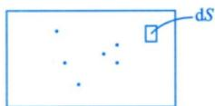
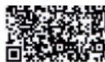

# 第一讲 随机事件与概率.docx — 图像索引

> 由 MinerU 结构化结果生成。题目若依赖树形、拓扑、流程、曲线、区域、时序或其他空间关系，应核对这里的原图，不要只依据 OCR 文本推断。

## 图 1

原文页码：4；bbox：`[657, 458, 800, 508]`

## 图 2

原文页码：7；bbox：`[766, 500, 847, 533]`

## 图 3

原文页码：13；bbox：`[206, 310, 233, 329]`
