# 第三章 多维随机变量及其分布.docx — 图像索引

> 由 MinerU 结构化结果生成。题目若依赖树形、拓扑、流程、曲线、区域、时序或其他空间关系，应核对这里的原图，不要只依据 OCR 文本推断。

## 图 1

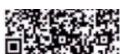

原文页码：1；bbox：`[726, 253, 798, 275]`

## 图 2

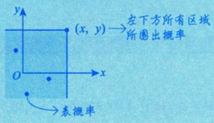

原文页码：2；bbox：`[490, 219, 707, 307]`

## 图 3

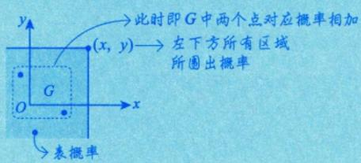

原文页码：2；bbox：`[393, 435, 668, 523]`

## 图 4

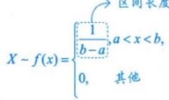

原文页码：6；bbox：`[489, 124, 633, 185]`

## 图 5

原文页码：13；bbox：`[201, 689, 233, 705]`

## 图 6

原文页码：18；bbox：`[200, 388, 228, 403]`

## 图 7

原文页码：19；bbox：`[179, 473, 205, 492]`

## 图 8

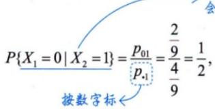

原文页码：20；bbox：`[364, 326, 554, 394]`

## 图 9

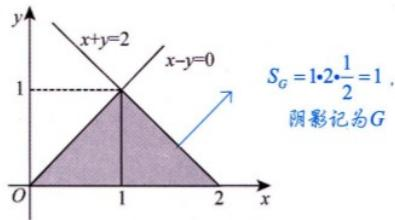

原文页码：21；bbox：`[398, 131, 636, 225]`

**图注：** 图3-1

## 图 10

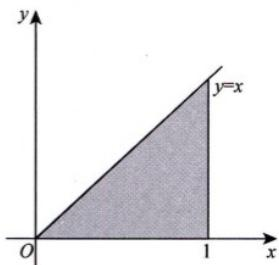

原文页码：22；bbox：`[647, 445, 815, 558]`

**图注：** 图3-2

## 图 11

原文页码：23；bbox：`[211, 489, 238, 507]`

## 图 12

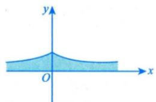

原文页码：23；bbox：`[425, 675, 581, 747]`

## 图 13

原文页码：24；bbox：`[186, 418, 213, 438]`

## 图 14

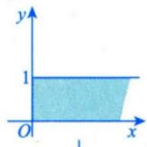

原文页码：24；bbox：`[699, 384, 796, 453]`

## 图 15

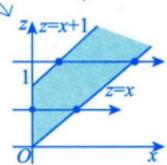

原文页码：24；bbox：`[700, 461, 801, 531]`

## 图 16

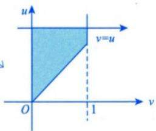

原文页码：25；bbox：`[623, 244, 778, 336]`

## 图 17

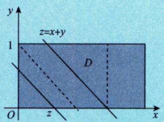

原文页码：25；bbox：`[638, 585, 836, 689]`

**图注：** 图3-3

## 图 18

原文页码：26；bbox：`[208, 135, 231, 153]`

## 图 19

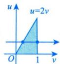

原文页码：26；bbox：`[630, 247, 704, 303]`

## 图 20

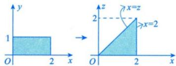

原文页码：26；bbox：`[510, 438, 726, 495]`

## 图 21

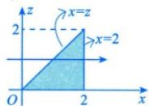

原文页码：26；bbox：`[569, 502, 680, 558]`

## 图 22

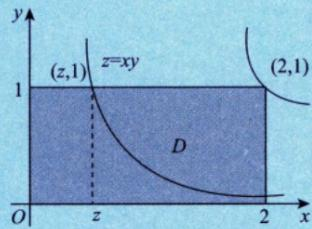

原文页码：27；bbox：`[601, 323, 789, 420]`

**图注：** 图3-4

## 图 23

原文页码：28；bbox：`[191, 671, 218, 689]`

## 图 24

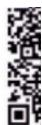

原文页码：29；bbox：`[823, 609, 848, 663]`

## 图 25

原文页码：30；bbox：`[201, 108, 228, 127]`
