# 第二讲 一维随机变量及其分布.docx

# 第二讲 一维随机变量及其分布

知识点：

随机变量的概念：

## 1 随机变量的概念

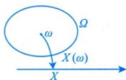

对 $y = y(x)$ 而言，x 是确定性变量，y 是确定性函数值。

对 $X = X(\omega)$ 而言， $X$ 是不确定性变量。具有可能性，例如投篮是否投中

随机变量就是“其值会随机而定”的变量. 设随机试验 $E$ 的样本空间为 $\Omega = \{\omega\}$ ，如果对每一个 $\omega \in \Omega$ ，都有唯一的实数 $X(\omega)$ 与之对应，并且对任意实数 $x, \{\omega|X(\omega) \leqslant x, \omega \in \Omega\}$ 是随机事件，则称定义在 $\Omega$ 上的实值单值函数 $X(\omega)$ 为随机变量，简记为随机变量 $X$ . 一般用大写字母 $X, Y, Z, \cdots$ 或希腊字母 $\xi, \eta, \zeta, \cdots$ 来表示随机变量.

注 (1) 随机事件是从静态的观点来研究随机现象, 而随机变量则是一种动态的观点, 如高等数学中常量与变量的区别.

$$
\rightarrow X = X (\omega)
$$

(2) 随机变量的实质是 “实值单值函数”，这个定义不同于高等数学中函数的定义（其 “定义域” 一般是实数集），它的 “定义域” 不一定是实数集，这点需要考生注意。

## 分布函数的概念及其性质：

## 2 分布函数的概念及性质

(1) 概念.

当 $x$ 从 $-\infty$ 到 $+\infty$ 取遍所有实数时, $\{X \leqslant x\}$ 就相应从不可能事件 $\varnothing$ 取到必然事件 $\Omega$ , 即分布函数完整地描述了随机变量的概率规律

设X是随机变量，x是任意实数，称函数 $F(x)=P\{X\leqslant x\}(x\in\mathbf{R})$ 为随机变量X的分布函数，或称X服从 $F(x)$ 分布，记为 $X\sim F(x)$ 。 $\Omega:\left\{\omega_{1},\omega_{2},\cdots,\omega_{t}\right\},X=X(\omega)\leqslant x$ 如掷骰子， $\Omega:\left\{\omega_{1},\omega_{2},\cdots,\omega_{6}\right\}$ ，分布函数 $F(x)$ 图像如图所示

(2) 性质. $\rightarrow$ 充要条件

① $F(x)$ 是x的单调不减函数，即对任意实数 $x_{1}<x_{2}$ ，有 $F(x_{1})\leqslant F(x_{2})$ ；

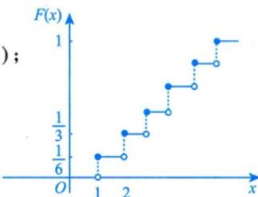

② $F(x)$ 是x的右连续函数，即对任意 $x_{0}\in\mathbf{R}$ ，有 $\lim_{x\to x_{0}^{+}}F(x)=F(x_{0}+0)=F(x_{0})$ ；

## 4. 左极限及点概率

定义

$$
F (a ^ {-}) = \lim _ {x \rightarrow a ^ {-}} F (x).
$$

由于

$$
F (a) = P (X \leq a), \quad F (a ^ {-}) = P (X <   a),
$$

因此

$$
\boxed {P (X = a) = F (a) - F \left(a ^ {-}\right)}
$$

也就是说：

分布函数在 $a$ 点的跳跃高度 $= P(X = a)$

这是离散型随机变量最重要的结论之一。

$$
③ F (- \infty) = \lim _ {x \to - \infty} F (x) = 0, F (+ \infty) = \lim _ {x \to + \infty} F (x) = 1. \xrightarrow {\text { 分布函数是事件的概率，由此知 } 0 \leqslant F (x) \leqslant 1 ,} \text { 即 } F (x) \text { 是有界函数 }
$$

注 满足以上三条性质的函数 $F(x)$ 必是某个随机变量 X 的分布函数，所以，这三条性质也是判断函数 $F(x)$ 是否为某一随机变量 X 的分布函数的充要条件。

## 3 分布函数的应用——求概率

$$
P \{X \leqslant a \} = F (a);
$$

$$
P \{X <   a \} = F (a - 0);
$$

$$
P \{X = a \} = F (a) - F (a - 0);
$$

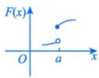

$$
P \{a <   X <   b \} = F (b - 0) - F (a);
$$

$$
\star \star \star F (x) = P \{X \leqslant x \}, x \in (- \infty , + \infty),
$$

$$
P \{a \leqslant X <   b \} = F (b - 0) - F (a - 0);
$$

针对离散型： $F(a)=P\{X\leqslant a\}=P\{x<a\}+P\{X=a\}$

$$
P \{a <   X \leqslant b \} = F (b) - F (a);
$$

$$
\begin{array}{c c} \downarrow & \downarrow \\ F (a - 0) & F (a) - F (a - 0) \end{array}
$$

$$
P \{a \leqslant X \leqslant b \} = F (b) - F (a - 0).
$$

## 离散型随机变量：

## 1. 定义与分布律

如果 $X$ 只能取有限个或可列无穷多个值

$$
x _ {1}, x _ {2}, \ldots ,
$$

就称 $X$ 为离散型随机变量。

令

$$
p _ {i} = P (X = x _ {i}),
$$

则称

$$
P (X = x _ {i}) = p _ {i}
$$

为 $X$ 的分布律、分布列或概率分布。

必须满足

$$
p _ {i} \geq 0, \quad \sum_ {i} p _ {i} = 1.
$$

## 2. 离散型分布函数

$$
\boxed {F _ {X} (x) = \sum_ {x _ {i} \leq x} p _ {i}}
$$

因此它是阶梯函数。

例如

$$
\begin{array}{c c c c} X & - 1 & 0 & 2 \\ \hline P & 0. 2 & 0. 3 & 0. 5 \end{array}
$$

则

$$
F _ {X} (x) = \left\{ \begin{array}{l l} 0, & x <   - 1, \\ 0. 2, & - 1 \leq x <   0, \\ 0. 5, & 0 \leq x <   2, \\ 1, & x \geq 2. \end{array} \right.
$$

三个跳跃高度依次是

$$
\begin{array}{c c c} 0. 2, & 0. 3, & 0. 5, \end{array}
$$

恰好就是各点概率。

五个重要的离散分布：

0-1 分布:

## 1.0—1分布 $B(1, p)$

若

$$
P (X = 1) = p, \qquad P (X = 0) = 1 - p,
$$

则

$$
X \sim B (1, p).
$$

含义：一次试验中

\- 事件发生记为1;

\- 事件不发生记为0。

它是所有“计数型随机变量”的基本单位。

## 二项分布:

## 2. 二项分布 $B(n, p)$

进行 $n$ 次相互独立的重复试验，每次事件发生概率都是 $p$ 。令 $X$ 表示事件发生次数，则

$$
X \sim B (n, p),
$$

且

$$
P (X = k) = \binom {n} {k} p ^ {k} (1 - p) ^ {n - k}, \quad k = 0, 1, \dots , n
$$

## 为什么是这个公式

事件恰好发生 $k$ 次：

\- 先选出发生的 $k$ 次: $\binom{n}{k}$ ;

\- 指定的一种排列发生概率： $p^{k}(1 - p)^{n - k}$ 。

所以相乘。

## 识别关键词

$$
\mathrm{固定次数} n + \mathrm{相互独立} + \mathrm{每次成功率相同}
$$

这个符号 $\binom{n}{k}$ 读作“n选k”（n choose k），在数学上叫做组合数（Combination）。

如果你看着觉得陌生或者像分数，没关系，它的核心意思非常直观：

## 1. 它的字面含义

它表示：从总共 n 个不同的东西里，选出 k 个，一共有多少种不同的选法，并且不讲究选出来的顺序。

## 2. 它的计算公式

如果你想自己算出来，它等于：

$$
\binom {n} {k} = \frac {n !}{k ! \times (n - k) !}
$$

\- $n!$ 叫做 $n$ 的阶乘，意思是 $n \times (n - 1) \times (n - 2) \times \cdots \times 1$ 。

○ 比如： $5! = 5 \times 4 \times 3 \times 2 \times 1 = 120$ 。

## 给新手的简便计算小窍门：

不用每次都去背那个长长的阶乘公式，你只需要从 $n$ 开始，连续往下乘 $k$ 个数，然后除以 $k$ 的阶乘。

\- 还是算 $\binom{5}{2}$ :

\- 分子：从 5 开始，连续往下乘 2 个数： $5 \times 4 = 20$ 。

○ 分母：2 的阶乘： $2 \times 1 = 2$ 。

○ 结果: $20 \div 2 = 10$ 。

## 总结：

在二项分布的公式里， $\binom{n}{k}$ 的作用就是把“成功和失败的所有可能发生的先后顺序”全都加起来。

## 泊松分布：

## 3. 泊松分布 $P(\lambda)$

若

$$
P (X = k) = e ^ {- \lambda} \frac {\lambda^ {k}}{k !}, \quad k = 0, 1, 2, \dots ,
$$

则称

$$
X \sim P (\lambda).
$$

它通常描述单位时间或单位区域内某事件发生的次数，例如：

\- 一小时内到达的顾客数；

\- 一页书中的印刷错误数；

\- 某路口一分钟内通过的车辆数；

\- 某区域内出现的缺陷数。

张宇将参数 $\lambda$ 解释为事件出现的“强度”或平均水平。

泊松近似二项

当

$$
n \text { 很大 }, \qquad p \text { 很小 }, \qquad n p = \lambda
$$

时，

$$
B (n, p) \approx P (\lambda).
$$

于是

$$
\binom {n} {k} p ^ {k} (1 - p) ^ {n - k} \approx e ^ {- \lambda} \frac {\lambda^ {k}}{k !}.
$$

## 几何分布：

## 4. 几何分布 $G(p)$

反复进行独立试验，每次成功概率为 $p$ 。令 $X$ 表示第一次成功时的试验次数，则

$$
X \sim G (p),
$$

$$
\left| P (X = k) = (1 - p) ^ {k - 1} p, \quad k = 1, 2, \dots \right|
$$

因为前 $k - 1$ 次必须失败，第 $k$ 次成功。

## 与二项分布的区别

\- 二项分布：固定做 $n$ 次，问成功几次；

\- 几何分布：一直做到第一次成功，问做了几次。

## 无记忆性

$$
P (X > m + n \mid X > m) = P (X > n).
$$

含义是：已经连续失败了 $m$ 次，不会改变以后还要等待多久的概率规律。

## 超几何分布：

这里的 $k$ ，就是你在抽出来的 $n$ 个产品中，实际数出来的“不合格品”的具体个数。

它是一个具体的整数（比如 0, 1, 2, 3...），用来代入公式计算概率的。

## 5. 超几何分布

总体有 N 个个体，其中 M 个属于某类。从中不放回抽取 n 个，令 X 表示抽到该类个体的数量，则

$$
\boxed {P (X = k) = \frac {\binom {M} {k} \binom {N - M} {n - k}}{\binom {N} {n}}}
$$

取值范围必须满足

$$
\max \{0, n - (N - M) \} \leq k \leq \min \{n, M \}.
$$

与二项分布的本质区别

<table><tr><td>模型</td><td>是否放回</td><td>各次是否独立</td></tr><tr><td>二项分布</td><td>放回或近似放回</td><td>独立</td></tr><tr><td>超几何分布</td><td>不放回</td><td>不独立</td></tr></table>

当总体很大而抽样比例很小时，不放回的影响很小，超几何分布可以近似用二项分布处理。

## 一、超几何分布到底在描述什么？

它描述的是：从有限总体中不放回地抽取，抽到“成功”类别的个数。

举个例子最直观：

有 $N$ 件产品，其中 $M$ 件是次品， $N - M$ 件是正品。从中一次性抽取 $n$ 件（或逐件不放回抽取 $n$ 次），设 $X$ 为抽到的次品件数，则 $X$ 服从超几何分布。

分布律为：

$$
P (X = k) = \frac {C _ {M} ^ {k} \cdot C _ {N - M} ^ {n - k}}{C _ {N} ^ {n}}
$$

其中：

\- $k$ 的取值范围： $\max (0,n - (N - M))\leq k\leq \min (n,M)$

## 二、和二项分布的核心区别（考研常考点）

<table><tr><td>对比项</td><td>超几何分布</td><td>二项分布</td></tr><tr><td>抽样方式</td><td>不放回</td><td>有放回(或总体无限大)</td></tr><tr><td>每次试验是否独立</td><td>否(概率随着抽取动态变化)</td><td>是</td></tr><tr><td>应用场景</td><td>有限总体,如“一批产品抽检”</td><td>重复独立试验,如“射击命中次数”</td></tr><tr><td>考研频率</td><td>极低(了解即可)</td><td>极高(每年必考)</td></tr></table>

当总体 $N$ 很大，且抽取量 $n$ 远小于 $N$ 时，超几何分布近似于二项分布，此时可用 $p = M / N$ 的二项分布代替。这就是为什么考纲把它列为“了解”的原因。

## 连续型随机变量：

## 五、连续型随机变量

## 1. 概率密度的定义

若存在非负函数 $f_{X}(x)$ ，使得

$$
F _ {X} (x) = \int_ {- \infty} ^ {x} f _ {X} (t) d t,
$$

则称 $X$ 为连续型随机变量， $f_{X}(x)$ 为概率密度。

概率密度必须满足

$$
\boxed {f _ {X} (x) \geq 0}
$$

以及

$$
\boxed {\int_ {- \infty} ^ {+ \infty} f _ {X} (x) d x = 1}
$$

## 2. 密度不是概率

连续型随机变量满足

$$
P (a <   X \leq b) = \int_ {a} ^ {b} f _ {X} (x) d x.
$$

因此：

概率是密度曲线下的面积

而 $f_{X}(x)$ 本身不是概率。

所以:

\- $f_{X}(x)$ 可以大于1;

\- 但积分面积不能大于1;

\- 不能写 $P(X = x) = f_{X}(x)$ 。

## 3. 连续型随机变量的点概率为零

对任意实数 $a$

$$
\boxed {P (X = a) = 0}
$$

因此

$$
P (a <   X <   b) = P (a \leq X <   b) = P (a <   X \leq b) = P (a \leq X \leq b).
$$

端点是否包含不影响结果。

但必须注意：

$$
P (X = a) = 0
$$

不等于事件 $X = a$ 不可能发生，而是说单点所占的概率面积为零。

## 4. $F$ 与 $f$ 的关系

由

$$
F _ {X} (x) = \int_ {- \infty} ^ {x} f _ {X} (t) d t
$$

可得，在相应可导点：

$$
\boxed {F _ {X} ^ {\prime} (x) = f _ {X} (x)}
$$

所以：

\- 由密度求分布函数：积分；

\- 由分布函数求密度：分段求导。

## 两个常见细节

第一，连续型随机变量的分布函数必须连续。

第二，在有限个点改变密度函数的值，不改变任何积分，因此不改变随机变量的分布。

三个重要连续分布：

均匀分布：

1. 均匀分布 $U(a, b)$

若

$$
f _ {X} (x) = \left\{ \begin{array}{l l} { \frac {1}{b - a},} & {a <   x <   b,} \\ {0,} & {\text {其他},} \end{array} \right.
$$

则称

$$
X \sim U (a, b).
$$

分布函数为

$$
F _ {X} (x) = \left\{ \begin{array}{l l} 0, & x <   a, \\ \frac {x - a}{b - a}, & a \leq x <   b, \\ 1, & x \geq b. \end{array} \right.
$$

它的核心特点是：等长区间具有相同概率。

若

$$
[ c, d ] \subseteq [ a, b ],
$$

则

$$
P (c <   X <   d) = \frac {d - c}{b - a}.
$$

## 1. 源头：均匀分布的密度函数

设 $X \sim U(a, b)$ ，其密度函数为：

$$
f _ {X} (x) = \left\{ \begin{array}{l l} { \frac {1}{b - a},} & {a <   x <   b,} \\ {0,} & {\text {其他}.} \end{array} \right.
$$

## 2. 分布函数的定义

分布函数的定义为:

$$
F _ {X} (x) = P (X \leq x) = \int_ {- \infty} ^ {x} f _ {X} (t) d t
$$

也就是说，分布函数等于密度函数从 $-\infty$ 到 $x$ 的积分。我们分三种情况讨论：

情况一：当 $x < a$ 时

此时积分区间 $(-\infty, x]$ 完全落在密度函数为0的区域。

$$
F _ {X} (x) = \int_ {- \infty} ^ {x} 0 d t = 0
$$

情况二：当 $a \leq x < b$ 时

此时积分要从 $-\infty$ 积到 $x$ ，但只有从 $a$ 到 $x$ 这一段密度函数非零。

$$
F _ {X} (x) = \int_ {- \infty} ^ {a} 0 d t + \int_ {a} ^ {x} \frac {1}{b - a} d t = \frac {x - a}{b - a}
$$

这就是你截图里那个公式的来源。

## 情况三：当 $x \geq b$ 时

此时整个区间 $(a, b)$ 都被覆盖了：

$$
F _ {X} (x) = \int_ {- \infty} ^ {a} 0 d t + \int_ {a} ^ {b} \frac {1}{b - a} d t + \int_ {b} ^ {x} 0 d t = \frac {b - a}{b - a} = 1
$$

## 指数分布：

## 2. 指数分布 $E(\lambda)$

若

$$
f _ {X} (x) = \left\{ \begin{array}{l l} \lambda e ^ {- \lambda x}, & x > 0, \\ 0, & x \leq 0, \end{array} \right. \quad \lambda > 0,
$$

则

$$
X \sim E (\lambda).
$$

分布函数为

$$
F _ {X} (x) = \left\{ \begin{array}{l l} 0, & x \leq 0, \\ 1 - e ^ {- \lambda x}, & x > 0. \end{array} \right.
$$

尾概率特别重要：

$$
\boxed {P (X > x) = e ^ {- \lambda x}, \qquad x > 0.}
$$

指数分布通常描述等待时间、寿命，例如：

\- 等待下一位顾客到来的时间；

\- 元件的工作寿命；

\- 等待第一次故障的时间。

## 无记忆性

$$
\boxed {P (X > s + t \mid X > s) = P (X > t)}
$$

这意味着已经使用了 $s$ 小时，不影响其剩余寿命的概率规律。

几何分布是离散等待时间模型，指数分布是连续等待时间模型。

(2) 指数分布 $E(\lambda)$ . 连续型等待分布

如果 $X$ 的概率密度和分布函数（见图2-3，图2-4）分别为

$\rightarrow  \lambda$ 叫失效频率,后

$$
f (x) = \left\{ \begin{array}{l l} \lambda \mathrm{e} ^ {- \lambda x}, & x > 0, \\ 0, & \text {其他}, \end{array} \right. F (x) = \left\{ \begin{array}{l l} 1 - \mathrm{e} ^ {- \lambda x}, & x \geqslant 0, \\ 0, & x <   0 \end{array} (\lambda > 0), \right.
$$

面会知道 $EX = \frac{1}{\lambda}$

则称 $X$ 服从参数为 $\lambda$ 的指数分布，记为 $X \sim E(\lambda)$ 。

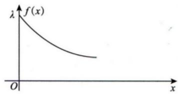

图2-3  
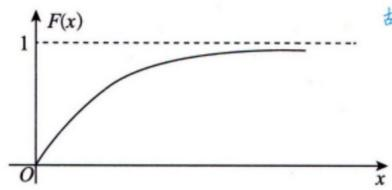  
图2-4

记 $\{N_{t}, t\geq0\}$ ， $N_{t}$ ——质点来流的个数，泊松分布中 $\lambda$ 表示单位时间质点来流的强度，所以t时间内质点来流的强度为 $\lambda t$ 。

令 $T$ 表示等待时间(第一个质点出现), 则

$$
T \sim F (t) = P \{T \leqslant t \} = 1 - P \{T > t \},
$$

由 $\{N_t, t \geq 0\}$ 知 $[0, t]$ 时，

$$
P \{T > t \} = P \{N _ {t} = 0 \} = \mathrm{e} ^ {- \lambda t},
$$

故 $T \sim F(t) = P\{T < t\} = 1 - P\{T > t\}$

$$
= \left\{ \begin{array}{l l} 1 - \mathrm{e} ^ {- \lambda t}, & t > 0, \\ 0, & t <   0 \end{array} \right.
$$

## 正态分布：

## 3. 正态分布 $N(\mu, \sigma^2)$

若

$$
f _ {X} (x) = \frac {1}{\sqrt {2 \pi} \sigma} \exp \left[ - \frac {(x - \mu) ^ {2}}{2 \sigma^ {2}} \right], \quad - \infty <   x <   + \infty ,
$$

则

$$
X \sim N (\mu , \sigma^ {2}).
$$

注意第二个参数是：

方差 $\sigma^2$

而不是标准差 $\sigma$ 。

## 图像特点

\- 关于 $x = \mu$ 对称；

\- 在 $x = \mu$ 处达到最大值；

\- $\sigma$ 越大，图像越矮、越分散；

\- $\sigma$ 越小，图像越高、越集中。

## 正态分布图示（考研数一·概率论部分）

$$
\begin{array}{c} {{f _ {X} (x) =  \frac {1}{\sqrt {2 \pi} \sigma} \exp \left[ -   \frac {(x - \mu) ^ {2}}{2 \sigma^ {2}} \right],    - \infty <   x <   + \infty}} \\ {{X \sim N (\mu ,   \sigma^ {2})}} \end{array}
$$

## 1. 总体形状与参数含义

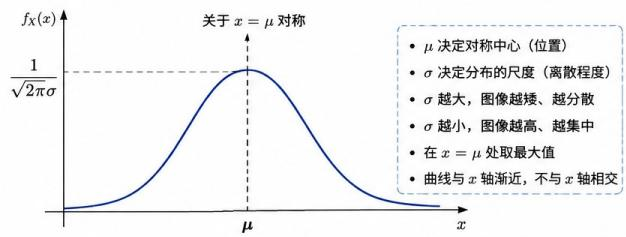

2. 不同 $\sigma$ 的影响（ $\mu$ 固定）  
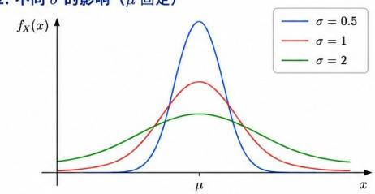  
3. 区间概率（经验法则，适用于任意 $\mu, \sigma$ ）

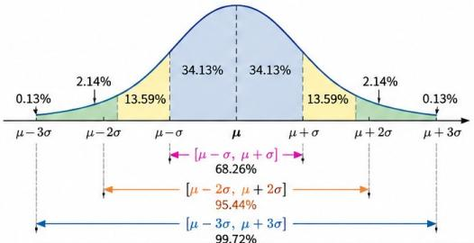  
4. 标准化（转化为标准正态）

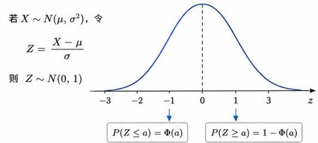  
核心结论： $\mu$ 决定位置， $\sigma$ 决定形状； $\sigma^{2}$ 为方差，非标准差；标准化后查标准正态表 $\Phi(z)$ 。

## 4. 标准化是正态题第一反应

若

$$
X \sim N (\mu , \sigma^ {2}),
$$

则

$$
\boxed {Z = \frac {X - \mu}{\sigma} \sim N (0, 1)}
$$

设标准正态分布函数为

$$
\Phi (x) = P (Z \leq x),
$$

则

$$
P (X \leq x) = \Phi \left(\frac {x - \mu}{\sigma}\right),
$$

$$
P (a <   X \leq b) = \Phi \left(\frac {b - \mu}{\sigma}\right) - \Phi \left(\frac {a - \mu}{\sigma}\right).
$$

对称性：

$$
\boxed {\Phi (- x) = 1 - \Phi (x)}
$$

王式安资料在正态题中尤其强调利用对称性和标准化，很多选择填空不需要直接积分。

另外，

$$
X \sim N (\mu , \sigma^ {2})
$$

时，

$$
a X + b \sim N (a \mu + b, a ^ {2} \sigma^ {2}), \quad a \neq 0.
$$

https://chatgpt.com/g/g-p-6a1d6c6f0a408191a175c887909fceb5-xian-dai-he-gai-lu-lun-ocr/c/6a6dcc04-25d4-83ee-9928-8a2f470444f2

## 随机变量函数的分布：

## 七、随机变量函数的分布

这是本讲最重要、也最容易综合命题的部分。

设

$$
Y = g (X).
$$

已知 $X$ 的分布，要求 $Y$ 的分布。

张宇资料给出了两类方法：

分布函数法

和

公式法

其中分布函数法最通用。 27李良《概率论与数理统计》（基础强化一本通）\_OCR

## 离散型：

(1) 离散型 $\rightarrow$ 离散型.

设 X 为离散型随机变量，其概率分布为 $P\{X = x_{i}\} = p_{i} (i = 1, 2, \cdots)$ ，则 X 的函数 $Y = g(X)$ 也是离散型随机变量，其概率分布为 $P\{Y = g(x_{i})\} = p_{i} (i = 1, 2, \cdots)$ ，即

$$
Y \sim \left( \begin{array}{c c c} g (x _ {1}) & g (x _ {2}) & \dots \\ p _ {1} & p _ {2} & \dots \end{array} \right).
$$

如果有若干个 $g(x_{i})$ 值相同，则合并诸项为一项 $g(x_{k})$ ，并将相应概率相加作为 $Y$ 取 $g(x_{k})$ 值的概率.

## 2. 离散型函数的分布

若

$$
P (X = x _ {i}) = p _ {i},
$$

且

$$
Y = g (X),
$$

则先将每个 $x_{i}$ 代入 $g$ 。

若不同的 $x_{i}$ 得到同一个 $y$ ，必须将概率相加。

例

设

$$
P (X = - 1) = \frac {1}{4}, \qquad P (X = 0) = \frac {1}{2}, \qquad P (X = 1) = \frac {1}{4},
$$

令

$$
Y = X ^ {2}.
$$

则 $Y$ 只能取0,1。

$$
P (Y = 0) = P (X = 0) = \frac {1}{2},
$$

$$
P (Y = 1) = P (X = - 1) + P (X = 1) = \frac {1}{2}.
$$

因此

$$
\begin{array}{c c c} Y & 0 & 1 \\ \hline P & \frac {1}{2} & \frac {1}{2} \end{array}
$$

## 连续型：

(2) 连续型 $\rightarrow$ 连续型 (或混合型). 注意下标的书写, 说明是谁的分布函数

$$
F _ {x} (x)
$$

设 X 为连续型随机变量，其分布函数、概率密度分别为 $F_{X}^{j}(x)$ 与 $f_{X}(x)$ ，随机变量 $Y = g(X)$ 是 X 的函数，则 Y 的分布函数或概率密度可用下面两种方法求得.

①分布函数法(定义法). 最可靠

直接由定义求 $Y$ 的分布函数

此不等式的几何意义：曲线 $Y=g(X)$ 在直线Y=y下方，由此可通过作图得出X的取值范围，在 $Y=g(X)$ 是非单调函数时，一般比解析法方便

$$
F _ {Y} (y) = P \{Y \leqslant y \} = P \underbrace {\{g (X) \leqslant y \}} _ {\text {反解出} X \text {即可}} = \int_ {g (x) \leqslant y} f _ {X} (x) \mathrm{d} x,
$$

如果 $F_{Y}(y)$ 连续，且除有限个点外， $F_{Y}^{\prime}(y)$ 存在且连续，则Y的概率密度 $f_{Y}(y)=F_{Y}^{\prime}(y)$ .

②公式法.

根据上面的分布函数法，若 $y = g(x)$ 在 $(a, b)$ 上是关于 $x$ 的严格单调可导函数，则存在 $x = h(y)$ 是 $y = g(x)$ 在 $(a, b)$ 上的可导反函数.

若 $y=g(x)$ 严格单调增加，则 $x=h(y)$ 也严格单调增加，即 $h'(y)>0$ ，且

$$
F _ {Y} (y) = P \{Y \leqslant y \} = P \{g (X) \leqslant y \} = P \{X \leqslant h (y) \} = \int_ {- \infty} ^ {h (y)} f _ {X} (x) \mathrm{d} x,
$$

故 $f_{Y}(y)=F_{Y}^{\prime}(y)=f_{X}[h(y)]\cdot h^{\prime}(y)$ .

若 $y=g(x)$ 严格单调减少，则 $x=h(y)$ 也严格单调减少，即 $h'(y)<0$ ，且

$$
F _ {Y} (y) = P \{Y \leqslant y \} = P \{g (X) \leqslant y \} = P \{X \geqslant h (y) \} = \int_ {h (y)} ^ {+ \infty} f _ {X} (x) \mathrm{d} x,
$$

故 $f_{Y}(y)=F_{Y}^{\prime}(y)=-f_{X}[h(y)]\cdot h^{\prime}(y)=f_{X}[h(y)]\cdot[-h^{\prime}(y)]$ .

综上，

$$
f _ {Y} (y) = \left\{ \begin{array}{l l} f _ {X} [ h (y) ] \bullet | h ^ {\prime} (y) |, & \alpha <   y <   \beta , \\ 0, & \text {其他}, \end{array} \right.
$$

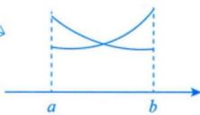

其中 $\alpha = \min \left\{\lim_{x\to a^{+}}g(x),\lim_{x\to b^{-}}g(x)\right\}$ ， $\beta = \max \left\{\lim_{x\to a^{+}}g(x),\lim_{x\to b^{-}}g(x)\right\}$

## 3. 连续型：分布函数法

直接从定义出发：

$$
\left| F _ {Y} (y) = P (Y \leq y) = P (g (X) \leq y) \right.
$$

然后把关于 $Y$ 的不等式转化为关于 $X$ 的不等式。

最后求导：

$$
f _ {Y} (y) = F _ {Y} ^ {\prime} (y).
$$

这个方法适用于:

\- $g(x)$ 非单调；

\- $g(x) = |x|$ 、 $x^2$ ;

\- 分段函数；

\- 最大值、最小值；

\- 保险赔付函数；

\- 可能产生混合分布的变换。

我们要求 $Y = g(X)$ 的密度函数 $f_{Y}(y)$ 。

最原始、最可靠的方法永远是分布函数法：

$$
F _ {Y} (y) = P (Y \leq y) = P (g (X) \leq y)
$$

如果我们能把 $g(X) \leq y$ 解成 $X \leq \ldots$ 的形式，那就可以直接代入 $F_{X}(\ldots)$ ，然后求导得到 $f_{Y}$ 。这就是单调变换公式的底层来源。

假设 $g(x)$ 严格单调递增。

那么 $g(X) \leq y$ 等价于 $X \leq h(y)$ ，其中 h 是 g 的反函数。

所以：

$$
F _ {Y} (y) = F _ {X} (h (y))
$$

两边对 $y$ 求导（链式法则）：

$$
f _ {Y} (y) = f _ {X} (h (y)) \cdot h ^ {\prime} (y)
$$

你看，这个公式就是从分布函数法求导直接得到的，不是凭空冒出来的。

## 3. 如果是单调递减怎么办？

假设 $g(x)$ 严格单调递减。

那么 $g(X)\leq y$ 等价于 $X\geq h(y)$ 。

所以：

$$
F _ {Y} (y) = 1 - F _ {X} (h (y))
$$

两边对 $y$ 求导：

$$
f _ {Y} (y) = - f _ {X} (h (y)) \cdot h ^ {\prime} (y)
$$

因为递减函数 $h'(y) < 0$ ，所以 $-h'(y) = |h'(y)|$ 。

总结成统一形式：

$$
f _ {Y} (y) = f _ {X} (h (y)) \cdot | h ^ {\prime} (y) |
$$

公式里的绝对值，正是为了把“递减”这种情况统一进来。

非单调变换：

4. 核心例题：非单调变换

设

$$
X \sim U (- 1, 2), \qquad Y = | X |.
$$

因为 $X \in [-1, 2]$ ，所以

$$
0 \leq Y \leq 2.
$$

当 $0 \leq y \leq 1$ 时，

$$
F _ {Y} (y) = P (| X | \leq y) = P (- y \leq X \leq y).
$$

区间长度是 $2y$ ，总区间长度是3，所以

$$
F _ {Y} (y) = \frac {2 y}{3}.
$$

当 $1 < y \leq 2$ 时， $-y < -1$ ，与 $X$ 的取值范围相交后得到

$$
- 1 \leq X \leq y,
$$

所以

$$
F _ {Y} (y) = \frac {y + 1}{3}.
$$

求导得到

$$
f _ {Y} (y) = \left\{ \begin{array}{l l} { \frac {2}{3},} & {0 <   y <   1,} \\ { \frac {1}{3},} & {1 <   y <   2,} \\ {0,} & {\text {其他}.} \end{array} \right.
$$

这道题说明：非单调函数必须根据原变量取值范围分段，不能机械套一个反函数公式。

单调变换：

## 5. 连续型：单调变换公式

若

$$
Y = g (X)
$$

在 $X$ 的取值区间上严格单调、可导，并且反函数为

$$
x = h (y) = g ^ {- 1} (y),
$$

则

$$
\boxed {f _ {Y} (y) = f _ {X} (h (y)) | h ^ {\prime} (y) |}
$$

其中 $y$ 必须限制在 $Y$ 的取值范围内。

绝对值不能漏，因为无论 $g$ 单调增加还是单调减少，密度都必须非负。

例：指数变量变成均匀变量

设

$$
X \sim E (\lambda), \qquad Y = 1 - e ^ {- \lambda X}.
$$

因为 $X > 0$ ，所以

$$
0 <   Y <   1.
$$

反函数为

$$
x = - \frac {1}{\lambda} \ln (1 - y),
$$

且

$$
\left| \frac {d x}{d y} \right| = \frac {1}{\lambda (1 - y)}.
$$

因此

$$
\begin{array}{l} f _ {Y} (y) = f _ {X} \left(- \frac {1}{\lambda} \ln (1 - y)\right) \frac {1}{\lambda (1 - y)} \\ \qquad = \lambda (1 - y) \frac {1}{\lambda (1 - y)} \\ \qquad = 1, \end{array}
$$

所以

$$
\boxed {Y \sim U (0, 1)}.
$$

这也是更一般结论

$$
F _ {X} (X) \sim U (0, 1)
$$

的一个具体体现；张宇基础讲义中专门给出了这个结论。 27张宇基础30讲概率\_OCR

非单调函数的多根公式：

## 6. 非单调函数的多根公式

若方程

$$
g (x) = y
$$

在原变量取值范围内有多个根

$$
x _ {1} (y), x _ {2} (y), \ldots ,
$$

则

$$
\boxed {f _ {Y} (y) = \sum_ {i} f _ {X} \left(x _ {i} (y)\right) \left| \frac {d x _ {i}}{d y} \right|}
$$

例如 $Y = X^2$ ，通常有两支：

$$
x = \sqrt {y}, \quad x = - \sqrt {y}.
$$

所以两支概率密度都要加起来。

不过在基础阶段，遇到 $X^2$ 、 $|X|$ 等问题，优先使用分布函数法通常更稳。

## Tips:

## 缩写：

<table><tr><td>分布名称</td><td>表示方法(记作)</td><td>补充说明</td></tr><tr><td>0-1分布</td><td> $X \sim B(1,p)$  1</td><td>也可写作  $X \sim (0 - 1)$  分布,是二项分布  $n = 1$  时的特例。</td></tr><tr><td>二项分布</td><td> $X \sim B(n,p)$  1 5</td><td>这里的  $n$  和  $p$  是参数。</td></tr><tr><td>泊松分布</td><td> $X \sim P(\lambda)$  1 5</td><td>参数为  $\lambda$  。注意,也有教材写作  $X \sim \pi(\lambda)$ ,但考纲和主流辅导书多用  $P(\lambda)$  1 2 5。</td></tr><tr><td>几何分布</td><td> $X \sim G(p)$  1</td><td>通常指在伯努利试验中,首次成功所需的试验次数。</td></tr><tr><td>超几何分布</td><td> $X \sim H(N,M,n)$  6</td><td>参数  $N$  为总体数, $M$  为成功类元素数, $n$  为抽取次数。</td></tr><tr><td>均匀分布</td><td> $X \sim U(a,b)$  1 4</td><td>参数  $a,b$  为区间的端点。</td></tr><tr><td>指数分布</td><td> $X \sim E(\lambda)$  1 4</td><td>参数  $\lambda > 0$ 。</td></tr><tr><td>正态分布</td><td> $X \sim N(\mu,\sigma^{2})$  1 4</td><td>其中  $\mu$  为均值, $\sigma^{2}$  为方差。</td></tr></table>

\- B (二项分布): 对应 Binomial（二项式）。全称是 Binomial Distribution。

\- P (泊松分布): 对应 Poisson（泊松，人名）。全称是 Poisson Distribution。这里用 P 是因为这是以法国数学家 Siméon Denis Poisson 的名字命名的。

\- U (均匀分布): 对应 Uniform (均匀的)。全称是 Uniform Distribution。

\- 0-1分布：Bernoulli Distribution（伯努利分布），符号常写为 B(1, p)。

\- 几何分布：Geometric Distribution，符号G就是首字母。

\- 超几何分布：Hypergeometric Distribution，符号 H 就是首字母。

\- 指数分布：Exponential Distribution，符号 E 就是首字母。

\- 正态分布：Normal Distribution，符号 N 就是首字母。

题：

题1:

## 例2.1 设随机变量 $X$ 的分布函数为

$$
X \sim F (x) = \left\{ \begin{array}{l l} a + b \mathrm{e} ^ {- x}, & x > 0, \\ 0, & x \leqslant 0. \end{array} \right.
$$

求常数 $a, b$ 及概率 $P\{|X| < 2\}$ .

分析 $F(x)$ 中含有2个未知参数，依据分布函数的性质建立两个独立方程解之.

解 由分布函数的性质，有

得 $a = 1$ . 又 $F(x)$ 在 $x = 0$ 处右连续，有

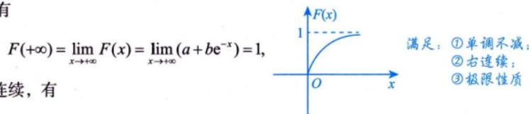

$$
\lim _ {x \rightarrow 0 ^ {+}} F (x) = \lim _ {x \rightarrow 0 ^ {+}} (a + b e ^ {- x}) = a + b = 0,
$$

得 $b = -1$ .所以

$$
F (x) = \left\{ \begin{array}{l l} 1 - \mathrm{e} ^ {- x}, & x > 0, \\ 0, & x \leqslant 0, \end{array} \right.
$$

从而有

$$
P \{| X | <   2 \} = P \{- 2 <   X <   2 \} = F (2 - 0) - F (- 2) = 1 - e ^ {- 2} - 0 = 1 - e ^ {- 2}.
$$

## 题2:

例 2.2 设 $F_{1}(x)$ , $F_{2}(x)$ 是随机变量的分布函数, $f_{1}(x)$ , $f_{2}(x)$ 是相应的概率密度, 则().

(A) $F_{1}(x) + F_{2}(x)$ 是分布函数

(B) $F_{1}(x)\cdot F_{2}(x)$ 是分布函数

(C) $f_{1}(x)+f_{2}(x)$ 是概率密度

(D) $f_{1}(x)\cdot f_{2}(x)$ 是概率密度

分析

$F(x)$ 是分布函数 $\Leftrightarrow \left\{\begin{aligned}&① F(x)\text{ 单调不减,}\\ &② F(x_{0}+0)=F(x_{0}),\\ &③ \left\{\begin{aligned}F(+\infty)&=1,\\ F(-\infty)&=0.\end{aligned}\right.\end{aligned}\right.$

$f(x)$ 是概率密度 $\Leftrightarrow \left\{ \begin{array}{ll} ① & f(x) \geqslant 0, \\ ② & \int_{-\infty}^{+\infty} f(x) \mathrm{d}x = 1. \end{array} \right.$

应选(B).

根据连续型随机变量分布函数和概率密度的性质，有

$$
F _ {1} (+ \infty) + F _ {2} (+ \infty) = 2, \int_ {- \infty} ^ {+ \infty} [ f _ {1} (x) + f _ {2} (x) ] d x = 2,
$$

$$
\int_ {- \infty} ^ {+ \infty} f _ {1} (x) f _ {2} (x) \mathrm{d} x \neq \int_ {- \infty} ^ {+ \infty} f _ {1} (x) \mathrm{d} x \int_ {- \infty} ^ {+ \infty} f _ {2} (x) \mathrm{d} x = 1,
$$

应排除选项(A)，(C)，(D)，故选择(B).事实上，由于 $F_{1}(x)\cdot F_{2}(x)$ 是单调不减的右连续函数，且

$$
F _ {1} (- \infty) \bullet F _ {2} (- \infty) = 0, F _ {1} (+ \infty) \bullet F _ {2} (+ \infty) = 1,
$$

可直接判断选项(B)正确.

注 判断 $\sqrt{f_1(x)f_2(x)}$ 是不是概率密度. 易知 $\frac{f_1(x) + f_2(x)}{2} \geqslant \sqrt{f_1(x)f_2(x)}$ , $f_1(x) \neq f_2(x)$ , 故

$$
1 > \int_ {- \infty} ^ {+ \infty} \sqrt {f _ {1} (x) f _ {2} (x)} d x,
$$

不满足归一性，所以 $\sqrt{f_1(x)f_2(x)}$ 不是概率密度.

## 题 3:

例 2.4 已知 X 的分布函数为 $F(x)$ ，概率密度为 $f(x)$ 。当 $x \leqslant 0$ 时， $f(x)$ 连续，且 $f(x) = F(x)$ ，若 $F(0) = 1$ ，则 $f(x) =$ \_\_\_\_.

解 应填 $\left\{\begin{aligned}e^{x},&x\leqslant0,\\ 0,&x>0.\end{aligned}\right.$

由于 $F(x)$ 是单调不减的函数，且 $F(0)=1$ ，故对任意的x>0，均有 $F(x)=1$ 。又当 $x\leqslant0$ 时， $f(x)$ 连续，故 $f(x)=F'(x)$ 。已知 $f(x)=F(x)$ ，由微分方程 $F'(x)=F(x)$ 及 $F(0)=1$ ，解得 $F(x)=\mathrm{e}^{x}(x\leqslant0)$ ，从而得

$$
F (x) = \left\{ \begin{array}{l l} \mathrm{e} ^ {x}, & x <   0, \\ 1, & x \geqslant 0, \end{array} \right.
$$

$$
f (x) = \left\{ \begin{array}{l l} \mathrm{e} ^ {x}, & x \leqslant 0, \\ 0, & x > 0. \end{array} \right.
$$

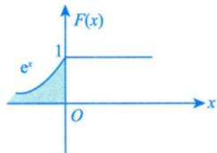

注 当分布函数是不连续的分段函数时，为保证其右连续性，自变量 x 的分段小区间除第一个区间之外，其余都应是左闭右开的，即等号跟着大于号。连续情况下等号跟谁都可以

## 题 4:

例 2.6 通过某交叉路口的汽车流可以看作服从泊松分布. 已知在 1 分钟内有汽车通过的概率为 0.7, 则 1 分钟内最多有 1 辆汽车通过的概率为 ( ). (A) $0.7(1 - \ln 0.7)$ (B) $0.3(1 - \ln 0.7)$ (C) $0.3(1 - \ln 0.3)$ (D) $0.7(1 - \ln 0.3)$

应选(C).

1 分钟内通过路口的汽车数量 X 服从参数为 $\lambda$ 的泊松分布. 由已知,

$$
P \{X \geqslant 1 \} = 1 - \frac {\lambda^ {0}}{0 !} \mathrm{e} ^ {- \lambda} = 0. 7,
$$

首先求出参数 $\lambda$ ，再根据具体问题分析

得 $\lambda = -\ln 0.3$ ，于是 $P\{X\leqslant 1\} = \frac{\lambda^0}{0!}\mathrm{e}^{-\lambda} + \frac{\lambda^1}{1!}\mathrm{e}^{-\lambda} = \mathrm{e}^{\ln 0.3}(1 - \ln 0.3) = 0.3(1 - \ln 0.3)$ ，故选择(C).

## 题 5:

例 2.7 设随机变量 X 的概率密度为 $f(x)=\left\{\begin{aligned}&2^{-x}\ln2,&x>0,\\ &0,& 其他.\end{aligned}\right.$ 对 X 进行独立重复的观测，直到第 2 个大于 3 的观测值出现时停止，记 Y 为观测次数。求 Y 的概率分布。

分析 $2^{-x}\ln 2 = \mathrm{e}^{-x\ln 2}\cdot \ln 2$ .先求大于3的概率.

解 记 p 为 “观测值大于 3” 的概率，则 $p = P\{X > 3\} = \int_{3}^{+\infty} 2^{-x} \ln 2 \, dx = \frac{1}{8}$ .

依题意，Y为离散型随机变量，而且取值为2,3,…，则Y的概率分布为

$$
P \{Y = k \} = C _ {k - 1} ^ {1} p (1 - p) ^ {k - 2} \cdot p = C _ {k - 1} ^ {1} p ^ {2} (1 - p) ^ {k - 2} = (k - 1) \left(\frac {1}{8}\right) ^ {2} \left(\frac {7}{8}\right) ^ {k - 2}, k = 2, 3, \dots .
$$

注 k 只能从 2 开始. $\underbrace{\times\cdots\cdots\times\sqrt{\cdots\cdots\times}}_{k-1}\sqrt{}$ ，前 k-1 次包含一个 √，第 k 次出现第 2 个 √.

## 题6:

感觉这是个脑筋急转弯题

例 2.12 设随机变量 X 服从正态分布 $N(0,1)$ ，对给定的 $\alpha(0<\alpha<1)$ ，数 $u_{\alpha}$ 满足 $P\{X>u_{\alpha}\}=\alpha$ ，若 $P\{|X|<x\}=\alpha$ ，则 x 等于（）.
(A) $u_{\frac{\alpha}{2}}$ (B) $u_{1-\frac{\alpha}{2}}$ (C) $u_{1-\frac{\alpha}{2}}$ (D) $u_{1-\alpha}$

解 应选(C).

如图 2-9 所示，从几何直观看，条件中给出的 $u_{\alpha}$ 即为上侧 $\alpha$ 分位数。类比可得 $P\left\{|X|<u_{\frac{1-\alpha}{2}}\right\}=\alpha$ ，故选择 (C).

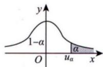  
(a)

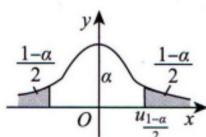  
图2-9  
(b)

## 题7:

例 2.13 设随机变量 X 满足不等式 $1 \leqslant X \leqslant 4$ ，且 $P\{X=1\}=\frac{1}{4}$ ， $P\{X=4\}=\frac{1}{3}$ ，当 X 在区间 (1, 4) 时，X 服从均匀分布。求 X 的分布函数。

分析 X的分布是混合型的，则用定义法求分布函数。

条件分布

解 当 $x < 1$ 时， $F(x) = P\{X \leqslant x\} = 0$ ；

当x=1时， $F(x)=P\{X\leqslant x\}=\frac{1}{4}$ ;

当 $1 < x < 4$ 时，

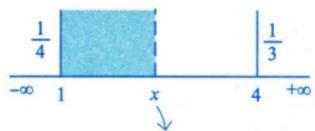

分布函数 $F(x) = P\{X \leqslant x\}$ ，且 $x$ 需取遍 $-\infty$ 到 $+\infty$

$$
F (x) = P \{X \leqslant 1 \} + P \{1 <   X \leqslant x \},
$$

其中

$$
P \{1 <   X \leqslant x \} = P \{1 <   X \leqslant x, \Omega \} = P \{1 <   X \leqslant x, 1 <   X <   4 \} + P \{1 <   X \leqslant x, \overline {{1 <   X <   4}} \}
$$

$$
= \frac {x - 1}{4 - 1} \cdot \frac {5}{1 2} + 0 = \frac {5 (x - 1)}{3 6}
$$

注意到 $X$ 只在[1,4]取值，所以 $X$ 在(1,4)内的概率即为 $X$ 在[1,4]的概率减去两个端点.

故

$$
P \{1 <   X <   4 \} = 1 - P \{X = 1 \} - P \{X = 4 \} = 1 - \frac {7}{1 2} = \frac {5}{1 2}
$$

$$
F (x) = \frac {1}{4} + \frac {5 (x - 1)}{3 6} = \frac {1}{9} + \frac {5}{3 6} x;
$$

当 $x \geqslant 4$ 时， $F(x) = 1$ 。

从而得 $X$ 的分布函数为

$$
F (x) = \left\{ \begin{array}{l l} 0, & x <   1, \\ \frac {1}{9} + \frac {5}{3 6} x, & 1 \leqslant x <   4, \\ 1, & x \geqslant 4. \end{array} \right.
$$

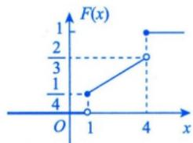

注 (1) 将 $\{1 < X \leqslant x\}$ 写成 $\{1 < X \leqslant x, \Omega\}$ ，然后作全集分解，是解决本题的关键。

(2) 由图可知，X 既不是离散型随机变量，也不是连续型随机变量，称为混合型随机变量。

(3) 还可知，当 $1 < x < 4$ 时，记 $A = \{1 < X < 4\}$ ，则

$$
f (x) = f (x \mid A) P (A) + f (\underline {{x}} \mid \overline {{A}}) P (\overline {{A}}) = \frac {1}{3} \times \frac {5}{1 2} + 0 \times \frac {7}{1 2} = \frac {5}{3 6}
$$

或在 1 < x < 4 时， $f(x) = F'(x) = \frac{5}{36}$ . 对立事件，所以概率为0

https://chatgpt.com/g/g-p-6a1d6c6f0a408191a175c887909fceb5-xian-dai-he-gai-lu-lun-ocr/c/6a6f169f-5400-83ee-b3c0-c960a8131e76

https://chatgpt.com/g/g-p-6a1d6c6f0a408191a175c887909fceb5-xian-dai-he-gai-lu-lun-ocr/c/6a707891-0a60-83ee-9e91-cf7815af6208

题8:

例 2.15 设随机变量 X 的分布函数 $F_{X}(x)$ 是严格单调增加函数，其反函数 $F_{X}^{-1}(y)$ 存在， $Y = F_{X}(X)$ . 证明：Y 服从区间 $(0, 1)$ 上的均匀分布.

证 $Y = F_{X}(X)$ 是在区间 $(0, 1)$ 上取值的随机变量，故

当y<0时， $F_{Y}(y)=0$ ；

当 $y\geqslant1$ 时， $F_{Y}(y)=1$ ；

当 $0 \leqslant y < 1$ 时，

$$
F _ {Y} (y) = P \{Y \leqslant y \} = P \left\{F _ {X} (X) \leqslant y \right\} = P \left\{X \leqslant F _ {X} ^ {- 1} (y) \right\} = F _ {X} \left[ F _ {X} ^ {- 1} (y) \right] = y.
$$

综上所述， $Y = F_{X}(X)$ 的分布函数为

$$
F _ {Y} (y) = \left\{ \begin{array}{l l} 0, & y <   0, \\ y, & 0 \leqslant y <   1, \\ 1, & y \geqslant 1, \end{array} \right. \text {   注意到分布函数   处处右连续   }
$$

这是在区间 $(0,1)$ 上的均匀分布函数，所以 $Y\sim U(0,1)$ .

注 (1) 题设条件中的 “ $F_{X}(x)$ 严格单调增加” 是充分条件，事实上只需要 $F_{X}(x)$ 在 X 的正概率密度区间上严格单调增加即可.

(2) 本题是一个重要结论，即在满足 $F_{X}(x)$ 在 $X$ 的正概率密度区间上严格单调增加时，若 $X \sim F_{X}(x)$ ，则 $Y = F_{X}(X) \sim U(0,1)$ . 这一结论考研中常用.

## 题9:

例 2.16 在区间 $(0, 2)$ 上随机取一点，将该区间分成两段，较短一段的长度记为 X，较长一段的长度记为 Y。令 $Z = \frac{Y}{X}$ 。

(1) 求 X 的概率密度；

(2) 求 Z 的概率密度. 用已知来表示未知

解 (1) 设随机取的点的坐标记为 $V$ ，则 $V \sim U(0, 2)$ ， $X = \min\{V, 2 - V\}$ ， $X$ 的分布函数记为 $F_X(x)$ 。由于 $P\{0 \leqslant X \leqslant 1\} = 1$ ，故

当x<0时， $F_{x}(x)=0$ ；

当 $x \geqslant 1$ 时， $F_{X}(x) = 1$ ；

当 $0 \leqslant x < 1$ 时，

$$
\begin{array}{r l}F _ {X} (x)&= P \{X \leqslant x \}\\&= P \{\min \{V, 2 - V \} \leqslant x \}\\&= 1 - P \{\min \{V, 2 - V \} > x \}\\&= 1 - P \{x <   V <   2 - x \}\\&= 1 - \frac {(2 - x) - x}{2} = x.\end{array}\quad\begin{array}{r l}&V > x \text {且} 2 - V > x \Rightarrow x <   V <   2 - x\\&\rightarrow 0 \quad x \quad 2 - x \quad 2\\&\rightarrow \frac {2 - 2 x}{2} = 1 - x\end{array}
$$

所以 $X$ 的分布函数为 $F_{X}(x) = \left\{ \begin{array}{ll}0, & x <   0,\\ x, & 0\leqslant x <   1,\\ 1, & x\geqslant 1. \end{array} \right.$

故 $X$ 的概率密度为 $f_{X}(x) = \left\{ \begin{array}{ll}1, & 0 < x < 1,\\ 0, & \text{其他}. \end{array} \right.$

(一) $\Rightarrow$ 能用一元表示就不要用多元

(2) 由条件知， $Z=\frac{Y}{X}=\frac{2-X}{X}$ . 由于函数 $z=\frac{2-x}{x}$ 在 $(0,1)$ 内严格单调减少且可导，反函数为 $x=\frac{2}{1+z}$ ，且 $\frac{\mathrm{d}x}{\mathrm{d}z}=-\frac{2}{(1+z)^{2}}$ ，故 Z 的概率密度为

$$
\begin{array}{r l}&{f _ {z} (z) = \left\{\begin{array}{l l}{f _ {x} \left(\frac {2}{1 + z}\right) \bigg | - \frac {2}{(1 + z) ^ {2}} \bigg |,}&{z > 1,}\\{0,}&{\text {其他}}\end{array}\right. \quad \rightarrow z (0) \rightarrow \infty , z (1) = 1}\\&{= \left\{\begin{array}{l l}{\frac {2}{(1 + z) ^ {2}},}&{z > 1,}\\{0,}&{\text {其他}.}\end{array}\right.}\end{array}
$$

## 题 10:

例2.17 设随机变量 $X$ 的概率密度为 $f_{X}(x) = \begin{cases} \frac{1}{2}, & -1 < x < 0, \\ \frac{1}{4}, & 0 \leqslant x < 2, \\ 0, & \text{其他}. \end{cases}$ 令 $Y = X^2$ ，求 $Y$ 的概率密度 $f_{Y}(y)$ .

分析 利用定义来做. $Y \sim F_{Y}(y) = P\{Y \leqslant y\} = P\{X^{2} \leqslant y\}$ ,

$$
F _ {y} (y) = \left\{ \begin{array}{l l} 0, & y <   0, \\ P \{- \sqrt {y} \leqslant X \leqslant \sqrt {y} \}, & 0 \leqslant y <   1, \\ P \{- 1 \leqslant X \leqslant \sqrt {y} \}, & 1 \leqslant y <   4, \\ 1, & y \geqslant 4. \end{array} \right.
$$

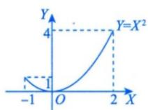

①当 $y < 0$ 时， $F_{Y}(y) = 0$ ；

②当 $0 \leqslant y < 1$ 时，

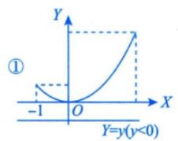

$$
\begin{array}{r l} F _ {Y} (y) & = P \{- \sqrt {y} \leqslant X \leqslant \sqrt {y} \} = P \{- \sqrt {y} \leqslant X <   0 \} + P \{0 \leqslant X \leqslant \sqrt {y} \} \\ & = \frac {1}{2} \sqrt {y} + \frac {1}{4} \sqrt {y} = \frac {3}{4} \sqrt {y}; \\ & \int_ {- \sqrt {y}} ^ {0} \frac {1}{2} d x + \int_ {0} ^ {\sqrt {y}} \frac {1}{4} d x \end{array}
$$

③当 $1 \leqslant y < 4$ 时，

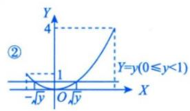

$$
F _ {Y} (y) = P \{- 1 \leqslant X <   0 \} + P \{0 \leqslant X \leqslant \sqrt {y} \} = \frac {1}{2} + \frac {1}{4} \sqrt {y};
$$

④当 $y\geqslant4$ 时， $F_{Y}(y)=1$ $\rightarrow\int_{-1}^{0}\frac{1}{2}dx+\int_{0}^{\sqrt{y}}\frac{1}{4}dx$

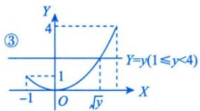

所以 $Y$ 的分布函数为

$$
F _ {Y} (y) = \left\{ \begin{array}{l l} 0, & y <   0, \\ \frac {3}{4} \sqrt {y}, & 0 \leqslant y <   1, \\ \frac {1}{2} + \frac {\sqrt {y}}{4}, & 1 \leqslant y <   4, \\ 1, & y \geqslant 4. \end{array} \right.
$$

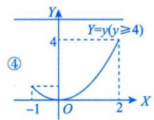

故 $Y$ 的概率密度为

$$
f _ {Y} (y) = \left\{ \begin{array}{l l} \frac {3}{8 \sqrt {y}}, & 0 <   y <   1, \\ \frac {1}{8 \sqrt {y}}, & 1 <   y <   4, \\ 0, & \text {其他}. \end{array} \right.
$$

综合题:

例 2.18 投保人的损失事件发生时，保险公司的赔付额 Y 与投保人的损失额 X 的关系为

$$
Y = \left\{ \begin{array}{l l} 0, & X \leqslant 1 0 0, \\ X - 1 0 0, & X > 1 0 0. \end{array} \right.
$$

设损失事件发生时，投保人的损失额X的概率密度为

$$
f (x) = \left\{ \begin{array}{l l} \frac {2 \times 1 0 0 ^ {2}}{(1 0 0 + x) ^ {3}}, & x > 0, \\ 0, & x \leqslant 0. \end{array} \right.
$$

(1) 求 $P\{Y > 0\}$ 及 EY;

（2）这种损失事件在一年内发生的次数记为 $N$ ，保险公司在一年内就这种损失事件产生的理赔次数记为 $M$ .假设 $N$ 服从参数为8的泊松分布，在 $N = n(n\geqslant 1)$ 的条件下， $M$ 服从二项分布 $B(n,p)$ ，其中 $p = P\{Y > 0\}$ ，求 $M$ 的概率分布.

解 (1) $P\{Y > 0\} = P\{X - 100 > 0\} = P\{X > 100\} = \int_{100}^{+\infty}\frac{2\times 100^2}{(100 + x)^3}\mathrm{d}x = \frac{1}{4}.$

$$
E Y = \int_ {1 0 0} ^ {+ \infty} (x - 1 0 0) \frac {2 \times 1 0 0 ^ {2}}{(1 0 0 + x) ^ {3}} \mathrm{d} x = 5 0.
$$

（2）由题知， $N\sim P(8),P\{M = m\mid N = n\} = C_n^m\left(\frac{1}{4}\right)^m\left(\frac{3}{4}\right)^{n - m},$ 由乘法公式可得

$$
\begin{array}{r l} P \{M = m, N = n \} & = P \{N = n \} P \{M = m \mid N = n \} \\ & = \frac {8 ^ {n}}{n !} \mathrm{e} ^ {- 8} \bullet C _ {n} ^ {m} \bullet \left(\frac {1}{4}\right) ^ {m} \bullet \left(\frac {3}{4}\right) ^ {n - m}, \end{array}
$$

其中 $m=0,1,\cdots,n;n=1,2,\cdots.$

故 $M$ 的概率分布为

$$
\begin{array}{r l} P \{M = m \} & = \sum_ {n = m} ^ {\infty} P \{M = m, N = n \} = \sum_ {n = m} ^ {\infty} \frac {8 ^ {n}}{n !} \mathrm{e} ^ {- 8} \cdot C _ {n} ^ {m} \cdot \left(\frac {1}{4}\right) ^ {m} \cdot \left(\frac {3}{4}\right) ^ {n - m} \\ & = \sum_ {n = m} ^ {\infty} \frac {8 ^ {n}}{n !} \mathrm{e} ^ {- 8} \cdot \frac {n !}{m ! (n - m) !} \left(\frac {1}{4}\right) ^ {m} \cdot \left(\frac {3}{4}\right) ^ {n - m} \\ & = \left(\frac {1}{4}\right) ^ {m} \mathrm{e} ^ {- 8} \frac {8 ^ {m}}{m !} \sum_ {n = m} ^ {\infty} \frac {8 ^ {n - m}}{(n - m) !} \cdot \left(\frac {3}{4}\right) ^ {n - m} \\ & = \left(\frac {1}{4}\right) ^ {m} \mathrm{e} ^ {- 8} \frac {8 ^ {m}}{m !} \sum_ {n = m} ^ {\infty} \frac {6 ^ {n - m}}{(n - m) !} = \frac {2 ^ {m}}{m !} \mathrm{e} ^ {- 8} \cdot \mathrm{e} ^ {6} = \frac {2 ^ {m}}{m !} \mathrm{e} ^ {- 2}, \end{array}
$$

即 $P\{M=m\}=\frac{2^{m}}{m!}\mathrm{e}^{-2},m=0,1,2,\cdots$ , 即 $M\sim P(2)$ .

注 本题第（2）问在2001年考研真题中出现过其中一部分，如下.

设某班车起点站上车人数 X 服从参数为 $\lambda(\lambda>0)$ 的泊松分布，每位乘客在中途下车的概率为 $p(0<p<1)$ ，且中途下车与否相互独立。以 Y 表示在中途下车的人数，求：

（1）在发车时有 $n$ 个乘客的条件下，中途有 $m$ 人下车的概率；

(2) 二维随机变量 $(X,Y)$ 的概率分布.

解 （1） $P\{Y=m \mid X=n\}=C_{n}^{m}p^{m}(1-p)^{n-m},0\leqslant m\leqslant n,n=0,1,2,\cdots.$

(2) $P\{X = n, Y = m\} = P\{Y = m \mid X = n\} P\{X = n\}$

$$
= \mathrm{C} _ {n} ^ {m} p ^ {m} (1 - p) ^ {n - m} \cdot \frac {\mathrm{e} ^ {- \lambda}}{n !} \lambda^ {n}, 0 \leqslant m \leqslant n, n = 0, 1, 2, \dots .
$$

https://chatgpt.com/g/g-p-6a1d6c6f0a408191a175c887909fceb5-xian-dai-he-gai-lu-lun-ocr/c/6a7091f2-f7fc-83ee-9420-daa514c07034

(注：部分内容可能由 AI 生成)
