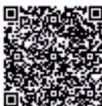

# 第五章 大数定律与中心极限定理.docx — 图像索引

> 由 MinerU 结构化结果生成。题目若依赖树形、拓扑、流程、曲线、区域、时序或其他空间关系，应核对这里的原图，不要只依据 OCR 文本推断。

## 图 1

原文页码：1；bbox：`[715, 275, 791, 331]`

## 图 2

原文页码：1；bbox：`[181, 585, 208, 607]`

## 图 3

原文页码：1；bbox：`[727, 586, 803, 642]`
