# 第六讲 数理统计.docx — 图像索引

> 由 MinerU 结构化结果生成。题目若依赖树形、拓扑、流程、曲线、区域、时序或其他空间关系，应核对这里的原图，不要只依据 OCR 文本推断。

## 图 1

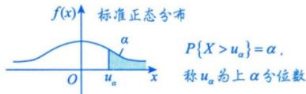

原文页码：8；bbox：`[284, 318, 517, 369]`

## 图 2

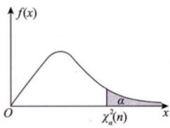

原文页码：8；bbox：`[616, 247, 763, 324]`

**图注：** 图 6-1 $(n>2)$

## 图 3

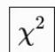

原文页码：9；bbox：`[537, 366, 574, 391]`

## 图 4

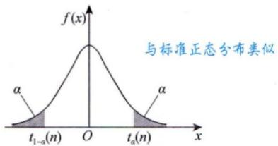

原文页码：10；bbox：`[260, 407, 497, 495]`

**图注：** 图6-2

## 图 5

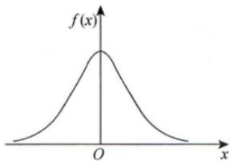

原文页码：10；bbox：`[527, 407, 700, 493]`

**图注：** 图6-3

## 图 6

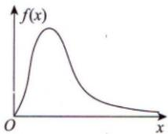

原文页码：12；bbox：`[218, 104, 347, 177]`

**图注：** 图6-4

## 图 7

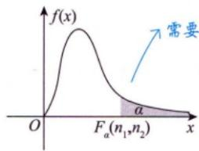

原文页码：12；bbox：`[401, 97, 554, 179]`

**图注：** 图6-5

## 图 8

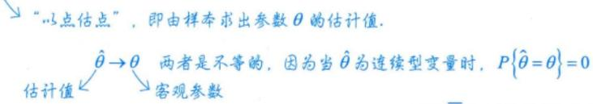

原文页码：27；bbox：`[285, 429, 727, 483]`

## 图 9

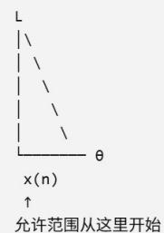

原文页码：34；bbox：`[181, 594, 290, 703]`

## 图 10

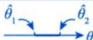

原文页码：42；bbox：`[389, 109, 468, 133]`

## 图 11

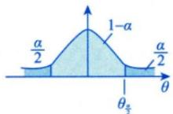

原文页码：42；bbox：`[647, 321, 779, 382]`

## 图 12

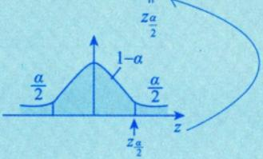

原文页码：43；bbox：`[208, 262, 406, 347]`

## 图 13

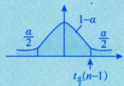

原文页码：43；bbox：`[640, 488, 788, 561]`

## 图 14

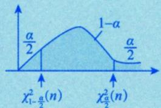

原文页码：43；bbox：`[655, 727, 815, 803]`

## 图 15

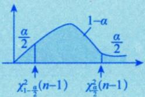

原文页码：44；bbox：`[692, 261, 842, 332]`

## 图 16

原文页码：48；bbox：`[754, 473, 838, 532]`

## 图 17

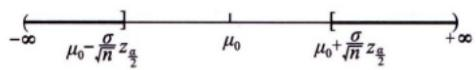

原文页码：53；bbox：`[342, 173, 630, 203]`

## 图 18

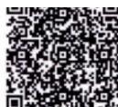

原文页码：54；bbox：`[729, 611, 806, 661]`

## 图 19

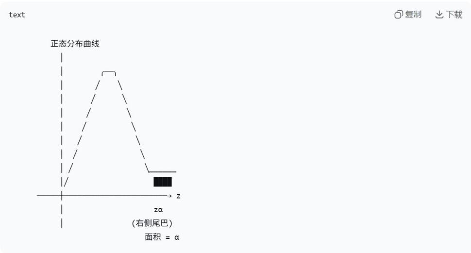

原文页码：57；bbox：`[178, 146, 764, 368]`

## 图 20

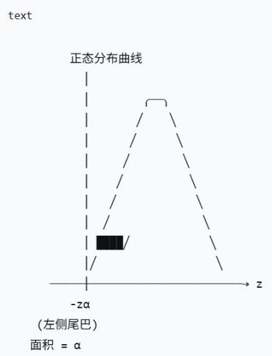

原文页码：57；bbox：`[181, 463, 418, 682]`

## 图 21

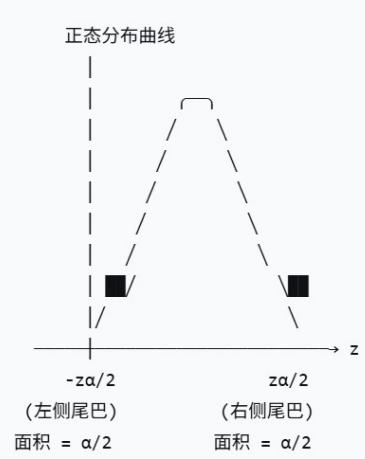

原文页码：58；bbox：`[200, 143, 420, 340]`

## 图 22

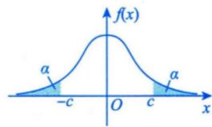

原文页码：60；bbox：`[670, 167, 830, 235]`

## 图 23

原文页码：61；bbox：`[196, 536, 223, 556]`

## 图 24

原文页码：66；bbox：`[200, 247, 226, 265]`
