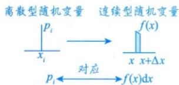
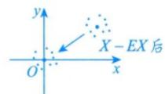
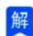
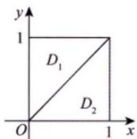

# 第四讲 随机变量的数字特征.docx — 图像索引

> 由 MinerU 结构化结果生成。题目若依赖树形、拓扑、流程、曲线、区域、时序或其他空间关系，应核对这里的原图，不要只依据 OCR 文本推断。

## 图 1

原文页码：3；bbox：`[396, 378, 579, 439]`

## 图 2

原文页码：4；bbox：`[371, 256, 497, 307]`

## 图 3

原文页码：14；bbox：`[200, 518, 228, 539]`

## 图 4

原文页码：17；bbox：`[196, 219, 221, 239]`

## 图 5

原文页码：17；bbox：`[702, 271, 806, 346]`

**图注：** 图4-1
