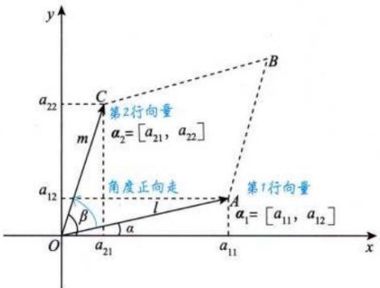
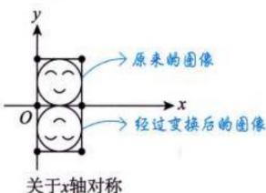
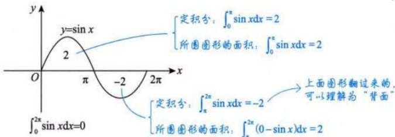
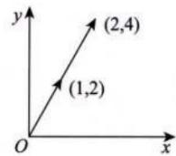
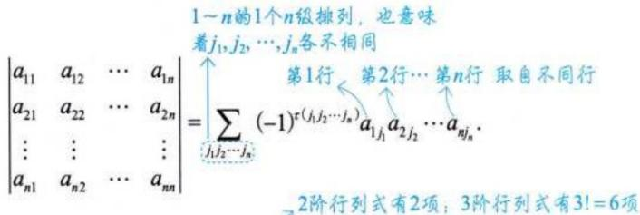
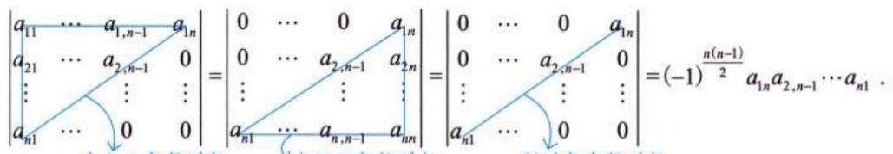
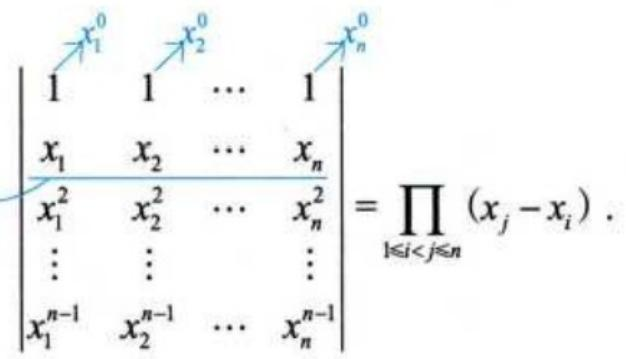
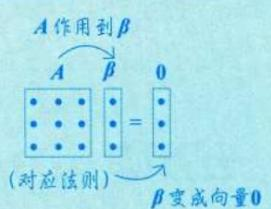

# 第一章 行列式.docx — 图像索引

> 由 MinerU 结构化结果生成。题目若依赖树形、拓扑、流程、曲线、区域、时序或其他空间关系，应核对这里的原图，不要只依据 OCR 文本推断。

## 图 1

原文页码：1；bbox：`[347, 300, 631, 453]`

**图注：** 图1-1

## 图 2

原文页码：2；bbox：`[618, 476, 794, 567]`

## 图 3

原文页码：2；bbox：`[287, 585, 695, 684]`

**图注：** 图 1-7 图1-8

## 图 4

原文页码：4；bbox：`[719, 108, 835, 180]`

**图注：** 图1-15

## 图 5

原文页码：4；bbox：`[347, 657, 774, 758]`

## 图 6

原文页码：6；bbox：`[215, 466, 836, 542]`

## 图 7

原文页码：9；bbox：`[428, 117, 806, 271]`

## 图 8

原文页码：19；bbox：`[176, 598, 205, 617]`

## 图 9

原文页码：21；bbox：`[645, 526, 808, 615]`
