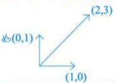
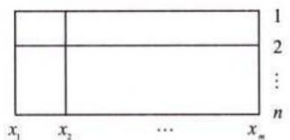
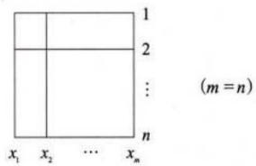
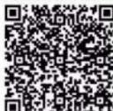
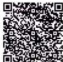
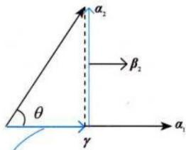

# 第三章 向量组.docx — 图像索引

> 由 MinerU 结构化结果生成。题目若依赖树形、拓扑、流程、曲线、区域、时序或其他空间关系，应核对这里的原图，不要只依据 OCR 文本推断。

## 图 1

原文页码：5；bbox：`[515, 571, 658, 644]`

## 图 2

原文页码：7；bbox：`[354, 678, 549, 745]`

## 图 3

原文页码：8；bbox：`[388, 105, 559, 184]`

## 图 4

原文页码：11；bbox：`[726, 609, 803, 663]`

## 图 5

原文页码：12；bbox：`[717, 319, 793, 372]`

## 图 6

原文页码：27；bbox：`[169, 321, 196, 338]`

## 图 7

原文页码：28；bbox：`[189, 205, 220, 225]`

## 图 8

原文页码：29；bbox：`[640, 316, 798, 406]`

**图注：** 图3-3

## 图 9

原文页码：30；bbox：`[206, 116, 231, 135]`

## 图 10

原文页码：30；bbox：`[191, 646, 218, 665]`
