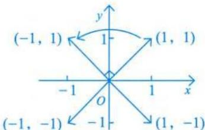

# 第二章 矩阵.docx — 图像索引

> 由 MinerU 结构化结果生成。题目若依赖树形、拓扑、流程、曲线、区域、时序或其他空间关系，应核对这里的原图，不要只依据 OCR 文本推断。

## 图 1

原文页码：8；bbox：`[191, 284, 221, 306]`

## 图 2

原文页码：29；bbox：`[569, 99, 778, 193]`

## 图 3

原文页码：30；bbox：`[189, 701, 215, 719]`
