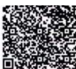
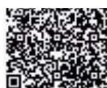
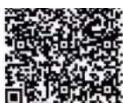
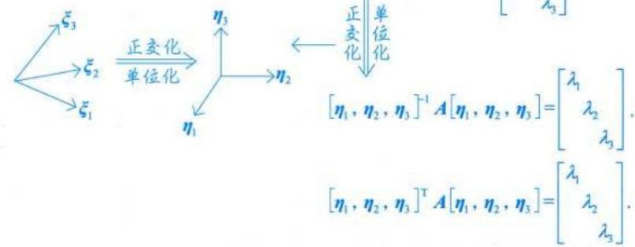
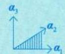
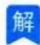
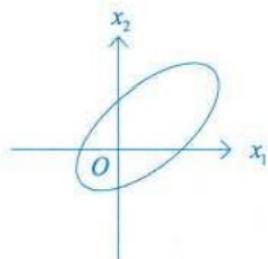
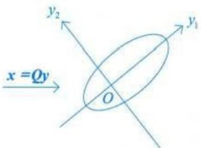

# 第五章 特征值与特征向量.docx

# 第五章 特征值与特征向量

## 知识点：

## 特征值与特征向量的定义：

## 特征值与特征向量的定义

要求是方阵，若非方阵，也可研究 $A^{T}A$ .

设 $A$ 是 $n$ 阶矩阵， $\lambda$ 是一个数，若存在 $n$ 维非零列向量 $\xi$ ，使得

$$
A \xi = \lambda \xi ,
$$

则称 $\lambda$ 是 A 的特征值， $\xi$ 是 A 的对应于特征值 $\lambda$ 的特征向量.

特征值反映矩阵特性，而这个特性能反映空间上数据的亲近程度或者数据的最值性质 $(A\xi$ 等于 $\lambda\xi$ ，相当于对 $\xi$ 进行放缩）

n阶矩阵有n个特征值

## 特征值与特征向量的求法：

## 矩阵的特征值与特征向量的求法

由此可知,上、下三角矩阵与对角矩阵的特征值就是其主对角线元素,

由①式，得 $(\lambda E-A)\xi=0$ ，
若 $\xi=0$ ，则体现不出 $\lambda$ 的作用了
因 $\xi \neq 0$ ，故齐次方程组 $(\lambda E - A)x = 0$ 有非零解，于是

因有非零解，
故 $\lambda E - A$ 的列向量是线性相关的

$$
\mathrm{于是} \lambda_ {1} = a _ {1 1}, \lambda_ {2} = a _ {2 2}, \lambda_ {3} = a _ {3 3}.
$$

$$
\left| \lambda E - A \right| = \left| \begin{array}{c c c c} \lambda - a _ {1 1} & - a _ {1 2} & \dots & - a _ {1 n} \\ - a _ {2 1} & \lambda - a _ {2 2} & \dots & - a _ {2 n} \\ \vdots & \vdots & & \vdots \\ - a _ {n 1} & - a _ {n 2} & \dots & \lambda - a _ {n n} \end{array} \right| = 0.\tag{②}
$$

②式称为 A 的特征方程，是未知量 $\lambda$ 的 n 次方程，有 n 个根（重根按照重数计）， $\lambda E - A$ 称为特征矩阵， $|\lambda E - A|$ 称为特征多项式.

于是，求解具体型矩阵的特征值与特征向量，一般先用特征方程 $|\lambda E - A| = 0$ 求出 $\lambda$ ，再解齐次线性方程组 $(\lambda E - A)x = 0$ ，求出特征向量.

$$
[ 2, 2, 2 ]
$$

$$
(\lambda E - A) X = 0
$$

要有非零解，要求是：

$$
| \lambda E - A | = 0
$$

也就是：

$$
\det (\lambda E - A) = 0
$$

等价地说：

$$
r (\lambda E - A) <   n
$$

这里的逻辑是：

$$
(\lambda E - A) X = 0
$$

是一个齐次线性方程组。

齐次线性方程组一定有零解：

$$
X = 0
$$

但要有非零解，系数矩阵必须不可逆，也就是行列式为0：

$$
\det (\lambda E - A) = 0
$$

在线性代数里，这个条件就是在求特征值：

$$
| \lambda E - A | = 0
$$

叫做矩阵 $A$ 的特征方程。

解出来的 $\lambda$ 是矩阵 $A$ 的特征值。

对应的非零解 $X$ 是矩阵 $A$ 属于特征值 $\lambda$ 的特征向量。

## 二、哪些情况可以直接看出来

## 1. 对角矩阵、上三角矩阵、下三角矩阵

例如

$$
A = \left( \begin{array}{c c c} 2 & 1 & 3 \\ 0 & - 1 & 4 \\ 0 & 0 & 5 \end{array} \right).
$$

这是上三角矩阵，所以特征值直接就是主对角线元素：

$$
\boxed {2, - 1, 5}.
$$

因为

$$
| \lambda E - A | = (\lambda - 2) (\lambda + 1) (\lambda - 5).
$$

## 重要提醒

只有三角矩阵、对角矩阵的特征值一定是主对角线元素。

普通矩阵不能直接看主对角线。

例如

$$
A = \left( \begin{array}{c c} 1 & 1 \\ 1 & 1 \end{array} \right)
$$

主对角线是 1, 1，但特征值却是

$$
\boxed {2, 0}.
$$

## 2. 每行元素之和相等

例如

$$
A = \left( \begin{array}{c c} 2 & 1 \\ 1 & 2 \end{array} \right).
$$

每行元素之和都是3，于是

$$
A \binom{1}{1} = \binom{3}{3} = 3 \binom{1}{1}.
$$

所以直接得到

$$
\boxed {\lambda = 3}
$$

是一个特征值，对应特征向量是

$$
(1, 1) ^ {T}.
$$

又因为特征值之和等于迹：

$$
\lambda_ {1} + \lambda_ {2} = \operatorname{tr} (A) = 2 + 2 = 4,
$$

所以另一个特征值是

$$
\lambda_ {2} = 4 - 3 = 1.
$$

因此不需要展开行列式，就能得到

$$
\boxed {\lambda_ {1} = 3, \quad \lambda_ {2} = 1.}
$$

你上传的整理资料中也使用了“各行元素之和相等 $\Rightarrow (1,1,\dots ,1)^T$ 是特征向量”，再结合迹求剩余特征值的方法。考研数学一\_线性代数重要知识点公式定理与满分例题\_张宇章节版

## 3.题目直接给出某个向量的作用结果

若已知

$$
A \binom{1}{- 1} = 2 \binom{1}{- 1},
$$

那么不用计算，直接知道

$$
2 \text {   是   } A \text {   的特征值   }.
$$

因为它已经完全符合

$$
A \boldsymbol {x} = \lambda \boldsymbol {x}.
$$

怎么识别

看到题目给出：

$$
A \alpha = k \alpha
$$

并且 $\alpha \neq 0$ ，立刻写：

k 是 A 的特征值， $\alpha$ 是对应特征向量.

## 4. 矩阵不可逆，可以直接看出0是特征值

如果

$$
| A | = 0
$$

或者

$$
r (A) <   n,
$$

那么齐次方程

$$
A \pmb {x} = 0
$$

有非零解。

于是存在 $\pmb{x} \neq 0$ ，使得

$$
A \boldsymbol {x} = 0 \boldsymbol {x}.
$$

所以

0 是 A 的特征值

反过来也成立：

$$
0 \text {是特征值} \iff | A | = 0 \iff A \text {不可逆}
$$

## 5. 已知矩阵的秩

由秩—零度定理：

$$
\dim N (A) = n - r (A).
$$

而 $N(A)$ 中的非零向量都满足

$$
A \boldsymbol {x} = 0 \boldsymbol {x},
$$

所以它们都是属于特征值0的特征向量。

例如 $A$ 是三阶矩阵，且

$$
r (A) = 1,
$$

那么

$$
\dim N (A) = 3 - 1 = 2.
$$

因此至少存在两个线性无关向量满足

$$
A \boldsymbol {x} = 0,
$$

所以0是特征值，并且属于0的线性无关特征向量有两个。

但是要注意：

$n - r(A)$ 首先表示特征值 0 的特征空间维数，不应在所有情况下直接说成“0 恰好是 $n - r(A)$ 重特征值”。

若矩阵可以相似对角化，特别是实对称矩阵，这时才能直接把它与重数对应起来。你上传的同济辅导资料也专门强调了这个区别。线性代数附册学习辅导与习题全解同济第七版OCR

## 6. 利用迹和行列式补出未知特征值

对于 $n$ 阶矩阵，按重数计算：

$$
\lambda_ {1} + \dots + \lambda_ {n} = \operatorname{tr} (A)
$$

以及

$$
\boxed {\lambda_ {1} \lambda_ {2} \dots \lambda_ {n} = | A |.}
$$

例如三阶矩阵已知两个特征值是1,3，并且

$$
\operatorname{tr} (A) = 6,
$$

那么第三个特征值为

$$
\lambda_ {3} = 6 - 1 - 3 = 2.
$$

如果只知道一个特征值，还可以结合行列式继续求。

## 7. 矩阵满足一个多项式关系

例如已知

$$
A ^ {2} - 3 A + 2 E = 0.
$$

设 $\lambda$ 是 $A$ 的特征值， $\pmb{x}$ 是相应特征向量，则

$$
A \boldsymbol {x} = \lambda \boldsymbol {x}.
$$

把原式作用在 $\pmb{x}$ 上：

$$
(A ^ {2} - 3 A + 2 E) \boldsymbol {x} = 0,
$$

得到

$$
(\lambda^ {2} - 3 \lambda + 2) \boldsymbol {x} = 0.
$$

由于 $\pmb{x} \neq 0$ ，所以

$$
\lambda^ {2} - 3 \lambda + 2 = 0,
$$

即

$$
(\lambda - 1) (\lambda - 2) = 0.
$$

因此特征值只能是

$$
\boxed {1 \text {或} 2.}
$$

注意这里只能说明特征值的可能取值是1,2，不能保证两个一定同时出现。

## 8. 相似矩阵的特征值相同

如果

$$
B = P ^ {- 1} A P,
$$

那么 $A, B$ 相似，它们具有相同的特征值。

特别地，如果已经知道

$$
P ^ {- 1} A P = \left( \begin{array}{c c c} 1 & 0 & 0 \\ 0 & 2 & 0 \\ 0 & 0 & 3 \end{array} \right),
$$

那么 $A$ 的特征值就是

$$
\boxed {1, 2, 3}.
$$

https://chatgpt.com/g/g-p-6a1d6c6f0a408191a175c887909fceb5-xian-dai-he-gai-lu-lun-ocr/c/6a5dd738-f544-83ee-96df-6b7946770dff

## 求根定理：

定理 设

$$
f (x) = 1 \cdot x ^ {k} + a _ {k - 1} x ^ {k - 1} + \dots + a _ {1} x + a _ {0}
$$

是系数 $a_{i}(i=0,1,2,\cdots,k-1)$ 都是整数的多项式，则 $f(x)=0$ 的有理根都是整数，且均是 $a_{0}$ 的因子。

例如，设3阶方阵 $\pmb{A}$ 的特征多项式为

$$
f (\lambda) = \left| \lambda E - A \right| = \lambda^ {3} - 4 \lambda^ {2} + 3 \lambda + 2,
$$

求矩阵 $\pmb{A}$ 的特征值.

解 根据上述定理， $f(\lambda)=0$ 的有理根只可能是 $\pm1,\pm2$ .计算得

$$
f (1) = 2 \neq 0, f (- 1) = - 6 \neq 0,
$$

$$
f (2) = 0, f (- 2) = - 2 8 \neq 0,
$$

故 $f(\lambda)=0$ 的有理根只有一个，即 $\lambda_{1}=2$ 。从而 $\lambda-2$ 是 $f(\lambda)$ 的一个因式。用多项式的带余除法可得

$$
f (\lambda) = (\lambda - 2) \left(\lambda^ {2} - 2 \lambda - 1\right).
$$

对二次多项式方程 $\lambda^{2}-2\lambda-1=0$ 用求根公式得出两个根为

$$
\lambda_ {2} = 1 + \sqrt {2}, \lambda_ {3} = 1 - \sqrt {2}.
$$

综上可知，A 的 3 个特征值为 $2, 1 + \sqrt{2}, 1 - \sqrt{2}$ .

## 特征值的重要性质与结论：

## 1 特征值的性质与重要结论

[QR Code]

→已知特征值,求参数

(1) $\lambda_0$ 是 $A$ 的特征值 $\Leftrightarrow |\lambda_0 E - A| = 0$ （建立方程求参数或证明行列式 $|\lambda_0 E - A| = 0$ ）；

$\lambda_{0}$ 不是A的特征值 $\Leftrightarrow\left|\lambda_{0}E-A\right|\neq0$ （矩阵可逆，满秩）.

注 这里常见的命题方法: 若 $|aA + bE| = 0$ (或 $aA + bE$ 不可逆), $a \neq 0$ , 则 $-\frac{b}{a}$ 是 $A$ 的特征值.

(2) 若 $\lambda_1, \lambda_2, \dots, \lambda_n$ 是 $A$ 的 $n$ 个特征值，则

$$
\left| b E - (- a A) \right| = (- a) ^ {n} \left| - \frac {b}{a} E - A \right| = 0, \text {则} \lambda_ {0} = - \frac {b}{a}
$$

$$
\left\{ \begin{array}{l} \left| A \right| = \lambda_ {1} \lambda_ {2} \dots \lambda_ {n}, \\ \operatorname{tr} (A) = \lambda_ {1} + \lambda_ {2} + \dots + \lambda_ {n}. \end{array} \right.
$$

如果有一个特征值为零 $\Rightarrow |A|=0 \Rightarrow A$ 不可逆.

## 注 以3阶矩阵为例，证明并作推广.

主子式：主对角线下标相同的行列式.

子式：下标任意的行列式.

设 $A=\begin{bmatrix}a_{11}&a_{12}&a_{13}\\ a_{21}&a_{22}&a_{23}\\ a_{31}&a_{32}&a_{33}\end{bmatrix}$ ，并定义3阶矩阵的k阶主子式为 $\left|\begin{matrix}a_{i_{1}i_{1}}&\cdots&a_{i_{1}i_{k}}\\ \vdots&&\vdots\\ a_{i_{k}i_{1}}&\cdots&a_{i_{k}i_{k}}\end{matrix}\right|$ ，则 $|\lambda E-A|=$

保证第1个元素两个下标相同,最后1个元素两个下标相同

保证第1个元素两个下标相同,最后1个元素两个下标相同 $\left|\begin{matrix}\lambda-a_{11}&-a_{12}&-a_{13}\\-a_{21}&\lambda-a_{22}&-a_{23}\\-a_{31}&-a_{32}&\lambda-a_{33}\end{matrix}\right|$ 是 $\lambda$ 的一元三次多项式,且1阶主子式为 $a_{11},a_{22},a_{33}$ ;2阶主子式为 $\left|\begin{matrix}a_{22}&a_{23}\\a_{32}&a_{33}\end{matrix}\right|=$

$A_{11},\left|\begin{matrix}a_{11}&a_{13}\\ a_{31}&a_{33}\end{matrix}\right|=A_{22},\left|\begin{matrix}a_{11}&a_{12}\\ a_{21}&a_{22}\end{matrix}\right|=A_{33};3$ 阶主子式为 $|A|$ ，则

$$
\left| \lambda E - A \right| = \left| \begin{array}{c c c} \lambda - a _ {1 1} & - a _ {1 2} & - a _ {1 3} \\ - a _ {2 1} & \lambda - a _ {2 2} & - a _ {2 3} \\ - a _ {3 1} & - a _ {3 2} & \lambda - a _ {3 3} \end{array} \right| = \left| \begin{array}{c c c} \lambda - a _ {1 1} & 0 - a _ {1 2} & 0 - a _ {1 3} \\ 0 - a _ {2 1} & \lambda - a _ {2 2} & 0 - a _ {2 3} \\ 0 - a _ {3 1} & 0 - a _ {3 2} & \lambda - a _ {3 3} \end{array} \right|,
$$

$\downarrow$ 任取3列里面的2列，
拼成8个行列式

将上述行列式全部拆开，得

按零元素最多的列进行代数余子式展开.

$$
\left| \lambda \boldsymbol {E} - \boldsymbol {A} \right| = \left| \begin{array}{l l l} \lambda & 0 & 0 \\ 0 & \lambda & 0 \\ 0 & 0 & \lambda \end{array} \right| + \left| \begin{array}{l l l} \lambda & 0 & - a _ {1 3} \\ 0 & \lambda & - a _ {2 3} \\ 0 & 0 & - a _ {3 3} \end{array} \right| + \left| \begin{array}{l l l} \lambda & - a _ {1 2} & 0 \\ 0 & - a _ {2 2} & 0 \\ 0 & - a _ {3 2} & \lambda \end{array} \right| + \left| \begin{array}{l l l} \lambda & - a _ {1 2} & - a _ {1 3} \\ 0 & - a _ {2 2} & - a _ {2 3} \\ 0 & - a _ {3 2} & - a _ {3 3} \end{array} \right| +
$$

-A的2阶立子式

$$
\left| \begin{array}{c c c} - a _ {1 1} & 0 & 0 \\ - a _ {2 1} & \lambda & 0 \\ - a _ {3 1} & 0 & \lambda \end{array} \right| + \left| \begin{array}{c c c} - a _ {1 1} & 0 & - a _ {1 3} \\ - a _ {2 1} & \lambda & - a _ {2 3} \\ - a _ {3 1} & 0 & - a _ {3 3} \end{array} \right| + \left| \begin{array}{c c c} - a _ {1 1} & - a _ {1 2} & 0 \\ - a _ {2 1} & - a _ {2 2} & 0 \\ - a _ {3 1} & - a _ {3 2} & \lambda \end{array} \right| + \left| \begin{array}{c c c} - a _ {1 1} & - a _ {1 2} & - a _ {1 3} \\ - a _ {2 1} & - a _ {2 2} & - a _ {2 3} \\ - a _ {3 1} & - a _ {3 2} & - a _ {3 3} \end{array} \right|
$$

$$
= \lambda^ {3} - \underbrace {(a _ {1 1} + a _ {2 2} + a _ {3 3})} _ {\text {   1阶主子式之和   }} \lambda^ {2} + \underbrace {(A _ {1 1} + A _ {2 2} + A _ {3 3})} _ {\text {   2阶主子式之和   }} \lambda - \left| \boldsymbol {A} \right|.\tag{①}
$$

设

$$
\begin{array}{r l} \left| \lambda E - A \right| & = (\lambda - \lambda_ {1}) (\lambda - \lambda_ {2}) (\lambda - \lambda_ {3}) \\ & = \lambda^ {3} - (\lambda_ {1} + \lambda_ {2} + \lambda_ {3}) \lambda^ {2} + (\lambda_ {1} \lambda_ {2} + \lambda_ {1} \lambda_ {3} + \lambda_ {2} \lambda_ {3}) \lambda - \lambda_ {1} \lambda_ {2} \lambda_ {3}. \end{array}\tag{②}
$$

比较①，②两式，得

$$
\left\{ \begin{array}{l} {a _ {1 1} + a _ {2 2} + a _ {3 3} = \lambda_ {1} + \lambda_ {2} + \lambda_ {3},} \\ {A _ {1 1} + A _ {2 2} + A _ {3 3} = \lambda_ {1} \lambda_ {2} + \lambda_ {1} \lambda_ {3} + \lambda_ {2} \lambda_ {3}, (k \text {阶主子式之和} = \text {任意} k \text {个特征值乘积之和})} \\ {\left| A \right| = \lambda_ {1} \lambda_ {2} \lambda_ {3}.} \end{array} \right.
$$

以后会经常用到这里的结论.

## 特征向量的重要性质与结论：

## 2 特征向量的性质与重要结论

(1) $\xi (\neq 0)$ 是 $A$ 的属于 $\lambda_0$ 的特征向量 $\Leftrightarrow \xi$ 是 $(\lambda_0E - A)x = 0$ 的非零解.

(2)重要结论.

举个例子来说明。

$$
A _ {3 \times 3}, \quad | \lambda E - A | = 0 \Rightarrow \lambda_ {1} = \lambda_ {2} = 3, \quad \lambda_ {3} = 7,
$$

不可能为3：行列式为0.
说明不满秩.
不可能为0：否则是3重根.

由 $s=n-r(3E-A)$ . 因为 3E-A 的秩有可能为 2 或 1.

所以无关特征向量可能有1个或2个.

①k重特征值 $\lambda$ 至多只有k个线性无关的特征向量(不用证明).

②若 $\xi_{1}, \xi_{2}$ 是 A 的属于不同特征值 $\lambda_{1}, \lambda_{2}$ 的特征向量，则 $\xi_{1}, \xi_{2}$ 线性无关.

→矩阵A

$\lambda_{1} \neq \lambda_{2} \Rightarrow \xi_{1}, \xi_{2}$ 线性无关

这句话主要是在说明：

特征值不同，可以直接保证对应的特征向量线性无关；但特征值相同，不能判断对应特征向量是否线性无关。

这条性质是单向的：

不同特征值 $\Longrightarrow$ 特征向量线性无关

但反过来不成立：

特征向量线性无关 $\Rightarrow$ 特征值不同.

因为刚才单位矩阵的

$\binom{1}{0},\quad\binom{0}{1}$

线性无关，但它们对应的是同一个特征值1。

你可以把图片中的内容记成一句话：

特征值不同，一定无关；特征值相同，无法判断。

https://chatgpt.com/g/g-p-6a1d6c6f0a408191a175c887909fceb5-xian-dai-he-gai-lu-lun-ocr/c/6a5cb1c7-a374-83ee-a366-62d9c37bde4c

注 证明： $n$ 阶方阵 $\pmb{A}$ 的任意两个不同特征值 $\lambda_1, \lambda_2$ 对应的两个特征向量线性无关.

证 设 A 的特征值 $\lambda_{1}, \lambda_{2} (\lambda_{1} \neq \lambda_{2})$ 对应的特征向量分别是 $\xi_{1}, \xi_{2} (\xi_{i} \neq 0, i = 1, 2)$ ，即

$$
A \xi_ {1} = \lambda_ {1} \xi_ {1}, A \xi_ {2} = \lambda_ {2} \xi_ {2}.
$$

考查

$$
k _ {1} \xi_ {1} + k _ {2} \xi_ {2} = 0.\tag{①}
$$

式①两端左边乘A，得

$$
A \left(k _ {1} \xi_ {1} + k _ {2} \xi_ {2}\right) = k _ {1} A \xi_ {1} + k _ {2} A \xi_ {2} = k _ {1} \lambda_ {1} \xi_ {1} + k _ {2} \lambda_ {2} \xi_ {2} = 0.\tag{②}
$$

式①两边乘 $\lambda_{1}$ ，得

$$
k _ {1} \lambda_ {1} \xi_ {1} + k _ {2} \lambda_ {1} \xi_ {2} = 0.\tag{③}
$$

式③减式②，得 $k_{2}(\lambda_{1} - \lambda_{2})\xi_{2} = 0$ ，因 $\lambda_1\neq \lambda_2$ ， $\xi_{2}\neq 0$ ，故 $k_{2} = 0$

将 $k_{2} = 0$ 代入式①，因 $\xi_1\neq 0$ ，得 $k_{1} = 0$ ，故不同特征值 $\lambda_1,\lambda_2$ 对应的特征向量线性无关.

## 特征值与特征向量的几何意义：

一句话理解特征值的几何意义

对于矩阵 $A$ ，若存在非零向量 $\pmb{x}$ ，使

$$
A \boldsymbol {x} = \lambda \boldsymbol {x},
$$

那么：

\- $x$ 给出了一个经过线性变换后方向不发生本质改变的特殊方向；

\- $\lambda$ 表示这个方向上的向量被伸缩多少倍。

因此：

特征向量表示矩阵变换中的不变方向，特征值表示沿该方向的伸缩倍数。

张宇讲义中也是从这个角度解释的：当 $Ax = 3x$ 时，矩阵 $A$ 作用在这个特定方向上，就是把向量变成原来的3倍；但这并不表示 $A$ 作用在所有向量上都会放大三倍。27张宇基础30讲线代OCR

## 7. 最后形成一个整体图像

把平面想象成一张橡皮膜，矩阵 $A$ 对橡皮膜进行拉伸、压缩、剪切或翻转。

在复杂变形中，有一些特殊直线在变换后仍然保持为自身：

$$
\boxed {\text {这些直线叫特征方向}}
$$

在这些直线上，矩阵只做简单的倍数伸缩：

$$
\text {伸缩倍数就是特征值}
$$

因此最核心的记忆是：

$$
\boxed {A \boldsymbol {x} = \lambda \boldsymbol {x}}
$$

表示:

x 所在的直线不变，沿该直线伸缩 $\lambda$ 倍

其中：

<table><tr><td>λ</td><td>几何效果</td></tr><tr><td>λ&gt;1</td><td>拉伸</td></tr><tr><td>0&lt;λ&lt;1</td><td>压缩</td></tr><tr><td>λ=1</td><td>不变</td></tr><tr><td>λ&lt;0</td><td>反向并按|λ|倍伸缩</td></tr><tr><td>λ=0</td><td>压到原点</td></tr></table>

https://chatgpt.com/g/g-p-6a1d6c6f0a408191a175c887909fceb5-xian-dai-he-gai-lu-lun-ocr/c/6a5cb826-27e0-83e8-8a43-0dac7398d3cf

③若 $\xi_{1}, \xi_{2}$ 是 A 的属于同一特征值 $\lambda$ 的特征向量，则非零向量 $k_{1}\xi_{1} + k_{2}\xi_{2}$ 仍是 A 的属于特征值 $\lambda$ 的特征向量。（常考其中一个系数（如 $k_{2}$ ）等于 0 的情形）

④若 $\xi_{1}, \xi_{2}$ 是 A 的属于不同特征值 $\lambda_{1}, \lambda_{2}$ 的特征向量，则当 $k_{1} \neq 0, k_{2} \neq 0$ 时， $k_{1}\xi_{1} + k_{2}\xi_{2}$ 不是 A 的任何特征值的特征向量。（常考 $k_{1} = k_{2} = 1$ 的情形）

从几何角度去理解. $A\xi=\lambda\xi,\lambda_{1}$ 对应 $\xi_{1},\lambda_{2}$ 对应 $\xi_{2},$ $k_{1}\xi_{1}+k_{2}\xi_{2}$ 既不在 $\lambda_{1}$ 作用的 $\xi_{1}$ 上，
也不在 $\lambda_{2}$ 作用的 $\xi_{2}$ 上，所以它不是特征向量

注证 反证法. 假设 $k_{1}\xi_{1} + k_{2}\xi_{2}$ 是 $\pmb{A}$ 的特征向量，则存在数 $\lambda$，有
$\begin{array}{l} A(k_1\xi_1 + k_2\xi_2) = \lambda (k_1\xi_1 + k_2\xi_2), \\ k_1A\xi_1 + k_2A\xi_2 = k_1\lambda \xi_1 + k_2\lambda \xi_2, \\ k_1\lambda_1\xi_1 + k_2\lambda_2\xi_2 = k_1\lambda \xi_1 + k_2\lambda \xi_2, \\ k_1(\lambda_1 - \lambda)\xi_1 + k_2(\lambda_2 - \lambda)\xi_2 = 0. \\ k_1(\lambda_1 - \lambda) = 0, \\ k_2(\lambda_2 - \lambda) = 0. \end{array}$
即
也即
移项，得
由于 $\xi_{1}, \xi_{2}$ 线性无关，则
$\left\{\begin{aligned}k_{1}(\lambda_{1}- \lambda)=0,\\k_{2}(\lambda_{2}- \lambda)=0.\end{aligned}\right.$
又 $k_{1} \neq 0, k_{2} \neq 0$，则 $\lambda_{1}=\lambda_{2}=\lambda$，与 $\lambda_{1} \neq \lambda_{2}$ 矛盾，故 $k_{1}\xi_{1}+k_{2}\xi_{2}$ 不是 $\pmb{A}$ 的任何特征值的特征向量.

$\rightarrow$ 给一个 $\lambda_{1}\rightarrow$ 作用于 $\xi_{1}$ ;另给一个不同的 $\lambda_{2}\rightarrow$ 作用于另一个空间向量 $\xi_{2}$

⑤设 $\lambda_{1}, \lambda_{2}$ 是 A 的两个不同的特征值， $\xi$ 是对应于 $\lambda_{1}$ 的特征向量，则 $\xi$ 不是对应于 $\lambda_{2}$ 的特征向量（即一个特征向量不能属于两个不同的特征值）.

注 证 用反证法. 由题设知 $A\xi = \lambda_1\xi$ . 若 $\xi$ 也是 $A$ 的对应于 $\lambda_{2}$ 的特征向量, 则有 $A\xi = \lambda_{2}\xi$ , 即得 $\lambda_{1}\xi = \lambda_{2}\xi$ , 即 $(\lambda_{1} - \lambda_{2})\xi = 0$ . 由于 $\xi \neq 0$ , 故 $\lambda_{1} = \lambda_{2}$ , 这与已知 $\lambda_{1} \neq \lambda_{2}$ 矛盾, 故一个特征向量不能属于两个不同的特征值.

## 特征值对应的特征向量：

若 $\lambda$ 是矩阵 $A$ 的 $k$ 重特征值，那么属于 $\lambda$ 的线性无关特征向量至多有 $k$ 个。

张宇在这里先给出了：属于 $\lambda$ 的线性无关特征向量个数为

$$
n - r (\lambda I - A),
$$

随后给出“k 重特征值至多对应 k 个线性无关特征向量”这一结论。
27张宇基础30讲线代\_OCR
这句话真正想区分的是两个非常容易混淆的“个数”。

假设特征方程是

$$
| \mu I - A | = (\mu - \lambda) ^ {k} q (\mu), \quad q (\lambda) \neq 0.
$$

这说明 $\lambda$ 在特征方程里重复出现了 $k$ 次，称为：

$$
\lambda \text {的代数重数为} k
$$

但是，求属于 $\lambda$ 的特征向量时，解的是

$$
(\lambda I - A) x = 0.
$$

这个齐次方程组的基础解系中有多少个向量，才表示有多少个线性无关的特征向量：

$$
\mathrm{线性无关特征向量个数} = n - r (\lambda I - A)
$$

这个数称为 $\lambda$ 的几何重数。

所以截图里的结论就是：

几何重数 $\leq$ 代数重数

也就是

$$
n - r (\lambda I - A) \leq k
$$

## 六、和矩阵的秩怎么联系？

属于 $\lambda$ 的线性无关特征向量个数是

$$
n - r (\lambda I - A).
$$

而它至多为 $k$ ，所以

$$
n - r (\lambda I - A) \leq k.
$$

整理得

$$
\boxed {r (\lambda I - A) \geq n - k}
$$

这是考研里非常重要的结论。

如果希望一个 $k$ 重特征值恰好有 $k$ 个线性无关特征向量，就必须有

$$
n - r (\lambda I - A) = k,
$$

即

$$
\boxed {r (\lambda I - A) = n - k}
$$

因此：

$$
\begin{array}{r l} & {\left| r (\lambda I - A) = n - k \Longleftrightarrow \lambda \text {有} k \text {个线性无关特征向量}; \right.} \\ & {\left| r (\lambda I - A) > n - k \Longleftrightarrow \lambda \text {不足} k \text {个线性无关特征向量}. \right.} \end{array}
$$

$$
\begin{array}{l} \text {https://chatgpt.com / g / g - p - 6a1d6c6f0a408191a175c887909fceb5 - xian - dai - he - gai - lu - lun - ocr/} \\ \text {c / 6a5f047a - de5c - 83ee - 8530 - 839ba08997f3} \end{array}
$$

常用矩阵的特征值与特征向量：

## 3 常用矩阵的特征值与特征向量

多项式函数 $f(a)$ ，比如 $f(a)=a^{3}-2a+5$ 。

A 以及与 A 有关的常用矩阵的特征值和特征向量总结如下：则矩阵多项式 $f(A)=A^{3}-2A+5E$

<table><tr><td>矩阵</td><td> $A$ </td><td> $kA$ </td><td> $A^{k}$ </td><td> $f(A)$ </td><td> $A^{-1}$ </td><td> $A^{*}$ </td><td> $P^{-1}AP$ </td></tr><tr><td>特征值</td><td> $\lambda$ </td><td> $k\lambda$ </td><td> $\lambda^{k}$ </td><td> $f(\lambda)$ </td><td> $\frac{1}{\lambda}$ </td><td> $\frac{|A|}{\lambda}$ </td><td> $\lambda$ </td></tr><tr><td>对应的特征向量</td><td> $\xi$ </td><td> $\xi$ </td><td> $\xi$ </td><td> $\xi$ </td><td> $\xi$ </td><td> $\xi$ </td><td> $P^{-1}\xi$ </td></tr></table>

## 注 (1) 表中若 $\lambda$ 在分母上，设 $\lambda \neq 0$

(2) 第 3, 4, 5 列的证明. 设 $n$ 阶矩阵 $\pmb{A}$ 有特征值 $\lambda$ , 对应的特征向量为 $\xi$ . 求 $k\pmb{A}, \pmb{A}^k, f(\pmb{A})$ 的特征值和特征向量, 其中 $f(x) = a_0 + a_1x + \dots + a_nx^n$ .

解 利用定义，由题设条件，有 $\xi \neq 0$ ，且

$$
A \xi = \lambda \xi .\tag{①}
$$

式①两端乘k，得

$$
k A \xi = k \lambda \xi , (k A) \xi = (k \lambda) \xi ,\tag{②}
$$

故由式②知，kA有特征值 $k\lambda$ ，对应的特征向量仍是 $\xi$ .

式①两端左边连着乘k-1个A，并逐个代入式①，得

$$
\boldsymbol {A} ^ {k} \xi = \lambda \boldsymbol {A} ^ {k - 1} \xi = \lambda^ {2} \boldsymbol {A} ^ {k - 2} \xi = \dots = \lambda^ {k} \xi ,\tag{③}
$$

由式③知， $A^{k}$ 有特征值 $\lambda^{k}$ ，对应的特征向量仍是 $\xi$ .

由式①，②，③得

$$
\begin{array}{r l} f (A) \xi & = (a _ {0} E + a _ {1} A + a _ {2} A ^ {2} + \dots + a _ {n} A ^ {n}) \xi \\ & = a _ {0} \xi + a _ {1} A \xi + a _ {2} A ^ {2} \xi + \dots + a _ {n} A ^ {n} \xi \\ & = a _ {0} \xi + a _ {1} \lambda \xi + a _ {2} \lambda^ {2} \xi + \dots + a _ {n} \lambda^ {n} \xi = f (\lambda) \xi , \end{array}\tag{④}
$$

由式④知， $f(A)$ 有特征值 $f(\lambda)$ ，对应的特征向量仍是 $\xi$ .

(3)第6,7,8列的证明.设 $n$ 阶可逆矩阵 $\pmb{A}$ 有特征值 $\lambda$ ,对应的特征向量为 $\xi$ .求 $A^{-1}, A^{*}, P^{-1}AP(P$ 为可逆矩阵)的特征值和特征向量.

解 由题设条件知，

$$
A \xi = \lambda \xi , \xi \neq 0.\tag{*}
$$

(\*)式两端左边乘 $A^{-1}$ ，且由 $|A|=\lambda_{1}\lambda_{2}\cdots\lambda_{n}\neq0$ ，知 $\lambda\neq0$ ，得

$$
\boldsymbol {A} ^ {- 1} \boldsymbol {A} \xi = \xi = \lambda \boldsymbol {A} ^ {- 1} \xi ,
$$

$$
A ^ {- 1} \xi = \frac {1}{\lambda} \xi ,
$$

故 $A^{-1}$ 有特征值 $\frac{1}{\lambda}$ ，对应的特征向量仍是 $\xi$ .

(\*)式两端左边乘 $A^{*}$ ，得

$$
\boldsymbol {A} ^ {*} \boldsymbol {A} \xi = | \boldsymbol {A} | \boldsymbol {E} \xi = \lambda \boldsymbol {A} ^ {*} \xi ,
$$

$$
\boldsymbol {A} ^ {*} \xi = \frac {| \boldsymbol {A} |}{\lambda} \xi ,
$$

故 $A^{*}$ 有特征值 $\frac{|A|}{\lambda}$ ，对应的特征向量仍是 $\xi$ .（若A有特征值 $\lambda_{1},\lambda_{2},\cdots,\lambda_{n}$ ，因 $|A|=\prod_{i=1}^{n}\lambda_{i}$ ，故 $A^{*}$ 的特征值为 $\lambda_{2}\lambda_{3}\cdots\lambda_{n},\lambda_{1}\lambda_{3}\cdots\lambda_{n},\cdots,\lambda_{1}\lambda_{2}\cdots\lambda_{n-1}$ .）

因为 $P^{-1}APP^{-1}\xi=\lambda P^{-1}\xi$ ，即 $P^{-1}AP(P^{-1}\xi)=\lambda(P^{-1}\xi)$ ，故 $\lambda$ 是 $P^{-1}AP$ 的特征值，对应的特征向量是 $P^{-1}\xi$ 。这是把单位矩阵 E 变成了 $PP^{-1}$

(4) $f(x)$ 为多项式，若矩阵A满足 $f(A)=0,\lambda$ 是A的任一特征值，则 $\lambda$ 满足 $f(\lambda)=0$ .

$$
\left| \lambda E - A ^ {T} \right| = \left| (\lambda E - A) ^ {T} \right| = \left| \lambda E - A \right|, \text {   故特征值相同，但   } (\lambda E - A) x = 0 \text {   与   }
$$

$(\lambda E-A^{\mathrm{T}})x=0$ 是不同的方程组，故特征向量要单独计算才能得出.

(5) 虽然 $A^{T}$ 的特征值与 A 相同，但特征向量不再是 $\xi$ .

## 5. 几何上怎么理解

相似矩阵

$$
B = P ^ {- 1} A P
$$

可以理解为：A 和 B 描述的是同一个线性变换，只不过使用了不同的坐标系。

若旧坐标向量为 $\xi$ ，新坐标向量记作 $\eta$ ，且

$$
\xi = P \eta ,
$$

那么

$$
\eta = P ^ {- 1} \xi .
$$

因此：

\- $\xi$ ：特征向量在旧坐标系下的坐标；

\- $P^{-1}\xi$ ：同一个几何向量在新坐标系下的坐标。

所以不是特征方向本身发生了本质变化，而是它的坐标表示发生了变化。

## 1. 相似矩阵本质上在做什么？

公式:

$$
B = P ^ {- 1} A P
$$

它描述的是：同一个线性变换，在两个不同坐标系下的表现。

\- $A$ ：是在“旧坐标系”下描述的变换；

\- $B$ ：是在“新坐标系”下描述的同一个变换；

\- $P$ ：把新坐标系下的向量“翻译”回旧坐标系的翻译工具；

\- $P^{-1}$ : 是它的逆翻译。

坐标变换：https://chatgpt.com/g/g-p-6a1d6c6f0a408191a175c887909fceb5-xian-dai-he-gailu-lun-ocr/c/6a82ef74-3a04-83ee-b313-72c764a243f9

6. 考试中直接记忆

若

$$
A \xi = \lambda \xi ,
$$

则：

$P^{-1}AP$ 的特征值仍为 $\lambda$

对应特征向量为

$$
\boxed {P ^ {- 1} \xi}.
$$

反过来，如果矩阵写成

$$
P A P ^ {- 1},
$$

那么对应特征向量才是

$$
\boxed {P \xi}.
$$

可以记成:

矩阵外面左边乘谁，特征向量就乘谁

例如：

$$
P ^ {- 1} A P \quad \Longrightarrow \quad P ^ {- 1} \xi .
$$

而且 $P^{-1}\xi \neq 0$ ，因为 $P^{-1}$ 可逆，不可能把非零向量变成零向量。

秩为 1 的矩阵的性质:

## 一、核心认识：秩为1就是“所有信息只有一个方向”

设 $A$ 是 $m \times n$ 非零矩阵，且

$$
r (A) = 1.
$$

它的几何意义是:

$$
A: \mathbb {R} ^ {n} \longrightarrow \mathbb {R} ^ {m}
$$

无论输入什么向量，输出 $Ax$ 都落在同一条直线上。

因此，理解秩一矩阵的最好入口是：

$$
\boxed {A = \alpha \beta^ {T}}
$$

其中

$$
\alpha \in \mathbb {R} ^ {m}, \quad \beta \in \mathbb {R} ^ {n}
$$

都是非零列向量。

同济附册也给出了秩一矩阵可以表示成“列向量乘行向量”的结论。 线性代数附册 学习辅导与习题全解 同济第七版\_OCR

看到你问“这里的 $\alpha$ 和 $\beta$ 是什么”，我先直接回答：它们是两个非零向量， $\alpha$ 是列向量（ $m \times 1$ ）， $\beta$ 也是列向量（ $n \times 1$ ），而 $\beta^T$ 是行向量（ $1 \times n$ ）。它们的乘积 $\alpha \beta^T$ 就构成了秩为 1 的矩阵。

## 二、任意秩一矩阵都能写成 $A = \alpha \beta^T$

例如

$$
A = \left( \begin{array}{c c c} 1 & 2 & 3 \\ 2 & 4 & 6 \\ - 1 & - 2 & - 3 \end{array} \right).
$$

因为每一列都是第一列的倍数:

$$
\left( \begin{array}{c} 2 \\ 4 \\ - 2 \end{array} \right) = 2 \left( \begin{array}{c} 1 \\ 2 \\ - 1 \end{array} \right), \qquad \left( \begin{array}{c} 3 \\ 6 \\ - 3 \end{array} \right) = 3 \left( \begin{array}{c} 1 \\ 2 \\ - 1 \end{array} \right),
$$

所以

$$
A = \left( \begin{array}{c} 1 \\ 2 \\ - 1 \end{array} \right) \left( \begin{array}{c c c} 1 & 2 & 3 \end{array} \right).
$$

即

$$
\alpha = \left( \begin{array}{c} 1 \\ 2 \\ - 1 \end{array} \right), \qquad \beta = \left( \begin{array}{c} 1 \\ 2 \\ 3 \end{array} \right).
$$

注意，这种分解不唯一。例如任取 $k \neq 0$

$$
A = (k \alpha) \left(\frac {1}{k} \beta\right) ^ {T}.
$$

## 六、秩一方阵最重要的特征值性质

下面假设 $A$ 是 $n$ 阶方阵，且 $r(A) = 1$ 。

由于

$$
\dim N (A) = n - 1,
$$

所以

$$
\lambda = 0
$$

至少有 $n - 1$ 个线性无关的特征向量。

因此 $A$ 的特征值结构一定是：

$$
\left| 0, 0, \dots , 0, \operatorname{tr} (A) \right|
$$

即：

\- 0 至少出现 $n - 1$ 次;

\- 另一个特征值是 $\operatorname{tr}(A)$ 。

更准确地说，特征多项式为

$$
\left| \det (\lambda E - A) = \lambda^ {n - 1} (\lambda - \operatorname{tr} A) \right|.
$$

你上传的有道讲义也将秩一方阵的特征值总结为： $n - 1$ 个零特征值，另一个特征值为 $\operatorname{tr}(A)$ 。

你现在可以把这整段压缩成一条逻辑链

$$
\begin{array}{r l} & \boxed {r (A) = 1} \\ & \quad \Downarrow \\ & \boxed {\dim N (A) = n - 1} \\ & \quad \Downarrow \\ & \boxed {A x = 0 \text {有} n - 1 \text {个线性无关解}} \end{array}
$$

而

$$
\begin{array}{r l} & A x = 0 \iff A x = 0 x \\ & \Downarrow \\ & \boxed {\lambda = 0 \text {有} n - 1 \text {个线性无关特征向量}} \\ & \Downarrow \\ & \boxed {0 \text {的几何重数} = n - 1} \\ & \Downarrow \\ & \boxed {0 \text {的代数重数} \geq n - 1} \end{array}
$$

这条链一旦搞懂，秩—方程组—特征值—特征向量这几章就真正连起来了。

## 为什么另一个特征值是迹？

因为特征值之和等于矩阵的迹。

已有 $n - 1$ 个特征值为零，所以剩下的特征值只能是

$$
\lambda = \operatorname{tr} (A).
$$

也可以利用

$$
A = \alpha \beta^ {T}
$$

直接计算：

$$
A \alpha = \alpha \beta^ {T} \alpha = (\beta^ {T} \alpha) \alpha .
$$

所以 $\alpha$ 是特征向量，对应特征值

$$
\lambda = \beta^ {T} \alpha .
$$

另一方面，

$$
\mathbf {t r} (\alpha \beta^ {T}) = \beta^ {T} \alpha ,
$$

因此

$$
\lambda = \operatorname{tr} (A).
$$

## 非零列向量是特征向量

因为 $A$ 的任意非零列都等于 $k\alpha$ ，而

$$
A \alpha = \operatorname{tr} (A) \alpha ,
$$

所以：

$A$ 的任意非零列向量，都是对应于 $\lambda = \operatorname{tr}(A)$ 的特征向量

这一结论也在有道讲义中作为秩一矩阵的常用结论给出。 2027考研数学-线代概率核心基础--有道武忠祥\_OCR

但是注意：

非零行向量的转置一般是 $A^T$ 的特征向量

不一定是 A 的特征向量。

https://chatgpt.com/g/g-p-6a1d6c6f0a408191a175c887909fceb5-xian-dai-he-gai-lu-lun-ocr/c/6a8306d1-a530-83ee-bbb2-4f8880ac5ab8

## 七、最重要的幂运算公式

设

$$
A = \alpha \beta^ {T}.
$$

则

$$
\begin{array}{c} A ^ {2} = (\alpha \beta^ {T}) (\alpha \beta^ {T}) \\ = \alpha (\beta^ {T} \alpha) \beta^ {T} \\ = (\beta^ {T} \alpha) A. \end{array}
$$

又因为

$$
\beta^ {T} \alpha = \operatorname{tr} (A),
$$

所以

$$
\boxed {A ^ {2} = \operatorname{tr} (A) A.}
$$

进一步：

$$
\boxed {A ^ {k} = [ \operatorname{tr} (A) ] ^ {k - 1} A, \quad k \geq 1}
$$

这是秩一方阵做矩阵高次幂时最重要的结论。

## 十二、考研中建议优先记住的结论

设 $A$ 为 $n \geq 2$ 阶秩一方阵：

$A = \alpha\beta^{T};$ 
所有非零行互相成比例，所有非零列互相成比例；
 $|A| = 0;$ $\dim N(A) = n - 1;$ 
特征值为  $0, \ldots, 0, \operatorname{tr}(A);$ $A^{2} = \operatorname{tr}(A)A;$ $A^{k} = [\operatorname{tr}(A)]^{k-1}A;$ 
A 可对角化  $\Longleftrightarrow \operatorname{tr}(A) \neq 0;$ $n = 2 \Rightarrow r(A^{*}) = 1;$ $n \geq 3 \Rightarrow A^{*} = O.$

其中做题时最有价值的识别链是：

$$
\boxed {r (A) = 1 \Longrightarrow A = \alpha \beta^ {T} \Longrightarrow A ^ {2} = \operatorname{tr} (A) A \Longrightarrow A ^ {k} = [ \operatorname{tr} (A) ] ^ {k - 1} A}
$$

完整的部分：https://chatgpt.com/g/g-p-6a1d6c6f0a408191a175c887909fceb5-xian-dai-he-gai-lu-lun-ocr/c/6a5cc979-c2e0-83ee-89e6-30a2eac32510

## 矩阵的相似

A 与 B 等价：

要求 A 与 B 同型，QAP = B

## 1 定义

等价的前提下 P 与 Q 没关系，
相似的前提下 P 与 Q 互为逆矩阵且 $Q$ 与 $\pmb{P}$ 是可逆矩阵.

现在我们将条件严格限制一下： $A$ 与 $B$ 不仅同型且是方阵，可以看出相似是特殊化的等价.

设 $A, B$ 是两个 $n$ 阶方阵，若存在 $n$ 阶可逆矩阵 $P$ ，使得 $P^{-1}AP = B$ ，则称 $A$ 相似于 $B$ ，记成 $A \sim B$

注 (1) $A \sim A$ ; (反身性)

(2) 若 $A \sim B$ ，则 $B \sim A$ ；（对称性）性质(3)最重要

(3) 若 $A \sim B, B \sim C$ ，则 $A \sim C$ . (传递性) 这个性质以后常用.

如何证明矩阵相似？
①定义法：
②传递法。

## 2 相似矩阵的性质

考研中用传递性证明相似时一般证 $A$ 相似于对角矩阵 $\pmb{A}_1$ ， $B$ 相似于对角矩阵 $\pmb{A}_2$ ，相似的对角矩阵 $\pmb{A}_1$ 与 $\pmb{A}_2$ 一样，则 $A$ 与 $B$ 相似.

若 $A \sim B$ ，则

① $\left|A\right|=\left|B\right|$ . $\rightarrow$ 因为 $P^{-1}AP=B$ ，有 $\left|P^{-1}AP\right|=\left|B\right|$ ，从而 $\left|A\right|=\left|B\right|$ .

② $r(A)=r(B)$ $\longrightarrow$ ①相似是特殊化等价，所以 $r(A)=r(B)$ ;

② $P^{-1}AP=B$ ，A右乘矩阵P，左乘矩阵 $P^{-1}$ ，秩不变.

③ $\operatorname{tr}(\mathbf{A}) = \operatorname{tr}(\mathbf{B})$ . $\longrightarrow$ 因为 $\mathbf{A}$ 与 $\mathbf{B}$ 的特征值一样，特征值之和等于主对角线元素之和.

④ $\lambda_{A}=\lambda_{B}$ （或 $\left|\lambda E-A\right|=\left|\lambda E-B\right|$ ）.

→相似矩阵特征值一样，见“三”的“3”

$$
\begin{array}{r l} & \left| \lambda E - B \right| = \left| \lambda E - P ^ {- 1} A P \right| \\ & = \left| P ^ {- 1} \lambda E P - P ^ {- 1} A P \right| \\ & = \left| P ^ {- 1} (\lambda E - A) P \right| \\ & = \left| \lambda E - A \right|. \end{array}
$$

⑥A, B 的各阶主子式之和分别相等.

⑤ $r(\lambda E-A)=r(\lambda E-B)$ . $\longrightarrow A$ 与 B 相似，则 $\lambda E-A$ 与 $\lambda E-B$ 相似.

注 (1) 若①, ②, ③, ④, ⑤, ⑥中至少有一个不成立, 则 $A$ 不相似于 $\pmb{B}$ .

(2) 性质⑤的证明方法如下.

证 若 $A \sim B$ ，则 $\lambda E - A \sim \lambda E - B$ ，所以 $r(\lambda E - A) = r(\lambda E - B)$ 。事实上，由 $A \sim B$ ，知存在可逆矩阵 P，使得 $P^{-1}AP = B$ ，若 A 属于 $\lambda$ 的线性无关的特征向量是 $\xi_{1}, \xi_{2}, \cdots, \xi_{s}$ ，则 B 属于 $\lambda$ 的线性无关的特征向量是 $P^{-1}\xi_{1}, P^{-1}\xi_{2}, \cdots, P^{-1}\xi_{s}$ ，故 A 和 B 对应于特征值 $\lambda$ 的线性无关的特征向量的个数相同，即 $n - r(\lambda E - A) = n - r(\lambda E - B)$ ，也即 $r(\lambda E - A) = r(\lambda E - B)$ 。

(3) 性质⑥的说明: 在 “三、1.(2)” 注中已经给出了 A 的各阶主子式, 由于 A, B 相似, 因此④成立, 故⑥成立. 这里也说明了一个深刻的事实: 相似变换的不变量是 “各阶主子式之和”. 如矩阵 $A=\begin{bmatrix}1&1&0\\ 0&1&1\\ 1&0&1\end{bmatrix}$ , 其 2 阶主子式之和为 $A_{11}+A_{22}+A_{33}=1+1+1=3$ ; $B=\begin{bmatrix}1&1&-1\\ 0&1&0\\ 1&0&1\end{bmatrix}$ , 其 2 阶主子式之和为 $\widetilde{A}_{11}+\widetilde{A}_{22}+\widetilde{A}_{33}=1+2+1=4$ , 故 A 与 B 不相似.

设 $A = \begin{bmatrix} 1 & 0 & 0 & 0 \\ 1 & 1 & 0 & 0 \\ 0 & 0 & 1 & 0 \\ 0 & 0 & 1 & 1 \end{bmatrix}, B = \begin{bmatrix} 1 & 0 & 0 & 0 \\ 0 & 1 & 0 & 0 \\ 0 & 1 & 1 & 0 \\ 0 & 0 & 1 & 1 \end{bmatrix}$ ，可轻易验证①～⑥均成立。

现设 $A \sim B$ ，则 $A - E \sim B - E$ 。

记 $A - E = A_{1}, B - E = B_{1}$ ，即 $A_{1} \sim B_{1}$ ，也即存在可逆矩阵 $P$ ，使得 $P^{-1}A_{1}P = B_{1}$ ，于是 $A_{1}P = PB_{1}$ 。

设 $P = (p_{ij}), 1 \leqslant i, j \leqslant 4$ ，故

$$
\left[ \begin{array}{l l l l} 0 & 0 & 0 & 0 \\ 1 & 0 & 0 & 0 \\ 0 & 0 & 0 & 0 \\ 0 & 0 & 1 & 0 \end{array} \right] \left[ \begin{array}{l l l l} p _ {1 1} & p _ {1 2} & p _ {1 3} & p _ {1 4} \\ p _ {2 1} & p _ {2 2} & p _ {2 3} & p _ {2 4} \\ p _ {3 1} & p _ {3 2} & p _ {3 3} & p _ {3 4} \\ p _ {4 1} & p _ {4 2} & p _ {4 3} & p _ {4 4} \end{array} \right] = \left[ \begin{array}{l l l l} p _ {1 1} & p _ {1 2} & p _ {1 3} & p _ {1 4} \\ p _ {2 1} & p _ {2 2} & p _ {2 3} & p _ {2 4} \\ p _ {3 1} & p _ {3 2} & p _ {3 3 c c c c c c c c c c c c c c c c c c c c c c c c c c c c c c c c c c c c c c c c c c c c c c c c c c c c c c c c c c c c c c c c c c c c c c c c c c c c c c c c c c c c c c c c c c c c c c c c c c c c} \end{array} \right] \left[ \begin{array}{l l l l} 0 & 0 & 0 & 0 \\ 0 & 0 & 0 & 0 \\ 0 & 1 & 0 & 0 \\ 0 & 0 & 1 & 0 \end{array} \right],
$$

即

$$
\left[ \begin{array}{c c c c} 0 & 0 & 0 & 0 \\ p _ {1 1} & p _ {1 2} & p _ {1 3} & p _ {1 4} \\ 0 & 0 & 0 & 0 \\ p _ {3 1} & p _ {3 2} & p _ {3 3} & p _ {3 4} \end{array} \right] = \left[ \begin{array}{c c c c} 0 & p _ {1 3} & p _ {1 4} & 0 \\ 0 & p _ {2 3} & p _ {2 4} & 0 \\ 0 & p _ {3 3} & p _ {3 4} & 0 \\ 0 & p _ {4 3} & p _ {4 4} & 0 \end{array} \right],
$$

得

$$
\left\{ \begin{array}{l} p _ {1 3} = p _ {1 4} = 0, \\ p _ {1 3} = p _ {2 4}, \\ p _ {3 3} = p _ {3 4} = 0, \\ p _ {3 3} = p _ {4 4}, \end{array} \right.
$$

解得 $p_{14} = 0, p_{24} = 0, p_{34} = 0, p_{44} = 0$ ，即 $\pmb{P}$ 的第4列元素全为0，故 $|\pmb{P}| = 0$ ， $\pmb{P}$ 不可逆，矛盾。于是 $\pmb{A}_{1}$ 与 $\pmb{B}_{1}$ 不相似，即 $\pmb{A}$ 与 $\pmb{B}$ 不相似。

第六个结论就是公式中的特征多项式展开

矩阵相似的重要结论：

## 3 重要结论

$$
A ^ {2} - 2 A + 3 E \sim B ^ {2} - 2 B + 3 E
$$

(1) 若 $A \sim B$ ，则 $A^{k} \sim B^{k}$ ， $f(A) \sim f(B)$ （其中 $f(x)$ 是多项式）.

注 证 ①因 A, B 相似，故有可逆矩阵 P，使得 $P^{-1}AP = B$

由

知 $A^k\sim B^k$

$B^{k}=\overbrace{BB\cdots BB}^{k个}=\overbrace{(P^{-1}AP)(P^{-1}AP)\cdots(P^{-1}AP)}^{k个}$ $P^{-1}\overset{\circ}{A}:P=\overset{\circ}{B}$ $A^{*}$ $B^{*}$ $A^{-1}$ $B^{-1}$ 考虑相似手段 $f(A)$ $f(B)$ 是否相同 $A^{T}$ $B^{T}$

②设 $f(x)=a_{k}x^{k}+a_{k-1}x^{k-1}+\cdots+a_{1}x+a_{0}$ ，由于

$$
\boldsymbol {P} ^ {- 1} \left(a _ {0} \boldsymbol {E}\right) \boldsymbol {P} = a _ {0} \boldsymbol {E},
$$

并且由①可知

$$
\boldsymbol {P} ^ {- 1} \left(a _ {1} \boldsymbol {A}\right) \boldsymbol {P} = a _ {1} \boldsymbol {B}, \dots , \boldsymbol {P} ^ {- 1} \left(a _ {k} \boldsymbol {A} ^ {k}\right) \boldsymbol {P} = a _ {k} \boldsymbol {B} ^ {k}.
$$

等式两边全部相加，得

$$
\boldsymbol {P} ^ {- 1} \left(a _ {k} \boldsymbol {A} ^ {k} + \dots + a _ {1} \boldsymbol {A} + a _ {0} \boldsymbol {E}\right) \boldsymbol {P} = a _ {k} \boldsymbol {B} ^ {k} + \dots + a _ {1} \boldsymbol {B} + a _ {0} \boldsymbol {E},
$$

即 $P^{-1}f(A)P=f(B)$ ，故 $f(A)\sim f(B)$ .

(2) 若 $A \sim B$ ，且 A 可逆，则 $A^{-1} \sim B^{-1}$ ， $f(A^{-1}) \sim f(B^{-1})$ （其中 $f(x)$ 是多项式）.

注 证 若 $A \sim B$ ，则存在可逆矩阵 $P$ ，使得 $P^{-1}AP = B$ ，两边取逆，有 $P^{-1}A^{-1}P = B^{-1}$ ，故 $A^{-1} \sim B^{-1}$ ，由(1)知 $f(A^{-1}) \sim f(B^{-1})$ 。

(3) 若 $A \sim B$ ，则 $A^{*} \sim B^{*}$ .

这里用的是穿脱原则： $(AB)^{*}=B^{*}A^{*}$

注 ①证 若 $A \sim B$ , 则存在可逆矩阵 $P$ , 使得 $P^{-1}AP = B$ , 两边取伴随, 有 $P^{*}A^{*}(P^{-1})^{*} = B^{*}$ , 即 $P^{*}A^{*}(P^{*})^{-1} = B^{*}$ , 故 $A^{*} \sim B^{*}$ . 事实上, 由于 $P^{*} = |P|P^{-1}$ , 即 $|P|P^{-1}A^{*}\frac{1}{|P|}P = B^{*}$ , 也即 $P^{-1}A^{*}P = B^{*}$ . 看到伴随矩阵, 大家得能想到逆矩阵, 因为它们仅相差个行列式

②由(1)\~(3)可知,若 $P^{-1}AP=B$ ,则 $P^{-1}f(A)P=f(B)$ , $P^{-1}A^{-1}P=B^{-1}$ , $P^{-1}A^{*}P=B^{*}$ ,即 $f(A)$ 与 $f(B)$ , $A^{-1}$ 与 $B^{-1}$ , $A^{*}$ 与 $B^{*}$ 相似的手段相同,也即 $P^{-1}[af(A)+bA^{-1}+cA^{*}]P=af(B)+bB^{-1}+cB^{*}$ . $A^{T}-B^{T}$ 相似手段与上面不同

(4) 若 $A \sim B$ ，则 $A^{T} \sim B^{T}$

注 证 若 $A \sim B$ ，则存在可逆矩阵 $P$ ，使得 $P^{-1}AP = B$ ，两边取转置，有 $P^{\mathrm{T}}A^{\mathrm{T}}(P^{-1})^{\mathrm{T}} = B^{\mathrm{T}}$ ，即 $P^{\mathrm{T}}A^{\mathrm{T}}(P^{\mathrm{T}})^{-1} = B^{\mathrm{T}}$ ，故 $A^{\mathrm{T}} \sim B^{\mathrm{T}}$ 。由此可知， $A^{\mathrm{T}}$ 与 $B^{\mathrm{T}}$ 相似的手段与 (1)～(3) 不同。

(5) 若 $A \sim C, B \sim D$ ，则 $\begin{bmatrix} A & O \\ O & B \end{bmatrix} \sim \begin{bmatrix} C & O \\ O & D \end{bmatrix}$ .

注 证 若 $A \sim C$ ，则存在可逆矩阵 $P_{1}$ ，使得 $P_{1}^{-1}AP_{1} = C$ ；若 $B \sim D$ ，则存在可逆矩阵 $P_{2}$ ，使得 $P_{2}^{-1}BP_{2} = D$ 。

$$
\text { 故 } \left[ \begin{array}{c c} {{P _ {1} ^ {- 1}}} & {{O}} \\ {{O}} & {{P _ {2} ^ {- 1}}} \end{array} \right] \left[ \begin{array}{c c} {{A}} & {{O}} \\ {{O}} & {{B}} \end{array} \right] \left[ \begin{array}{c c} {{P _ {1}}} & {{O}} \\ {{O}} & {{P _ {2}}} \end{array} \right] = \left[ \begin{array}{c c} {{C}} & {{O}} \\ {{O}} & {{D}} \end{array} \right], \text { 则 } \left[ \begin{array}{c c} {{A}} & {{O}} \\ {{O}} & {{B}} \end{array} \right] \sim \left[ \begin{array}{c c} {{C}} & {{O}} \\ {{O}} & {{D}} \end{array} \right].
$$

## 7. 最本质的统一理解：相似变换“保持运算结构”

定义一个变换

$$
\varphi (X) = P ^ {- 1} X P.
$$

那么它具有：

$$
\varphi (X + Y) = \varphi (X) + \varphi (Y),
$$

$$
\varphi (k X) = k \varphi (X),
$$

$$
\varphi (X Y) = \varphi (X) \varphi (Y),
$$

$$
\varphi (I) = I.
$$

其中乘法这一条最关键：

$$
\begin{array}{l} \varphi (X) \varphi (Y) = (P ^ {- 1} X P) (P ^ {- 1} Y P) \\ \qquad = P ^ {- 1} X \underbrace {P P ^ {- 1}} _ {I} Y P \\ \qquad = P ^ {- 1} X Y P \\ \qquad = \varphi (X Y). \end{array}
$$

因此：

\- $A$ 变成 $B$ ;

\- $A^2$ 就变成 $B^2$ ;

\- $A^{-1}$ 就变成 $B^{-1}$ ;

\- $f(A)$ 就变成 $f(B)$ ;

\- $A^{*}$ 就变成 $B^{*}$ 。

可以记成一句话：

现在回到原式：

$$
\begin{array}{c} P ^ {- 1} \left(a A ^ {*} + b A ^ {- 1} + c f (A)\right) P \\ = a P ^ {- 1} A ^ {*} P + b P ^ {- 1} A ^ {- 1} P + c P ^ {- 1} f (A) P \\ = a B ^ {*} + b B ^ {- 1} + c f (B). \end{array}
$$

所以最终得到:

$$
\boxed {P ^ {- 1} \left(a A ^ {*} + b A ^ {- 1} + c f (A)\right) P = a B ^ {*} + b B ^ {- 1} + c f (B).}
$$

https://chatgpt.com/g/g-p-6a1d6c6f0a408191a175c887909fceb5-xian-dai-he-gai-lu-lun-ocr/c/6a5dd14a-5bac-83e8-8ab2-286816ed2512

矩阵相似的判别与证明：

4 两个矩阵是否相似的判别与证明

(1) 定义法. 若存在可逆矩阵 $P$ ，使得 $P^{-1}AP = B$ ，则 $A \sim B$ .

(2) 传递性. 若 $A \sim A, A \sim B$ , 则 $A \sim B$ . (重点)

(3) 性质. 若 $A \sim B$ , 则 $r(A) = r(B)$ , $|A| = |B|$ , $\operatorname{tr}(A) = \operatorname{tr}(B)$ , $\lambda_A = \lambda_B$ , $r(\lambda E - A) = r(\lambda E - B)$ , $A$ 与 $B$ 的各阶主子式之和分别相等.

满足性质不一定相似，但不满足性质一定不相似

注 可在 $A \sim B$ 的条件下，用性质反求参数，但如前所述，所有的性质都只是 $A \sim B$ 的必要条件。

## 矩阵相似对角化：

对角阵：

定义：如果一个 $n$ 阶方阵，所有非主对角线上的元素全为0，那么它就叫做对角矩阵（对角阵）。通常记作：

$$
\Lambda = \left( \begin{array}{c c c c} \lambda_ {1} & 0 & \dots & 0 \\ 0 & \lambda_ {2} & \dots & 0 \\ \vdots & \vdots & \ddots & \vdots \\ 0 & 0 & \dots & \lambda_ {n} \end{array} \right)
$$

或者简写为 $\Lambda = \text{diag}(\lambda_{1}, \lambda_{2}, \ldots, \lambda_{n})$ 。

A可相似对角化

$\Leftrightarrow \exists P, \text{使} P^{-1}AP = \Lambda.$

$\Leftrightarrow  \exists P = \left( {{3}_{1},{3}_{2}}\right)$ ,使 ${AP} = {PA}$

$\Leftrightarrow$ $\exists P = (\xi, \xi_{2}),$ 使 $A(\xi_{1}, \xi_{2}) = (\xi_{1}, \xi_{2})(\frac{\lambda_{1}}{0}, \frac{\lambda_{2}}{0})$

$\Leftrightarrow \exists P = (\rho_{1}, \rho_{2})$ . 使 $(A\rho_{1}, A\rho_{2}) = (\lambda_{1}\rho_{1}, \lambda_{2}\rho_{2})$ .

$\Leftrightarrow \exists R(\xi_{1},\xi_{2}), \text{使} \sqrt{A\xi_{1}=\lambda_{1}\xi_{1}(i=1,2)}$

$\Leftrightarrow$ A有n个划线段与特征方程.

https://chatgpt.com/g/g-p-6a1d6c6f0a408191a175c887909fceb5-xian-dai-he-gai-lu-lun-ocr/c/6a840924-b994-83e8-a831-feed45d7a897

## 可相似对角化的条件：

## 2 矩阵可相似对角化的条件

由定义可知，若 A 可相似对角化，即 $P^{-1}AP = \Lambda$ ，其中 P 可逆，等式两边同时左边乘 P，有 $AP = PA$ ，记

$$
\boldsymbol {P} = \left[ \xi_ {1}, \xi_ {2}, \dots , \xi_ {n} \right], \boldsymbol {\Lambda} = \left[ \begin{array}{c c c c} \lambda_ {1} & & & \\ & \lambda_ {2} & & \\ & & \ddots & \\ & & & \lambda_ {n} \end{array} \right],
$$

则

$$
A [ \xi_ {1},   \xi_ {2},   \dots ,   \xi_ {n} ] = [ \xi_ {1},   \xi_ {2},   \dots ,   \xi_ {n} ] {\left[ \begin{array}{l l l l} {\lambda_ {1}} & & & \\ & {\lambda_ {2}} & & \\ & & {\ddots} & \\ & & & {\lambda_ {n}} \end{array} \right]}, \qquad {\left[ \begin{array}{l l l l} {\lambda_ {1}} & & & \\ & {\lambda_ {2}} & & \\ & & {\ddots} & \\ & & & {\lambda_ {n}} \end{array} \right]}.   \text {记住这个形式.}
$$

$$
[ \xi_ {1}, \xi_ {2}, \dots , \xi_ {n} ] ^ {- 1} A [ \xi_ {1}, \xi_ {2}, \dots , \xi_ {n} ] =
$$

$\lambda$ 的位置与特征向量位置是对应的.

即

$$
[ A \xi_ {1}, A \xi_ {2}, \dots , A \xi_ {n} ] = [ \lambda_ {1} \xi_ {1}, \lambda_ {2} \xi_ {2}, \dots , \lambda_ {n} \xi_ {n} ], \quad \begin{array}{c c c} \text {   } & A _ {3 \times 3}: \lambda_ {1} = \lambda_ {2} = 3, & \lambda_ {3} = 7 \\ \downarrow & \downarrow & \downarrow \end{array}
$$

也即

$$
A \xi_ {i} = \lambda_ {i} \xi_ {i}, i = 1, 2, \dots , n.
$$

由 P 可逆，则 $\xi_{1}, \xi_{2}, \cdots, \xi_{n}$ 线性无关。上述过程可逆，于是

$$
\Rightarrow \left[ \xi_ {1}, \xi_ {2}, \xi_ {3} \right] ^ {- 1} A \left[ \xi_ {1}, \xi_ {2}, \xi_ {3} \right] = \left[ \begin{array}{c c c} 3 & & \\ & 3 & \\ & & 7 \end{array} \right],
$$

① n 阶矩阵 A 可相似对角化 $\Leftrightarrow A$ 有 n 个线性无关的特征向量.

$$
\begin{array}{r l} & {\left[ \xi_ {3}, \xi_ {2}, \xi_ {1} \right] ^ {- 1} A \left[ \xi_ {3}, \xi_ {2}, \xi_ {1} \right] = \left[ \begin{array}{c c c} {7} & & \\ & {3} & \\ & & {3} \end{array} \right].} \\ & {\text {量，得}} \end{array}
$$

由“三、2.(2)①”， $k$ 重特征值 $\lambda$ 至多只有 $k$ 个线性无关的特征向量，得

② $n$ 阶矩阵 $\pmb{A}$ 可相似对角化 $\Leftrightarrow \pmb{A}$ 对应于每个 $k_{i}$ 重特征值都有 $k_{i}$ 个线性无关的特征向量.

单根特征值一定会有一个线性无关的特征向量，重根特征值线性无关的特征向量有可能小于重数

$$
\text {   如   } A _ {5 \times 5}, \quad \begin{array}{c} \lambda_ {1} = \lambda_ {2} = 7 \\ \downarrow \quad \downarrow \\ \xi_ {1} \quad \xi_ {2} \end{array}
$$

$$
\begin{array}{c c c} \lambda_ {3} = \lambda_ {4} = \lambda_ {5} = 2 \\ \downarrow & \downarrow & \downarrow \\ \xi_ {3} & \xi_ {4} & \xi_ {5} \end{array}
$$

由 “三、2.(2)②”，对应于不同特征值的特征向量线性无关，得 $2=5-r(7E-A)$ $3=5-r(2E-A)$ ③n阶矩阵A有n个不同特征值 $\Rightarrow A$ 可相似对角化.

由下面的“六”可知：

④n阶矩阵A为实对称矩阵 $\Rightarrow A$ 可相似对角化.

以上①，②为A可相似对角化的充要条件；③，④为A可相似对角化的充分条件.

$A$ 可对角化 $\Longleftrightarrow$ 每个 $k_{i}$ 重特征值都有 $k_{i}$ 个线性无关特征向量

换成秩的语言就是：

$$
\boxed {n - r \left(\lambda_ {i} E - A\right) = k _ {i}}
$$

对每一个特征值都成立。

这其实是考研里特别重要的一种判定方式。

https://chatgpt.com/g/g-p-6a1d6c6f0a408191a175c887909fceb5-xian-dai-he-gai-lu-lun-ocr/c/6a840981-09e8-83ee-9bbb-48aa45a57eb6

## 3 求可逆矩阵 P，使得 $P^{-1}AP = \Lambda$

在已知 n 阶矩阵 A 可相似对角化的条件下，其基本步骤如下.

①求A的特征值 $\lambda_{1},\lambda_{2},\cdots,\lambda_{n}$ .

②求 A 的对应于特征值 $\lambda_{1}, \lambda_{2}, \cdots, \lambda_{n}$ 的线性无关的特征向量 $\xi_{1}, \xi_{2}, \cdots, \xi_{n}$ .

③令 $P = [\xi_{1}, \xi_{2}, \cdots, \xi_{n}]$ ，则 $P^{-1}AP = A = \begin{bmatrix} \lambda_{1} & & & \\ & \lambda_{2} & & \\ & & \ddots & \\ & & & \lambda_{n} \end{bmatrix}$ .

需要注意的是， $P$ 中特征向量 $\xi_{i}$ 与 $\Lambda$ 中特征值 $\lambda_{i}$ 对应，且 $P$ 没有唯一性.

## 4 由特征值、特征向量反求 A

若有可逆矩阵 P，使得 $P^{-1}AP = \Lambda$ ，则 $A = P\Lambda P^{-1}$ ，这是反求 A 的一个基本思路。

$$
\left[ \xi_ {1}, \xi_ {2} \right] ^ {- 1} A \left[ \xi_ {1}, \xi_ {2} \right] = \left[ \begin{array}{c c} \lambda_ {1} & \\ & \lambda_ {2} \end{array} \right] \Rightarrow A = \left[ \xi_ {1}, \xi_ {2} \right] \left[ \begin{array}{c c} \lambda_ {1} & \\ & \lambda_ {2} \end{array} \right] \left[ \xi_ {1}, \xi_ {2} \right] ^ {- 1}
$$

## 5 求 $A^k$ 及 $f(A)$

按照4，进一步地，当 $A\sim A=\begin{bmatrix}\lambda_{1}&&\\&\lambda_{2}&\\&&\ddots&\\&&&\lambda_{n}\end{bmatrix}$ 时，有

$$
\boldsymbol {P} ^ {- 1} \boldsymbol {A} ^ {k} \boldsymbol {P} = \boldsymbol {\Lambda} ^ {k}, \boldsymbol {A} ^ {k} = \boldsymbol {P} \boldsymbol {\Lambda} ^ {k} \boldsymbol {P} ^ {- 1} = \boldsymbol {P} \left[ \begin{array}{c c c c} \lambda_ {1} ^ {k} & & & \\ & \lambda_ {2} ^ {k} & & \\ & & \ddots & \\ & & & \lambda_ {n} ^ {k} \end{array} \right] \boldsymbol {P} ^ {- 1},
$$

$$
\boldsymbol {P} ^ {- 1} f (\boldsymbol {A}) \boldsymbol {P} = f (\boldsymbol {\Lambda}), f (\boldsymbol {A}) = \boldsymbol {P} f (\boldsymbol {\Lambda}) \boldsymbol {P} ^ {- 1} = \boldsymbol {P} \left[ \begin{array}{c c c c} f \left(\lambda_ {1}\right) & & & \\ & f \left(\lambda_ {2}\right) & & \\ & & \ddots & \\ & & & f \left(\lambda_ {n}\right) \end{array} \right] \boldsymbol {P} ^ {- 1}.
$$

判断相似对角化:

注 判别一个矩阵是否相似于对角矩阵的步骤如下：

(1) 是否是实对称矩阵，实对称矩阵必相似于对角矩阵（如 (A)).

(2) 特征值是否都是实单根，若是，则相似于对角矩阵（如 (B)).

(3) 特征值是 r 重根，若对应有 r 个线性无关的特征向量，则相似于对角矩阵（如 (C)）；若对应的线性无关的特征向量少于 r 个（不可能多于 r 个），则不能相似于对角矩阵（如 (D)）。

## 实对称矩阵的相似对角化：

## 实对称矩阵的相似对角化

可相似对角化的充分条件

实对称矩阵的性质

在第2讲中已经学过，若 $A^{\mathrm{T}} = A$ ，则 $\pmb{A}$ 为对称矩阵，进一步，若组成 $\pmb{A}$ 的元素都是实数，则 $\pmb{A}$ 为实对称矩阵.

(1) A 是实对称矩阵，则 A 的特征值是实数，特征向量是实向量（不用证明）.

(2) 实对称矩阵 A 的属于不同特征值的特征向量相互正交.

正交是比无关更强的条件.正交能推出线性无关,线性无关不一定正交
→实对称矩阵A{ $\lambda_{1}\neq\lambda_{2}\Rightarrow\xi_{1}\perp\xi_{2}$ $\lambda_{1}=\lambda_{2}\xlongequal{可能}\left\{\begin{array}{l}\xi_{1}\perp\xi_{2}\\ \xi_{1}与\xi_{2}线性无关\end{array}\right.$ 普通矩阵A{ $\lambda_{1}\neq\lambda_{2}\Rightarrow\xi_{1}与\xi_{2}线性无关$ , $\lambda_{1}=\lambda_{2}\Rightarrow\left\{\begin{array}{l}\xi_{1}与\xi_{2}可能线性无关,\\ \xi_{1}与\xi_{2}可能线性相关\end{array}\right.$

证 设 $A\xi_{i} = \lambda_{i}\xi_{i}(\xi_{i}\neq 0,i = 1,2),\lambda_{1}\neq \lambda_{2},A^{\mathrm{T}} = A$ ，则

$$
\begin{array}{r l} \lambda_ {1} \xi_ {2} ^ {\mathrm{T}} \xi_ {1} & = \xi_ {2} ^ {\mathrm{T}} A \xi_ {1} = \xi_ {2} ^ {\mathrm{T}} A ^ {\mathrm{T}} \xi_ {1} = (A \xi_ {2}) ^ {\mathrm{T}} \xi_ {1} \\ & = (\lambda_ {2} \xi_ {2}) ^ {\mathrm{T}} \xi_ {1} = \lambda_ {2} \xi_ {2} ^ {\mathrm{T}} \xi_ {1}. \end{array}
$$

由于 $\lambda_{1}\neq\lambda_{2}$ ，因此 $\xi_{2}^{T}\xi_{1}=0$ ，即 $(\xi_{1},\xi_{2})=0$ ，故当 $\xi_{1},\xi_{2}$ 为实对称矩阵 A 对应于不同特征值的特征向量时， $\xi_{1}$ 与 $\xi_{2}$ 正交。

## 5. 核心规律

对于实对称矩阵：

不同特征值对应的特征向量自动正交

但同一个特征值对应的不同特征向量：

不一定正交，需要在该特征子空间内部做施密特正交化

★普通矩阵不存在正交矩阵Q，使其相似对角化

[反证法]已知 $A^{T}\neq A$

设存在正交矩阵 $Q$ （ $Q^{\mathrm{T}} = Q^{-1}$ ）

使 $Q^{T}AQ = A$ ，则 $A = (Q^{T})^{-1}AQ^{-1} = QAQ^{T}$

于是 $A^{\mathrm{T}} = (Q\Lambda Q^{\mathrm{T}})^{\mathrm{T}} = Q\Lambda Q^{\mathrm{T}} = A$

矛盾，则不存在正交矩阵Q。

使 $Q^{T}AQ = A$ .

(3) 对任意的 $n$ 阶实对称矩阵 $\mathbf{A}$ , 存在 $n$ 阶正交矩阵 $\mathbf{Q}$ , 使得

$$
① Q Q ^ {\mathrm{T}} = E, Q ^ {- 1} = Q ^ {\mathrm{T}}.
$$

②正交矩阵Q是由规范正交基组成的.

$$
\boldsymbol {Q} ^ {\mathrm{T}} \boldsymbol {A} \boldsymbol {Q} = \boldsymbol {Q} ^ {- 1} \boldsymbol {A} \boldsymbol {Q} = \left[ \begin{array}{c c c c} \lambda_ {1} & & & \\ & \lambda_ {2} & & \\ & & \ddots & \\ & & & \lambda_ {n} \end{array} \right],
$$

这里 $\lambda_{i}(1\leqslant i\leqslant n)$ 是 $\pmb{A}$ 的全部特征值（不用说明）.

$A \xrightarrow{n\text{个线性无关的}\xi} A \sim A \Rightarrow [\xi_1, \xi_2, \xi_3]^{-1} A [\xi_1, \xi_2, \xi_3] = \begin{bmatrix} \lambda_1 \\ \lambda_2 \\ \lambda_3 \end{bmatrix}$ .

$$
A ^ {\mathrm{T}} = A \xrightarrow {\text {无条件}} A \sim A \Rightarrow \left[ \xi_ {1}, \xi_ {2}, \xi_ {3} \right] ^ {- 1} A \left[ \xi_ {1}, \xi_ {2}, \xi_ {3} \right] = \left[ \begin{array}{c c} {{\lambda_ {1}}} & {} \\ {} & {{\lambda_ {2}}} \\ {} & {{\lambda_ {3}}} \end{array} \right],
$$

## 2 实对称矩阵相似对角化的基本步骤

若 A 为 n 阶实对称矩阵，则其用正交矩阵 Q 相似对角化的基本步骤如下.

(1) 求 A 的特征值 $\lambda_{1}, \lambda_{2}, \cdots, \lambda_{n}$ .

(2) 求 A 的对应于特征值 $\lambda_{1}, \lambda_{2}, \cdots, \lambda_{n}$ 的特征向量 $\xi_{1}, \xi_{2}, \cdots, \xi_{n}$ .

→ 见下面的注

(3) 将 $\xi_{1}, \xi_{2}, \cdots, \xi_{n}$ 正交化（若需要的话）、单位化为 $\eta_{1}, \eta_{2}, \cdots, \eta_{n}$

相同特征值对应的线性无关的特征向量才需要正交化

(4) 令 $Q = [\eta_{1}, \eta_{2}, \cdots, \eta_{n}]$ ，则 Q 为正交矩阵，且 $Q^{-1}AQ = Q^{T}AQ = \Lambda$ .

## 注 ①施密特正交化公式：

设 $a_{1},a_{2},a_{3}$ 线性无关但不正交，令

$$
\boldsymbol {\beta} _ {1} = \boldsymbol {\alpha} _ {1}, \boldsymbol {\beta} _ {2} = \boldsymbol {\alpha} _ {2} - \frac {(\boldsymbol {\beta} _ {1} , \boldsymbol {\alpha} _ {2})}{(\boldsymbol {\beta} _ {1} , \boldsymbol {\beta} _ {1})} \boldsymbol {\beta} _ {1}, \boldsymbol {\beta} _ {3} = \boldsymbol {\alpha} _ {3} - \frac {(\boldsymbol {\beta} _ {1} , \boldsymbol {\alpha} _ {3})}{(\boldsymbol {\beta} _ {1} , \boldsymbol {\beta} _ {1})} \boldsymbol {\beta} _ {1} - \frac {(\boldsymbol {\beta} _ {2} , \boldsymbol {\alpha} _ {3})}{(\boldsymbol {\beta} _ {2} , \boldsymbol {\beta} _ {2})} \boldsymbol {\beta} _ {2},
$$

则 $\pmb{\beta}_{1},\pmb{\beta}_{2},\pmb{\beta}_{3}$ 相互正交.

如 $\alpha_{1}=\begin{bmatrix}1\\ 0\\ 1\end{bmatrix},\alpha_{2}=\begin{bmatrix}1\\ 2\\ 1\end{bmatrix},\alpha_{3}=\begin{bmatrix}3\\ 1\\ 2\end{bmatrix}$ ，则施密特正交化过程如下：

令

$$
\boldsymbol {\beta} _ {1} = \boldsymbol {\alpha} _ {1} = [ 1, 0, 1 ] ^ {\mathrm{T}},
$$

$$
\boldsymbol {\beta} _ {2} = \boldsymbol {\alpha} _ {2} - \frac {(\boldsymbol {\beta} _ {1} , \boldsymbol {\alpha} _ {2})}{(\boldsymbol {\beta} _ {1} , \boldsymbol {\beta} _ {1})} \boldsymbol {\beta} _ {1} = [ 1, 2, 1 ] ^ {\mathrm{T}} - \frac {2}{2} [ 1, 0, 1 ] ^ {\mathrm{T}} = [ 0, 2, 0 ] ^ {\mathrm{T}},
$$

$$
\begin{array}{r l} \boldsymbol {\beta} _ {3} & = \boldsymbol {\alpha} _ {3} - \frac {(\boldsymbol {\beta} _ {1} , \boldsymbol {\alpha} _ {3})}{(\boldsymbol {\beta} _ {1} , \boldsymbol {\beta} _ {1})} \boldsymbol {\beta} _ {1} - \frac {(\boldsymbol {\beta} _ {2} , \boldsymbol {\alpha} _ {3})}{(\boldsymbol {\beta} _ {2} , \boldsymbol {\beta} _ {2})} \boldsymbol {\beta} _ {2} \\ & = [ 3, 1, 2 ] ^ {\mathrm{T}} - \frac {5}{2} [ 1, 0, 1 ] ^ {\mathrm{T}} - \frac {2}{4} [ 0, 2, 0 ] ^ {\mathrm{T}} \\ & = \left[ \frac {1}{2}, 0, - \frac {1}{2} \right] ^ {\mathrm{T}}, \end{array}
$$

此时 $\pmb{\beta}_{1},\pmb{\beta}_{2},\pmb{\beta}_{3}$ 相互正交.

需要注意的是，相同特征值对应的线性无关的特征向量才可以正交化，不同特征值对应的线性无关的特征向量无法正交化。

$$
\mathrm{假设} \alpha_ {1}, \alpha_ {2}, \alpha_ {3}
$$

$$
\text {   对应   } \downarrow \quad \downarrow
$$

进行施密特正变化，令

$$
\lambda_ {1} = \lambda_ {2} \neq \lambda_ {3}
$$

$$
\beta_ {1} = \alpha_ {1}, \longrightarrow \text { 对   应 } \lambda_ {1} = \lambda_ {2}
$$

$$
\beta_ {2} = \alpha_ {2} - \frac {(\beta_ {1} , \alpha_ {2})}{(\beta_ {1} , \beta_ {1})} \beta_ {1}, \longrightarrow \mathrm{对应} \lambda_ {1} = \lambda_ {2}
$$

$$
\text {   对应   } \lambda_ {3} \quad \beta_ {3} = \alpha_ {3} - \frac {(\beta_ {1} , \alpha_ {3})}{(\beta_ {1} , \beta_ {1})} \beta_ {1} - \frac {(\beta_ {2} , \alpha_ {3})}{(\beta_ {2} , \beta_ {2})} \beta_ {2}. \quad \text {   对应   } \lambda_ {1} = \lambda_ {2}
$$

故 $\pmb{\beta}_{3}$ 不对应任何特征值，即 $\Rightarrow \left[\pmb{\beta}_{1},\pmb{\beta}_{2},\pmb{\beta}_{3}\right]^{-1}A\left[\pmb{\beta}_{1},\pmb{\beta}_{2},\pmb{\beta}_{3}\right] = \left[ \begin{array}{c}\lambda_{1}\\ \lambda_{2}\\ \lambda_{3} \end{array} \right]$

② $Q$ 中特征向量 $\eta_{i}$ 与 $\Lambda$ 中特征值 $\lambda_{i}$ 对应，且 $Q$ 不唯一.

公式:

特征多项式展开：

对任意 $n$ 阶方阵

$$
A = (a _ {i j}) _ {n \times n},
$$

它的特征多项式定义为

$$
\chi_ {A} (\lambda) = | \lambda E - A |,
$$

其中 $E$ 是 $n$ 阶单位矩阵，也常写作 $I$ 。

一般展开式为

$$
\boxed {| \lambda E - A | = \lambda^ {n} - S _ {1} \lambda^ {n - 1} + S _ {2} \lambda^ {n - 2} - S _ {3} \lambda^ {n - 3} + \dots + (- 1) ^ {n} S _ {n}}
$$

这里

$S_{k} = A$ 的所有 $k$ 阶主子式之和.

特别地：

$$
S _ {1} = \operatorname{tr} (A), \qquad S _ {n} = | A |.
$$

所以完整写法是

$$
| \lambda E - A | = \lambda^ {n} - \operatorname{tr} (A) \lambda^ {n - 1} + \left(\sum \text {所有二阶主子式}\right) \lambda^ {n - 2} - \dots + (- 1) ^ {n} | A |
$$

符号按照

$$
+, -, +, -, \dots
$$

交替出现。

https://chatgpt.com/g/g-p-6a1d6c6f0a408191a175c887909fceb5-xian-dai-he-gai-lu-lun-ocr/c/6a5dc900-5d28-83ee-8aa7-81052ea265af

## 相似变换中的不变量：

## 2. 考研中最重要的相似不变量

若 $A \sim B$ ，必须记住：

特征多项式相同

特征值相同，包括代数重数

$$
| A | = | B |
$$

$$
\operatorname{tr} (A) = \operatorname{tr} (B)
$$

$$
r (A) = r (B)
$$

由此还可以推出：

\- $A, B$ 同时可逆或同时不可逆；

\- 零特征值的重数相同；

\- $n - r(A) = n - r(B)$ ，即齐次方程零空间维数相同；

\- 是否可相似对角化相同；

\- 每个特征值对应的线性无关特征向量个数相同。

李永乐讲义中也将行列式、秩以及 $A + kE$ 、多项式矩阵等相似性质作为判断相似矩阵的重要依据；有道讲义则特别强调“特征值相同、秩相等”是相似的必要条件。27李永乐线代辅导讲义OCR

https://chatgpt.com/g/g-p-6a1d6c6f0a408191a175c887909fceb5-xian-dai-he-gai-lu-lun-ocr/c/6a6084e9-25dc-83e8-a920-79c7ecc0190a

概念：

## 实对称矩阵：

## 1. 定义

如果 $A$ 是 $n$ 阶矩阵，满足：

$$
A ^ {T} = A
$$

则称 $A$ 为实对称矩阵。

也就是说，矩阵的元素满足：

$$
a _ {i j} = a _ {j i} \quad (\forall i, j)
$$

即矩阵关于主对角线对称。

例如：

$$
A = \left( \begin{array}{c c c} 1 & 2 & 3 \\ 2 & 4 & 5 \\ 3 & 5 & 6 \end{array} \right)
$$

它的转置等于它本身，所以是一个实对称矩阵。

## 2. 三个决定性性质（考研核心）

<table><tr><td>性质</td><td>内容</td></tr><tr><td>特征值</td><td>所有特征值都是实数</td></tr><tr><td>特征向量</td><td>属于不同特征值的特征向量相互正交</td></tr><tr><td>对角化</td><td>一定存在正交矩阵  $Q$ ,使得  $Q^{T}AQ$  为对角矩阵</td></tr></table>

第三点是最重要的：实对称矩阵一定可以相似对角化，并且变换矩阵可以取为正交矩阵。

## 代数重数和几何重数：

## 1. 定义

## 代数重数（Algebraic Multiplicity）

某个特征值作为特征方程 $|\lambda E - A| = 0$ 的根的重数。

简单说：特征多项式里这个根出现了几次，代数重数就是几。

## 几何重数（Geometric Multiplicity）

某个特征值对应的线性无关特征向量的最大个数。

也就是齐次方程组 $(\lambda E - A)x = 0$ 的解空间的维数。

## 3. 它们之间有什么关系？

<table><tr><td>关系</td><td>内容</td></tr><tr><td>一般情况</td><td>几何重数 ≤ 代数重数 (永远成立)</td></tr><tr><td>可对角化时</td><td>对每个特征值,几何重数 = 代数重数</td></tr><tr><td>不可对角化时</td><td>至少存在一个特征值,几何重数 &lt; 代数重数</td></tr></table>

这也是判定矩阵能否对角化的核心依据。

## Problems:

特征根重根：

## 二、真正容易混的地方来了

假设

$$
\lambda = 2
$$

是二重特征值。

很多人会下意识觉得：

二重特征值 $\rightarrow$ 应该有两个特征向量。

这是错的。

因为特征向量不是从特征多项式直接数出来的，而是解

$$
(2 E - A) x = 0
$$

得到的。

而齐次方程基础解系中向量的个数是：

$$
n - r (2 E - A).
$$

所以：

$$
\lambda \text {对应的线性无关特征向量个数} = n - r (\lambda E - A)
$$

这其实就是你前面学过的基础解系维数 $n - r(A)$ ，现在重新出现在特征值章节里了。

https://chatgpt.com/g/g-p-6a1d6c6f0a408191a175c887909fceb5-xian-dai-he-gai-lu-lun-ocr/c/6a830053-f5a4-83e9-9f11-f154f1660be0

题:

题1:

例5.1 求矩阵 $A = \begin{bmatrix} 2 & 2 & -2\\ 2 & 5 & -4\\ -2 & -4 & 5 \end{bmatrix}$ 的特征值与特征向量.

分析 考研中求特征值. 若矩阵无规律, 基本上考 2 阶; 若矩阵有规律, 可考 $n$ 阶 (递推, 数学归纳).

设 $\alpha, \beta$ 为列向量，若 $A = \alpha \beta^{T}$ ，则 A 的特征值为 $\mathrm{tr}(A), 0, 0$ .

对于本题注意到 $A - E = \begin{bmatrix} 1 & 2 & -2\\ 2 & 4 & -4\\ -2 & -4 & 4 \end{bmatrix} = \begin{bmatrix} 1\\ 2\\ -2 \end{bmatrix}\left[1,2, - 2\right].$

则 A-E 的特征值为 9.0, 0. A 的特征值为 10, 1, 1.

由特征方程

$$
\left| \lambda E - A \right| = \left| \begin{array}{c c c} \lambda - 2 & - 2 & 2 \\ - 2 & \lambda - 5 & 4 \\ 2 & 4 & \lambda - 5 \end{array} \right| = \left| \begin{array}{c c c} \lambda - 2 & - 2 & 0 \\ - 2 & \lambda - 5 & \lambda - 1 \\ 2 & 4 & \lambda - 1 \end{array} \right| (- 1) \text {倍加至}
$$

求特征值时，

$$
= (\lambda - 1) \left(\lambda^ {2} - 1 1 \lambda + 1 0\right) = (\lambda - 1) ^ {2} (\lambda - 1 0) = 0,
$$

知 $\pmb{A}$ 有特征值 $\lambda_1 = \lambda_2 = 1, \lambda_3 = 10$

当 $\lambda_{1} = \lambda_{2} = 1$ 时，有

$$
(E - A) \mathbf {x} = \left[ \begin{array}{l l l} - 1 & - 2 & 2 \\ - 2 & - 4 & 4 \\ 2 & 4 & - 4 \end{array} \right] \left[ \begin{array}{l} x _ {1} \\ x _ {2} \\ x _ {3} \end{array} \right] = \mathbf {0},
$$

解得基础解系为 $\xi_{1}=[-2,1,0]^{T},\xi_{2}=[2,0,1]^{T}$ ，则 $k_{1}\xi_{1}+k_{2}\xi_{2}$ 即为 $\lambda_{1}=\lambda_{2}=1$ 的全部特征向量， $k_{1},k_{2}$ 不全为 0.

当 $\lambda_3 = 10$ 时，有

化阶梯形的分析：

①因 $|10E-A|=0$ ，所以 $r(10E-A)<3$ ；
②划横线这两行不成比例，所以秩为2

$$
(1 0 E - A) x = \left[ \begin{array}{c c c} 8 & - 2 & 2 \\ - 2 & 5 & 4 \\ \hline 2 & 4 & 5 \end{array} \right] \left[ \begin{array}{l} x _ {1} \\ x _ {2} \\ x _ {3} \end{array} \right] = 0,\tag{*}
$$

解得基础解系为 $\xi_{3}=[1,2,-2]^{T}$ ，则 $k_{3}\xi_{3}$ 即为 $\lambda_{3}=10$ 的全部特征向量， $k_{3}\neq0$ 。

0，但因为特征向量不可以为 0，所以 $k_{3}\neq0$

此处需注意齐次方程的基础解系 $\xi_{3}$ 可以为 0，但因为特征向量不可以为 0，所以 $k_{3} \neq 0$

## 注1 解方程组 (\*) 的技巧：

$\lambda_{3}=10$ 是单根，A是实对称矩阵，必可相似对角化，故 $r(10E-A)=2$ ，必有一个方程是多余方程。因10E-A中3行均不成比例，任一方程均是另外两个方程的线性组合，故可去除任一方程，例如去掉第一个方程，剩下的仍是同解方程组，

$$
\left[\begin{array}{c c c}{- 2}&{5}&{4}\\{2}&{4}&{5}\\{0}&{0}&{0}\end{array}\right] \stackrel {{1 \text {倍}}} {{\rightarrow}} \left[\begin{array}{c c c}{- 2}&{5}&{4}\\{0}&{9}&{9}\\{0}&{0}&{0}\end{array}\right] \stackrel {{\times \frac {1}{9}}} {{\rightarrow}} \left[\begin{array}{c c c}{- 2}&{5}&{4}\\{0}&{1}&{1}\\{0}&{0}&{0}\end{array}\right] \stackrel {{(- 5) \text {倍}}} {{\rightarrow}} \left[\begin{array}{c c c}{- 2}&{0}&{- 1}\\{0}&{1}&{1}\\{0}&{0}&{0}\end{array}\right],
$$

解得 $\xi_{3}=[1,2,-2]^{T}$

## 题2:

例 5.5 设 $A=(a_{ij})$ 为 3 阶矩阵， $A_{ij}$ 为元素 $a_{ij}$ 的代数余子式。若 A 的每行元素之和均为 2，且

$|A|=3$ ，则 $A_{11}+A_{21}+A_{31}=$ \_\_\_\_.

$$
A \left[ \begin{array}{l} 1 \\ 1 \\ 1 \end{array} \right] = \left[ \begin{array}{l} 2 \\ 2 \\ 2 \end{array} \right] = 2 \left[ \begin{array}{l} 1 \\ 1 \\ 1 \end{array} \right]
$$

解 应填 $\frac{3}{2}$ .

由 $A\begin{bmatrix} 1\\ 1\\ 1\\ 1 \end{bmatrix} = 2\begin{bmatrix} 1\\ 1\\ 1 \end{bmatrix}$ ，得 $A$ 的一个特征值 $\lambda = 2$ ，其对应的特征向量为 $\pmb {\alpha} = \begin{bmatrix} 1\\ 1\\ 1 \end{bmatrix}$ ，则 $A^{*}$ 的一个特征值为 $\frac{|A|}{\lambda}$ 其对应的特征向量也为 $\pmb {\alpha} = \begin{bmatrix} 1\\ 1\\ 1 \end{bmatrix}$ .由 $A^{*}\pmb {\alpha} = \frac{|A|}{\lambda}\pmb {\alpha}$ ， $A^{*} = \left[ \begin{array}{lll}A_{11} & A_{21} & A_{31}\\ A_{12} & A_{22} & A_{32}\\ A_{13} & A_{23} & A_{33} \end{array} \right]$ ，得 $A^{*}\left[ \begin{array}{l}1\\ 1\\ 1 \end{array} \right] = \left[ \begin{array}{lll}A_{11} + A_{21} + A_{31}\\ A_{12} + A_{22} + A_{32}\\ A_{13} + A_{23} + A_{33} \end{array} \right] = \frac{|A|}{\lambda}\left[ \begin{array}{l}1\\ 1\\ 1 \end{array} \right],$ 即

$$
A _ {1 1} + A _ {2 1} + A _ {3 1} = \frac {3}{2}.
$$

## 题 3:

行列式为0的两个不同说法.

例 5.10 设 A 是 3 阶矩阵，已知 $\left|E + A\right| = 0, (3E - A)x = 0$ 有非零解，E - 3A 不可逆，问 A 是否相似于对角矩阵，并说明理由。

解 $A$ 相似于对角矩阵.

由题意，知 $E + A, 3E - A, E - 3A$ 均不可逆，即

$$
\begin{array}{c} \left| a A + b E \right| = 0 \Rightarrow \lambda = - \frac {b}{a} \\ \uparrow \end{array}
$$

$\left|E+A\right|=0,\left|3E-A\right|=0,\left|E-3A\right|=0,$ 特征值各不相同，可相似对角化

因此可知，A 有 3 个不同的特征值： $-1, 3, \frac{1}{3}$ . 从而 A 有 3 个线性无关的特征向量，故 A 相似于对角矩阵，即

$$
A \sim \left[ \begin{array}{c c c} - 1 & & \\ & 3 & \\ & & \frac {1}{3} \end{array} \right].
$$

注 回顾结论：若 A, B 可逆，则 $\left|A^{*}\right|=\left|A\right|^{n-1}$ ， $(AB)^{*}=B^{*}A^{*}$

之前只针对 A, B 可逆时作了说明, 其实, 当 A, B 不可逆时, 这两个结论依然成立, 如何证明呢? 这里给出一个能体现知识综合性的证明思路.

若 $|A|=0,\quad|0\cdot E+A|=0\Rightarrow A$ 至少有一个特征值为0.不妨设A的特征值为0,0,1.

若 $t > 0$ ，则 $tE + A$ 的特征值为 $t, t, t + 1$ . $\left|tE + A\right| = t^2 (t + 1) \neq 0$ ，从而 $tE + A$ 可逆. 当 $t$ 充分小时，总有 $\left|tE + A\right| \neq 0$ ，从而 $\left|(tE + A)^*\right| = \left|tE + A\right|^{n - 1}$ . 令 $t \to 0^+$ ，得 $\left|A^*\right| = \left|A\right|^{n - 1}$ . $\rightarrow$ 扰动法

关于1的连续函数

类似地，有 $\left[(tE + A)(tE + B)\right]^* = (tE + B)^* (tE + A)^*$ ，令 $t\to 0^{+}$ ，得 $(AB)^{*} = B^{*}A^{*}$

例 5.11 设 A 为 3 阶矩阵， $\alpha_{1},\alpha_{2}$ 为 A 的属于特征值 1 的线性无关的特征向量， $\alpha_{3}$ 为 A 的属于特征值 -1 的特征向量，则满足 $P^{-1}AP=\begin{bmatrix}1&0&0\\ 0&-1&0\\ 0&0&1\end{bmatrix}$ 的可逆矩阵 P 可为（）.
(A) $\left[\alpha_{1}+\alpha_{3},\alpha_{2},-\alpha_{3}\right]$ (B) $\left[\alpha_{1}+\alpha_{2},\alpha_{2},-\alpha_{3}\right]$ (C) $\left[\alpha_{1}+\alpha_{3},-\alpha_{3},\alpha_{2}\right]$ (D) $\left[\alpha_{1}+\alpha_{2},-\alpha_{3},\alpha_{2}\right]$

解 应选(D).

因为 $\alpha_{1}, \alpha_{3}$ 是属于矩阵 A 的不同特征值的特征向量，故 $\alpha_{1} + \alpha_{3}$ 不是 A 的特征向量，所以可排除选项 (A)，(C).

若取 $P=\left[\alpha_{1}+\alpha_{2},\alpha_{2},-\alpha_{3}\right]$ ，则由 $\alpha_{1}+\alpha_{2},\alpha_{2},-\alpha_{3}$ 分别是 A 的对应于特征值 1, 1, -1 的特征向量，故 $P^{-1}AP=\begin{bmatrix}1&0&0\\ 0&1&0\\ 0&0&-1\end{bmatrix}$ ，排除 (B);

若取 $P=\left[\alpha_{1}+\alpha_{2},-\alpha_{3},\alpha_{2}\right]$ ，则由 $\alpha_{1}+\alpha_{2},-\alpha_{3},\alpha_{2}$ 分别是 A 的对应于特征值 1,-1,1 的特征向量，故 $P^{-1}AP=\begin{bmatrix}1&0&0\\ 0&-1&0\\ 0&0&1\end{bmatrix}$ . 故选 (D).

## 题4:

## 例 5.12 设 A 为 2 阶矩阵且 $A^{2}-A=2E$ , $P=\left[\alpha,A\alpha\right]$ , 其中 $\alpha$ 是非零向量且不是 A 的特征向量.

(1) 证明 $|P| \neq 0$ ;

(2) 求 $P^{-1}AP$ ，并判断 A 是否相似于对角矩阵。

(1) 证 若 $|P| = 0$ ，即 $P$ 为不可逆矩阵，则 $\alpha, A\alpha$ 线性相关，因为 $\alpha \neq 0$ ，所以存在数 $\lambda_0$ ，使得 $A\alpha = \lambda_0\alpha$ 。这与 $\alpha$ 不是 $A$ 的特征向量矛盾，所以 $P$ 为可逆矩阵，即 $|P| \neq 0$ 。

(2) 解 因为 $A^{2}-A-2E=O$ ，即 $A^{2}\alpha-A\alpha-2\alpha=0$ ， $A^{2}\alpha=2\alpha+A\alpha$ ，所以

$$
\boldsymbol {A} \boldsymbol {P} = [ \boldsymbol {A} \boldsymbol {\alpha}, \boldsymbol {A} ^ {2} \boldsymbol {\alpha} ] = [ \boldsymbol {A} \boldsymbol {\alpha}, 2 \boldsymbol {\alpha} + \boldsymbol {A} \boldsymbol {\alpha} ] = [ \boldsymbol {\alpha}, \boldsymbol {A} \boldsymbol {\alpha} ] \left[ \begin{array}{l l} 0 & 2 \\ 1 & 1 \end{array} \right] = \boldsymbol {P} \left[ \begin{array}{l l} 0 & 2 \\ 1 & 1 \end{array} \right],
$$

故

$$
\boldsymbol {P} ^ {- 1} \boldsymbol {A} \boldsymbol {P} = \left[ \begin{array}{c c} 0 & 2 \\ 1 & 1 \end{array} \right],
$$

可知 A 相似于 $\begin{bmatrix}0 & 2 \\ 1 & 1\end{bmatrix}$ ，故 $\left|\lambda E - A\right| = \begin{vmatrix}\lambda & -2 \\ -1 & \lambda - 1\end{vmatrix} = (\lambda - 2)(\lambda + 1)$ ，得 A 的特征值为 2, -1，所以 A 相似于对角矩阵 $\begin{bmatrix}2 & 0 \\ 0 & -1\end{bmatrix}$ .

## 题 5:

例 5.14 设 A 为 3 阶矩阵，已知 $\alpha_{1}, \alpha_{2}, \alpha_{3}$ 是线性无关的 3 维列向量，且满足

$$
A \alpha_ {1} = \alpha_ {1} + \alpha_ {2} + \alpha_ {3}, A \alpha_ {2} = 2 \alpha_ {2} + \alpha_ {3}, A \alpha_ {3} = 2 \alpha_ {2} + 3 \alpha_ {3}.
$$

(1) 求矩阵 B，使得 $A[a_{1}, a_{2}, a_{3}] = [a_{1}, a_{2}, a_{3}]B$ ;

(2) 求矩阵 A 的特征值；

(3) 求可逆矩阵 P，使得 $P^{-1}AP$ 为对角矩阵。

解 (1) 将题设条件合并成矩阵形式有

$$
A [ \alpha_ {1}, \alpha_ {2}, \alpha_ {3} ] = [ A \alpha_ {1}, A \alpha_ {2}, A \alpha_ {3} ] = [ \alpha_ {1} + \alpha_ {2} + \alpha_ {3}, 2 \alpha_ {2} + \alpha_ {3}, 2 \alpha_ {2} + 3 \alpha_ {3} ]
$$

$$
= [ \boldsymbol {\alpha} _ {1}, \boldsymbol {\alpha} _ {2}, \boldsymbol {\alpha} _ {3} ] \left[ \begin{array}{l l l} 1 & 0 & 0 \\ 1 & 2 & 2 \\ 1 & 1 & 3 \end{array} \right],
$$

故

$$
\boldsymbol {B} = \left[ \begin{array}{c c c} 1 & 0 & 0 \\ 1 & 2 & 2 \\ 1 & 1 & 3 \end{array} \right].
$$

(2) 因 $\alpha_{1}, \alpha_{2}, \alpha_{3}$ 线性无关，故 $C = [\alpha_{1}, \alpha_{2}, \alpha_{3}]$ 是可逆矩阵，且有 $C^{-1}AC = B$ ，即 A 和 B 相似，相似矩阵有相同的特征值。因

$$
\left| \lambda E - B \right| = \left| \begin{array}{c c c} \lambda - 1 & 0 & 0 \\ - 1 & \lambda - 2 & - 2 \\ - 1 & - 1 & \lambda - 3 \end{array} \right| = (\lambda - 1) (\lambda^ {2} - 5 \lambda + 4) = (\lambda - 1) ^ {2} (\lambda - 4) = 0,
$$

故 B 的特征值为 1, 1, 4，所以 A 的特征值也为 1, 1, 4.

(3) 对于矩阵 B，当 $\lambda_{1} = \lambda_{2} = 1$ 时，由 $(E - B)x = 0$ ，即

$$
\left[ \begin{array}{c c c} 0 & 0 & 0 \\ - 1 & - 1 & - 2 \\ - 1 & - 1 & - 2 \end{array} \right] \left[ \begin{array}{l} x _ {1} \\ x _ {2} \\ x _ {3} \end{array} \right] = \left[ \begin{array}{l} 0 \\ 0 \\ 0 \end{array} \right],
$$

得基础解系 $\xi_{1}=[1,-1,0]^{T},\xi_{2}=[-2,0,1]^{T}$ ;

当 $\lambda_3 = 4$ 时，由 $(4E - B)x = 0$ ，即

$$
\left[ \begin{array}{c c c} 3 & 0 & 0 \\ - 1 & 2 & - 2 \\ - 1 & - 1 & 1 \end{array} \right] \left[ \begin{array}{l} x _ {1} \\ x _ {2} \\ x _ {3} \end{array} \right] = \left[ \begin{array}{l} 0 \\ 0 \\ 0 \end{array} \right],
$$

得基础解系 $\xi_{3} = [0,1,1]^{\mathrm{T}}$

令 $Q=\left[\xi_{1},\xi_{2},\xi_{3}\right]=\begin{bmatrix}1&-2&0\\ -1&0&1\\ 0&1&1\end{bmatrix}$ ，有 $Q^{-1}BQ=A=\begin{bmatrix}1&0&0\\ 0&1&0\\ 0&0&4\end{bmatrix}$ ，故有

$$
\boldsymbol {Q} ^ {- 1} \boldsymbol {B} \boldsymbol {Q} = \boldsymbol {Q} ^ {- 1} \boldsymbol {C} ^ {- 1} \boldsymbol {A} \boldsymbol {C} \boldsymbol {Q} = \boldsymbol {\Lambda} = \left[ \begin{array}{l l l} 1 & 0 & 0 \\ 0 & 1 & 0 \\ 0 & 0 & 4 \end{array} \right].
$$

取 $P = CQ = [\alpha_{1}, \alpha_{2}, \alpha_{3}] \begin{bmatrix} 1 & -2 & 0 \\ -1 & 0 & 1 \\ 0 & 1 & 1 \end{bmatrix} = [\alpha_{1} - \alpha_{2}, -2\alpha_{1} + \alpha_{3}, \alpha_{2} + \alpha_{3}]$ ，则有

$$
\boldsymbol {P} ^ {- 1} \boldsymbol {A} \boldsymbol {P} = \left[ \begin{array}{l l l} 1 & 0 & 0 \\ 0 & 1 & 0 \\ 0 & 0 & 4 \end{array} \right].
$$

## 题6:

例 5.15 设 A 是 3 阶矩阵，已知 $A\xi_{i}=i\xi_{i}(i=1,2,3)$ ，其中 $\xi_{1}=[1,0,0]^{T}$ ， $\xi_{2}=[1,1,0]^{T}$ ， $\xi_{3}=[1,1,1]^{T}$ ，则矩阵 A= \_\_\_\_.

解 应填 $\begin{bmatrix}1&1&1\\ 0&2&1\\ 0&0&3\end{bmatrix}$ .

方法一 由题设 $A\xi_{i} = i\xi_{i}(i = 1,2,3)$ 知，3阶矩阵 $\pmb{A}$ 有3个互不相同的特征值，所以 $\pmb{A}$ 可以相似于对角矩阵，且 $\xi_1,\xi_2,\xi_3$ 是3个线性无关的特征向量，故存在可逆矩阵 $P = [\xi_1,\xi_2,\xi_3]$ ，使得

$$
\boldsymbol {P} ^ {- 1} \boldsymbol {A} \boldsymbol {P} = \left[ \begin{array}{c c c} 1 & & \\ & 2 & \\ & & 3 \end{array} \right],
$$

故

$$
\boldsymbol {A} = \boldsymbol {P} \left[ \begin{array}{l l l} 1 & & \\ & 2 & \\ & & 3 \end{array} \right] \boldsymbol {P} ^ {- 1} = \left[ \begin{array}{l l l} 1 & 1 & 1 \\ 0 & 1 & 1 \\ 0 & 0 & 1 \end{array} \right] \left[ \begin{array}{l l l} 1 & & \\ & 2 & \\ & & 3 \end{array} \right] \left[ \begin{array}{l l l} 1 & - 1 & 0 \\ 0 & 1 & - 1 \\ 0 & 0 & 1 \end{array} \right] = \left[ \begin{array}{l l l} 1 & 1 & 1 \\ 0 & 2 & 1 \\ 0 & 0 & 3 \end{array} \right].
$$

方法二 由题设条件 $A\xi_{i} = i\xi_{i}(i = 1,2,3)$ ，合并成矩阵形式，得

$$
[ A \xi_ {1}, A \xi_ {2}, A \xi_ {3} ] = A [ \xi_ {1}, \xi_ {2}, \xi_ {3} ] = [ \xi_ {1}, 2 \xi_ {2}, 3 \xi_ {3} ],
$$

两端右边乘 $[\xi_1, \xi_2, \xi_3]^{-1}$ ，得

$$
A = \left[ \xi_ {1}, 2 \xi_ {2}, 3 \xi_ {3} \right] \left[ \xi_ {1}, \xi_ {2}, \xi_ {3} \right] ^ {- 1}
$$

$$
= \left[ \begin{array}{l l l} 1 & 2 & 3 \\ 0 & 2 & 3 \\ 0 & 0 & 3 \end{array} \right] \left[ \begin{array}{l l l} 1 & 1 & 1 \\ 0 & 1 & 1 \\ 0 & 0 & 1 \end{array} \right] ^ {- 1} = \left[ \begin{array}{l l l} 1 & 2 & 3 \\ 0 & 2 & 3 \\ 0 & 0 & 3 \end{array} \right] \left[ \begin{array}{l l l} 1 & - 1 & 0 \\ 0 & 1 & - 1 \\ 0 & 0 & 1 \end{array} \right] = \left[ \begin{array}{l l l} 1 & 1 & 1 \\ 0 & 2 & 1 \\ 0 & 0 & 3 \end{array} \right].
$$

## 题7:

例5.16 已知 $A$ 是3阶矩阵，且

$$
\boldsymbol {A} \sim \boldsymbol {A} = \left[ \begin{array}{c c c} 1 & & \\ & 2 & \\ & & 3 \end{array} \right].
$$

设 $B=A^{3}-6A^{2}+11A-8E$ ，则B= \_\_\_\_.

分析 $P^{-1}AP = A = \left[ \begin{array}{ccc}1 & & \\ & 2 & \\ & & 3 \end{array} \right], B = f(A), f(A) - f(A).$

解 应填-2E.

由 $A \sim A = \begin{bmatrix} 1 & & \\ & 2 & \\ & & 3 \end{bmatrix}$ 知，存在可逆矩阵 $P$ ，使 $P^{-1}AP = A, A = PAP^{-1}$ ，则

$$
\begin{array}{r l} & B = A ^ {3} - 6 A ^ {2} + 1 1 A - 8 E = (P A P ^ {- 1}) ^ {3} - 6 (P A P ^ {- 1}) ^ {2} + 1 1 P A P ^ {- 1} - 8 E \\ & = P (A ^ {3} - 6 A ^ {2} + 1 1 A - 8 E) P ^ {- 1} \\ & = P \left(\left[ \begin{array}{c c c} 1 & & \\ & 2 & \\ & & 3 \end{array} \right] ^ {3} - 6 \left[ \begin{array}{c c c} 1 & & \\ & 2 & \\ & & 3 \end{array} \right] ^ {2} + 1 1 \left[ \begin{array}{c c c} 1 & & \\ & 2 & \\ & & 3 \end{array} \right] - 8 \left[ \begin{array}{c c c} 1 & & \\ & 1 & \\ & & 1 \end{array} \right]\right) P ^ {- 1} \\ & = P \left[ \begin{array}{c c c} 1 - 6 + 1 1 - 8 & & \\ & 8 - 2 4 + 2 2 - 8 & \\ & & 2 7 - 5 4 + 3 3 - 8 \end{array} \right] P ^ {- 1} \end{array}
$$

$$
= P \left[ \begin{array}{c c c} - 2 & & \\ & - 2 & \\ & & - 2 \end{array} \right] P ^ {- 1} = - 2 E.
$$

## 题8:

例 5.17 已知 $A=\begin{bmatrix}2 & a & 1 \\ 0 & 3 & 0 \\ 3 & -6 & 0\end{bmatrix}$ 能相似于对角矩阵.

(1) 求 $a$ 的值；

(2) 求 $A^{100}$ .

解 (1) 因 $A = \begin{bmatrix} 2 & a & 1 \\ 0 & 3 & 0 \\ 3 & -6 & 0 \end{bmatrix}$ 的特征方程为

$$
\left| \lambda E - A \right| = \left| \begin{array}{c c c} \lambda - 2 & - a & - 1 \\ 0 & \lambda - 3 & 0 \\ - 3 & 6 & \lambda \end{array} \right| = (\lambda - 3) (\lambda^ {2} - 2 \lambda - 3) = (\lambda - 3) ^ {2} (\lambda + 1) = 0,
$$

故有特征值 $\lambda_{1}=\lambda_{2}=3,\lambda_{3}=-1$

已知 A 能相似于对角矩阵，故当 $\lambda=3$ （二重根）时，应有 $r(3E-A)=1$ 。又

$$
3 E - A = \left[ \begin{array}{c c c} {1} & {- a} & {- 1} \\ {0} & {0} & {0} \\ {- 3} & {6} & {3} \end{array} \right] \xrightarrow [ \text {加至} ]{3 \text {倍}} \left[ \begin{array}{c c c} {1} & {- a} & {- 1} \\ {0} & {0} & {0} \\ {0} & {6 - 3 a} & {0} \end{array} \right],
$$

所以 6-3a=0，即 a=2。

(2) 当 $\lambda_{1} = \lambda_{2} = 3$ 时， $(3E - A)x = 0$ 的同解方程为 $x_{1} - 2x_{2} - x_{3} = 0$ ，解得线性无关的特征向量

$$
\xi_ {1} = [ 1, 0, 1 ] ^ {\mathrm{T}}, \xi_ {2} = [ 2, 1, 0 ] ^ {\mathrm{T}};
$$

当 $\lambda_{3} = -1$ 时，

$$
(- E - A) \boldsymbol {x} = \left[ \begin{array}{c c c} - 3 & - 2 & - 1 \\ 0 & - 4 & 0 \\ - 3 & 6 & - 1 \end{array} \right] \left[ \begin{array}{l} x _ {1} \\ x _ {2} \\ x _ {3} \end{array} \right] = \mathbf {0},
$$

解得线性无关的特征向量 $\xi_{3}=[1,0,-3]^{T}$

于是有可逆矩阵 $P = [\xi_1, \xi_2, \xi_3]$ ，使得 $P^{-1}AP = A = \begin{bmatrix} 3 & & \\ & 3 & \\ & & -1 \end{bmatrix}$ ，则 $A = PAP^{-1}$ ，故

$$
\boldsymbol {A} ^ {1 0 0} = \boldsymbol {P} \boldsymbol {A} ^ {1 0 0} \boldsymbol {P} ^ {- 1} = \left[ \begin{array}{l l l} 1 & 2 & 1 \\ 0 & 1 & 0 \\ 1 & 0 & - 3 \end{array} \right] \left[ \begin{array}{l l l} 3 ^ {1 0 0} & & \\ & 3 ^ {1 0 0} & \\ & & (- 1) ^ {1 0 0} \end{array} \right] \frac {1}{4} \left[ \begin{array}{l l l} 3 & - 6 & 1 \\ 0 & 4 & 0 \\ 1 & - 2 & - 1 \end{array} \right]
$$

$$
= \frac {1}{4} \left[ \begin{array}{c c c} 3 ^ {1 0 1} + 1 & 2 \times 3 ^ {1 0 0} - 2 & 3 ^ {1 0 0} - 1 \\ 0 & 4 \times 3 ^ {1 0 0} & 0 \\ 3 ^ {1 0 1} - 3 & - 2 \times 3 ^ {1 0 1} + 6 & 3 ^ {1 0 0} + 3 \end{array} \right].
$$

## 注 至此，你能求出在例3.8注中所提及的 $(CB)^{8}$ 了吗？

解 已知 $CB=\begin{bmatrix}-1&0\\-1&-2\end{bmatrix}$ ，则 $\left|\lambda E-CB\right|=\begin{vmatrix}\lambda+1&0\\1&\lambda+2\end{vmatrix}=(\lambda+1)(\lambda+2)=0$ ，故有特征值 $\lambda_{1}=-1$ ， $\lambda_{2}=-2$

当 $\lambda_{1}=-1$ 时，解得特征向量 $\xi_{1}=[1,-1]^{T}$ ;

$$
\begin{array}{r l} A ^ {9} & = B C \dots B C \\ & = B (C B) ^ {8} C \end{array}
$$

当 $\lambda_{2}=-2$ 时，解得特征向量 $\xi_{2}=[0,1]^{T}$

于是有可逆矩阵 $P = [\xi_{1}, \xi_{2}]$ ，使得 $P^{-1}(CB)P = A = \begin{bmatrix} -1 & 0 \\ 0 & -2 \end{bmatrix}$ ，则 $CB = PAP^{-1}$ ，故

$$
(C B) ^ {8} = P A ^ {8} P ^ {- 1} = \left[ \begin{array}{l l} 1 & 0 \\ - 1 & 1 \end{array} \right] \left[ \begin{array}{l l} - 1 & 0 \\ 0 & - 2 \end{array} \right] ^ {8} \left[ \begin{array}{l l} 1 & 0 \\ 1 & 1 \end{array} \right] = \left[ \begin{array}{l l} 1 & 0 \\ 2 5 5 & 2 5 6 \end{array} \right].
$$

## 题9:

例 5.18 设 $A=\begin{bmatrix}0&-1&4\\ -1&3&a\\ 4&a&0\end{bmatrix}$ ，正交矩阵 Q 使 $Q^{T}AQ$ 为对角矩阵，若 Q 的第 1 列为 $\frac{1}{\sqrt{6}}[1,2,1]^{T}$

求 $a, Q$

分析 显然 $A^{T}=A$ 。将对称矩阵 A 进行 $Q^{T}AQ$ 这样的处理，在几何意义上实现了正交旋转。

  
原本的图形

  
旋转后的图形

解 由于 $\frac{1}{\sqrt{6}} [1,2,1]^{\mathrm{T}}$ 是正交矩阵 $Q$ 的第1列，因此 $[1,2,1]^{\mathrm{T}}$ 是矩阵 $A$ 的一个特征向量。设其对应的特征值为 $\lambda_{1}$ ，于是有 $\rightarrow$ 向量 $\begin{bmatrix} 1 \\ 2 \\ 1 \end{bmatrix}$ 单位化后的形式

$$
\boldsymbol {A} \left[ \begin{array}{l} 1 \\ 2 \\ 1 \end{array} \right] = \left[ \begin{array}{c c c} 0 & - 1 & 4 \\ - 1 & 3 & a \\ 4 & a & 0 \end{array} \right] \left[ \begin{array}{l} 1 \\ 2 \\ 1 \end{array} \right] = \lambda_ {1} \left[ \begin{array}{l} 1 \\ 2 \\ 1 \end{array} \right],
$$

即

$$
\left\{ \begin{array}{l} - 2 + 4 = \lambda_ {1}, \\ 5 + a = 2 \lambda_ {1}, \\ 4 + 2 a = \lambda_ {1}, \end{array} \right.
$$

解得 $a = -1, \lambda_1 = 2$ .由此可知

$$
\boldsymbol {A} = \left[ \begin{array}{c c c} 0 & - 1 & 4 \\ - 1 & 3 & - 1 \\ 4 & - 1 & 0 \end{array} \right],
$$

其特征多项式为

$$
\begin{array}{r l} & {\left| \lambda E - A \right| = \left| \begin{array}{c c c} {\lambda} & {1} & {- 4} \\ {1} & {\lambda - 3} & {1} \\ {- 4} & {1} & {\lambda} \end{array} \right| = \left| \begin{array}{c c c} {\lambda + 4} & {1} & {- 4} \\ {0} & {\lambda - 3} & {1} \\ {- \lambda - 4} & {1} & {\lambda} \end{array} \right| \overset {1 \text {倍}} {\underset {\text {加至}} {\longrightarrow}} = \left| \begin{array}{c c c} {\lambda + 4} & {1} & {- 4} \\ {0} & {\lambda - 3} & {1} \\ {0} & {2} & {\lambda - 4} \end{array} \right|} \\ & {\qquad = (\lambda + 4) (\lambda^ {2} - 7 \lambda + 1 0) = (\lambda - 2) (\lambda - 5) (\lambda + 4),} \end{array}
$$

则 A 的特征值为 $\lambda_{1}=2,\lambda_{2}=5,\lambda_{3}=-4$

当 $\lambda_{2}=5$ 时，解齐次方程组

$$
\left[ \begin{array}{l l l} 5 & 1 & - 4 \\ 1 & 2 & 1 \\ - 4 & 1 & 5 \end{array} \right] \left[ \begin{array}{l} x _ {1} \\ x _ {2} \\ x _ {3} \end{array} \right] = \mathbf {0},
$$

得到属于 $\lambda_{2}$ 的一个特征向量 $\xi_{2}=[1,-1,1]^{T}$ ;

当 $\lambda_{3} = -4$ 时，解齐次方程组

$$
\left[ \begin{array}{c c c} - 4 & 1 & - 4 \\ 1 & - 7 & 1 \\ - 4 & 1 & - 4 \end{array} \right] \left[ \begin{array}{l} x _ {1} \\ x _ {2} \\ x _ {3} \end{array} \right] = \mathbf {0},
$$

$$
\left[\begin{array}{r r r}- 4&1&- 4\\1&- 7&1\\- 4&1&- 4\end{array}\right]\rightarrow \left[\begin{array}{r r r}1&- 7&1\\0&- 2 7&0\\0&0&0\end{array}\right]\rightarrow \left[\begin{array}{r r r}1&0&1\\0&1&0\\0&0&0\end{array}\right]
$$

得到属于 $\lambda_{3}$ 的一个特征向量 $\xi_{3}=[-1,0,1]^{T}$ .

将 $\xi_{2},\xi_{3}$ 单位化后分别作为 $Q$ 的第2，3列，可得

$$
\text {且} \pmb {Q} ^ {\mathrm{T}} \pmb {A} \pmb {Q} = \left[ \begin{array}{c c c} {{2}} & {{0}} & {{0}} \\ {{0}} & {{5}} & {{0}} \\ {{0}} & {{0}} & {{- 4}} \end{array} \right].
$$

$$
\boldsymbol {Q} = \left[ \begin{array}{c c c} \frac {1}{\sqrt {6}} & \frac {1}{\sqrt {3}} & - \frac {1}{\sqrt {2}} \\ \frac {2}{\sqrt {6}} & - \frac {1}{\sqrt {3}} & 0 \\ \frac {1}{\sqrt {6}} & \frac {1}{\sqrt {3}} & \frac {1}{\sqrt {2}} \end{array} \right],
$$

题 10:

例5.19 设 $A = \begin{bmatrix} 0 & -1 & 4 \\ -1 & 3 & -1 \\ 4 & -1 & 0 \end{bmatrix}, B = \begin{bmatrix} 5 & 0 & 0 \\ -5 & -1 & 3 \\ 4 & 3 & -1 \end{bmatrix}$ , $A, B$ 是否相似，说明理由.

分析 ①凑相似定义： $P^{-1}AP=B$ ，但P较难求。

②根据相似的传递性，若 $A \sim A$ ， $B \sim A$ ，则 $A \sim B$ ，故优先判断矩阵 $A, B$ 是否可相似对角化.

解因

$$
\boldsymbol {A} = \left[ \begin{array}{c c c} 0 & - 1 & 4 \\ - 1 & 3 & - 1 \\ 4 & - 1 & 0 \end{array} \right],
$$

由例5.18知， $A$ 有3个不同的特征值 $\lambda_1 = 2, \lambda_2 = 5, \lambda_3 = -4$ ，故 $A \sim A = \begin{bmatrix} 2 & 0 & 0 \\ 0 & 5 & 0 \\ 0 & 0 & -4 \end{bmatrix}$ .

又

$$
\boldsymbol {B} = \left[ \begin{array}{c c c} 5 & 0 & 0 \\ - 5 & - 1 & 3 \\ 4 & 3 & - 1 \end{array} \right],
$$

有

$$
\left| \lambda E - B \right| = \left| \begin{array}{c c c} \lambda - 5 & 0 & 0 \\ 5 & \lambda + 1 & - 3 \\ - 4 & - 3 & \lambda + 1 \end{array} \right| = (\lambda - 5) (\lambda^ {2} + 2 \lambda - 8) = (\lambda - 5) (\lambda + 4) (\lambda - 2) = 0,
$$

所以 B 有 3 个不同的特征值 $\lambda_{1}=2,\lambda_{2}=5,\lambda_{3}=-4$ ，故

$$
\boldsymbol {B} \sim \boldsymbol {A} = \left[ \begin{array}{c c c} 2 & 0 & 0 \\ 0 & 5 & 0 \\ 0 & 0 & - 4 \end{array} \right].
$$

由相似的传递性知， $A\sim B$

证明：

证明 1:

例 5.2 证明：对于秩为 1 的 n 阶矩阵 A 或 $A = \alpha \beta^{T}$ （或 $\beta \alpha^{T}$ ）（ $\alpha, \beta$ 都是 n 维非零列向量），其特征值为 $\lambda_{1} = \lambda_{2} = \cdots = \lambda_{n-1} = 0$ ， $\lambda_{n} = \sum_{i=1}^{n} a_{ii} = \beta^{T} \alpha$ （或 $\alpha^{T} \beta$ ）. $A_{n \times n} = \alpha \beta^{T}$ 与 $r(A_{n \times n}) = 1$ 互为充要条件.

分析 因为 $r(A)=1$ ，所以 $|A|=0$ ，则 $|0E-A|=0$ ，故 0 为 A 的特征值。

$s=n-r(0E-A)=n-1$ ，运用前面特征向量的性质，可知0至少为n-1重特征值。又 $\lambda_{1}+\lambda_{2}+\cdots+\lambda_{n-1}+\lambda_{n}=\boldsymbol{\beta}^{\mathrm{T}}\boldsymbol{\alpha}$ ，假设前面n-1个特征值为0，则 $\lambda_{n}$ 是否为0取决于 $\boldsymbol{\beta}^{\mathrm{T}}\boldsymbol{\alpha}$ 。

证 由于 $r(A) = 1$ ，则 $Ax = 0$ 有 $n - 1$ 个线性无关的解 $\alpha_{1}, \alpha_{2}, \cdots, \alpha_{n-1}$ ，于是 $A\alpha_{1} = 0 = 0\alpha_{1}, A\alpha_{2} = 0 = 0\alpha_{2}, \cdots, A\alpha_{n-1} = 0 = 0\alpha_{n-1}$ ，故 $\lambda = 0$ 至少是 $A$ 的 $n - 1$ 重特征值，又 $\sum_{i=1}^{n} \lambda_{i} = \sum_{i=1}^{n} a_{ii}$ ，则 $\lambda_{n} = \sum_{i=1}^{n} a_{ii} = \boldsymbol{\beta}^{\mathrm{T}}\boldsymbol{\alpha}$ ，故 $A$ 的特征值为 $\lambda_{1} = \lambda_{2} = \cdots = \lambda_{n-1} = 0, \lambda_{n} = \sum_{i=1}^{n} a_{ii} = \boldsymbol{\beta}^{\mathrm{T}}\boldsymbol{\alpha}$ .

# https://chatgpt.com/g/g-p-6a1d6c6f0a408191a175c887909fceb5-xian-dai-he-gai-lu-lun-ocr/c/6a5d8dce-b6ac-83e8-AAe3-45a2953f469d

分步推导逻辑

1. 第一步：证明0是A的特征值

根据特征值的定义：满足特征方程 $|\lambda E - A| = 0$ 的数 $\lambda$ ，就是矩阵 $A$ 的特征值。

我们把 $\lambda = 0$ 代入特征方程：

$|0 \cdot E - A| = |-A| = (-1)^{n} \cdot |A|$

已知 $|A| = 0$ ，因此 $\left|0\cdot E - A\right| = 0$ ，完全满足特征方程。

由此可得：0是矩阵A的一个特征值。

2. 第二步：计算特征值0的「几何重数」

特征值的几何重数，指的是属于该特征值的、线性无关的特征向量的最大个数，它等于齐次方程组 $(\lambda E - A)x = 0$ 的基础解系所含向量的个数。

对于特征值 $\lambda = 0$ ，对应的齐次方程组为：

$$
(0 \cdot E - A) {\pmb x} = {\bf 0} \quad \text {等价于} \quad A {\pmb x} = {\bf 0}
$$

根据齐次线性方程组解的结构公式：

基础解系向量个数（解空间维数） $= n - r$ （系数矩阵）

代入系数矩阵 $0 \cdot E - A$ （它的秩等于 $r(A)$ ），得：

0的几何重数 $= n - r(0\cdot E - A) = n - r(A)$

结合前提 $r(A) = 1$ ，就得到图中的结论：

0的几何重数 $= n - 1$

也就是属于特征值0的线性无关的特征向量有 $n - 1$ 个。

3. 第三步：核心定理 —— 几何重数 ≤ 代数重数

特征值的代数重数，指的是该特征值作为特征方程根的重数（也就是特征多项式里这个根的重复次数）。

线性代数中有一条必考的核心结论：

任意特征值的几何重数，一定小于等于它的代数重数。

通俗理解：线性无关的特征向量的数量，永远不会超过这个特征值的根的重数。

4. 第四步：得出最终结论

已知 0 的几何重数是 n - 1，根据 “几何重数 ≤ 代数重数”，可得：

0的代数重数 $\geq n - 1$

翻译成通俗语言就是：0作为特征方程的根，重数至少是 $n - 1$ ，也就是“0至少是 $n - 1$ 重根”。

|（注：部分内容可能由 AI 生成）
