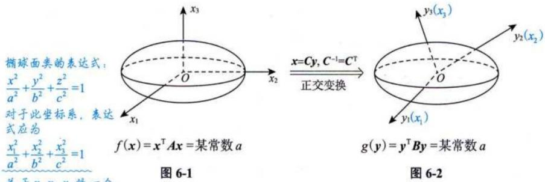
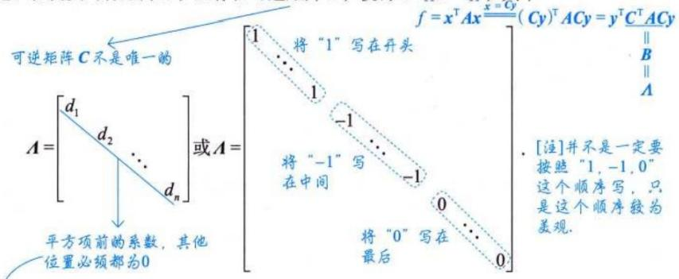
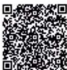
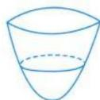
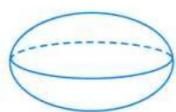
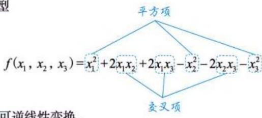
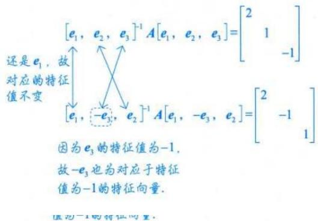
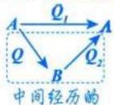

# 第六章 二次型.docx — 图像索引

> 由 MinerU 结构化结果生成。题目若依赖树形、拓扑、流程、曲线、区域、时序或其他空间关系，应核对这里的原图，不要只依据 OCR 文本推断。

## 图 1

原文页码：1；bbox：`[166, 436, 196, 458]`

## 图 2

原文页码：1；bbox：`[746, 435, 826, 494]`

## 图 3

原文页码：4；bbox：`[188, 244, 734, 374]`

## 图 4

原文页码：5；bbox：`[285, 307, 801, 457]`

## 图 5

原文页码：6；bbox：`[179, 326, 206, 348]`

## 图 6

原文页码：6；bbox：`[754, 309, 835, 368]`

## 图 7

原文页码：7；bbox：`[702, 491, 774, 544]`

## 图 8

原文页码：7；bbox：`[396, 644, 472, 697]`

## 图 9

原文页码：7；bbox：`[374, 703, 480, 751]`

## 图 10

原文页码：9；bbox：`[322, 498, 633, 596]`

## 图 11

原文页码：10；bbox：`[191, 92, 218, 112]`

## 图 12

原文页码：14；bbox：`[342, 436, 662, 593]`

## 图 13

原文页码：14；bbox：`[203, 592, 228, 611]`

## 图 14

原文页码：15；bbox：`[221, 263, 250, 285]`

## 图 15

原文页码：15；bbox：`[648, 625, 734, 681]`

## 图 16

原文页码：16；bbox：`[179, 275, 206, 296]`
