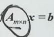

# 第四章 线性方程组.docx

## 第四章 线性方程组

知识点：

齐次线性方程组：

## 齐次线性方程组

方程组

$$
\left\{ \begin{array}{l} a _ {1 1} x _ {1} + a _ {1 2} x _ {2} + \dots + a _ {1 n} x _ {n} = 0, \\ a _ {2 1} x _ {1} + a _ {2 2} x _ {2} + \dots + a _ {2 n} x _ {n} = 0, \\ \dots \dots \\ a _ {m 1} x _ {1} + a _ {m 2} x _ {2} + \dots + a _ {m n} x _ {n} = 0 \end{array} \right.\tag{I}
$$

称为 $m$ 个方程， $n$ 个未知量的齐次线性方程组。

其向量形式为

$$
x _ {1} \boldsymbol {\alpha} _ {1} + x _ {2} \boldsymbol {\alpha} _ {2} + \dots + x _ {n} \boldsymbol {\alpha} _ {n} = \mathbf {0},
$$

其中

$$
\boldsymbol {a} _ {j} = \left[ \begin{array}{c} a _ {1 j} \\ a _ {2 j} \\ \vdots \\ a _ {m j} \end{array} \right],   j = 1,   2,   \dots ,   n .
$$

若只有 $x_{1}, x_{2}, \cdots, x_{n}$ 全为0时才为零向量，则称向量组 $\alpha_{1}, \alpha_{2}, \cdots, \alpha_{n}$ 线性无关。反之，如果 $x_{1}, x_{2}, \cdots, x_{n}$ 存在一组不全为0的数，使等式成立，则称 $\alpha_{1}, \alpha_{2}, \cdots, \alpha_{n}$ 线性相关

其矩阵形式为

$$
A _ {m \times n} x = 0,
$$

其中

$$
\boldsymbol {A} _ {m \times n} = \left[ \begin{array}{c c c c} a _ {1 1} & a _ {1 2} & \dots & a _ {1 n} \\ a _ {2 1} & a _ {2 2} & \dots & a _ {2 n} \\ \vdots & \vdots & & \vdots \\ a _ {m 1} & a _ {m 2} & \dots & a _ {m n} \end{array} \right], \boldsymbol {x} = \left[ \begin{array}{c} x _ {1} \\ x _ {2} \\ \vdots \\ x _ {n} \end{array} \right].
$$

## 1 有解的条件

①当 $r(A)=n\left(\alpha_{1},\alpha_{2},\cdots,\alpha_{n}\right)$ 线性无关）时，方程组（I）有唯一零解；

理解： $A_{m \times n}$ （m行n列），当 $r(A)=n$ 时，A的列向量组满秩，所以Ax=0只有唯一解，又因为齐次方程组必有零解，故方程组Ax=0只有零解。此外，从向量组的线性表示的角度看， $a_{1}, a_{2}, \cdots, a_{n}$ 是线性无关的，故只有组合系数 $x_{1}, x_{2}, \cdots, x_{n}$ 全为0时，才能表示零向量。

★★★★★②当 $r(A)=r<n\left(\alpha_{1},\alpha_{2},\cdots,\alpha_{n}\right)$ 线性相关）时，方程组（I）有非零解（无穷多解），且有n-r个线性无关解。主要考查有非零解的情形

理解: 当 $r(A) < n$ 时, 列向量组 $\alpha_{1}, \alpha_{2}, \cdots, \alpha_{n}$ 是线性相关的, $\alpha_{1}, \alpha_{2}, \cdots, \alpha_{n}$ 在线性表示为零向量时, $x_{1}, x_{2}, \cdots, x_{n}$ 可以不全为零, 即 Ax = 0 存在非零解, 而非零解一定有无穷多个, 因为真实约束小于未知数的个数, 所以有 $n - r(A)$ 个自由变量取值是不受限制的.

$$
\rightarrow \text { 未知量的个数（也称自由度） }
$$

自由变量的个数 $s = n' - r(A)$ → 真实约束的个数 → 一个真实约束限制一个变量

(仅数学一)也称解空间的维数)
基础解系所含向量的个数

VX扫此二维码免费获取最新27考研网课群

[NO TEXT]

## 2 解的性质

①若 $A\xi_{1}=0$ ， $A\xi_{2}=0$ ，则 $A(k_{1}\xi_{1}+k_{2}\xi_{2})=0$ ，其中 $k_{1}$ ， $k_{2}$ 是任意常数。

理解：齐次线性方程组的解向量线性组合后形成的新向量仍是该方程组的解 ②类消去律：若 $A_{m \times n}$ , $r(A) = n$ , $AB = AC$ , 则 $B = C$ .

注 证 因 $r(A) = n$ ， $A$ 列满秩，于是 $n - r(A) = 0$ ， $Ax = 0$ 只有零解，故由 $AB = AC$ ，有 $A(B - C) = 0$ ，于是 $B = C$ 。形式上好像在等号两边消去 $A$ ，故称类消去律。

## 3 基础解系和解的结构

(1) 基础解系：设 $\xi_{1}, \xi_{2}, \cdots, \xi_{n-r}$ 满足

充要条件 $\left\{\begin{array}{l}①是方程组Ax=0的解; \\②线性无关; \\③方程组Ax=0的任一解均可由\xi_{1},\xi_{2},\cdots,\xi_{n-r}\text{线性表示,}\end{array}\right.$

则称 $\xi_{1}, \xi_{2}, \cdots, \xi_{n-r}$ 为 Ax = 0 的基础解系.
个数为 $s = n - r(A)$ (仅数学一)表示“解空间”，Ax = 0 的所有解的集合构成一个“解空间”。

(2) 通解：设 $\xi_{1}, \xi_{2}, \cdots, \xi_{n-r}$ 是 Ax = 0 的基础解系，则 $k_{1}\xi_{1} + k_{2}\xi_{2} + \cdots + k_{n-r}\xi_{n-r}$ 是方程组 Ax = 0 的通解，其中 $k_{1}, k_{2}, \cdots, k_{n-r}$ 是任意常数.

(仅数学一) ${\xi }_{1},{\xi }_{2},\cdots ,{\xi }_{n - r}$ 为解空间的基,解空间内的任意一个向量都可以通过基来线性表示, 所以可用基础解系来表示方程组 ${Ax} = 0$ 的所有解向量,即

$$
\boldsymbol {x} = k _ {1} \xi_ {1} + k _ {2} \xi_ {2} + \dots + k _ {n - r} \xi_ {n - r}
$$

## 4 求解方法与步骤

必须是行变换，因为行变换不改变各向量间的系数，属于同解变换

①将系数矩阵 $A$ 作初等行变换化成行阶梯形矩阵 $B$ （或行最简阶梯形矩阵 $B$ ），（初等行变换将方程组化为同解方程组，故 $Ax=0$ 和 $Bx=0$ 同解，只需解 $Bx=0$ 即可。）阶梯数为 $r$ ，并记 $r(A)=r$ ，

$$
A \xrightarrow {\text {初等行变换}} B = \left[ \begin{array}{c c c c c} c _ {1 1} & c _ {1 2} & \dots & c _ {1 r} & \dots & c _ {1 n} \\ 0 & c _ {2 2} & \dots & c _ {2 r} & \dots & c _ {2 n} \\ \vdots & \vdots & & \vdots & & \vdots \\ 0 & 0 & \dots & c _ {r r} & \dots & c _ {r n} \\ 0 & 0 & \dots & 0 & \dots & 0 \\ \vdots & \vdots & & \vdots & & \vdots \\ 0 & 0 & \dots & 0 & \dots & 0 \end{array} \right] _ {m \times n},
$$

理解：矩阵的行向量组的秩与列向量组的秩是相等的，也等于矩阵的秩

其中， $m$ 是原方程组中方程个数， $n$ 是未知量个数.

②按列找出一个秩为 $r$ 的子矩阵，剩余列位置的未知数设为自由变量. $n - r(A)$ 个自由变量

③按基础解系定义求出 $\xi_{1}, \xi_{2}, \cdots, \xi_{n-r}$ ，并写出通解.

$$
\mathrm{即} x = k _ {1} \xi_ {1} + k _ {2} \xi_ {2} + \dots + k _ {n - r} \xi_ {n - r} (k _ {1}, k _ {2}, \dots , k _ {n - r} \mathrm{为任意常数})
$$

非齐次线性方程组：

## 非齐次线性方程组

方程组

非齐次线性方程组的自由项不金为0

$$
\left\{ \begin{array}{l} a _ {1 1} x _ {1} + a _ {1 2} x _ {2} + \dots + a _ {1 n} x _ {n} = b _ {1}, \\ a _ {2 1} x _ {1} + a _ {2 2} x _ {2} + \dots + a _ {2 n} x _ {n} = b _ {2}, \\ \dots \dots \\ a _ {m 1} x _ {1} + a _ {m 2} x _ {2} + \dots + a _ {m n} x _ {n} = b _ {m}. \end{array} \right.
$$

称为 $m$ 个方程， $n$ 个未知量的非齐次线性方程组。

其向量形式为 $x_{1}a_{1}+x_{2}a_{2}+\cdots+x_{n}a_{n}=b$ ，其中

$$
\boldsymbol {a} _ {j} = \left[ \begin{array}{c} a _ {1 j} \\ a _ {2 j} \\ \vdots \\ a _ {m j} \end{array} \right], j = 1, 2, \dots , n; \boldsymbol {b} = \left[ \begin{array}{c} b _ {1} \\ b _ {2} \\ \vdots \\ b _ {m} \end{array} \right].
$$

其矩阵形式为 Ax=b ，其中

系数矩阵

$$
\boldsymbol {A} = \left[ \begin{array}{c c c c} a _ {1 1} & a _ {1 2} & \dots & a _ {1 n} \\ a _ {2 1} & a _ {2 2} & \dots & a _ {2 n} \\ \vdots & \vdots & & \vdots \\ a _ {m 1} & a _ {m 2} & \dots & a _ {m n} \end{array} \right], \boldsymbol {x} = \left[ \begin{array}{c} x _ {1} \\ x _ {2} \\ \vdots \\ x _ {n} \end{array} \right].
$$

矩阵 $\begin{bmatrix}a_{11}&a_{12}&\cdots&a_{1n}&b_{1}\\ a_{21}&a_{22}&\cdots&a_{2n}&b_{2}\\ \vdots&\vdots&&\vdots&\vdots\\ a_{m1}&a_{m2}&\cdots&a_{mn}&b_{m}\end{bmatrix}$ 称为矩阵A的增广矩阵，简记成 $[A:b]$ .
将系数矩阵和自由项拼起来即为增广矩阵

## 1 有解的条件

若 $r(A) \neq r([A, b])(b \text{ 不能由 } a_{1}, a_{2}, \cdots, a_{n} \text{ 线性表示})$ ，则方程组（Ⅱ）无解；

若 $r(A)=r([A,b])=n$ （即 $\alpha_{1},\alpha_{2},\cdots,\alpha_{n}$ 线性无关， $\alpha_{1},\alpha_{2},\cdots,\alpha_{n},b$ 线性相关），则方程组（Ⅱ）有唯一解；

若 $r(A) = r([A, b]) = r < n$ ，则方程组（Ⅱ）有无穷多解。

## 2 解的性质

设 $\eta_{1}, \eta_{2}, \eta$ 是非齐次线性方程组 Ax=b 的解， $\xi$ 是对应齐次线性方程组 Ax=0 的解，则：(1) $\eta_{1}-\eta_{2}$ 是 Ax=0 的解；(2) $k\xi+\eta$ 是 Ax=b 的解.

→非齐次方程组的通解形式

## 3 求解方法与步骤

又称非齐次方程组的导出组

①写出 Ax=b 的导出方程组 Ax=0，并求 Ax=0 的通解 $k_{1}\xi_{1}+k_{2}\xi_{2}+\cdots+k_{n-r}\xi_{n-r}$

非齐次通解等于齐次通解加非齐次的一个特解

②求出 Ax = b 的一个特解 $\eta$ .

$\star\star\star③Ax=b$ 的通解为 $k_{1}\xi_{1}+k_{2}\xi_{2}+\cdots+k_{n-r}\xi_{n-r}+\eta$ ，其中 $k_{1},k_{2},\cdots,k_{n-r}$ 为任意常数.

求解的主要工作

## 两个方程组的公共解：

齐次线性方程组 $A_{m\times n}x=0$ 和 $B_{m\times n}x=0$ 的公共解是满足方程组 $\begin{bmatrix}A\\B\end{bmatrix}x=0$ 的解，即联立求解。同理，求新方程组的解

可求 Ax = α 与 Bx = β 的公共解。当给出 A, B, α, β 的具体表达式时，对考生的计算能力要求较高，理论上没有什么难点。

即求方程组 $\left\{\begin{aligned}Ax &= \alpha, \\ Bx &= \beta\end{aligned}\right.\left(\begin{bmatrix}A\\B\end{bmatrix}x &= \begin{bmatrix}\alpha \\ \beta\end{bmatrix}\right)$ 的解

★★★方程组求解的思路比较简单，但对计算能力要求高，平时要勤做练习，加强计算能力。

注 还有两种考查 Ax=0 与 Bx=0 公共解的角度：

①若给出 $A_{m\times n}x=0$ 的基础解系 $\xi_{1},\xi_{2},\cdots,\xi_{s}$ 和B的具体表达式，则先写出Ax=0的通解 $k_{1}\xi_{1}+k_{2}\xi_{2}+\cdots+k_{s}\xi_{s}$ ，代入 $B_{m\times n}x=0$ ，求出 $k_{i}(i=1,2,\cdots,s)$ 之间的关系，代回 $A_{m\times n}x=0$ 的通解，即可得Ax=0与Bx=0的公共解.

②若给出 $A_{m\times n}x=0$ 的基础解系 $\xi_{1},\xi_{2},\cdots,\xi_{s}$ 与 $B_{m\times n}x=0$ 的基础解系 $\eta_{1},\eta_{2},\cdots,\eta_{t}$ ，则Ax=0与Bx=0的公共解 $\gamma=k_{1}\xi_{1}+k_{2}\xi_{2}+\cdots+k_{s}\xi_{s}=l_{1}\eta_{1}+l_{2}\eta_{2}+\cdots+l_{t}\eta_{t}$ ，即

$$
k _ {1} \xi_ {1} + k _ {2} \xi_ {2} + \dots + k _ {s} \xi_ {s} - l _ {1} \eta_ {1} - l _ {2} \eta_ {2} - \dots - l _ {t} \eta_ {t} = 0,
$$

解此式，求出 $k_{i}$ 或 $l_{j}, i=1,2,\cdots,s; j=1,2,\cdots,t$ ，即可求出 $\gamma$ .

同解方程组：

五 同解方程组 ★★★ 重要！！！经常用来证明秩相等的问题 $\left\{\begin{aligned}&\text{证}r(A)\leqslant r(B),\text{常用向量组来证明}\\&\text{证}r(A)=r(B)\Rightarrow\frac{\text{证}a\leqslant\cdots\leqslant r(A)\leqslant r(B)\leqslant\cdots\leqslant a}{\text{或}Ax=0\text{与}Bx=0\text{同解}}\end{aligned}\right.$

若两个方程组 $A_{m \times n} x = 0$ 和 $B_{s \times n} x = 0$ 有完全相同的解，则称它们为同解方程组。

于是， $Ax=0,\ Bx=0$ 是同解方程组
(仅数学一) 解空间完全一样

$\Leftrightarrow Ax=0$ 的解满足 Bx=0，且 Bx=0 的解满足 Ax=0（互相把解代入求出结果即可）

$\Leftrightarrow r(A) = r(B)$ ，且 $Ax = 0$ 的解满足 $Bx = 0$ （或 $Bx = 0$ 的解满足 $Ax = 0$ ）

$\Leftrightarrow r(A)=r(B)=r\left(\begin{bmatrix}A\\B\end{bmatrix}\right)$ （三秩相同）. ★★★主要用该结论来证明方程组是否同解此方法较方便

注 (1) 以上三条是理论分析，着眼于客观试题.

(2) 对于齐次线性方程组 Ax=0 和 Bx=0，因其必有零公共解，故要求公共解，主要着眼于求非零公共解，联立方程组求解是基本办法。

题：

题1:

例 4.4 设 $A = [a_{1}, a_{2}, a_{3}, a_{4}]$ 是 4 阶矩阵， $A^{*}$ 为 A 的伴随矩阵，若 $[1, 0, 1, 0]^{T}$ 是方程组 Ax = 0 的一个基础解系，则 $A^{*}x = 0$ 的基础解系可以为（）.
(A) $a_{1}, a_{3}$ (B) $a_{1}, a_{2}$ (C) $a_{1}, a_{2}, a_{3}$ (D) $a_{2}, a_{3}, a_{4}$

分析 由题设，应想到一个重要结论： $AA^{*}=A^{*}A=|A|E$

解 应选(D).

依题设，知 $r(A) = 4 - 1 = 3, |A| = 0$ ，且 $r(A^{*}) = 1$ ：

又由 $A^{*}A = |A|E = O$ ，知 $\pmb{A}$ 的列向量都为方程组 $A^{*}x = 0$ 的解，由 $r(A^{*}) = 1$ ，知 $A^{*}x = 0$ 的基础解

系由三个线性无关解构成. 又因 $[1,0,1,0]^{\mathrm{T}}$ 是方程组 $Ax = 0$ 的一个解，有 $1\alpha_{1} + 0\alpha_{2} + 1\alpha_{3} + 0\alpha_{4} = 0$ ，知 $\alpha_{1}, \alpha_{3}$ 线性相关，从而知 $\alpha_{2}, \alpha_{3}, \alpha_{4}$ 或 $\alpha_{1}, \alpha_{2}, \alpha_{4}$ 是 $A^{*}x = 0$ 的一个基础解系，故选择 (D).

https://chatgpt.com/g/g-p-6a1d6c6f0a408191a175c887909fceb5-xian-dai-he-gai-lu-lun-ocr/c/6a59b6ea-9ad0-83e8-98e6-57e8648d33a3

题 2:

例4.6 设非齐次线性方程组为

(A) 当 $r(A) = m$ 时，方程组有解

(B) 当 $r(A)=n$ 时，方程组有唯一解

(C) 当 m=n 时，方程组有唯一解

(D) 当 $r(A) < n$ 时，方程组有无穷多解

(分析)

$$
\frac {r (A) = r (A | b) <   n}{-}
$$

$$
\mathrm{无余} \cdot \mathrm{唯一余}.
$$

(1) 无余体、无多项体。

分析 考查非齐次线性方程组有解的条件： $\left\{\begin{aligned}r(A)&=r([A,b])=n,\text{唯一解};\\ r(A)&=r([A,b])<n,\text{无穷多解};\\ r(A)\neq r([A,b]),\text{无解}.\end{aligned}\right.$

Ax=b 有解（无解） $\Leftrightarrow r(A)=r([A,b])(r(A)\neq r([A,b]))$ .

题设条件未提及 $r([A, b])$ ，这正是要求考生考虑的问题。

解 应选(A).

因 $r(A)=m$ 时，A 的行向量组线性无关，增广矩阵在 A 的基础上增加一列，即行向量增加一个分量，仍线性无关，故有 $r(A)=m=r([A,b])$ ，方程组有解，应选 (A).

选项(B)， $r(A)=n$ 时也可能无解；选项(C)，也可能无解或有无穷多解；选项(D)，也可能无解，均排除.

## 题 3:

例 4.7 设 A 是 $m \times n$ 实矩阵，则对任意 m 维列向量 b，线性方程组 $A^{T}Ax = A^{T}b$ ( ).  
(A) 无解 (B) 有解  
(C) 必有唯一解 (D) 必有无穷多解

对任意 $m$ 维列向量 $\pmb{b}$ ，由于 $[A^{\mathrm{T}}A\vdots A^{\mathrm{T}}b] = A^{\mathrm{T}}[A\vdots b]$ ，故

$$
r \left(\left[ A ^ {T} A, A ^ {T} b \right]\right) \leqslant r \left(A ^ {T}\right) = r (A),
$$

又 $r(A) = r(A^{\mathrm{T}}A)\leqslant r([A^{\mathrm{T}}A,A^{\mathrm{T}}b])$ ，故 $r(A^{\mathrm{T}}A) = r([A^{\mathrm{T}}A,A^{\mathrm{T}}b])$ ，因此 $A^{\mathrm{T}}Ax = A^{\mathrm{T}}b$ 有解.由于不知 $A^{\mathrm{T}}A$ 是否满秩，故(C)，(D)不正确，选(B).

https://chatgpt.com/g/g-p-6a1d6c6f0a408191a175c887909fceb5-xian-dai-he-gai-lu-lun-ocr/c/6a59d285-48a0-83ee-a09d-3927795d2bfc

## 题 4:

例4.14 设方程组 $Ax = b$ 有解，证明： $A^{\mathrm{T}}x = 0$ 和 $\left[ \begin{array}{c} A^{\mathrm{T}} \\ b^{\mathrm{T}} \end{array} \right] x = 0$ 是同解方程组。

证 ①显然 $\begin{bmatrix}A^{\mathrm{T}}\\ b^{\mathrm{T}}\end{bmatrix}x=0$ 的解必满足 $A^{T}x=0$ .

②因 Ax=b 有解，故 $r(A)=r([A,b])$ ，得 $r\left(\begin{bmatrix}A^{\mathrm{T}}\\ b^{\mathrm{T}}\end{bmatrix}\right)=r(A^{\mathrm{T}})$ 。故 $A^{T}x=0$ 和 $\begin{bmatrix}A^{T}\\ b^{T}\end{bmatrix}x=0$ 的基础解系中所含解向量个数相等。

由①，②知，方程组 $A^{T}x=0$ 和 $\begin{bmatrix}A^{T}\\b^{T}\end{bmatrix}x=0$ 是同解方程组.

注 由 $r(A) = r([A, b])$ ，得 $r(A^{\mathrm{T}}) = r\left(\left[\begin{array}{l} A^{\mathrm{T}} \\ b^{\mathrm{T}} \end{array}\right]\right)$ ，此时 $\pmb{b}$ 是一个列向量，但即便是 $r(A) = r([A, B])$ ，其中 $A_{m \times n}, B_{m \times s}$ ，也有 $r(A^{\mathrm{T}}) = r\left(\left[\begin{array}{l} A^{\mathrm{T}} \\ B^{\mathrm{T}} \end{array}\right]\right)$ 。由 $r(A) = r(A, B)$ ，知 $\pmb{B}$ 的每一列均可由 $\pmb{A}$ 的列向量线性表示，于是 $\left[\begin{array}{l} A^{\mathrm{T}} \\ B^{\mathrm{T}} \end{array}\right]$ 表明 $B^{\mathrm{T}}$ 的每一行均可由 $A^{\mathrm{T}}$ 的行向量线性表示，故有 $r(A^{\mathrm{T}}) = r\left(\left[\begin{array}{l} A^{\mathrm{T}} \\ B^{\mathrm{T}} \end{array}\right]\right)$ ，由此， $r([A, B]) = r\left(\left[\begin{array}{l} A^{\mathrm{T}} \\ B^{\mathrm{T}} \end{array}\right]\right)$ ，但要注意， $r([A, B])$ 与 $r([A^{\mathrm{T}}, B^{\mathrm{T}}])$ 却不一定相等。如 $A = \begin{bmatrix} 1 & 0 \\ 0 & 0 \end{bmatrix}, B = \begin{bmatrix} 0 & 1 \\ 0 & 0 \end{bmatrix}$ ，则 $r([A, B]) = r\left(\left[\begin{array}{cccc} 1 & 0 & 0 & 1 \\ 0 & 0 & 0 & 0 \end{array}\right]\right) = 1$ ，而 $r([A^{\mathrm{T}}, B^{\mathrm{T}}]) = r\left(\left[\begin{array}{cccc} 1 & 0 & 0 & 0 \\ 0 & 0 & 1 & 0 \end{array}\right]\right) = 2$ 。究其原因， $[A^{\mathrm{T}}, B^{\mathrm{T}}]$ 并不是 $[A, B]^{\mathrm{T}}$ ，这一点可能会迷惑考生。

## 证明：

证明 1:

设 $A^T A X = 0$ 与 $A X = 0$ 同续.

① $\eta$ 是 $AX=0 \Rightarrow A\eta=0.$ $\Rightarrow A^{T}A\eta=0.$ $\Rightarrow$ √

② r 是 $A^{T}A x = 0 \therefore S \neq 1 \Rightarrow A^{T}A y = 0.$ $\Rightarrow r^{T}A^{T}A y = 0.$ $\Rightarrow (A y)^{T}A y = 0$ $\Rightarrow |A y|| = 0 \Rightarrow A y = 0.$

$$
\begin{array}{r l} {\therefore A ^ {T} A X = 0 \mathrm{与} A X = 0 \mathrm{同级.}} \\ & {\Rightarrow r (A ^ {T} A) = r (A)} \\ & {\mathrm{又} r ((A ^ {T}) ^ {T} A ^ {T}) = r (A ^ {T}). \quad \forall A ^ {T}} \\ & {\mathrm{即} r (A A ^ {T}) = r (A ^ {T}) = r (A) = r (A ^ {T} A).} \end{array}
$$

例 4.15 设 A 是 n 阶实矩阵， $A^{T}$ 是 A 的转置矩阵。证明：方程组（Ⅰ）Ax=0 和（Ⅱ） $A^{T}Ax=0$ 是同解方程组。

证 ①若存在 x，使 Ax=0，则在两端左边乘 $A^{T}$ ，得 $A^{T}Ax=0$ ，故方程组（I）的解必是方程组

(Ⅱ) 的解.

②若存在x，使 $A^{T}Ax=0$ ，则在两端左边乘 $x^{T}$ ，得 $x^{T}A^{T}Ax=(Ax)^{T}Ax=0$ 。

因 A 是实矩阵，故 Ax 是实向量。设 $Ax = [a_{1}, a_{2}, \cdots, a_{n}]^{T}$ ，则 $(Ax)^{T}Ax = \sum_{i=1}^{n} a_{i}^{2} = 0$ ，得 $a_{i} = 0 (i = 1, 2, \cdots, n)$ ，故 Ax = 0，从而知方程组（Ⅱ）的解必是方程组（Ⅰ）的解。

由①，②知，方程组（Ⅰ），（Ⅱ）是同解方程组。

注 (1) 若 A 是 $m \times n$ 实矩阵，则 Ax = 0 和 $A^{T}Ax = 0$ 也是同解方程组.

(2) 方程组 Ax=0 和 $A^{T}Ax=0$ 是同解方程组，从而有 $r(A)=r(A^{T}A)$

★★★(3)因 $r(A)=r(A^{\mathrm{T}})$ ，故 $r(A)=r(A^{\mathrm{T}})=r(A^{\mathrm{T}}A)=r(AA^{\mathrm{T}})$ （四秩相同）.

→ 经常用到，要牢记

|（注：部分内容可能由 AI 生成）
