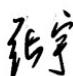
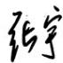

# 第五章  一元函数微分学的应用.docx

# 第五章 一元函数微分学的应用

题：

题1:

2. 若函数 $f(x) = \mathrm{e}^{-ax} - \mathrm{ex}$ 的极值点小于零，则常数 $a$ 的取值范围为 \_\_\_\_.

这题关键是：“极值点小于零”指的是极值点的横坐标 $x_0 < 0$ ，不是极值小于零。

题目：

$$
f (x) = e ^ {- a x} - e ^ {x}
$$

要求：它的极值点小于0，求 $a$ 的范围。

https://chatgpt.com/c/6a3e057c-9b38-83ec-a00a-69f6214e2bb8

题2:

10. 已知曲线 $y = f(x)$ 在其点(0,1)处的曲率圆方程为 $(x - 1)^2 + y^2 = 2$ ，且当 $x \to 0$ 时，二阶可导函数 $f(x)$ 与 $a + bx + cx^2$ 的差为 $o(x^2)$ ，则（）.

(A) $a = 0, b = 1, c = \frac{3}{2}$ (B) $a = 1, b = 0, c = 1$ (C) $a = 1, b = 1, c = -1$ (D) $a = 1, b = 0, c = -1$

## 10.【答案】(C)

【解析】由题可知, 点(0,1)在曲线 $y = f(x)$ 上, 故 $f(0) = 1$ .

对曲率圆方程 $(x - 1)^2 + y^2 = 2$ 关于 $x$ 求导，得

$$
2 (x - 1) + 2 y \cdot y ^ {\prime} = 0,
$$

故可得 $y'=\frac{1-x}{y}$ ，即有 $f'(0)=y'\big|_{x=0}=1$ 。

对(\*)式两边关于x求导, 得 $2+2(y')^{2}+2y\cdot y''=0$ , 代入 $f(0)=1$ , $f'(0)=1$ , 可得

$$
f ^ {\prime \prime} (0) = y ^ {\prime \prime} \big | _ {x = 0} = - 2.
$$

故当 $x \to 0$ 时，有

$$
f (x) = f (0) + f ^ {\prime} (0) x + \frac {f ^ {\prime \prime} (0)}{2} x ^ {2} + o (x ^ {2}) = 1 + x - x ^ {2} + o (x ^ {2}).
$$

配套课程公众号[研大] 联系微信1931637888

## 考研数学题源探析经典1000题（数学一）

故由题意知， $a = 1$ ， $b = 1$ ， $c = -1$

https://chatgpt.com/g/g-p-6a1d505226e08191a7f47eb8e9418ffe-gao-shu-ocr/c/6a3e0bd0-8960-83ec-9df4-f5e667b2d20f?tab=sources

## 题 3:

16. 设函数 $f(x)$ 在 $[0,1]$ 上可导， $f(0)=0$ ， $f'(x)$ 严格单调递增，则对任意 $x\in(0,1)$ ，有（ ）.
(A) $f(x)>f'(0)x>f(1)x$ (B) $f'(0)x>f(x)>f(1)x$ (C) $f(1)x>f'(0)x>f(x)$ (D) $f(1)x>f(x)>f'(0)x$

## 16.【答案】(D)

【解析】令 $g(x) = f(x) - f'(0)x, x \in (0,1)$ ，则 $g'(x) = f'(x) - f'(0) > 0$ ，故 $g(x)$ 严格单调递增，又 $g(0) = f(0) = 0$ ，于是 $g(x) > g(0) = 0$ ，即 $f(x) > f'(0)x$ .

由于 $f'(x)$ 在(0,1)上严格单调递增，故 $f(x)$ 在(0,1)上为凹函数，于是有

$$
(1 - x) f (0) + f (1) x > f [ (1 - x) \cdot 0 + x \cdot 1 ] = f (x),
$$

即 $f(x) < f(1)x$

综上， $f(1)x > f(x) > f'(0)x$ ．选(D).

## 题 4:

19. 设 $f(x) = nx(1 - x)^n (n \in \mathbb{N}_+)$ ，且记 $M(n) = \max_{x \in [0,1]} f(x)$ ，则必有（ ）.
(A) $\lim_{n \to \infty} M(n) = e$ (B) $\lim_{n \to \infty} M(n) = \frac{1}{e}$ (C) $\lim_{n \to \infty} M(n) = 0$ (D) $\lim_{n \to \infty} M(n) = \infty$

## 19.【答案】(B)

【解析】由题设, $f(x)=nx(1-x)^{n}$ ，所以 $f'(x)=n(1-x)^{n-1}\left[1-(n+1)x\right]$ .

令 $f'(x)=0$ ，得 $x_{1}=\frac{1}{n+1}$ （易知其为极大值点）， $x_{2}=1$ （易知其不是极大值点）.

于是 $M(n) = f(x_{1}) = \frac{n}{n + 1}\left(1 - \frac{1}{n + 1}\right)^{n}$ ，故

$$
\lim _ {n \to \infty} M (n) = \lim _ {n \to \infty} \frac {n}{n + 1} \left(1 - \frac {1}{n + 1}\right) ^ {n} = \lim _ {n \to \infty} \left(\frac {n}{n + 1}\right) ^ {n + 1} = \lim _ {n \to \infty} \frac {1}{\left(1 + \frac {1}{n}\right) ^ {n} \left(1 + \frac {1}{n}\right)} = \frac {1}{\mathrm{e}}.
$$

【注】因 $f''\left(\frac{1}{n+1}\right)<0$ ，故 $f\left(\frac{1}{n+1}\right)$ 为极大值。而当0<x<1时， $f(x)>0=f(1)$ ，故 $f(1)$ 不是极大值。

## 题 5:

23. 曲线 $y=e^{\frac{1}{x}}\sqrt{x^{2}-4x+1}$ 的渐近线条数为( ).  
(A) 1 (B) 2 (C) 3 (D) 4【解析】 $\lim_{x\to 0^{-}}\mathrm{e}^{-\frac{1}{x}}\sqrt{x^2 - 4x + 1} = +\infty$ ，故 $x = 0$ 为铅直渐近线.

$\lim_{x\to \infty}\mathrm{e}^{-\frac{1}{x}}\sqrt{x^2 - 4x + 1} = +\infty$ ，故曲线无水平渐近线.

$$
\lim _ {x \to + \infty} \frac {\mathrm{e} ^ {- \frac {1}{x}} \sqrt {x ^ {2} - 4 x + 1}}{x} = \lim _ {x \to + \infty} \frac {\mathrm{e} ^ {- \frac {1}{x}} \bullet x}{x} = 1,
$$

$$
\begin{array}{r l} \lim _ {x \to + \infty} & \left(\mathrm{e} ^ {- \frac {1}{x}} \sqrt {x ^ {2} - 4 x + 1} - x\right) = \lim _ {x \to + \infty} \left[ \mathrm{e} ^ {- \frac {1}{x}} (\sqrt {x ^ {2} - 4 x + 1} - x) + x \left(\mathrm{e} ^ {- \frac {1}{x}} - 1\right) \right] \\ & = \lim _ {x \to + \infty} \mathrm{e} ^ {- \frac {1}{x}} \frac {- 4 x + 1}{\sqrt {x ^ {2} - 4 x + 1} + x} + \lim _ {x \to + \infty} x \left(- \frac {1}{x}\right) \\ & = - 2 - 1 = - 3, \end{array}
$$

故 $y = x - 3$ 为曲线的一条斜渐近线.

$$
\lim _ {x \to - \infty} \frac {\mathrm{e} ^ {- \frac {1}{x}} \sqrt {x ^ {2} - 4 x + 1}}{x} = \lim _ {x \to - \infty} \frac {\mathrm{e} ^ {- \frac {1}{x}} (- x)}{x} = - 1,
$$

$$
\begin{array}{r l} \lim _ {x \to - \infty} & \left(\mathrm{e} ^ {- \frac {1}{x}} \sqrt {x ^ {2} - 4 x + 1} + x\right) = \lim _ {x \to - \infty} \left[ \mathrm{e} ^ {- \frac {1}{x}} (\sqrt {x ^ {2} - 4 x + 1} + x) - x \left(\mathrm{e} ^ {- \frac {1}{x}} - 1\right) \right] \\ & = \lim _ {x \to - \infty} \mathrm{e} ^ {- \frac {1}{x}} \frac {- 4 x + 1}{\sqrt {x ^ {2} - 4 x + 1} - x} - \lim _ {x \to - \infty} x \left(- \frac {1}{x}\right) \end{array}
$$

配套课程公众号[研大]

联系微信1931637888

考研数学题源探析经典1000题（数学一）

$$
= 2 - (- 1) = 3,
$$

故 $y = -x + 3$ 为曲线的一条斜渐近线.

综上, 曲线共有3条渐近线, 故选(C).

https://chatgpt.com/g/g-p-6a1d505226e08191a7f47eb8e9418ffe-gao-shu-ocr/c/6a3e1168-d03c-83ec-a90a-d50604436f9f

|（注：部分内容可能由 AI 生成）
