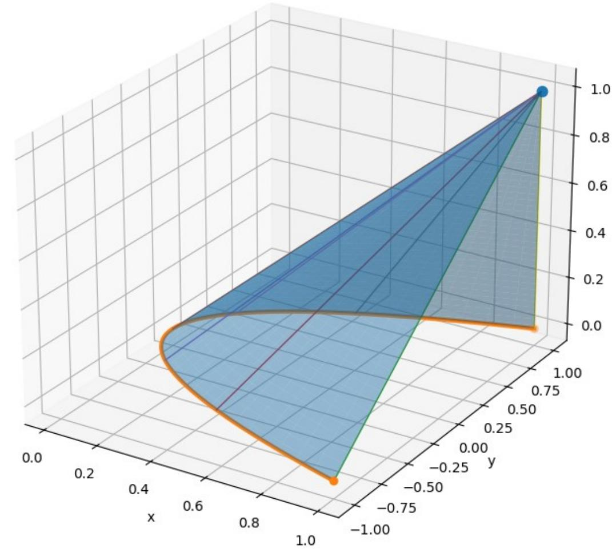
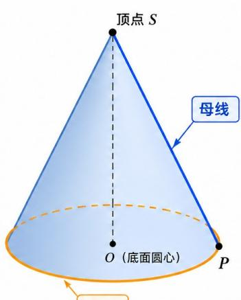
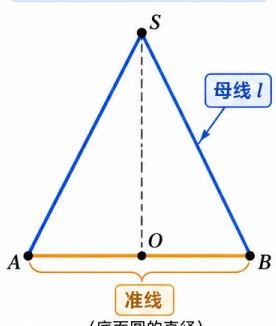

# 第十七章 多元函数积分学.docx — 图像索引

> 由 MinerU 结构化结果生成。题目若依赖树形、拓扑、流程、曲线、区域、时序或其他空间关系，应核对这里的原图，不要只依据 OCR 文本推断。

## 图 1

原文页码：3；bbox：`[189, 158, 836, 569]`

## 图 2

原文页码：4；bbox：`[448, 589, 660, 776]`

## 图 3

原文页码：4；bbox：`[678, 633, 845, 772]`
