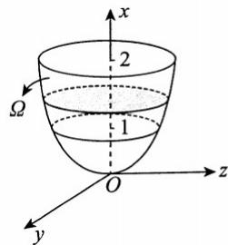
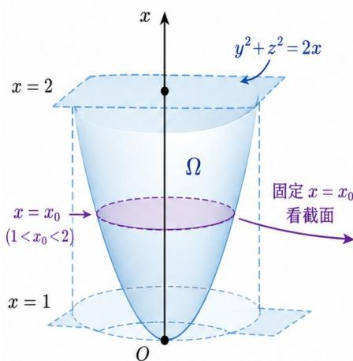
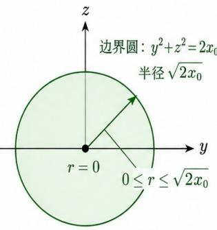
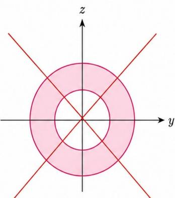
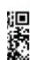
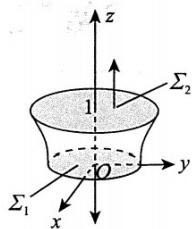
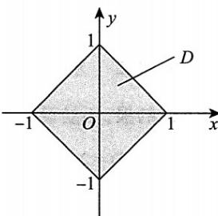

# 第十八章 多元函数积分学.docx — 图像索引

> 由 MinerU 结构化结果生成。题目若依赖树形、拓扑、流程、曲线、区域、时序或其他空间关系，应核对这里的原图，不要只依据 OCR 文本推断。

## 图 1

原文页码：1；bbox：`[643, 356, 794, 472]`

## 图 2

原文页码：1；bbox：`[151, 514, 421, 709]`

## 图 3

原文页码：1；bbox：`[426, 556, 616, 699]`

## 图 4

原文页码：1；bbox：`[633, 542, 843, 709]`

## 图 5

原文页码：9；bbox：`[147, 831, 168, 859]`

## 图 6

原文页码：10；bbox：`[678, 126, 794, 223]`

## 图 7

原文页码：10；bbox：`[653, 598, 818, 713]`
