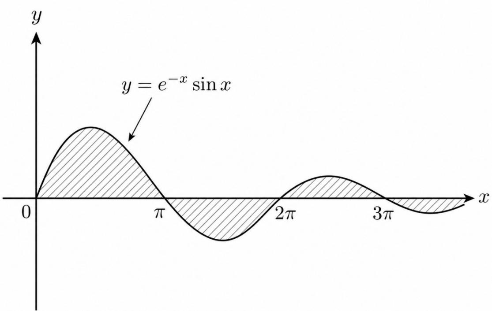

# 第十六章 无穷级数.docx

## 第十六章 无穷级数

知识点：

级数公式：

## 6. 奇数分母的非交错级数

由

$$
\frac {1}{1 - x ^ {2}} = 1 + x ^ {2} + x ^ {4} + \dots
$$

逐项积分：

$$
\left| \sum_ {n = 0} ^ {\infty} \frac {x ^ {2 n + 1}}{2 n + 1} = \frac {1}{2} \ln \frac {1 + x}{1 - x} \right|, \quad | x | <   1.
$$

即

$$
x + \frac {x ^ {3}}{3} + \frac {x ^ {5}}{5} + \dots = \frac {1}{2} \ln \frac {1 + x}{1 - x}.
$$

与反正切级数对比:

$$
x - \frac {x ^ {3}}{3} + \frac {x ^ {5}}{5} - \dots = \arctan x.
$$

一个不交错，一个交错，不能混淆。

https://chatgpt.com/g/g-p-6a1d505226e08191a7f47eb8e9418ffe-gao-shu-ocr/c/6a61afba-3ba4-83ee-bf72-67c9eb30c1cc

## 反常积分：

图中这个结论是反常积分中最经典的“条件收敛”例子：

$$
\int_ {1} ^ {+ \infty} \frac {\sin x}{x} d x
$$

它本身收敛，但取绝对值以后

$$
\int_ {1} ^ {+ \infty} \left| \frac {\sin x}{x} \right| d x
$$

却发散。 高等数学第8版上册\_OCR

https://chatgpt.com/g/g-p-6a1d505226e08191a7f47eb8e9418ffe-gao-shu-ocr/c/6a5f7007-fa10-83ee-8993-61ad16330121

## 定理：

Stolze 定理:

## 一、Stolz 定理的常用形式

设数列 $\{b_{n}\}$ :

1. 严格单调递增;

2. $b_{n}\rightarrow +\infty$

如果极限

$$
\lim _ {n \rightarrow \infty} \frac {a _ {n + 1} - a _ {n}}{b _ {n + 1} - b _ {n}} = L
$$

存在，其中 $L$ 可以是有限数，也可以是 $+\infty, -\infty$ ，那么

$$
\boxed {\lim _ {n \rightarrow \infty} \frac {a _ {n}}{b _ {n}} = L}
$$

即

$$
\lim \frac {a _ {n}}{b _ {n}} = \lim \frac {\Delta a _ {n}}{\Delta b _ {n}}
$$

其中

$$
\Delta a _ {n} = a _ {n + 1} - a _ {n}, \quad \Delta b _ {n} = b _ {n + 1} - b _ {n}.
$$

https://chatgpt.com/c/6a672d82-c370-83ee-a6a6-679df08757a5  
https://chatgpt.com/c/6a6738bb-6a78-83e8-88ee-33d8e9ceab7b

## 总结：

https://chatgpt.com/g/g-p-6a1d505226e08191a7f47eb8e9418ffe-gao-shu-ocr/c/6a5ddb97-8490-83e8-be51-abf4504d3cf4

题：

题1:

8. 设 $a_{n}(x)$ 满足

$$
a _ {n} ^ {\prime} (x) - \frac {n}{(1 + x) \ln (1 + x)} a _ {n} (x) + \ln^ {n} (1 + x) = 0, x > 0, n = 1, 2, \dots , a _ {n} (1) = 0
$$

(1)求 $a_{n}(x)$ 的表达式；

(2)判别 $\sum_{n = 1}^{\infty}\int_0^1 a_n(x)\mathrm{d}x$ 的敛散性.

8.【解析】(1)所给方程为 $a_{n}^{\prime}(x) - \frac{n}{(1 + x)\ln(1 + x)} a_{n}(x) = -\ln^{n}(1 + x)$ ，令

$$
p _ {n} (x) = - \frac {n}{(1 + x) \ln (1 + x)},
$$

则

$$
\mathrm{e} ^ {- \int p _ {n} (x) \mathrm{d} x} = \mathrm{e} ^ {n \int \frac {\mathrm{d} x}{(1 + x) \ln (1 + x)}} = \mathrm{e} ^ {n \int \frac {\mathrm{d} [ \ln (1 + x) ]}{\ln (1 + x)}} = \mathrm{e} ^ {n \ln [ \ln (1 + x) ]} = \ln^ {n} (1 + x).
$$

同理 $\mathrm{e}^{\int p_n(x)\mathrm{d}x} = \frac{1}{\ln^n(1 + x)}$ ，由一阶线性微分方程的通解公式，有

$$
a _ {n} (x) = \ln^ {n} (1 + x) \left\{\int \frac {1}{\ln^ {n} (1 + x)} \cdot \left[ - \ln^ {n} (1 + x) \right] \mathrm{d} x + C \right\} = \ln^ {n} (1 + x) (- x + C),
$$

又由 $a_{n}(1) = 0$ ，得 $C = 1$ ，于是 $a_{n}(x) = (1 - x)\ln^{n}(1 + x), x > 0$ ：

(2) $\sum_{n=1}^{\infty} \int_{0}^{1} a_n(x) \mathrm{d}x = \sum_{n=1}^{\infty} \int_{0}^{1} (1 - x) \ln^n (1 + x) \mathrm{d}x$ 为正项级数，由 $\ln(1 + x) < x (x > 0)$ ，知

$$
\int_ {0} ^ {1} (1 - x) \ln^ {n} (1 + x) \mathrm{d} x \leqslant \int_ {0} ^ {1} (1 - x) x ^ {n} \mathrm{d} x = \int_ {0} ^ {1} (x ^ {n} - x ^ {n + 1}) \mathrm{d} x
$$

$$
= \frac {1}{n + 1} - \frac {1}{n + 2} = \frac {1}{(n + 1) (n + 2)}.
$$

因为 $\sum_{n=1}^{\infty} \frac{1}{(n+1)(n+2)}$ 收敛, 故根据正项级数的比较判别法, 有 $\sum_{n=1}^{\infty} \int_{0}^{1} a_n(x) \mathrm{d}x$ 收敛.

题2:

7. 设函数 $y = y(x)$ 满足 $(1 - x)y' + 2y = 0$ , $y(0) = 1$ , $a_n(x) = \int_0^x y(t)\sin^n t\mathrm{d}t$ , $n = 1,2,\cdots$ .

(2) 证明 $\sum_{n=1}^{\infty} a_n(1)$ 收敛.

7.【解析】(1)由题 $(1 - x)\frac{\mathrm{dy}}{\mathrm{dx}} + 2y = 0$ ，分离变量得 $\frac{1}{2y}\mathrm{dy} = \frac{1}{x - 1}\mathrm{dx}$ ，两端同时积分得

$$
\frac {1}{2} \ln | y | = \ln | x - 1 | + \ln C _ {1},
$$

$$
\left| y \right| ^ {\frac {1}{2}} = C _ {1} \left| x - 1 \right|,
$$

两端同时平方得 $y = C(x - 1)^2$ ，又 $y(0) = 1$ ，代入上式，解得 $C = 1$ ，故 $y(x) = (x - 1)^2$ .

(2)由(1)得 $y=(x-1)^{2}$ ，则

$$
0 <   a _ {n} (1) = \int_ {0} ^ {1} (t - 1) ^ {2} \sin^ {n} t \mathrm{d} t \leqslant \int_ {0} ^ {1} (t - 1) ^ {2} t ^ {n} \mathrm{d} t,
$$

又 $\int_0^1 (t - 1)^2 t^n\mathrm{d}t = \int_0^1 (t^{n + 2} - 2t^{n + 1} + t^n)\mathrm{d}t = \frac{1}{n + 1} +\frac{1}{n + 3} -\frac{2}{n + 2} = \frac{2}{(n + 1)(n + 2)(n + 3)},$

且 $\sum_{n=1}^{\infty} \frac{2}{(n+1)(n+2)(n+3)}$ 收敛, 所以 $\sum_{n=1}^{\infty} a_n(1)$ 收敛.

## 题 3:

## [图片下载失败]

4.【答案】(A)

【解析】对于选项(A)，若 $\sum_{n=0}^{\infty} a_n^2$ 收敛，则 $\lim_{n \to \infty} a_n^2 = 0$ ，当 $n$ 充分大时， $\left|a_n^2\right| < 1$ ，可得 $\left|a_n\right| < 1$ ，于是 $\left|a_n^3\right| = \left|a_n^2\right|\left|a_n\right| < \left|a_n^2\right| = a_n^2$ ，故 $\sum_{n=0}^{\infty} a_n^3$ 绝对收敛，也即 $\sum_{n=0}^{\infty} a_n^3$ 收敛.

对于选项(B)，取 $a_{n} = \frac{1}{\sqrt{n + 1}}$ ，可得 $a_{n}^{2} = \frac{1}{n + 1}$ ， $a_{n}^{3} = \frac{1}{(n + 1)^{\frac{3}{2}}}$ ，则 $\sum_{n = 0}^{\infty}a_n^2$ 发散，但 $\sum_{n = 0}^{\infty}a_n^3$ 收敛.

对于选项(C)，取 $a_{n} = \frac{(-1)^{n + 1}}{(n + 1)^{\frac{1}{4}}}$ ，可得 $a_{n}^{3} = \frac{(-1)^{3(n + 1)}}{(n + 1)^{\frac{3}{4}}}$ ， $a_{n}^{4} = \frac{1}{n + 1}$ ，则 $\sum_{n = 0}^{\infty}a_n^3$ 收敛，但 $\sum_{n = 0}^{\infty}a_n^4$ 发散.

对于选项(D)，取 $a_{n} = \frac{1}{\sqrt[3]{n + 1}}$ ，可得 $a_{n}^{3} = \frac{1}{n + 1}$ ， $a_{n}^{4} = \frac{1}{(n + 1)^{\frac{4}{3}}}$ ，则 $\sum_{n = 0}^{\infty}a_n^3$ 发散，但 $\sum_{n = 0}^{\infty}a_n^4$ 收敛.

https://chatgpt.com/g/g-p-6a1d505226e08191a7f47eb8e9418ffe-gao-shu-ocr/c/6a5dfd63-

题 4:

6. 设 $\sum_{n=1}^{\infty}(u_{n+1}-u_n)$ 收敛, 则下列级数中收敛的是( ).  
(A) $\sum_{n=1}^{\infty}\frac{u_n}{n}$ (B) $\sum_{n=1}^{\infty}(-1)^n\frac{1}{u_n}$ (C) $\sum_{n=1}^{\infty}\left(1-\frac{u_n}{u_{n+1}}\right)$ (D) $\sum_{n=1}^{\infty}(u_{n+1}^2-u_n^2)$

https://chatgpt.com/g/g-p-6a1d505226e08191a7f47eb8e9418ffe-gao-shu-ocr/c/6a5e0275-b2c4-83ee-a0a0-18a158add00a

题 5(\*):

题目

求曲线

$$
y = e ^ {- x} \sin x \quad (x \geq 0)
$$

与 $x$ 轴之间图形的面积。

https://chatgpt.com/g/g-p-6a1d505226e08191a7f47eb8e9418ffe-gao-shu-ocr/c/6a609c03-67d8-83ee-a962-05b65e58faf8

题6:

9. 设幂级数 $\sum_{n=1}^{\infty}na_{n}(x+1)^{n}$ 的收敛区间为 $(-3,1)$ ，则 $\sum_{n=1}^{\infty}a_{n}(x-1)^{2n}$ 的收敛区间为 \_\_\_\_.

第二步：去掉系数中的 $n$

现在我们需要研究的是含有 $a_{n}$ 的级数，而已知的是含有 $na_{n}$ 的级数。

关键结论是：

$$
\sum a _ {n} t ^ {n} \quad {\text {与}} \quad \sum n a _ {n} t ^ {n}
$$

具有相同的收敛半径。

可以从根值公式理解。已知

$$
R = \frac {1}{\limsup _ {n \to \infty} \sqrt [ n ]{| n a _ {n} |}} = 2.
$$

而

$$
\sqrt [ n ]{| n a _ {n} |} = \sqrt [ n ]{n} \sqrt [ n ]{| a _ {n} |}.
$$

由于

$$
\lim _ {n \to \infty} \sqrt [ n ]{n} = 1,
$$

所以乘上 $n$ 不影响收敛半径，即

$$
\limsup _ {n \to \infty} \sqrt [ n ]{| n a _ {n} |} = \limsup _ {n \to \infty} \sqrt [ n ]{| a _ {n} |}.
$$

https://chatgpt.com/g/g-p-6a1d505226e08191a7f47eb8e9418ffe-gao-shu-ocr/c/6a6191d1-2ae8-83e8-9767-997b40dbe055

题7:

15. (1) 求微分方程 $y'(x) + y(x) = \frac{(-x)^{n-1}}{3^n e^x}$ 的通解, 其中 $n$ 为任意正整数;

(2) 记 $a_{n}(x)(n = 1,2,\dots)$ 是 (1) 中满足条件 $y(0) = 0$ 的特解, 求级数 $\sum_{n=1}^{\infty} a_{n}(x)$ 的和函数.

15.【解析】(1)这是一阶线性微分方程,利用公式求通解.

$$
\begin{array}{r l} y (x) & = \mathrm{e} ^ {- \int \mathrm{d} x} \left[ \int \mathrm{e} ^ {\int \mathrm{d} x} \cdot \frac {(- x) ^ {n - 1}}{3 ^ {n} \mathrm{e} ^ {x}}   \mathrm{d} x + C \right] = \mathrm{e} ^ {- x} \left[ \frac {(- 1) ^ {n - 1}}{3 ^ {n}} \int x ^ {n - 1} \mathrm{d} x + C \right] \\ & = \mathrm{e} ^ {- x} \left[ \frac {(- 1) ^ {n - 1}}{n} \left(\frac {x}{3}\right) ^ {n} + C \right] (C \text {为任意常数}). \end{array}
$$

(2)根据(1)的通解,由 $y(0)=0$ 得C=0,所以 $a_{n}(x)=\mathrm{e}^{-x}\frac{(-1)^{n-1}}{n}\left(\frac{x}{3}\right)^{n}$ .利用已知级数

$$
\sum_ {n = 1} ^ {\infty} \frac {(- 1) ^ {n - 1}}{n} t ^ {n} = \ln (1 + t), - 1 <   t \leqslant 1,
$$

取 $t = \frac{x}{3}$ ，可知 $\sum_{n=1}^{\infty} a_n(x)$ 的收敛域为 $(-3, 3]$ ，且

$$
\sum_ {n = 1} ^ {\infty} a _ {n} (x) = \mathrm{e} ^ {- x} \sum_ {n = 1} ^ {\infty} \frac {(- 1) ^ {n - 1}}{n} \left(\frac {x}{3}\right) ^ {n} = \mathrm{e} ^ {- x} \ln \left(1 + \frac {x}{3}\right).
$$

|（注：部分内容可能由 AI 生成）
