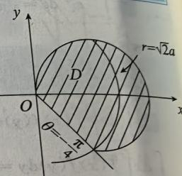
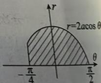

# 二重积分.docx — 图像索引

> 由 MinerU 结构化结果生成。题目若依赖树形、拓扑、流程、曲线、区域、时序或其他空间关系，应核对这里的原图，不要只依据 OCR 文本推断。

## 图 1

原文页码：3；bbox：`[643, 376, 798, 482]`

**图注：** 图6-18

## 图 2

原文页码：3；bbox：`[702, 552, 826, 624]`

**图注：** 图6-19
