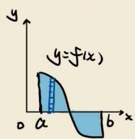
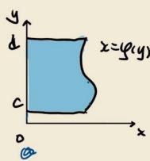
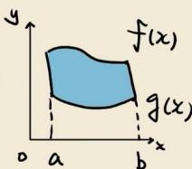
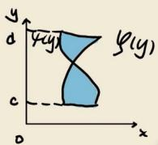
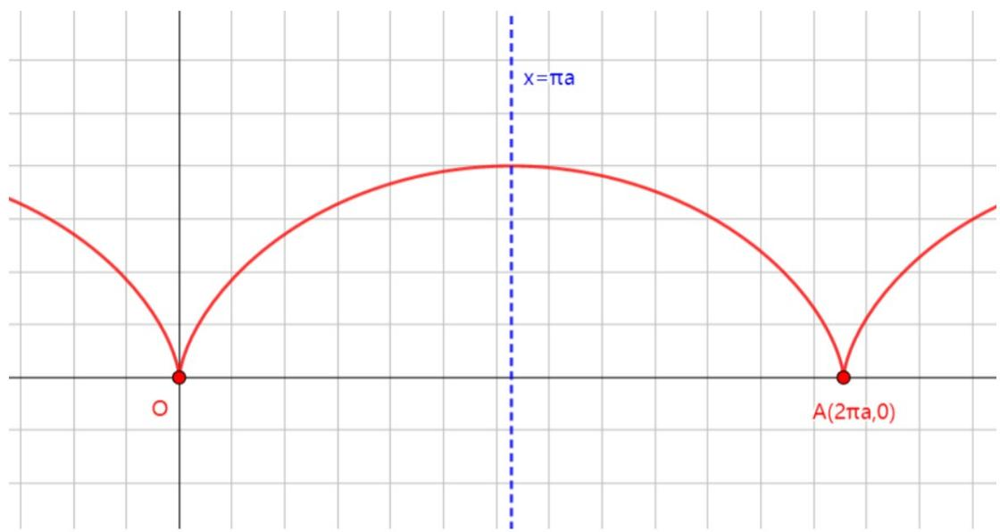
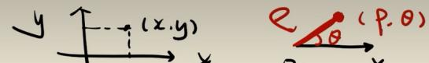
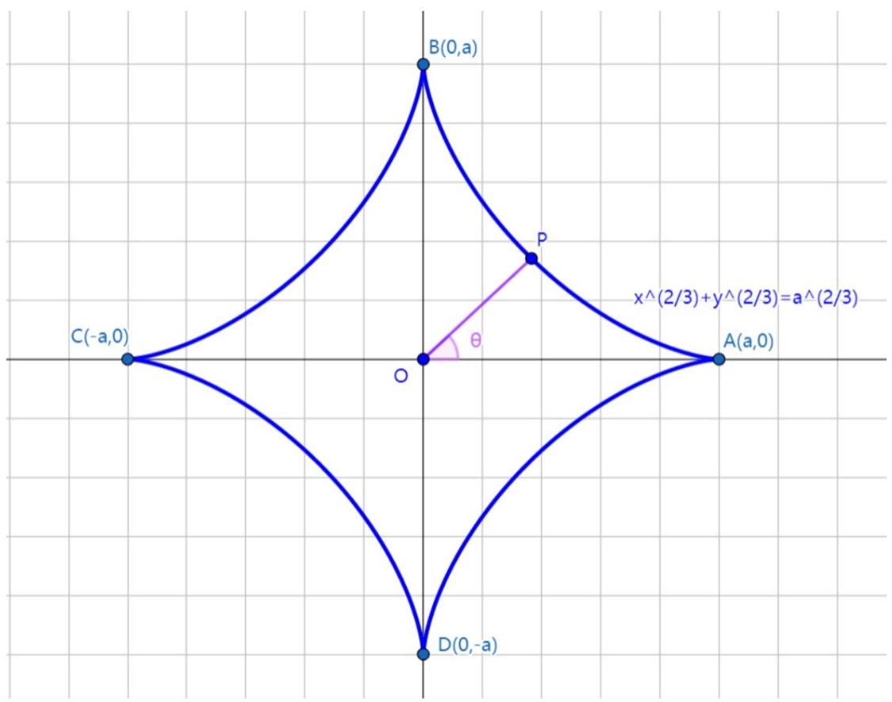
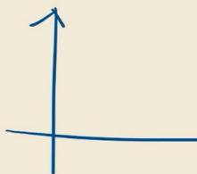

# 定积分的应用.docx — 图像索引

> 由 MinerU 结构化结果生成。题目若依赖树形、拓扑、流程、曲线、区域、时序或其他空间关系，应核对这里的原图，不要只依据 OCR 文本推断。

## 图 1

原文页码：4；bbox：`[591, 580, 705, 663]`

## 图 2

原文页码：4；bbox：`[726, 582, 840, 669]`

## 图 3

原文页码：4；bbox：`[591, 707, 719, 787]`

**图注：** 怪

## 图 4

原文页码：4；bbox：`[724, 709, 842, 785]`

## 图 5

原文页码：5；bbox：`[164, 118, 842, 373]`

**图注：** 图1

## 图 6

原文页码：6；bbox：`[400, 85, 729, 120]`

## 图 7

原文页码：6；bbox：`[159, 329, 840, 708]`

## 图 8

原文页码：13；bbox：`[712, 592, 845, 675]`
