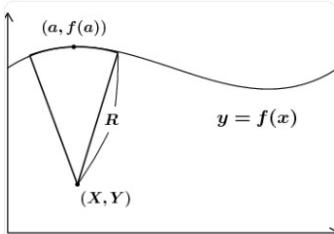
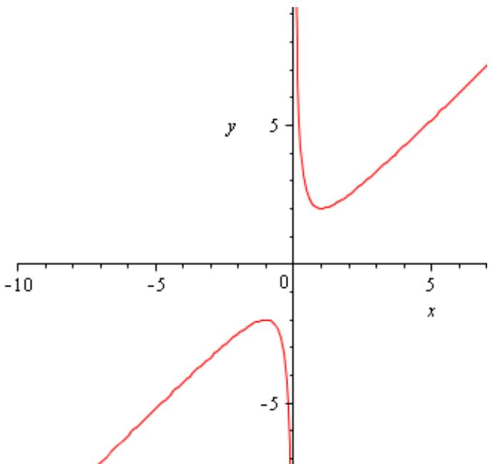

# 导数与微分.docx

## 导数与微分

知识点：

1. 可导的条件

(A) 对称差商

$$
\lim _ {h \to 0} \frac {f (1 + h) - f (1 - h)}{h}
$$

知识点：

\- 对称差商存在不能推出可导（反例： $f(x)=|x-1|$ ）

\- 它相当于 $\frac{f(1 + h) - f(1)}{h}$ 与 $\frac{f(1 - h) - f(1)}{-h}$ 的平均，可能抵消掉不可导的“尖点”

\- 只有已知可导时，对称差商才存在且等于导数

\- 考察：充分必要条件中的“必要性”与“充分性”的区分

## 2.导数极限定理

## 导数极限定理（洛必达型导数存在性定理）

## 一、定理完整表述

设函数 $f(x)$ 满足：

1. 在闭区间 $[a, b]$ 上连续；

2. 在开区间 $(a, b)$ 内可导；

3. 极限 $\lim_{x\to a^{+}}f'(x) = A$ 存在（ $A$ 为有限实数或 $\pm \infty$ ）。

则 $f(x)$ 在 $x = a$ 处的右导数存在，且

$$
f _ {+} ^ {\prime} (a) = \lim _ {x \rightarrow a ^ {+}} f ^ {\prime} (x) = A
$$

同理，对左端点 $b$ 有对称结论：

若 $f(x)$ 在 $[a,b]$ 连续、 $(a,b)$ 可导，且 $\lim_{x\to b^{-}}f'(x) = B$ ，则 $f_{-}^{\prime}(b) = B$ 。

## 二、核心推论（区间内可导的判定）

若 $f(x)$ 在区间 $I$ 上连续，在 $I$ 内除点 $x_0$ 外处处可导，且 $\lim_{x\to x_0}f'(x) = A$ 存在，则 $f(x)$ 在 $x_0$ 处可导，且

$$
f ^ {\prime} (x _ {0}) = \lim _ {x \rightarrow x _ {0}} f ^ {\prime} (x) = A
$$

即：导函数在某点的极限存在，则该点导数存在且等于该极限，导函数在该点连续。

## 1. 三个条件缺一不可

<table><tr><td>条件</td><td>缺失后果</td><td>反例</td></tr><tr><td> $f(x)$ 在a处连续</td><td>定理失效</td><td> $f(x)=\begin{cases}1,&x=a\\0,&x>a\end{cases},x>a$ 时 $f'(x)=0,$ 但 $f_{+}'(a)$ 不存在</td></tr><tr><td>(a,b)内可导</td><td>定理失效</td><td> $f(x)=|x|,x=0$ 处不可导, $x>0$ 时 $f'(x)=1,$ 但 $f_{+}'(0)=1$ 虽成立,却不满足“内可导”的普适性</td></tr><tr><td> $\lim_{x\to a^{+}}f'(x)$ 存在</td><td>无法推出导数存在</td><td> $f(x)=\begin{cases}x^{2}\sin\frac{1}{x},&x\neq 0\\0,&x=0\end{cases},x\to 0$ 时 $f'(x)=2x\sin\frac{1}{x}-\cos\frac{1}{x}$ 极限不存在,但 $f'(0)=0$ 存在(说明:极限不存在≠导数不存在,仅定理不适用)</td></tr></table>

## 3.曲率圆

曲率圆（又称密切圆）是在曲线上某一点处，与该曲线具有相同切线、相同凹向和相同曲率的圆，用于局部近似代替曲线。

## 一、核心概念

\- 曲率 (K): 衡量曲线在某点的弯曲程度, 公式为:

$$
K = \frac {| y ^ {\prime \prime} |}{(1 + y ^ {\prime 2}) ^ {\frac {3}{2}}}
$$

\- 曲率半径 $(\mathfrak{p})$ ：曲率的倒数，即曲率圆的半径：

$$
\rho = \frac {1}{K} = \frac {(1 + y ^ {\prime 2}) ^ {\frac {3}{2}}}{| y ^ {\prime \prime} |}
$$

\- 曲率中心 $(\alpha, \beta)$ ：曲率圆的圆心，位于曲线在该点法线上的凹侧。

## 二、求解步骤（直角坐标系 $y = f(x)$ ）

已知：曲线 $y = f(x)$ 上一点 $M(x_{0}, y_{0})$ ，且 $f''(x_{0}) \neq 0$ 。

## 1. 求一阶、二阶导数

在 $x_0$ 处：

$$
y ^ {\prime} = f ^ {\prime} (x _ {0}), \quad y ^ {\prime \prime} = f ^ {\prime \prime} (x _ {0})
$$

## 2. 求曲率半径 $\rho$

$$
\rho = \frac {(1 + (y ^ {\prime}) ^ {2}) ^ {\frac {3}{2}}}{| y ^ {\prime \prime} |}
$$

## 3. 求曲率中心 $(\alpha, \beta)$

$$
\alpha = x _ {0} - \frac {y ^ {\prime} (1 + (y ^ {\prime}) ^ {2})}{y ^ {\prime \prime}}
$$

$$
\beta = y _ {0} + \frac {1 + (y ^ {\prime}) ^ {2}}{y ^ {\prime \prime}}
$$

## 符号判断：

\- $y'' > 0$ : 曲线凹向上, 中心在点 $M$ 上方 $(\beta > y_0)$

\- $y'' < 0$ : 曲线凹向下, 中心在点 $M$ 下方 $(\beta < y_0)$

## 概念：

## 曲率

## 一、曲率的核心概念

曲率是描述曲线弯曲程度的几何量，直观来看：直线无弯曲，曲率为0；曲线弯曲程度越大，曲率值越大。其本质是曲线在某一点处切线方向的变化率，是导数（一阶、二阶）的重要应用之一。

## 二、曲率的求解公式（分3种常见情况，必记）

## 1. 直角坐标形式（最常用）

若曲线方程为 $y=f(x)$ ，且 $f(x)$ 二阶可导，则曲线在点 $(x,y)$ 处的曲率公式为：

$K=\dot{\iota}y^{\prime\prime}\vee\frac{\dot{\iota}}{(1+(y^{\prime})^{2})^{\frac{3}{2}}}\dot{\iota}$

说明： $y'$ 是 $y=f(x)$ 的一阶导数， $y''$ 是二阶导数，分子的绝对值保证曲率非负。

## 2. 参数方程形式

若曲线由参数方程 $\left\{\begin{aligned}x&=\phi(t)\\ y&=\psi(t)\end{aligned}\right.$ 给出，且 $\phi(t)$ 、 $\psi(t)$ 二阶可导，且 $\phi'(t)\neq0$ ，则曲率公式为：

$$
K = \dot {\iota} x ^ {\prime} y ^ {\prime \prime} - x ^ {\prime \prime} y ^ {\prime} \vee \frac {\dot {\iota}}{\left(\left(x ^ {\prime}\right) ^ {2} + \left(y ^ {\prime}\right) ^ {2}\right) ^ {\frac {3}{2}}} \dot {\iota}
$$

说明： $x'$ 、 $x''$ 分别是 $x=\phi(t)$ 对参数t的一阶、二阶导数； $y'$ 、 $y''$ 分别是 $y=\psi(t)$ 对参数t的一阶、二阶导数。

## 3. 圆的曲率（特殊情况）

对于半径为 $R$ 的圆，其上任一点的曲率均为常数：

$$
K = \frac {1}{R}
$$

推论：曲率半径 $\rho$ （曲率的倒数）为 $\rho = \frac{1}{K} = R$ ，即圆的曲率半径等于其半径。

## 三、曲率求解步骤（以直角坐标形式为例）

1. 求曲线 $y = f(x)$ 的一阶导数 $y'$ ;

2. 求二阶导数 $y''$ ;

3. 将 $y'$ 、 $y''$ 代入直角坐标曲率公式，计算得出曲率 $K$ （注意保留绝对值，确保结果非负）。

## 四、已知曲率，求解曲率圆圆心（核心步骤）

前提：已知曲线 $y=f(x)$ 在点 $M(x_{0},y_{0})$ 处的曲率为 $K(K\neq0)$ ，曲率半径 $\rho=\frac{1}{K}$ ，求该点曲率圆的圆心 $(\alpha,\beta)$ 。

核心原理：曲率圆的圆心（曲率中心）位于曲线在点 $M$ 处的法线上，且在曲线的凹侧，与点 $M$ 的距离等于曲率半径 $\rho$ 。

具体求解公式：

对于直角坐标形式曲线 $y=f(x)$ ，在点 $M(x_{0},y_{0})$ 处的曲率圆圆心 $(\alpha,\beta)$ ，核心公式为：

$$
\alpha = x _ {0} - \frac {y _ {0} ^ {\prime} \left(1 + \left(y _ {0} ^ {\prime}\right) ^ {2}\right)}{y _ {0} ^ {\prime \prime}}, \beta = y _ {0} + \frac {1 + \left(y _ {0} ^ {\prime}\right) ^ {2}}{y _ {0} ^ {\prime \prime}}
$$

## 补充说明：

1. 若曲线为参数方程形式，先求出 $x^{\prime}$ 、 $y^{\prime}$ 、 $x^{\prime\prime}$ 、 $y^{\prime\prime}$ ，计算曲率 $K = i x^{\prime} y^{\prime\prime} - x^{\prime\prime} y^{\prime} \vee \frac{i}{((x^{\prime})^{2} + (y^{\prime})^{2})^{\frac{3}{2}}} i$ ，再求曲率半径 $\rho = \frac{1}{K}$ ，圆心坐标公式（修正后）为： $\alpha = x - \frac{y^{\prime}(x'^{2} + y'^{2})}{x'y'' - x'y'}$ $\beta = y + \frac{x'(x'^{2} + y'^{2})}{x'y'' - x'y'}$ （x、y为参数方程在该点的坐标，公式中符号已自动适配凹侧方向）；

易错提醒：切勿遗漏分子的绝对值，曲率不可为负；

图像：

对勾函数

对勾函数又称双勾函数，其标准形式为： $y=ax+\frac{b}{x}$ （其中a>0，b>0，定义域为 $x\neq0$ ），是导数应用中常见的函数类型，核心性质如下：

## 一、定义域与值域

1. 定义域： $\{x\in R|x\neq 0\}$ （即 $x <   0$ 或 $x > 0)$ ；

2. 值域: $\left(-\infty, -2\sqrt{ab}\right)\cup\dot{\iota}$ , 当且仅当 $ax=\frac{b}{x}$ (即 $x=\pm\sqrt{\frac{b}{a}}$ ) 时, 取到最值。

## 二、奇偶性

对勾函数为奇函数，满足 $f(-x)=-f(x)$ ，图像关于原点对称，因此只需研究x>0的部分，即可推出x<0的性质。

## 三、极值与最值

1. 极大值：当 $x = -\sqrt{\frac{b}{a}}$ 时，函数取得极大值 $y = -2\sqrt{ab}$ ；

2. 极小值：当 $x = \sqrt{\frac{b}{a}}$ 时，函数取得极小值 $y = 2\sqrt{ab}$

3. 注意：对勾函数无最大值和最小值（值域为两段开区间延伸至无穷），上述极大值、极小值为函数在对应区间的最值。

## 四、渐近线

1. 水平渐近线：无（当 $x \to \pm \infty$ 时， $y = ax + \frac{b}{x} \to \pm \infty$ ）；

2. 垂直渐近线： $x = 0$ （当 $x \to 0^{+i}$ 时， $y \to +\infty$ ；当 $x \to 0^{-}$ 时， $y \to -\infty$ ）。

3.倾斜渐近线（核心补充）：

1. 渐近线定义：当 $x \to \pm \infty$ 时，函数图像与某条直线的距离趋近于0，这条直线即为倾斜渐近线（非水平、非垂直）。

2. 推导过程：当 $x \to \pm \infty$ 时， $\frac{b}{x} \to 0$ ，此时函数 $y = ax + \frac{b}{x}$ 的图像无限趋近于直线 $y = ax$ 。

3. 结论：对勾函数 $y = ax + \frac{b}{x}$ 的倾斜渐近线为 $y = ax$ 。

补充说明：倾斜渐近线 $y = ax$ 将平面分为两部分，对勾函数的两支图像分别位于渐近线两侧，且始终趋近于该直线（ $x$ 的绝对值越大，函数值与渐近线的距离越小）；特殊情形 $y = x + \frac{1}{x}$ 的倾斜渐近线为 $y = x$ 。

## 五、特殊情形（常用）

当 $a = 1$ ， $b = 1$ 时，对勾函数为 $y = x + \frac{1}{x}$ ，其核心性质简化为：

1. 极值点: $x = \pm 1$ , 极大值 -2, 极小值2;

2. 单调区间： $(-∞,-1i、i递增；i、(0,1i递减。$

公式：

高阶导数

高阶导数定义：函数 $y=f(x)$ 的一阶导数 $y'=f'(x)$ 的导数，称为二阶导数，记为 $y''$ 、 $f''(x)$ 或 $\frac{d^2y}{dx^2}$ ；二阶及以上的导数统称为高阶导数。

## 一、基本初等函数的高阶导数公式（常见阶数）

1. 幂函数： $(x^{n})^{(k)}=n(n-1)(n-2)\cdots(n-k+1)x^{n-k}$ （ $k\leq n,\ n$ 为正整数）；当k=n时， $(x^{n})^{(n)}=n!$ ；当k>n时， $(x^{n})^{(k)}=0$ 。

2. 指数函数： $(e^{x})^{(n)}=e^{x}$ ; $(a^{x})^{(n)}=a^{x}\cdot(\ln a)^{n}$ $(a>0,\ a\neq1)$ 。

3. 三角函数：

$$
(\sin x) ^ {(n)} = \sin \left(x + \frac {n \pi}{2}\right)
$$

$$
(\cos x) ^ {(n)} = \cos \left(x + \frac {n \pi}{2}\right)
$$

4. 对数函数： $(\ln x)^{(n)} = (-1)^{n - 1}\cdot \frac{(n - 1)!}{x^n}$ （ $x > 0$ ）。

## 二、高阶导数的运算法则（莱布尼茨公式）

若 $u=u(x)$ 、 $v=v(x)$ 均n阶可导，则：

$$
(u v) ^ {(n)} = \sum_ {k = 0} ^ {n} \square C _ {n} ^ {k} u ^ {(n - k)} v ^ {(k)}
$$

其中 $C_{n}^{k}=\frac{n!}{k!(n-k)!},\quad u^{(0)}=u,\quad v^{(0)}=v$ （0阶导数即函数本身）。

## 题目：

题1.

设函数 $f(x)=\left\{\begin{aligned}g(x)\sin\frac{1}{x},&x\neq0,\\ 0,&x=0,\end{aligned}\right.$ 其中 $g(x)$ 在x=0点可导。若 $f(x)$ 在x=0点可导，则 $f'(0)=i$

详细解题过程：

要判断 $f(x)$ 在x=0点的可导性并求 $f'(0)$ ，需根据导数的定义求解，即：

$$
f ^ {\prime} (0) = \frac {\lim _ {x \rightarrow 0} f (x) - f (0)}{x - 0}
$$

第一步：代入已知条件。由题可知， $f(0)=0$ ，当 $x\neq0$ 时， $f(x)=g(x)\sin\frac{1}{x}$ ，代入导数定义式得：

$$
f ^ {\prime} (0) = \frac {\lim _ {x \rightarrow 0} g (x) \sin \frac {1}{x} - 0}{x} = \frac {\lim _ {x \rightarrow 0} g (x) \sin \frac {1}{x}}{x}
$$

第二步：分析极限存在的条件。已知 $g(x)$ 在x=0点可导，根据可导与连续的关系，可导必连续，因此 $\lim_{x\to0}g(x)=g(0)$ 。

同时， $\sin \frac{1}{x}$ 是有界函数，即存在常数 $M > 0$ ，使得 $\dot{\iota} \sin \frac{1}{x} \vee \leq M$ （对任意 $x \neq 0$ 恒成立）。

第三步：进一步化简极限。要使 $\lim_{x\to 0}g(x)\sin \frac{1}{x}$ 存在，需先确定 $g(0)$ 的值。

先判断 $f(x)$ 在x=0点的连续性（可导必连续）：

$\lim_{x\to 0}f(x) = \lim_{x\to 0}g(x)\sin \frac{1}{x}$ ，由于 $g(x)$ 在 $x = 0$ 连续，若 $g(0)\neq 0$ ，则 $\lim_{x\to 0}g(x) = g(0)\neq 0$ ，而 $\sin \frac{1}{x}$ 在 $x\to 0$ 时振荡无极限，此时 $\lim_{x\to 0}f(x)$ 不存在，与 $f(x)$ 在 $x = 0$ 可导（必连续）矛盾，因此 $g(0) = 0$ 。

第四步：利用 $g(x)$ 的可导性求解极限。因为 $g(x)$ 在x=0可导，所以 $\frac{\lim_{x\to0}g(x)-g(0)}{x}=g'(0)$ ，又 $g(0)=0$ ，即 $\frac{\lim_{x\to0}g(x)}{x}=g'(0)$ 。

此时，原极限可改写为：

$$
f ^ {\prime} (0) = \lim _ {x \rightarrow 0} \left(\frac {g (x)}{x} \cdot \sin \frac {1}{x}\right)
$$

其中， $\lim_{x\to0}\frac{g(x)}{x}=g'(0)$ （有限值）， $\sin\frac{1}{x}$ 有界，根据“有界函数与无穷小的乘积仍为无穷小”，可得：

$$
\lim _ {x \rightarrow 0} \left(\frac {g (x)}{x} \cdot \sin \frac {1}{x}\right) = 0
$$

第五步：得出结论。因此， $f'(0)=0$ 。

题2.

设函数 $f(x)=e^{x}\sin x$ ，求 $f^{(n)}(x)$ 。

详细解题过程：

本题核心利用高阶导数的莱布尼茨公式求解，结合指数函数、三角函数的高阶导数特性，步骤如下：

第一步：拆分函数，确定莱布尼茨公式中的u和v。

设 $u=e^{x}$ ， $v=\sin x$ ，则 $f(x)=uv$ ，需求解的 $f^{(n)}(x)$ 即为 $(uv)^{(n)}$ 。

第二步：明确u和v的各阶导数（关键前提）。

1. 指数函数 $u=e^{x}$ 的任意阶导数均为其自身，即： $u^{(k)}=(e^{x})^{(k)}=e^{x}$ （其中 $k=0,1,2,\cdots,n$ ， $u^{(0)}=u=e^{x}$ ，0阶导数即函数本身）；

2. 三角函数 $v = \sin x$ 的 $k$ 阶导数公式为： $v^{(k)} = (\sin x)^{(k)} = \sin \left(x + \frac{k\pi}{2}\right)$ （其中 $k = 0, 1, 2, \cdots, n$ ， $v^{(0)} = v = \sin x$ ）。

第三步：代入莱布尼茨公式计算。

莱布尼茨公式为： $(uv)^{(n)}=\sum_{k=0}^{n}\Box C_{n}^{k}u^{(n-k)}v^{(k)}$ ，其中组合数 $C_{n}^{k}=\frac{n!}{k!(n-k)!}$ 。

将 $u^{(n-k)}=e^{x}$ 、 $v^{(k)}=\sin\left(x+\frac{k\pi}{2}\right)$ 代入公式，可得：

$$
f ^ {(n)} (x) = \left(e ^ {x} \sin x\right) ^ {(n)} = \sum_ {k = 0} ^ {n} \square C _ {n} ^ {k} \cdot e ^ {x} \cdot \sin \left(x + \frac {k \pi}{2}\right)
$$

第四步：化简结果（提取公因子）。

由于 $e^{x}$ 与求和变量 $(k)$ 无关，可将其提取到求和符号外侧，最终化简为：

$$
f ^ {(n)} (x) = e ^ {x} \sum_ {k = 0} ^ {n} \square C _ {n} ^ {k} \sin \left(x + \frac {k \pi}{2}\right)
$$

补充验证（帮助理解应用）：

当 $(n=1)$ 时， $f'(x)=(e^{x}\sin x)'=e^{x}\sin x+e^{x}\cos x=e^{x}(\sin x+\cos x)$ ;

当 $(n=2)$ 时， $f''(x)=i$ ，代入上述公式可验证结果一致。

将一次、二次、三次导列出来并化简可以观察到： $f^{(n)}(x) = 2^{\frac{n}{2}}e^{x}\sin \left(x + \frac{n\pi}{4}\right)$

题3.

3. 设 $\lim_{x\to x_0^+}f'(x) = \lim_{x\to x_0^-}f'(x) = a$ ，则

(A) $f(x)$ 在 $x = x_{0}$ 处必可导且 $f'(x_{0}) = a$ .

(B) $f(x)$ 在 $x = x_{0}$ 处必连续，但未必可导.

(C) $f(x)$ 在 $x = x_{0}$ 处必有极限但未必连续.

(D) 以上结论都不对.

## 3. 构造反例说明必须连续才能推可导

取 $x_0 = 0$ ，定义

$$
f (x) = \left\{ \begin{array}{l l} 0, & x = 0 \\ x + 1, & x > 0 \\ x - 1, & x <   0 \end{array} \right.
$$

当 $x > 0$ : $f'(x) = 1$ , 所以 $\lim_{x \to 0^+} f'(x) = 1$

当 $x < 0$ : $f'(x) = 1$ , 所以 $\lim_{x \to 0^-} f'(x) = 1$

满足条件：左右导数的极限都是1。

但 $f(0) = 0$ ，左极限 $\rightarrow -1$ ，右极限 $\rightarrow 1$ ，不相等，所以 $f$ 在0处不连续。

因此 $f$ 在0处当然不可导。

## 4. 再看选项

• (A) 必可导且 $f'(x_{0}) = a$ ：反例说明不一定（因为可能不连续）→错

(B) 必连续但未必可导: 反例 (上例) 说明不一定连续 $\rightarrow$ 错

• (C) 必有极限但未必连续：上例在 $x_{0}$ 处左右极限不相等，所以没有极限 → 错

(D) 以上结论都不对: 正确

题3.

2.函数 $f(x)$ 在 $x = 1$ 处可导的充分必要条件是（ ）.  
(A) $\lim_{h\to 0}\frac{f(1 + h) - f(1 - h)}{h}$ 存在. (B) $\lim_{h\to 0}\frac{f\left[1 + \ln \left(1 + 2h^2\right)\right] - f(1)}{\mathrm{e}^{h^2} - 1}$ 存在.  
(C) $\lim_{h\to 0}\frac{f(2 - \cos h) - f(1)}{h}$ 存在. (D) $\lim_{h\to 0}\frac{f\left(\mathrm{e}^h\right) - f(1)}{h}$ 存在.

(A) 对称差商

$$
\lim _ {h \to 0} \frac {f (1 + h) - f (1 - h)}{h}
$$

知识点：

\- 对称差商存在不能推出可导（反例： $f(x)=|x-1|$ ）

\- 它相当于 $\frac{f(1 + h) - f(1)}{h}$ 与 $\frac{f(1 - h) - f(1)}{-h}$ 的平均，可能抵消掉不可导的“尖点”

\- 只有已知可导时，对称差商才存在且等于导数

\- 考察：充分必要条件中的“必要性”与“充分性”的区分

## (B) 复合函数 + 高阶无穷小增量

$$
\lim _ {h \rightarrow 0} \frac {f [ 1 + \ln (1 + 2 h ^ {2}) ] - f (1)}{e ^ {h ^ {2}} - 1}
$$

知识点：

\- 当自变量增量 $\Delta x = \ln (1 + 2h^2) \sim 2h^2$ 时， $\Delta x$ 恒非负 ( $h \neq 0$ )

\- 分母 $e^{h^2} - 1 \sim h^2$

\- 整个极限存在等价于

$$
\lim _ {h \rightarrow 0} \frac {f (1 + 2 h ^ {2}) - f (1)}{h ^ {2}}
$$

存在，这只能推出右导数存在（因为 $2h^{2}\rightarrow 0^{+}$ ）

\- 考察：单侧逼近与双侧可导的区别，以及等价无穷小替换在极限中的使用

## (C) 三角函数的增量

$$
\lim _ {h \to 0} \frac {f (2 - \cos h) - f (1)}{h}
$$

知识点：

\- $\Delta x = 2 - \cos h - 1 = 1 - \cos h \sim \frac{h^2}{2} \geq 0$

\- 无论 $h \to 0^{+}$ 还是 $h \to 0^{-}$ ，自变量都从右侧逼近1

\- 分母 $h$ 可正可负，但分子中的增量是 $O(h^2)$ ，所以极限若存在必为 0

\- 存在反例：函数右可导但左不可导（或左无定义），该极限仍为0

\- 考察：自变量增量必须能双向变化，否则只能得到单侧信息

## (D) 指数函数的增量

$$
\lim _ {h \to 0} \frac {f (e ^ {h}) - f (1)}{h}
$$

知识点：

\- $\Delta x = e^{h} - 1 \sim h$ ，且与 $h$ 同号（ $h > 0$ 时 $\Delta x > 0, h < 0$ 时 $\Delta x < 0$ ）

\- 因此可以通过变量代换 $t = e^{h}$ ，得到

$$
\lim _ {t \to 1} \frac {f (t) - f (1)}{\ln t}
$$

\- 由于 $\ln t \sim t - 1$ 且同号，所以该极限存在 $\Longleftrightarrow f'(1)$ 存在

\- 考察：保持方向信息的变量替换 $(\varphi(h)$ 需满足 $\varphi(0) = 0$ ， $\varphi'(0) \neq 0$ ，且 $\varphi(h)$ 在 0 附近变号)

(注：部分内容可能由 AI 生成)
