# 第一讲  函数的概念与性质.docx — 图像索引

> 由 MinerU 结构化结果生成。题目若依赖树形、拓扑、流程、曲线、区域、时序或其他空间关系，应核对这里的原图，不要只依据 OCR 文本推断。

## 图 1

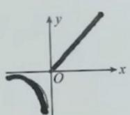

原文页码：1；bbox：`[717, 504, 830, 574]`

**图注：** 图1-2

## 图 2

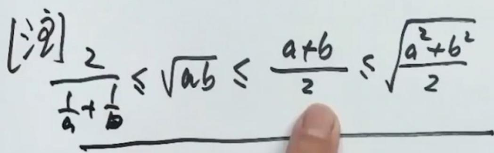

原文页码：2；bbox：`[169, 441, 803, 580]`

## 图 3

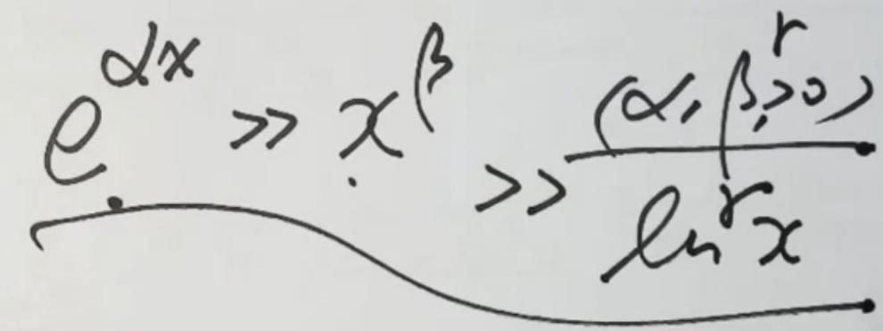

原文页码：2；bbox：`[152, 595, 751, 753]`

## 图 4

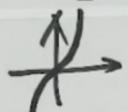

原文页码：3；bbox：`[408, 146, 485, 193]`

## 图 5

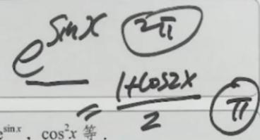

原文页码：4；bbox：`[598, 294, 820, 379]`

## 图 6

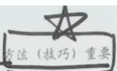

原文页码：4；bbox：`[662, 501, 751, 539]`

## 图 7

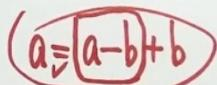

原文页码：4；bbox：`[566, 579, 697, 614]`

## 图 8

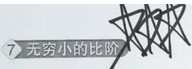

原文页码：5；bbox：`[216, 351, 445, 410]`

## 图 9

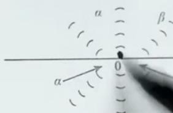

原文页码：5；bbox：`[675, 411, 845, 489]`

## 图 10

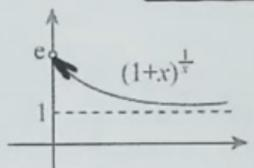

原文页码：7；bbox：`[401, 166, 554, 237]`

**图注：** (a)

## 图 11

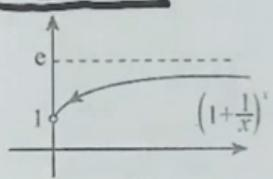

原文页码：7；bbox：`[573, 162, 737, 239]`

**图注：** (b)

## 图 12

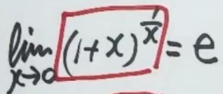

原文页码：7；bbox：`[253, 263, 473, 329]`

## 图 13

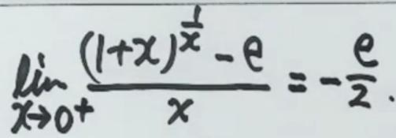

原文页码：7；bbox：`[499, 256, 803, 331]`

## 图 14

原文页码：9；bbox：`[176, 662, 205, 681]`

## 图 15

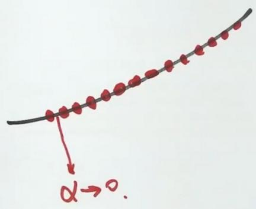

原文页码：12；bbox：`[349, 684, 610, 835]`

## 图 16

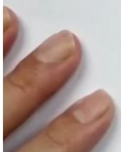

原文页码：15；bbox：`[149, 274, 272, 382]`

**图注：** (a)

## 图 17

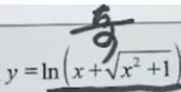

原文页码：15；bbox：`[278, 393, 401, 437]`

## 图 18

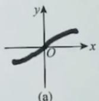

原文页码：15；bbox：`[406, 469, 507, 542]`

## 图 19

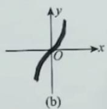

原文页码：15；bbox：`[521, 467, 626, 543]`

**图注：** 图1-3

## 图 20

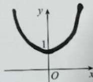

原文页码：15；bbox：`[734, 621, 845, 690]`

**图注：** 图1-4

## 图 21

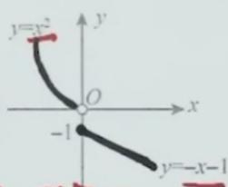

原文页码：16；bbox：`[678, 395, 830, 483]`

## 图 22

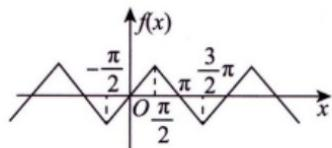

原文页码：18；bbox：`[425, 296, 625, 359]`

**图注：** 图1-29

## 图 23

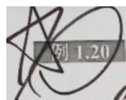

原文页码：20；bbox：`[147, 142, 243, 196]`

## 图 24

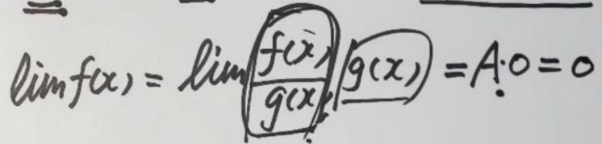

原文页码：20；bbox：`[356, 217, 806, 293]`

## 图 25

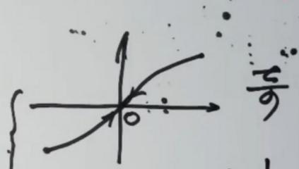

原文页码：20；bbox：`[588, 530, 843, 632]`

## 图 26

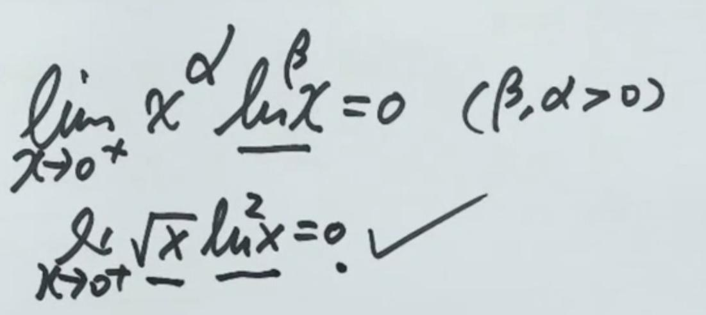

原文页码：21；bbox：`[176, 430, 842, 640]`
