# 第三讲  一元函数微分学.docx

# 第三讲 一元函数微分学

知识点：

## 绝对值处连续与可导的关系

注 (1) $f(x)$ 与 $\left|f(x)\right|$ 连续、可导的关系总结.

①设 $f(x)$ 在 $x_{0}$ 处连续，则 $|f(x)|$ 在 $x_{0}$ 处连续；反之不真。

②设 $f(x)$ 在 $x_{0}$ 处可导，则

a. $f(x_{0}) \neq 0 \Rightarrow |f(x)|$ 在 $x_{0}$ 处可导且 $\left[\left|f(x)\right|\right]' \bigg|_{x=x_{0}} = \begin{cases} f'(x_{0}), & f(x_{0}) > 0, \\ -f'(x_{0}), & f(x_{0}) < 0. \end{cases}$

b. $f(x_{0})=0$ ，且 $\left\{\begin{aligned}f'(x_{0})&=0\Rightarrow\left|f(x)\right|\text{ 在 }x_{0}\text{ 处可导且 }\left[\left|f(x)\right|\right]'\bigg|_{x=x_{0}}=0,\\ f'(x_{0})&\neq0\Rightarrow\left|f(x)\right|\text{ 在 }x_{0}\text{ 处不可导．}\end{aligned}\right.$

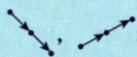

(2) $f(x)$ 在 $x_0$ 处连续 $\Rightarrow \left|f(x)\right|$ 在 $x_0$ 处必连续，为什么？

因为在 $x_{0}$ 处， $f(x)$ 的微观性态图（放大足够多倍）如图3-5(a)\~(c)所示.

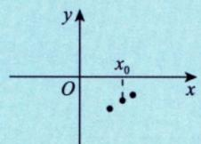  
(a)

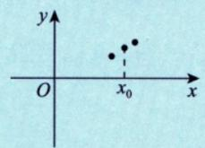  
(b)  
图 3-5

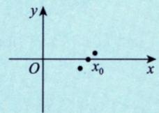  
(c)

而 $|f(x)|$ 如图3-6(a)\~(c)所示.

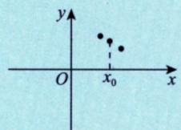  
(a)

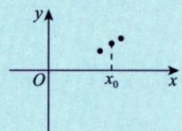  
(b)  
图3-6

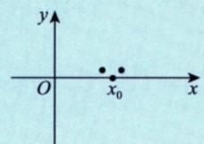  
(c)

点点相依相偎的图 3-5(a)\~(c)，加上绝对值后依然相依相偎成为图 3-6(a)\~(c)，故成立（无论是还是，只要相依相偎即可）。为什么反过来不对？很简单，你看 $\left|f(x)\right|$ 相依相偎，连续 [见图 3-7(b)]，可 $f(x)$ 却相距甚远，自然不连续 [见图 3-7(a)]。

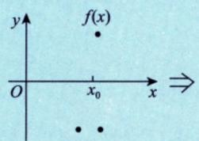  
(a)  
图3-7

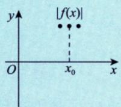  
(b)

(3) $f(x)$ 在 $x_0$ 处可导 $\Leftrightarrow |f(x)|$ 在 $x_0$ 处可导.

比如， $f(x)$ 在 $x_{0}$ 点处的微观性态图如图 3-8（a）所示（放大足够多倍），其在 $x_{0}$ 处可导，则 $\left|f(x)\right|$ 如图 3-8（b）所示.

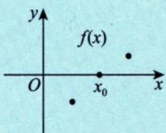  
(a)  
图3-8

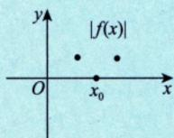  
(b)

如果说连续， $f(x)$ 在 $x_{0}$ 处连续 $\Rightarrow |f(x)|$ 在 $x_{0}$ 处连续，是的，点与点就是相依相偎在一起的，正如 (2) 所述。但说可导，不仅要相依相偎，而且要 $\lim_{x\to x_{0}}\frac{f(x)-f(x_{0})}{x-x_{0}}$ 存在（唯一的数），也就是 $f(x)$ 相依相偎到 $f(x_{0})$ 的速度要不比 $x\to x_{0}$ 的速度慢。（①若快，则 $\lim_{x\to x_{0}}\frac{f(x)-f(x_{0})}{x-x_{0}}=0$ ；②若同阶，则 $\lim_{x\to x_{0}}\frac{f(x)-f(x_{0})}{x-x_{0}}=A\neq0$ 。

请看图 3-8(a) 和图 3-8(b)，对于 $|f(x)|$ ， $\lim_{x\to x_{0}^{-}}\frac{|f(x)|-|f(x_{0})|}{x-x_{0}}<0$ （↘），而 $\lim_{x\to x_{0}^{+}}\frac{|f(x)|-|f(x_{0})|}{x-x_{0}}>0$ （↗），故 $\lim_{x\to x_{0}}\frac{|f(x)|-|f(x_{0})|}{x-x_{0}}$ 不存在， $|f(x)|$ 在 $x_{0}$ 处不可导，即若 $f(x)$ 在 $x_{0}$ 处可导， $f(x_{0})=0$ ， $f'(x_{0})\neq0$ ，则 $|f(x)|$ 在 $x_{0}$ 处必不可导。反例同 (2).

现在，试试看，你应该可以清楚回答了：若 $f(x)$ 在 $x_{0}$ 处可导，且 $f(x_{0})\neq0$ ，则 $|f(x)|$ 在 $x_{0}$ 处必可导，如图3-9(a)，图3-9(b)所示.

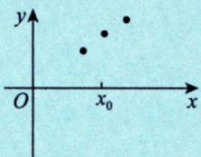  
(a)

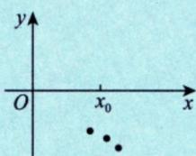  
(b)  
图3-9

提示：对于连续或可导函数，只要 $f(x_{0})$ ( $>$ ) 0，无论 $f(x_{0})$ 与0的距离有多小，它旁边相依相偎的 $f(x)$ 一定( $>$ ) 0，考研中常用这一点.

# $\left\{ \begin{array} { l } { f ( x ) \text { 在 } x _ { 0 } \text { 可得 } } \\ { f ( x _ { 0 } ) = 0 . } \\ { \left\{ \frac { f ( x _ { 0 } ) \neq 0 } { \text { 有测到数比例 } } \right. } \end{array} \right. \Rightarrow \left| f ( x ) \right| _ { \text { 不可得. }\ }$

题目：

题目1

例3.3 设 $f(x)$ 在 $x=0$ 的某邻域内有定义，并且 $|f(x)|\leqslant1-\cos x$ ，则 $f(x)$ 在 $x=0$ 处（）.

(A) 极限存在但不连续

(B) 连续但不可导

(C) 可导且 $f'(0)=0$ (D) 可导且 $f'(0)\neq0$

|解| $0 \leqslant |f(x)| \leqslant 1 - \cos x \xrightarrow{x \to 0} 0$ $\Rightarrow \lim _{x \to 0} |f(x)| = 0 \Leftrightarrow \lim _{x \to 0} f(x) = 0.$ 夹通

又 x = 0 时， $|f(0)| \leqslant 1 - \cos 0 = 0 \Rightarrow f(0) = 0$ $\therefore f(x) = f(0) \Rightarrow f(x)$ 在 x = 0 处以得

$$
\begin{array}{r l} & {\mathrm{且由于} f (0) = 0 \quad \frac {| f (x) |}{| x |} \leqslant \frac {1 - \cos x}{| x |}} \\ & {0 \leqslant \left| \frac {f (x) - f (0)}{x - 0} \right| \leqslant \frac {1 - \cos x}{| x |} \xrightarrow {x \to 0} 0} \\ & {\Rightarrow \lim _ {x \to 0} \left| \frac {f (x) - f (0)}{x - 0} \right| = 0.} \\ & {\Leftrightarrow \lim _ {x \to 0} \frac {f (x) - f (0)}{x - 0} = 0} \\ & {\Rightarrow f ^ {\prime} (0) = 0} \\ & {\mathrm{公众号[无机密]}} \\ & {\mathrm{信4550060}} \end{array}
$$

## 题目 2

例 3.11 设函数 $f(u)$ 可导，且 $y = f(x^{2})$ ，当自变量 x 在 x = -1 处取得增量 $\Delta x = -0.1$ 时，相应的函数增量 $\Delta y$ 的线性主部为 0.1，则 $f'(1) = (\quad)$ .

(A) -1 (B) 0.1 (C) 0.5 (D) 1

分析 概念题. 对复合函数 $y = f[g(x)]$ 求导，有 $y' = f'[g(x)] \cdot g'(x)$ .

必背公式来源： $\Delta y=A\Delta x+o(\Delta x)$ ，其中 $dy=A\Delta x=y'dx$ 为线性主部。

解 应选(C).

本题依然是考查微分的定义. 函数的微分是函数增量的线性主部，且 $dy = y'dx = y'\Delta x$ ，而

$$
\mathrm{d} y = f ^ {\prime} \left(x ^ {2}\right) \mathrm{d} \left(x ^ {2}\right) = 2 x f ^ {\prime} \left(x ^ {2}\right) \mathrm{d} x = 2 x f ^ {\prime} \left(x ^ {2}\right) \Delta x,
$$

因此，由 $0.1 = -2f'(1) \cdot (-0.1)$ ，可得 $f'(1) = 0.5$ ，故选(C).

## 题目 3

3.7 证明：(1) 若 $F(x)$ 在 $[x_0, x_0 + \delta)(\delta > 0)$ 连续，在 $(x_0, x_0 + \delta)$ 内可导，当 $\lim_{x \to x_0^+} F'(x) \stackrel{\text{存在}}{=} A$ 时，有 $F_+(x_0) = A$ ；

(2) 若 $F(x)$ 在 $(x_0 - \delta, x_0] (\delta > 0)$ 连续，在 $(x_0 - \delta, x_0)$ 内可导，当 $\lim_{x \to x_0} F'(x) \stackrel{\text{存在}}{=} A$ 时，有 $F_{-}'(x_0) = A$

3.7 证明 (1) $F_{+}^{\prime}(x_0) = \lim_{x\to x_0^+}\frac{F(x) - F(x_0)}{x - x_0} \overset{\text{洛必达法则}}{=} \lim_{x\to x_0^+}\frac{F'(x)}{1} = A$ .

(2) $F_{-}^{\prime}(x_{0})=\lim_{x\to x_{0}^{-}}\frac{F(x)-F(x_{0})}{x-x_{0}}$ 洛必达法则 $\lim_{x\to x_{0}^{-}}\frac{F^{\prime}(x)}{1}=A$

注 满足(1)，(2)的条件时，有 $\lim_{\substack{x\to x_0^+\\ (x_0^-)}}F'(x)\stackrel {\text{存在}}{=}A$ ，则 $F_{+}^{\prime}(x_0)\stackrel {\text{存在}}{=}A$ .但 $\lim_{\substack{x\to x_0^+\\ (x_0^-)}}F'(x)$ 不存在时，

$F_{+}^{\prime}(x_{0})$ 亦可能存在. 如 $F(x)=\left\{\begin{aligned}&x^{2}\sin\frac{1}{x},&x\neq0,\\ &0,&x=0.\end{aligned}\right.$

$$
\text {   当   } x = 0 \text {   时,   } F ^ {\prime} (0) = \lim _ {x \to 0} \frac {F (x) - F (0)}{x - 0} = \lim _ {x \to 0} x \sin \frac {1}{x} = 0.
$$

当 $x \neq 0$ 时， $F'(x) = 2x\sin \frac{1}{x} - \cos \frac{1}{x}$ ， $\lim_{x \to 0^+} F'(x)$ 不存在。但由 $F'(0) = 0$ ，知 $F_+(0) = 0$ （存在）。

## 核心工具：拉格朗日中值定理

因为 $F(x)$ 在 $[x_0,x]$ 上连续，在 $(x_0,x)$ 内可导，所以对任意

$$
x \in (x _ {0}, x _ {0} + \delta)
$$

由拉格朗日中值定理，存在一点 $\xi \in (x_0, x)$ ，使得：

$$
\frac {F (x) - F (x _ {0})}{x - x _ {0}} = F ^ {\prime} (\xi)
$$

注意这里的 $\xi$ 在 $x_0$ 和 $x$ 之间。

当

$$
x \to x _ {0} ^ {+}
$$

时，因为

$$
x _ {0} <   \xi <   x
$$

所以也有：

$$
\xi \rightarrow x _ {0} ^ {+}
$$

于是：

$$
F ^ {\prime} (\xi) \to A
$$

所以：

$$
\frac {F (x) - F \left(x _ {0}\right)}{x - x _ {0}} \rightarrow A
$$

因此：

$$
F _ {+} ^ {\prime} (x _ {0}) = A
$$

## 第（2）问类似

已知左侧连续、左侧可导，并且：

$$
\lim _ {x \to x _ {0} ^ {-}} F ^ {\prime} (x) = A
$$

证明：

$$
F _ {-} ^ {\prime} (x _ {0}) = A
$$

左导数定义是：

$$
F _ {-} ^ {\prime} (x _ {0}) = \lim _ {x \to x _ {0} ^ {-}} \frac {F (x) - F (x _ {0})}{x - x _ {0}}
$$

对任意

$$
\boldsymbol {x} \in (x _ {0} - \delta , x _ {0})
$$

在区间 $[x, x_0]$ 上用拉格朗日中值定理，存在：

$$
\xi \in (x, x _ {0})
$$

使得：

$$
\frac {F (x) - F (x _ {0})}{x - x _ {0}} = F ^ {\prime} (\xi)
$$

当

$$
x \rightarrow x _ {0} ^ {-}
$$

时，

$$
\xi \rightarrow x _ {0} ^ {-}
$$

所以：

$$
F ^ {\prime} (\xi) \to A
$$

因此：

$$
F _ {-} ^ {\prime} (x _ {0}) = A
$$

## 1.切线与导数

## 考点:

## 结论先给：切线存在，导数不一定存在

## 一、核心原因

函数在某点有切线，只需要几何上有一条直线和曲线在该点相切；

但导数存在要求：切线必须不是垂直于 $\mathbf{x}$ 轴的竖直切线。

## 二、经典反例

举最典型的：

$$
y = \sqrt [ 3 ]{x}
$$

在 $x = 0$ 处：

1. 几何上：曲线在原点有竖直切线 $x = 0$ ，切线存在；

2. 求导数：

$$
y ^ {\prime} = \frac {1}{3} x ^ {- \frac {2}{3}} = \frac {1}{3 \sqrt [ 3 ]{x ^ {2}}}
$$

当 $x \to 0$ 时， $y' \to \infty$ ，导数不存在。

这就完美说明：有切线（竖直切线），但导数不存在。

## 三、反过来对比

\- 导数存在 $\Rightarrow$ 一定有非竖直切线

导数存在就是切线斜率存在，一定有斜的 / 水平切线。

\- 有切线 $\nRightarrow$ 导数存在

一旦是竖直切线，斜率为无穷大，导数就不存在。

## 四、一句话总结

只有非竖直切线 $\Leftrightarrow$ 导数存在；

竖直切线 $\Leftrightarrow$ 切线存在，但导数不存在。

|（注：部分内容可能由 AI 生成）
