# 第二讲 数列极限.docx — 图像索引

> 由 MinerU 结构化结果生成。题目若依赖树形、拓扑、流程、曲线、区域、时序或其他空间关系，应核对这里的原图，不要只依据 OCR 文本推断。

## 图 1

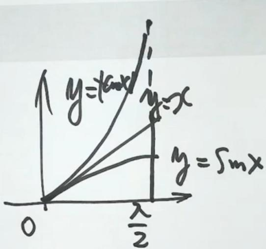

原文页码：4；bbox：`[473, 443, 801, 661]`

## 图 2

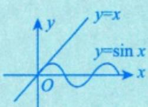

原文页码：4；bbox：`[524, 709, 675, 787]`

## 图 3

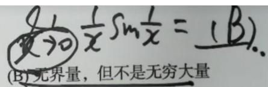

原文页码：6；bbox：`[517, 388, 786, 450]`

## 图 4

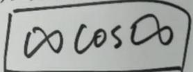

原文页码：6；bbox：`[542, 468, 710, 512]`

## 图 5

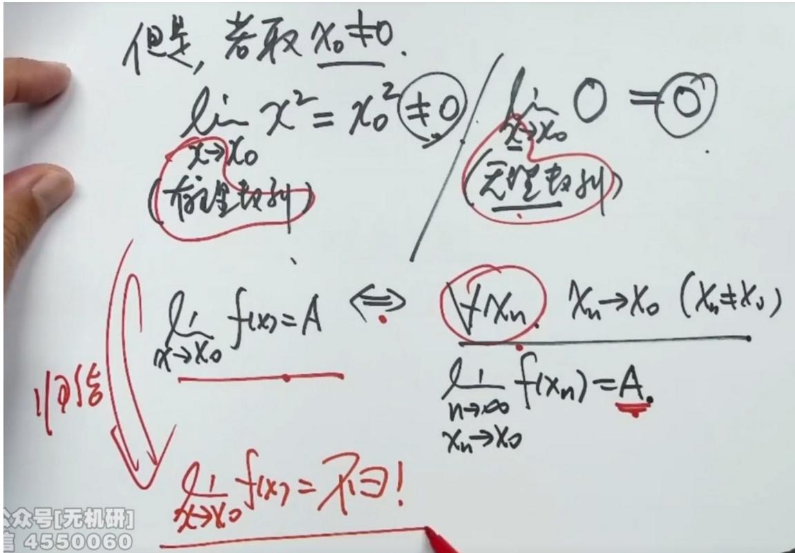

原文页码：9；bbox：`[149, 84, 845, 426]`

## 图 6

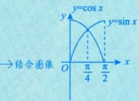

原文页码：10；bbox：`[633, 178, 800, 263]`

## 图 7

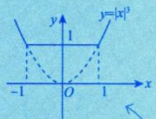

原文页码：10；bbox：`[168, 259, 302, 331]`

## 图 8

原文页码：11；bbox：`[194, 158, 221, 178]`

## 图 9

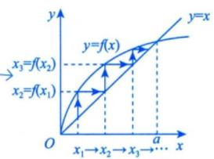

原文页码：11；bbox：`[542, 674, 707, 760]`

## 图 10

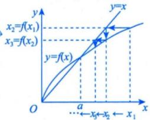

原文页码：11；bbox：`[547, 760, 700, 847]`

## 图 11

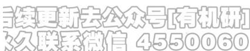

原文页码：12；bbox：`[149, 580, 406, 617]`

## 图 12

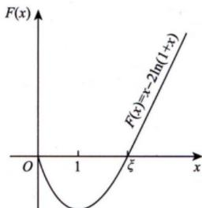

原文页码：12；bbox：`[603, 695, 757, 808]`

**图注：** 图 2-2

## 图 13

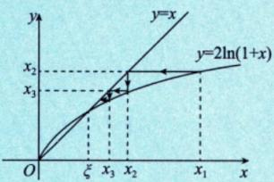

原文页码：13；bbox：`[408, 397, 593, 483]`

**图注：** 图2-3

## 图 14

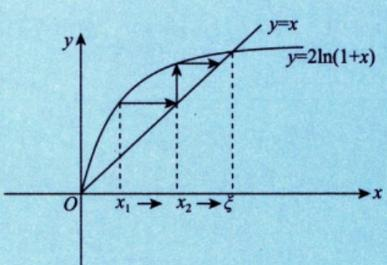

原文页码：13；bbox：`[403, 583, 636, 696]`

**图注：** 图2-4

## 图 15

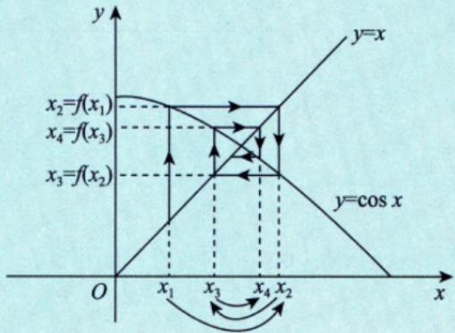

原文页码：15；bbox：`[420, 137, 727, 297]`

**图注：** 图2-5

## 图 16

原文页码：15；bbox：`[149, 524, 428, 564]`
