# 第五讲  一元函数微分学的应用（一）.docx — 图像索引

> 由 MinerU 结构化结果生成。题目若依赖树形、拓扑、流程、曲线、区域、时序或其他空间关系，应核对这里的原图，不要只依据 OCR 文本推断。

## 图 1

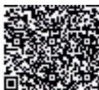

原文页码：1；bbox：`[700, 281, 774, 329]`

## 图 2

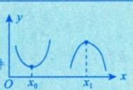

原文页码：1；bbox：`[655, 407, 769, 462]`

## 图 3

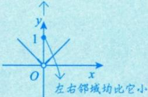

原文页码：1；bbox：`[680, 577, 833, 649]`

## 图 4

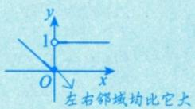

原文页码：1；bbox：`[680, 655, 828, 713]`

## 图 5

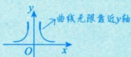

原文页码：1；bbox：`[684, 724, 842, 772]`

## 图 6

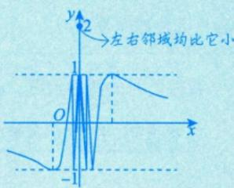

原文页码：1；bbox：`[660, 794, 840, 896]`

## 图 7

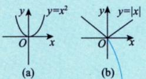

原文页码：2；bbox：`[608, 218, 757, 275]`

**图注：** 图 5-1
极小值点，但不可导.

## 图 8

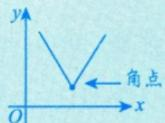

原文页码：2；bbox：`[532, 640, 631, 693]`

## 图 9

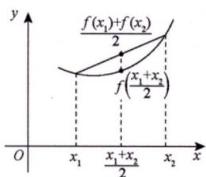

原文页码：4；bbox：`[289, 747, 445, 843]`

**图注：** 图形上任意弧段位于弦的下方

## 图 10

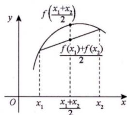

原文页码：4；bbox：`[507, 741, 665, 843]`

**图注：** (a)

## 图 11

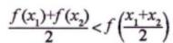

原文页码：4；bbox：`[532, 859, 647, 879]`

**图注：** 图形上任意弧段位于弦的上方 图5-2 (b)

## 图 12

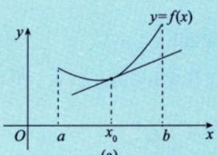

原文页码：5；bbox：`[331, 552, 494, 634]`

## 图 13

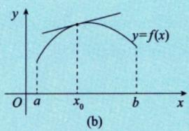

原文页码：5；bbox：`[512, 561, 675, 640]`

**图注：** 图5-3

## 图 14

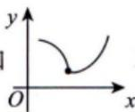

原文页码：6；bbox：`[250, 195, 341, 248]`

## 图 15

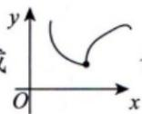

原文页码：6；bbox：`[354, 195, 448, 248]`

## 图 16

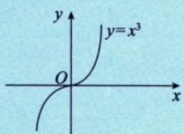

原文页码：6；bbox：`[381, 760, 505, 825]`

**图注：** (a)

## 图 17

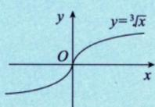

原文页码：6；bbox：`[519, 766, 638, 825]`

**图注：** 图 5-4 (b)

## 图 18

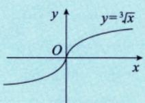

原文页码：7；bbox：`[694, 200, 821, 265]`

**图注：** 图5-5

## 图 19

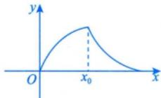

原文页码：9；bbox：`[584, 193, 722, 253]`

## 图 20

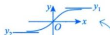

原文页码：9；bbox：`[653, 656, 789, 687]`

## 图 21

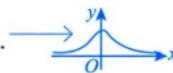

原文页码：9；bbox：`[561, 709, 665, 740]`

## 图 22

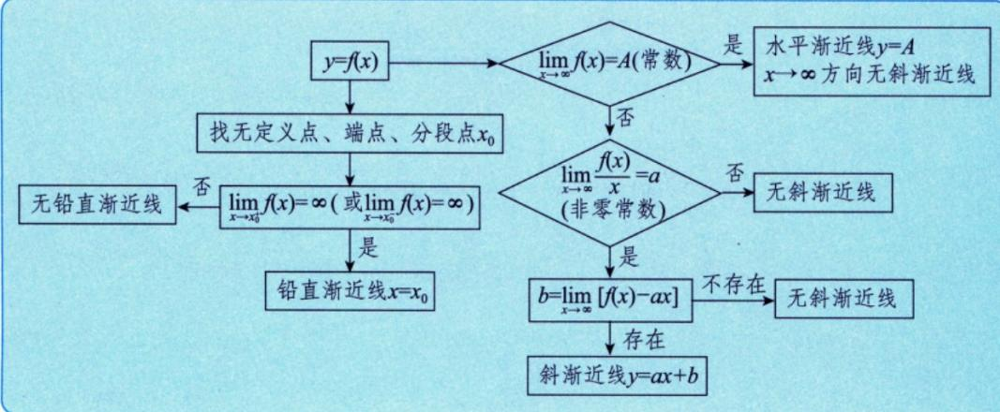

原文页码：11；bbox：`[166, 104, 811, 292]`

## 图 23

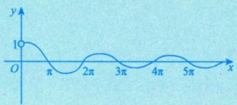

原文页码：11；bbox：`[388, 435, 623, 508]`

## 图 24

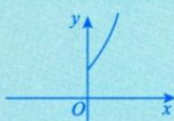

原文页码：13；bbox：`[705, 417, 821, 474]`

## 图 25

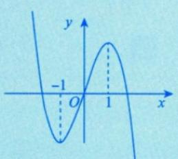

原文页码：13；bbox：`[680, 686, 836, 784]`

## 图 26

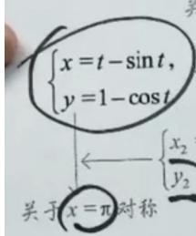

原文页码：14；bbox：`[149, 409, 278, 519]`

## 图 27

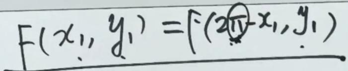

原文页码：14；bbox：`[231, 514, 655, 575]`

## 图 28

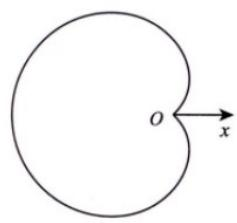

原文页码：14；bbox：`[169, 657, 312, 752]`

## 图 29

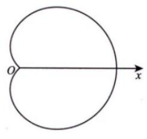

原文页码：14；bbox：`[331, 658, 478, 757]`

## 图 30

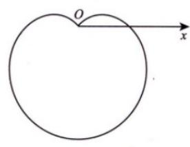

原文页码：14；bbox：`[487, 668, 653, 759]`

## 图 31

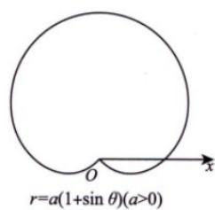

原文页码：14；bbox：`[657, 671, 803, 772]`

## 图 32

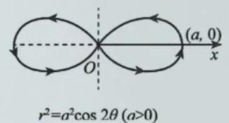

原文页码：15；bbox：`[300, 164, 499, 239]`

**图注：** (a)

## 图 33

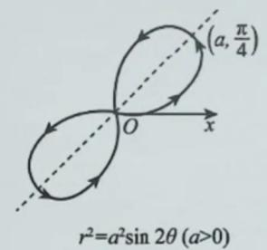

原文页码：15；bbox：`[581, 121, 759, 239]`

**图注：** (b)

## 图 34

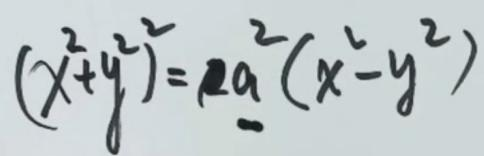

原文页码：15；bbox：`[240, 265, 532, 331]`

## 图 35

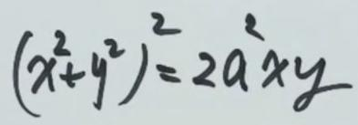

原文页码：15；bbox：`[598, 256, 835, 315]`

## 图 36

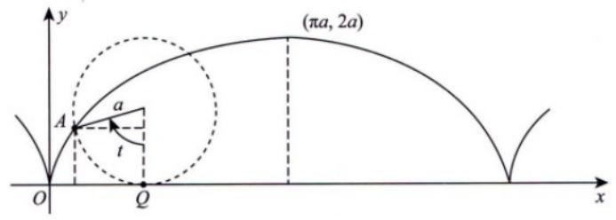

原文页码：15；bbox：`[289, 376, 707, 482]`

## 图 37

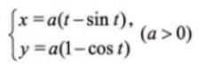

原文页码：15；bbox：`[416, 487, 551, 518]`

**图注：** 附

## 图 38

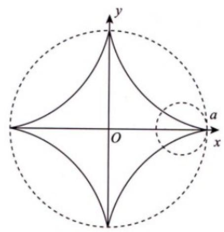

原文页码：15；bbox：`[470, 609, 744, 810]`

## 图 39

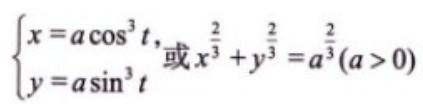

原文页码：15；bbox：`[460, 816, 715, 860]`

## 图 40

原文页码：16；bbox：`[149, 186, 421, 224]`

## 图 41

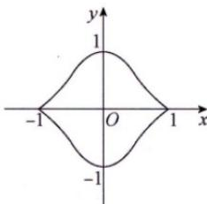

原文页码：16；bbox：`[635, 404, 776, 502]`

**图注：** 图5-7

## 图 42

原文页码：17；bbox：`[211, 694, 236, 709]`

## 图 43

原文页码：17；bbox：`[208, 135, 233, 152]`

## 图 44

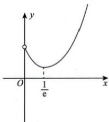

原文页码：17；bbox：`[405, 549, 537, 655]`

**图注：** 图5-8

## 图 45

原文页码：24；bbox：`[159, 274, 430, 311]`

## 图 46

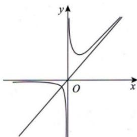

原文页码：25；bbox：`[425, 656, 588, 771]`

**图注：** 图5-6

## 图 47

原文页码：26；bbox：`[147, 186, 410, 225]`

## 图 48

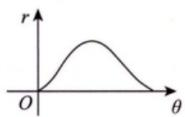

原文页码：26；bbox：`[416, 303, 527, 353]`

**图注：** 图 5-10

## 图 49

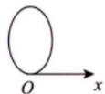

原文页码：26；bbox：`[436, 395, 505, 439]`

**图注：** 图5-11
