# 第八讲 一元函数积分学的概念与性质.docx — 图像索引

> 由 MinerU 结构化结果生成。题目若依赖树形、拓扑、流程、曲线、区域、时序或其他空间关系，应核对这里的原图，不要只依据 OCR 文本推断。

## 图 1

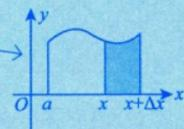

原文页码：1；bbox：`[699, 388, 810, 443]`

## 图 2

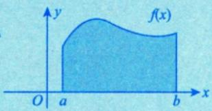

原文页码：2；bbox：`[314, 131, 500, 200]`

## 图 3

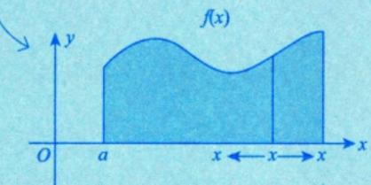

原文页码：2；bbox：`[342, 234, 594, 323]`

## 图 4

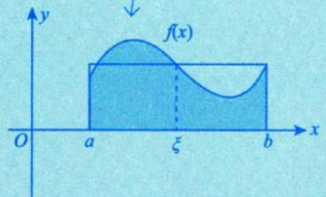

原文页码：2；bbox：`[334, 406, 556, 501]`

## 图 5

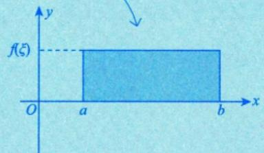

原文页码：2；bbox：`[566, 406, 798, 501]`

## 图 6

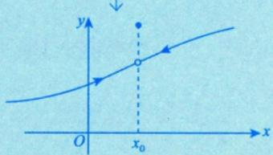

原文页码：2；bbox：`[394, 703, 600, 785]`

## 图 7

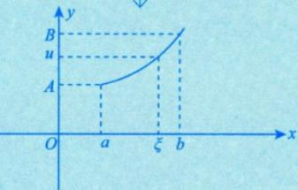

原文页码：4；bbox：`[549, 565, 752, 657]`

## 图 8

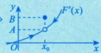

原文页码：5；bbox：`[680, 118, 800, 162]`

## 图 9

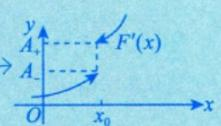

原文页码：5；bbox：`[705, 269, 838, 323]`

## 图 10

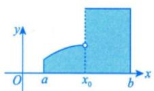

原文页码：10；bbox：`[216, 156, 352, 214]`

## 图 11

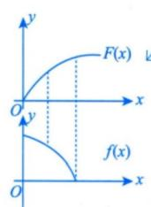

原文页码：10；bbox：`[403, 126, 505, 225]`

## 图 12

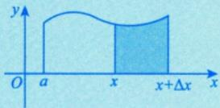

原文页码：10；bbox：`[620, 363, 784, 420]`

## 图 13

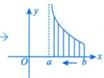

原文页码：15；bbox：`[606, 135, 729, 200]`

## 图 14

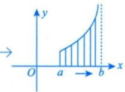

原文页码：15；bbox：`[601, 205, 727, 271]`

## 图 15

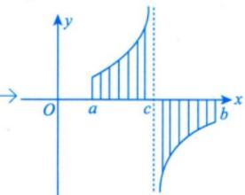

原文页码：15；bbox：`[618, 272, 784, 366]`

## 图 16

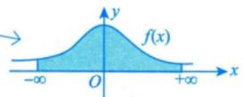

原文页码：17；bbox：`[584, 437, 749, 483]`

## 图 17

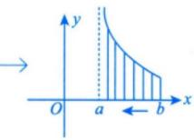

原文页码：18；bbox：`[589, 190, 719, 255]`

## 图 18

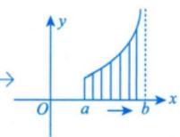

原文页码：18；bbox：`[596, 258, 717, 323]`

## 图 19

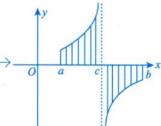

原文页码：18；bbox：`[611, 325, 773, 414]`

## 图 20

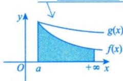

原文页码：19；bbox：`[546, 153, 690, 221]`

## 图 21

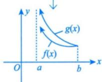

原文页码：25；bbox：`[564, 139, 687, 209]`

## 图 22

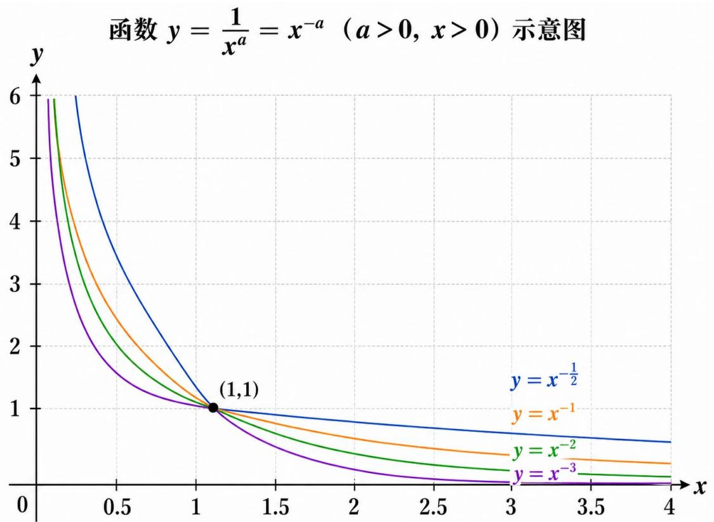

原文页码：27；bbox：`[166, 514, 847, 866]`

## 图 23

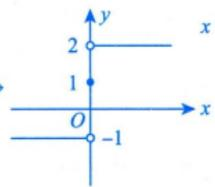

原文页码：48；bbox：`[586, 114, 715, 193]`

## 图 24

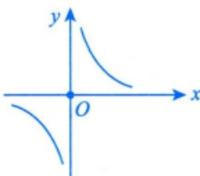

原文页码：48；bbox：`[620, 233, 741, 307]`

## 图 25

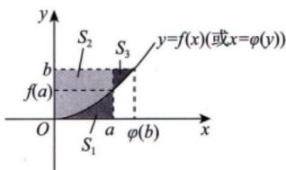

原文页码：48；bbox：`[411, 636, 603, 717]`

**图注：** 图8-3

## 图 26

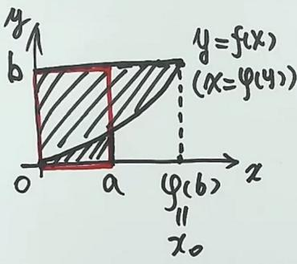

原文页码：49；bbox：`[347, 185, 571, 325]`

## 图 27

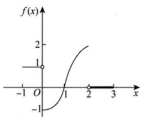

原文页码：51；bbox：`[406, 376, 574, 475]`

**图注：** 图8-6

## 图 28

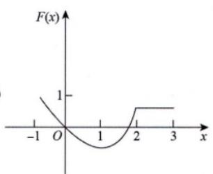

原文页码：51；bbox：`[225, 495, 410, 602]`

**图注：** (A)

## 图 29

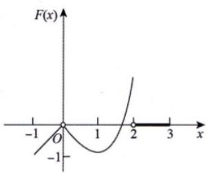

原文页码：51；bbox：`[524, 497, 705, 604]`

**图注：** (B)

## 图 30

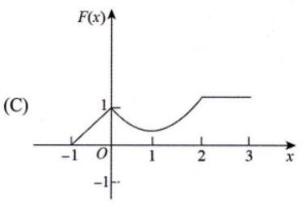

原文页码：51；bbox：`[203, 607, 428, 715]`

## 图 31

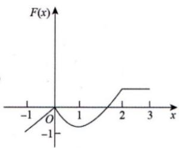

原文页码：51；bbox：`[524, 607, 705, 713]`

**图注：** (D)

## 图 32

原文页码：53；bbox：`[147, 403, 416, 445]`

## 图 33

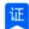

原文页码：53；bbox：`[210, 678, 235, 696]`
