# 第六讲  一元函数微分学的应用（二）.docx — 图像索引

> 由 MinerU 结构化结果生成。题目若依赖树形、拓扑、流程、曲线、区域、时序或其他空间关系，应核对这里的原图，不要只依据 OCR 文本推断。

## 图 1

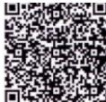

原文页码：1；bbox：`[684, 282, 754, 331]`

## 图 2

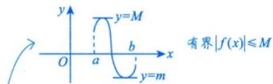

原文页码：1；bbox：`[393, 343, 601, 388]`

## 图 3

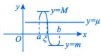

原文页码：1；bbox：`[633, 409, 757, 457]`

## 图 4

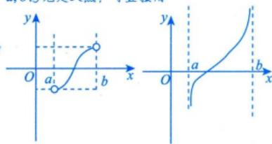

原文页码：2；bbox：`[500, 495, 734, 583]`

## 图 5

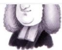

原文页码：3；bbox：`[687, 83, 764, 127]`

## 图 6

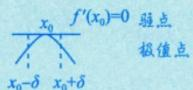

原文页码：3；bbox：`[598, 350, 714, 388]`

## 图 7

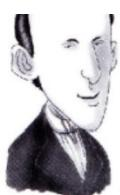

原文页码：7；bbox：`[737, 697, 810, 781]`

## 图 8

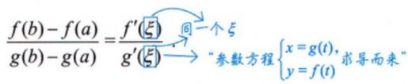

原文页码：7；bbox：`[413, 797, 724, 843]`

## 图 9

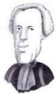

原文页码：9；bbox：`[702, 457, 771, 538]`

## 图 10

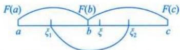

原文页码：11；bbox：`[386, 237, 598, 279]`

**图注：** 由 $F^{\prime}(\xi_{1}) = F^{\prime}(\xi_{2}) = 0$ ，得 $F''(\xi) = 0$

## 图 11

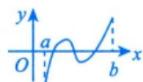

原文页码：11；bbox：`[495, 675, 581, 709]`

## 图 12

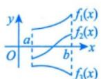

原文页码：11；bbox：`[734, 719, 821, 768]`

## 图 13

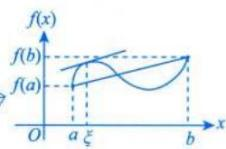

原文页码：12；bbox：`[557, 583, 694, 646]`

## 图 14

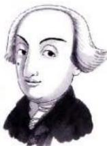

原文页码：12；bbox：`[699, 577, 793, 669]`

**图注：** 拉格朗日
(1736—1813)

## 图 15

原文页码：14；bbox：`[147, 326, 416, 366]`

## 图 16

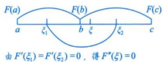

原文页码：14；bbox：`[361, 505, 556, 557]`

## 图 17

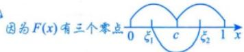

原文页码：15；bbox：`[588, 205, 803, 237]`

## 图 18

原文页码：16；bbox：`[156, 373, 428, 410]`

## 图 19

原文页码：17；bbox：`[198, 306, 225, 326]`

## 图 20

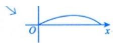

原文页码：20；bbox：`[658, 80, 793, 116]`
