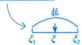
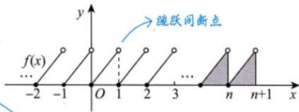
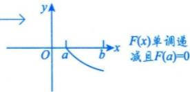

# 第十一讲  一元函数积分学的应用（二）---积分等式与积分不等式.docx — 图像索引

> 由 MinerU 结构化结果生成。题目若依赖树形、拓扑、流程、曲线、区域、时序或其他空间关系，应核对这里的原图，不要只依据 OCR 文本推断。

## 图 1

原文页码：12；bbox：`[433, 498, 536, 537]`

## 图 2

原文页码：14；bbox：`[347, 231, 603, 299]`

**图注：** 图11-1

## 图 3

原文页码：15；bbox：`[621, 122, 788, 179]`
