# 第十七讲 多元函数积分学.docx

# 第十七讲 多元函数积分学

知识点：

向量的运算及运用：

数量积:

设 $\boldsymbol{a}=(a_{x},a_{y},a_{z}),\boldsymbol{b}=(b_{x},b_{y},b_{z}),\boldsymbol{c}=(c_{x},c_{y},c_{z}),\boldsymbol{a},\boldsymbol{b},\boldsymbol{c}$ 均是非零向量.

(1) 数量积 (内积、点积) 及其应用.

① $\boldsymbol{a}\cdot\boldsymbol{b}=(a_{x},a_{y},a_{z})\cdot(b_{x},b_{y},b_{z})=a_{x}b_{x}+a_{y}b_{y}+a_{z}b_{z}$

② $a \cdot b = |a||b|\cos\theta$ ，则 $\cos\theta = \frac{a \cdot b}{|a||b|} = \frac{a_x b_x + a_y b_y + a_z b_z}{\sqrt{a_x^2 + a_y^2 + a_z^2} \cdot \sqrt{b_x^2 + b_y^2 + b_z^2}}$ ，其中 $\theta$ 为 a, b 的夹角.

③ $a \perp b \Leftrightarrow \theta = \frac{\pi}{2} \Leftrightarrow a \cdot b = |a||b| \cos \theta = 0 \Leftrightarrow a_x b_x + a_y b_y + a_z b_z = 0$ . 垂直方程最常用

例：若 $(1,2,1)$ 与 $(a,1, - 1)$ 垂直，则 $a + 2 - 1 = 0$ ，即 $a = -1$

④ $\Pr j_{b}a=\frac{a\cdot b}{|b|}=\frac{a_{x}b_{x}+a_{y}b_{y}+a_{z}b_{z}}{\sqrt{b_{x}^{2}+b_{y}^{2}+b_{z}^{2}}}$ ，称为 a 在 b 上的投影.

(2) 向量积 (外积、叉积) 及其应用.

$$
\left| \begin{array}{c c c} i & j & k \end{array} \right|
$$

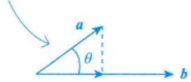

向量积:

(2) 向量积 (外积、叉积) 及其应用.

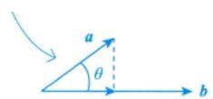

① $a \times b = \begin{vmatrix} i & j & k \\ a_x & a_y & a_z \\ b_x & b_y & b_z \end{vmatrix}$ ，其中 $|a \times b| = |a||b|\sin\theta$ ，用右手规则确定方向（转向角不超过 $\pi$ ）， $\theta$ 为 a, b

的夹角.

② $a \parallel b \Leftrightarrow \theta = 0$ 或 $\pi \Leftrightarrow \frac{a_x}{b_x} = \frac{a_y}{b_y} = \frac{a_z}{b_z}$ .

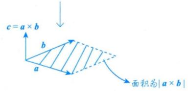

(3) 混合积及其应用.

向量积的长度就是向量 a 和 b 所围的面积

## 混合积：

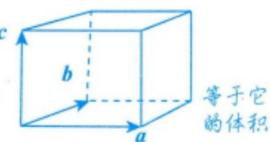

$$
[ \boldsymbol {a b c} ] = (\boldsymbol {a} \times \boldsymbol {b}) \cdot \boldsymbol {c} = \left| \begin{array}{l l l} a _ {x} & a _ {y} & a _ {z} \\ b _ {x} & b _ {y} & b _ {z} \\ c _ {x} & c _ {y} & c _ {z} \end{array} \right|.
$$

② $\begin{vmatrix}a_{x}&a_{y}&a_{z}\\b_{x}&b_{y}&b_{z}\\c_{x}&c_{y}&c_{z}\end{vmatrix}=0\Leftrightarrow$ 三向量共面.

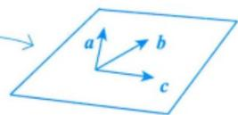

## 向量的方向角和方向余弦：

## 3 向量的方向角和方向余弦

(1) 非零向量 a 与 x 轴、y 轴和 z 轴正向的夹角 $\alpha, \beta, \gamma$ 称为 a 的方向角.

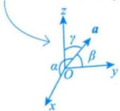

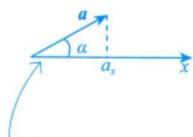

(2) $\cos\alpha,\cos\beta,\cos\gamma$ 称为 a 的方向余弦，且 $\cos\alpha=\frac{a_{x}}{|a|},\cos\beta=\frac{a_{y}}{|a|},\cos\gamma=\frac{a_{z}}{|a|}$

(3) $a^{\circ}=\frac{a}{|a|}=(\cos\alpha,\cos\beta,\cos\gamma)$ 称为向量a的单位向量(表示方向的向量).

(4) 任意向量 $r = xi + yj + zk = (r\cos \alpha, r\cos \beta, r\cos \gamma) = r(\cos \alpha, \cos \beta, \cos \gamma)$ ，其中 $\cos \alpha, \cos \beta, \cos \gamma$ 为 $r$ 的方向余弦， $r$ 为 $r$ 的模， $\cos \alpha = \frac{x}{\sqrt{x^2 + y^2 + z^2}}$ ， $\cos \beta = \frac{y}{\sqrt{x^2 + y^2 + z^2}}$ ， $\cos \gamma = \frac{z}{\sqrt{x^2 + y^2 + z^2}}$ ， $r = \sqrt{x^2 + y^2 + z^2}$ 。

例 $\boldsymbol{a}=(1,1,2)$ ， $\left|\boldsymbol{a}\right|=\sqrt{1^{2}+1^{2}+2^{2}}=\sqrt{6}$

例 17.1 设函数 $f(x, y)$ 在点 $(0, 0)$ 处可微， $f(0, 0) = 0$ ，

$n=\left(\frac{\partial f}{\partial x},\frac{\partial f}{\partial y},-1\right)\bigg|_{(0,0)}$ ，则 $\lim_{(x,y)\to(0,0)}\frac{n\cdot(x,y,f(x,y))}{\sqrt{x^{2}+y^{2}}}=\underline{\quad}$

$$
\text {则}   \pmb {a} ^ {\circ} = \left(\frac {1}{\sqrt {6}}, \frac {1}{\sqrt {6}}, \frac {2}{\sqrt {6}}\right)
$$

## 空间平面与直线：

平面方程:

## 1 平面方程 （三元一次方程）

已知 $\uparrow n=(A, B, C)$ $P_{0}(x_{0}, y_{0}, z_{0})$ . 定平面的二要素 $\left\{\begin{aligned}& 法向量 n \\ & 过一点 P_{0}\end{aligned}\right.$

以下假设平面的法向量 $n=(A,B,C)$ .

$$
\overrightarrow {P _ {0} P} = (x - x _ {0}, y - y _ {0}, z - z _ {0}), \text {由} \overrightarrow {P _ {0} P} \perp n \Rightarrow (\overrightarrow {P _ {0} P}, n) = 0,
$$

$$
\text { 即 } A (x - x _ {0}) + B (y - y _ {0}) + C (z - z _ {0}) = 0 ,
$$

①一般式： $Ax + By + Cz + D = 0$

将点法式展开，记 $D_{1}=Ax_{0}+By_{0}+Cz_{0}$ ，则得到一般式的形式

②点法式： $A(x-x_{0})+B(y-y_{0})+C(z-z_{0})=0$

③三点式： $\begin{vmatrix}x-x_{1}&y-y_{1}&z-z_{1}\\x-x_{2}&y-y_{2}&z-z_{2}\\x-x_{3}&y-y_{3}&z-z_{3}\end{vmatrix}=0$ （平面过不共线的三点 $P_{i}(x_{i},y_{i},z_{i}),i=1,2,3$ ）.

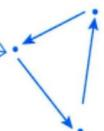

三点连线构成一个平面

④截距式： $\frac{x}{a}+\frac{y}{b}+\frac{z}{c}=1$ （平面过 $(a,0,0),(0,b,0),(0,0,c)$ 三点）.

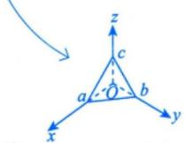

⑤平面束方程：设 $\pi_{i}: A_{1}x + B_{1}y + C_{1}z + D_{i} = 0, i = 1, 2. A_{1}, B_{1}, C_{1}$ 与 $A_{2}, B_{2}, C_{2}$ 不成比例，则过 L: $\left\{\begin{aligned}A_{1}x + B_{1}y + C_{1}z + D_{1} &= 0, \\ A_{2}x + B_{2}y + C_{2}z + D_{2} &= 0\end{aligned}\right.$ 的平面束方程为

(交面式方程)

$$
A _ {1} x + B _ {1} y + C _ {1} z + D _ {1} + \lambda (A _ {2} x + B _ {2} y + C _ {2} z + D _ {2}) = 0 (\text {   不含   } \pi_ {2}),
$$

或

$$
A _ {2} x + B _ {2} y + C _ {2} z + D _ {2} + \lambda (A _ {1} x + B _ {1} y + C _ {1} z + D _ {1}) = 0 (\text {不含} \pi_ {1}).
$$

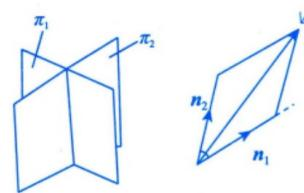

$\pi_{1}$ ， $\pi_{2}$ 的法向量分别为 $\boldsymbol{n}_{1}=(A_{1},B_{1},C_{1})$ ， $\boldsymbol{n}_{2}=(A_{2},B_{2},C_{2})$

$\lambda n_{1}+\mu n_{2}$ 生成整个平面，

$\lambda(A_{1}x+B_{1}y+C_{1}z+D_{1})+\mu(A_{2}x+B_{2}y+C_{2}z+D_{2})=0$ 表示过交线的所有平面.

令 $\lambda = 1$ ，则不包含 $\pi_{2}$ ，令 $\mu = 1$ ，则不包含 $\pi_{1}$

直线方程:

## 2 直线方程

以下假设直线的方向向量 $\tau=(l,m,n)$ .

①一般式： $\left\{\begin{aligned}A_{1}x+B_{1}y+C_{1}z+D_{1}&=0,n_{1}=(A_{1},B_{1},C_{1}),\\ A_{2}x+B_{2}y+C_{2}z+D_{2}&=0,n_{2}=(A_{2},B_{2},C_{2}),\end{aligned}\right.$ 其中 $n_{1}$ 不平行于 $n_{2}$

## 注 其几何背景很直观，是两个平面的交线，且该直线的方向向量 $\tau = n_{1} \times n_{2}$

②点向式： $\frac{x-x_{0}}{l}=\frac{y-y_{0}}{m}=\frac{z-z_{0}}{n}$ . 二要素 $\left\{\begin{array}{l}方向向量\tau \\过一点P_{0}\end{array}\right.$

$\pmb{\tau}$ 既垂直 $n_1$ 也垂直 $n_2$

③参数式： $\left\{\begin{aligned}x&=x_{0}+lt,\\ y&=y_{0}+mt,P_{0}(x_{0},y_{0},z_{0})\end{aligned}\right.$ 为直线上的已知点，t 为参数． $z = z_{0} + nt,$

④两点式： $\frac{x-x_{1}}{x_{2}-x_{1}}=\frac{y-y_{1}}{y_{2}-y_{1}}=\frac{z-z_{1}}{z_{2}-z_{1}}$ （直线过不同的两点 $P_{i}(x_{i},y_{i},z_{i}),i=1,2$ ）.

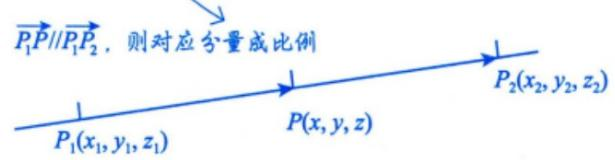

## 位置关系：

(1) 点到直线的距离.

点 $M_{1}(x_{1},y_{1},z_{1})$ 到直线 $L:\frac{x - x_0}{l} = \frac{y - y_0}{m} = \frac{z - z_0}{n}$ 的距离

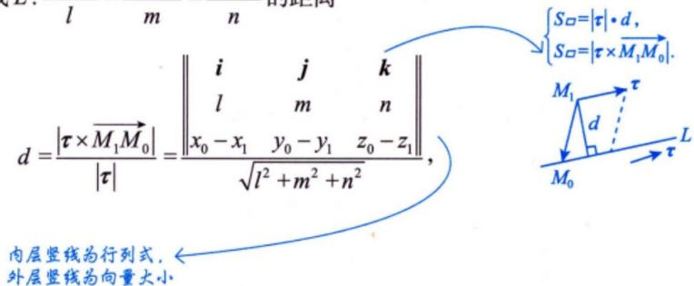

其中向量 $\overrightarrow{M_1M_0} = (x_0 - x_1, y_0 - y_1, z_0 - z_1)$ , $M_0 = (x_0, y_0, z_0)$ , $\pmb{\tau} = (l, m, n)$ .

注 更为简单的是平面的情形: 设在二维平面上直线 L 的方程为 $Ax + By + C = 0$ ，点 $P_{0}$ 的坐标为 $(x_{0}, y_{0})$ ，则点 $P_{0}$ 到直线 L 的距离公式为 $d = \frac{|Ax_{0} + By_{0} + C|}{\sqrt{A^{2} + B^{2}}}$ .

若 $B \neq 0$ ， $\left\{ \begin{array}{l} S_{\square} = |\overrightarrow{P_0} P \times \tau|, \\ S_{\square} = |\tau| \cdot d, \end{array} \right.$ 则 $d = \frac{\left| \begin{array}{ccc} x - x_0 & y - y_0 \\ 1 & -\frac{A}{B} \end{array} \right|}{\sqrt{1 + \left(-\frac{A}{B}\right)^2}} = \frac{|Ax_0 + By_0 + C|}{\sqrt{A^2 + B^2}}.$

若 $A \neq 0, B = 0$ ，则 $Ax + C = 0, x = -\frac{C}{A}$ ，于是

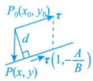

综上，成立

$$
d = \left| x - x _ {0} \right| = \left| x _ {0} + \frac {C}{A} \right| = \frac {\left| A x _ {0} + 0 y _ {0} + C \right|}{\sqrt {A ^ {2} + 0 ^ {2}}}.
$$

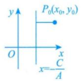

(2) 点到平面的距离.

点 $P_{0}(x_{0},y_{0},z_{0})$ 到平面 $Ax + By + Cz + D = 0$ 的距离 $d = \frac{|Ax_0 + By_0 + Cz_0 + D|}{\sqrt{A^2 + B^2 + C^2}}.$ (3)直线与直线.

设 $\tau_{1} = (l_{1},m_{1},n_{1}),\tau_{2} = (l_{2},m_{2},n_{2})$ 分别为直线 $L_{1},L_{2}$ 的方向向量.

① $L_{1}\perp L_{2}\Leftrightarrow\tau_{1}\perp\tau_{2}\Leftrightarrow l_{1}l_{2}+m_{1}m_{2}+n_{1}n_{2}=0$

② $L_{1} \parallel L_{2} \Leftrightarrow \tau_{1} \parallel \tau_{2} \Leftrightarrow \frac{l_{1}}{l_{2}} = \frac{m_{1}}{m_{2}} = \frac{n_{1}}{n_{2}}$ .

$$
\begin{array}{r l} d & = \frac {\left| \overrightarrow {P _ {0} P} \cdot \boldsymbol {n} \right|}{\left| \boldsymbol {n} \right|} = \frac {\left| \overrightarrow {P _ {0} P} \right| \left| \boldsymbol {n} \right| \cos \theta}{\left| \boldsymbol {n} \right|} \\ & = \left| \overrightarrow {P _ {0} P} \right| \cos \theta \\ & = \frac {\left| A (x - x _ {0}) + B (y - y _ {0}) + C (z - z _ {0}) \right|}{\sqrt {A ^ {2} + B ^ {2} + C ^ {2}}} \\ & = \frac {\left| A x _ {0} + B y _ {0} + C z _ {0} + D \right|}{\sqrt {A ^ {2} + B ^ {2} + C ^ {2}}} \end{array}
$$

③直线 $L_{1}, L_{2}$ 的夹角 $\theta = \arccos \frac{|\pmb{\tau}_{1} \cdot \pmb{\tau}_{2}|}{|\pmb{\tau}_{1}||\pmb{\tau}_{2}|}$ ，其中 $\theta = \min \{(\widehat{\pmb{\tau}_{1}, \pmb{\tau}_{2}}), \pi - (\widehat{\pmb{\tau}_{1}, \pmb{\tau}_{2}})\} \in \left[0, \frac{\pi}{2}\right]$ .

(4) 平面与平面.

设平面 $\pi_{1}, \pi_{2}$ 的法向量分别为 $\boldsymbol{n}_{1} = (A_{1}, B_{1}, C_{1}), \boldsymbol{n}_{2} = (A_{2}, B_{2}, C_{2})$ .

① $\pi_{1}\perp\pi_{2}\Leftrightarrow n_{1}\perp n_{2}\Leftrightarrow A_{1}A_{2}+B_{1}B_{2}+C_{1}C_{2}=0$

② $\pi_{1} \parallel \pi_{2} \Leftrightarrow n_{1} \parallel n_{2} \Leftrightarrow \frac{A_{1}}{A_{2}} = \frac{B_{1}}{B_{2}} = \frac{C_{1}}{C_{2}}$

③平面 $\pi_1, \pi_2$ 的夹角 $\theta = \arccos \frac{|n_1 \cdot n_2|}{|n_1||n_2|}$ ，其中 $\theta = \min \{(\widehat{n_1, n_2}), \pi - (\widehat{n_1, n_2})\} \in \left[0, \frac{\pi}{2}\right]$ .

(5) 平面与直线.

设直线 L 的方向向量为 $\tau=(l,m,n)$ ，平面 $\pi$ 的法向量为 $n=(A,B,C)$

① $L \perp \pi \Leftrightarrow \tau // n \Leftrightarrow \frac{l}{A} = \frac{m}{B} = \frac{n}{C}$ . 平行方程

② $L \parallel \pi \Leftrightarrow \tau \perp n \Leftrightarrow Al + Bm + Cn = 0$ . 垂直方程

$\tau \cdot n = |\tau| \cdot |n| \cdot \cos(\tau, n)$ .

③直线 L 与平面 $\pi$ 的夹角 $\theta = \arcsin \frac{|\tau \cdot n|}{|\tau||n|}$ ，其中 $\theta = \left| \frac{\pi}{2} - (\widehat{\tau, n}) \right| \in \left[ 0, \frac{\pi}{2} \right]$ .
例 17.2 与两直线

$$
\boxed {x = 1}, \quad x = 1 + 0 \cdot t
$$

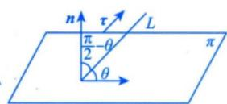

## 空间曲线与曲面：

基础曲线：

双曲线:

## 双曲线

<table><tr><td colspan="2">标准方程</td><td> $\frac{{x}^{2}}{{a}^{2}} - \frac{{y}^{2}}{{b}^{2}} = 1\left( {a >0,b >0}\right)$ </td><td> $\frac{{y}^{2}}{{a}^{2}} - \frac{{x}^{2}}{{b}^{2}} = 1\left( {a >0,b >0}\right)$ </td></tr><tr><td colspan="2">图形</td><td>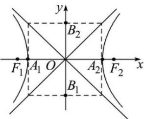</td><td>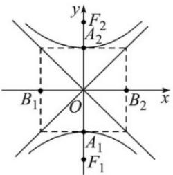</td></tr><tr><td rowspan="8">性质</td><td>范围</td><td> $x \geq a$  或  $x \leq   - a,y \in R$ </td><td> $x \in R,y \geq a$  或  $y \leq   - a$ </td></tr><tr><td>对称性</td><td colspan="2">对称轴:坐标轴 对称中心:原点</td></tr><tr><td>顶点</td><td> ${A}_{1}\left( {-a,0}\right) ,{A}_{2}\left( {a,0}\right) ,$ </td><td> ${A}_{1}\left( {0, - a}\right) ,{A}_{2}\left( {0,a}\right) ,$ </td></tr><tr><td>轴</td><td colspan="2">实轴  ${A}_{1}{A}_{2}$  的长为  ${2a}$  ; 虚轴  ${B}_{1}{B}_{2}$  的长为  ${2b}$ </td></tr><tr><td>焦距</td><td colspan="2"> $\left| {{F}_{1}{F}_{2}}\right| = {2c}$ </td></tr><tr><td>离心率</td><td colspan="2"> $e = \frac{c}{a} \in \left( {1, + \infty }\right)$ </td></tr><tr><td> $a,b,c$  的关系</td><td colspan="2"> ${c}^{2} = {a}^{2} + {b}^{2}$ </td></tr><tr><td>渐近线</td><td> $y = \pm \frac{b}{a}x$ </td><td> $y = \pm \frac{a}{b}x$ </td></tr></table>

## 3. 双曲线的重要元素

以

$$
\frac {x ^ {2}}{a ^ {2}} - \frac {y ^ {2}}{b ^ {2}} = 1
$$

为例：

<table><tr><td>元素</td><td>结果</td></tr><tr><td>中心</td><td>(0,0)</td></tr><tr><td>顶点</td><td>(±a,0)</td></tr><tr><td>焦点</td><td>(±c,0)</td></tr><tr><td>实轴长</td><td>2a</td></tr><tr><td>虚轴长</td><td>2b</td></tr><tr><td>渐近线</td><td> $y = \pm \frac{b}{a}x$ </td></tr><tr><td>参数关系</td><td> $c^2 = a^2 + b^2$ </td></tr><tr><td>离心率</td><td> $e = \frac{c}{a} > 1$ </td></tr></table>

这里最重要的是：

$$
c ^ {2} = a ^ {2} + b ^ {2}
$$

注意，椭圆是：

$$
c ^ {2} = a ^ {2} - b ^ {2}
$$

双曲线是：

$$
c ^ {2} = a ^ {2} + b ^ {2}
$$

这个很容易混。

抛物线：

抛物线

<table><tr><td>抛物线</td><td>y2=2px,(p&gt;0)</td><td>y2=-2px,(p&gt;0)</td><td>x2=2py,(p&gt;0)</td><td>x2=-2py,(p&gt;0)</td></tr><tr><td>图形</td><td>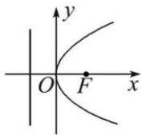</td><td>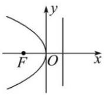</td><td>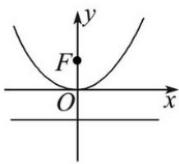</td><td>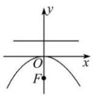</td></tr><tr><td>顶点</td><td colspan="4">(0,0)</td></tr><tr><td>对称轴</td><td colspan="2">x轴</td><td colspan="2">y轴</td></tr><tr><td>开口</td><td>向右</td><td>向左</td><td>向上</td><td>向下</td></tr><tr><td>焦点</td><td>(p/2,0)</td><td>(-p/2,0)</td><td>(0,p/2)</td><td>(0,-p/2)</td></tr><tr><td>准线</td><td>x=-p/2</td><td>x=p/2</td><td>y=-p/2</td><td>y=p/2</td></tr><tr><td></td><td></td><td></td><td></td><td></td></tr><tr><td colspan="5">抛物线上的点P到焦点F的距离|PF|等于点P到准线的距离d</td></tr><tr><td>|PF|=d</td><td>|PF|=dp+p/2</td><td>|PF|=dp=-xp+p/2</td><td>|PF|=dp=yp+p/2</td><td>|PF|=dp=-yp+p/2</td></tr><tr><td colspan="5">过抛物线焦点F的直线交抛物线于A、B两点,设A(x1,y1), B(x2,y2)</td></tr><tr><td>焦点弦</td><td colspan="2">|AB|=|x1+x2|+p</td><td colspan="2">|AB|=|y1+y2|+p</td></tr><tr><td>通径</td><td colspan="4">过焦点F作对称轴的垂线交抛物线于A、B两点,则|AB|=2p</td></tr><tr><td>韦达定理</td><td colspan="2">x1x2=p/4,y1y2=-p2</td><td colspan="2">x1x2=-p2,y1y2=p/4</td></tr><tr><td>弦长</td><td colspan="2">l=2p/sin2θ(θ为AB的倾斜角)</td><td colspan="2">l=2p/cos2θ(θ为AB的倾斜角)</td></tr></table>

## 3. 抛物线的重要元素

以

$$
y ^ {2} = 2 p x
$$

为例：

<table><tr><td>元素</td><td>结果</td></tr><tr><td>顶点</td><td>(0,0)</td></tr><tr><td>对称轴</td><td>x轴</td></tr><tr><td>焦点</td><td> $\left(\frac{p}{2},0\right)$ </td></tr><tr><td>准线</td><td> $x=-\frac{p}{2}$ </td></tr><tr><td>开口方向</td><td>由p正负决定</td></tr></table>

注意这里的标准形式是 $y^{2}=2px$ ，所以焦点是：

$$
\left(\frac {p}{2}, 0\right)
$$

如果你用的是高中常见形式:

$$
y ^ {2} = 2 p x
$$

那就是这个结论；如果教材写成：

$$
y ^ {2} = 4 a x
$$

那么焦点是:

(a,0)

因为此时 4a = 2p，即 p = 2a。

椭圆：

## 椭圆

<table><tr><td colspan="2">标准方程</td><td> $\frac{{x}^{2}}{{a}^{2}} + \frac{{y}^{2}}{{b}^{2}} = 1\left( {a > b > 0}\right)$ </td><td> $\frac{{y}^{2}}{{a}^{2}} + \frac{{x}^{2}}{{b}^{2}} = 1\left( {a > b > 0}\right)$ </td></tr><tr><td colspan="2">图形</td><td>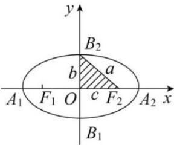</td><td>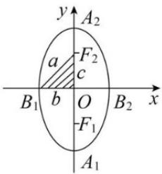</td></tr><tr><td rowspan="7">性质</td><td>范围</td><td> $- a \leq x \leq a, - b \leq y \leq b$ </td><td> $- b \leq x \leq b, - a \leq y \leq a$ </td></tr><tr><td>对称性</td><td colspan="2">对称轴:坐标轴 对称中心:原点</td></tr><tr><td>顶点</td><td> ${A}_{1}\left( {-a,0}\right) ,{A}_{2}\left( {a,0}\right) ,$   ${B}_{1}\left( {0, - b}\right) ,{B}_{1}\left( {0,b}\right)$ </td><td> ${A}_{1}\left( {0, - a}\right) ,{A}_{2}\left( {0,a}\right) ,$   ${B}_{1}\left( {-b,0}\right) ,{B}_{1}\left( {b,0}\right)$ </td></tr><tr><td>轴</td><td colspan="2">长轴  ${A}_{1}{A}_{2}$  的长为  ${2a}$  ; 短轴  ${B}_{1}{B}_{2}$  的长为  ${2b}$ </td></tr><tr><td>焦距</td><td colspan="2"> $\left| {{F}_{1}{F}_{2}}\right| = {2c}$ </td></tr><tr><td>离心率</td><td colspan="2"> $e = \frac{c}{a} \in \left( {0,1}\right)$ </td></tr><tr><td> $a,b,c$  的关系</td><td colspan="2"> ${a}^{2} = {b}^{2} + {c}^{2}$ </td></tr></table>

## 空间曲线:

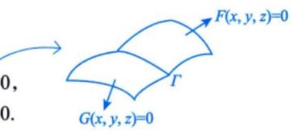

## 1 空间曲线

(1)一般式 $\Gamma :\left\{ \begin{array}{l}F(x,y,z) = 0,\\ G(x,y,z) = 0. \end{array} \right.$

## 注 其几何背景为两个曲面的交线.

(2) 参数方程 $\Gamma:\left\{\begin{aligned}x&=\varphi(t),\\ y&=\psi(t),t\in[\alpha,\beta]\\ z&=\omega(t);\end{aligned}\right.$

注 在 $\left\{ \begin{array}{l} F(x, y, z) = 0, \\ G(x, y, z) = 0 \end{array} \right.$ 中选取某直角坐标变量为自变量（看作参数），解出其他两变量为此变量的函数，即得参数式。如曲线 $\left\{ \begin{array}{l} z = f(x, y), \\ y = 0, \end{array} \right.$ 令 $x = t$ ，则可写成参数式方程： $\left\{ \begin{array}{l} x = t, \\ y = 0, \\ z = f(t, 0). \end{array} \right.$ 当然，有时由于后两变量解出为第一变量的函数表达式带来多值或根式等麻烦事，或者甚至“解不出”，故一般用新的变量作参数再写参数方程，如下面的注；亦或题设直接给出参数方程，如例17.6。

(3) 在坐标面上的投影.

以求曲线 $\Gamma$ 在 xOy 平面上的投影曲线为例. 将 $\Gamma:\left\{\begin{aligned} F(x,y,z)=0,\\ G(x,y,z)=0\end{aligned}\right.$ 中的 z 消去, 得到 $\varphi(x,y)=0$ ,

则曲线 $\Gamma$ 在 xOy 面上的投影曲线包含于曲线 $\left\{\begin{aligned} \varphi(x,y)=0,\\ z=0.\end{aligned}\right.$ 曲线 $\Gamma$ 在其他平面上的投影曲线可类似求得.

① 往 xOy 面投影, 消 z; 往 xOz 面投影, 消 y; 往 yOz 面投影, 消 x.

② 联立方程, 且令 z=0 或 y=0 或 x=0.

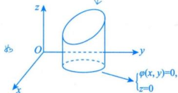

注 将 $\left\{\begin{aligned} F(x, y, z) &= 0, \\ G(x, y, z) &= 0 \end{aligned}\right.$ 消去某变量（例如消去 z），便得该曲线在 z = 0 平面上的投影曲线方程 $\left\{\begin{aligned} f(x, y) &= 0, \\ z &= 0, \end{aligned}\right.$ 如果 $f(x, y) = 0$ 能容易地写出它的参数式：

$$
x = x (t), y = y (t), t \in I,
$$

其中 I 为某区间，则以 $x = x(t)$ ， $y = y(t)$ 代入原曲线的方程中，若能解得单值的 $z = z(t)$ ，则得原曲线的参数式：

$$
x = x (t), y = y (t), z = z (t), t \in I.
$$

如将 $\Gamma:\left\{\begin{aligned}x^{2}+y^{2}&=1,\\ z&=x+y\end{aligned}\right.$ 的方程化为参数形式

$$
\left\{ \begin{array}{l} x = \cos t, \\ y = \sin t, \quad (0 \leqslant t \leqslant 2 \pi) \\ z = \cos t + \sin t \end{array} . \right.
$$

## 空间曲面：

二次曲面：

<table><tr><td>曲面名称</td><td>方程</td><td>图形</td></tr><tr><td>椭球面</td><td> $\frac{x^{2}}{a^{2}}+\frac{y^{2}}{b^{2}}+\frac{z^{2}}{c^{2}}=1$ 当a=b=c时为球面</td><td>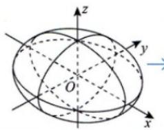用平行于坐标平面的平面去切,得出椭圆或圆</td></tr><tr><td>单叶双曲面</td><td></td><td>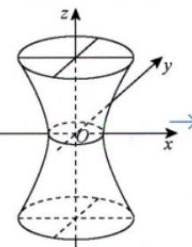用 $x=k_{1}(k_{1}$ 不等于a)或 $y=k_{2}(k_{2}$ 不等于b)切得双曲线,用 $z=k_{3}$ (任意常数)切得椭圆或圆</td></tr><tr><td>双叶双曲面</td><td></td><td>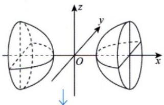用y=k或z=k切得双曲线,用 $x=k(|k|>|a|)$ 切得椭圆或圆</td></tr><tr><td>椭圆抛物面</td><td> $\frac{x^{2}}{2p}+\frac{y^{2}}{2q}=z(p,q>0)$ 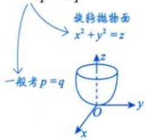</td><td>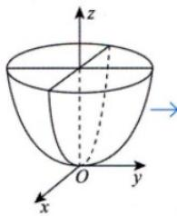用x=k或y=k切得抛物线,用 $z=k(k>0)$ 切得椭圆或圆</td></tr><tr><td>椭圆锥面</td><td></td><td>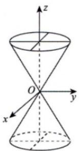</td></tr></table>

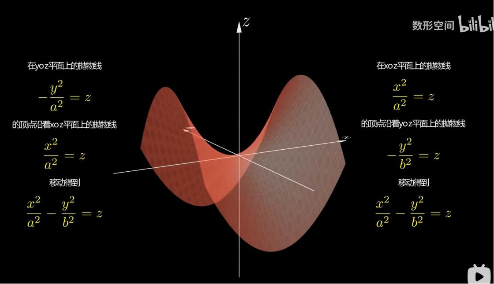

的顶点沿着xoz平面上的抛物线

的顶点沿着yoz平面上的抛物线

移动得到

移动得到

续表

<table><tr><td>曲面名称</td><td>方程</td><td>图形</td></tr><tr><td>双曲抛物面(马鞍面)</td><td>-x2/2p+y2/2q=z(p,q&gt;0)</td><td>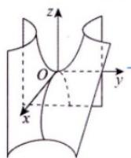→用z=k(k&gt;0)切得双曲线,用x=k或y=k切得抛物线,其中k为任意常数</td></tr><tr><td>双曲抛物面(马鞍面)</td><td>z=xy↓坐标变换: z=y2-x2=(y+x)(y-x).令{u=y+x,则z=uv</td><td>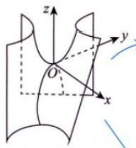在上圈的基础上,令x轴与y轴逆时针旋转π/4</td></tr></table>

## 二次曲面（常见类型与性质）

<table><tr><td>名称</td><td>标准方程(a,b,c&gt;0)</td><td>图形(示意)</td><td>主要截面(过坐标平面的截痕)</td><td>性质与说明</td></tr><tr><td>1.椭球面</td><td> $\frac{x^{2}}{a^{2}}+\frac{y^{2}}{b^{2}}+\frac{z^{2}}{c^{2}}=1$ </td><td>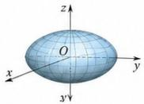</td><td>z=0: $\frac{x^{2}}{a^{2}}+\frac{y^{2}}{b^{2}}=1$ (椭圆)y=0: $\frac{x^{2}}{a^{2}}+\frac{z^{2}}{c^{2}}=1$ (椭圆)x=0: $\frac{y^{2}}{b^{2}}+\frac{z^{2}}{c^{2}}=1$ (椭圆)</td><td>封闭的有界曲面。截到各坐标轴的截距分别为±a,±b,±c。当a=b=c时为球面:x2+y2+z2=a2。</td></tr><tr><td>2.椭圆锥面</td><td> $\frac{x^{2}}{a^{2}}+\frac{y^{2}}{b^{3}}=\frac{z^{2}}{c^{2}}$ </td><td>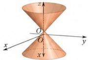</td><td>z=h(h≠0): $\frac{x^{2}}{a^{2}}+\frac{y^{2}}{b^{2}}=\frac{h^{2}}{c^{2}}$ (椭圆)z=0: $\frac{x^{2}}{a^{2}}+\frac{y^{2}}{b^{2}}=0$ (仅原点)与过原点的平面相交得到两条相交直线。</td><td>两叶(上、下),在原点相接。沿z轴方向远高原点时半径线性增大。</td></tr><tr><td>3.单叶双曲面</td><td> $\frac{x^{2}}{a^{2}}+\frac{y^{2}}{b^{3}}-\frac{z^{2}}{c^{2}}=1$ </td><td>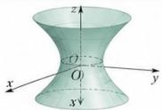</td><td>z=h: $\frac{x^{2}}{a^{2}}+\frac{y^{2}}{b^{3}}=1+\frac{h^{2}}{c^{2}}$ (椭圆)x=0: $\frac{y^{2}}{b^{3}}-\frac{z^{2}}{c^{2}}=1$ (双曲线)y=0: $\frac{x^{2}}{a^{2}}-\frac{z^{2}}{c^{2}}=1$ (双曲线)</td><td>一张连续曲面。与垂直于z轴的平面相交为椭圆;与包含z轴的平面相交为双曲线。</td></tr><tr><td>4.双叶双曲面</td><td> $\frac{z^{2}}{c^{2}}-\frac{x^{2}}{a^{2}}-\frac{y^{2}}{b^{3}}=1$ </td><td>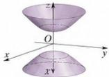</td><td>z=h(|h|&gt;c): $\frac{x^{2}}{a^{2}}+\frac{y^{2}}{b^{3}}=\frac{h^{2}}{c^{2}}-1$ (椭圆)x=0: $\frac{z^{2}}{c^{2}}-\frac{y^{2}}{b^{2}}=1$ (双曲线)y=0: $\frac{z^{2}}{a^{2}}-\frac{x^{2}}{a^{2}}=1$ (双曲线)</td><td>两张曲面(上、下)。与平行于xy面且|z|开口沿+z方向。与平行于xy面的截痕是随z增大而扩大的椭圆。</td></tr><tr><td>6.椭圆抛物面</td><td> $\frac{x^{2}}{a^{2}}+\frac{y^{2}}{b^{3}}=2z$ </td><td>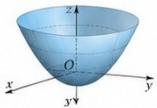</td><td>z=h(|h|≥0): $\frac{x^{2}}{a^{2}}+\frac{y^{2}}{b^{3}}=2h$ (椭圆)x=0: $\frac{y^{2}}{b^{2}}=2z$ (抛物线)y=0: $\frac{x^{2}}{a^{2}}=2z$ (抛物线)</td><td>开口沿+z方向。与平行于xy面的截痕是随z增大而扩大的椭圆。</td></tr><tr><td>6.双曲抛物面</td><td> $\frac{x^{2}}{a^{2}}-\frac{y^{2}}{b^{3}}=2z$ </td><td>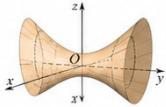</td><td>z=h: $\frac{x^{2}}{a^{2}}-\frac{y^{2}}{b^{3}}=2h$ (双曲线)x=0:- $\frac{y^{2}}{b^{2}}=2z$ (抛物线)y=0: $\frac{x^{2}}{a^{2}}=2z$ (抛物线)</td><td>鞍形曲面(“马鞍面”)。沿x方向弯曲向上,沿y方向弯曲向下(或相反)。</td></tr><tr><td colspan="5">·上表默认曲面已中心于原点且轴面与坐标面重合;一般情形可通过平移(去一次项)和旋转坐标轴(去交叉项)化为上述标准型。·判定思路(已化为标准型时);出现“=1”为双曲面或椭球面;出现“=”两边同号为椭球面,异号为双曲面;右边为2z(或2x,2y)为抛物面;若两边同号且总和为0(无常数项)通常为锥面。·实际应用中,常通过截面法(与坐标平面或特殊平面取截痕)来识别曲面类型和描绘图形。</td></tr></table>

柱面：

https://chatgpt.com/g/g-p-6a1d505226e08191a7f47eb8e9418ffe-gao-shu-ocr/c/6a684b1c-cfb0-83ee-836d-fca9cf36ab62

(3) 柱面：动直线沿定曲线平行移动所形成的曲面.

$x+y=1$

<table><tr><td>椭圆柱面</td><td> $\frac{x^2}{a^2}+\frac{y^2}{b^2}=1$ </td><td>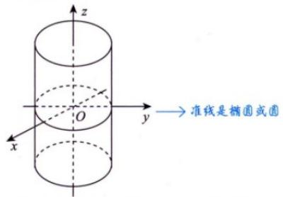</td></tr><tr><td>双曲柱面</td><td> $\frac{x^2}{a^2}-\frac{y^2}{b^2}=1$ </td><td>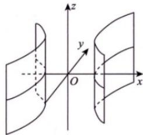 →准线是双曲线</td></tr><tr><td>抛物柱面</td><td> $y=ax^2(a>0)$ </td><td>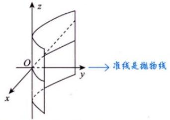</td></tr></table>

## 旋转曲面：

(4) 旋转曲面：曲线 $\Gamma$ 绕一条定直线旋转一周所形成的曲面.

曲线 $\Gamma:\left\{\begin{aligned}F(x,y,z)=0,\\ G(x,y,z)=0\end{aligned}\right.$ 绕直线 $L:\frac{x-x_{0}}{l}=\frac{y-y_{0}}{m}=\frac{z-z_{0}}{n}$ 旋转一周形成一个旋转曲面，旋转曲面方程的求法如下.

如图 17-1 所示，设 $M_{0}(x_{0}, y_{0}, z_{0})$ ，方向向量 $\tau = (l, m, n)$ 。在母线 $\Gamma$ 上任取一点 $M_{1}(x_{1}, y_{1}, z_{1})$ ，则过 $M_{1}$ 的纬圆上的任意一点 $P(x, y, z)$ 满足条件

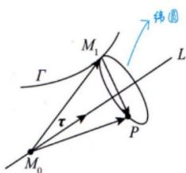  
图17-1

$$
\overrightarrow {M _ {1} P} \perp \tau , \left| \overrightarrow {M _ {0} P} \right| = \left| \overrightarrow {M _ {0} M _ {1}} \right|,
$$

即

$$
\left\{ \begin{array}{l} l (x - x _ {1}) + m (y - y _ {1}) + n (z - z _ {1}) = 0, \\ (x - x _ {0}) ^ {2} + (y - y _ {0}) ^ {2} + (z - z _ {0}) ^ {2} = (x _ {1} - x _ {0}) ^ {2} + (y _ {1} - y _ {0}) ^ {2} + (z _ {1} - z _ {0}) ^ {2}, \end{array} \right.
$$

与方程 $F(x_{1},y_{1},z_{1})=0$ 和 $G(x_{1},y_{1},z_{1})=0$ 联立消去 $x_{1},y_{1},z_{1}$ ，便可得到旋转曲面的方程.

注 常考曲线 $\Gamma: \left\{ \begin{array}{l} F(x, y, z) = 0, \\ G(x, y, z) = 0 \end{array} \right.$ 绕 $z$ 轴旋转一周而成的旋转曲面的方程如图17-2所示，在曲线 $\Gamma$ 上任取一点 $M_{1}(x_{1}, y_{1}, z_{1})$ ，则过点 $M_{1}$ 的纬圆上的任意一点 $P(x, y, z)$ 满足条件 $\left|\overrightarrow{OP}\right| = \left|\overrightarrow{OM_{1}}\right|$ 和 $z = z_{1}$ ，即 $x^{2} + y^{2} + z^{2} = x_{1}^{2} + y_{1}^{2} + z_{1}^{2}$ 且 $z = z_{1}$ ，得因为 $(x - x_{1}, y - y_{1}, z - z_{1}) \perp (0, 0, 1)$

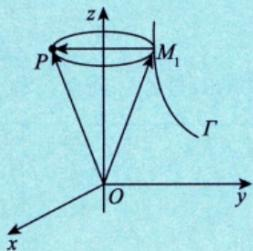  
图 17-2

$$
x ^ {2} + y ^ {2} = x _ {1} ^ {2} + y _ {1} ^ {2}
$$

从方程组 $\left\{\begin{aligned}F(x_{1},y_{1},z)=0,\\ G(x_{1},y_{1},z)=0,\\ x^{2}+y^{2}=x_{1}^{2}+y_{1}^{2}\end{aligned}\right.$ 中消去 $x_{1}$ 和 $y_{1}$ ，便得到旋转曲面的方程.

如果能从方程组 $\left\{ \begin{array}{l} F(x, y, z) = 0, \\ G(x, y, z) = 0 \end{array} \right.$ 中解出 $x = f_{1}(z)$ 和 $y = f_{2}(z)$ ，则旋转曲面的方程为

$$
x ^ {2} + y ^ {2} = \left[ f _ {1} (z) \right] ^ {2} + \left[ f _ {2} (z) \right] ^ {2}
$$

如求 $\left\{ \begin{array}{l} y^{2} - (z - 1)^{2} = 1, \\ x = 0 \end{array} \right.$ 绕 $z$ 轴旋转一周而成的旋转曲面的方程，由方程组知 $\left\{ \begin{array}{l} x = 0, \\ y^{2} = 1 + (z - 1)^{2}, \end{array} \right.$ 则旋转曲面的方程为 $x^{2} + y^{2} = 0^{2} + 1 + (z - 1)^{2}$ ，即 $x^{2} + y^{2} - (z - 1)^{2} = 1$ 。

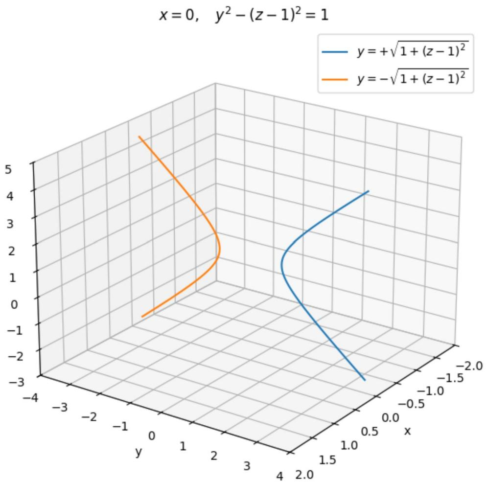

## 七、绕不经过原点的直线旋转

例如曲线

$$
y = f (x)
$$

绕直线

$$
y = b
$$

旋转。

这条直线与 $x$ 轴平行。原曲线上点 $(x, f(x))$ 到旋转轴 $y = b$ 的距离是

$$
| f (x) - b |.
$$

旋转后，空间点 $(x, y, z)$ 到直线

$$
y = b, \qquad z = 0
$$

的距离是

$$
\sqrt {(y - b) ^ {2} + z ^ {2}}.
$$

因此旋转曲面方程为

$$
\boxed {(y - b) ^ {2} + z ^ {2} = [ f (x) - b ] ^ {2}}.
$$

多元函数微分学的几何应用：

空间曲线的切线与法平面：

# 空间曲线的切线、法平面与法线

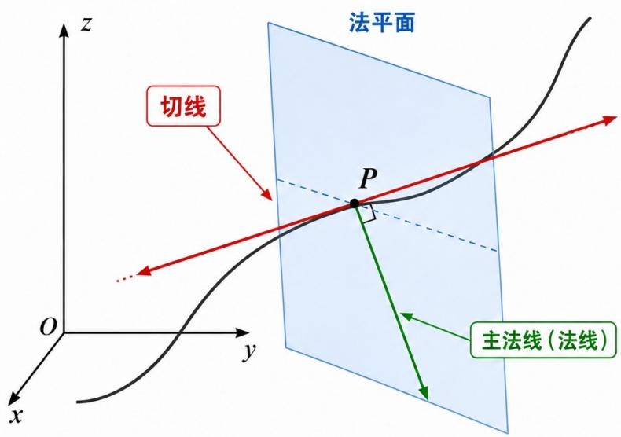

切线:

提示：对空间曲线来说，法平面内有许多与切线垂直的方向；通常教材中的“法线”常指主法线。

过点 $P$ ，方向就是曲线在该点的瞬时方向。

法平面：过点 $P$ ，并且垂直于切线的平面。

主法线（法线）：过点 $P$ ，垂直于切线，并指向曲线弯曲方向。

关系：切线 $\perp$ 法平面；主法线位于法平面内。

(1) 用参数方程给出曲线： $\left\{\begin{aligned}x&=x(t),\\ y&=y(t),t\in I,\\ z&=z(t),\end{aligned}\right.$

其中 $x(t), y(t), z(t)$ 在 $I$ 上可导，且三个导数不同时为0，则曲线在 $P_0(x_0, y_0, z_0)$ 处的切向量 $\pmb{\tau} = (x'(t_0), y'(t_0), z'(t_0))$ 。

切线方程： $\frac{x-x_{0}}{x'(t_{0})}=\frac{y-y_{0}}{y'(t_{0})}=\frac{z-z_{0}}{z'(t_{0})}$

法平面方程： $x^{\prime}(t_0)(x - x_0) + y^{\prime}(t_0)(y - y_0) + z^{\prime}(t_0)(z - z_0) = 0$

(2) 用方程组给出曲线： $\left\{\begin{aligned}F(x,y,z)&=0,\\ G(x,y,z)&=0.\end{aligned}\right.$

当 $\frac{\partial(F,G)}{\partial(y,z)}=\left|\begin{matrix}\frac{\partial F}{\partial y}&\frac{\partial F}{\partial z}\\ \frac{\partial G}{\partial y}&\frac{\partial G}{\partial z}\end{matrix}\right|\neq0$ 时，可确定 $\left\{\begin{aligned}x&=x,\\ y&=y(x),\\ z&=z(x).\end{aligned}\right.$ 箍可比行列式

其在 $P_{0}(x_{0},y_{0},z_{0})$ 处的切向量 $\pmb{\tau} = \left|\begin{array}{ccc}\boldsymbol {i}&\boldsymbol{j}&\boldsymbol{k}\\ F_{x}^{\prime}&F_{y}^{\prime}&F_{z}^{\prime}\\ \hline G_{x}^{\prime}&G_{y}^{\prime}&G_{z}^{\prime}\end{array}\right|_{P_{0}}$ $= (A,B,C)$ ．两个梯度向量的叉乘： $\mathbf{n}_1\times \mathbf{n}_2$ $G$ 在 $P_0$ 的梯度向量 $\mathbf{n}_2$

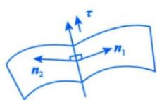

## 二、上面的行列式是什么意思

图中条件是

$$
\frac {\partial (F , G)}{\partial (y , z)} = \left| \begin{array}{c c} F _ {y} & F _ {z} \\ G _ {y} & G _ {z} \end{array} \right| \neq 0.
$$

展开就是

$$
F _ {y} G _ {z} - F _ {z} G _ {y} \neq 0.
$$

这个条件的作用是:

在点 $P_{0}(x_{0},y_{0},z_{0})$ 附近，可以把 $y,z$ 看成 $x$ 的函数。

即曲线可以局部写为

$$
\left\{ \begin{array}{l} x = x, \\ y = y (x), \\ z = z (x). \end{array} \right.
$$

这里第一个 $x = x$ 只是表示：把 $x$ 选作参数。

更规范地可以写成

$$
\boldsymbol {r} (x) = \bigl (x, y (x), z (x) \bigr).
$$

这就是隐函数定理在两个方程、三个变量情形下的应用。

https://chatgpt.com/g/g-p-6a1d505226e08191a7f47eb8e9418ffe-gao-shu-ocr/c/6a6851e0-e67c-83ee-80f4-9589436d1a73

切线方程： $\frac{x - x_0}{A} = \frac{y - y_0}{B} = \frac{z - z_0}{C}$

法平面方程： $A(x-x_{0})+B(y-y_{0})+C(z-z_{0})=0$

空间曲面的切平面与法线：

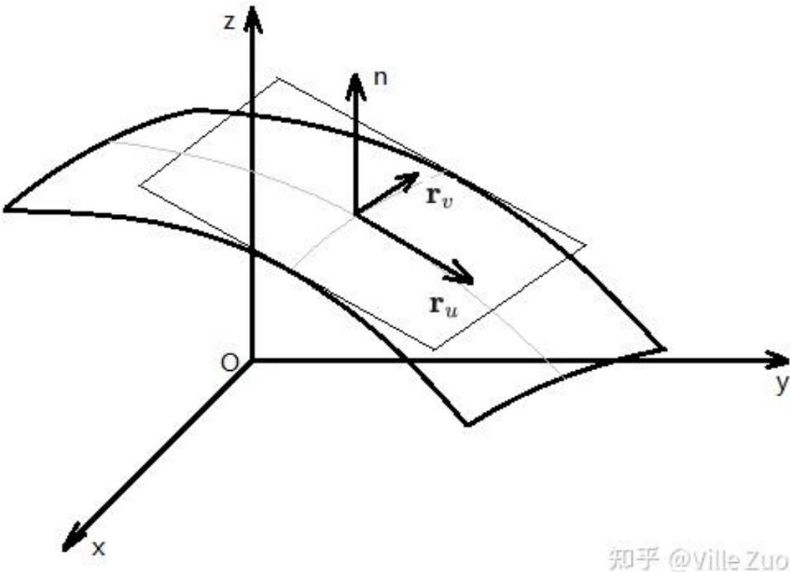

知乎@VilleZuo

## 2 空间曲面的切平面与法线

(1) 用隐式方程给出曲面： $F(x, y, z) = 0$ ，其中 F 的一阶偏导数连续。F 在 $P_{0}$ 的梯度向量

其在 $P_0(x_0, y_0, z_0)$ 处的法向量 $\pmb{n} = (F_x' |_{P_0}, F_y' |_{P_0}, F_z' |_{P_0})$

切平面方程： $F_{x}^{\prime}\big|_{P_{0}}\cdot(x-x_{0})+F_{y}^{\prime}\big|_{P_{0}}\cdot(y-y_{0})+F_{z}^{\prime}\big|_{P_{0}}\cdot(z-z_{0})=0$

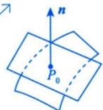

法线方程： $\frac{x - x_0}{F_x'\big|_{P_0}} = \frac{y - y_0}{F_y'\big|_{P_0}} = \frac{z - z_0}{F_z'\big|_{P_0}}$ 或 $z - f(x,y) = 0$ ，则曲面在 $P_0$ 处的法向量为 $(-f_x'(x_0,y_0), - f_y'(x_0,y_0),1)$

(2) 用显式函数给出曲面： $z = f(x, y) \Rightarrow f(x, y) - z = 0$ ，其中 $f$ 的一阶偏导数连续。

其在 $P_0(x_0, y_0, z_0)$ 处的法向量 $\pmb{n} = (f_x'(x_0, y_0), f_y'(x_0, y_0), -1)$ . 此法向量方向向下.

切平面方程： $f_{x}^{\prime}(x_{0},y_{0})(x-x_{0})+f_{y}^{\prime}(x_{0},y_{0})(y-y_{0})-(z-z_{0})=0$ 。若为正值，与z轴正方向夹角为锐角，即法向量向上；若为负值，与z轴正方向夹角为钝角，即法向量向下

法线方程： $\frac{x - x_0}{f_x'(x_0,y_0)} = \frac{y - y_0}{f_y'(x_0,y_0)} = \frac{z - z_0}{-1}$

https://chatgpt.com/g/g-p-6a1d505226e08191a7f47eb8e9418ffe-gao-shu-ocr/c/6a68552d-4df4-83e8-81ee-6b2b7a6a96c2

场论初步:

场的概念：

什么叫“场”？从数学上说，场就是空间区域 $\Omega$ 上的一种对应法则.

(1) 如果 $\Omega$ 上的每一点 $M(x, y, z)$ 都对应着一个数量 $u$ ，则在 $\Omega$ 上就确定了一个数量函数 $u = u(x, y, z)$ ，它表示一个数量场。数量场的例子很多，比如温度场，温度场只讲大小，不讲方向。

(2) 如果 $\Omega$ 上的每一点 $M(x, y, z)$ 都对应着一个向量 $\pmb{F}$ , 则在 $\Omega$ 上就确定了一个向量函数

$$
\boldsymbol {F} (x, y, z) = P (x, y, z) \boldsymbol {i} + Q (x, y, z) \boldsymbol {j} + R (x, y, z) \boldsymbol {k},
$$

它表示一个向量场. 向量场的例子也很多, 比如引力场, 引力场既讲大小, 也讲方向.

## 方向导数：

## 1 方向导数

定义 设三元函数 $u = u(x, y, z)$ 在点 $P_0(x_0, y_0, z_0)$ 的某空间邻域 $U \subset \mathbb{R}^3$ 内有定义， $l$ 为从点 $P_0$ 出发的射线， $P(x, y, z)$ 为 $l$ 上且在 $U$ 内的任一点，则

$$
\left\{ \begin{array}{l} x - x _ {0} = \Delta x = t \underline {{\cos \alpha}}, \\ y - y _ {0} = \Delta y = t \underline {{\cos \beta}}, \\ z - z _ {0} = \Delta z = t \underline {{\cos \gamma}}. \end{array} \right. \text { 三个方向向量 }
$$

以 $t = \sqrt{(\Delta x)^2 + (\Delta y)^2 + (\Delta z)^2}$ 表示 $P$ 与 $P_0$ 之间的距离，如图17-4所示，若极限

$$
\lim _ {t \rightarrow 0 ^ {+}} \frac {u (P) - u (P _ {0})}{t} = \lim _ {t \rightarrow 0 ^ {+}} \frac {u (x _ {0} + t \cos \alpha , y _ {0} + t \cos \beta , z _ {0} + t \cos \gamma) - u (x _ {0} , y _ {0} , z _ {0})}{t}
$$

存在，则称此极限为函数 $u = u(x, y, z)$ 在点 $P_0$ 沿方向 $\pmb{l}$ 的方向导数，记作 $\left.\frac{\partial u}{\partial l}\right|_{P_0}$ .

定理（方向导数的计算公式）设三元函数 $u = u(x, y, z)$ 在点 $P_0(x_0, y_0, z_0)$ 处可微分，则 $u = u(x, y, z)$ 在点 $P_0$ 处沿任一方向 $\pmb{l}$ 的方向导数都存在，且

$$
\begin{array}{r l} \frac {\partial u}{\partial t} \Bigg | _ {P _ {0}} & = \lim _ {t \to 0 ^ {+}} \frac {u (x _ {0} + \Delta x , y _ {0} + \Delta y , z _ {0} + \Delta z) - u (x _ {0} , y _ {0} , z _ {0})}{\sqrt {(\Delta x) ^ {2} + (\Delta y) ^ {2} + (\Delta z) ^ {2}}} \\ & = \lim _ {t \to 0 ^ {+}} \frac {u _ {x} ^ {\prime} (P _ {0}) \Delta x + u _ {y} ^ {\prime} (P _ {0}) \Delta y + u _ {z} ^ {\prime} (P _ {0}) \Delta z + o (t)}{\sqrt {(\Delta x) ^ {2} + (\Delta y) ^ {2} + (\Delta z) ^ {2}}} \\ & = u _ {x} ^ {\prime} (P _ {0}) \cos \alpha + u _ {y} ^ {\prime} (P _ {0}) \cos \beta + u _ {z} ^ {\prime} (P _ {0}) \cos \gamma , \end{array}
$$

图17-4

其中 $\cos\alpha,\cos\beta,\cos\gamma$ 为方向 l 的方向余弦. $(\cos\alpha,\cos\beta,\cos\gamma)$ 一定是单位向量

注 二元函数 $f(x, y)$ 的情况与三元函数类似.

## 四、方向导数的计算公式

这是考研中真正使用的公式。

如果函数 $f(x,y)$ 在点 $P_0(x_0,y_0)$ 可微，那么它沿任意单位方向

$$
\boldsymbol {e} = (\cos \alpha , \cos \beta)
$$

的方向导数都存在，并且

$$
\left| \frac {\partial f}{\partial l} \right| _ {P _ {0}} = f _ {x} (x _ {0}, y _ {0}) \cos \alpha + f _ {y} (x _ {0}, y _ {0}) \cos \beta
$$

也可以写成

$$
\boxed {D _ {e} f (P _ {0}) = \nabla f (P _ {0}) \cdot e}
$$

其中

$$
\nabla f (P _ {0}) = \left(f _ {x} \left(x _ {0}, y _ {0}\right), f _ {y} \left(x _ {0}, y _ {0}\right)\right)
$$

叫作函数在 $P_0$ 处的梯度。 高等数学第8版下册\_OCR

## 二、方向导数的定义

设二元函数

$$
z = f (x, y)
$$

在点

$$
P _ {0} (x _ {0}, y _ {0})
$$

附近有定义。

设方向 $l$ 的单位向量为

$$
\boldsymbol {e} = (\cos \alpha , \cos \beta),
$$

其中

$$
\cos^ {2} \alpha + \cos^ {2} \beta = 1.
$$

从 $P_{0}$ 沿这个方向移动距离 $t$ ，到达

$$
\left(x _ {0} + t \cos \alpha , y _ {0} + t \cos \beta\right).
$$

因此，函数在 $P_0$ 沿方向 $l$ 的方向导数定义为

$$
\left| \frac {\partial f}{\partial l} \right| _ {P _ {0}} = \lim _ {t \rightarrow 0 ^ {+}} \frac {f (x _ {0} + t \cos \alpha , y _ {0} + t \cos \beta) - f (x _ {0} , y _ {0})}{t}
$$

只要这个极限存在，就称方向导数存在。

同济教材采用的是 $t \to 0^{+}$ ，因为“方向”表示从该点沿射线向前移动。高等数学第8版下册\_OCR

https://chatgpt.com/g/g-p-6a1d505226e08191a7f47eb8e9418ffe-gao-shu-ocr/c/6a685e25-a934-83e8-aeaf-9e97dce6c3a7

## 梯度：

Gradient

## 2 梯度

定义 设三元函数 $u = u(x, y, z)$ 在点 $P_{0}(x_{0}, y_{0}, z_{0})$ 处具有一阶连续偏导数，则定义

$$
\mathbf {g r a d} u \big | _ {P _ {0}} = (u _ {x} ^ {\prime} (P _ {0}), u _ {y} ^ {\prime} (P _ {0}), u _ {z} ^ {\prime} (P _ {0})) \longrightarrow \text {等于该点处切平面的法向量}
$$

为函数 $u = u(x,y,z)$ 在点 $P_0$ 处的梯度.

注 $\text{grad}(u \pm v) = \text{grad } u \pm \text{grad } v$ ;

$$
\operatorname{grad} (u v) = v \operatorname{grad} u + u \operatorname{grad} v;
$$

$$
\operatorname{grad} \left(\frac {u}{v}\right) = \frac {v \operatorname{grad} u - u \operatorname{grad} v}{v ^ {2}} (v \neq 0).
$$

并说明梯度方向是方向导数取得最大值的方向，梯度的模就是方向导数的最大值。高等数学第8版下册\_OCR
所以你要记住三句话：

$$
\text {梯度方向} = \text {函数增加最快方向}
$$

梯度反方向 = 函数减少最快方向

与梯度垂直的方向 = 函数变化率为 0

## 3. 梯度的几何意义：等值面的法向量

设等值面为

$$
u (x, y, z) = c.
$$

在等值面上沿任何切向方向移动，函数值始终保持为 $c$ ，因此沿切向量 $\pmb{t}$ 的方向导数为零：

$$
\nabla u \cdot \boldsymbol {t} = 0.
$$

所以梯度垂直于等值面的所有切向量，即

$$
\nabla u \text {是等值面} u = c \text {的一个法向量}
$$

这就是为什么曲面

$$
F (x, y, z) = 0
$$

在点 $P_0$ 处的法向量可以取为

则

在二维情况下，若等值曲线为

$$
\boxed {\nabla F (P _ {0})}.
$$

$$
u (x, y) = c,
$$

$$
\nabla u = (u _ {x}, u _ {y})
$$

垂直于该等值曲线。

方向导数和梯度的关系：

## 3 方向导数与梯度的关系

由方向导数的计算公式 $\frac{\partial u}{\partial l}\bigg|_{P_0} = u_x'(P_0)\cos \alpha +u_y'(P_0)\cos \beta +u_z'(P_0)\cos \gamma$ 与梯度的定义

$$
\left. \operatorname{grad} u \right| _ {P _ {0}} = (u _ {x} ^ {\prime} (P _ {0}), u _ {y} ^ {\prime} (P _ {0}), u _ {z} ^ {\prime} (P _ {0})),
$$

可得到

$$
\begin{array}{r l} \frac {\partial u}{\partial l} \Big | _ {P _ {0}} & = (u _ {x} ^ {\prime} (P _ {0}), u _ {y} ^ {\prime} (P _ {0}), u _ {z} ^ {\prime} (P _ {0})) \cdot (\cos \alpha , \cos \beta , \cos \gamma) = \mathbf {g r a d} u \big | _ {P _ {0}} \cdot l ^ {\circ} \\ & = \left| \mathbf {g r a d} u \right| _ {P _ {0}} \mid \left| l ^ {\circ} \right| \cos \theta = \left| \mathbf {g r a d} u \right| _ {P _ {0}} \mid \cos \theta , \end{array}
$$

其中 $\theta$ 为 $\operatorname{grad} u|_{P_0}$ 与 $l^\circ$ 的夹角.

①当 $\cos\theta=1$ 时， $\left.\frac{\partial u}{\partial l}\right|_{P_{0}}$ 有最大值.

②当 $\cos\theta=0$ ，即 $\theta=\frac{\pi}{2}$ 时，向量 l 与梯度垂直，有 $\left.\frac{\partial u}{\partial l}\right|_{P_{0}}=0$ ，即变化率为 0.

于是有重要结论：函数在某点的梯度是一个向量，它的方向与取得最大方向导数的方向一致，而它的模为方向导数的最大值，为

$$
\left| \operatorname{grad} u \right| = \sqrt {\left(u _ {x} ^ {\prime}\right) ^ {2} + \left(u _ {y} ^ {\prime}\right) ^ {2} + \left(u _ {z} ^ {\prime}\right) ^ {2}}.
$$

## 2. 梯度与方向导数

设单位方向向量为

$$
\boldsymbol {e} _ {l} = (\cos \alpha , \cos \beta , \cos \gamma), \quad | \boldsymbol {e} _ {l} | = 1.
$$

则函数 $u$ 沿该方向的方向导数为

$$
\frac {\partial u}{\partial l} = u _ {x} \cos \alpha + u _ {y} \cos \beta + u _ {z} \cos \gamma .
$$

写成向量点积：

$$
\boxed {\frac {\partial u}{\partial l} = \nabla u \cdot \boldsymbol {e} _ {l}}
$$

再利用点积公式：

$$
\frac {\partial u}{\partial l} = | \nabla u | | \boldsymbol {e} _ {l} | \cos \theta = | \nabla u | \cos \theta ,
$$

其中 $\theta$ 是梯度与方向向量之间的夹角。

于是得到三个极重要结论：

最大方向导数 $= |\nabla u|$

最大值在

$$
\boldsymbol {e} _ {l} = \frac {\nabla u}{| \nabla u |}
$$

方向取得。

最小方向导数为

$$
- | \nabla u |
$$

在梯度反方向取得。

如果方向与梯度垂直，则

$$
\boxed {\frac {\partial u}{\partial l} = 0}
$$

上传的张宇资料也明确总结：梯度方向就是方向导数取得最大值的方向，梯度的模就是最大方向导数。27张宇基础30讲（高数）\_OCR

散度：

Divergence

## 4 散度

定义 设向量场 $A(x, y, z) = P(x, y, z)\mathbf{i} + Q(x, y, z)\mathbf{j} + R(x, y, z)\mathbf{k}$ ，则

$$
\operatorname{div} A = \frac {\partial P}{\partial x} + \frac {\partial Q}{\partial y} + \frac {\partial R}{\partial z}
$$

叫作向量场A的散度.

5 旋度

表示向外（内）流的强度

## 三、散度：向量场在一点“往外冒”的程度

现在换对象，不再是数量函数 f，而是向量场：

$$
\mathbf {F} = P (x, y, z) \mathbf {i} + Q (x, y, z) \mathbf {j} + R (x, y, z) \mathbf {k}
$$

散度定义为:

$$
\operatorname{div} \mathbf {F} = \nabla \cdot \mathbf {F} = \frac {\partial P}{\partial x} + \frac {\partial Q}{\partial y} + \frac {\partial R}{\partial z}
$$

散度是一个数。

它描述的是:

单位体积附近，向量场净流出多少。

可以这样理解：

\- $\operatorname{div} \mathbf{F} > 0$ : 源点, 往外冒;

\- div $\mathbf{F} < 0$ : 汇点, 往里吸;

\- $\operatorname{div} \mathbf{F} = 0$ ：无源场，局部没有净流出。

旋度：

Rotation

5 旋度

定义 设向量场 $A(x, y, z) = P(x, y, z)i + Q(x, y, z)j + R(x, y, z)k$ ，则

$$
\operatorname{rot} \boldsymbol {A} = \left| \begin{array}{c c c} \boldsymbol {i} & \boldsymbol {j} & \boldsymbol {k} \\ \frac {\partial}{\partial x} & \frac {\partial}{\partial y} & \frac {\partial}{\partial z} \\ P & Q & R \end{array} \right|
$$

叫作向量场A的旋度. 描述向量场中向量旋转量的强度

## 四、旋度：向量场在一点“局部旋转”的程度

仍然设：

$$
\mathbf {F} = P \mathbf {i} + Q \mathbf {j} + R \mathbf {k}
$$

旋度定义为:

$$
\operatorname{rot} \mathbf {F} = \nabla \times \mathbf {F}
$$

展开为:

$$
\nabla \times \mathbf {F} = \left(\frac {\partial R}{\partial y} - \frac {\partial Q}{\partial z}, \frac {\partial P}{\partial z} - \frac {\partial R}{\partial x}, \frac {\partial Q}{\partial x} - \frac {\partial P}{\partial y}\right)
$$

教材中也把旋度记作 rot A，并用 $\nabla \times A$ 表示。高等数学第8版下册\_OCR

旋度是一个向量。

它描述：

向量场在这一点附近绕哪个方向转，以及转得多强。

比如：

$$
\mathbf {F} = (- y, x, 0)
$$

这是一个绕 z 轴逆时针旋转的场。

计算旋度：

$$
P = - y, \quad Q = x, \quad R = 0
$$

$$
\nabla \times \mathbf {F} = (R _ {y} - Q _ {z}, P _ {z} - R _ {x}, Q _ {x} - P _ {y})
$$

$$
= (0 - 0, 0 - 0, 1 - (- 1)) = (0, 0, 2)
$$

所以它的旋度沿 z 轴正方向，表示绕 z 轴旋转。

关系：

## 五、四者之间的关系

用一个符号统一它们:

于是：

## 1. 梯度

对数量函数做:

结果是向量。

## 2. 方向导数

梯度再和方向单位向量点乘:

结果是数。

## 3. 散度

对向量场做点乘:

结果是数。

## 4. 旋度

对向量场做叉乘：

结果是向量。

$$
\nabla = \left(\frac {\partial}{\partial x}, \frac {\partial}{\partial y}, \frac {\partial}{\partial z}\right)
$$

$$
\nabla f
$$

数量场 $f \longrightarrow$ 向量场 $\nabla f$

$$
D _ {\mathrm{e}} f = \nabla f \cdot \mathbf {e}
$$

方向导数是梯度在某方向上的投影

$$
\nabla \cdot \mathbf {F}
$$

向量场 $\mathbf{F} \longrightarrow$ 数量场 $\operatorname{div} \mathbf{F}$

$$
\nabla \times \mathbf {F}
$$

向量场 $\mathbf{F}\longrightarrow$ 向量场rotF

散度梯度旋度：

https://chatgpt.com/g/g-p-6a1d505226e08191a7f47eb8e9418ffe-gao-shu-ocr/c/6a685f43-ccec-83e8-b3d5-88a58ec1dcfe

题：

题1:

例 17.1 设函数 $f(x, y)$ 在点 $(0, 0)$ 处可微， $f(0, 0) = 0$ ，

$$
\text {则}   \pmb {a} ^ {\circ} = \left(\frac {1}{\sqrt {6}}, \frac {1}{\sqrt {6}}, \frac {2}{\sqrt {6}}\right)
$$

$n=\left(\frac{\partial f}{\partial x},\frac{\partial f}{\partial y},-1\right)\bigg|_{(0,0)}$ ，则 $\lim_{(x,y)\to(0,0)}\frac{n\cdot(x,y,f(x,y))}{\sqrt{x^{2}+y^{2}}}=\underline{\quad}$

分析 可微： $\Delta z-dz=o(\rho)$

解 应填0.

因为 $f(x,y)$ 在点 $(0,0)$ 处可微，且 $f(0,0)=0$ ，所以

$$
f (x, y) = f (x, y) - f (0, 0) = \frac {\partial f}{\partial x} \Bigg | _ {(0, 0)} (x - 0) + \frac {\partial f}{\partial y} \Bigg | _ {(0, 0)} (y - 0) + o \left(\sqrt {x ^ {2} + y ^ {2}}\right),
$$

故 $\frac{\partial f}{\partial x}\bigg|_{(0,0)}x + \frac{\partial f}{\partial y}\bigg|_{(0,0)}y - f(x,y) = o\left(\sqrt{x^2 + y^2}\right)$ ，即

$$
\lim _ {(x, y) \rightarrow (0, 0)} \frac {\left. \frac {\partial f}{\partial x} \right| _ {(0 , 0)} x + \left. \frac {\partial f}{\partial y} \right| _ {(0 , 0)} y - f (x , y)}{\sqrt {x ^ {2} + y ^ {2}}} = 0.
$$

因为 $\boldsymbol{n}=\left(\frac{\partial f}{\partial x},\frac{\partial f}{\partial y},-1\right)\bigg|_{(0,0)}$ ，所以 $\boldsymbol{n}\cdot(x,y,f(x,y))=\frac{\partial f}{\partial x}\bigg|_{(0,0)}x+\frac{\partial f}{\partial y}\bigg|_{(0,0)}y-f(x,y)$ ，从而

$$
\lim _ {(x, y) \rightarrow (0, 0)} \frac {\boldsymbol {n} \cdot (x , y , f (x , y))}{\sqrt {x ^ {2} + y ^ {2}}} = 0.
$$

设

$$
a = f _ {x} (0, 0), \quad b = f _ {y} (0, 0).
$$

题目中给出的向量为

$$
\boldsymbol {n} = (a, b, - 1).
$$

因此点积

$$
\boldsymbol {n} \cdot (x, y, f (x, y)) = a x + b y - f (x, y).
$$

## 关键：使用二元函数可微的定义

因为 $f(x,y)$ 在 $(0,0)$ 处可微，并且 $f(0,0) = 0$ ，所以

$$
f (x, y) = f (0, 0) + f _ {x} (0, 0) x + f _ {y} (0, 0) y + o \left(\sqrt {x ^ {2} + y ^ {2}}\right).
$$

也就是

$$
f (x, y) = a x + b y + o \left(\sqrt {x ^ {2} + y ^ {2}}\right).
$$

代入分子:

$$
a x + b y - f (x, y) = a x + b y - \left[ a x + b y + o \left(\sqrt {x ^ {2} + y ^ {2}}\right) \right],
$$

得到

$$
a x + b y - f (x, y) = - o \left(\sqrt {x ^ {2} + y ^ {2}}\right).
$$

于是

$$
\frac {\boldsymbol {n} \cdot (x , y , f (x , y))}{\sqrt {x ^ {2} + y ^ {2}}} = \frac {- o (\sqrt {x ^ {2} + y ^ {2}})}{\sqrt {x ^ {2} + y ^ {2}}} \longrightarrow 0.
$$

所以答案是

$$
\boxed {0}.
$$

这道题的识别点是：看到“在 $(0,0)$ 处可微”，分母又是 $\sqrt{x^2 + y^2}$ ，就要立刻写出

$$
f (x, y) = f (0, 0) + f _ {x} (0, 0) x + f _ {y} (0, 0) y + o \left(\sqrt {x ^ {2} + y ^ {2}}\right).
$$

题目构造的向量 $n$ 恰好让一次线性主部全部抵消，只剩下高阶无穷小。

题2:

$$
\left\{ \begin{array}{l} 2 x - z - 3 = 0, \\ y - 2 z + 4 = 0 \end{array} \right.
$$

在平面 $x+y-z=5$ 上的投影方程，求L的表达式.

→用交面式方程表示

解 设过直线 $L_{0}$ 的平面束方程为 $(2x-z-3)+\lambda(y-2z+4)=0$ ，即

$$
2 x + \lambda y - (2 \lambda + 1) z + 4 \lambda - 3 = 0,
$$

其中 $\lambda$ 为待定常数. 此平面与平面 $x + y - z = 5$ 垂直的条件是

$$
2 \cdot 1 + \lambda \cdot 1 - (2 \lambda + 1) \cdot (- 1) = 0,
$$

解得 $\lambda = -1$ ，故直线 $L$ 为

$$
\left\{ \begin{array}{l} 2 x - y + z - 7 = 0, \\ x + y - z = 5. \end{array} \right.
$$

## 题 3:

例 17.7 设函数 $z = f(x, y)$ 在点 $(0, 0)$ 附近有定义，且 $f_{x}^{\prime}(0, 0) = 3$ ，则曲线 $\left\{\begin{aligned}z &= f(x, y), \\ y &= 0\end{aligned}\right.$ 在点 $(0, 0, f(0, 0))$ 处的法平面方程为 \_\_\_\_.

解 应填 $x + 3z - 3f(0,0) = 0$

曲线 $\left\{ \begin{array}{l} z = f(x, y), \\ y = 0 \end{array} \right.$ 可写成参数式： $\left\{ \begin{array}{l} x = t, \\ y = 0, \\ z = f(t, 0), \end{array} \right.$ 则

$$
\tau = (x _ {t} ^ {\prime}, y _ {t} ^ {\prime}, z _ {t} ^ {\prime}) \big | _ {t = 0} = (1, 0, f _ {x} ^ {\prime} (0, 0)) = (1, 0, 3).
$$

故所求法平面方程为 $x + 3z - 3f(0,0) = 0$

## 题 4:

例17.9 设 $f$ 可微，则曲面 $\mathrm{e}^{2x - z} = f(\pi y - \sqrt{2} z)$ 是（ ）. (A)旋转抛物面 (B)双叶双曲面 (C)单叶双曲面 (D)柱面解 应选(D).

设 $F = f(\pi y - \sqrt{2} z) - \mathrm{e}^{2x - z}$ ，则曲面上任一点处的法向量为 $\pmb {n} = (-2\mathrm{e}^{2x - z},\pi f^{\prime}, - \sqrt{2} f^{\prime} + \mathrm{e}^{2x - z})$

设某定向量 $\pmb{\tau} = (a,b,c)$ （ $a,b,c$ 不同时为零）与 $\pmb{n}$ 垂直，即

$$
\boldsymbol {n} \cdot (a, b, c) = - 2 a e ^ {2 x - z} + \pi b f ^ {\prime} + (- \sqrt {2} f ^ {\prime} + e ^ {2 x - z}) c \equiv 0,
$$

解得 $a = \frac{c}{2}, b = \frac{\sqrt{2}}{\pi} c$ ，令 $c = 1$ ，则 $a = \frac{1}{2}, b = \frac{\sqrt{2}}{\pi}$ ，这样曲面上任一点处的法向量 $\pmb{n}$ 均与定向量 $\left(\frac{1}{2}, \frac{\sqrt{2}}{\pi}, 1\right)$ 垂直，这说明该曲面是柱面。

## 题 5:

例 17.11 设 a, b 为实数，函数 $z = 2 + ax^{2} + by^{2}$ 在点 (3, 4) 处的方向导数中，沿方向 l = -3i - 4j 的方向导数最大，最大值为 10。则 a, b 的值分别为（）.
(A)-1, -1
(B)-1, 1
(C)1, -1
(D)1, 1

分析 方向导数最大时，即为梯度方向，值为梯度的模.

解 应选(A).

函数 $z=2+ax^{2}+by^{2}$ 在点 (3,4) 处的梯度为

$$
\left. \operatorname{grad} z \right| _ {(3, 4)} = 6 a i + 8 b j.
$$

由题设条件，知 $\left\{\begin{aligned}&6a=-3k,\\ &8b=-4k,\end{aligned}\right.$ 其中k>0，解得a=-1,b=-1. $\sqrt{36a^{2}+64b^{2}}=10,$

|（注：部分内容可能由 AI 生成）
