# 第十三讲  多元函数微分学.docx — 图像索引

> 由 MinerU 结构化结果生成。题目若依赖树形、拓扑、流程、曲线、区域、时序或其他空间关系，应核对这里的原图，不要只依据 OCR 文本推断。

## 图 1

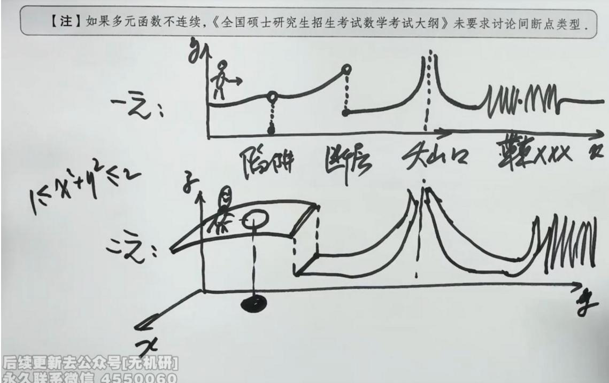

原文页码：1；bbox：`[151, 261, 840, 568]`

## 图 2

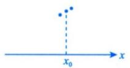

原文页码：2；bbox：`[364, 131, 492, 179]`

## 图 3

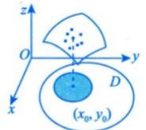

原文页码：2；bbox：`[426, 181, 537, 252]`

## 图 4

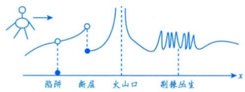

原文页码：2；bbox：`[329, 259, 630, 338]`

## 图 5

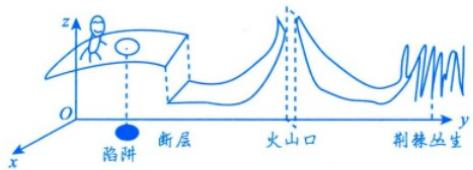

原文页码：2；bbox：`[337, 344, 623, 417]`

## 图 6

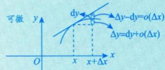

原文页码：8；bbox：`[322, 428, 517, 486]`

## 图 7

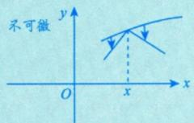

原文页码：8；bbox：`[526, 422, 670, 487]`

## 图 8

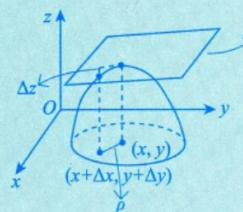

原文页码：8；bbox：`[537, 501, 684, 592]`

## 图 9

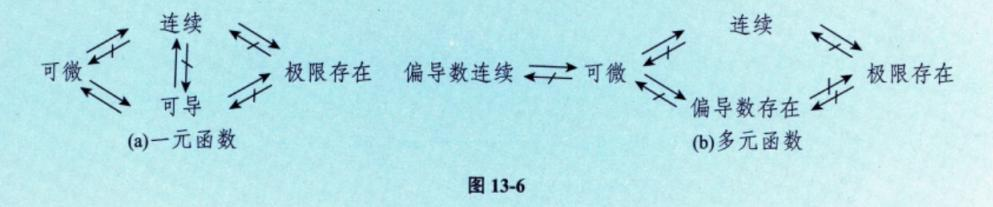

原文页码：11；bbox：`[159, 766, 759, 854]`

## 图 10

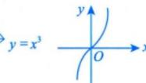

原文页码：14；bbox：`[505, 399, 618, 444]`

## 图 11

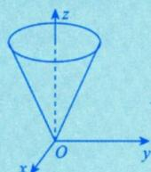

原文页码：14；bbox：`[517, 585, 620, 667]`

## 图 12

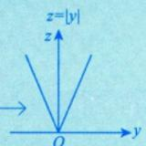

原文页码：14；bbox：`[643, 583, 739, 651]`

## 图 13

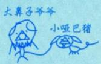

原文页码：15；bbox：`[536, 325, 636, 370]`

## 图 14

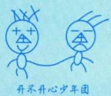

原文页码：15；bbox：`[647, 309, 757, 376]`

## 图 15

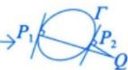

原文页码：17；bbox：`[710, 565, 796, 599]`

## 图 16

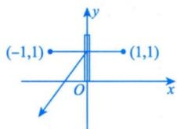

原文页码：27；bbox：`[596, 206, 732, 277]`

## 图 17

原文页码：33；bbox：`[231, 99, 262, 121]`

## 图 18

原文页码：34；bbox：`[191, 382, 220, 399]`

## 图 19

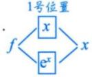

原文页码：34；bbox：`[458, 137, 539, 185]`

## 图 20

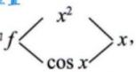

原文页码：34；bbox：`[505, 191, 598, 225]`

## 图 21

原文页码：34；bbox：`[184, 254, 208, 273]`

## 图 22

原文页码：34；bbox：`[215, 676, 248, 700]`

## 图 23

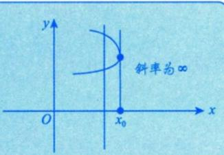

原文页码：35；bbox：`[636, 175, 833, 272]`

## 图 24

原文页码：37；bbox：`[169, 487, 460, 527]`

## 图 25

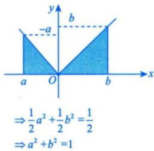

原文页码：40；bbox：`[660, 123, 815, 230]`

## 图 26

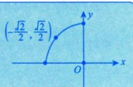

原文页码：40；bbox：`[682, 478, 843, 552]`
