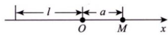

# 第十二讲  一元函数积分学的应用（三）---物理应用.docx

# 第十二讲 一元函数积分学的应用

## (三) ---物理应用

知识点：

引力:

4 引力

设有一长度为 $l$ 、线密度为常数 $\mu$ 的细棒，在与细棒右端的距离为 $a$ 处有一质量为 $m$ 的质点 $M$ （见图12-6），已知引力常量为 $G$ ，则质点 $M$ 与细棒之间的引力的大小为 $\int_{-l}^{0}\frac{Gm\mu}{(a - x)^2}\mathrm{d}x$ ：

  
图12-6

2017年1月1日

## 三心：

## 质心、重心、形心

## “三心”的概念

首先，要知道质心、重心与形心的概念。

质心是指物体的质量分布中心，是物体的固有特性.

重心是指物体所受地球引力的重力分布中心，依赖于重力场，在均匀重力场下，重心与质心重合，在非均匀重力场下，重心一般不是质心。

形心是指几何图形的分布中心，是固有几何量。当物体密度为常数时，物体质心与其几何体形心重合。

故在满足均匀重力场及均质条件下，重心、质心、形心三心重合。

## 古鲁金第一定理：

你说的应该是古鲁金第一定理，也常叫帕普斯—古尔丁定理第一定理。在你上传的张宇《基础30讲》里，它放在“一元函数积分学的应用（三）——物理应用与经济应用”中，讲义明确把它用于旋转曲面表面积，并给出公式 $A = 2\pi l\cdot r$ ，其中 $l$ 是曲线段长度， $r$ 是曲线段形心到旋转轴的距离。2027张宇30讲下

## 1. 定理内容

设一条平面曲线段 L 的长度为 l，它的形心为 $C(\bar{x}, \bar{y})$ 。把这条曲线段绕同一平面内一条不与曲线相交的直线旋转一周，得到一个旋转曲面。

则旋转曲面的面积为：

$$
S = 2 \pi r l
$$

其中：

$$
r = \mathrm{形心到旋转轴的距离}
$$

也可以理解为：

$$
\text { 旋转曲面面积 } = \text { 曲线长度 } \times \text { 形心转过的路程 }
$$

因为形心绕轴转一圈，走过的路程是：

$$
2 \pi r
$$

所以：

$$
S = l \cdot 2 \pi r
$$

## 2. 它到底在算什么？

古鲁金第一定理算的是：

线转面

也就是：

一条曲线 $L$ 绕某条轴旋转一周，形成一个曲面，求这个曲面的表面积。

例如：

圆周绕外部直线旋转，会形成环面；

线段绕直线旋转，会形成圆锥面或圆台侧面；

曲线绕 $x$ 轴或 $y$ 轴旋转，会形成旋转曲面。

## 3. 和第二定理怎么区分？

这是最容易混的地方。

<table><tr><td>定理</td><td>对象</td><td>旋转后得到</td><td>公式</td></tr><tr><td>古鲁金第一定理</td><td>曲线段L</td><td>曲面</td><td>S=2πrl</td></tr><tr><td>古鲁金第二定理</td><td>平面区域D</td><td>立体</td><td>V=2πrA</td></tr></table>

口诀：

线转面，用第一；面转体，用第二

其中：

\- $l$ : 曲线长度;

\- $A$ : 平面区域面积;

\- $r$ ：形心到旋转轴的距离。

## 4. 形心怎么找?

如果曲线是均匀曲线段，则形心坐标为：

$$
\bar {x} = \frac {1}{l} \int_ {L} x d s, \quad \bar {y} = \frac {1}{l} \int_ {L} y d s
$$

如果绕 $y$ 轴旋转：

$$
r = | \bar {x} |
$$

如果绕 $x$ 轴旋转：

$$
r = | \bar {y} |
$$

如果绕直线 $x = a$ 旋转：

$$
r = | \bar {x} - a |
$$

如果绕直线 $y = b$ 旋转：

$$
r = | \bar {y} - b |
$$

如果绕一般直线：

$$
A x + B y + C = 0
$$

则：

$$
r = \frac {| A \bar {x} + B \bar {y} + C |}{\sqrt {A ^ {2} + B ^ {2}}}
$$

## 古鲁金第二定理：

已思考 $49\mathrm{s}>$

古鲁金第二定理，也叫帕普斯—古尔丁第二定理。它和第一定理是一对：

$$
\begin{array}{r l} & \text {第一定理：线转面，求表面积} \\ & \text {第二定理：面转体，求体积} \end{array}
$$

你上传的张宇《基础30讲》里把它放在第14讲二重积分中，属于二重积分应用里的面积、体积、形心问题；讲义中也有“由古鲁金第二定理”求旋转体体积的例题。2027张宇30讲下同时它在二重积分知识结构中被列为一个单独知识点。2027张宇30讲下

## 1. 古鲁金第二定理内容

设平面区域 $D$ 的面积为 $A$ ，形心为：

$(\bar{x},\bar{y})$

把区域 $D$ 绕同一平面内一条不穿过该区域内部的直线旋转一周，得到一个旋转体。

则旋转体体积为：

$$
\boxed {V = 2 \pi r A}
$$

其中：

$$
r = \mathrm{区域形心到旋转轴的距离}
$$

也就是说：

$$
\text {旋转体体积} = \text {平面区域面积} \times \text {形心转过的路程}
$$

因为形心绕轴转一圈，走过的路程是：

$$
2 \pi r
$$

所以：

$$
V = A \cdot 2 \pi r
$$

## 2. 它到底在算什么？

第一定理是：

$$
\mathrm{曲线段绕轴旋转} \Rightarrow \mathrm{曲面}
$$

第二定理是：

$$
\mathrm{平面区域绕轴旋转} \Rightarrow \mathrm{立体}
$$

所以第二定理算的是：

## 旋转体体积

例如一个圆形区域绕外部直线旋转，会形成一个环体；一个矩形区域绕外部直线旋转，会形成一个圆环柱体；一个平面图形绕某条轴旋转，会生成某个立体。

## 总结：

https://chatgpt.com/g/g-p-6a1d505226e08191a7f47eb8e9418ffe-gao-shu-ocr/c/6a51fa71-5868-83ee-9922-92464f7d311f

## 4. 从二重积分角度理解

形心纵坐标的定义为

$$
\bar {y} = \frac {\iint_ {D} y d A}{\iint_ {D} d A}.
$$

其中分母是总面积：

$$
\iint_ {D} d A = \int_ {a} ^ {b} \int_ {g (x)} ^ {f (x)} d y d x = \int_ {a} ^ {b} [ f (x) - g (x) ] d x.
$$

分子是区域对 $x$ 轴的面积矩：

$$
\iint_ {D} y d A = \int_ {a} ^ {b} \int_ {g (x)} ^ {f (x)} y d y d x.
$$

先对 $y$ 积分：

$$
\int_ {g (x)} ^ {f (x)} y d y = \left. \frac {y ^ {2}}{2} \right| _ {g (x)} ^ {f (x)} = \frac {1}{2} [ f ^ {2} (x) - g ^ {2} (x) ].
$$

所以

$$
\bar {y} = \frac {\frac {1}{2} \int_ {a} ^ {b} [ f ^ {2} (x) - g ^ {2} (x) ] d x}{A}.
$$

|（注：部分内容可能由 AI 生成）
