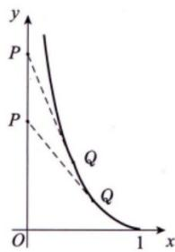
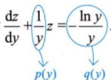

# 第十五讲 微分方程.docx

# 第十五讲 微分方程

## 知识点：

## 伯努利方程：

4 伯努利方程（仅数学一） （数学二、数学三考纲不作要求，但应会用换元法）
形如

$$
\frac {\mathrm{d} y}{\mathrm{d} x} + p (x) y = q (x) y ^ {n} (n \neq 0, 1)
$$

的方程叫作伯努利方程，其中 $p(x), q(x)$ 为已知的连续函数。其解法为

①先变形为 $y^{-n}\cdot\frac{dy}{dx}+p(x)y^{1-n}=q(x)$ ;

②令 $z = y^{1 - n}$ ，得 $\frac{\mathrm{d}z}{\mathrm{d}x} = (1 - n)y^{-n}\frac{\mathrm{dy}}{\mathrm{dx}}$ ，则 $\frac{1}{1 - n}\frac{\mathrm{dz}}{\mathrm{dx}} +p(x)z = q(x)$

## 二阶可降阶微分方程：

③解此一阶线性微分方程即可.

(1) $y'' = f(x, y')$ 型 (方程中不显含未知函数 $y$ ).

$p = p(x)$ ①令 $y' = p, y'' = p'$ ，则原方程变为一阶方程 $\frac{dp}{dx} = f(x, p)$ ；

②若求得其通解为 $p=\varphi(x,C_{1})$ ，即 $y'=\varphi(x,C_{1})$ ，则原方程的通解为 $y=\int\varphi(x,C_{1})\mathrm{d}x+C_{2}$

(2) $y'' = f(y, y')$ 型 (方程中不显含自变量 x ).

新草除根x

①令 $y' = p$ , $y'' = \frac{dp}{dx} = \frac{dp}{dy} \cdot \frac{dy}{dx} = \frac{dp}{dy} \cdot p$ ，则原方程变为一阶方程 $p \frac{dp}{dy} = f(y, p)$ ;

②若求得其通解为 $p=\varphi(y,C_{1})$ ，则由 $p=\frac{dy}{dx}$ 可得 $\frac{dy}{dx}=\varphi(y,C_{1})$ ，分离变量得 $\frac{dy}{\varphi(y,C_{1})}=dx$ ；

③两边积分得 $\int \frac{\mathrm{dy}}{\varphi(y, C_1)} = x + C_2$ ，即可求得原方程的通解。

注 $y''$ 若仅写成 $p'$ ，则方程变为 $p' = f(y, p)$

实际上，由于 $p' = \frac{\mathrm{d}p}{\mathrm{d}x}$ ，则上式变为关于 $x, y, p$ 的方程，会增加方程的复杂性。所以 $y''$ 不能写成 $p'$ ，而应写成 $y'' = \frac{\mathrm{d}p}{\mathrm{d}x} = \frac{\mathrm{d}p}{\mathrm{d}y} \cdot \frac{\mathrm{d}y}{\mathrm{d}x} = p \frac{\mathrm{d}p}{\mathrm{d}y}$ ，从而上式变为 $p \frac{\mathrm{d}p}{\mathrm{d}y} = f(y, p)$ ，变为仅关于 $y, p$ 的一阶方程。

(3) $y'' = f(y')$ 型.

此类型既不显含 $y$ ，又不显含 $x$ ，按(1)的办法，即不显含 $y$ 来处理.

## 例1：不显含 $y$ ，降阶后是一阶线性方程

求微分方程

$$
y ^ {\prime \prime} - \frac {1}{x} y ^ {\prime} = 2 x, \quad x > 0
$$

的通解。

## 例2：不显含 $y$ ，降阶后可分离变量，并注意丢解求

$$
y ^ {\prime \prime} = (y ^ {\prime}) ^ {2}
$$

的全部解。

## 例3: 不显含 $x$ , 标准使用 $p = p(y)$

求微分方程

$$
y y ^ {\prime \prime} + (y ^ {\prime}) ^ {2} = 0
$$

的通解。

https://chatgpt.com/g/g-p-6a1d505226e08191a7f47eb8e9418ffe-gao-shu-ocr/c/6a59e102-1398-83e8-a488-18eb85fee4d3

## 全微分方程:

## 6 全微分方程（仅数学一）

若函数 $P(x,y),Q(x,y)$ 在单连通区域 $D$ 上具有一阶连续偏导数，且在 $D$ 内满足

$$
\frac {\partial Q}{\partial x} = \frac {\partial P}{\partial y},
$$

则 $P\mathrm{d}x + Q\mathrm{d}y$ 是某二元函数 $u(x,y)$ 的全微分.若一阶微分方程写成

$$
P (x, y) \mathrm{d} x + Q (x, y) \mathrm{d} y = 0\tag{*}
$$

的形式时，等式左端表达式是 $u(x,y)$ 的全微分，则称 $(*)$ 式为全微分方程.

## 1. 直观理解：单连通区域就是“连成一片，而且没有洞”

在平面上，一个区域 $D$ 若满足：

1. 区域内部任意两点可以用一条完全位于 D 内的曲线连接;

2. 区域中不存在“绕不开的洞”；

就称为单连通区域。

最核心的记忆是：

$$
\mathrm{单连通} = \mathrm{连通} + \mathrm{无洞}
$$

## 5.“连通”和“单连通”有什么区别？

## 连通区域

只要求内部任意两点能够通过区域内的曲线连接。

圆环虽然有洞，但任意两点仍然可以连接，因此圆环是连通区域。

## 单连通区域

不仅要求连通，还要求没有洞。

因此：

单连通一定连通，但连通不一定单连通

例如圆环：

连通，但不单连通

## 6. 为什么全微分方程中特别强调“单连通”？

你截图中的结论是：

若在单连通区域 $D$ 上，

$$
\frac {\partial Q}{\partial x} = \frac {\partial P}{\partial y},
$$

则

$$
P (x, y) d x + Q (x, y) d y
$$

是某个函数 $u(x,y)$ 的全微分，即

$$
d u = P d x + Q d y.
$$

这里的“单连通”是保证这个结论能够在整个区域内成立的重要条件。高等数学第8版下册\_OCR

因为若

$$
d u = u _ {x} d x + u _ {y} d y,
$$

那么必须有

$$
u _ {x} = P, \qquad u _ {y} = Q.
$$

由混合偏导数相等，得到必要条件

$$
P _ {y} = u _ {x y} = u _ {y x} = Q _ {x}.
$$

但是，只有

$$
P _ {y} = Q _ {x}
$$

并不一定能保证在整个区域中存在 u。如果区域中存在洞，可能出现“局部可以积分，绕洞一圈却不一致”的情况。

## 例1：最基本的全微分方程

求解

$$
(2 x + y) d x + (x + 2 y) d y = 0.
$$

## 例2：含指数函数与三角函数

求解

$$
\left(e ^ {x} \cos y + 2 x\right) d x - e ^ {x} \sin y d y = 0.
$$

## 例3：考查参数，使方程成为全微分方程

确定常数 $a$ ，使

$$
\left(3 x ^ {2} + 2 a x y + y ^ {2}\right) d x + \left(a x ^ {2} + 2 x y + 3 y ^ {2}\right) d y = 0
$$

为全微分方程，并求其通解。

## 例4：参数确定型，参数有唯一值

确定 $a$ ，使

$$
(2 x y + a y ^ {2}) d x + (x ^ {2} + 4 x y) d y = 0
$$

为全微分方程，并求通解。

## 例7：易错辨析——偏导相等却未必全局是全微分

考察微分式

$$
\omega = - \frac {y}{x ^ {2} + y ^ {2}} d x + \frac {x}{x ^ {2} + y ^ {2}} d y, \quad (x, y) \neq (0, 0).
$$

是否为某个单值函数在区域

$$
D = \mathbb {R} ^ {2} \setminus \{(0, 0) \}
$$

上的全微分？

https://chatgpt.com/g/g-p-6a1d505226e08191a7f47eb8e9418ffe-gao-shu-ocr/c/6a59e63e-3920-83ee-8304-35b7a7f65ad1

## 二阶常系数齐次线性微分方程：

## 第15讲 微分方程

②若 $p^{2}-4q=0$ ，设 $r_{1},r_{2}$ 是特征方程的两个相等的实根，即二重根，令 $r_{1}=r_{2}=r$ ，可得其通解为

$$
y = (C _ {1} + C _ {2} x) \mathrm{e} ^ {r x} . \frac {\mathrm{e} ^ {r x}}{x \mathrm{e} ^ {r x}} \neq \text { 常数 }
$$

## 二阶常系数非齐次线性微分方程：

③若 $p^{2}-4q<0$ ，设 $\alpha\pm\beta i$ 是特征方程的一对共轭复根，可得其通解为

$$
y = \mathrm{e} ^ {\alpha x} (C _ {1} \cos \beta x + C _ {2} \sin \beta x) . \frac {\mathrm{e} ^ {\alpha x} \cos \beta x}{\mathrm{e} ^ {\alpha x} \sin \beta x} \neq \text { 常数 }
$$

## 2 二阶常系数非齐次线性微分方程

(1) 概念. $\rightarrow y'' + py' + qy = 0$ 也称为非齐次方程 $y'' + py' + qy = f(x)(f(x) \neq 0)$ 的“导出方程”.

方程 $y'' + py' + qy = f(x)(f(x) \neq 0)$ 称为二阶常系数非齐次线性微分方程，其中 p, q 为常数， $f(x)$ 为已知的连续函数，叫作自由项.

(2) 解的结构.

①若 $y_{1}^{*}(x)$ 是 $y'' + py' + qy = f_{1}(x)$ 的解， $y_{2}^{*}(x)$ 是 $y'' + py' + qy = f_{2}(x)$ 的解，则 $y_{1}^{*}(x) + y_{2}^{*}(x)$ 是 $y'' + py' + qy = f_{1}(x) + f_{2}(x)$ 的解.

②设 $y_{1}^{*}$ ， $y_{2}^{*}$ 都是 $y'' + py' + qy = f(x)$ 的特解，则 $y_{1}^{*} - y_{2}^{*}$ 是对应齐次方程的解.

(3) 特解的设定. 待定系数法 + 微分算子法

对于 $y'' + py' + qy = f(x)$ ，《全国硕士研究生招生考试数学考试大纲》规定我们需要会求以下两种情况下的特解.

设 $P_{n}(x)$ ， $P_{m}(x)$ 分别为x的n次、m次多项式.

①当自由项 $f(x)=P_{n}(x)\mathrm{e}^{\alpha x}$ 时，特解要设为 $y^{*}=\mathrm{e}^{\alpha x}Q_{n}(x)x^{k}$ ，其中

$\left\{ \begin{array}{l} \mathrm{e}^{\alpha x}\text{照抄}, \\ Q_n(x)\text{为} x\text{的} n\text{次多项式}, \\ k = \left\{ \begin{array}{ll} 0, & \alpha \text{不是特征根}, \\ 1, & \alpha \text{是单特征根}, \\ 2, & \alpha \text{是二重特征根}. \end{array} \right. \end{array} \right.$

<table><tr><td>注 $y'' + py' + qy = P_n(x)e^{ax}$ .设 $y^* = Q_n(x)e^{ax} \cdot x^k$ ,其中 $e^{\alpha x}$ 照抄(若没有 $e^{\alpha x}$ ,表明 $\alpha = 0$ ), $P_n(x)$ 写成 $Q_n(x)$ ,为x的n次多项式, $k = \begin{cases} 0, & \alpha \ne r_{1,2}, \\ 1, & \alpha = r_1 \text{或} \alpha = r_2 (r_1 \ne r_2), \\ 2, & \alpha = r_1 = r_2. \end{cases}$ 写一般式总结:一看,二算,三比较.自由项中的 $\alpha$  $r_{1,2}$ </td><td>如: $y'' - 2y' + 5y = 1 \cdot e^x$ .设 $y^* = a e^x \cdot x^0$  $= a e^x$ ,代回方程得 $ae^x - 2ae^x + 5ae^x = e^x \Rightarrow 4a = 1 \Rightarrow a = \frac{1}{4}$ ,则 $y^* = \frac{1}{4}e^x$ ,故通解为 $y = e^x (C_1 \cos 2x + C_2 \sin 2x) + \frac{1}{4}e^x$ ,其中 $C_1, C_2$ 为任意常数.</td></tr></table>

$$
y ^ {*} = \mathrm{e} ^ {\alpha x} \left[ Q _ {l} ^ {(1)} (x) \cos \beta x + Q _ {l} ^ {(2)} (x) \sin \beta x \right] x ^ {k},
$$

②当自由项 $f(x)=\mathrm{e}^{\alpha x}\left[P_{m}(x)\cos\beta x+P_{n}(x)\sin\beta x\right]$ 时，特解要设为

其中 $\left\{ \begin{array}{l} \mathrm{e}^{\alpha x}\text{照抄},\\ l = \max \{m,n\} ,Q_l^{(1)}(x),Q_l^{(2)}(x)\text{分别为} x\text{的两个不同的} l\text{次多项式},\\ k = \left\{ \begin{array}{ll}0, & \alpha \pm \beta \mathrm{i}\text{不是特征根},\\ 1, & \alpha \pm \beta \mathrm{i}\text{是特征根}. \end{array} \right. \end{array} \right.$

如： $y''-2y'+5y=-e^{x}\cos2x$ 注1 $y'' + py' + qy = e^{\alpha x}[P_m(x)\cos\beta x + P_n(x)\sin\beta x]$ .
设 $y^{*} = e^{\alpha x}[Q_{l}^{(1)}(x)\cos\beta x + Q_{l}^{(2)}(x)\sin\beta x]x^{k}$ ，其中 $\left\{\begin{aligned}&e^{\alpha x}\text{照抄（若没有}e^{\alpha x},\text{表明}\alpha=0),\\&l=\max\{m,n\},Q_{l}^{(1)}(x),Q_{l}^{(2)}(x)\text{分别为}x\text{的两个不同的}l\text{次多项式},\\&k=\left\{\begin{aligned}&0,\alpha\pm\beta i\neq r_{1,2},\\ &1,\alpha\pm\beta i=r_{1,2}.\\\end{aligned}\right.\end{aligned}\right.$ 按最高次写一般式
总结：一看，二算，三比较。
自由项中的 $\alpha, \beta$

设 $y^{*}=\underline{e}^{x}(A\cos2x+\underline{B}\sin2x)x^{0}$ 一看： $\alpha\pm\beta i=1\pm2i$ 二算： $r_{1,2}=1\pm2i$

由英国物理学家海威塞德在19世纪末提出，“D”由他引入，使微分方程变为形式上的代数方程。许多数学家批评此方法不全面，不严谨。这让我又想起另一位物理学家，诺贝尔物理学奖得宝贵。他经常在积分号中求导，也被数学家批评不严谨甚至错误，但很多棘手的积分（甚至著名的积分，如Γ函数）在他“荒唐”的方法下，却可轻易得到正确结果，这在第9讲中已经讲过了。

## 注2 特解还可用微分算子法来求解.

约定： $D=\frac{d}{dx}$ ， $Dy=\frac{dy}{dx}$ ， $D^{2}=\frac{d^{2}}{dx^{2}}$ ， $D^{2}y=\frac{d^{2}y}{dx^{2}}$ ，于是微分方程 $y''+py'+qy=f(x)$ 即可写成 $(D^{2}+pD+q)y=f(x)$ ，进一步记 $D^{2}+pD+q=F(D)$ ，称为算子多项式，它满足普通多项式的运算规则，如因式分解等，则上述微分方程即可写成 $F(D)y=f(x)$ ，此时它的一个特解为

$$
y ^ {*} = \frac {1}{F (\mathrm{D})} f (x).
$$

在约定 “D” 表示求导的条件下，约定 “ $\frac{1}{D}$ ” 表示积分，如 $D\sin x = \cos x, \frac{1}{D}\sin x = -\cos x$ （取 C = 0）。

① $\frac{1}{F(D)}e^{ax}$ 型.

若 $F(D)\big|_{D=\alpha}\neq0$ ，有 $y^{*}=\frac{1}{F(D)\big|_{D=\alpha}}e^{\alpha x}$ ．→注例1若 $F(\mathrm{D})|_{\mathrm{D} = \alpha} = 0$ ，而 $F^{\prime}(\mathrm{D})|_{\mathrm{D} = \alpha}\neq 0$ ，有 $y^{*} = x\frac{1}{F^{\prime}(\mathrm{D})|_{\mathrm{D} = \alpha}}\mathrm{e}^{\alpha x}$ .→注例2

若 $F(\mathrm{D})\big|_{\mathrm{D} = \alpha} = 0,F^{\prime}(\mathrm{D})\big|_{\mathrm{D} = \alpha} = 0$ ，而 $F''(\mathrm{D})\big|_{\mathrm{D} = \alpha}\neq 0$ ，有

$$
y ^ {*} = x ^ {2} \frac {1}{F ^ {\prime \prime} (D) \big | _ {D = \alpha}} e ^ {\alpha x}. \longrightarrow \text { 注例3 }
$$

注例1 已知 $y'' + y' - 2y = 2$ ，求 $y^*$ .

解 $y^{*} = \frac{1}{\mathrm{D}^2 + \mathrm{D} - 2} 2\mathrm{e}^{0x}$ ，由 $(\mathrm{D}^2 + \mathrm{D} - 2) \big|_{\mathrm{D} = 0} \neq 0$ ，得 $F(\mathrm{D})|_{\mathrm{D} = a} \neq 0$

$$
y ^ {*} = \frac {1}{(D ^ {2} + D - 2) \big | _ {D = 0}} 2 e ^ {0 x} = \frac {1}{- 2} \cdot 2 = - 1.
$$

注例 2 已知 $y'' + y' - 2y = e^{x}$ ，求 $y^{*}$ .

解 $y^{*} = \frac{1}{\mathrm{D}^{2} + \mathrm{D} - 2}\mathrm{e}^{x}$ ，由 $(\mathrm{D}^2 +\mathrm{D} - 2)\Big|_{\mathrm{D} = 1} = 0,(\mathrm{D}^2 +\mathrm{D} - 2)'\Big|_{\mathrm{D} = 1}\neq 0$ ，得 $F(\mathrm{D})|_{\mathrm{D} = \alpha} = 0$ 而 $F^{\prime}(\mathrm{D})|_{\mathrm{D} = \alpha}\neq 0$

$$
y ^ {*} = x \frac {1}{(D ^ {2} + D - 2) ^ {\prime} \big | _ {D = 1}} e ^ {x} = x \cdot \frac {1}{3} e ^ {x} = \frac {1}{3} x e ^ {x}.
$$

注例3 已知 $y'' - 2y' + y = \mathrm{e}^x$ ，求 $y^*$

解 $y^{*} = \frac{1}{\mathrm{D}^{2} - 2\mathrm{D} + 1}\mathrm{e}^{x}$ ，由

$$
\left. \left(\mathrm{D} ^ {2} - 2 \mathrm{D} + 1\right) \right| _ {\mathrm{D} = 1} = 0, \left. \left(\mathrm{D} ^ {2} - 2 \mathrm{D} + 1\right) ^ {\prime} \right| _ {\mathrm{D} = 1} = 0, \left. \left(\mathrm{D} ^ {2} - 2 \mathrm{D} + 1\right) ^ {\prime \prime} \right| _ {\mathrm{D} = 1} \neq 0,
$$

$$
\begin{array}{r l} & {F (\mathrm{D}) | _ {\mathrm{D} = \alpha} = 0,} \\ & {F ^ {\prime} (\mathrm{D}) | _ {\mathrm{D} = \alpha} = 0,} \\ & {\text {而} F ^ {\prime \prime} (\mathrm{D}) | _ {\mathrm{D} = \alpha} \neq 0} \end{array}
$$

得

$$
y ^ {*} = x ^ {2} \frac {1}{(\mathrm{D} ^ {2} - 2 \mathrm{D} + 1) ^ {\prime \prime} \Big | _ {\mathrm{D} = 1}} \mathrm{e} ^ {x} = x ^ {2} \cdot \frac {1}{2} \mathrm{e} ^ {x} = \frac {1}{2} x ^ {2} \mathrm{e} ^ {x}.
$$

② a. $\frac{1}{D^{2}+q}\cos\beta x$ 或 $\frac{1}{D^{2}+q}\sin\beta x$ 型.

若 $(\mathrm{D}^2 + q) \big|_{\mathrm{D} = \beta \mathrm{i}} \neq 0$ ，有 $y^* = \frac{1}{(\mathrm{D}^2 + q) \big|_{\mathrm{D} = \beta \mathrm{i}}} \cos \beta x$ 或 $y^* = \frac{1}{(\mathrm{D}^2 + q) \big|_{\mathrm{D} = \beta \mathrm{i}}} \sin \beta x$ 。注例4

若 $(\mathrm{D}^2 + q) \big|_{\mathrm{D} = \beta \mathrm{i}} = 0$ ，有 $y^* = x \frac{1}{(\mathrm{D}^2 + q)'} \cos \beta x$ 或 $y^* = x \frac{1}{(\mathrm{D}^2 + q)'} \sin \beta x$ .

b. $\frac{1}{F(D)}\cos\beta x$ 或 $\frac{1}{F(D)}\sin\beta x$ 型.

若 $F(\mathbf{D}) = \mathbf{D}^2 +p\mathbf{D} + q$ ，则取

$$
F (\mathrm{D}) \big | _ {\mathrm{D} ^ {2} = (\beta \mathrm{i}) ^ {2}} = p \mathrm{D} + q - \beta^ {2},
$$

$$
y ^ {*} = \frac {1}{F (\mathrm{D})} \Bigg | _ {\mathrm{D} ^ {2} = (\beta \mathrm{i}) ^ {2}} \cos \beta x = \frac {p \mathrm{D} - (q - \beta^ {2})}{p ^ {2} \mathrm{D} ^ {2} - (q - \beta^ {2}) ^ {2}} \Bigg | _ {\mathrm{D} ^ {2} = (\beta \mathrm{i}) ^ {2}} \cos \beta x = \frac {p \mathrm{D} - (q - \beta^ {2})}{- p ^ {2} \beta^ {2} - (q - \beta^ {2}) ^ {2}} \cos \beta x.
$$

$\frac{1}{F(D)}\sin\beta x$ 同理.

注例4 已知 $y'' - y = \sin x$ ，求 $y^*$

解 $y^{*} = \frac{1}{\mathrm{D}^{2} - 1}\sin x$ ，由 $(\mathrm{D}^2 -1)\big|_{\mathrm{D = i}}\neq 0$ ，得

$$
y ^ {*} = \frac {1}{(D ^ {2} - 1) \big | _ {D = i}} \sin x = - \frac {1}{2} \sin x.
$$

注例5 已知 $y'' + 4y = \sin 2x$ ，求 $y^*$ .

解 $y^{*} = \frac{1}{\mathrm{D}^{2} + 4}\sin 2x$ ，由 $(\mathrm{D}^2 + 4)\big|_{\mathrm{D} = 2\mathrm{i}} = 0$ ，得

$$
y ^ {*} = x \frac {1}{\left(\mathrm{D} ^ {2} + 4\right) ^ {\prime}} \sin 2 x = x \frac {1}{2 \mathrm{D}} \sin 2 x = \frac {1}{2} x \cdot \frac {1}{\mathrm{D}} \sin 2 x = - \frac {1}{4} x \cos 2 x.
$$

注例6 已知 $y'' - 3y' + 2y = -\frac{1}{2}\cos 2x$ ，求 $y^*$

解 $y^{*} = \frac{1}{\mathrm{D}^{2} - 3\mathrm{D} + 2}\left(-\frac{1}{2}\cos 2x\right)$ ，此为 $\frac{1}{F(\mathrm{D})}\cos \beta x$ 型，于是

$$
\begin{array}{r l} y ^ {*} & = \frac {1}{D ^ {2} - 3 D + 2} \left(- \frac {1}{2} \cos 2 x\right) = \frac {1}{- 4 - 3 D + 2} \left(- \frac {1}{2} \cos 2 x\right) = \frac {1}{2} \cdot \frac {1}{3 D + 2} \cos 2 x \\ & = \frac {1}{2} \cdot \frac {3 D - 2}{9 D ^ {2} - 4} \cos 2 x = \frac {1}{2} \cdot \frac {3 D - 2}{- 4 0} \cos 2 x = - \frac {1}{8 0} (3 D - 2) \cos 2 x \\ & = - \frac {1}{8 0} (3 D \cos 2 x - 2 \cos 2 x) = - \frac {1}{8 0} (- 6 \sin 2 x - 2 \cos 2 x) \\ & = \frac {1}{4 0} (3 \sin 2 x + \cos 2 x). \end{array}
$$

$$
\begin{array}{r l} & {\textcircled {3} \frac {1}{F (D)} (x ^ {k} + a _ {1} x ^ {k - 1} + \dots + a _ {k - 1} x + a _ {k}) \text {型}.} \\ & {y ^ {*} = \frac {1}{F (D)} (x ^ {k} + a _ {1} x ^ {k - 1} + \dots + a _ {k - 1} x + a _ {k}) = Q _ {k} (D) (x ^ {k} + a _ {1} x ^ {k - 1} + \dots + a _ {k - 1} x + a _ {k}).} \\ & {\mathrm{二者对应}.} \\ & {\mathrm{常借助} \frac {1}{1 - x} \mathrm{的} k \mathrm{次泰勒多项式} 1 + x + x ^ {2} + \dots + x ^ {k}} \end{array}
$$

这里 $Q_{k}(D)$ 是将 $\frac{1}{F(D)}$ 展开为 k 次泰勒多项式，即 $b_{0} + b_{1}D + b_{2}D^{2} + \cdots + b_{k}D^{k}$ ，得 $Q_{k}(D)$ .

注例 7 已知 $y'' + y' = x^{2} + 1$ ，求 $y^{*}$ .

解

$$
y ^ {*} = \frac {1}{D ^ {2} + D} (x ^ {2} + 1) = \frac {1}{D} \cdot \frac {1}{1 + D} (x ^ {2} + 1).
$$

下面将 $\frac{1}{1 + \mathrm{D}}$ 作 $\mathbf{D}$ 的2次展开：

$$
\frac {1}{1 + \mathrm{D}} = 1 - \mathrm{D} + \mathrm{D} ^ {2} + \dots ,
$$

于是

由于 $x^{2} + 1$ 为2次多项式，故 $\frac{1}{1 + D}$ 展开到2次

$$
\begin{array}{r l} y ^ {*} & = \frac {1}{D} \cdot (1 - D + D ^ {2}) (x ^ {2} + 1) = \left(\frac {1}{D} - 1 + D\right) (x ^ {2} + 1) \\ & = \frac {1}{D} (x ^ {2} + 1) - (x ^ {2} + 1) + D (x ^ {2} + 1) \\ & = \frac {1}{3} x ^ {3} + x - x ^ {2} - 1 + 2 x = \frac {1}{3} x ^ {3} - x ^ {2} + 3 x - 1. \end{array}
$$

④ $\frac{1}{F(D)}e^{\alpha x}v(x)$ 型.

$$
\mathrm{e} ^ {\alpha x}
$$

$y^{*}=\frac{1}{F(D)}e^{\alpha x}v(x)=e^{\alpha x}\cdot\frac{1}{F(D+\alpha)}v(x)$ ，这里 $v(x)$ 是实函数.

注例8 已知 $y'' + 4y' + 5y = \mathrm{e}^{-2x}\sin x$ ，求 $y^*$

解

$$
\begin{array}{r l} y ^ {*} & = \frac {1}{D ^ {2} + 4 D + 5} e ^ {- 2 x} \sin x = e ^ {- 2 x} \cdot \frac {1}{(D - 2) ^ {2} + 4 (D - 2) + 5} \sin x \\ & = e ^ {- 2 x} \cdot \frac {1}{D ^ {2} + 1} \sin x = e ^ {- 2 x} \cdot x \frac {1}{(D ^ {2} + 1) ^ {\prime}} \sin x \\ & = e ^ {- 2 x} \cdot x \frac {1}{2 D} \sin x = \frac {1}{2} e ^ {- 2 x} \cdot x (- \cos x) = - \frac {1}{2} x e ^ {- 2 x} \cos x. \end{array}
$$

注例 9 已知 $y'' - 3y' + 2y = 2xe^{x}$ ，求 $y^{*}$ . 综合以上多种方法.

解

$$
\begin{array}{r l} y ^ {*} & = \frac {1}{D ^ {2} - 3 D + 2} 2 x e ^ {x} = 2 e ^ {x} \cdot \frac {1}{(D + 1) ^ {2} - 3 (D + 1) + 2} x = 2 e ^ {x} \cdot \frac {1}{D ^ {2} - D} x \\ & = 2 e ^ {x} \cdot \frac {1}{D} \cdot \frac {1}{D - 1} x = 2 e ^ {x} \cdot \frac {1}{D} \cdot (- 1 - D) x = 2 e ^ {x} \cdot \left(- \frac {1}{D} - 1\right) x \\ & = 2 e ^ {x} \cdot \left(- \frac {1}{2} x ^ {2} - x\right) = - x (x + 2) e ^ {x}. \end{array}
$$

(4) 通解.

若 $y(x)=C_{1}y_{1}(x)+C_{2}y_{2}(x)$ 是 $y''+py'+qy=0$ 的通解， $y^{*}(x)$ 是

$$
y ^ {\prime \prime} + p y ^ {\prime} + q y = f (x)
$$

的一个特解，则 $y(x)+y^{*}(x)$ 是 $y''+py'+qy=f(x)$ 的通解.

微分算子法详解：

https://chatgpt.com/g/g-p-6a1d505226e08191a7f47eb8e9418ffe-gao-shu-ocr/c/6a24d244-5a60-83ea-9739-3b117c59b787

## n 阶常系数齐次线性微分方程：

## 3 $n(n>2)$ 阶常系数齐次线性微分方程

①若 r 为单实根，写 $Ce^{rx}$ ;

②若 $r$ 为 $k$ 重实根，写

一般不超过三重

$$
\left(C _ {1} + C _ {2} x + C _ {3} x ^ {2} + \dots + C _ {k} x ^ {k - 1}\right) \mathrm{e} ^ {r x};
$$

③若 r 为单复根 $\alpha \pm \beta i$ ，写

$$
\mathrm{e} ^ {\alpha x} (C _ {1} \cos \beta x + C _ {2} \sin \beta x);
$$

④若 r 为二重复根 $\alpha \pm \beta i$ ，写

这是反求方程的理论基础

$$
\mathrm{e} ^ {\alpha x} \left(C _ {1} \cos \beta x + C _ {2} \sin \beta x + C _ {3} x \cos \beta x + C _ {4} x \sin \beta x\right).
$$

注 (1) 如果解中含特解 $e^{rx}$ ，则 r 至少为单实根，如二重根 $(C_{1} + C_{2}x)e^{rx}$ ，令 $C_{1} = 1, C_{2} = 0$ ;

(2) 如果解中含特解 $x^{k-1}e^{rx}$ ，则 r 至少为 k 重实根；

(3) 如果解中含特解 $e^{\alpha x} \cos \beta x$ 或 $e^{\alpha x} \sin \beta x$ ，则 $\alpha \pm \beta i$ 至少为单复根；

(4) 如果解中含特解 $e^{\alpha x}x\cos\beta x$ 或 $e^{\alpha x}x\sin\beta x$ ，则 $\alpha\pm\beta i$ 至少为二重复根.

详细解释：

https://chatgpt.com/g/g-p-6a1d505226e08191a7f47eb8e9418ffe-gao-shu-ocr/c/6a24eb90-b4ac-83ea-8f8d-0ce3f05b01ac

## 欧拉方程：

## 4 能写成 $x^{2}y'' + pxy' + qy = f(x)$ 形式的微分方程（欧拉方程）（仅数学一）

形如 $x^{2}\frac{d^{2}y}{dx^{2}}+px\frac{dy}{dx}+qy=f(x)$ 的方程称为欧拉方程，其中 p 与 q 为常数， $f(x)$ 为已知的连续函数。欧拉方程有固定的解法。
> 注意到 $\frac{dy}{dx}$ 是关于 t 的函数，但我们需

①当 $x > 0$ 时，令 $x = \mathrm{e}^t$ ，则 $t = \ln x, \frac{\mathrm{d}t}{\mathrm{d}x} = \frac{1}{x}$ ，于是

注意到 $\frac{\mathrm{dy}}{\mathrm{dt}}$ 是关于 $t$ 的函数，但我们需

要对 $x$ 求导，即 $\left(\frac{\mathrm{dy}}{\mathrm{dt}}\right)'_x = \frac{\mathrm{d}^2y}{\mathrm{dt}^2}\cdot \frac{\mathrm{dt}}{\mathrm{dx}}$

$$
\frac {\mathrm{d} y}{\mathrm{d} x} = \frac {\mathrm{d} y}{\mathrm{d} t} \cdot \frac {\mathrm{d} t}{\mathrm{d} x} = \frac {1}{x} \frac {\mathrm{d} y}{\mathrm{d} t}, \frac {\mathrm{d} ^ {2} y}{\mathrm{d} x ^ {2}} = \frac {\mathrm{d}}{\mathrm{d} x} \left(\frac {1}{x} \frac {\mathrm{d} y}{\mathrm{d} t}\right) = - \frac {1}{x ^ {2}} \frac {\mathrm{d} y}{\mathrm{d} t} + \frac {1}{x} \boxed {\frac {\mathrm{d}}{\mathrm{d} x} \left(\frac {\mathrm{d} y}{\mathrm{d} t}\right)} = - \frac {1}{x ^ {2}} \frac {\mathrm{d} y}{\mathrm{d} t} + \frac {1}{x ^ {2}} \frac {\mathrm{d} ^ {2} y}{\mathrm{d} t ^ {2}},
$$

方程化为

$$
\frac {\mathrm{d} ^ {2} y}{\mathrm{d} t ^ {2}} + (p - 1) \frac {\mathrm{d} y}{\mathrm{d} t} + q y = f (\mathrm{e} ^ {t}),
$$

即可求解（最后结果别忘了用 $t=\ln x$ 回代成 x 的函数）.

②当 $x < 0$ 时，令 $x = -\mathrm{e}^t$ ，同理可得.

## 注 (1) 建议考生自己写一遍以上推导过程.

(2) 数学二、数学三的考纲中不要求掌握欧拉方程，但以上推导仍应掌握.

## 微分方程的几何应用：

## →追踪问题

例 15.21 设自行车前轮和后轮与地面的接触点分别为 P 和 Q，并设 $\left|PQ\right|=1$ ，初始时刻 P 在原点，Q 在 $(1,0)$ 点，若前轮沿 y 轴的正方向前进，求 Q 点的运动轨迹。

解 如图 15-4 所示，当 P 点沿着 y 轴向上移动时，记 Q 点的轨迹形成曲线 $y = y(x)$ . 设曲线上 Q 点

的坐标为 $(x, y)$ ， $P$ 点坐标为 $(0, Y)$ ，由 $|PQ| = 1$ ，得

$x^{2}+(y-Y)^{2}=1$ ，即 $y-Y=-\sqrt{1-x^{2}}$ ．Y>y，故取负值

由题意知，QP 的方向就是曲线 $y = y(x)$ 在 $(x, y)$ 点的切线方向，故

$$
\frac {\mathrm{d} y}{\mathrm{d} x} = \frac {y - Y}{x} = - \frac {\sqrt {1 - x ^ {2}}}{x},
$$

两边积分得

$$
y = - \int \frac {\sqrt {1 - x ^ {2}}}{x} d x.
$$

图15-4

此处注意到 $x$ 与 $\sqrt{1 - x^2}$ 的平方关系，也可令 $m = x,n = \sqrt{1 - x^2}$ ，利用合分比定理来计算，可省去三角换元以及还原

令 $x = \sin t$ ，则

$$
\begin{array}{r l} y & = - \int \frac {\sqrt {1 - x ^ {2}}}{x} \mathrm{d} x = - \int \frac {\cos^ {2} t}{\sin t} \mathrm{d} t \\ & = - \int \frac {1 - \sin^ {2} t}{\sin t} \mathrm{d} t \\ & = - \int \csc t \mathrm{d} t + \int \sin t \mathrm{d} t \\ & = - \ln | \csc t - \cot t | - \cos t + C \\ & = - \ln \left| \frac {1}{x} - \frac {\sqrt {1 - x ^ {2}}}{x} \right| - \sqrt {1 - x ^ {2}} + C \\ & = \ln \left| \frac {1}{x} + \frac {\sqrt {1 - x ^ {2}}}{x} \right| - \sqrt {1 - x ^ {2}} + C \\ & = \ln \frac {1 + \sqrt {1 - x ^ {2}}}{x} - \sqrt {1 - x ^ {2}} + C. \end{array}
$$

由 $x = 1$ ， $y = 0$ ，可得 $C = 0$ .故 $Q$ 点的轨迹方程为

$$
y = \ln \frac {1 + \sqrt {1 - x ^ {2}}}{x} - \sqrt {1 - x ^ {2}}.
$$

注 追及点到被追及点的连线始终为该点的切线方向.

题：

题1:

例 15.6 设 L 是一条平面曲线，其上任意一点 $P(x, y) (x > 0)$ 到坐标原点的距离恒等于该点处的切线在 y 轴上的截距，且 L 经过点 $\left(\frac{1}{2}, 0\right)$ . 求曲线 L 的方程.
由于 $(x,y)$ 为泛指的点，故用X，Y表示坐标系

解 设曲线 L 过点 $P(x, y)$ 的切线方程为 $Y - y = y'(X - x)$ . 令 X = 0，得该切线在 y 轴上的截距为 $y - xy'$ .

由题设知 $\sqrt{x^2 + y^2} = y - xy'$ ，又 $x > 0$ ，故 $\sqrt{1 + \left(\frac{y}{x}\right)^2} = \frac{y}{x} - y'$ ，令 $u = \frac{y}{x}$ ，则此方程可化为 $\frac{\mathrm{d}u}{\sqrt{1 + u^2}} = -\frac{\mathrm{d}x}{x}$ ，解得

$$
y + \sqrt {x ^ {2} + y ^ {2}} = C. \quad x ^ {2} + y ^ {2} = \left(\frac {1}{2} - y\right) ^ {2} = \frac {1}{4} + y ^ {2} - y
$$

由 L 经过点 $\left(\frac{1}{2}, 0\right)$ ，知 $C = \frac{1}{2}$ 。于是 L 的方程为 $y + \sqrt{x^{2} + y^{2}} = \frac{1}{2}$ ，即 $y = \frac{1}{4} - x^{2} (x > 0)$ 。

## 题2:

例 15.7 设 $y = y(x)$ 是微分方程 $y' + y = e^{-x} \cos x$ 满足 $y(0) = 0$ 的特解.
(1) 求 $y(x)$ ;

后续更新去公众号[有机研]永久联系微信 4550060

## 考研数学基础30讲·高等数学分册

(2) 求曲线 $y(x)$ 与 x 轴在 $[0, +\infty)$ 上所围图形的面积.

解 (1) 根据一阶非齐次线性微分方程的通解公式, 得

$$
\begin{array}{r l} y (x) & = \mathrm{e} ^ {- \int \mathrm{d} x} \left(\int \mathrm{e} ^ {- x} \cos x \cdot \mathrm{e} ^ {\int \mathrm{d} x} \mathrm{d} x + C\right) \\ & = \mathrm{e} ^ {- x} \left(\int \cos x \mathrm{d} x + C\right) \\ & = \mathrm{e} ^ {- x} (\sin x + C). \end{array}
$$

由 $y(0)=0$ ，得 C=0 ，所以 $y=e^{-x}\sin x$ .

(2) 由例10.4，可知所求面积为 $\frac{\mathrm{e}^{-\pi} + 1}{2(1 - \mathrm{e}^{-\pi})}$ .

第二问：面积

要求：

$$
S = \int_ {0} ^ {+ \infty} | e ^ {- x} \sin x | d x
$$

即：

$$
S = \int_ {0} ^ {+ \infty} e ^ {- x} | \sin x | d x
$$

因为 $\sin x$ 在每个区间

$$
[ k \pi , (k + 1) \pi ]
$$

上正负交替，所以按每个半周期分段求。

令：

$$
x = k \pi + u, \quad u \in [ 0, \pi ]
$$

则：

$$
| \sin x | = | \sin (k \pi + u) | = \sin u
$$

并且：

$$
e ^ {- x} = e ^ {- k \pi} e ^ {- u}
$$

所以第 $k$ 段面积为：

$$
\int_ {k \pi} ^ {(k + 1) \pi} e ^ {- x} | \sin x | d x = e ^ {- k \pi} \int_ {0} ^ {\pi} e ^ {- u} \sin u d u
$$

先算公共部分：

$$
A = \int_ {0} ^ {\pi} e ^ {- u} \sin u d u
$$

公式：

$$
\int e ^ {- u} \sin u d u = - \frac {1}{2} e ^ {- u} (\sin u + \cos u)
$$

所以：

$$
A = \left[ - \frac {1}{2} e ^ {- u} (\sin u + \cos u) \right] _ {0} ^ {\pi}
$$

代入上下限:

$$
A = - \frac {1}{2} e ^ {- \pi} (0 - 1) - \left[ - \frac {1}{2} (0 + 1) \right]
$$

$$
A = \frac {1}{2} e ^ {- \pi} + \frac {1}{2}
$$

$$
A = \frac {1 + e ^ {- \pi}}{2}
$$

因此总面积为：

$$
S = \sum_ {k = 0} ^ {\infty} e ^ {- k \pi} A
$$

$$
S = A \sum_ {k = 0} ^ {\infty} e ^ {- k \pi}
$$

这是等比级数：

$$
\sum_ {k = 0} ^ {\infty} e ^ {- k \pi} = \frac {1}{1 - e ^ {- \pi}}
$$

所以：

$$
S = \frac {1 + e ^ {- \pi}}{2} \cdot \frac {1}{1 - e ^ {- \pi}}
$$

$$
\boxed {S = \frac {1 + e ^ {- \pi}}{2 (1 - e ^ {- \pi})}}
$$

也可以化成：

$$
\boxed {S = \frac {e ^ {\pi} + 1}{2 (e ^ {\pi} - 1)}}
$$

## 题 3:

例 15.9 设函数 $y = \varphi(x)$ 是微分方程 $y' + \mathrm{e}y = \left(1 - \frac{1}{x}\right)^x$ 的一个解，则 $\lim_{x \to +\infty} \varphi(x) = (\quad)$ .

(A) e

本题为重点题型

(B) $e^2$ (C) $\frac{1}{e}$ (D) $\frac{1}{e^2}$

解 应选(D).

$y' + ey = \left(1 - \frac{1}{x}\right)^x$ 为一阶线性微分方程，其通解为

$$
y = \mathrm{e} ^ {- \int \mathrm{edx}} \left[ \int \left(1 - \frac {1}{x}\right) ^ {x} \cdot \mathrm{e} ^ {\int \mathrm{edx}} \mathrm{dx} + C \right] = \mathrm{e} ^ {- \mathrm{ex}} \left[ \int \left(1 - \frac {1}{x}\right) ^ {x} \cdot \mathrm{e} ^ {\mathrm{ex}} \mathrm{dx} + C \right]
$$

$$
= \mathrm{e} ^ {- \mathrm{ex}} \left[ \int_ {x _ {0}} ^ {x} \left(1 - \frac {1}{t}\right) ^ {t} \bullet \mathrm{e} ^ {\mathrm{et}} \mathrm{d} t + C \right] = \frac {\int_ {x _ {0}} ^ {x} \left(1 - \frac {1}{t}\right) ^ {t} \bullet \mathrm{e} ^ {\mathrm{et}} \mathrm{d} t + C}{\mathrm{e} ^ {\mathrm{ex}}},
$$

其中 $x_0$ 为任意正实数，则 $\lim_{x\to +\infty}y = \lim_{x\to +\infty}\frac{\int_{x_0}^x\left(1 - \frac{1}{t}\right)^t\bullet\mathrm{e}^{\mathrm{e}t}\mathrm{d}t + C}{\mathrm{e}^{\mathrm{e}x}} = \lim_{x\to +\infty}\frac{\left(1 - \frac{1}{x}\right)^x\bullet\mathrm{e}^{\mathrm{e}x}}{\mathrm{e}\bullet\mathrm{e}^{\mathrm{e}x}} = \frac{\mathrm{e}^{-1}}{\mathrm{e}} = \frac{1}{\mathrm{e}^2}.$

故 $\lim_{x\to +\infty}\varphi (x) = \frac{1}{\mathrm{e}^2}$ ，选(D).

## 题 4:

例 15.10 设 a > 0，函数 $f(x)$ 在 $[0, +\infty)$ 内连续有界。证明：微分方程 $y' + ay = f(x)$ 的解在 $[0, +\infty)$ 内有界。

分析 证明有界性，需先求出用定积分表示的积分曲线方程.

$$
y = \mathrm{e} ^ {- \int a \mathrm{d} x} \left[ \int f (x) \cdot \mathrm{e} ^ {\int a \mathrm{d} x} \mathrm{d} x + C \right] = \mathrm{e} ^ {- a x} \left[ \int f (x) \cdot \mathrm{e} ^ {a x} \mathrm{d} x + C \right] = \mathrm{e} ^ {- a x} \left[ \int_ {0} ^ {x} f (t) \mathrm{e} ^ {a t} \mathrm{d} t + C \right],
$$

由例8.14知 $y(x)$ 在 $[0, +\infty)$ 内有界.

## 1. 先写通解

方程

$$
y ^ {\prime} + a y = f (x)
$$

乘积分因子 $e^{ax}$

$$
e ^ {a x} y ^ {\prime} + a e ^ {a x} y = e ^ {a x} f (x)
$$

左边正好是:

$$
(e ^ {a x} y) ^ {\prime} = e ^ {a x} f (x)
$$

两边从 0 积到 $x$ :

$$
e ^ {a x} y (x) - y (0) = \int_ {0} ^ {x} e ^ {a t} f (t) d t
$$

所以

$$
y (x) = y (0) e ^ {- a x} + e ^ {- a x} \int_ {0} ^ {x} e ^ {a t} f (t) d t
$$

也可写成更直观的形式：

$$
y (x) = y (0) e ^ {- a x} + \int_ {0} ^ {x} e ^ {- a (x - t)} f (t) d t
$$

## 2. 利用 $f(x)$ 有界

因为 $f(x)$ 在 $[0, +\infty)$ 上有界，所以存在常数 $M > 0$ ，使得

$$
| f (x) | \leq M
$$

于是

$$
| y (x) | \leq | y (0) | e ^ {- a x} + \int_ {0} ^ {x} e ^ {- a (x - t)} | f (t) | d t
$$

代入 $|f(t)| \leq M$ :

$$
| y (x) | \leq | y (0) | e ^ {- a x} + M \int_ {0} ^ {x} e ^ {- a (x - t)} d t
$$

计算积分：

$$
\int_ {0} ^ {x} e ^ {- a (x - t)} d t = \int_ {0} ^ {x} e ^ {- a u} d u = \frac {1 - e ^ {- a x}}{a}
$$

所以

$$
| y (x) | \leq | y (0) | e ^ {- a x} + \frac {M}{a} (1 - e ^ {- a x})
$$

因为

$$
0 <   e ^ {- a x} \leq 1, \quad 0 \leq 1 - e ^ {- a x} \leq 1
$$

所以

$$
| y (x) | \leq | y (0) | + \frac {M}{a}
$$

因此 $y(x)$ 在 $[0, +\infty)$ 上有界。

## 3. 为什么条件 $a > 0$ 很关键？

因为 $a > 0$ 时：

$$
e ^ {- a x} \rightarrow 0
$$

齐次解部分

$$
C e ^ {- a x}
$$

会衰减，不会发散。

如果 $a = 0$ ，例如

$$
y ^ {\prime} = 1
$$

其中 $f(x) = 1$ 有界，但解是

$$
y = x + C
$$

无界。

如果 $a < 0$ ，例如 $f(x) = 0$ ，方程

$$
y ^ {\prime} + a y = 0
$$

的解是

$$
y = C e ^ {- a x}
$$

由于 $-a > 0$ ，所以

$$
e ^ {- a x} = e ^ {| a | x}
$$

会发散，解可能无界。

所以这题的本质是:

$$
a > 0
$$

保证指数因子衰减，从而把有界的外力项 $f(x)$ 控制住。

题 5:

例 15.11 求 $y \, dx = (1 + x \ln y) x \, dy (y > 0)$ 的通解.

分析 与例15.8类似，无法直接计算 $\frac{\mathrm{dy}}{\mathrm{dx}} = \frac{y}{(1 + x\ln y)x}$ ，应对调 $x$ 与 $y$ 的“角色”，才能拆分成常见形式。

解 方程变形为 $\frac{dx}{dy}-\frac{1}{y}x=\frac{\ln y}{y}x^{2}$ ，这是以 y 为自变量，x 为未知函数的伯努利方程（如果以 x 为自变量，y 为未知函数来解方程，是极其困难的，所以当我们遇到困难时，要学会“换位思考”——x 与 y 谁作为自变量，谁作为未知函数是可以互换的）。

①两边同时除以 $x^{2}$ ，并令 $z=x^{-1}$ ，有 $\frac{dz}{dy}=-\frac{1}{x^{2}}\frac{dx}{dy}$ ，于是方程化为 $\frac{dz}{dy}+\frac{1}{y}z=-\frac{\ln y}{y}$ ②应用一阶线性微分方程的通解公式，得

$$
\frac {1}{x} = z = \mathrm{e} ^ {- \ln y} \left[ \int \left(- \frac {\ln y}{y} \mathrm{e} ^ {\ln y}\right) \mathrm{d} y + C \right] = \frac {1}{y} [ y (1 - \ln y) + C ],
$$

故通解为 $\frac{1}{x} = 1 - \ln y + \frac{C}{y} (y > 0, C$ 为任意常数）.

注 对于无法直接计算的微分方程 $y' = f(x, y)$ ，重点在于通过什么形式的换元将其化成以上几种常见的形式。

## 题6:

例 15.12 求微分方程 $y'' = y'[1 + (y')^2]$ 满足 $y(0) = 0$ , $y'(0) = 1$ 的特解.

第15讲

分析 缺 x 与 y，属于 (3) 中的情形，则令 $y' = p$ ， $y'' = p'$ .

分析 缺 x 与 y，属于 (3) 中的情形，则令 $y' = p$ ， $y'' = p'$ .

解 令 $y' = p$ ，则 $y'' = p'$ ，代入题干微分方程得

$$
p ^ {\prime} = p \left(1 + p ^ {2}\right),
$$

分离变量得

$$
\frac {\mathrm{d} p}{p (1 + p ^ {2})} = \mathrm{d} x,
$$

两边积分得

$$
\ln \frac {p ^ {2}}{1 + p ^ {2}} = 2 x + \ln C _ {1} (C _ {1} > 0) .
$$

由题意有 $y'(0)=1$ ，即当x=0时p=1，代入上式得 $C_{1}=\frac{1}{2}$ ，于是有

$$
y ^ {\prime} = p = \frac {\frac {\mathrm{e} ^ {x}}{\sqrt {2}}}{\sqrt {1 - \frac {1}{2} \mathrm{e} ^ {2 x}}}  ,
$$

两边积分得

$$
y = \int \frac {\frac {e ^ {x}}{\sqrt {2}}}{\sqrt {1 - \left(\frac {e ^ {x}}{\sqrt {2}}\right) ^ {2}}} d x = \arcsin \frac {e ^ {x}}{\sqrt {2}} + C _ {2}.
$$

由题意有 $y(0)=0$ ，代入上式得 $C_{2}=-\frac{\pi}{4}$ ，所以 $y=\arcsin\frac{e^{x}}{\sqrt{2}}-\frac{\pi}{4}$ .

题7:

介遇解+非介特解

例15.17 求 $y'' - 3y' + 2y = 2\mathrm{e}^{-x}\cos x$ 的通解.

解 特征方程为 $r^2 - 3r + 2 = 0$ ，其解为 $r_1 = 2, r_2 = 1$ ，因此对应的齐次微分方程的通解是

$$
\overline {{{{y}}}} = C _ {1} \mathrm{e} ^ {x} + C _ {2} \mathrm{e} ^ {2 x}.
$$

下面用两种方法求特解.

方法一 待定系数法.

→贴抄 →同次

方程的一个特解可设为 $y^{*} = \mathrm{e}^{-x}(A\cos x + B\sin x)$ ，求得

$$
y ^ {* \prime} = \mathrm{e} ^ {- x} [ (B - A) \cos x - (A + B) \sin x ],
$$

$$
y ^ {* \prime \prime} = \mathrm{e} ^ {- x} (- 2 B \cos x + 2 A \sin x),
$$

代入方程解得 $A = \frac{1}{5}, B = -\frac{1}{5}$ ，即 $y^{*} = \frac{\mathrm{e}^{-x}}{5} (\cos x - \sin x)$ 。

方法二 微分算子法.

$$
\begin{array}{r l} y ^ {*} & = \frac {1}{D ^ {2} - 3 D + 2} 2 e ^ {- x} \cos x \\ & = 2 e ^ {- x} \frac {1}{(D - 1) ^ {2} - 3 (D - 1) + 2} \cos x \\ & = 2 e ^ {- x} \frac {1}{D ^ {2} - 5 D + 6} \cos x \\ & = 2 e ^ {- x} \frac {1}{- 5 D + 5} \cos x \\ & = - \frac {2}{5} e ^ {- x} \frac {1}{D - 1} \cos x \\ & = - \frac {2}{5} e ^ {- x} \frac {D + 1}{D ^ {2} - 1} \cos x \\ & = \frac {1}{5} e ^ {- x} (D + 1) \cos x \\ & = \frac {1}{5} e ^ {- x} (- \sin x + \cos x). \end{array}
$$

从而原方程的通解为

$$
y = \overline {{y}} + y ^ {*} = C _ {1} \mathrm{e} ^ {x} + C _ {2} \mathrm{e} ^ {2 x} + \frac {1}{5} \mathrm{e} ^ {- x} (\cos x - \sin x),
$$

其中 $C_1, C_2$ 为任意常数.

注 待定系数法易设出形式，难点在于计算量大，建议考生作为练习尝试书写过程。微分算子法计算量较小，难点在于需记住大量形式。

## 题8:

注：这个题虽然可以直接带入求解，但是没有这个方法快，这个方法要求对解的结构熟悉

后续更新去公众号[有机研]永久联系微信 4550060

## 考研数学基础30讲·高等数学分册

分析 $y^{*}=e^{2x}+e^{x}+xe^{x}$ ，其中 $e^{2x}$ 不可能为非齐次方程的解，故只能是齐次方程的解，若 $xe^{x}$ 为齐次方程的解，则至少对应二重根.

解 由 $f(x)=\gamma e^{x}$ 可知 $e^{ax}(a\neq1)$ 不可能是非齐次方程的特解，故 $e^{2x}$ 不可能是非齐次方程的特解，又因为 $y=e^{2x}+e^{x}+xe^{x}$ 是非齐次方程的解，所以 $e^{2x}$ 必是对应齐次方程的解，故微分方程有一个特征根 $r_{1}=2$ .

若 $e^{x}$ 是非齐次方程的解，则 $xe^{x}$ 就是齐次方程的解，此时 $r_{1}=r_{2}=1$ ，与上述 $r_{1}=2$ 矛盾，于是 $e^{x}$ 也必是齐次方程的解，此时 $r_{2}=1$ 。所以特征方程为 $(r-1)(r-2)=0$ ，即

$$
r ^ {2} - 3 r + 2 = 0,
$$

于是 $\alpha = -3, \beta = 2$ .

为确定 $\gamma$ ，只需将特解 $y^{*}=xe^{x}$ 代入方程，得

$$
(x + 2) \mathrm{e} ^ {x} - 3 (x + 1) \mathrm{e} ^ {x} + 2 x \mathrm{e} ^ {x} = \gamma \mathrm{e} ^ {x},
$$

解得 $\gamma = -1$ .

## 题9:

原方程的通解为 $y = C_{1}\mathrm{e}^{x} + C_{2}\mathrm{e}^{2x} + x\mathrm{e}^{x}$ ，其中 $C_1, C_2$ 为任意常数。

例 15.19 已知某四阶常系数齐次线性微分方程有特解 $y_{1}(x)=\mathrm{e}^{x}\cos2x,y_{2}(x)=x$ ，且方程中 $y^{(4)}$ 前的系数为1，该方程为\_\_\_\_。

吉安更新去公众号[有机研]久联系微信 4550060

第15讲 微分方程

解 应填 $y^{(4)}-2y^{(3)}+5y''=0$ .

该方程有解 $y_{1}(x) = \mathrm{e}^{x}\cos 2x$ ，必有另一解 $y_{3}(x) = \mathrm{e}^{x}\sin 2x$ ，可知对应的特征根为 $1 \pm 2\mathrm{i}$ ；该方程有解 $y_{2}(x) = x$ ，必有另一解 $y_{4}(x) = C$ （ $C$ 为常数），可知 $r = 0$ 为二重根。由以上分析可知，原微分方程的特征方程有4个特征根： $1 \pm 2\mathrm{i}, 0$ （二重），故特征方程为

$$
[ r - (1 + 2 \mathrm{i}) ] [ r - (1 - 2 \mathrm{i}) ] r ^ {2} = 0,
$$

即

$$
r ^ {4} - 2 r ^ {3} + 5 r ^ {2} = 0,
$$

所以满足条件的微分方程为

$$
y ^ {(4)} - 2 y ^ {(3)} + 5 y ^ {\prime \prime} = 0.
$$

## 题 10:

例 15.20 欧拉方程 $x^{2}\frac{d^{2}y}{dx^{2}}+4x\frac{dy}{dx}+2y=0(x>0)$ 的通解为 \_\_\_\_.

解 应填 $y=\frac{C_{1}}{x}+\frac{C_{2}}{x^{2}}, C_{1}, C_{2}$ 为任意常数.

由题设， $x > 0$ ，令 $x = \mathrm{e}^t$ ，则

$$
\frac {\mathrm{d} y}{\mathrm{d} x} = \frac {\mathrm{d} y}{\mathrm{d} t} \cdot \frac {\mathrm{d} t}{\mathrm{d} x} = \frac {1}{x} \frac {\mathrm{d} y}{\mathrm{d} t},
$$

$$
\frac {\mathrm{d} ^ {2} y}{\mathrm{d} x ^ {2}} = - \frac {1}{x ^ {2}} \frac {\mathrm{d} y}{\mathrm{d} t} + \frac {1}{x} \frac {\mathrm{d} ^ {2} y}{\mathrm{d} t ^ {2}} \cdot \frac {\mathrm{d} t}{\mathrm{d} x} = \frac {1}{x ^ {2}} \left(\frac {\mathrm{d} ^ {2} y}{\mathrm{d} t ^ {2}} - \frac {\mathrm{d} y}{\mathrm{d} t}\right),
$$

## 考研数学基础30讲·高等数学分册

现有一质量为 $m$ 的飞机，着陆时的水平速度为 $\nu(0)$ 。经测试，减速伞打开后，飞机所受的总阻力与飞机的速度成正比。比例系数为 $k, k > 0$ 。从飞机接触跑道开始计时，设 $t$ 时刻飞机的滑行距离为 $x(t)$ ，速度为 $\nu(t)$ ，则飞机滑行的位移方程为（）。
(A) $x(t) = \frac{m}{k} [v(0) - v(t)]$ (B) $x(t) = \frac{m}{k} [v(t) - v(0)]$ (C) $x(t) = km[(v(0) - v(t))]$ (D) $x(t) = km[v(t) - v(0)]$

分析 本题是标准的牛顿第二定律的应用题，列出关系式后再解微分方程即可.

## 解 应选(A).

根据牛顿第二定律，得 $m\frac{\mathrm{d}v}{\mathrm{d}t} = -kv$ ，又 $\frac{\mathrm{d}v}{\mathrm{d}t} = \frac{\mathrm{d}v}{\mathrm{d}x}\cdot \frac{\mathrm{d}x}{\mathrm{d}t} = v\frac{\mathrm{d}v}{\mathrm{d}x}$ ，可得 $\mathrm{dx} = -\frac{m}{k}\mathrm{dv}$ ，积分得

$$
x (t) = - \frac {m}{k} v (t) + C.
$$

由 $x(0) = 0$ ，得 $C = \frac{m}{k} v(0)$ ，从而

$$
x (t) = \frac {m}{k} [ v (0) - v (t) ].
$$

注 此题中，加速度 $a=\frac{d^{2}x}{dt^{2}}=\frac{dv}{dt}=\frac{dv}{dx}\cdot\frac{dx}{dt}=v\frac{dv}{dx}$ ，这是因为选项均为 x 与 v 的关系式，故用相关变化率的手段写成上述表达形式。

## (注：部分内容可能由 AI 生成)
