# 第十八讲 多元函数积分学.docx — 图像索引

> 由 MinerU 结构化结果生成。题目若依赖树形、拓扑、流程、曲线、区域、时序或其他空间关系，应核对这里的原图，不要只依据 OCR 文本推断。

## 图 1

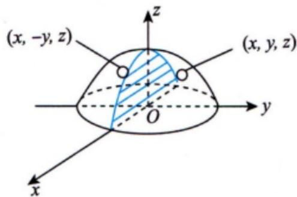

原文页码：3；bbox：`[487, 268, 786, 409]`

**图注：** 图18-1

## 图 2

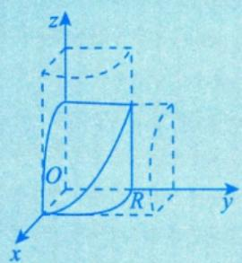

原文页码：4；bbox：`[270, 140, 433, 265]`

## 图 3

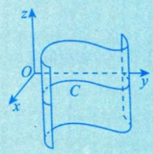

原文页码：4；bbox：`[635, 161, 791, 272]`

## 图 4

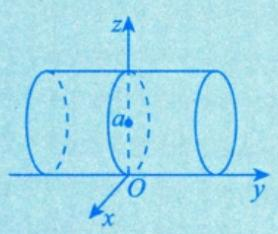

原文页码：4；bbox：`[270, 340, 438, 439]`

## 图 5

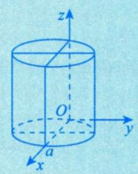

原文页码：4；bbox：`[645, 329, 781, 450]`

## 图 6

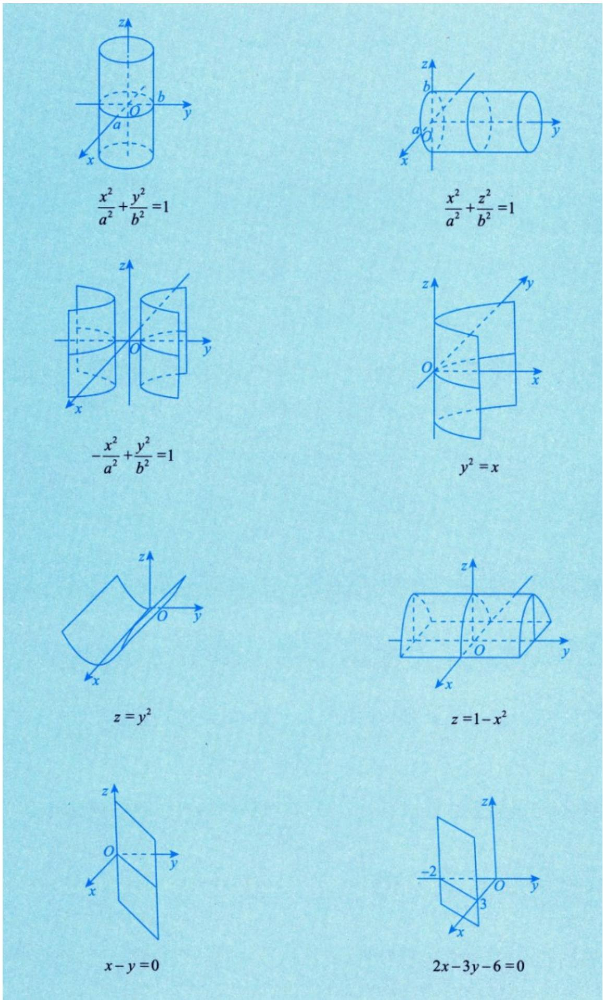

原文页码：5；bbox：`[149, 83, 848, 902]`

## 图 7

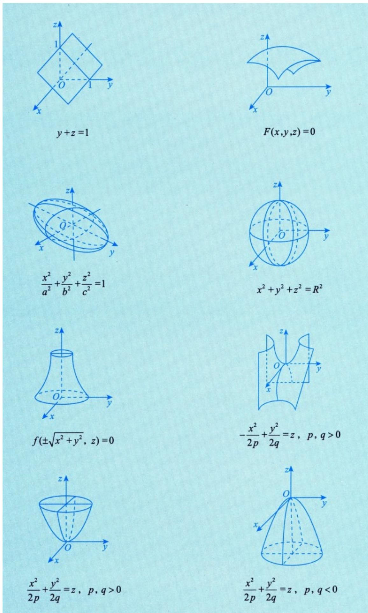

原文页码：6；bbox：`[147, 82, 847, 904]`

## 图 8

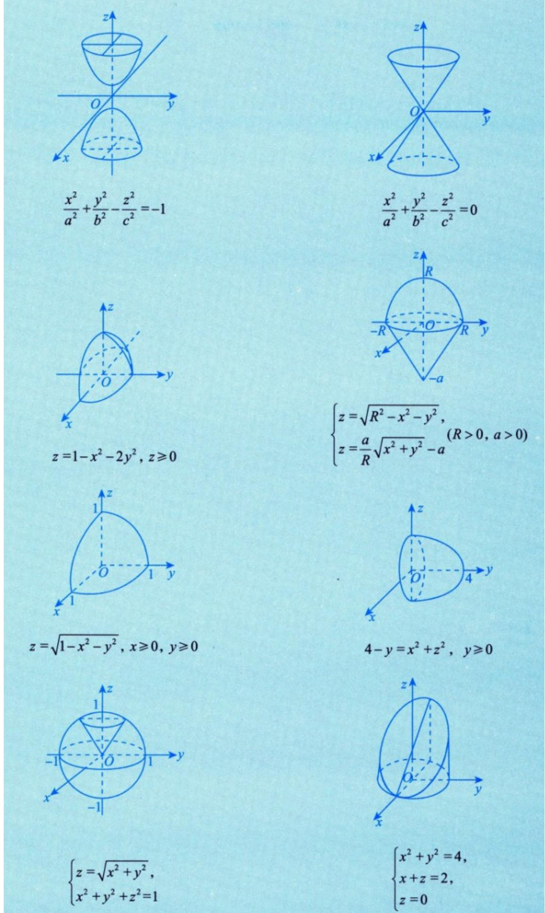

原文页码：7；bbox：`[147, 85, 848, 915]`

## 图 9

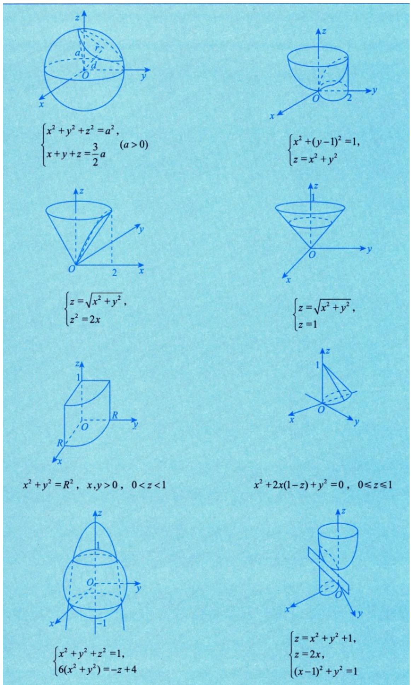

原文页码：8；bbox：`[147, 82, 850, 909]`

## 图 10

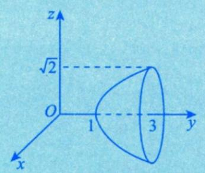

原文页码：9；bbox：`[228, 95, 436, 219]`

## 图 11

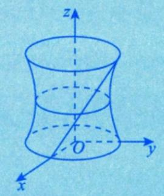

原文页码：9；bbox：`[638, 87, 801, 225]`

## 图 12

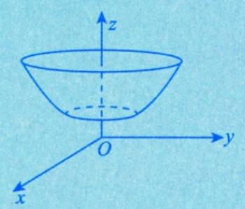

原文页码：9；bbox：`[226, 284, 438, 411]`

## 图 13

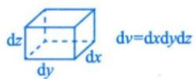

原文页码：12；bbox：`[393, 93, 544, 136]`

## 图 14

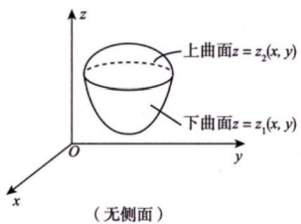

原文页码：12；bbox：`[247, 227, 505, 363]`

**图注：** (a)

## 图 15

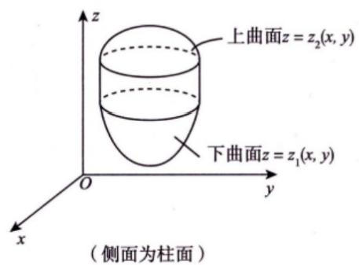

原文页码：12；bbox：`[524, 219, 800, 363]`

**图注：** (b) 图18-2

## 图 16

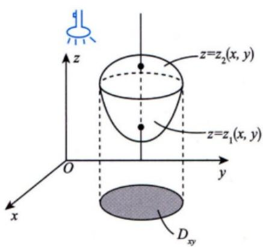

原文页码：12；bbox：`[253, 502, 517, 678]`

**图注：** (a)

## 图 17

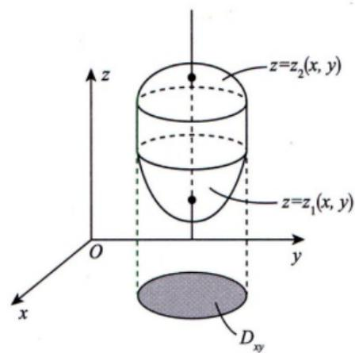

原文页码：12；bbox：`[561, 489, 831, 680]`

**图注：** (b) 图18-3

## 图 18

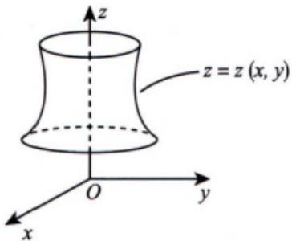

原文页码：13；bbox：`[475, 181, 695, 310]`

**图注：** 图18-4

## 图 19

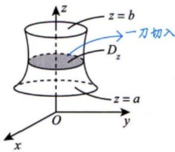

原文页码：13；bbox：`[477, 432, 690, 564]`

**图注：** 图18-5

## 图 20

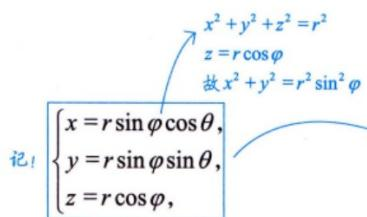

原文页码：14；bbox：`[277, 341, 499, 434]`

## 图 21

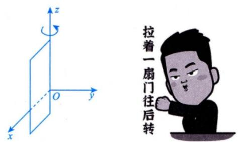

原文页码：14；bbox：`[347, 510, 633, 630]`

## 图 22

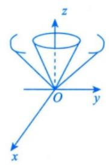

原文页码：15；bbox：`[354, 137, 463, 254]`

## 图 23

原文页码：15；bbox：`[500, 137, 645, 255]`

## 图 24

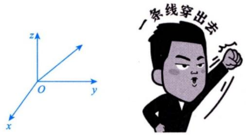

原文页码：15；bbox：`[347, 307, 653, 426]`

## 图 25

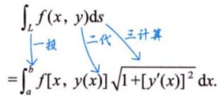

原文页码：22；bbox：`[339, 199, 527, 258]`

## 图 26

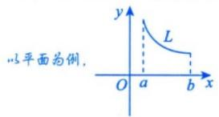

原文页码：22；bbox：`[557, 189, 722, 250]`

## 图 27

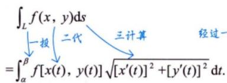

原文页码：22；bbox：`[359, 332, 591, 392]`

## 图 28

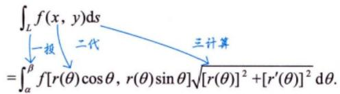

原文页码：22；bbox：`[326, 428, 625, 486]`

## 图 29

原文页码：25；bbox：`[147, 140, 431, 183]`

## 图 30

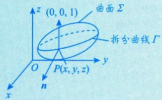

原文页码：26；bbox：`[643, 219, 840, 305]`

## 图 31

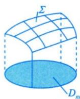

原文页码：26；bbox：`[742, 439, 836, 521]`

## 图 32

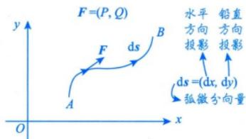

原文页码：28；bbox：`[584, 166, 793, 249]`

## 图 33

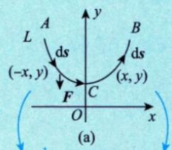

原文页码：29；bbox：`[349, 378, 495, 468]`

**图注：** 图18-14

## 图 34

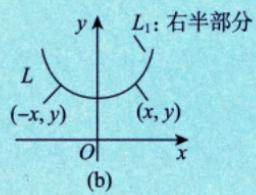

原文页码：29；bbox：`[648, 384, 803, 467]`

## 图 35

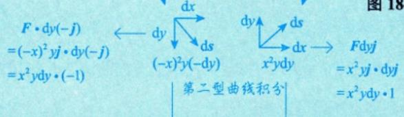

原文页码：29；bbox：`[223, 467, 578, 539]`

**图注：** 第一型曲线积分可讨论对称性

## 图 36

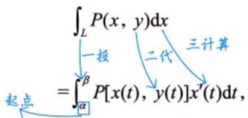

原文页码：30；bbox：`[436, 93, 687, 178]`

## 图 37

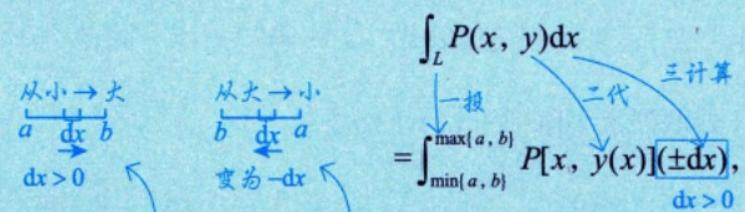

原文页码：30；bbox：`[247, 392, 697, 482]`

## 图 38

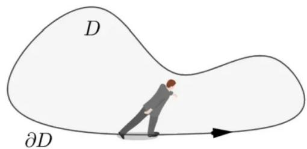

原文页码：31；bbox：`[174, 191, 482, 297]`

## 图 39

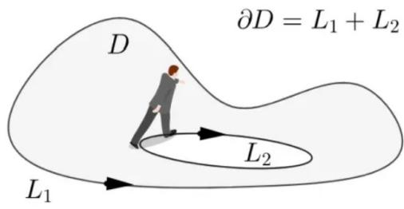

原文页码：31；bbox：`[512, 186, 818, 298]`

**图注：** 复连通域 D 及其有向建界①马同学

## 图 40

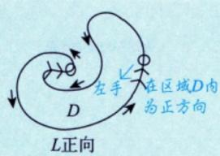

原文页码：31；bbox：`[410, 362, 573, 444]`

**图注：** 图18-16

## 图 41

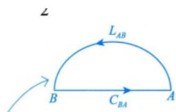

原文页码：34；bbox：`[670, 80, 823, 149]`

## 图 42

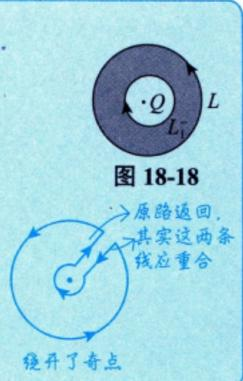

原文页码：34；bbox：`[699, 684, 845, 847]`

## 图 43

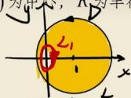

原文页码：35；bbox：`[460, 128, 561, 181]`

## 图 44

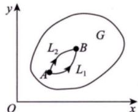

原文页码：35；bbox：`[685, 506, 821, 585]`

**图注：** 图18-19

## 图 45

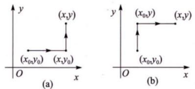

原文页码：37；bbox：`[381, 516, 621, 593]`

**图注：** 图18-20

## 图 46

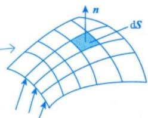

原文页码：38；bbox：`[529, 189, 678, 273]`

**图注：** 向量场 v (水流)

## 图 47

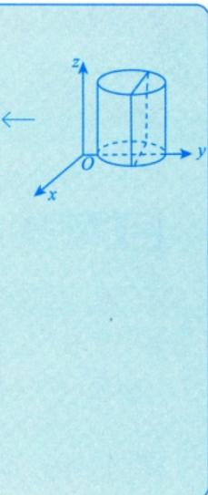

原文页码：40；bbox：`[705, 177, 843, 409]`

## 图 48

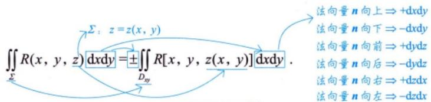

原文页码：40；bbox：`[332, 676, 774, 750]`

## 图 49

原文页码：45；bbox：`[194, 128, 226, 145]`

## 图 50

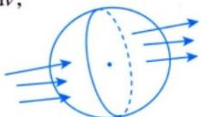

原文页码：47；bbox：`[552, 708, 685, 763]`

## 图 51

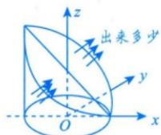

原文页码：52；bbox：`[702, 525, 823, 596]`

**图注：** 进入多少

## 图 52

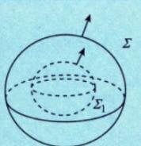

原文页码：53；bbox：`[678, 131, 786, 210]`

**图注：** 图 18-24

## 图 53

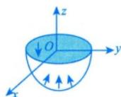

原文页码：53；bbox：`[682, 585, 784, 643]`

## 图 54

原文页码：54；bbox：`[697, 683, 811, 751]`

**图注：** 图 18-26

## 图 55

原文页码：63；bbox：`[581, 127, 798, 221]`

## 图 56

原文页码：63；bbox：`[726, 456, 836, 551]`

## 图 57

原文页码：64；bbox：`[517, 140, 830, 222]`

## 图 58

原文页码：65；bbox：`[203, 171, 228, 191]`

## 图 59

原文页码：65；bbox：`[547, 130, 620, 183]`

## 图 60

原文页码：65；bbox：`[625, 193, 838, 303]`

**图注：** 图18-12

## 图 61

原文页码：66；bbox：`[650, 303, 794, 385]`

## 图 62

原文页码：67；bbox：`[608, 203, 831, 309]`

**图注：** 图18-15

## 图 63

原文页码：69；bbox：`[673, 325, 806, 432]`

**图注：** 图 18-23

## 图 64

原文页码：74；bbox：`[196, 219, 225, 239]`

## 图 65

原文页码：74；bbox：`[663, 286, 823, 393]`

**图注：** 图18-25

## 图 66

原文页码：74；bbox：`[433, 649, 534, 700]`

## 图 67

原文页码：74；bbox：`[347, 706, 448, 747]`

## 图 68

原文页码：76；bbox：`[346, 297, 541, 386]`

**图注：** 图 18-27
