# 第十四讲  二重积分.docx

## 第十四讲 二重积分

## 知识点：

## 二重积分的中值定理：

性质 7(二重积分的中值定理) 设函数 $f(x, y)$ 在有界闭区域 D 上连续，A 为 D 的面积，则在 D 上至少存在一点 $(\xi, \eta)$ ，使得

$$
\iint_ {D} f (x, y) \mathrm{d} \sigma = f (\xi , \eta) A. \quad \int_ {a} ^ {b} f (x) \mathrm{d} x = f (\xi) (b - a), \xi \in (a, b)
$$

## 椭圆中的积分：

积分公式 1:

椭圆

$$
\frac {x ^ {2}}{a ^ {2}} + \frac {y ^ {2}}{b ^ {2}} \leq 1
$$

上有公式：

$$
\iint_ {D} x ^ {2} d x d y = \frac {\pi a ^ {3} b}{4}, \quad \iint_ {D} y ^ {2} d x d y = \frac {\pi a b ^ {3}}{4}
$$

所以

$$
I = \iint_ {D} \left(1 - x ^ {2} - \frac {1}{2} y ^ {2}\right) d x d y = \pi a b \left(1 - \frac {a ^ {2}}{4} - \frac {b ^ {2}}{8}\right)
$$

这个公式的本质是：把椭圆区域通过伸缩变成单位圆，然后利用单位圆上的对称积分公式。

你图里的区域是椭圆：

$$
D: \frac {x ^ {2}}{a ^ {2}} + \frac {y ^ {2}}{b ^ {2}} \leq 1
$$

其中 $a$ 是 $x$ 方向半轴长， $b$ 是 $y$ 方向半轴长。

## 1. 先看面积公式

椭圆面积是：

$$
S _ {D} = \pi a b
$$

所以：

$$
\iint_ {D} 1 d x d y = \pi a b
$$

这就是后面公式里第一项的来源。

## 2. 为什么有

$$
\iint_ {D} x ^ {2} d x d y = \frac {\pi a ^ {3} b}{4}
$$

用椭圆换元：

$$
x = a u, \quad y = b v
$$

那么椭圆

$$
\frac {x ^ {2}}{a ^ {2}} + \frac {y ^ {2}}{b ^ {2}} \leq 1
$$

就变成单位圆：

$$
u ^ {2} + v ^ {2} \leq 1
$$

面积微元变为：

$$
d x d y = a b d u d v
$$

而

$$
x ^ {2} = a ^ {2} u ^ {2}
$$

所以:

$$
\begin{array}{r l} \iint_ {D} x ^ {2} d x d y & = \iint_ {u ^ {2} + v ^ {2} \leq 1} a ^ {2} u ^ {2} \cdot a b d u d v \\ & = a ^ {3} b \iint_ {u ^ {2} + v ^ {2} \leq 1} u ^ {2} d u d v \end{array}
$$

单位圆上有经典结论：

$$
\iint_ {u ^ {2} + v ^ {2} \leq 1} u ^ {2} d u d v = \frac {\pi}{4}
$$

因此：

$$
\iint_ {D} x ^ {2} d x d y = \frac {\pi a ^ {3} b}{4}
$$

同理：

$$
\iint_ {D} y ^ {2} d x d y = \frac {\pi a b ^ {3}}{4}
$$

## 3. 单位圆上为什么是 $\frac{\pi}{4}$ ?

在单位圆中，用极坐标：

$$
u = r \cos \theta , \quad v = r \sin \theta
$$

$$
d u d v = r d r d \theta
$$

所以：

$$
\begin{array}{r l} & {\iint_ {u ^ {2} + v ^ {2} \leq 1} u ^ {2} d u d v = \int_ {0} ^ {2 \pi} \int_ {0} ^ {1} r ^ {2} \cos^ {2} \theta \cdot r d r d \theta} \\ & {\qquad = \left(\int_ {0} ^ {1} r ^ {3} d r\right) \left(\int_ {0} ^ {2 \pi} \cos^ {2} \theta d \theta\right)} \\ & {\qquad = \frac {1}{4} \cdot \pi = \frac {\pi}{4}} \end{array}
$$

所以公式不是背出来的，本质就是：椭圆伸缩成单位圆后，单位圆上 $u^2$ 、 $v^{2}$ 的积分都等于 $\frac{\pi}{4}$ 。

## 积分公式 2:

这个公式是:

$$
\int_ {0} ^ {2 \pi} \frac {d \theta}{a \cos^ {2} \theta + b \sin^ {2} \theta} = \frac {2 \pi}{\sqrt {a b}}
$$

前提是：

$$
a > 0, \quad b > 0
$$

否则分母可能为 0 或变号，公式不能直接用。

## 1. 这个公式在干什么？

它经常出现在极坐标换元后的椭圆区域积分里。

比如你刚才那题中出现了：

$$
2 \cos^ {2} \theta + 3 \sin^ {2} \theta
$$

所以对应：

$$
a = 2, \quad b = 3
$$

于是：

$$
\int_ {0} ^ {2 \pi} \frac {d \theta}{2 \cos^ {2} \theta + 3 \sin^ {2} \theta} = \frac {2 \pi}{\sqrt {2 \cdot 3}} = \frac {2 \pi}{\sqrt {6}} = \frac {\pi \sqrt {6}}{3}
$$

## 2. 为什么这个公式成立？

我们完整推一遍。

设

$$
I = \int_ {0} ^ {2 \pi} \frac {d \theta}{a \cos^ {2} \theta + b \sin^ {2} \theta}
$$

因为

$$
\cos^ {2} \theta , \sin^ {2} \theta
$$

都以 $\pi$ 为周期，而且关于四个象限对称，所以：

$$
I = 4 \int_ {0} ^ {\frac {\pi}{2}} \frac {d \theta}{a \cos^ {2} \theta + b \sin^ {2} \theta}
$$

现在只算第一象限：

$$
I _ {1} = \int_ {0} ^ {\frac {\pi}{2}} \frac {d \theta}{a \cos^ {2} \theta + b \sin^ {2} \theta}
$$

令

$$
u = \tan \theta
$$

则

$$
\sin^ {2} \theta = \frac {u ^ {2}}{1 + u ^ {2}}, \quad \cos^ {2} \theta = \frac {1}{1 + u ^ {2}}
$$

## 第一步：利用周期性，先得到2倍

因为

$$
\cos^ {2} (\theta + \pi) = \cos^ {2} \theta , \quad \sin^ {2} (\theta + \pi) = \sin^ {2} \theta ,
$$

所以

$$
f (\theta + \pi) = f (\theta).
$$

也就是说， $f(\theta)$ 的周期是 $\pi$ 。因此：

$$
\int_ {0} ^ {2 \pi} f (\theta) d \theta = \int_ {0} ^ {\pi} f (\theta) d \theta + \int_ {\pi} ^ {2 \pi} f (\theta) d \theta .
$$

后面一段与前面一段完全相同，所以

$$
\int_ {0} ^ {2 \pi} f (\theta) d \theta = 2 \int_ {0} ^ {\pi} f (\theta) d \theta .
$$

到这里，只能得到2倍。

## 第二步：利用关于 $\frac{\pi}{2}$ 的对称性，再得到2倍

把0到 $\pi$ 分为两段：

$$
\int_ {0} ^ {\pi} f (\theta) d \theta = \int_ {0} ^ {\pi / 2} f (\theta) d \theta + \int_ {\pi / 2} ^ {\pi} f (\theta) d \theta .
$$

观察第二象限。对于 $\theta \in [\frac{\pi}{2},\pi ]$ ，令

$$
u = \pi - \theta .
$$

那么

$$
\cos (\pi - u) = - \cos u, \quad \sin (\pi - u) = \sin u.
$$

平方以后，负号消失：

$$
\cos^ {2} (\pi - u) = \cos^ {2} u, \quad \sin^ {2} (\pi - u) = \sin^ {2} u.
$$

因此

$$
f (\pi - u) = f (u).
$$

于是第二象限的积分等于第一象限：

$$
\int_ {\pi / 2} ^ {\pi} f (\theta) d \theta = \int_ {0} ^ {\pi / 2} f (u) d u.
$$

所以

$$
\int_ {0} ^ {\pi} f (\theta) d \theta = 2 \int_ {0} ^ {\pi / 2} f (\theta) d \theta .
$$

结合第一步：

$$
\boxed {\int_ {0} ^ {2 \pi} f (\theta) d \theta = 4 \int_ {0} ^ {\pi / 2} f (\theta) d \theta .}
$$

## 直接理解：四个象限的积分完全相同

四个象限分别是：

$$
\left[ 0, \frac {\pi}{2} \right], \quad \left[ \frac {\pi}{2}, \pi \right], \quad \left[ \pi , \frac {3 \pi}{2} \right], \quad \left[ \frac {3 \pi}{2}, 2 \pi \right].
$$

虽然不同象限里 $\sin \theta, \cos \theta$ 的正负不同，但被积函数里只有

$$
\sin^ {2} \theta , \qquad \cos^ {2} \theta ,
$$

平方以后正负号都消失。因此四个象限中函数图像的形状完全一样，每个象限下的面积也一样。所以：

$$
\text {整个} 0 \sim 2 \pi \text {的积分} = 4 \times \text {第一象限的积分}.
$$

最准确的逻辑是：

$$
\text {周期为} \pi \Rightarrow \times 2, \quad \text {关于} \frac {\pi}{2} \text {对称} \Rightarrow \text {再} \times 2
$$

最终才是4倍。

并且

$$
d \theta = \frac {d u}{1 + u ^ {2}}
$$

当

$$
\theta : 0 \to \frac {\pi}{2}
$$

时，

$$
u: 0 \to + \infty
$$

代入分母:

$$
a \cos^ {2} \theta + b \sin^ {2} \theta = a \cdot \frac {1}{1 + u ^ {2}} + b \cdot \frac {u ^ {2}}{1 + u ^ {2}} = \frac {a + b u ^ {2}}{1 + u ^ {2}}
$$

所以：

$$
I _ {1} = \int_ {0} ^ {\infty} \frac {1}{\frac {a + b u ^ {2}}{1 + u ^ {2}}} \cdot \frac {d u}{1 + u ^ {2}}
$$

前面的倒数是：

$$
\frac {1 + u ^ {2}}{a + b u ^ {2}}
$$

所以：

$$
I _ {1} = \int_ {0} ^ {\infty} \frac {1 + u ^ {2}}{a + b u ^ {2}} \cdot \frac {d u}{1 + u ^ {2}} = \int_ {0} ^ {\infty} \frac {d u}{a + b u ^ {2}}
$$

这一步非常关键：

$(1 + u^{2})$ 正好被 $d\theta$ 中的 $(1 + u^{2})$ 抵消。

## 3. 计算剩下的一元积分

现在只需要算：

$$
\int_ {0} ^ {\infty} \frac {d u}{a + b u ^ {2}}
$$

把 $a$ 提出来：

$$
a + b u ^ {2} = a \left(1 + \frac {b}{a} u ^ {2}\right)
$$

所以：

$$
\int_ {0} ^ {\infty} \frac {d u}{a + b u ^ {2}} = \frac {1}{a} \int_ {0} ^ {\infty} \frac {d u}{1 + \frac {b}{a} u ^ {2}}
$$

令

$$
v = u \sqrt {\frac {b}{a}}
$$

则

$$
d u = \sqrt {\frac {a}{b}} d v
$$

于是：

$$
\frac {1}{a} \int_ {0} ^ {\infty} \frac {d u}{1 + \frac {b}{a} u ^ {2}} = \frac {1}{a} \sqrt {\frac {a}{b}} \int_ {0} ^ {\infty} \frac {d v}{1 + v ^ {2}}
$$

而

$$
\int_ {0} ^ {\infty} \frac {d v}{1 + v ^ {2}} = \frac {\pi}{2}
$$

所以:

$$
I _ {1} = \frac {1}{a} \sqrt {\frac {a}{b}} \cdot \frac {\pi}{2} = \frac {\pi}{2 \sqrt {a b}}
$$

因此：

$$
I = 4 I _ {1} = 4 \cdot \frac {\pi}{2 \sqrt {a b}} = \frac {2 \pi}{\sqrt {a b}}
$$

结论

$$
\boxed {\int_ {0} ^ {2 \pi} \frac {d \theta}{a \cos^ {2} \theta + b \sin^ {2} \theta} = \frac {2 \pi}{\sqrt {a b}}}
$$

其中：

$$
a > 0, b > 0
$$

注意点:

$$
\cos^ {2} \theta , \sin^ {2} \theta
$$

“都以 $\pi$ 为周期，而且关于四个象限对称”。

这句话不是说 $\cos^2\theta$ 和 $\sin^2\theta$ 在第一象限里面互相对称，而是说：

对于四个象限中对应的角， $\cos \theta, \sin \theta$ 的符号可能变，但平方以后符号消失，所以分母的值一样。

## 1. 先设这个被积函数

令

$$
g (\theta) = \frac {1}{a \cos^ {2} \theta + b \sin^ {2} \theta}
$$

我们要证明：

$$
\int_ {0} ^ {2 \pi} g (\theta) d \theta = 4 \int_ {0} ^ {\frac {\pi}{2}} g (\theta) d \theta
$$

也就是：

$$
\int_ {0} ^ {2 \pi} \frac {d \theta}{a \cos^ {2} \theta + b \sin^ {2} \theta} = 4 \int_ {0} ^ {\frac {\pi}{2}} \frac {d \theta}{a \cos^ {2} \theta + b \sin^ {2} \theta}
$$

这一步就是“利用四个象限对称”。

## 2. 什么叫“四个象限对应角”？

第一象限取一个角：

$$
\theta \in \left[ 0, \frac {\pi}{2} \right]
$$

那么它在四个象限中的对应角可以写成：

$$
\theta , \quad \pi - \theta , \quad \pi + \theta , \quad 2 \pi - \theta
$$

画在单位圆上，它们关于坐标轴对称。

它们的三角函数是：

$$
\begin{array}{c c} \cos (\theta) = \cos \theta , & \sin (\theta) = \sin \theta \\ \cos (\pi - \theta) = - \cos \theta , & \sin (\pi - \theta) = \sin \theta \\ \cos (\pi + \theta) = - \cos \theta , & \sin (\pi + \theta) = - \sin \theta \\ \cos (2 \pi - \theta) = \cos \theta , & \sin (2 \pi - \theta) = - \sin \theta \end{array}
$$

但是一平方以后：

$$
\cos^ {2} (\pi - \theta) = \cos^ {2} \theta
$$

$$
\sin^ {2} (\pi - \theta) = \sin^ {2} \theta
$$

$$
\cos^ {2} (\pi + \theta) = \cos^ {2} \theta
$$

$$
\sin^ {2} (\pi + \theta) = \sin^ {2} \theta
$$

$$
\cos^ {2} (2 \pi - \theta) = \cos^ {2} \theta
$$

$$
\sin^ {2} (2 \pi - \theta) = \sin^ {2} \theta
$$

所以：

$$
g (\theta) = g (\pi - \theta) = g (\pi + \theta) = g (2 \pi - \theta)
$$

这就是四个象限对称的本质。

## 10. 二重积分里也是同一个本质

二重积分里，对称换元的本质是：

$$
\iint_ {D ^ {\prime}} f (x, y) d x d y = \iint_ {D} f (T (u, v)) | J | d u d v
$$

其中 $T$ 是对称变换， $|J|$ 是雅可比行列式绝对值。

比如关于 $y$ 轴对称：

$$
T (u, v) = (- u, v)
$$

雅可比行列式：

$$
J = \left| \begin{array}{c c} - 1 & 0 \\ 0 & 1 \end{array} \right| = - 1
$$

所以：

$$
| J | = 1
$$

面积不变。

如果：

$$
f (- x, y) = f (x, y)
$$

那么左右两边积分相等。

如果：

$$
f (- x, y) = - f (x, y)
$$

那么左右两边积分相反，整个对称区域上的积分为0。

详细证明：

https://chatgpt.com/s/t\_6a1d122160c48191aeb4da6a571260c8

https://chatgpt.com/s/t\_6a1d156d8aa4819191254134c205783e

椭圆区域二重积分：

https://chatgpt.com/g/g-p-6a1d505226e08191a7f47eb8e9418ffe-gao-shu-ocr/c/6a55f304-35b4-83ee-9dcd-6f8b8869bd4f

积分：

对称性：

一元函数中：

## 区间反射对称：

## 2. 区间反射对称: $x \mapsto a + b - x$

这是考研非常常用但容易被忽略的一类。

若

$$
I = \int_ {a} ^ {b} f (x) d x
$$

令

$$
x = a + b - t
$$

则

$$
\boxed {\int_ {a} ^ {b} f (x) d x = \int_ {a} ^ {b} f (a + b - x) d x}
$$

所以可以得到平均公式:

$$
\boxed {\int_ {a} ^ {b} f (x) d x = \frac {1}{2} \int_ {a} ^ {b} [ f (x) + f (a + b - x) ] d x}
$$

这叫“区间端点对称”。

## 常见特殊形式

在 $[0, a]$ 上:

$$
\boxed {\int_ {0} ^ {a} f (x) d x = \int_ {0} ^ {a} f (a - x) d x}
$$

在 $[0, \pi]$ 上：

$$
\boxed {\int_ {0} ^ {\pi} f (\sin x) d x = 2 \int_ {0} ^ {\frac {\pi}{2}} f (\sin x) d x}
$$

因为

$$
\sin (\pi - x) = \sin x
$$

## 七、一个非常重要的推广公式

设

$$
f (a + b - x) = f (x),
$$

即 $f$ 关于区间中点对称。计算

$$
I = \int_ {a} ^ {b} x f (x) d x.
$$

作反射变换：

$$
I = \int_ {a} ^ {b} (a + b - x) f (a + b - x) d x.
$$

由于

$$
f (a + b - x) = f (x),
$$

所以

$$
I = \int_ {a} ^ {b} (a + b - x) f (x) d x.
$$

与原式相加：

$$
2 I = \int_ {a} ^ {b} [ a + b ] f (x) d x.
$$

于是

$$
\boxed {\int_ {a} ^ {b} x f (x) d x = \frac {a + b}{2} \int_ {a} ^ {b} f (x) d x.}
$$

含义是：

如果 $f(x)$ 关于区间中点对称，那么在积分意义下， $x$ 可以被中点 $\frac{a + b}{2}$ 替代。

这类公式在定积分证明题和二重积分中也很常见。

## 三角函数对称：

## 3. 三角函数对称

考研中很常见，尤其是定积分、二重积分极坐标、傅里叶级数。

## $[0, \pi]$ 上的正弦对称

$$
\sin (\pi - x) = \sin x
$$

所以

$$
\boxed {\int_ {0} ^ {\pi} f (\sin x) d x = 2 \int_ {0} ^ {\frac {\pi}{2}} f (\sin x) d x}
$$

例如：

$$
\int_ {0} ^ {\pi} \sqrt {\sin x} d x = 2 \int_ {0} ^ {\frac {\pi}{2}} \sqrt {\sin x} d x
$$

## $[0, \pi]$ 上的余弦反对称

$$
\cos (\pi - x) = - \cos x
$$

所以如果 $f$ 是奇函数：

$$
f (\cos (\pi - x)) = f (- \cos x) = - f (\cos x)
$$

因此

$$
\boxed {\int_ {0} ^ {\pi} f (\cos x) d x = 0 \quad \text {当} f \text {为奇函数}}
$$

例如：

$$
\int_ {0} ^ {\pi} \cos^ {3} x d x = 0
$$

$[0, 2\pi]$ 上的周期对称

若

$$
f (x + \pi) = f (x)
$$

则

$$
\boxed {\int_ {0} ^ {2 \pi} f (x) d x = 2 \int_ {0} ^ {\pi} f (x) d x}
$$

若进一步在 $[0, \pi]$ 内关于 $\frac{\pi}{2}$ 对称，则

$$
\boxed {\int_ {0} ^ {2 \pi} f (x) d x = 4 \int_ {0} ^ {\frac {\pi}{2}} f (x) d x}
$$

## 二元函数中：

## 二、二重积分中的对称

二重积分是考研数学一里最爱考对称性的地方。

基本形式:

$$
\iint_ {D} f (x, y) d \sigma
$$

核心判断：

$D$ 是否关于某条线或某个点对称？

然后看：

$f(x,y)$ 在对应变换下是否变号或不变？

## 关于 x 轴对称:

1. 关于 $x$ 轴对称

区域满足：

$$
(x, y) \in D \Rightarrow (x, - y) \in D
$$

若

$$
f (x, - y) = f (x, y)
$$

则

$$
\boxed {\iint_ {D} f (x, y) d \sigma = 2 \iint_ {D _ {+}} f (x, y) d \sigma}
$$

其中 $D_{+}$ 是上半部分。

若

$$
f (x, - y) = - f (x, y)
$$

则

$$
\boxed {\iint_ {D} f (x, y) d \sigma = 0}
$$

典型：

$$
\iint_ {D} y e ^ {x ^ {2}} d \sigma = 0
$$

只要 $D$ 关于 $x$ 轴对称。

关于 $x = a$ 对称：

$$
\text { 如 } \iint_ {D} (x - a) \mathrm{d} \sigma = 0, \text { 因 } f (x, y) = x - a, \text { 而 } f (2 a - x, y) = a - x.
$$

【注】若D关于 $x=a(a\neq0)$ 对称，则

$$
\iint_ {D} f (x, y) \mathrm{d} \sigma = \left\{ \begin{array}{l l} 2 \iint_ {D} f (x, y) \mathrm{d} \sigma , & f (x, y) = f (2 a - x, y), \\ 0, & f (x, y) = - f (2 a - x, y), \end{array} \right.
$$

其中 $D_{1}$ 是 $D$ 在 $x = a$ 右侧的部分.

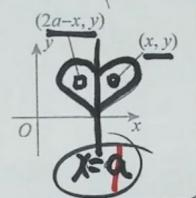

$$
\iint_ {D} (x - a) d \sigma = 0
$$

$$
\iint_ {D} x d \sigma = P
$$

$$
2 a - x - a = a - x
$$

续更新去公众号[无机研]久联系微信 4550060

$$
= \left\{ \begin{array}{l l} (x - a + a) d \sigma \\ \sqrt {\iint_ {b} (x - a) d \sigma} + \sqrt {\iint_ {b} a d \sigma} \end{array} \right.
$$

## 关于 y 轴对称:

## 2. 关于 $y$ 轴对称

区域满足：

$$
(x, y) \in D \Rightarrow (- x, y) \in D
$$

若

$$
f (- x, y) = f (x, y)
$$

则可以乘2。

若

$$
f (- x, y) = - f (x, y)
$$

则积分为 0。

典型：

$$
\iint_ {D} x \cos y d \sigma = 0
$$

只要 $D$ 关于 $y$ 轴对称。

## 关于 y=a 对称:

注 若 $D$ 关于 $y = a (a \neq 0)$ 对称， $(x, y)$ 关于 $y = a$ 的对称点为 $(x, 2a - y)$ ，则

$$
\iint_ {D} f (x, y) \mathrm{d} \sigma = \left\{ \begin{array}{l l} 2 \iint_ {D _ {1}} f (x, y) \mathrm{d} \sigma , & f (x, y) = f (x, 2 a - y), \\ 0, & f (x, y) = - f (x, 2 a - y), \end{array} \right.
$$

其中 $D_{1}$ 是D在y=a上侧的部分.

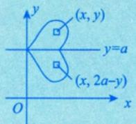

## 关于原点对称：

## 3. 关于原点对称

区域满足：

$$
(x, y) \in D \Rightarrow (- x, - y) \in D
$$

若

$$
f (- x, - y) = f (x, y)
$$

则偶对称，可以化为半区域的两倍。

若

$$
f (- x, - y) = - f (x, y)
$$

则

$$
\boxed {\iint_ {D} f (x, y) d \sigma = 0}
$$

典型：

$$
\iint_ {D} (x + y) d \sigma = 0
$$

只要 $D$ 关于原点对称。

因为

$$
f (- x, - y) = - x - y = - (x + y)
$$

关于直线 $y = x$ 对称：

4. 关于直线 $y = x$ 对称

区域满足：

$$
(x, y) \in D \Rightarrow (y, x) \in D
$$

则有：

$$
\boxed {\iint_ {D} f (x, y) d \sigma = \iint_ {D} f (y, x) d \sigma}
$$

所以可以推出：

$$
\boxed {\iint_ {D} x d \sigma = \iint_ {D} y d \sigma}
$$

$$
\boxed {\iint_ {D} x ^ {2} d \sigma = \iint_ {D} y ^ {2} d \sigma}
$$

$$
\boxed {\iint_ {D} (x - y) d \sigma = 0}
$$

更一般地，若

$$
f (y, x) = - f (x, y)
$$

则

$$
\boxed {\iint_ {D} f (x, y) d \sigma = 0}
$$

The Ground Truth image displays a single, solid horizontal line. According to Rule 2 (UNDERSCORE & LINE RULES), if the GT contains lines used for stylistic emphasis or as background elements (like ruled paper), the OCR result must ignore them. The provided OCR content is "\_\_\_\_", which consists of four underscores. This is incorrect because underscores are not equivalent to a solid line and are not permitted under the “Stylistic/Background Lines (Ignore)” rule. Outputting underscores for a stylistic line violates the rule and constitutes an error. Therefore, the OCR result is inconsistent with the Ground Truth.

典型：

$$
\iint_ {D} \frac {x - y}{1 + x ^ {2} + y ^ {2}} d \sigma = 0
$$

只要 D 关于 y = x 对称。

关于直线 y=-x 对称：

## 5. 关于直线 $y = -x$ 对称

区域满足：

$$
(x, y) \in D \Rightarrow (- y, - x) \in D
$$

常用结论：

$$
\boxed {\iint_ {D} f (x, y) d \sigma = \iint_ {D} f (- y, - x) d \sigma}
$$

例子

设

$$
D = \{(x, y) \mid | x | + | y | \leq 1, x \geq - y \}
$$

$$
I = \iint_ {D} (x ^ {2} + y ^ {2}) d \sigma .
$$

计算

即一个中心在原点的菱形（正方形旋转 $45^{\circ}$ ），并取它在直线 $y = -x$ 一侧的部分。

## 对称性分析

\- 直线 $y = -x$ 将全菱形分成两块： $D_{1} = D$ （我们选的区域）， $D_{2}$ （另一半）。

\- 映射 $T: (x, y) \to (-y, -x)$ 就是关于 $y = -x$ 的反射，它会将 $D_{1}$ 映成 $D_{2}$ ，且互逆。

已知结论（从你给的公式推广）：

$$
\iint_ {D _ {1}} f (x, y) d \sigma = \iint_ {D _ {2}} f (- y, - x) d \sigma .
$$

令 $f(x,y) = x^{2} + y^{2}$ ，则

$$
f (- y, - x) = (- y) ^ {2} + (- x) ^ {2} = y ^ {2} + x ^ {2} = f (x, y).
$$

所以 $f$ 在反射下不变。

于是

$$
\iint_ {D _ {1}} f d \sigma = \iint_ {D _ {2}} f d \sigma .
$$

因此，全菱形 $R = D_{1} \cup D_{2}$ 上：

$$
\iint_ {R} f d \sigma = 2 I.
$$

## 计算全菱形上的积分（容易算）

菱形 $|x| + |y| \leq 1$ 的面积为2（边长 $\sqrt{2}$ 的正方形面积 $= 2$ ）。

利用对称性（关于 $x$ 轴、 $y$ 轴都对称）：

$$
\iint_ {R} x ^ {2} d \sigma = \iint_ {R} y ^ {2} d \sigma
$$

且

$$
\iint_ {R} \left(x ^ {2} + y ^ {2}\right) d \sigma = 2 \iint_ {R} x ^ {2} d \sigma .
$$

先求 $\iint_{R} x^{2} d\sigma$ 。

用截面法: 固定 $x \in [-1, 1]$ , $|y| \leq 1 - |x|$ , 所以

$$
\int_ {y = - (1 - | x |)} ^ {1 - | x |} x ^ {2} d y = x ^ {2} \cdot 2 (1 - | x |).
$$

积分：

$$
\iint_ {R} x ^ {2} d \sigma = \int_ {- 1} ^ {1} 2 x ^ {2} (1 - | x |) d x = 4 \int_ {0} ^ {1} x ^ {2} (1 - x) d x
$$

$$
= 4 \left[ \frac {x ^ {3}}{3} - \frac {x ^ {4}}{4} \right] _ {0} ^ {1} = 4 \left(\frac {1}{3} - \frac {1}{4}\right) = 4 \cdot \frac {1}{1 2} = \frac {1}{3}.
$$

因此

$$
\iint_ {R} \left(x ^ {2} + y ^ {2}\right) d \sigma = 2 \cdot \frac {1}{3} = \frac {2}{3}.
$$

回到 $I$

$$
2 I = \frac {2}{3} \quad \Rightarrow \quad I = \frac {1}{3}.
$$

关于象限对称：

## 6. 四象限对称

若区域 $D$ 关于 $x$ 轴和 $y$ 轴都对称, 例如圆盘、椭圆、矩形:

$$
D: \frac {x ^ {2}}{a ^ {2}} + \frac {y ^ {2}}{b ^ {2}} \leq 1
$$

如果被积函数满足：

$$
f (- x, y) = f (x, y), \quad f (x, - y) = f (x, y)
$$

也就是对 $x, y$ 都是偶函数，则

$$
\boxed {\iint_ {D} f (x, y) d \sigma = 4 \iint_ {D _ {1}} f (x, y) d \sigma}
$$

其中 $D_{1}$ 是第一象限部分。

典型：

$$
\iint_ {D} \left(x ^ {2} + y ^ {2}\right) d \sigma = 4 \iint_ {D _ {1}} \left(x ^ {2} + y ^ {2}\right) d \sigma
$$

如果含有单独的 $x$ 或 $y$ ，往往为0。

例如：

$$
\iint_ {D} x y d \sigma = 0
$$

因为 $xy$ 关于 $x$ 轴或 $y$ 轴都会变号。

关于旋转对称：

## 7. 圆域、圆环、扇形中的旋转对称

如果区域是圆盘：

$$
D: x ^ {2} + y ^ {2} \leq R ^ {2}
$$

则经常有：

$$
\boxed {\iint_ {D} x ^ {2} d \sigma = \iint_ {D} y ^ {2} d \sigma}
$$

又因为：

$$
x ^ {2} + y ^ {2} = r ^ {2}
$$

所以

$$
\boxed {\iint_ {D} x ^ {2} d \sigma = \iint_ {D} y ^ {2} d \sigma = \frac {1}{2} \iint_ {D} (x ^ {2} + y ^ {2}) d \sigma}
$$

这是考研里非常好用的结论。

类似地:

$$
\boxed {\iint_ {D} x y d \sigma = 0}
$$

因为圆域关于坐标轴对称。

## 极坐标中的对称：

## 8. 极坐标中的角度对称

二重积分化极坐标后：

$$
x = r \cos \theta , \quad y = r \sin \theta
$$

如果被积函数只含：

$$
\sin^ {2} \theta , \quad \cos^ {2} \theta
$$

通常可以用四象限对称。

例如：

$$
\int_ {0} ^ {2 \pi} \frac {d \theta}{a \cos^ {2} \theta + b \sin^ {2} \theta} = 4 \int_ {0} ^ {\frac {\pi}{2}} \frac {d \theta}{a \cos^ {2} \theta + b \sin^ {2} \theta}
$$

如果含 $\sin \theta$ 、 $\cos \theta$ 、 $\sin \theta \cos \theta$ ，就要判断是否变号。

常见结论：

$$
\boxed {\int_ {0} ^ {2 \pi} \cos \theta d \theta = 0}
$$

$$
\boxed {\int_ {0} ^ {2 \pi} \sin \theta d \theta = 0}
$$

$$
\boxed {\int_ {0} ^ {2 \pi} \sin \theta \cos \theta d \theta = 0}
$$

$$
\boxed {\int_ {0} ^ {2 \pi} \cos^ {2} \theta d \theta = \int_ {0} ^ {2 \pi} \sin^ {2} \theta d \theta = \pi}
$$

关于对称性的详细讲解（\*\*\*）：

重点中的重点

数一中所有关于对称性的点

https://chatgpt.com/share/6a1d1bdb-3824-83ea-b7c9-22b86b761e1c

轮转对称性：

(2) 轮换对称性（一定是直角坐标系下）.

引例1

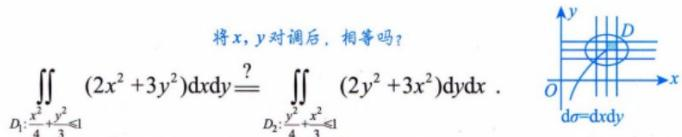

解 因为上述两个积分只是将 x 与 y 这两个字母对调了，而积分值与用什么字母表示是无关的，故它们是相等的.
相当于字母x变y. 字母y变x

引例2

$$
\iint_ {D: \frac {x ^ {2}}{4} + \frac {y ^ {2}}{4} \leqslant 1} (2 x ^ {2} + 3 y ^ {2}) \mathrm{d} x \mathrm{d} y \stackrel {?} {=} \iint_ {D: \frac {x ^ {2}}{4} + \frac {y ^ {2}}{4} \leqslant 1} (2 y ^ {2} + 3 x ^ {2}) \mathrm{d} y \mathrm{d} x.
$$

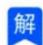

解 理由如上，它们也是相等的.

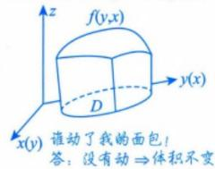

引例2中的区域 $D$ 有个特点，就是当你把 $x$ 与 $y$ 对调后，区域 $D$ 不变（事实上，区域 $D$ 关于 $y = x$ 对称）.于是抽象化写出的式子为

$$
\iint_ {D} f (x, y) \mathrm{d} x \mathrm{d} y = \iint_ {D} f (y, x) \mathrm{d} y \mathrm{d} x.
$$

整理一下，我们可以这样来描述：

在直角坐标系下，若把 $x$ 与 $y$ 对调后，区域 $D$ 不变（或区域 $D$ 关于 $y = x$ 对称），则

$$
\iint_ {D} f (x, y) \mathrm{d} \sigma = \iint_ {D} f (y, x) \mathrm{d} \sigma , \longrightarrow \mathrm{d} \sigma = \mathrm{d} x \mathrm{d} y = \mathrm{d} y \mathrm{d} x
$$

这就是轮换对称性.

轮换对称性的应用： $\iint_{D}f(x,y)\mathrm{d}\sigma \left(\iint_{D}f(y,x)\mathrm{d}\sigma\right)$ 难计算，但 $f(x,y) + f(y,x)$ 之和式子简单，如注(1).

例如：当 $D = \{(x,y)|x^2 +y^2\leqslant 1,x > 0,y > 0\}$ 时，

$$
\begin{array}{r l}&{\iint_ {D} \frac {a \sqrt {f (x)} + b \sqrt {f (y)}}{\sqrt {f (x)} + \sqrt {f (y)}} \mathrm{d} \sigma}\\&{= \iint_ {D} \frac {a \sqrt {f (y)} + b \sqrt {f (x)}}{\sqrt {f (y)} + \sqrt {f (x)}} \mathrm{d} \sigma}\\&{= \frac {1}{2} \iint_ {D} (a + b) \mathrm{d} \sigma}\\&{= \frac {a + b}{2} \cdot \frac {1}{4} \cdot \pi \cdot 1 ^ {2}.}\\&{\rightarrow \frac {1}{4} \text {个圆的面积}}\end{array}
$$

普通对称性 $\left\{\begin{aligned}&① D 关于 y=x 对称;\\ &② f(x,y)=f(y,x)或f(x,y)=-f(y,x).\end{aligned}\right.$ 轮换对称性 $\left\{\begin{aligned}&① D 关于 y=x 对称;\\ &② 利用 f(x,y)+f(y,x) 简化计算.\end{aligned}\right.$

注 (1) 在直角坐标系中，若 $f(x, y) + f(y, x) = a$ ，则 $(> )$

$$
I = \frac {1}{2} \iint_ {D} [ f (x, y) + f (y, x) ] \mathrm{d} x \mathrm{d} y = \frac {1}{2} \iint_ {D} a \mathrm{d} x \mathrm{d} y = \frac {a}{2} S _ {D}.
$$

(2) 要注意区分普通对称性中的④与这里轮换对称性的区别与联系. 虽然它们都是 $D$ 关于 $y = x$ 对称, 但普通对称性考查的是 $f(x, y)$ 与 $f(y, x)$ 是相等还是相反, 轮换对称性考查的是 $f(x, y) + f(y, x)$ 是否简单. 事实上, 当 $f(x, y) = -f(y, x)$ 时, 它们是一回事.

## 二重积分的计算：

## 1 直角坐标系下的计算方法

直角坐标系用平行于坐标系的线切割.

$\frac{\mathrm{d}\sigma = \mathrm{d}x\mathrm{d}y}{\text{直角坐标系下的标志}}$

问题：先对 $x$ 积分，还是对 $y$ 积分？

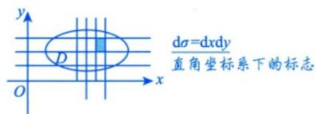

在直角坐标系下，按照积分次序的不同，一般将二重积分的计算分为两种情况，如图 14-6 所示.

后积先定限，  
限内画条线，  
先交写下限，  
后交写上限.

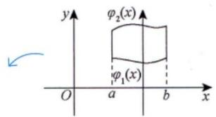  
(a)

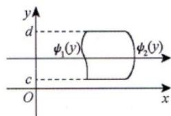  
(b)  
图14-6

先定x的上下限↓ 后积x↑ 再定y的上下限注意，这里上限≥下限 X型区域的特点是：穿过D内部且平行于y轴的直线与D的边界相交不多于两点

(1) $\iint_{D} f(x, y) \mathrm{d}\sigma = \int_{\mathcal{G}}^{b} \mathrm{d}x \int_{\varphi_1(x)}^{\varphi_2(x)} f(x, y) \mathrm{d}y$ ，其中 $D$ 为 $X$ 型区域： $\varphi_1(x) \leqslant y \leqslant \varphi_2(x)$ ， $a \leqslant x \leqslant b$ ，如图14-6(a)所示。积分区域是 $X$ 型区域的后积 $x$ ，类似还有其他几种（见批注图）。

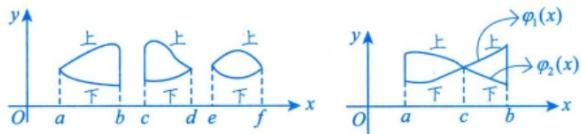

$$
\iint_ {D} f (x, y) \mathrm{d} \sigma = \int_ {a} ^ {c} \mathrm{d} x \int_ {\varphi_ {1} (x)} ^ {\varphi_ {2} (x)} f (x, y) \mathrm{d} y + \int_ {c} ^ {b} \mathrm{d} x \int_ {\varphi_ {2} (x)} ^ {\varphi_ {1} (x)} f (x, y) \mathrm{d} y
$$

先定y的上下限↑后积y↑再定x的上下限注意，这里上限≥下限Y型区域的特点是：穿过D内部且平行于x轴的直线与D的边界相交不多于两点

(2) $\iint_{D} f(x, y) \mathrm{d}\sigma = \int_{c}^{a} \mathrm{d}y \int_{\psi_{1}(y)}^{\psi_{2}(y)} f(x, y) \mathrm{d}x$ ，其中 $D$ 为 $Y$ 型区域： $\psi_{1}(y) \leqslant x \leqslant \psi_{2}(y), c \leqslant y \leqslant d$ ，如图14-6(b)所示。积分区域是 $Y$ 型区域的后积 $y$ 。

$$
\text {例如:} \int_ {a} ^ {b} \mathrm{d} x \int_ {\varphi_ {1} (x)} ^ {\varphi_ {2} (x)} f (x, y) \mathrm{d} y = - \int_ {a} ^ {b} \mathrm{d} x \int_ {\varphi_ {2} (x)} ^ {\varphi_ {1} (x)} f (x, y) \mathrm{d} y (a <   b, \varphi_ {1} (x) > \varphi_ {2} (x))
$$

注 (1) 有一点需要指出，这里的下限都必须小于等于上限。 $dx > 0$ ， $dy > 0$ ， $d\sigma > 0$

(2) 若被积函数 $f(x, y)$ 易于对 y 积分或积分区域 D 是 X 型区域，则选择先 y 后 x 的积分次序；若被积函数 $f(x, y)$ 易于对 x 积分或积分区域 D 是 Y 型区域，则选择先 x 后 y 的积分次序.

(3) 计算二重积分的关键是确定积分限，为此，要画好积分区域 D 的边界图形，当 D 的边界图形不易画出时，要写出 D 的不等式表达式，从而确定上下限。

## 图像形状:

图像 1:

2. 如果你想写的是 $Ax^2 + By^2 + Cxy = D$

这是更常见的形式。它是一个中心在原点的二次曲线，因为没有一次项 $x, y$ ，也没有平移项。

判断图形类型主要看二次型：

$$
A x ^ {2} + C x y + B y ^ {2}
$$

对应矩阵为

$$
\left( \begin{array}{c c} A & \frac {C}{2} \\ \frac {C}{2} & B \end{array} \right)
$$

也可以用判别式：

$$
\Delta = C ^ {2} - 4 A B
$$

来判断。

## 3. 图形分类口诀

对于

$$
A x ^ {2} + C x y + B y ^ {2} = D
$$

看

$$
C ^ {2} - 4 A B
$$

第一种: $C^{2} - 4 A B < 0$

一般是椭圆类。

如果 $D$ 的符号合适, 就是真椭圆; 特殊情况下可能无实图形。

例如：

$$
x ^ {2} + y ^ {2} = 1
$$

是圆。

$$
4 x ^ {2} + 9 y ^ {2} = 3 6
$$

是椭圆。

第二种： $C^2 - 4AB > 0$

一般是双曲线类。

例如：

$$
x ^ {2} - y ^ {2} = 1
$$

是双曲线。

带 $xy$ 项的双曲线会发生坐标轴旋转，比如：

$$
x y = 1
$$

也是双曲线，只不过渐近线是坐标轴。

第三种： $C^2 -4AB = 0$

一般是抛物线类或退化情形。

但你这个式子没有一次项，所以很多时候会退化成直线、点或空集，不一定是真正开口的抛物线。

例如：

$$
x ^ {2} = 1
$$

不是抛物线，而是两条直线：

$$
x = 1, \quad x = - 1
$$

## 4. 为什么 Cxy 会让图形“歪着”?

因为 $xy$ 项表示坐标轴没有选在主轴方向上。

标准椭圆、双曲线一般长这样：

$$
\frac {x ^ {2}}{a ^ {2}} + \frac {y ^ {2}}{b ^ {2}} = 1
$$

或者

$$
\frac {x ^ {2}}{a ^ {2}} - \frac {y ^ {2}}{b ^ {2}} = 1
$$

没有 $xy$ 项。

一旦出现 $xy$ ，说明图形相对于坐标轴发生了旋转。考研数学一里，这和二次型化标准形、坐标旋转、二次曲线分类有关。

## 5. 你这个式子的最简结论

如果你原式真的是:

$$
A x ^ {2} + B x ^ {2} + C x y = D
$$

那就是：

$$
(A + B) x ^ {2} + C x y = D
$$

它是一个二次曲线，一般属于双曲线型或退化二次曲线。

如果你想写的是：

$$
A x ^ {2} + B y ^ {2} + C x y = D
$$

那它是一个中心在原点的二次曲线，分类看：

$$
\boxed {C ^ {2} - 4 A B}
$$

$$
\left\{ \begin{array}{l l} C ^ {2} - 4 A B <   0 & \text {椭圆类} \\ C ^ {2} - 4 A B = 0 & \text {抛物线类或退化} \\ C ^ {2} - 4 A B > 0 & \text {双曲线类} \end{array} \right.
$$

考场上优先记这个判别式。

https://chatgpt.com/g/g-p-6a1d505226e08191a7f47eb8e9418ffe-gao-shu-ocr/c/6a59dbabc4d8-83ee-ad48-a34c20189757

坐标代换：

含 xy 项的代换:

## 二、一般含 $xy$ 项时，怎么系统消去交叉项

一般二次曲线写成:

$$
A x ^ {2} + B x y + C y ^ {2} + D x + E y + F = 0
$$

其中最麻烦的是

$$
B x y
$$

这个叫交叉项。

## 方法一：旋转坐标轴

设

$$
x = u \cos \theta - v \sin \theta
$$

$$
y = u \sin \theta + v \cos \theta
$$

代入后，选择合适的 $\theta$ ，让 $uv$ 项消失。

公式是：

$$
\tan 2 \theta = \frac {B}{A - C}
$$

这是一般消去 $xy$ 项的旋转角公式。

## 方法二：用二次型矩阵，更本质

只看二次部分：

$$
A x ^ {2} + B x y + C y ^ {2}
$$

它对应矩阵：

$$
\left( \begin{array}{c c} A & \frac {B}{2} \\ \frac {B}{2} & C \end{array} \right)
$$

因为

$$
A x ^ {2} + B x y + C y ^ {2} = \left( \begin{array}{c c} x & y \end{array} \right) \left( \begin{array}{c c} A & \frac {B}{2} \\ \frac {B}{2} & C \end{array} \right) \binom{x}{y}
$$

然后求这个对称矩阵的特征值、特征向量，用正交变换把它化成标准形。线代里“正交变换化二次型为标准形”就是这个思想；你项目资料里也有这类题型，比如“求正交变换 x = Qy，使二次型化为标准形”。

用这题演示

$$
x ^ {2} + y ^ {2} - x y
$$

对应矩阵是:

$$
A = \left( \begin{array}{c c} 1 & - \frac {1}{2} \\ - \frac {1}{2} & 1 \end{array} \right)
$$

求特征值:

$$
\left| \begin{array}{c c} 1 - \lambda & - \frac {1}{2} \\ - \frac {1}{2} & 1 - \lambda \end{array} \right| = 0
$$

$$
(1 - \lambda) ^ {2} - \frac {1}{4} = 0
$$

所以

$$
1 - \lambda = \pm \frac {1}{2}
$$

得到

$$
\lambda_ {1} = \frac {1}{2}, \quad \lambda_ {2} = \frac {3}{2}
$$

对应方向分别是:

$$
(1, 1),
$$

$$
(1, - 1)
$$

也就是：

$$
y = x, \qquad y = - x
$$

所以:

$$
x ^ {2} + y ^ {2} - x y = \frac {1}{2} u ^ {2} + \frac {3}{2} v ^ {2}
$$

这就是前面换元的本质。

含 $x + y, x - y, xy$ 的代换：

## 1. 看到 $x + y$ , x - y, xy 混合：用和差代换

常见代换：

$$
u = x + y, \qquad v = x - y
$$

或标准正交形式：

$$
u = \frac {x + y}{\sqrt {2}}, \qquad v = \frac {x - y}{\sqrt {2}}
$$

适用场景：

$$
x ^ {2} + y ^ {2} - x y, \quad x ^ {2} + y ^ {2} + x y
$$

$$
(x + y) ^ {2}, \quad (x - y) ^ {2}
$$

$$
f (x + y, x - y)
$$

$$
D: 0 <   x + y <   1, \quad 0 <   x - y <   1
$$

如果只是代数化简，常用：

$$
u = x + y, \qquad v = x - y
$$

反解：

$$
x = \frac {u + v}{2}, \qquad y = \frac {u - v}{2}
$$

注意二重积分里要带雅可比:

$$
\left| \frac {\partial (x , y)}{\partial (u , v)} \right| = \frac {1}{2}
$$

如果是画图、读轴长，建议用带 $\sqrt{2}$ 的正交变换，因为它不改变长度比例。

## 极坐标代换：

2. 看到圆、扇形、 $x^{2} + y^{2}$ ：用极坐标

$$
x = r \cos \theta , \qquad y = r \sin \theta
$$

$$
d x d y = r d r d \theta
$$

触发信号：

$$
x ^ {2} + y ^ {2}, \quad \sqrt {x ^ {2} + y ^ {2}}
$$

$$
x ^ {2} + y ^ {2} \leq R ^ {2}
$$

$$
a ^ {2} \leq x ^ {2} + y ^ {2} \leq b ^ {2}
$$

$$
y \geq 0, x \geq 0, y = k x
$$

资料里也明确把二重积分的极坐标计算作为重点，并总结了适合用极坐标的情况：被积函数和积分域中出现 $x^{2} + y^{2}$ 、圆形或扇形区域等。27武忠祥高数辅导讲义-强化下OCR

椭圆极坐标：

## 3. 看到椭圆区域：用椭圆极坐标

如果区域是:

$$
\frac {x ^ {2}}{a ^ {2}} + \frac {y ^ {2}}{b ^ {2}} \leq 1
$$

用：

$$
x = a r \cos \theta , \quad y = b r \sin \theta
$$

其中：

$$
0 \leq r \leq 1, \quad 0 \leq \theta \leq 2 \pi
$$

雅可比：

$$
d x d y = a b r d r d \theta
$$

例如：

$$
\frac {x ^ {2}}{4} + \frac {y ^ {2}}{9} \leq 1
$$

就设：

$$
x = 2 r \cos \theta , \quad y = 3 r \sin \theta
$$

## 4. 看到斜椭圆：先旋转，再椭圆极坐标

比如:

$$
x ^ {2} + y ^ {2} - x y \leq 1
$$

先设:

$$
u = \frac {x + y}{\sqrt {2}}, \quad v = \frac {x - y}{\sqrt {2}}
$$

变成:

$$
\frac {u ^ {2}}{2} + \frac {v ^ {2}}{2 / 3} \leq 1
$$

再用：

$$
u = \sqrt {2} r \cos \theta
$$

$$
v = \sqrt {\frac {2}{3}} r \sin \theta
$$

这就是“旋转坐标 + 椭圆极坐标”。

线性代换：

## 5. 看到平行四边形、斜直线边界：用线性代换

如果积分区域由几组直线围成，例如：

$$
x + y = 0, \quad x + y = 1
$$

$$
x - y = 0, \quad x - y = 2
$$

直接设:

$$
u = x + y, \quad v = x - y
$$

区域立刻变成矩形:

$$
0 \leq u \leq 1, \quad 0 \leq v \leq 2
$$

这类题的关键是：把边界函数拿来当新变量。

一般形式:

$$
u = a x + b y, \quad v = c x + d y
$$

然后用雅可比:

$$
d x d y = \left| \frac {\partial (x , y)}{\partial (u , v)} \right| d u d v
$$

## 对称代换：

## 6. 看到区域关于 $x$ 轴、 $y$ 轴、原点、 $y = x$ 对称：用对称代换

这个和你前面问的“对称性简化积分”直接相关。

常见规则：

如果区域 $D$ 关于 $y$ 轴对称，且 $f(x,y)$ 关于 $x$ 是奇函数：

$$
f (- x, y) = - f (x, y)
$$

则：

$$
\iint_ {D} f (x, y) d x d y = 0
$$

如果区域关于 $y = x$ 对称，那么交换 $x, y$ 后积分值不变：

$$
\iint_ {D} f (x, y) d x d y = \iint_ {D} f (y, x) d x d y
$$

资料中也专门总结了二重积分中利用奇偶性、变量对称性计算的规则，特别提到当积分域关于 $y = x$ 对称时，将被积函数中的 $x, y$ 对调，积分值不变。☐27武忠祥高数辅导讲义-强化下\_OCR 张宇资料里也强调“遇到二重积分，首先应考虑对称性，看能否化简”。☐27张宇基础30讲（高数）\_OCR

典型应用：

$$
I = \iint_ {D} (x - y) d x d y
$$

如果 $D$ 关于 $y = x$ 对称，则：

$$
I = 0
$$

因为交换 $x, y$ 后，被积函数变成：

## 柱面坐标代换：

$$
y - x = - (x - y)
$$

7. 看到三维里的 $x^{2} + y^{2}$ : 用柱面坐标

$$
x = r \cos \theta , \quad y = r \sin \theta , \quad z = z
$$

$$
d V = r d r d \theta d z
$$

触发信号：

$$
x ^ {2} + y ^ {2}
$$

圆柱面：

$$
x ^ {2} + y ^ {2} = R ^ {2}
$$

或者积分区域绕 $z$ 轴旋转。

例如：

$$
x ^ {2} + y ^ {2} \leq z \leq 1
$$

## 球面坐标代换：

这种通常用柱面坐标。

27武忠祥高数辅导讲义-强化下\_OCR

8. 看到三维里的 $x^{2} + y^{2} + z^{2}$ : 用球面坐标

常用形式:

$$
x = \rho \sin \varphi \cos \theta
$$

$$
y = \rho \sin \varphi \sin \theta
$$

$$
z = \rho \cos \varphi
$$

体积微元:

$$
d V = \rho^ {2} \sin \varphi d \rho d \varphi d \theta
$$

触发信号:

$$
x ^ {2} + y ^ {2} + z ^ {2}
$$

球面：

$$
x ^ {2} + y ^ {2} + z ^ {2} = R ^ {2}
$$

锥面：

$$
z = \sqrt {x ^ {2} + y ^ {2}}
$$

资料中也给出了球面坐标形式以及体积微元

$$
d V = r ^ {2} \sin \varphi d r d \varphi d \theta
$$

这正是多元积分里的常用代换。

## 三角代换：

## 9. 看到根号 $\sqrt{a^2 - x^2}$ ：用三角代换

一元积分中非常常见。

$$
\sqrt {a ^ {2} - x ^ {2}}
$$

设：

$$
x = a \sin t
$$

则：

$$
\sqrt {a ^ {2} - x ^ {2}} = a \cos t
$$

看到:

$$
\sqrt {a ^ {2} + x ^ {2}}
$$

常设:

$$
x = a \tan t
$$

看到:

$$
\sqrt {x ^ {2} - a ^ {2}}
$$

常设：

$$
x = a \sec t
$$

这类代换的本质是把根号里的平方差、平方和变成三角恒等式。

三角万能代换：

## 10. 看到有理函数含 $\sin x, \cos x$ ：万能代换

设：

$$
t = \tan {\frac {x}{2}}
$$

则：

$$
\sin x = \frac {2 t}{1 + t ^ {2}}
$$

$$
\cos x = \frac {1 - t ^ {2}}{1 + t ^ {2}}
$$

$$
d x = \frac {2}{1 + t ^ {2}} d t
$$

这个叫万能代换，但考研里不一定高频。能用简单三角恒等变形、换元或分部积分解决时，不要优先用万能代换。

## 对称代换：

11. 看到区间 $[a, b]$ 对称: 用 $x \mapsto a + b - x$

比如：

$$
\int_ {a} ^ {b} f (x) d x
$$

常用代换:

$$
x = a + b - t
$$

可以得到:

$$
\int_ {a} ^ {b} f (x) d x = \int_ {a} ^ {b} f (a + b - x) d x
$$

典型结论：

如果

$$
f (a + b - x) = f (x)
$$

则 $f$ 关于区间中点对称。

如果

$$
f (a + b - x) = - f (x)
$$

则

$$
\int_ {a} ^ {b} f (x) d x = 0
$$

你之前问过的公式:

$$
\int_ {a} ^ {b} x f (x) d x = \frac {a + b}{2} \int_ {a} ^ {b} f (x) d x
$$

它的常见条件就是:

$$
f (a + b - x) = f (x)
$$

即 $f$ 关于区间中点对称。

总结：

## 五、最重要的“代换识别表”

<table><tr><td>看到的结构</td><td>优先想到的代换</td></tr><tr><td> $x^{2} + y^{2}$ </td><td>极坐标  $x = r\cos \theta, y = r\sin \theta$ </td></tr><tr><td> $x^{2} + y^{2} + z^{2}$ </td><td>球面坐标</td></tr><tr><td> $x^{2} + y^{2}$  且三维绕  $z$  轴</td><td>柱面坐标</td></tr><tr><td> $x + y, x - y$ </td><td> $u = x + y, v = x - y$ </td></tr><tr><td> $xy$  交叉项</td><td>坐标旋转 / 正交变换</td></tr><tr><td>椭圆区域</td><td>椭圆极坐标</td></tr><tr><td>斜椭圆</td><td>先旋转,再椭圆极坐标</td></tr><tr><td>平行四边形区域</td><td>用边界直线作新变量</td></tr><tr><td>关于  $x$  轴、 $y$  轴对称</td><td>奇偶性</td></tr><tr><td>关于  $y = x$  对称</td><td>交换  $x, y$ </td></tr><tr><td> $\sqrt{a^{2} - x^{2}}$ </td><td> $x = a\sin t$ </td></tr><tr><td> $\sqrt{a^{2} + x^{2}}$ </td><td> $x = a\tan t$ </td></tr><tr><td> $\sqrt{x^{2} - a^{2}}$ </td><td> $x = a\sec t$ </td></tr><tr><td> $[a, b]$  区间对称</td><td> $x \mapsto a + b - x$ </td></tr><tr><td> $y' = F(y/x)$ </td><td> $y = ux$ </td></tr></table>

详细讲解：https://chatgpt.com/share/6a1e7970-eefc-83ea-ad89-bb9112dffcf6

## 增长速度:

## 1. 当 $x \to +\infty$ 时：增长速度排序

设 $\alpha > 0, \beta > 0, a > 1, b > 1.$

$$
(\ln x) ^ {\beta} \ll x ^ {\alpha} \ll a ^ {x} \ll x ^ {x}
$$

如果放到数列里，还常见：

$$
(\ln n) ^ {\beta} \ll n ^ {\alpha} \ll a ^ {n} \ll n! \ll n ^ {n}
$$

这里的 $\ll$ 表示“左边比右边小得多”，严格说就是：

$$
f (x) \ll g (x) \quad \Longleftrightarrow \quad \lim _ {x \to + \infty} \frac {f (x)}{g (x)} = 0
$$

也就是：

$\ln x$ 最慢， $x^{\alpha}$ 次之， $a^x$ 很快， $x^{x}$ 更快

2. $x \to +\infty$ ，趋于0

$$
\boxed {x ^ {- x} \ll a ^ {- x} \ll x ^ {- \alpha} \ll \frac {1}{(\ln x) ^ {m}}}
$$

常用精简版：

$$
\boxed {a ^ {- x} \ll x ^ {- \alpha} \ll \frac {1}{(\ln x) ^ {m}}}
$$

3. $x \to 0^{+}$ , 趋于 0

$$
\boxed {e ^ {- 1 / x} \ll x ^ {\alpha} \ll \frac {1}{| \ln x | ^ {m}}}
$$

更细一点，若 $0 < \alpha < \beta$

$$
\boxed {e ^ {- 1 / x} \ll x ^ {\beta} \ll x ^ {\alpha} \ll \frac {1}{| \ln x | ^ {m}}}
$$

例如：

$$
e ^ {- 1 / x} \ll x ^ {3} \ll x ^ {2} \ll x \ll \frac {1}{| \ln x |}
$$

4. $x \to 0^{+}$ , 趋于无穷大

$$
\boxed {| \ln x | ^ {m} \ll \frac {1}{x ^ {\alpha}} \ll e ^ {1 / x}}
$$

更细一点，若 $0 < \alpha < \beta$

$$
\boxed {| \ln x | ^ {m} \ll \frac {1}{x ^ {\alpha}} \ll \frac {1}{x ^ {\beta}} \ll e ^ {1 / x}}
$$

例如：

$$
| \ln x | \ll \frac {1}{\sqrt {x}} \ll \frac {1}{x} \ll \frac {1}{x ^ {2}} \ll e ^ {1 / x}
$$

详细讲解：https://chatgpt.com/g/g-p-6a1d505226e08191a7f47eb8e9418ffe-gao-shu-ocr/c/6a1f8ee3-b060-83ea-8258-411a71e9827e

## 换元法:

## 4 换元法

二重积分亦有和定积分一脉相承的换元法，有时很有用，现介绍于此，供参考，若能够用上，可直接使用，不必证明。

先回顾一元函数积分换元法，见“①”，再看二重积分换元法，见“②”.

① $\int_{a}^{b}f(x)\mathrm{d}x\xlongequal{x = \varphi (t)}\int_{\alpha}^{\beta}f[\varphi (t)]\varphi '(t)\mathrm{d}t.$ a. $f(x)\to f[\varphi (t)]$ b. $\int_{a}^{b}\rightarrow \int_{\alpha}^{\beta}$ c. $\mathrm{dx}\rightarrow \varphi '(t)\mathrm{dt}.$ 换元的三换

注意： $x = \varphi (t)$ 单调，存在一阶连续导数.

$$
\iint_ {D _ {x y}} f (x, y) \mathrm{d} x \mathrm{d} y \frac {x = x (u , v)}{y = y (u , v)} \iint_ {D _ {w}} f [ x (u, v), y (u, v) ] \left| \frac {\partial (x , y)}{\partial (u , v)} \right| \mathrm{d} u \mathrm{d} v
$$

a. $f(x,y)\to f[x(u,v),y(u,v)]$

b. $\iint_{D_{xy}}\rightarrow\iint_{D_{uv}}$

c. $\mathrm{d}x\mathrm{d}y\rightarrow\left|\frac{\partial(x,y)}{\partial(u,v)}\right|\mathrm{d}u\mathrm{d}v$ J行列式的绝对值

注意：其中 $\left\{\begin{aligned}x&=x(u,v),\\ y&=y(u,v)\end{aligned}\right.$ 是 $(x,y)$ 面到 $(u,v)$ 面的一对一映射， $x=x(u,v),y=y(u,v)$ 存在一阶连

续偏导数， $\frac{\partial(x,y)}{\partial(u,v)}=\left|\begin{matrix}\frac{\partial x}{\partial u}&\frac{\partial x}{\partial v}\\ \frac{\partial y}{\partial u}&\frac{\partial y}{\partial v}\end{matrix}\right|\neq0$ 。
二阶行列式，称为J行列式

另外，令 $\left\{\begin{aligned}x=r\cos\theta,\\ y=r\sin\theta,\end{aligned}\right.$ 则

$$
\iint_ {D _ {x y}} f (x, y) \mathrm{d} x \mathrm{d} y = \iint_ {D _ {r \theta}} f (r \cos \theta , r \sin \theta) \left| \begin{array}{l l} {{\frac {\partial x}{\partial r}}} & {{\frac {\partial x}{\partial \theta}}} \\ {{\frac {\partial y}{\partial r}}} & {{\frac {\partial y}{\partial \theta}}} \end{array} \right| \mathrm{d} r \mathrm{d} \theta \quad “ \text {换元法”}
$$

$$
= \iint_ {D _ {r \theta}} f (r \cos \theta , r \sin \theta) \left\| \begin{array}{l l} \cos \theta & - r \sin \theta \\ \sin \theta & r \cos \theta \end{array} \right\| d r d \theta = \iint_ {D _ {r \theta}} f (r \cos \theta , r \sin \theta) r d r d \theta .
$$

这就是直角坐标系到极坐标系的换元过程.

平面区域 D:

直角坐标系下直线系边界：

## 1 直角坐标系下直线边界型

考生应能熟练画出平面区域 D.

(1) $D = \{(x,y)|0\leqslant x\leqslant 1,0\leqslant y\leqslant 1\}$ .

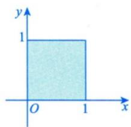

(3) $D = \{(x,y)|0\leqslant x\leqslant 1,0\leqslant y\leqslant x\}$ .

(2) $D = \{(x,y)|x + y\leqslant 1,x\geqslant 0,y\geqslant 0\}$

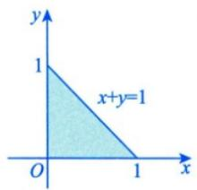

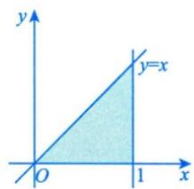

(4) $D = \{(x,y)\mid 0\leqslant x\leqslant 2,x\leqslant y\leqslant \sqrt{3} x\}$

(5) $D = \{(x,y)|0\leqslant x\leqslant \pi ,0\leqslant y\leqslant 1\}$

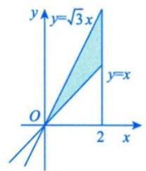

(6) $D = \{(x,y)|1\leqslant x + y\leqslant 2,x\geqslant 0,y\geqslant 0\}$

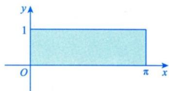

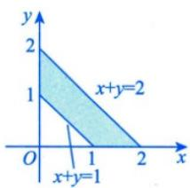

(7) $D = \left\{(x,y)\mid 0\leqslant x\leqslant 3,0\leqslant y\leqslant 3,\frac{\sqrt{3}}{3} x\leqslant y\leqslant \sqrt{3} x\right\} .$ (8) $D = \{(x,y)|1\leqslant x + y\leqslant 2,0\leqslant y\leqslant x\}$

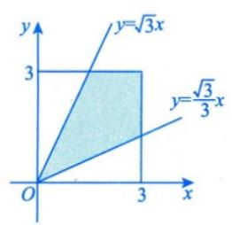

(9) $D = \{(x,y)|0\leqslant x + y\leqslant 1,0\leqslant y\leqslant 1\}$ .

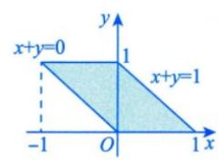

(11) $D = \{(x,y)|x\leqslant 1,y\geqslant -1,y\leqslant x\}$

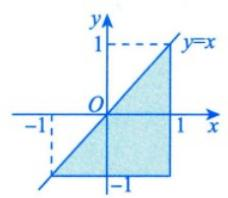

(13) $D = \{(x,y)|0\leqslant x\leqslant 1,x\leqslant y\leqslant 1 + x\}$

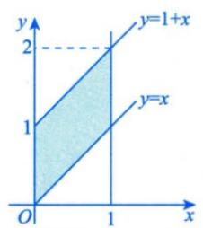

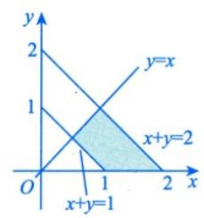

(10) $D = \{(x,y)|0\leqslant x\leqslant 1,x\leqslant y\leqslant 1\}$

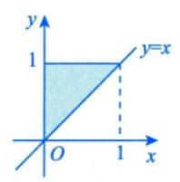

(12) $D = \left\{(x,y)\left|\frac{1}{4}\leqslant y\leqslant \frac{1}{2},y\leqslant x\leqslant \frac{1}{2}\right.\right\} .$

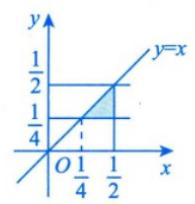

(14) $D = \{(x,y)|x\leqslant 3y,y\leqslant 3x,x + y\leqslant 8\}$ 后续更新去公众号[有机研]永久联系微信 4550060

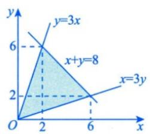

考研数学基础30讲·高等数学分册

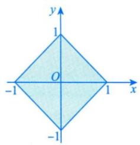

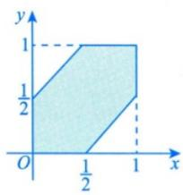

(17) $D = \{(x,y)||x|\leqslant 1,|y|\leqslant 1\}$

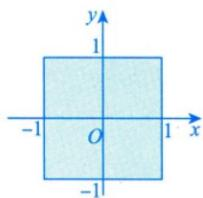

直角坐标系下曲线边界型：

## 2 直角坐标系下曲线边界型

考生应能熟练画出平面区域 D.

$$
(1) D = \left\{(x, y) \mid 0 \leqslant x \leqslant 1, \sqrt [ 3 ]{x} \leqslant y \leqslant 1 \right\}.
$$

(2) $D = \left\{(x,y)\mid 0\leqslant x\leqslant 1,\arctan x\leqslant y\leqslant \frac{\pi}{4}\right\} .$

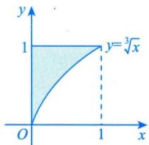

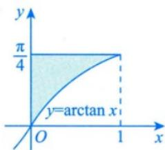

(3) $D = \{(x,y)|0\leqslant x\leqslant 1,0\leqslant y\leqslant 1,(x - 1)^2 +(y - 1)^2\leqslant 1\}$ . (4) $D = \{(x,y)|0\leqslant y\leqslant x,x^2 +y^2\leqslant 1\}$ .

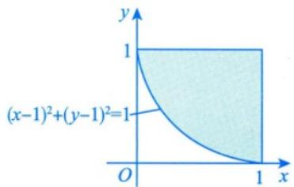

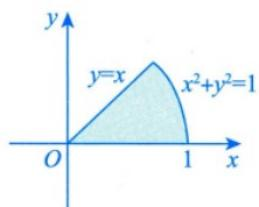

(5) $D = \{(x,y)\mid 1\leqslant x^2 +y^2\leqslant e^2,x\geqslant 0,y\geqslant 0\}$

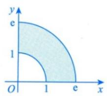

(6) $D = \{(x,y)|y\geqslant -x,x^2 +y^2\leqslant 4,$

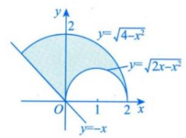

$$
\left. x ^ {2} + y ^ {2} \geqslant 2 x, y \geqslant 0 \right\}.
$$

(7) $D = \{(x,y)\mid (x - 1)^2 +(y - 1)^2\leqslant 2,0\leqslant x + y\leqslant 4\}$

(8) $D = \left\{(x,y)\left|\frac{1}{4}\leqslant x^2 +y^2,x^2 +y^2\geqslant x^4 +y^4,\right.\right.$

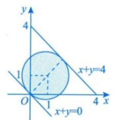

$$
\left. x \geqslant 0, y \geqslant 0 \right\}.
$$

(9) $D = \{(x,y)|0\leqslant x\leqslant \ln 2,\mathrm{e}^x\leqslant y\leqslant 2\}$

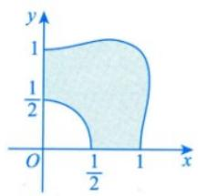

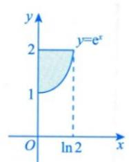

(10) $D = \{(x,y)\mid 0\leqslant y\leqslant 1,0\leqslant x\leqslant 1 - \sqrt{2y - y^2}\} .$

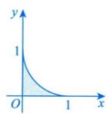

(11) $D = \{(x,y)|x^2 +y^2\leqslant \sqrt{2} x,0\leqslant y\leqslant x,\sqrt{x^2 + y^2}\leqslant 1\}$ . (12) $D = \{(x,y)|(x^2 +y^2)^2\leqslant 2xy,x\geqslant 0,y\geqslant 0\}$ .

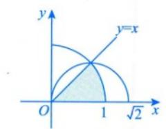

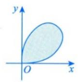

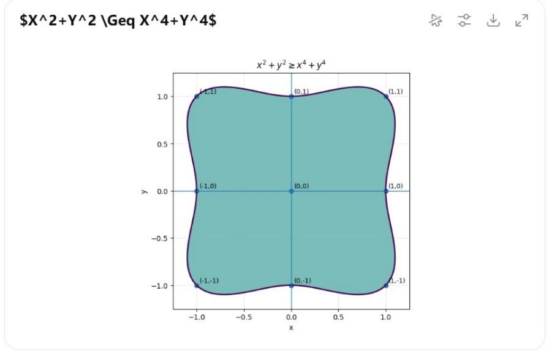  
代码就是这个，核心思想是画

$$
F (x, y) = x ^ {2} + y ^ {2} - x ^ {4} - y ^ {4} \geq 0
$$

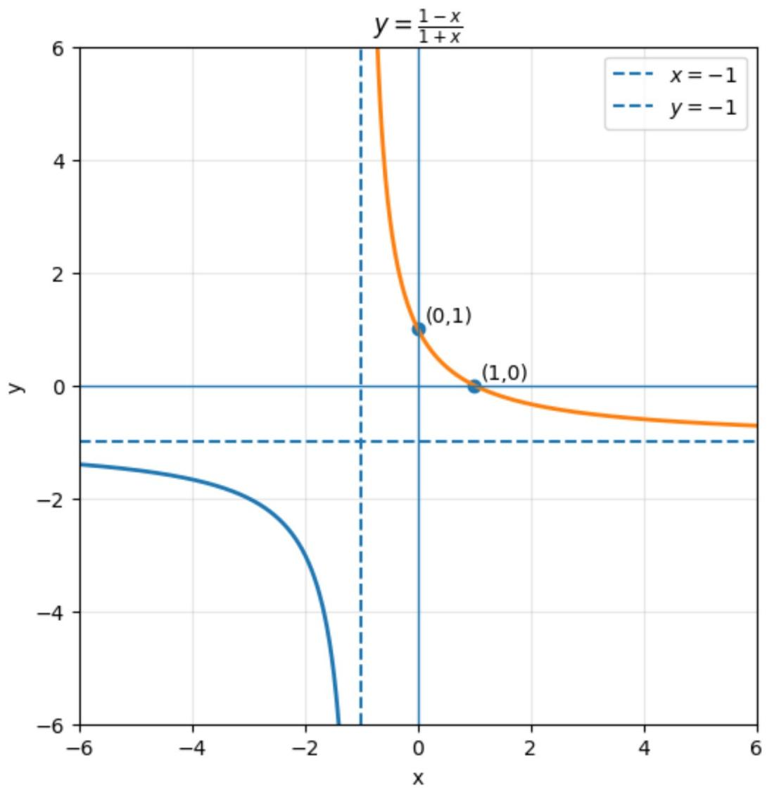

(13) $D = \{(x,y)|x\geqslant 1,x^2\leqslant y\}$

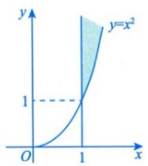

(15) $D = \left\{(x,y)\left|\frac{1 - x}{1 + x}\leqslant y\leqslant \sqrt{1 - x^2},0\leqslant x\leqslant 1\right.\right\}.$

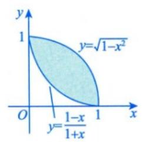

(17) $D = \{(x,y)\mid y\leqslant \sqrt{1 - x^2},y\geqslant 1 - \sqrt{1 - x^2}\} .$

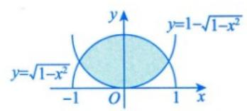

(19) $D = \{(x,y)\big|(x^2 +y^2)^2\leqslant 2xy\}$

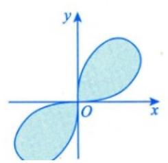

(14) $D = \left\{(x,y)\mid y\leqslant \sqrt{2x - x^2},x + y\geqslant 2\right\}.$

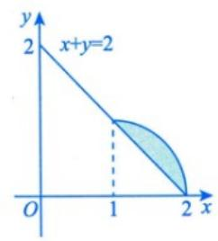

(16) $D = \{(x,y)|x + y + xy\geqslant 1,x^2 +y^2\leqslant 1,x\geqslant 0,y\geqslant 0\}$

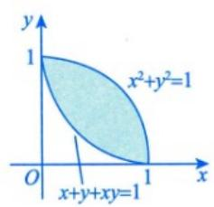

(18) $D = \{(x,y)|x^2 +y^2\leqslant 4,2x - x^2 -y^2\leqslant 0\}$

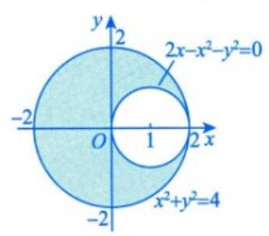

(20) $D = \{(x,y)|0\leqslant y\leqslant 1, - \sqrt{1 - y^2}\leqslant x\leqslant 1 - y\}$

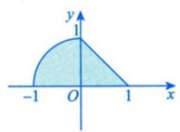

(21) $D = \left\{(x,y)\mid \sqrt{1 - x^2}\leqslant y\leqslant \sqrt{4 - x^2}, - x\leqslant y,y\geqslant 0\right\} .$ (22) $D = \left\{(x,y)\mid 1\leqslant x^2 +y^2\leqslant 2x,y\geqslant 0\right\} .$

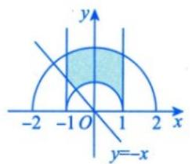

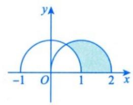

(23) $D = \{(x,y)\mid (x^2 +y^2)^2\leqslant x^2 -y^2,x\geqslant 0\}$

(24) $D = \{(x,y)|0\leqslant x\leqslant 2,0\leqslant y\leqslant 4 - x^2\}$

(27) $D = \{(x,y)\mid 2xy\leqslant 1,4xy\geqslant 1,y\geqslant x,y\leqslant \sqrt{3} x\}$

(28) $D = \{(x,y)| - 1\leqslant x\leqslant 0, - x\leqslant y\leqslant 2 - x^2\}$

(29) $D = \{(x,y)\mid 4x^{2}\leqslant y\leqslant 9x^{2},x\geqslant 0\}$

(31) $D = \{(x,y)|x\geqslant -2,0\leqslant y\leqslant 2,x\leqslant -\sqrt{2y - y^2}\}$

(33) $D = \{(x,y)\mid x^2 +y^2\leqslant 4,(x + 1)^2 +y^2\geqslant 1\}$

$$
D = \left\{(x, y) \mid x \leqslant \sqrt {1 + y ^ {2}}, x + \sqrt {2} y \geqslant 0, \right.
$$

$$
\left. x - \sqrt {2} y \geqslant 0 \right\}.
$$

(30) $D = \{(x,y)\mid 0\leqslant y\leqslant 1,\sqrt{y}\leqslant x\leqslant \sqrt{2 - y^2}\} .$

(32) $D = \left\{(x,y)\mid 0\leqslant y\leqslant \frac{1}{4},y\leqslant x\leqslant \sqrt{y}\right\} .$

(34) $D_{1} = \{(x,y)|x^{2} + y^{2}\leqslant 1,x\geqslant 0,y\geqslant 0\}$

$$
D _ {2} = \left\{(x, y) \mid x ^ {2} + y ^ {2} \geqslant 1, 0 \leqslant x \leqslant 1, 0 \leqslant y \leqslant 1 \right\}.
$$

(36) $D = \{(x,y)|0\leqslant x\leqslant 1,0\leqslant y\leqslant \sqrt{x}\}$

(37) $D = \{(x,y)\mid 0\leqslant x\leqslant 1,x^2\leqslant y\leqslant 1\}$

(39) $D = \{(x,y)\mid 2\leqslant x\leqslant 4,\sqrt{x}\leqslant y\leqslant 2\}$

(41) $D = \left\{(x,y)\left|\frac{1}{2}\leqslant y\leqslant 1,y\leqslant x\leqslant \sqrt{y}\right.\right\} .$

(43) $D = \{(x,y)\mid x^2 +y^2 +xy\leqslant 1\}$

极坐标方程型：

(38) $D = \{(x,y)|1\leqslant x\leqslant 2,\sqrt{x}\leqslant y\leqslant x\}$

(40) $D = \left\{(x,y)\left|\frac{1}{4}\leqslant y\leqslant \frac{1}{2},\frac{1}{2}\leqslant x\leqslant \sqrt{y}\right.\right\} .$

(42) $D = \{(x,y)\mid 2\leqslant 2x^{2} + y^{2}\leqslant 4,x\geqslant 0,y\geqslant 0\}$

(44) $D = \{(x,y)\mid 0\leqslant x\leqslant 2,0\leqslant y\leqslant 2,y\leqslant \frac{1}{x}\} .$

## 3 极坐标方程型

考生应能熟练画出平面区域 $D$

$$
(1) D = \left\{(r, \theta) \middle | 0 \leqslant r \leqslant \frac {1}{\sin \theta}, \frac {\pi}{4} \leqslant \theta \leqslant \frac {\pi}{2} \right\}.
$$

$$
(3) D = \left\{(r, \theta) \bigg | 0 \leqslant \theta \leqslant 2 \pi , \frac {\theta}{2} \leqslant r \leqslant \pi \right\}.
$$

$$
(5) D = \left\{(r, \theta) \middle | \frac {1}{\sqrt {\sin \theta \cos \theta}} \leqslant r \leqslant \frac {2}{\cos \theta}, \right.
$$

$$
\left. \arctan \frac {1}{4} \leqslant \theta \leqslant \frac {\pi}{4} \right\}.
$$

(2) $D = \left\{(r,\theta)\middle |0\leqslant r\leqslant \sec \theta ,0\leqslant \theta \leqslant \frac{\pi}{4}\right\} .$

$$
(7) D = \left\{(r, \theta) \middle | 0 \leqslant r \leqslant \sqrt {\sin 2 \theta}, 0 \leqslant \theta \leqslant \frac {\pi}{2} \right\}.
$$

(4) $D = \left\{(r,\theta)\middle |0\leqslant r\leqslant 1,0\leqslant \theta \leqslant \frac{\pi}{4}\right\} .$

$$
(6) D = \left\{(r, \theta) \middle | 2 \leqslant r \leqslant 2 (1 + \cos \theta), - \frac {\pi}{2} \leqslant \theta \leqslant \frac {\pi}{2} \right\}.
$$

$$
(8) D = \left\{(r, \theta) \middle | 0 \leqslant \theta \leqslant \frac {\pi}{2}, 0 \leqslant r \leqslant 2 \cos \theta , \right.
$$

$$
0 \leqslant r \leqslant \frac {2}{\cos \theta + \sin \theta} \Bigg \}.
$$

(9) $D = \left\{(r,\theta)\middle |0\leqslant r\leqslant 2, - \arccos \frac{r}{2}\leqslant \theta \leqslant \arccos \frac{r}{2}\right\} .$ (10) $D = \left\{(r,\theta)\middle |0\leqslant r\leqslant 2(\sin \theta +\cos \theta),\frac{\pi}{4}\leqslant \theta \leqslant \frac{3}{4}\pi \right\} .$

(11) $D = \left\{(r,\theta)\bigg|0\leqslant r\leqslant 2\sin \theta ,0\leqslant \theta \leqslant \frac{\pi}{4}\right\} .$

(12) $D = \left\{(r,\theta)\middle |0\leqslant r\leqslant 2\cos \theta ,\frac{\pi}{4}\leqslant \theta \leqslant \frac{\pi}{2}\right\} .$

(13) $D = \left\{(r,\theta)\middle |0\leqslant r\leqslant 2,0\leqslant \theta \leqslant \frac{\pi}{2}\right\}.$

(15) $D = \{(r,\theta)|1\leqslant r\leqslant u,0\leqslant \theta \leqslant v\}$

注 有些 D 是用直角坐标系下的表达式描述的，但实际上用极坐标方程更方便，要归到这里来。如 2019 年考研真题数学二（18）的平面区域为 $D=\left\{(x,y)\|x|\leqslant y,(x^{2}+y^{2})^{3}\leqslant y^{4}\right\}$ 。

$$
g: y = | x |, f: y ^ {4} = (x ^ {2} + y ^ {2}) ^ {3}
$$

Polar: $0 \leq r \leq \sin^2\theta$

## 参数方程型：

## 4 参数方程型

考生应能熟练画出平面区域 D.

(1) $D = \{(x,y)|0\leqslant y\leqslant t - x,0\leqslant x\leqslant t,0 <   t\leqslant 1\} .$ (2） $D = \{(x,y)|0\leqslant x\leqslant t,x\leqslant y\leqslant t\}$

(3) $D = \{(x,y)|0\leqslant x\leqslant t,0\leqslant y\leqslant x,t > 0\}$

(4) $D = \{(u,v)\mid 0\leqslant u\leqslant x^4,\sqrt[4]{u}\leqslant v\leqslant x\}$

$$
(5) D = \left\{(x, y) \mid x ^ {2} + (y - 1) ^ {2} \leqslant 1, \frac {2}{3} x ^ {2} + \frac {2}{9} y ^ {2} \leqslant a ^ {2}, a > 0 \right\}.
$$

  
(a)

  
(b)

  
(c)

(6) $D = \left\{(x, y) \mid 0 < y < \sqrt{2ax - x^2}, x > y, a > 0\right\}$ . (7) $D = \left\{(x, y) \mid 0 \leqslant x \leqslant 2t, 0 \leqslant y \leqslant t, t > 0\right\}$ .

(8) $D = \{(x,y)|y\geqslant -x,y\leqslant -a + \sqrt{a^2 - x^2},a > 0\}$ . (9) $D = \{(x,y)|y\leqslant x\leqslant t,1\leqslant y\leqslant t,t > 1\}$

题目：

题1:

例14.1 设平面闭区域 $D_{i}(i = 1,2,3,4)$ 分别是由

$$
L _ {1}: x ^ {2} + y ^ {2} = 1, L _ {2}: x ^ {2} + y ^ {2} = 2,
$$

$$
L _ {3}: x ^ {2} + 2 y ^ {2} = 2, L _ {4}: 2 x ^ {2} + y ^ {2} = 2
$$

围成的平面区域，记

$I_{i}=\iint_{D_{i}}\left(1-x^{2}-\frac{1}{2}y^{2}\right)\mathrm{d}x\mathrm{d}y$ ，→在不同的区域上对同一个被积函数做二重积分

则 $\max \{I_1, I_2, I_3, I_4\} = (\quad)$ . (A) $I_1$ (B) $I_2$ (C) $I_3$ (D) $I_4$

分析 此题是同一个函数在不同区域的积分比大小的问题，不需要计算二重积分，应研究在不同积分区域下，被积函数的正负情形。被积函数 $1 - x^{2} - \frac{1}{2} y^{2} \geqslant 0$ 正好对应的区域为 $D_{4}$ ，而 $D_{1} < D_{4}$ ，故 $I_{1} < I_{4}$ ， $D_{4} < D_{2}$ ，在 $D_{2} - D_{4}$ 区域，被积函数值为负，所以 $I_{2} < I_{4}$ ，同理 $I_{3} < I_{4}$ 。

解 应选(D).

曲线 $L_{i}(i = 1,2,3,4)$ 如图14-2所示.记被积函数为 $f(x,y) = 1 - \left(x^{2} + \frac{1}{2} y^{2}\right)$ ，由于 $L_{4}:2x^{2} + y^{2} = 2$ ，则 $D_{4}$ 内部为 $x^{2} + \frac{y^{2}}{2} < 1$ ，于是在 $D_{4}$ 内部有 $f(x,y) > 0$ ，而在 $D_{4}$ 外部有 $f(x,y) < 0$ ：

①比较 $I_{1}$ 与 $I_{4}$ .

$$
\begin{array}{r l} & I _ {4} = \iint_ {D _ {4}} f (x, y) \mathrm{d} x \mathrm{d} y = \iint_ {D _ {1}} f (x, y) \mathrm{d} x \mathrm{d} y + \iint_ {D _ {4} - D _ {1}} f (x, y) \mathrm{d} x \mathrm{d} y \\ & \qquad = I _ {1} + \iint_ {\stackrel {D _ {4} - D _ {1}} {\longrightarrow}} f (x, y) \mathrm{d} x \mathrm{d} y > I _ {1}. \\ & \text {与} I _ {4}. \end{array}
$$

图14-2

②比较 $I_{2}$ 与 $I_{4}$ .

$$
\begin{array}{r l} I _ {2} & = \iint_ {D _ {2}} f (x, y) \mathrm{d} x \mathrm{d} y = \iint_ {D _ {4}} f (x, y) \mathrm{d} x \mathrm{d} y + \iint_ {D _ {2} - D _ {4}} f (x, y) \mathrm{d} x \mathrm{d} y \\ & = I _ {4} + \iint_ {\underbrace {D _ {2} - D _ {4}} _ {\longrightarrow}} f (x, y) \mathrm{d} x \mathrm{d} y <   I _ {4}. \end{array}
$$

③ 比较 $I_{3}$ 与 $I_{4}$ . 如图 14-3 所示，将 $D_{3}$ ， $D_{4}$ 中互不重合的部分分别记为 $D_{31}$ ， $D_{32}$ ， $D_{41}$ ， $D_{42}$ ，则

$$
I _ {3} = \iint_ {\underbrace {D _ {3 1}} _ {\rightarrow f (x, y) <   0}} f (x, y) \mathrm{d} x \mathrm{d} y + \iint_ {\underbrace {D _ {3 2}} _ {\leftarrow}} f (x, y) \mathrm{d} x \mathrm{d} y + \iint_ {D _ {3} \cap D _ {4}} f (x, y) \mathrm{d} x \mathrm{d} y
$$

  
图14-3

$$
\begin{array}{l} <   \iint_ {D _ {4 1}} f (x, y) \mathrm{d} x \mathrm{d} y + \iint_ {D _ {4 2}} f (x, y) \mathrm{d} x \mathrm{d} y + \iint_ {D _ {3} \cap D _ {4}} f (x, y) \mathrm{d} x \mathrm{d} y \\ = I _ {4}. \end{array}
$$

所以 $\max\{I_{1}, I_{2}, I_{3}, I_{4}\}=I_{4}$ ，即应选(D).

注 事实上， $D_{4}$ 是使得 $\iint_{D}\left(1-x^{2}-\frac{1}{2}y^{2}\right)\mathrm{d}x\mathrm{d}y$ 取得最大值的区域，因为 $D_{4}$ 包含了所有使 $1-x^{2}-\frac{1}{2}y^{2}$ 大于零的区域，而不包含任何使 $1-x^{2}-\frac{1}{2}y^{2}$ 小于零的区域，由二重积分的性质知 $I_{4}$ 最大.

而 $D_{2}$ 是半径 $\sqrt{2}$ 的圆：

$$
x ^ {2} + y ^ {2} \leq 2
$$

它包含了很多 $D_{4}$ 外面的区域，在那些地方

$$
1 - x ^ {2} - \frac {1}{2} y ^ {2} <   0
$$

所以 $I_{2}$ 会被这些负值部分拉低。

椭圆

$$
\frac {x ^ {2}}{a ^ {2}} + \frac {y ^ {2}}{b ^ {2}} \leq 1
$$

上有公式:

$$
\iint_ {D} x ^ {2} d x d y = \frac {\pi a ^ {3} b}{4}, \quad \iint_ {D} y ^ {2} d x d y = \frac {\pi a b ^ {3}}{4}
$$

所以

$$
I = \iint_ {D} \left(1 - x ^ {2} - \frac {1}{2} y ^ {2}\right) d x d y = \pi a b \left(1 - \frac {a ^ {2}}{4} - \frac {b ^ {2}}{8}\right)
$$

$$
D _ {1}: x ^ {2} + y ^ {2} \leq 1, \quad a = b = 1
$$

$$
I _ {1} = \pi \left(1 - \frac {1}{4} - \frac {1}{8}\right) = \frac {5 \pi}{8}
$$

$$
D _ {2}: x ^ {2} + y ^ {2} \leq 2, \quad a = b = \sqrt {2}
$$

$$
I _ {2} = 2 \pi \left(1 - \frac {2}{4} - \frac {2}{8}\right) = \frac {\pi}{2}
$$

$$
D _ {3}: x ^ {2} + 2 y ^ {2} \leq 2 \Longleftrightarrow \frac {x ^ {2}}{2} + y ^ {2} \leq 1
$$

$$
a = \sqrt {2}, b = 1
$$

$$
I _ {3} = \sqrt {2} \pi \left(1 - \frac {2}{4} - \frac {1}{8}\right) = \frac {3 \sqrt {2} \pi}{8}
$$

$$
D _ {4}: 2 x ^ {2} + y ^ {2} \leq 2 \Longleftrightarrow x ^ {2} + \frac {y ^ {2}}{2} \leq 1
$$

$$
a = 1, b = \sqrt {2}
$$

$$
I _ {4} = \sqrt {2} \pi \left(1 - \frac {1}{4} - \frac {2}{8}\right) = \frac {\sqrt {2} \pi}{2}
$$

四个值是:

$$
I _ {1} = \frac {5 \pi}{8}
$$

$$
I _ {2} = \frac {\pi}{2}
$$

$$
I _ {3} = \frac {3 \sqrt {2} \pi}{8}
$$

$$
I _ {4} = \frac {\sqrt {2} \pi}{2}
$$

所以顺序是：

$$
I _ {2} <   I _ {3} <   I _ {1} <   I _ {4}
$$

因此：

$$
\min \{I _ {1}, I _ {2}, I _ {3}, I _ {4} \} = I _ {2}
$$

但原题问最大值，所以：

$$
\max \{I _ {1}, I _ {2}, I _ {3}, I _ {4} \} = I _ {4}
$$

题 2(\*):

重点中的重点，详细看知识点中的积分->对称性

例14.2 设 $D(t) = \{(x, y) | 2x^2 + 3y^2 \leqslant 6t\} (t \geqslant 0)$ ,

$$
f (x, y) = \left\{ \begin{array}{l l} \frac {\sqrt [ 3 ]{1 - (x ^ {2} + y ^ {2})} - 1}{\mathrm{e} ^ {x ^ {2} + y ^ {2}} - 1}, & (x, y) \neq (0, 0), \\ a, & (x, y) = (0, 0) \end{array} \right.
$$

为连续函数，令 $F(t)=\iint_{D(t)}f(x,y)\mathrm{d}x\mathrm{d}y$ ，则 $F_{+}^{\prime}(0)=$ \_\_\_\_.

分析 本题积分区域为动态区域 $D(t)$ ，当 $t \to 0$ 时， $D(t) \to 0$ 。

本题研究的是在一点处的导数，所以用导数的定义，当 $\iint_{D} f(x, y) \mathrm{d}\sigma$ 难计算时，可以利用二重积分的中值定理来处理。

解 应填 $-\frac{\sqrt{6}\pi}{3}$ .

由例13.2可知 $a = -\frac{1}{3}$

由二重积分的中值定理知，存在 $(\xi, \eta) \in D(t)$ ，使得

$$
F (t) = \iint_ {D (t)} f (x, y) \mathrm{d} x \mathrm{d} y = \sqrt {6} \pi t f (\xi , \eta).
$$

于是，

$$
\begin{array}{r l} F _ {+} ^ {\prime} (0) & = \lim _ {t \to 0 ^ {+}} \frac {F (t) - F (0)}{t - 0} = \lim _ {t \to 0 ^ {+}} \frac {\sqrt {6} \pi t f (\xi , \eta)}{t} = \lim _ {t \to 0 ^ {+}} \sqrt {6} \pi f (\xi , \eta) \\ & = \sqrt {6} \pi f (0, 0) = - \frac {\sqrt {6} \pi}{3}. \end{array}
$$

注 此题的被积函数被命制成具体函数，但 $\iint_{D(t)} f(x, y) \mathrm{d}\sigma$ 难以计算，故考虑利用二重积分的中值定理来处理。同理，若被积函数被命制成抽象函数，也可以考虑利用二重积分中值定理来处理，如：设 $f(x, y)$ 具有二阶连续偏导数，

$$
D (t) = \{(x, y) | 0 \leqslant x \leqslant t, 0 \leqslant y \leqslant t \},
$$

令 $F(t) = \iint_{D(t)}f_{xy}^{\prime \prime}(x,y)\mathrm{d}x\mathrm{d}y$ ，求 $F_{+}^{\prime}(0)$

解

$$
\begin{array}{r l} & {F _ {+} ^ {\prime} (0) = \underset {t \to 0 ^ {+}} {\lim} \frac {F (t) - F (0)}{t - 0} = \underset {t \to 0 ^ {+}} {\lim} \frac {\iint_ {D (t)} f _ {x y} ^ {\prime \prime} (x , y) \mathrm{d} x \mathrm{d} y}{t - 0}} \\ & {\quad \xrightarrow {\text {二重积分的中值定理}} \underset {t \to 0 ^ {+}} {\lim} \frac {f _ {x y} ^ {\prime \prime} (\xi , \eta) \bullet t ^ {2}}{t} = \underset {t \to 0 ^ {+}} {\lim} t \bullet f _ {x y} ^ {\prime \prime} (\xi , \eta) = 0.} \end{array}
$$

## 题 3:

例 14.3 设 $J_{i}=\iint_{D_{i}}\sqrt[3]{x-y}\mathrm{d}x\mathrm{d}y(i=1,2,3)$ ，其中 $D_{1}=\{(x,y)\mid0\leqslant x\leqslant1,0\leqslant y\leqslant1\}$ ， $D_{2}=\{(x,y)\mid0\leqslant x\leqslant1,0\leqslant y\leqslant\sqrt{x}\}$ ， $D_{3}=\{(x,y)\mid0\leqslant x\leqslant1,x^{2}\leqslant y\leqslant1\}$ ，则（）.
(A) $J_{1}<J_{2}<J_{3}$ (B) $J_{3}<J_{1}<J_{2}$ (C) $J_{2}<J_{3}<J_{1}$ (D) $J_{2}<J_{1}<J_{3}$

分析 本题先画出每部分的积分区域图，然后研究同一函数在不同区域的积分值的大小.
本题是结合对称性和被积函数正负的问题.
因 $D_{1}$ 关于y=x对称， $f(y,x)=-f(x,y)$ ，故 $J_{1}=0$ 。

$D_{2}$ 不对称，但可以作辅助曲线，创造对称性，对称部分积分为0，另一部分 $f(x,y)\geqslant0$ ，故 $J_{2}>0$ 。
同理， $D_{3}$ 也可作辅助曲线，对称部分积分为0，另一部分 $f(x,y)\leqslant0$ ，故 $J_{3}<0$ 。

## 解 应选(B).

如图14-5(a)所示， $D_{1}$ 被直线 $y = x$ 分成 $D_{11}$ 和 $D_{12}$ 两部分，故 $\iint_{D_1} \sqrt[3]{x - y} \, \mathrm{d}x \, \mathrm{d}y = \iint_{D_{11} + D_{12}} \sqrt[3]{x - y} \, \mathrm{d}x \, \mathrm{d}y$ ，由于 $\sqrt[3]{x - y} = -\sqrt[3]{y - x}$ ，故由普通对称性，有 $J_{1} = \iint_{D_{1}} \sqrt[3]{x - y} \, \mathrm{d}x \, \mathrm{d}y = 0$ ：

如图14-5(b)所示，作辅助线 $y = x^{2}$ ，将 $D_{2}$ 分为 $D_{21}$ 和 $D_{22}$ 两部分，由普通对称性知， $\iint_{D_{21}}^3\sqrt[3]{x - y}\mathrm{d}x\mathrm{d}y = 0$ 。而在 $D_{22}$ 上， $\sqrt[3]{x - y} \geqslant 0$ ，由保号性知，

$$
J _ {2} = \iint_ {D _ {2}} \sqrt [ 3 ]{x - y} \mathrm{d} x \mathrm{d} y = \iint_ {D _ {2 2}} \sqrt [ 3 ]{x - y} \mathrm{d} x \mathrm{d} y > 0.
$$

如图14-5(c)所示，作辅助线 $y = \sqrt{x}$ ，将 $D_{3}$ 分为 $D_{31}$ 和 $D_{32}$ 两部分，由普通对称性知， $\iint_{D_{32}}^{3}\sqrt[3]{x - y}\mathrm{d}x\mathrm{d}y = 0$ 。而在 $D_{31}$ 上， $\sqrt[3]{x - y} \leqslant 0$ ，由保号性知，

$$
J _ {3} = \iint_ {D _ {3}} \sqrt [ 3 ]{x - y} \mathrm{d} x \mathrm{d} y = \iint_ {D _ {3 1}} \sqrt [ 3 ]{x - y} \mathrm{d} x \mathrm{d} y <   0.
$$

综上， $J_{3}<J_{1}<J_{2}$

  
(a)  
方法总结 遇到二重积分的题目，首先应考虑对称性，看能否化简.

  
图14-5

## 题 4:

  
(c)

例14.4 设 $f(x) = \iint_{D(x)} \frac{v \ln \sqrt{u^2 + v^2}}{u + v} \mathrm{d}u \mathrm{d}v, D(x) = \left\{(u, v) \left| \frac{1}{4} \leqslant u^2 + v^2 \leqslant x^2, u > 0, v > 0 \right\} \left( x > \frac{1}{2} \right)\right.$ ，则 $f(x) = (\quad)$ . (A) $\frac{1}{4} \iint_{D(x)} \ln (u^2 + v^2) \mathrm{d}u \mathrm{d}v$ (B) $\frac{1}{2} \iint_{D(x)} \ln (u^2 + v^2) \mathrm{d}u \mathrm{d}v$ (C) $\iint_{D(x)} \ln (u^2 + v^2) \mathrm{d}u \mathrm{d}v$ (D) $2 \iint_{D(x)} \ln (u^2 + v^2) \mathrm{d}u \mathrm{d}v$

分析 D 中 u, v 互换位置, D 不变, 接着看 $g(u, v)$ 与 $g(v, u)$ 的关系既不相等, 也不相反, 考虑将其加起来, $g(u, v) + g(v, u)$ 计算简单, 所以考虑轮换对称性.

解 应选(A).

由轮换对称性，有

$$
\begin{array}{r l} f (x) & = \iint_ {D (x)} \frac {v \ln \sqrt {u ^ {2} + v ^ {2}}}{u + v} \mathrm{d} u \mathrm{d} v = \iint_ {D (x)} \frac {u \ln \sqrt {u ^ {2} + v ^ {2}}}{u + v} \mathrm{d} u \mathrm{d} v \\ & = \frac {1}{2} \iint_ {D (x)} \ln \sqrt {u ^ {2} + v ^ {2}} \mathrm{d} u \mathrm{d} v = \frac {1}{4} \iint_ {D (x)} \ln (u ^ {2} + v ^ {2}) \mathrm{d} u \mathrm{d} v. \end{array}
$$

方法总结 当 $D$ 关于 $y = x$ 对称， $f(x, y) = -f(y, x)$ 或 $f(x, y) = f(y, x)$ 时，考虑普通对称性，若不满足，可看 $f(x, y) + f(y, x)$ 是否简单，考虑轮换对称性。

同：@

## 题 5:

例 14.6 当 $x \to 0^{+}$ 时， $f(x) = \int_{0}^{x^{2}} \mathrm{d}y \int_{x}^{\sqrt{y}} \sin \frac{y}{t} \mathrm{d}t$ 与 $g(x) = ax^{b}$ 是等价无穷小量，则 $ab =$ \_\_\_\_.

分析 $\sin \frac{y}{x}$ 若对 $x$ 积分，则没有初等函数形式的原函数表达，若对 $y$ 积分，可用初等函数形式表示，所以先积 $y$ 后积 $x$ ，本题属于交换积分顺序的题目.

又因为 $0 \leqslant y \leqslant x^2$ ，所以 $\sqrt{y} \leqslant x$ ，故 $\int_0^{x^2} \mathrm{d}y \int_x^{\sqrt{y}} \sin \frac{y}{t} \mathrm{d}t$ 先添一个负号变为 $-\int_0^{x^2} \mathrm{d}y \int_{\sqrt{y}}^{x} \sin \frac{y}{t} \mathrm{d}t$ ，变为二重积分后，画出积分区域图，再交换积分顺序。

解 应填 $-\frac{1}{2}$ .

交换上下限，保证上限大于等于下限

$$
\begin{array}{r l} f (x) & = \int_ {0} ^ {x ^ {2}} \mathrm{d} y \int_ {\sqrt [ x ]{y}} ^ {\sqrt [ y ]{y}} \sin \frac {y}{t} \mathrm{d} t = - \int_ {0} ^ {x ^ {2}} \mathrm{d} y \int_ {\sqrt [ x ]{y}} ^ {\sqrt [ x ]{y}} \sin \frac {y}{t} \mathrm{d} t \\ & = - \iint_ {D} \sin \frac {y}{t} \mathrm{d} \sigma = - \int_ {0} ^ {x} \mathrm{d} t \int_ {0} ^ {t ^ {2}} \sin \frac {y}{t} \mathrm{d} y \\ & = \int_ {0} ^ {x} t * \left(\cos \frac {y}{t}\right) \Bigg | _ {\sqrt [ y = 0 ]{y = 1}} ^ {\sqrt [ y = t ^ {2} ]{y}} \mathrm{d} t \\ & = \int_ {0} ^ {x} t (\cos t - 1) \mathrm{d} t, \end{array}
$$

于是 $\lim_{x\to0^{+}}\frac{f(x)}{g(x)}=\lim_{x\to0^{+}}\frac{x(\cos x-1)}{abx^{b-1}}=\lim_{x\to0^{+}}\frac{-\frac{1}{2}x^{3}}{abx^{b-1}}=1$ ，故 $ab=-\frac{1}{2}$ .

注 (1) $\frac{\sin x}{x}, \frac{\cos x}{x}, \frac{\ln(1 + x)}{x}, \frac{1}{\ln x}, \sin x^2, \cos x^2, \sin \frac{1}{x}, \cos \frac{1}{x}, \frac{\tan x}{x}, \frac{e^x}{x}, \tan x^2, e^{ax^2 + bx + c} (a \neq 0)$ 均没有初等函数形式的原函数，见到它们，一般都要交换积分次序，避免先对 $x$ 求积分.

(2) 事实上， $a = -\frac{1}{8}$ ，b = 4.

方法总结 当累次积分无法积分，即没有初等函数形式的原函数表达式时，可考虑交换积分顺序。

公式 $\int \sin \frac{y}{t} dy = -t\cos \frac{y}{t} + C$

当 $x \to 0^{+}$ 时， $f(x) \sim g(x)$ ，则 $\int_{0}^{x} f(t) \mathrm{d}t \sim \int_{0}^{x} g(t) \mathrm{d}t$ 。（可用洛必达法则证明）

题6:

例14.7 计算 $\int_0^1\mathrm{d}y\int_y^1\arcsin \sqrt{4x - 4x^2}\mathrm{d}x$

分析 被积函数只含有x，而且先对x积分较困难，所以考虑交换积分顺序.

解 先对 $x$ 积分较困难，交换积分次序.

$$
\begin{array}{r l} \text {   原式   } & = \int_ {0} ^ {1} \mathrm{d} x \int_ {0} ^ {x} \arcsin \sqrt {4 x - 4 x ^ {2}} \mathrm{d} y \\ & = \int_ {0} ^ {1} x \arcsin \sqrt {4 x - 4 x ^ {2}} \mathrm{d} x = \frac {1}{2}. \end{array}
$$

方法总结 $\int_{c}^{d}\mathrm{d}y\int_{x_1(y)}^{x_2(y)}f(x)\mathrm{d}x$ 对 $x$ 积分比较困难时，可转化为先积 $y$ ，即 $\int_{a}^{b}\mathrm{d}x\int_{y_1(x)}^{y_2(x)}f(x)\mathrm{d}y.$

公式 $\int_0^1\arcsin \sqrt{1 - x^2}\mathrm{d}x = 1,\int_0^1 x\arcsin \sqrt{4x - 4x^2}\mathrm{d}x = \frac{1}{2}.$

题7:

$$
I _ {1} = \int_ {0} ^ {1} \arcsin \sqrt {1 - x ^ {2}} d x
$$

## 1. 先化简被积函数

因为

$$
0 \leq x \leq 1
$$

所以可以令

$$
x = \cos t, \quad t \in \left[ 0, \frac {\pi}{2} \right]
$$

则

$$
\sqrt {1 - x ^ {2}} = \sqrt {1 - \cos^ {2} t} = \sin t
$$

因此

$$
\arcsin \sqrt {1 - x ^ {2}} = \arcsin (\sin t) = t
$$

而

$$
t = \arccos x
$$

所以在 $0 \leq x \leq 1$ 上有

$$
\arcsin \sqrt {1 - x ^ {2}} = \arccos x
$$

于是

$$
I _ {1} = \int_ {0} ^ {1} \arccos x d x
$$

2. 计算 $\int_0^1\arccos x dx$

用分部积分：

$$
\int_ {0} ^ {1} \arccos x d x
$$

令

$$
u = \arccos x, \quad d v = d x
$$

则

$$
d u = - \frac {1}{\sqrt {1 - x ^ {2}}} d x, \qquad v = x
$$

所以

$$
I _ {1} = [ x \arccos x ] _ {0} ^ {1} + \int_ {0} ^ {1} \frac {x}{\sqrt {1 - x ^ {2}}} d x
$$

先看第一项:

$$
[ x \arccos x ] _ {0} ^ {1} = 1 \cdot 0 - 0 \cdot \frac {\pi}{2} = 0
$$

再算第二项：

$$
\int_ {0} ^ {1} \frac {x}{\sqrt {1 - x ^ {2}}} d x
$$

令

$$
u = 1 - x ^ {2}, \qquad d u = - 2 x d x
$$

所以

$$
\begin{array}{r l} & \int_ {0} ^ {1} \frac {x}{\sqrt {1 - x ^ {2}}} d x = - \frac {1}{2} \int_ {1} ^ {0} u ^ {- \frac {1}{2}} d u \\ & \qquad = \frac {1}{2} \int_ {0} ^ {1} u ^ {- \frac {1}{2}} d u = \frac {1}{2} \cdot 2 = 1 \end{array}
$$

因此

$$
\boxed {\int_ {0} ^ {1} \arcsin \sqrt {1 - x ^ {2}} d x = 1}
$$

题8:

$$
I _ {2} = \int_ {0} ^ {1} x \arcsin \sqrt {4 x - 4 x ^ {2}} d x
$$

1. 先观察根号里的结构

$$
4 x - 4 x ^ {2} = 4 x (1 - x)
$$

也可以配方：

$$
4 x - 4 x ^ {2} = 1 - (2 x - 1) ^ {2}
$$

因为

$$
4 x - 4 x ^ {2}
$$

关于

$$
x = \frac {1}{2}
$$

对称。也就是说，令

$$
f (x) = \arcsin {\sqrt {4 x - 4 x ^ {2}}}
$$

则

$$
f (1 - x) = f (x)
$$

验证一下:

$$
\begin{array}{r l} 4 (1 - x) - 4 (1 - x) ^ {2} & = 4 - 4 x - 4 (1 - 2 x + x ^ {2}) \\ & = 4 - 4 x - 4 + 8 x - 4 x ^ {2} = 4 x - 4 x ^ {2} \end{array}
$$

所以

$$
\boxed {f (1 - x) = f (x)}
$$

所以

$$
\boxed {f (1 - x) = f (x)}
$$

这说明 $f(x)$ 关于 $x = \frac{1}{2}$ 对称。

## 2. 用对称公式

我们要算的是：

$$
I _ {2} = \int_ {0} ^ {1} x f (x) d x
$$

因为 $f(1 - x) = f(x)$ ，所以用换元 $x = 1 - t$ ，有：

$$
I _ {2} = \int_ {0} ^ {1} (1 - x) f (x) d x
$$

于是两式相加：

$$
\begin{array}{r l} 2 I _ {2} & = \int_ {0} ^ {1} x f (x) d x + \int_ {0} ^ {1} (1 - x) f (x) d x \\ & = \int_ {0} ^ {1} f (x) d x \end{array}
$$

所以

$$
\boxed {I _ {2} = \frac {1}{2} \int_ {0} ^ {1} f (x) d x}
$$

也就是

$$
\angle J _ {0}
$$

这正是你之前问过的公式：

$$
\int_ {a} ^ {b} x f (x) d x = \frac {a + b}{2} \int_ {a} ^ {b} f (x) d x
$$

在这里 $a = 0, b = 1$ ，所以系数就是

$$
\frac {0 + 1}{2} = \frac {1}{2}
$$

前提是：

$$
f (a + b - x) = f (x)
$$

3. 计算剩下的基础积分

设

$$
J = \int_ {0} ^ {1} \arcsin \sqrt {4 x - 4 x ^ {2}} d x
$$

配方：

$$
4 x - 4 x ^ {2} = 1 - (2 x - 1) ^ {2}
$$

令

$$
t = 2 x - 1
$$

则

$$
x = \frac {t + 1}{2}, \quad d x = \frac {1}{2} d t
$$

当 $x = 0$ 时，

$$
t = - 1
$$

当 $x = 1$ 时，

$$
t = 1
$$

所以

$$
J = \frac {1}{2} \int_ {- 1} ^ {1} \arcsin \sqrt {1 - t ^ {2}} d t
$$

注意:

$$
\arcsin \sqrt {1 - t ^ {2}}
$$

是偶函数，因为只含 $t^2$ 。所以

$$
J = \frac {1}{2} \cdot 2 \int_ {0} ^ {1} \arcsin \sqrt {1 - t ^ {2}} d t
$$

即

$$
J = \int_ {0} ^ {1} \arcsin \sqrt {1 - t ^ {2}} d t
$$

这就和第一个积分完全一样了，只是变量名从 $x$ 换成了 $t$ 。

所以

$$
J = 1
$$

因此

$$
I _ {2} = \frac {1}{2} J = \frac {1}{2}
$$

最终得到

$$
\boxed {\int_ {0} ^ {1} x \arcsin \sqrt {4 x - 4 x ^ {2}} d x = \frac {1}{2}}
$$

## 三、这两个题的核心套路

这两个积分要记住三件事：

1. 看到 $\sqrt{1 - x^2}$

优先想到：

$$
x = \cos t
$$

或者

$$
\arcsin \sqrt {1 - x ^ {2}} = \arccos x
$$

但这个等式只在

$$
0 \leq x \leq 1
$$

上直接成立。

2. 看到 $4x - 4x^{2}$

马上配方：

$$
4 x - 4 x ^ {2} = 1 - (2 x - 1) ^ {2}
$$

这说明它关于

$$
x = \frac {1}{2}
$$

对称。

3. 看到 $\int_0^1 xf(x)dx$ ，且 $f(1 - x) = f(x)$

直接用公式：

$$
\boxed {\int_ {0} ^ {1} x f (x) d x = \frac {1}{2} \int_ {0} ^ {1} f (x) d x}
$$

这就是第二个积分能秒出的关键。

题9:

例14.8 设区域 $D = \{(x, y) | x^2 + y^2 \leqslant \sqrt{2}\}$ ，则 $\iint_{D} \left(x^2 + \frac{y^2}{2}\right) \mathrm{d}x \mathrm{d}y =$ \_\_\_\_.

分析 积分区域是圆，但被积函数不是平方和，这里注意到 x 与 y 互换时，积分区域 D 不变，说明 D 关于 y = x 对称，此时考虑轮换对称性，最后在极坐标系下计算此二重积分.

解 应填 $\frac{3\pi}{4}$ .

$$
\begin{array}{r l} \iint_ {D} \left(x ^ {2} + \frac {y ^ {2}}{2}\right) \mathrm{d} x \mathrm{d} y & = \iint_ {D} \left(y ^ {2} + \frac {x ^ {2}}{2}\right) \mathrm{d} x \mathrm{d} y = \frac {1}{2} \left(1 + \frac {1}{2}\right) \iint_ {D} (x ^ {2} + y ^ {2}) \mathrm{d} x \mathrm{d} y \\ & = \frac {1}{2} \left(1 + \frac {1}{2}\right) \int_ {0} ^ {2 \pi} \mathrm{d} \theta \int_ {0} ^ {\frac {1}{2 ^ {4}}} (r ^ {2} \cos^ {2} \theta + r ^ {2} \sin^ {2} \theta) r \mathrm{d} r = \frac {3 \pi}{4}. \end{array}
$$

方法总结 积分区域 D 关于 y = x 对称，考虑轮换对称性，即利用 $\iint_{D} f(x, y) \, d\sigma = \frac{1}{2} \iint_{D} [f(x, y) + f(y, x)] \, d\sigma$ .

## 题 10:

★★★二重积分复习标杆

例 14.9 设平面有界区域 D 位于第一象限，由曲线 $x^{2} + y^{2} - xy = 1$ ， $x^{2} + y^{2} - xy = 2$ 与直线 $y = \sqrt{3}x$ ，y = 0 围成，计算 $\iint_{D} \frac{1}{3x^{2} + y^{2}} \, dx \, dy$ .

分析 对于 $x^{2}+y^{2}-xy=1$ ， $x^{2}+y^{2}-xy=2$ ，将 x, y 互换，式子不变，所以图像关于 y=x 对称，根据一些特殊的点及 $y'(0)=\frac{1}{2}>0$ ， $y'(1)=-1<0$ 确定单调性，最后将积分区域草图确定下来，根据积分区域来确定 $\theta$ ，而且曲线含有 $x^{2}+y^{2}$ ，被积函数分母有平方，则考虑极坐标系下计算。

在考试时，有些 $D$ 的边界图形不易画出，考生可根据 $D$ 的表达式来确定上下限.

解 由 $x^{2} + y^{2} - xy = 1$ ，得 $r^2 - r^2 \sin \theta \cos \theta = 1$ ，故 $r = \sqrt{\frac{1}{1 - \cos \theta \sin \theta}}$ ；由 $x^{2} + y^{2} - xy = 2$ 得 $r^2 - r^2 \sin \theta \cos \theta = 2$ ，故 $r = \sqrt{\frac{2}{1 - \cos \theta \sin \theta}}$ 。又 $y = \sqrt{3} x$ ，得 $r \sin \theta = \sqrt{3} r \cos \theta$ ，有 $\tan \theta = \sqrt{3}$ ，则 $\theta = \frac{\pi}{3}$ 。

$$
\begin{array}{r l} \iint_ {D} \frac {1}{3 x ^ {2} + y ^ {2}} \mathrm{d} x \mathrm{d} y & = \int_ {0} ^ {\frac {\pi}{3}} \mathrm{d} \theta \int_ {\sqrt {\frac {1}{1 - \cos \theta \sin \theta}}} ^ {\sqrt {\frac {2}{1 - \cos \theta \sin \theta}}} \cdot \frac {1}{r ^ {2} (3 \cos^ {2} \theta + \sin^ {2} \theta)} r \mathrm{d} r \\ & = \int_ {0} ^ {\frac {\pi}{3}} \mathrm{d} \theta \int_ {\sqrt {\frac {1}{1 - \cos \theta \sin \theta}}} ^ {\sqrt {\frac {2}{1 - \cos \theta \sin \theta}}} \cdot \frac {1}{3 \cos^ {2} \theta + \sin^ {2} \theta} \cdot \frac {1}{r} \mathrm{d} r \\ & = \frac {\ln 2}{2} \int_ {0} ^ {\frac {\pi}{3}} \frac {1}{3 \cos^ {2} \theta + \sin^ {2} \theta} \mathrm{d} \theta \\ & = \frac {\ln 2}{2} \int_ {0} ^ {\frac {\pi}{3}} \frac {1}{3 + \tan^ {2} \theta} \mathrm{d} (\tan \theta) \\ & = \left. \frac {\ln 2}{2} \left(\frac {1}{\sqrt {3}} \arctan \frac {\tan \theta}{\sqrt {3}}\right) \right| _ {0} ^ {\frac {\pi}{3}} \\ & = \frac {\sqrt {3} \ln 2}{2 4} \pi . \end{array}
$$

注 本题有两个办法画出 D 的边界图形.

第一，描点法. 显然， $x^{2} + y^{2} - xy = 1$ 与 $x^{2} + y^{2} - xy = 2$ 分别与 x 轴、y 轴和 y = x 交于 $(1, 0)$ 与 $(\sqrt{2}, 0)$ ， $(0, 1)$ 与 $(0, \sqrt{2})$ ， $(1, 1)$ 与 $(\sqrt{2}, \sqrt{2})$ ，将这些点连起来即可得到其大致图形.

第二，事实上， $x^{2}+y^{2}-xy=[x,y]\begin{bmatrix}1&-\frac{1}{2}\\-\frac{1}{2}&1\end{bmatrix}\begin{bmatrix}x\\y\end{bmatrix}$ ，其二次型矩阵为 $A=\begin{bmatrix}1&-\frac{1}{2}\\-\frac{1}{2}&1\end{bmatrix}$ ， $|\lambda E-A|=$ 学完线性代数分册
再看此处

$\left| \begin{array}{ll}\lambda -1 & \frac{1}{2}\\ \frac{1}{2} & \lambda -1 \end{array} \right| = 0$ ，得 $\lambda_1 = \frac{1}{2},\lambda_2 = \frac{3}{2}$ （或用配方法 $x^{2} + y^{2} - xy = \left(x - \frac{1}{2} y\right)^{2} + \frac{3}{4} y^{2})$ .故 $x^{2} + y^{2} - xy$ 可经正

交变换化为 $\frac{1}{2} y_1^2 +\frac{3}{2} y_2^2$ ，于是 $\frac{1}{2} y_1^2 +\frac{3}{2} y_2^2 = 1$ 与 $\frac{1}{2} y_1^2 +\frac{3}{2} y_2^2 = 2$ 均为椭圆，即可画出图形.

方法总结 当积分区域给出的不是常见曲线时，可考虑描点法画积分区域图.

$$
\text {   公式   } \int \frac {1}{3 \cos^ {2} \theta + \sin^ {2} \theta} \mathrm{d} \theta = \int \frac {\mathrm{d} (\tan \theta)}{3 + \tan^ {2} \theta} = \frac {1}{\sqrt {3}} \arctan \frac {\tan \theta}{\sqrt {3}} + C .
$$

题 11:

例14.13 已知 $\lim_{x\to +\infty}\frac{\int_0^xtt^2e^{x^2 - t^2}dt + ae^{x^2}}{x^b} = -\frac{1}{2}$ ，求 $a,b$ 的值.

分析 一开始，可能看不出是什么类型的未定式，作恒等变形（分子分母同时除以 $e^{x^2}$ ）再看.

解

$$
\text {   原式   } = \lim _ {x \to + \infty} \frac {\int_ {0} ^ {x} t ^ {2} \mathrm{e} ^ {- t ^ {2}} \mathrm{d} t + a}{x ^ {b} \mathrm{e} ^ {- x ^ {2}}} = - \frac {1}{2},
$$

此时不论 $b$ 取何值， $\lim_{x\to +\infty}x^{b}\mathrm{e}^{-x^{2}} = 0$ ，即判定为“ $\frac{0}{0}$ ”型（事实上，变形前为“ $\frac{\infty}{\infty}$ ”型）.

故

$$
\lim _ {x \rightarrow + \infty} \left(\int_ {0} ^ {x} t ^ {2} \mathrm{e} ^ {- t ^ {2}} \mathrm{d} t + a\right) = 0,
$$

于是

$$
a = - \int_ {0} ^ {+ \infty} t ^ {2} \mathrm{e} ^ {- t ^ {2}} \mathrm{d} t = - \frac {\sqrt {\pi}}{4}. \quad \text {   由例14.12知   }
$$

则

$$
\begin{array}{r l} \text {原式} & = \lim _ {x \to + \infty} \frac {\int_ {0} ^ {x} t ^ {2} \mathrm{e} ^ {- t ^ {2}} \mathrm{d} t - \frac {\sqrt {\pi}}{4}}{x ^ {b} \mathrm{e} ^ {- x ^ {2}}} \xlongequal {\text {洛必达法则}} \lim _ {x \to + \infty} \frac {x ^ {2} \mathrm{e} ^ {- x ^ {2}}}{b x ^ {b - 1} \mathrm{e} ^ {- x ^ {2}} + x ^ {b} \mathrm{e} ^ {- x ^ {2}} (- 2 x)} \\ & = \lim _ {x \to + \infty} \frac {x ^ {2}}{b x ^ {b - 1} - 2 x ^ {b + 1}} = - \frac {1}{2}, \end{array}
$$

故 $b = 1$ ：

方法总结 当分母→0时，若分式的极限不为0，则可知分子→0。

$$
\lim _ {x \rightarrow + \infty} \mathrm{e} ^ {x ^ {2}} \left(\int_ {0} ^ {x} t ^ {2} \mathrm{e} ^ {- t ^ {2}} \mathrm{d} t + a\right) = \infty .
$$

无穷大 常数 常数

$$
\textcircled {8} \text {公式} \int_ {0} ^ {+ \infty} t ^ {2} \mathrm{e} ^ {- t ^ {2}} \mathrm{d} t = \frac {\sqrt {\pi}}{4} .
$$

题 12:

例14.15 设平面区域 $D = \{(x, y) | 0 \leqslant x \leqslant 1 - y, 0 \leqslant y \leqslant 1\}$ ，计算二重积分 $\iint_{D} e^{\frac{y}{x + y}} \mathrm{d}\sigma.$

分析 虽然积分区域简单，但是无论是先积x，还是先积y，都比较困难.若考虑极坐标系，由于积分区域是三角形，计算量也很大，主要是e的指数为 $\frac{y}{x+y}$ ，造成“头重脚轻”.可以考虑换元，令 $\left\{\begin{aligned}x+y&=u,\\ y&=v,\end{aligned}\right.$ 则 $\frac{y}{x+y}$ 就变为 $\frac{v}{u}$ ，此时积分区域变为另一个三角形区域，被积函数也变得简单.

解 令 $\left\{ \begin{array}{l} x + y = u, \\ y = v, \end{array} \right.$ 则 $\left\{ \begin{array}{l} x = u - v, \\ y = v, \end{array} \right.$

$$
J = \left| \begin{array}{l l} \frac {\partial x}{\partial u} & \frac {\partial x}{\partial v} \\ \frac {\partial y}{\partial u} & \frac {\partial y}{\partial v} \end{array} \right| = \left| \begin{array}{c c} 1 & - 1 \\ 0 & 1 \end{array} \right| = 1,
$$

且由 $\left\{ \begin{array}{l}0\leqslant x\leqslant 1 - y,\\ 0\leqslant y\leqslant 1, \end{array} \right.$ 知 $\left\{ \begin{array}{l}v\leqslant u\leqslant 1,\\ 0\leqslant v\leqslant 1, \end{array} \right.$ 如图14-10所示.故

  
图14-10

$$
\begin{array}{r l} I & = \iint_ {D} \mathrm{e} ^ {\frac {y}{x + y}} \mathrm{d} \sigma = \iint_ {D _ {u v}} \mathrm{e} ^ {\frac {v}{u}} | J | \mathrm{d} u \mathrm{d} v = \int_ {0} ^ {1} \mathrm{d} u \int_ {0} ^ {u} \mathrm{e} ^ {\frac {v}{u}} \mathrm{d} v \\ & = \int_ {0} ^ {1} u \mathrm{e} ^ {\frac {v}{u}} \Bigg | _ {v = 0} ^ {v = u} \mathrm{d} u = \int_ {0} ^ {1} u (\mathrm{e} - 1) \mathrm{d} u = \frac {1}{2} (\mathrm{e} - 1). \end{array}
$$

## 注 此题亦可用常规方法（极坐标系，见图 14-11）求解：

$$
\begin{array}{r l} I & = \int_ {0} ^ {\frac {\pi}{2}} \mathrm{d} \theta \int_ {0} ^ {\frac {1}{\cos \theta + \sin \theta}} \mathrm{e} ^ {\frac {\sin \theta}{\cos \theta + \sin \theta}} r \mathrm{d} r \\ & = \int_ {0} ^ {\frac {\pi}{2}} \mathrm{e} ^ {\frac {\sin \theta}{\cos \theta + \sin \theta}} \cdot \left. \frac {r ^ {2}}{2} \right| _ {0} ^ {\frac {1}{\cos \theta + \sin \theta}} \mathrm{d} \theta \\ & = \frac {1}{2} \int_ {0} ^ {\frac {\pi}{2}} \mathrm{e} ^ {\frac {\sin \theta}{\cos \theta + \sin \theta}} \frac {1}{(\cos \theta + \sin \theta) ^ {2}} \mathrm{d} \theta \\ & = \frac {1}{2} \int_ {0} ^ {\frac {\pi}{2}} \mathrm{e} ^ {\frac {\sin \theta}{\cos \theta + \sin \theta}} \mathrm{d} \left(\frac {\sin \theta}{\cos \theta + \sin \theta}\right) \\ & = \frac {1}{2} \mathrm{e} ^ {\frac {\sin \theta}{\cos \theta + \sin \theta}} \Bigg | _ {0} ^ {\frac {\pi}{2}} = \frac {1}{2} (\mathrm{e} - 1). \end{array}
$$

  
图14-11

方法总结 二重积分的换元：注意“三换”，换积分区域，换被积函数，换积分变量.极坐标换元 $\left\{\begin{aligned}x&=r\cos\theta,\\ y&=r\sin\theta\end{aligned}\right.$ 仅是一种换元法.

$$
ⓧ \text {   公式   } \left(\frac {\sin \theta}{\cos \theta + \sin \theta}\right) ^ {\prime} = \frac {1}{(\cos \theta + \sin \theta) ^ {2}} .
$$

|（注：部分内容可能由 AI 生成）
